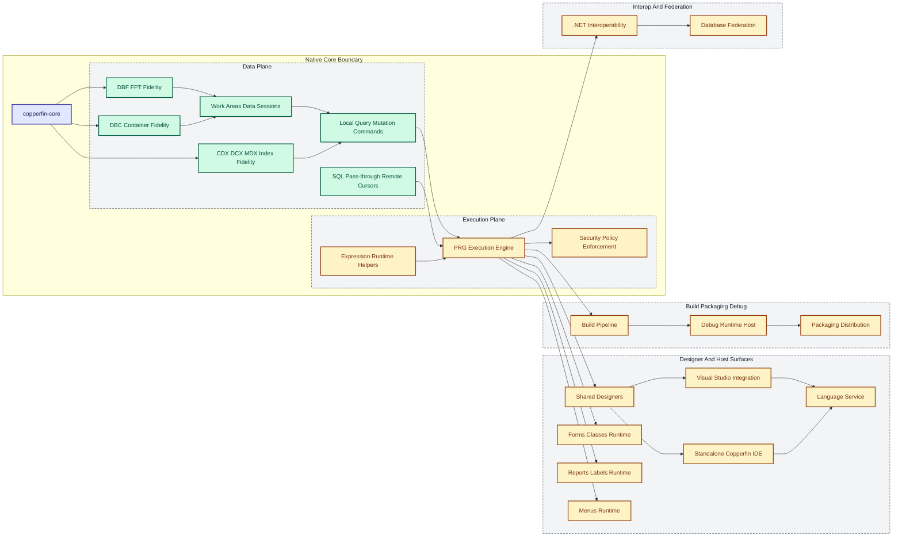

# System Architecture

## Detailed Architecture Status Diagram

Status legend: green = implemented, amber = partial, red = missing.

## Current Status Snapshot

This diagram is intentionally coarse-grained. As of the current repo state:

- `DBF/FPT`, `CDX/DCX/MDX`, `DBC`, work areas/data sessions, local query/mutation commands, and SQL pass-through / remote cursor behavior all have implemented first-pass slices with focused regression coverage.
- The execution plane is still partial because the parser/runtime core is broader than the currently shipped command surface, macro semantics, host behavior, and compatibility edge cases.
- Expression/runtime-surface coverage is now large enough to deserve its own node, but it remains partial because the VFP built-in surface is still expanding in reference-derived batches.
- Database federation is no longer "missing": deterministic translation/planning slices exist, but live backend execution and broader connector behavior remain incomplete.

## Top-Level Product Map

Copperfin should be built as a set of modules with clear seams:

1. `copperfin-core`
2. `copperfin-data`
3. `copperfin-connectors`
4. `copperfin-runtime`
5. `copperfin-designer`
6. `copperfin-reports`
7. `copperfin-migrator`
8. `copperfin-dotnet`
9. `copperfin-gateway`
10. `copperfin-shield`
11. `copperfin-cli`

## Module Breakdown

### 1. `copperfin-core`

Responsibilities:

- shared types
- metadata model
- diagnostics
- configuration
- localization
- extensibility contracts

Suggested outputs:

- reusable SDK libraries
- schema definitions
- diagnostics/event contracts

### 2. `copperfin-data`

Responsibilities:

- DBF table reading and writing
- FPT memo support
- CDX/index support
- DBC metadata support
- transactional safety rules
- file repair and validation tools

Suggested submodules:

- `cf-dbf`
- `cf-fpt`
- `cf-cdx`
- `cf-dbc`
- `cf-repair`

### 3. `copperfin-connectors`

Responsibilities:

- provider abstraction for non-DBF databases
- query translation and parameterization
- schema introspection
- connection and session management
- transaction handling
- adapter SDK for additional providers

Initial targets:

- SQLite
- PostgreSQL
- SQL Server
- Oracle

Suggested submodules:

- `cf-sqlite`
- `cf-postgres`
- `cf-sqlserver`
- `cf-oracle`
- `cf-provider-sdk`

Design rule:

- DBF/DBC support stays first-class, but modern SQL engines should plug into the same higher-level forms, reports, and runtime abstractions where practical.

### 4. `copperfin-runtime`

Responsibilities:

- parser and binder
- command execution engine
- expression evaluator
- macro/eval compatibility layer
- work area/session model
- object/event model
- compatibility switches

Suggested compatibility modes:

- `strict-modern`
- `legacy-safe`
- `legacy-compat`

### 5. `copperfin-designer`

Responsibilities:

- forms designer
- class designer
- project explorer
- builders/wizards
- property grid
- event/method editor
- asset browser
- VFP asset editor and round-trip serializer
- native Studio host for visual designers
- Visual Studio host integration boundary

This is the modern equivalent of the productivity surface exposed by VFP forms, class libraries, builders, gallery, toolbox, and wizards.

Suggested submodules:

- `cf_design_model`
- `cf_design_surface`
- `cf_property_system`
- `cf_builders`
- `cf_vs_bridge`
- `cf_studio_host`

### 6. `copperfin-reports`

Responsibilities:

- report definition model
- report import from legacy assets
- preview pipeline
- print pipeline
- PDF/HTML/image export
- report listeners and output hooks

This should be treated as a first-class subsystem, not a side feature.

### 7. `copperfin-migrator`

Responsibilities:

- inventory existing assets
- inspect projects and dependencies
- import projects/forms/reports
- preserve and normalize editable VFP assets
- suggest compatibility levels
- flag unsafe or unsupported constructs
- generate modernization plans
- generate target-database migration plans

### 8. `copperfin-dotnet`

Responsibilities:

- host and invoke managed .NET components from Copperfin applications
- expose native Copperfin runtime and services to .NET callers
- generate .NET wrappers, assemblies, or executable hosts around Copperfin modules
- provide marshaling for common types, data sets, cursors, and object models
- support 64-bit-first interop patterns

Suggested submodules:

- `cf-clr-host`
- `cf-dotnet-sdk`
- `cf-interop-generator`
- `cf-com-bridge`

Primary goals:

- let modern .NET code be incorporated into FoxPro-style application logic
- let Copperfin-built business logic participate in .NET solutions as reusable components

### 9. `copperfin-gateway`

Responsibilities:

- REST/HTTP surface
- database/API adapters
- background jobs
- event/webhook integration
- identity provider integration

This is where legacy desktop apps gain access to modern ecosystems without rewriting everything at once.

### 10. `copperfin-shield`

Responsibilities:

- authentication integration
- role-based access control
- policy enforcement
- secrets handling
- audit trail
- code signing/package trust
- sandboxing and external process controls

### 11. `copperfin-cli`

Responsibilities:

- build
- run
- package
- test
- inspect
- migrate
- generate

### 12. `copperfin-vsix`

Responsibilities:

- Visual Studio project and file integration
- editor launch and lifecycle for native Copperfin Studio surfaces
- PRG/H code editing integration
- build/run/debug orchestration
- migration and diagnostics commands

Design rule:

- the VS extension should orchestrate designers, not become the only implementation of them

## Recommended Runtime Boundaries

- File fidelity layer should be independent from the language runtime.
- SQL provider logic should be independent from the legacy file engine.
- Report rendering should be independent from the IDE shell.
- Visual designer behavior should be independent from any single IDE host.
- Security policy should wrap runtime capabilities instead of being hardcoded into business logic.
- Importers should produce normalized metadata, not opaque binary passthrough blobs.
- .NET hosting and wrapper generation should sit behind a stable interop boundary rather than leaking managed assumptions into the native core.

## Suggested Tech Direction

Initial recommendation:

- Use a security-first, speed-first architecture.
- Build the trusted and performance-critical core in native C++.
- Allow optional higher-level tools outside the core boundary when they improve delivery speed without compromising runtime performance or security.

Recommended native stack:

- C++20 or newer
- CMake as the primary build system
- SQLite native library integration for the first SQL connector
- PostgreSQL, SQL Server, and Oracle adapters through native client libraries or ODBC where appropriate
- Win32 or a native-friendly UI layer for the first designer shell

Optional language use:

- `Rust` for selected components such as parsers, binary-format validators, crypto-adjacent helpers, or other memory-sensitive subsystems when the benefit is clear
- Rust components should expose stable C ABI boundaries back to the main platform

Secondary tooling options:

- small companion utilities in other languages only when they are clearly outside the trusted product core
- web/API surfaces can be added later behind stable native service boundaries

Practical recommendation:

- `C++` for the engine, runtime, query layer, file layer, report renderer, and core desktop shell
- first-class `.NET` interoperability through a dedicated interop layer
- optional `.NET` edge tooling such as migration dashboards, admin utilities, or service wrappers where useful
- optional `Rust` in selected memory-sensitive subsystems behind stable native interfaces

Why C++ first:

- closer to the performance and deployment character of FoxPro/VFP
- more direct control over file formats, memory, indexes, and runtime semantics
- stronger fit for a single native runtime and designer stack
- easier to keep the core independent from managed runtime version churn

When `.NET` is acceptable:

- CLR hosting and managed component invocation
- generated .NET wrappers and application hosts
- installer helpers
- management consoles
- enterprise integration shells
- optional API hosts

When `.NET` should be avoided:

- DBF/CDX/FPT/DBC engine internals
- parser/evaluator hot paths
- report rendering hot paths
- anything that defines the product's trusted execution boundary

When `Rust` is acceptable:

- binary parsing helpers
- metadata validation
- safety-critical utility libraries
- crypto-adjacent or sandbox-adjacent components where memory safety brings real value

When `Rust` should be avoided:

- if it fragments the central architecture without measurable benefit
- if it complicates .NET interop more than it improves safety or speed

## Compatibility Asset Types

Priority file families:

- `.dbf`
- `.fpt`
- `.cdx`
- `.dbc`
- `.pjx`
- `.pjt`
- `.scx`
- `.sct`
- `.vcx`
- `.vct`
- `.frx`
- `.frt`
- `.mnx`
- `.mnt`
- `.prg`
- `.h`

Priority database targets beyond xBase files:

- SQLite
- PostgreSQL
- SQL Server
- Oracle

## Unified Data Strategy

Copperfin should expose a single high-level data model to forms, reports, and runtime code, backed by provider-specific implementations.

Core ideas:

- logical tables and views independent from physical storage
- provider capabilities registry
- SQL dialect translation layer
- schema mapping between DBF/DBC concepts and SQL schemas
- migration manifests that record type conversions and unsupported semantics

Example deployment patterns:

- legacy app runs directly on DBF files
- legacy app keeps DBF storage locally and syncs to PostgreSQL
- modernized app uses Copperfin runtime against SQL Server
- reporting layer pulls from Oracle while forms use migrated metadata
- legacy FoxPro-style app calls modern .NET services through Copperfin interop
- Copperfin business module is packaged as a .NET-consumable component used inside another .NET application
- Copperfin opens and edits legacy VFP forms, class libraries, menus, and reports with round-trip-safe serialization
- Copperfin runs imported VFP projects in a compatibility host while teams gradually modernize them

## Native-First Implementation Notes

Suggested internal partitions:

- `cf_core`: common types, diagnostics, config, plugin contracts
- `cf_data`: DBF/FPT/CDX/DBC engine
- `cf_sql`: provider abstraction and SQL connectors
- `cf_runtime`: parser, binder, evaluator, execution engine
- `cf_reports`: report parsing, preview, rendering, export
- `cf_design`: forms/classes/projects/wizards metadata and editors
- `cf_dotnet`: CLR hosting, wrapper generation, managed bridge
- `cf_vfp_assets`: VFP binary metadata parsing, normalization, round-trip writing
- `cf_cli`: inspection, migration, packaging, and test tools

Optional outer modules:

- `cf_admin_dotnet`: admin and diagnostics console
- `cf_gateway_dotnet`: optional enterprise/API host if needed later
- `cf_rust_support`: optional Rust libraries for narrowly-scoped safety/performance wins

These should talk to the native core through stable process or library boundaries and should not become the product center of gravity.

Recommended output shape:

- shared native libraries for subsystem reuse
- native desktop executable for Studio
- Visual Studio extension package that launches or hosts native Copperfin designer surfaces
- native command-line tools for inspection and migration
- .NET SDK/package output for Copperfin interop consumers
- generated .NET host executables or libraries for Copperfin-built modules where appropriate
- optional service host later if Gateway becomes a shipped server component
- editable project workspaces that preserve links back to original VFP assets

Recommended host stance:

- first ship an external native Studio host with Visual Studio integration
- consider embedded designer hosting later after the native designers are stable

## Answering The Historical Pressure Points

The platform should directly answer the objections that likely made long-term VFP support harder:

- `64-bit`: Copperfin should be 64-bit-first.
- `.NET ecosystem fit`: Copperfin should interoperate with managed code through a dedicated bridge.
- `extensibility`: plugin and wrapper generation should be built in.
- `deployment`: outputs should include native apps and .NET-consumable artifacts.
- `modern integration`: SQL connectors, identity, API hosting, and packaging should be first-class.

## Reference-Informed Product Lessons

Derived from the inspected VFP and community-maintained ecosystem materials:

- foundation classes matter
- reporting is a major subsystem
- wizards/templates drive adoption
- sample apps teach architecture
- help/documentation must be maintained as code evolves
- project explorer, data explorer, toolbox/task panes, and automated testing deserve first-class product modules
- modern credibility also depends on native security, auditable interop, and a strong `.NET` compatibility story
