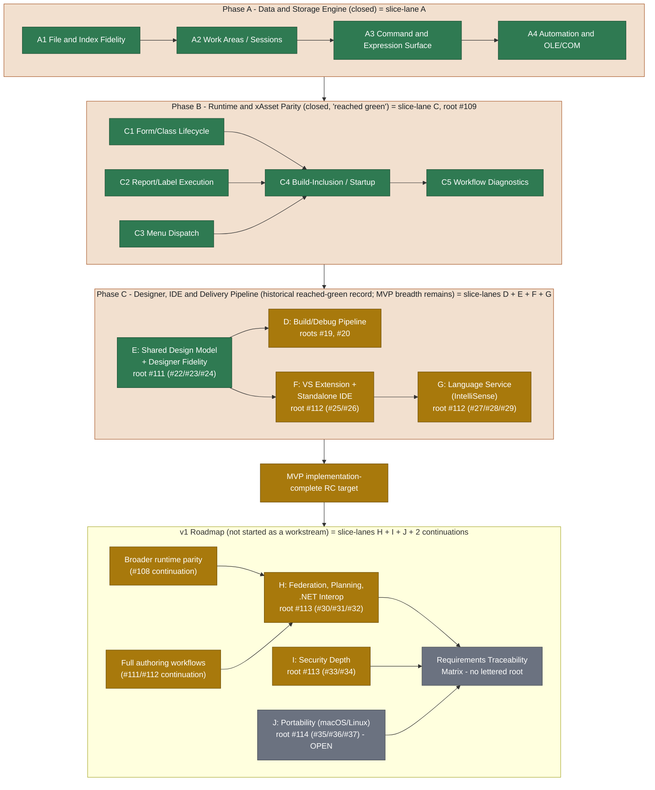

# Roadmap

The Copperfin roadmap is organized as a completion tree rather than a fixed
issue sequence. The top-level product objective is an implementation-complete,
Windows-first MVP release candidate. The v1 roadmap begins after the complete
MVP tree has passed its implementation acceptance criteria.

This document is durable roadmap guidance. It intentionally does not list
individual issue numbers or claim percentage completion. Live issue state,
focused tests, and release artifacts provide the detailed evidence for each
workstream. Where this file cites a specific issue or lane letter below, it is
citing closed historical record, not an active queue — see
[Lettered Lane History](#lettered-lane-history).

## Completion Model

Each workstream has a subgoal tree with observable acceptance criteria:

1. Choose the highest-value unfinished subgoal using current evidence,
   compatibility risk, blockers, and user-visible impact.
2. Implement one small, independently verifiable slice.
3. Run focused regression tests and the relevant broader validation.
4. Record durable constraints and evidence in the appropriate progress or
   handoff document.
5. Mark the subgoal complete only when its implementation and required tests
   pass.

Completed workstreams are not revisited unless a regression, new compatibility
evidence, or release-validation failure creates a new acceptance gap.

Two bounded portable-core seams are now implemented. At exact product/test head
`d08c1aa61`, the POSIX Studio command runner reports a missing or unlaunchable
executable as `-1`, matching the unchanged Windows pre-start-failure contract,
while preserving a real child exit status of 127. At exact product/test head
`e36285163`, POSIX external-process allowed-root containment uses canonical
prefix construction and filesystem identity instead of raw UTF-8 string
prefixes, so existing case-equivalent roots follow the containing volume's case
semantics while empty, unavailable, shorter, and sibling roots fail closed.
Linux Native `31348227285` and macOS Native `31348227298` pass `331/331` at the
second seam, including its focused security regression; macOS also passes the
four-locale SET POINT matrix at `8/8`, and Windows Native `31348227289` passes
`330/330`. The focused security regression passes everywhere and Windows
behavior is unchanged. These close focused launch-error and root-identity
seams, not the broader macOS or Linux standalone-host ports.

Current .NET interop security work now has a fail-closed policy-context
candidate: trusted host state must bind actor, verified policy, audit readiness,
and exact capability scope before a managed route can be allowed. Reflection,
assembly loading, external I/O, and secret access are independently scoped, and
the gateway emits stable machine diagnostics plus a canonical audit record.
The accompanying threat model keeps FP/VFP source in control through a future
supervised-job facade; foreign threads cannot directly mutate runtime state.
Focused GCC policy/runtime/locale checks and Clang ASan/UBSan pass. Exact
implementation head `5c6ccfa79` passes Linux and macOS at `325/325`, Windows at
`324/324`, the policy regression on every platform, the macOS four-locale
matrix at `8/8`, and all eight protected checks. Managed parity-call execution
and the PRG job facade remain separate.

The next .NET security criterion now has a candidate durable-audit boundary:
an audited policy allow remains `pending_audit` until a trusted, non-owning function-pointer
sink callback commits the structured event and returns a non-empty receipt.
Absent, failing, empty-receipt, and throwing sinks fail closed. A focused
adapter regression uses the contained hash-chained audit stream; managed
execution and runtime-host/PRG wiring remain separate. Exact implementation
head `af99a3af5` passes Linux and macOS at `326/326`, Windows at `325/325`, the
macOS four-locale SET POINT matrix at `8/8`, and all eight protected checks;
both focused policy/audit targets pass on every native platform.

Current standalone Open evidence includes #4890 at product/test head
`9e4b5a286`: localized File > Open exposes Ctrl+O through the existing picker
without changing filters, path admission, tab identity, or Close Ctrl+F4. The
focused eight-assertion UI smoke and exact-head Linux managed-UI run
`30538156592` plus VSIX run `30538156618` pass; artifacts `8757552969` and
`8757588016` retain their GitHub SHA-256 digests. Native Windows validation also
passes all eight assertions under default, pt_BR.UTF-8, and de_DE.UTF-8 locale
modes. Child #4890 is closed; broader #26/#112, platform-native menu semantics,
and RC validation remain separate.

Current standalone Undo evidence includes #4889 at product head `631e6b61a`
and final combined test head `34d59811d`: localized Edit/Undo chrome delegates
to the active shared editor's existing text and host-backed undo contracts.
Ctrl+Z is document-focus scoped and cannot steal a competing Command/Terminal
input undo stack; menu invocation remains active-document scoped. The focused
12-assertion and full standalone UI sequences pass, as do exact final-head Linux
managed-UI run `30537389819` and VSIX run `30537389825`. Artifacts `8757244424`
and `8757267024` retain their GitHub SHA-256 digests. Native Windows passes all
13 assertions in three locale modes, including the reversible Win32 undo state.
The child is closed; broader #26/#112 and RC validation remain separate.

Current class-property navigation evidence includes #4887 at product/test head
`9f8f425cf`: Project Insights retains qualified definitions and dotted
references, rename preview normalizes only unique property names, and ambiguous,
call-shaped, quoted, bracket-string, or comment lookalikes stay excluded.
Executable array-subscript references remain visible, while bounded VFP
`TEXT ... ENDTEXT` bodies—including conservative unterminated bodies through
EOF—cannot seed references or rename occurrences. The warning-free four-mode
matrix, independent review, and exact combined-head Windows VSIX run
`30534924760` pass; artifact `8756289486` was uploaded. The child is reclosed;
broader IDE parents and RC validation remain separate.

Current standalone project-command evidence includes #4888 at exact product/
test head `192ef78bd`: localized Build, Run Without Debugging, and Start
Debugging menu commands use Ctrl+Shift+B, Ctrl+F5, and F5 and route only through
the active PJX editor's existing workflow. Focused portable UI, Release Studio,
default/qps-ploc language, exact-head VSIX `30534152607`, and Linux managed-UI
`30534152549` validation pass. Artifacts `8755969821` and `8755970713` retain
their GitHub SHA-256 digests. Cross-platform installer run `30534152560` also
passes, including Windows standalone build/install-tree checks and artifact
`8756272479`. The child is closed; native Windows UI evidence, broader #26/#112,
and RC validation remain separate.

Current class-property IntelliSense evidence includes #4886 at product/test
head `bad499421`: class-scope identifier assignments become qualified,
localized property completions and unique dotted definition targets, while
method-local assignments, ambiguous trailing names, existing methods, and
generic members retain safe behavior. The local four-mode matrix and exact-head
Windows VSIX run `30532752948` pass; artifact `8755431111` was uploaded. The
child is closed, while broader IDE parents and RC validation remain separate.

Current cursor-member evidence includes #4885 at corrective product/test head
`7955966d8`: bounded single-line `CREATE CURSOR alias (...)` declarations feed
alias-scoped field completions without splitting nested type clauses such as
`N(12, 2)`. Localized descriptions are added without changing invariant field
names/kinds or existing generic/class members. Trailing `&&` comment punctuation
cannot seed phantom fields. The local four-mode matrix and synchronized Windows
VSIX run `30532334557` pass; artifact `8755271046` was uploaded. The child is
closed, while broader G1 and RC validation remain separate.

Current signature-highlighting evidence includes #4884 at final product/test
head `05bd74dc8`: Visual Studio parameter loci advance through real top-level
declaration starts, preserving distinct highlights for prefix-related names and
for later names mentioned inside earlier default expressions. Nested calls,
quotes, bracket-expression commas, and built-in optional brackets remain
intact. Top-level default-assignment context distinguishes true bracket/brace
defaults, including `[, tcTail]`, from optional `[, parameter]` notation at a
declaration boundary. The local four-mode matrix and exact-head Windows VSIX
run `30531427326` pass; artifact `8754891262` was uploaded. The child is closed,
while broader G1 and RC validation remain separate.

Current class-method discovery evidence includes #4883 at final corrective
product/test head `1bdef1af2`: both managed project scanners now recognize
class-only `PROTECTED` and `HIDDEN` procedure/function declarations, including
`PROC`. Qualified definitions, signatures, references, and rename inputs are
preserved without admitting global lookalikes. Every case-insensitive keyword
regex is culture-invariant, with lowercase `tr-TR` coverage initialized before
either scanner. The local four-mode matrix and exact-head Windows VSIX run
`30529676324` pass; artifact `8754203908` was uploaded. The child is closed,
while broader G1 and RC validation remain separate.

Current VFP declaration-alias evidence includes #4882 at corrected combined
product/test head `b3285feab`: both managed project scanners treat `PROC` and
`PROCEDURE` alike for definitions, signatures, references, and rename inputs
while rejecting the longer `PROCEDURES` near-match. The local four-mode matrix
and exact-head Windows VSIX run `30528541049` pass; artifact `8753733157` was
uploaded. The child is closed, while broader G1 and RC validation remain
separate.

Current runtime/editor-alignment evidence includes #4881 at exact product/test
head `0867efd1a`: project procedures, functions, and qualified class methods
now expose the inline parameter form already supported by the stack-frugal PRG
runtime. Matching-parenthesis extraction preserves nested and quoted defaults;
declarations without inline clauses retain following-line parameter discovery.
The local four-mode matrix and exact-head Windows VSIX run `30527386804` pass;
artifact `8753293045` was uploaded. The child is closed, while broader G1 and
RC validation remain separate.

Current G1 signature-help evidence includes #4880 at exact product/test head
`95dff1c75`: project `PARAMETERS`/`LPARAMETERS` discovery now separates only
top-level commas, preserving nested call, bracket/brace, quoted-comma, and
doubled-quote default expressions instead of surfacing phantom parameters.
The four-mode local managed matrix and exact-head Windows VSIX run
`30526816023` pass; the run uploads artifact `8753063334`. The child is closed,
while broader #27/#112 and the full RC matrix remain separate.

Fresh release-validation failures remain valid implementation input when they
identify a nondeterministic gate. #4878 at exact test head `5d6dd4d13` replaces
two nested-PowerShell held-output fixtures with owned managed child modes while
leaving production process execution unchanged. Local four-locale and repeated
stress evidence, macOS seq1289, and exact-head Windows VSIX run `30525728514`
pass; the run uploads artifact `8752672531`. The child is closed, while the full
RC matrix remains separate.

Current IDE build-cleanliness evidence includes #4879 at exact product/test
head `c990506f0`: editor-pane lookup now uses a shared nullable-safe path
normalization seam with focused null/blank/invalid/relative/absolute coverage.
Exact-head Windows VSIX run `30526202072` is warning-clean, passes all managed
and net472 steps, and uploads artifact `8752823159`. Issue #4879 is closed;
broader IDE and RC validation remain separate.

The shared designer-interaction and report/label implementation trees are
complete at the current MVP fidelity. Their remaining hosted Windows,
Visual Studio, and mounted-VFP9 checks are release evidence gates, not reasons
to reopen completed implementation slices.

## MVP Workstreams

### Report And Label Fidelity

Complete section-aware FRX/LBX editing in the shared designer model:

- root settings, bands, grouping, sorting, and placed objects
- geometry, sizing, positioning, expressions, fonts, and preview metadata
- safe no-op, supported-property, delete/restore, and unsupported-data
  round trips
- identical behavior in standalone Studio and the Visual Studio host, with
  shell-specific chrome kept outside the shared model
- stable host JSON with invariant machine fields and optional display fields

The implementation is complete for the current MVP fidelity. Hosted Windows
validation with real VFP9 samples remains part of the acceptance evidence.

### Localization

Route user-facing native, managed, VSIX, Studio, runtime, diagnostic, and
packaging text through the catalog system. Preserve invariant parser tokens,
diagnostic identities, JSON fields, schema keys, enum values, and runtime
identifiers. Maintain key parity, fallback behavior, pseudo-localization,
placeholder preservation, and Unicode round trips for the supported catalogs.

All new user-facing work is localized by default. Additional translations are
separate content work after the catalog and layout contracts are stable.

### IDE And Designer Workflows

Complete the Windows-first open/edit/build/run/debug path for PJX, PRG, SCX,
VCX, FRX, LBX, and MNX startup assets. The shared designer model must support
the same behavior in standalone Studio and the VSIX. Stabilize the MVP utility
surfaces needed for repeated work: debugger, task list, references, data
explorer, object browser, toolbox/builders, coverage, database, and
security/extensibility summaries.

The shared E2 interaction and builder implementation is complete; remaining
IDE work is the separately owned shell, hosted Visual Studio, and standalone
product-grade surface work described by the live MVP tree.
The shared project workspace also provides grouped, read-only Project Explorer
navigation; project mutation, drag/drop authoring, and full VFP9 Project
Manager parity remain separate implementation work.
The managed WinForms smoke harness now closes its own owner trees before
completion, so a failed or interrupted utility-pane test does not leave a
Copperfin command or terminal window open; hosted Visual Studio and native
window-manager behavior remain separate evidence.

### Runtime And Language Compatibility

Expand VFP9-compatible command, function, object, property, method, and event
behavior using real VFP9 behavior or shipped documentation. Keep PRG execution
stack-frugal and preserve the iterative frame-machine constraints. Track
deliberate fallbacks and unsupported behavior in the runtime stub inventory;
never treat a no-op as completed compatibility.

### Build, Package, And Debug Contracts

Formalize and preserve versioned `app.cfmanifest` and `app.cfdebug` contracts,
staged executable sidecars, source/debug path provenance, and deterministic
package content. Complete the MVP xAsset lifecycle needed for forms/classes,
menus, reports/labels, event-loop behavior, runtime faults, and debugger
recovery.

### Security And Platform Seams

Keep package trust, external-process policy, file-handle binding, secrets,
extension trust, audit, and AI/MCP boundaries explicit and fail-closed where
required. Preserve portable native seams while giving Windows-first behavior
the evidence needed for the MVP release candidate. macOS and Linux standalone
host parity follows the MVP boundary where practical and is expanded in v1.

The current repository and release line are licensed under GNU GPL-3.0-only
with the Copperfin Application, Runtime, and Toolchain Exception 1.0. The
copyleft boundary covers Copperfin and modifications derived from Copperfin
source code. The GPLv3 section 7 exception keeps independent applications and
ordinary toolchain output under their owners' chosen terms across inspection,
editing, execution, interpretation, analysis, transformation, modernization,
generation, compilation, assembly, static or dynamic linking, packaging,
testing, debugging, deployment, hosting, maintenance, and support. It also
covers in-process and separate-process interfaces, runtime redistribution, and
ordinary generated launchers, scaffolds, headers, manifests, debug material,
and packages. Distributors still owe GPL compliance and Corresponding Source
for Copperfin and modifications derived from Copperfin source itself.
Contributors retain copyright and apply the same GPL-3.0-only-with-exception
terms to accepted contributions through `CONTRIBUTING.md`; no copyright
assignment is required. Git authorship/co-authorship and repository history
provide durable credit. The community-health contract under #4903 keeps the
contribution, conduct, support, governance, ownership, issue-intake, and
pull-request surfaces present and mutually consistent.
The #4904 release-compliance slice makes that retained ownership operational:
an official proprietary or otherwise GPL-incompatible release may use an
accepted contributor's copyrightable work only after a separate written
consent agreement states compensation for that use. Otherwise, the work must
remain under its existing terms or be removed or independently rewritten.
Broader revenue sharing is intentionally not implied; #4905 tracks a future
owner policy decision on covered revenue, contribution weighting, accounting,
payment, taxes, audits, and disputes before any formula is adopted.
Because this is a project-specific legal exception, qualified legal review of
the operative text remains required before the first public release candidate;
the implementation and regression evidence under #4902 is not legal advice.
The earlier commercial/source-available proposal is retained only in
`docs/archive/commercial-licensing-2026/` for possible future reconsideration.
Normal builds keep `COPPERFIN_ENABLE_PRODUCT_LICENSING=OFF`; product-license
files and activation configuration cannot influence runtime, build, Studio, or
package metadata while that policy is off; license-status commands and Studio
license presentation are also suppressed. Artifact and launcher signing remain
active and independent because they authenticate provenance and integrity
rather than licensing or entitlement. Any future product-license restoration
requires an explicit policy decision, legal/documentation review, and current
cross-platform regression evidence.

Live GitHub content is also an AI/tooling trust boundary. Agent execution work
must come from a direct contemporaneous owner instruction outside GitHub
content or from an open, repository-owner-authored workstream carrying the
human-controlled `agent-approved` label. Retrieve and validate author, state,
and labels before placing GitHub issue content into an agent context. One
approved workstream authorizes bounded locally derived slices without a new
issue or repeated child label. External reports remain untrusted intake and
require human sanitization plus one of those authorization paths; missing or
changing trust metadata fails closed.

### RC And Release Evidence

Implementation completion of every MVP workstream is RC readiness. Release
evidence follows that gate and includes:

- native CMake/CTest and platform validation
- Windows VSIX, standalone Studio, designer, runtime, package, and debugger
  smoke tests
- real VFP9 sample validation
- installer and VSIX artifacts
- safety traceability validation and archived evidence
- known limitations and compatibility exceptions

The RC assembly manifest first gained a schema-v2 evidence-level contract and
now advances to schema v3 for platform-specific installer lifecycle results.
It uses `PASS`, `FAIL`, `NOT_RUN`, `BLOCKED_EXTERNAL`,
`UNSUPPORTED_AND_DISCLOSED`, and `NOT_APPLICABLE`. It records installer and
VSIX artifact construction/static checks separately from lifecycle execution,
and separately reports platform signing, linguistic review, and real installed
VFP9 evidence. The Windows producer executes NSIS fresh install, installed-tree
and localized-command smoke, same-version maintenance reinstall, silent
uninstall, and filesystem/registration residue checks. Exact-head hosted run
`31698722081` passed that Windows lifecycle at `c33458808`; independently
downloaded evidence matches installer SHA-256
`832cc4cb5b3c5f2df8d260103545e58c6847d3f729718c687a446ac76b48afbe`.
Independent review subsequently found that the old verifier suppressed
registry-read errors and could miss the exact CPack key after its values were
cleared. The corrected verifier terminates on read failure and admits the
generated exact key independently of values; corrected exact-head Windows
run `31702317708` passed, and independently downloaded evidence matches the
retained NSIS SHA-256 `f77217c135ee223746f876b672b1a98366b1ba44ff38a94184e58f9fa408dcc6`.
Prior-version Windows upgrade, macOS productbuild, and Linux DEB/RPM remain
`NOT_RUN`. The Windows VSIX producer now directly installs the exact package
into an ephemeral-runner Visual Studio instance, verifies identity/version,
package load, a runner-owned PRG and registered command outside the checkout,
then uninstalls and checks extension residue. Same-version VSIX reinstall,
previous-version VSIX upgrade, and disablement remain `NOT_RUN` pending direct
evidence. Exact-head VS2022 run `31711406714` completed the lifecycle at
`f26086a09`, but independent review found its PRG and package-load admission
signals were insufficient: a visible IDE did not prove the document opened and
an activity-log substring could represent registration or failure. A corrected
retry reached the stronger observation boundary but generic DTE discovery did
not identify the launched instance; a subsequent process-specific retry proved
that this hosted IDE published no matching DTE moniker. Exact-process Windows
UI Automation then failed to find an exact-named document descendant, but that
verifier did not inspect the process root's possible active-document title. A
corrected run did inspect it and proved the title remained `Microsoft Visual
Studio`: initial PRG input did not open the fixture and the command was never
invoked. Run `31718662961` requested `/Command` from a second `devenv` process;
the original controlled IDE exposed no Copperfin Command surface and logged no
`CopperfinPackage` load. Run `31719897147` proved the same negative result when
the controlled IDE itself started with `/Command`. The next verifier invokes
the exact registered Copperfin Command item through the controlled process's
user-visible Tools menu. Run `31721057446` found no invocable item through
direct menu-tree expansion, but did not distinguish an inaccessible Tools menu
from an absent extension item. Run `31722176750` then focused the exact IDE and
opened Tools through its normal access key, but the hosted window exposed zero
same-process UI Automation `MenuItem` elements. The corrected verifier focuses
the exact IDE. Run `31723497158` proved `Ctrl+Alt+A` started the Common IDE
package, but input raced ahead of Command-window readiness and was lost. The
next run proved the hosted Command Window is not a UI Automation descendant.
Run `31725371043` then proved its ActivityLog load record is buffered until IDE
shutdown and cannot be a live readiness signal. The corrected verifier opens it
through the hosted General profile's shortcut, gives the lazy WPF surface a
conservative bounded startup interval. Run `31726161585` proved the first
shortcut remained queued long enough that a three-second delay still raced the
Common IDE package load. Run `31727207629` proved that two shortcuts and a
ten-second delay inside the same helper were likewise serviced only after that
external sender exited. Run `31728514403` proved that separate helper senders
inside the lifecycle process still queued the shortcut until final command
input, so no Copperfin pane appeared. The corrected verifier launches the
controlled IDE with `/Command View.CommandWindow`. Run `31729613650` proved
that startup command was deferred until the first invariant input sender
exited; the Common IDE package then loaded, but the input was lost. The next
run `31730718257` reached the second attempt but the verifier rejected a
foreground HWND different from the original main HWND without determining
whether it was a same-process Visual Studio tool window. The corrected verifier
resolves that window's Win32 process owner and requires the exact controlled IDE
PID. Run `31732427063` passed the widened installer boundary in about 234
seconds, but correctly rejected the second synthetic input because another
process owned the foreground window. The current verifier instead invokes
`devenv /Command Copperfin.ShowCommandWindow`, proves the pane in the already
controlled IDE PID, opens the exact runner-owned PRG through `/Edit`,
then requires exact fixture-title proof, explicit successful-load XML, and
matching-error rejection
in fresh exact-head execution.
Run `31731652063` did not reach that correction because VSIX installation
exceeded the 240-second bound after prior hosted installs approached 238
seconds. The default is widened, still bounded, to 300 seconds and retains
timed-out process-tree termination.
Run `31733561020` proved the generic DTE active object was unavailable. The
current verifier follows Microsoft's documented Running Object Table lookup,
selects only the version- and process-specific
`VisualStudio.DTE.<version>:<PID>` suffix, and still verifies the DTE
main-window owner independently before use. Run `31734701283` proved that exact
moniker was also absent. The current verifier therefore uses Visual Studio's
documented `devenv /Command` and `/Edit` interfaces and admits only independent
same-process pane and document proof.
Run `31736024834` proved synchronous `/Command` routing can remain attached for
the full process bound. The corrected verifier starts `/Command` and `/Edit` as
separate routing processes, proves each differs from the controlled IDE,
observes the pane/document in the controlled IDE PID, and bounds any remaining
router process tree after independent proof.
Run `31737231439` did not reach that proof because hosted VSIX installation
exceeded 300 seconds. The corrected 360-second default remains within the
validated 30–600 range and retains process-tree termination.
Run `31738142144` reached the IDE but did not observe the Copperfin command;
the retained ActivityLog shows registration paths but no Copperfin package load
or package error. The verifier now establishes semantic command readiness by
routing `View.CommandWindow` separately and proving the built-in Command Window
inside the controlled IDE PID before routing the Copperfin command. This
remains a gap pending fresh exact-head lifecycle evidence and review.
Run `31739502436` proved a second `devenv` process did not route even that
built-in command into the controlled IDE. The verifier now removes the
cross-process dependency: the single controlled IDE receives the exact fixture
and Copperfin command as startup inputs, then independently requires both UI
surfaces and package-load evidence from that same process.
Run `31740807424` exposed that this evidence launch was also the first launch
regenerating the per-user PkgDef cache, so the command was evaluated while its
registration was being imported. The verifier now performs and normally closes
a bounded registration-prime launch, requires its ActivityLog to identify the
exact installed Copperfin PkgDef path, and uses a later process for all command,
document, and package-load evidence. The requirement remains a gap pending that
fresh exact-head result and review.
Run `31742224692` reached an input-idle prime IDE but its normal close exceeded
the initial 30-second allowance. Run `31742937078` retained direct exact-path
PkgDef-import proof but the prime IDE remained alive after a 120-second close
allowance. The corrected harness requests a normal close, then bounds cleanup
with process-tree termination before launching the evidence IDE. Failure staging
retains the registration ActivityLog as well as the evidence ActivityLog. The
runs did not reach product evidence and do not change the gap.
Run `31743866527` independently hit the existing 360-second installer bound;
unchanged-head rerun `31744711631` then completed install and registration but
proved that startup `/Command` still did not activate `CopperfinPackage` or its
pane. The corrected evidence path uses process-scoped UI Automation to expand
the installed Tools menu and invoke the exact `Copperfin Command` item, then
separately requires the pane, PRG document, and package-load record. The
requirement remains a gap pending fresh exact-head evidence and review.
Run `31745965381` did not observe the pane and retained no Copperfin load or
error record, but its original failure output did not distinguish menu
discovery from invocation. The current correction retains machine-readable,
process-bound UI Automation state for the Tools menu, exact command item,
invocation pattern, invocation completion, pane, and PRG observations before
any further behavior correction.
Run `31747101809` proved the missing boundary: the hosted Visual Studio main
window does not expose its top-level Tools menu as a UI Automation `MenuItem`.
Run `31748419105` then proved the exact IDE could be foregrounded and receive
the standard English Tools accelerator while still exposing no exact command
item. The corrected harness now sends Visual Studio's English Command Window
shortcut only after exact-PID foreground proof, verifies the foreground PID
again before input, and submits only the invariant canonical
`Copperfin.ShowCommandWindow` command. The same-process pane and explicit
successful package-load record remain independent admission conditions.
Runs `31749596542` and `31750359174` did not reach that command correction:
both stopped at exactly the existing 360-second installer bound. Installation
and uninstallation now have a separate bounded 600-second allowance, retain a
versioned operation diagnostic, and re-inventory the selected instance during
failure cleanup so an installed extension cannot escape exact-identity
uninstall merely because installer return timed out. The requirement remains a
gap pending direct exact-head lifecycle evidence.
Run `31751652834` passed install, PkgDef priming, and uninstall, and proved all
foreground/input boundaries, but no pane appeared while the input-sender
process remained alive. The correction now exits that bounded sender after
retaining its submission diagnostic, then observes the pane from a separate
bounded process in the same IDE PID. Input remains non-admissible without the
independent pane and package-load proof.
Run `31753021409` showed that separating only final pane observation was not
enough: the Common IDE package still loaded after the combined shortcut/command
sender exited, so the command had already arrived before its surface existed.
The harness now separates Command Window request, bounded lazy initialization,
canonical command submission, and pane observation, retaining each input
boundary independently.
Run `31754211038` timestamped the remaining dispatch seam: the Common IDE
package began about 0.19 seconds after the later command sender exited, not
during the prior ten-second delay. The harness now inserts a separate
exact-PID foreground-only helper to release the queued shortcut, exits that
helper, allows bounded settlement, and only then starts canonical submission.
That helper sends no product command and cannot admit lifecycle evidence.
Run `31755148469` proved a foreground-only helper did not release queued input;
the Common IDE package again began only after the later input sender exited.
The dispatch stage now repeats only Visual Studio's built-in Command Window
shortcut in an isolated sender, exits, then allows bounded settlement before
the distinct Copperfin canonical-command sender starts.
Run `31756018725` proved that second shortcut remained queued until the
canonical sender exited: the Common IDE package began about 0.25 seconds later.
The harness now uses one final isolated built-in Command Window request after
canonical submission to release that preceding queued command, then
independently observes the pane, PRG, and package-load evidence.
Run `31757029866` showed the final dispatch itself began while Common IDE was
still starting, 0.151 seconds after canonical-sender exit. A bounded
post-canonical settlement now precedes final dispatch. Primary evidence and
cleanup failures are also preserved together rather than allowing cleanup to
mask the governing failure.
Run `31758122162` then proved `SendKeys.SendWait` itself blocked for about 204
seconds even though Common IDE had been ready for more than eight seconds. The
hosted harness now uses exact-foreground-PID-bound Win32 `SendInput`, verifies
every injected event count, and retains the counts separately from product
surface, package-load, PRG, uninstall, and residue admission.
Run `31759758376` proved every direct-input event was inserted and cleanup was
clean, but also proved the harness incorrectly typed the Command Window's
displayed `>` prompt before the canonical command. The correction injects only
`Copperfin.ShowCommandWindow` plus Enter and adds a regression rejection of the
prompt-prefixed form; exact-head hosted evidence remains pending.
Run `31761029410` confirmed the corrected 56 prompt-free events were inserted,
but the external sender still remained attached for about 204 seconds and no
product load followed. Later runs proved a separately installed test package
could not be admitted through ambient autoload or a newly merged canonical
command without privileged `/Setup`. The hosted gate now launches the evidence
IDE in COM-automation `/Embedding` mode while retaining `/Log`, then binds to
the exact process through its public DTE automation object, opens and
verifies the runner-owned empty solution, opens the exact PRG through the
installed editor association, and raises the exact Copperfin command GUID/ID.
It remains fail-closed on retained dispatch, pane, PRG, package-load, uninstall,
and product-residue evidence; no test extension is built or installed.
Exact-head run `31766849974` passed that complete lifecycle at `5a403ff0d` and
uploaded independently inspected diagnostics, the exact VSIX, and Corresponding
Source. The VSIX SHA-256 is
`10fed042d44ae0213d25b21de500f8efa82e4fa3555abe3f1af9137424e4eab0`.
Fresh install/use/uninstall/residue evidence is complete; same-version reinstall,
prior-version upgrade, disablement, signing, and human visual review remain
separate.
The producer validates its output against the exact bundled Draft
2020-12 schema without relying on optional URI-format assertions, and the
mapped producer/schema/workflow/guide/contract artifacts carry reverse
requirement, verification, and hazard identifiers. Existing immutable RC1/RC2
manifests predate this correction; their
ambiguous `installers: passed` and `visual_studio_vsix: passed` values prove
only their producer jobs completed, not lifecycle validation. A later
sequential RC must carry schema v3 and current lifecycle evidence before those
claims can advance.

The MVP implementation subgoals are complete at final product/test heads
`8d6c307d4`, `64e162fd4`, and `82b907cd5`. Exact synchronized test-head
validation at `20ef3b3cb` is green: Native Release Readiness `30550948703`
passes Linux `316/316`, Windows `315/315`, and macOS `316/316`; Windows Deep
`30550946359` passes native CTest, VSIX/resources, managed suites, net472,
standalone Studio, all DesignerSmoke assertions, and PRG debugger smoke.
Individual native, VSIX `30550923339`, Linux managed-UI `30550923344`,
installer `30550923408`, and security/SBOM `30550923513` workflows also pass.
The final release-validation regressions #4891, #4892, and #4893 are closed.

This is implementation-complete RC readiness, not authority to publish an
official release. Private RC evaluation may proceed through the fail-closed
GitHub Actions artifact workflow without a GitHub Release, protected signing,
or a claim that the external release authorities are satisfied. Immutable
`v0.1.0-rc.1` run `31236596422` passed every platform and package prerequisite
but published no final bundle because the scanner detected its own literal
private-key sentinel in the exact source archive. No secret was present. The
tag remains immutable, the scanner regression is corrected for sequential
`v0.1.0-rc.N` candidates, and immutable `v0.1.0-rc.2` now peels to
`fd6bd94f85f198d09d8829a4ff24a20c855650ab`. Exact-tag assembly run
`31244558839` succeeded and uploaded the private
`copperfin-v0.1.0-rc.2-evaluation-bundle` artifact with GitHub-reported
SHA-256 `501ba26642af4fb58c69e3c69ca0f29b7eb5e242a4980ea31770e83bd84605df`;
no GitHub Release exists. This is private-evaluation availability, not human
acceptance or authority for an official release. The complete official-release
evidence gate remains open until #4403 receives genuine arm's-length safety
sign-off, closes, and passes strict validation. #4409's protected Windows
launcher-trust gate has passed with the approved signer/registry pair in run
`31630819119` at exact commit
`111fb67d09df1413221beeebce9b684f47097053`. Permissive primary-hazard safety
run `30555972170` is green but cannot substitute for #4403's strict closure.
The hosted Deep runner also lacked VFP9;
accepted installed-VFP9, mounted-sample, RuntimePackage/xAsset/Report/Menu, and
live Visual Studio evidence remains the closed #4621 baseline because the final
changes were catalog/managed/test-only. Protected `v1-development` begins at
the peeled RC2 commit under no-bypass ruleset `20582609`, while immutable RC
stabilization remains separate. Human RC2 evaluation remains pending. Neither
lane may reinterpret this parallel work as closure of #4403 or as authority
for an official 1.0 release.

The v1 lane also carries optional bounded DBF-header robustness coverage:
6,757 deterministic synthetic cases plus an ASan/UBSan variant when supported.
It is enabled only by `COPPERFIN_BUILD_ROBUSTNESS_TESTS=ON`, changes no product
behavior, and is neither an RC nor v1 completion gate. Any reproducible defect
found by this lane must be triaged separately according to demonstrated risk.

The v1 polyglot lane now has a portable bounded-process prerequisite for its
first artifact adapter. Direct argv invocation avoids a shell; the complete
child environment is explicit and empty by default; relative paths and
embedded-NUL inputs are rejected. Timeout, cancellation, callback failure, and
normal root completion all close the owned descendant tree through Windows Job
Objects or POSIX process groups. Focused GCC, Clang, native-isolation, and
ASan/UBSan evidence passes locally. At exact implementation/test head
`36f25b1e5`, Linux Native run `31284210937` passes `324/324`, macOS Native run
`31284210940` passes `324/324` plus the existing four-locale matrix, and
Windows Native run `31284210974` passes `323/323`; all three execute the
bounded-process regression. The adjacent v1 transport slice now captures exact
stdout and stderr bytes under independent 1 MiB defaults and fixed 16 MiB hard
ceilings. Concurrent readers prevent cross-stream pipe deadlock; overflow
retains the admitted prefix, returns a stream-specific invariant failure, and
closes the owned descendant tree. Timeout and cancellation retain bytes emitted
before shutdown. POSIX nonblocking drains honor an explicit shutdown signal so
a retained writer cannot stall capture cleanup. Windows restricts inherited
handles to the stdin pipe reader and two output pipe writers. Focused GCC, Clang 21
ASan/UBSan, ThreadSanitizer, 20-run stress,
and analyzer evidence passes locally. At exact candidate head `93350a1a6`,
Linux Native `31334334063` and macOS Native `31334334101` pass `331/331`,
macOS also passes the four-locale SET POINT matrix at `8/8`, and Windows Native
`31334334089` passes `330/330`; all three execute `test_bounded_process`
successfully. All eight candidate-head protected checks pass.
The next adjacent transport increment delivers exact caller-supplied stdin bytes
under its own 1 MiB default and fixed 16 MiB ceiling. A dedicated writer runs
with both readers; POSIX uses nonblocking writes, macOS applies descriptor-local
`F_SETNOSIGPIPE`, and other POSIX writers block `SIGPIPE` in their own thread
and consume only the signal generated by their own `EPIPE`. Windows cancels
outstanding synchronous writer I/O during
shutdown. Premature child stdin closure fails closed, and unread 1 MiB requests
cannot delay timeout or cancellation. Focused GCC passes `3/3` with package and
isolation contracts and repeats the bounded-process target 20 times; Clang 21
ASan/UBSan and ThreadSanitizer also pass. Focused analyzer coverage reports no
diagnostic in the owned files and one pre-existing dead store in unchanged
`query_translator.cpp`. At exact candidate head `301d74bf5`, Linux Native
`31340579206` and macOS Native `31340580178` pass `331/331`, macOS also passes
the four-locale SET POINT matrix at `8/8`, and Windows Native `31340581094`
passes `330/330`; all three execute `test_bounded_process` successfully. All
eight candidate-head protected checks pass. A separate artifact-admission seam
authorizes and hashes an exact rooted executable, and the artifact invocation
adapter now composes that token with deterministic request serialization, this
single-attempt transport, strict response admission, bridge decisions, and
migration telemetry. Route selection, native/shadow invocation, fallback
execution, and trusted runtime-host provisioning of the PRG dispatch callback
now compose through the adjacent reviewed seams. Retries and language-specific
adapters remain.

The artifact-admission prerequisite binds a canonical capability ID, explicit
rooted external-process authorization, exact lowercase SHA-256, and physical
file identity in an opaque token. Revalidation repeats the original policy,
identity, and exact-byte hash and revokes the token in place on any failure.
File hashing is incremental and fixed-memory on Windows and POSIX. The admission
primitive alone launches nothing; the adjacent invocation adapter now consumes
its opaque token at one bounded process boundary. No route is selected and no
external language enters the PRG runtime. Exact admission candidate `e5f974df2`
passes Linux Native
`31354311198` and macOS Native `31354312629` at `332/332`, the macOS locale
matrix at `8/8`, and Windows Native `31354314025` at `331/331`; the focused
regression passes everywhere and all eight candidate-head protected checks are
green.

The artifact invocation adapter requires the request capability to equal the
admitted canonical capability, rejects denied identity and invalid request data
before telemetry, permits exactly one candidate attempt, revalidates immediately
beside the owned launch call, sends exact serialized request bytes, admits only
the expected response identity/protocol, and records bounded outcome/fallback
telemetry. It returns but never executes a fallback decision. Local GCC focused
and adjacent contracts pass `8/8`, the focused regression repeats `25/25`, and
Clang 21 ASan/UBSan plus focused static analysis are clean. Exact candidate
`0ac427755` passes Linux Native `31363043514` and macOS Native `31363043490` at
`333/333`, the macOS locale matrix at `8/8`, and Windows Native `31363043544`
at `332/332`; the focused regression passes everywhere and all eight
candidate-head protected checks pass. Path revalidation narrows TOCTOU exposure
but is not atomic handle-bound execution.

The next portable polyglot seam now composes existing route selection with
synchronous caller-owned native work and the admitted-artifact adapter. It
applies `off`, `shadow`, deterministic `canary`, `on`, and `retire-legacy`;
shadow preserves native authority and records normalized parity, while native
fallback runs at most once only when both route and bridge policy permit it.
Retire-legacy never invokes native, and no second artifact is executed. Stable
status, authority, invocation counts, route/bridge/parity events, and distinct
selected-versus-executed fallback evidence are retained. Local GCC focused and
adjacent contracts pass `9/9`, the regression repeats `20/20`, and Clang 21
ASan/UBSan plus focused static analysis pass. Exact candidate `7aa16ffc4`
passes Linux Native `31415789574` and macOS Native `31415789554` at `334/334`,
the macOS locale matrix at `8/8`, and Windows Native `31415789688` at
`333/333`; the focused regression and all eight candidate-head protected checks
pass. Retry, language-specific adapters, and atomic handle-bound launch remain
open; the trusted production runtime-host composition is described below.

The next PRG orchestration seam adds
`CFPOLYGLOTDISPATCH(cCapabilityId, cArgumentsJson [, nSelectionSample])` over an
explicitly host-injected synchronous callback. The native runtime validates a
canonical capability, bounded JSON-object arguments, and an exact `0..99`
sample, then publishes one bounded invariant JSON evidence document. The
callback sees immutable request data and a read-only cancellation probe, never
mutable runtime state. Calls are blocked by the centralized no-wait-in-critical
policy, while ordinary `SPAWN`/`CFTASK*` supervision remains available. Local
GCC Release focused plus adjacent coverage passes `6/6`, and the focused
regression repeats `20/20`. Clang 21 ASan/UBSan and ThreadSanitizer pass;
focused static analysis finds no issue in changed lines. Coverage spans
unavailable, invalid-input, malformed host evidence, size-boundary, exception,
event-redaction, and spawned-task cases. Exact product/test candidate
`0d77c83b8` passes Linux Native `31429006833` and macOS Native `31429008763` at
`335/335`, and Windows Native `31429010944` at `334/334`; the focused regression
passes on all three hosts, the macOS locale matrix passes `8/8`, and all eight
candidate-head protected checks pass. A superseded
macOS run found only a timing assumption in the cancellation fixture; the
test-only correction waits for callback entry and atomically owns a unique
temporary root without changing product code or contracts.

The trusted runtime-host composition now owns a validated route registry and
one admitted artifact binding per configured capability for the callback
lifetime. It validates exact route/config/admission/request identity, protocol,
correlation prefix, bridge policy, single-attempt behavior, and route-required
native/parity callbacks before enabling dispatch. Each call binds immutable PRG
arguments, sample, and cancellation probe into the existing executor; same-
capability calls serialize admission revalidation and receive unique
correlation identities. Focused portable coverage includes every route state,
fail-fast/fallback/parity/error mapping, both cancellation policies,
concurrency, lifetime, bounds/redaction, construction failures, direct PRG
integration, and real `CFTASKCANCEL()` propagation to a bounded candidate.
Local GCC Release focused and adjacent targets pass `6/6`, the focused target
repeats `20/20`, Clang 21 ASan/UBSan passes with leak detection,
ThreadSanitizer passes, and focused static analysis is clean. Exact product/test
candidate `b66e6085f` passes Linux Native `31453166584` and macOS Native
`31453166506` at `336/336`, Windows Native `31453166516` at `335/335`, the
focused regression on every host, the macOS locale matrix at `8/8`, and all
eight candidate-head protected checks without a blocking result.
Follow-up review found that the runtime-host mapper gated candidate payloads on
success but copied native-authoritative payload bytes even when the native
callback reported failure. The fail-closed correction now requires native
success before publishing those bytes while retaining the existing failure
status, error, authority, route, counts, and fallback evidence. A focused
regression supplies nonempty synthetic failure bytes and a mutation check proves
the guard is load-bearing; no current native callback was known to exercise the
latent path. Local Release focused and adjacent tests pass `5/5`, the focused
target repeats `20/20`, and Clang 21 ASan/UBSan passes with leak detection.
Exact product/test head `edbcecfeb` passes Linux Native `31465221620` and macOS
Native `31465221684` at `337/337`, Windows Native `31465221686` at `336/336`,
the focused regression everywhere, the macOS locale matrix at `8/8`, and all
eleven protected checks.
Language-specific hosting, discovery,
retry, second-artifact fallback, and atomic handle-bound launch remain separate.

The first language-specific target is now implemented as a checked-in C# leaf
candidate for `samples.dotnet.add-v1`. The build publishes one self-contained
Native AOT executable for the current supported Windows, Linux, or macOS
x64/arm64 RID. The native regression hashes and admits those exact bytes,
configures the trusted runtime host, exercises strict success/error behavior,
and proves ordinary PRG dispatch plus bounded JSON inspection. This is an
external capability template, not a general CLR host, inline foreign syntax,
arbitrary assembly loading, or execution of emitted transpilation output.
Local Release focused and adjacent tests pass `7/7`, the focused target repeats
`20/20`, Clang 21 ASan/UBSan passes with leak detection, and managed
formatting/analyzers plus focused C++ static analysis are clean. Exact
product/test candidate `4e66813d2` passes Linux Native `31459407580` and macOS
Native `31459407582` at `337/337`, Windows Native `31459407816` at `336/336`,
the focused regression on every host, and the macOS locale matrix at `8/8`.
Generated Launcher Validation `31459366674` independently passes the candidate
on Windows, Ubuntu, and macOS; all eleven protected PR checks pass at
documentation head `d0c7ef408`.

The next #277 routing-strategy increment adds a deterministic advisory impact
evaluator for direct C++, C++/.NET-wrapper, and C#-service implementations.
It hard-gates availability, security approval/profile, contract parity,
failures, sample sufficiency, p95 latency, throughput, peak memory, and p95
startup before ranking eligible routes with integer weighted scores. The
result contains a stable preferred route and measured fallback chain but cannot
change the live registry or promote traffic; invalid or insufficient evidence
retains native/no-promotion behavior. This advances the measured-routing and
fallback acceptance without claiming it complete. Exact signed product/test
head `2f21378eb` passes Linux Native `31477286106` and macOS Native
`31477287811` at `338/338`, Windows Native `31477289323` at `337/337`, the
focused route-impact and isolation contracts on every host, the macOS locale
matrix at `8/8`, and all eleven PR-triggered checks. A representative workload
runner and checked-in benchmark evidence remain open.

The next #91/#4700 bridge prerequisite now validates versioned candidate
response envelopes before downstream use. Success and error shapes are
exclusive; all JSON objects have unique keys; unknown top-level/error fields,
malformed UTF-8/escapes/numbers, trailing bytes, and excessive byte/depth use
fail closed. Capability, correlation, and protocol identities must exactly
match caller expectations. Focused GCC, Clang, and Clang ASan/UBSan tests pass.
Hosted Linux Native `31287594685` and macOS Native `31287594735` pass
`325/325` at implementation head `171a1652b`. A Windows-only LF fixture
expectation exposed by run `31287594747` was corrected without changing the
parser: final head `09284457e` follows the fixture's LF/CRLF convention and
directly tests exact preservation of both forms. Fresh local GCC/Clang focused
tests pass, exact-final-head Windows Native `31289912992` passes `324/324`, and
all eight final-head protected checks pass.
This is admission of already-captured bytes only. The adjacent request boundary
now serializes a validated arguments object into a compact, fixed-order
invocation envelope with exact argument-byte preservation, stable fail-closed
codes, and the same 1 MiB/32-level defaults plus 16 MiB/64-level hard ceilings.
Focused GCC/Clang, Clang ASan/UBSan, schema/fixture, isolation, and analyzer
evidence passes at implementation commit `1cecc2c8e`. Exact candidate head
`282d3a3e5` passes Linux Native `31292774286` and macOS Native `31292774288`
at `325/325`, Windows Native `31294519761` at `324/324`, and the named
interop-envelope regression on every platform. The macOS four-locale
`SET POINT` matrix passes `8/8`, and all eight protected PR checks pass. This
serializer does not itself select or authorize an artifact, send the request,
capture process output, or wire runtime-host/PRG dispatch; adjacent reviewed
seams now perform those steps. The existing `SPAWN` task
registry now supplies the nonblocking PRG half of that boundary through
`CFTASKSTATUS()`, `CFTASKCANCEL()`, `CFTASKRESULT()`, and `CFTASKOUTPUT()`;
supervision reads retain completion data until legacy `AWAIT` consumes the
task, and monotonic non-reused handles prevent stale-task aliasing. No
language-specific artifact is configured or discovered by default, and foreign
runtime threads do not directly enter
mutable runtime state.

Concurrent same-handle polling now uses a per-task synchronization boundary
for the one-time immutable completion publication. A two-sibling watcher
regression passes under GCC and the complete control-flow target passes under
Clang 21 ThreadSanitizer with no race or deadlock finding. This correction does
not serialize unrelated tasks or broaden the interop execution surface. Exact
candidate `e93686326` passes Linux Native `31329773481` and macOS Native
`31329773480` at `331/331`, macOS locales at `8/8`, and Windows Native
`31329773507` at `330/330`; the control-flow target passes everywhere.

The task-supervision implementation is directly validated at candidate head
`09c1b1046`: Linux Native `31307387144` passes `326/326`, macOS Native
`31307387146` passes `326/326` plus the four-locale SET POINT matrix at `8/8`,
and Windows Native `31307387195` passes `325/325`. The control-flow regression
passes on every platform and all eight protected checks are green. This closes
only the PRG supervision seam; artifact admission, adapter dispatch, and
external-language execution remain separate.

The first unblocked native parity facade now gives that PRG control plane a
bounded structured-result reader. `CFJSONVALID()`, `CFJSONTYPE()`, and
`CFJSONGET()` validate strict UTF-8 JSON, select through RFC 6901 pointers,
distinguish missing from invalid data, decode strings, and preserve all other
selected values as exact JSON bytes. The parser rejects duplicate keys and
enforces 1 MiB/64-level/65,536-value runtime limits. This does not bypass artifact admission
or connect an external runtime; regex, safe HTTP, cryptographic helpers, and
the first admitted adapter remain separate. Exact candidate head `b507572d1`
passes Linux Native `31312190207` and macOS Native `31312191221` at `327/327`,
macOS locale coverage at `8/8`, and Windows Native `31312192368` at `326/326`;
both JSON-focused targets pass everywhere and all eight protected checks are
green.

The next unblocked native parity facade adds bounded byte-oriented result-text
matching through `CFREGEXVALID()`, `CFREGEXTEST()`, `CFREGEXFIND()`, and
`CFREGEXGET()`. A Thompson-style state machine avoids recursive/exponential
backtracking, while 64 KiB input, 256-byte pattern, and 512-state hard ceilings
bound work and heap use. Unsupported advanced regex constructs fail closed and
remain eligible only for a separately approved external route. Exact candidate
head `fca07640c` passes Linux Native `31316773955` and macOS Native
`31316774878` at `329/329`, the macOS four-locale SET POINT matrix at `8/8`,
and Windows Native `31316775761` at `328/328`; both regex targets pass
everywhere and all eight candidate-head protected checks are green. Safe HTTP,
remaining cryptographic helpers, collection utilities, artifact admission, and
dispatch remain separate.

The next pure native parity facade provides bounded payload identity and
text transport through `CFSHA256()`, `CFBASE64ENCODE()`, and strict
`CFBASE64DECODE()`. Exact byte strings, canonical RFC 4648 syntax, typed
fallbacks, and fixed 1 MiB payload ceilings make the helpers suitable for PRG
control-plane envelopes without implying authentication or encryption.
Focused portable and real-session tests pass under GCC and Clang 21
ASan/UBSan; a broader seven-test GCC contract set and focused analyzer checks
also pass. Exact candidate head `08fe8dd98` passes Linux Native
`31321075915` and macOS Native `31321075953` at `331/331`, the macOS
four-locale SET POINT matrix at `8/8`, and Windows Native `31321075911` at
`330/330`; both payload targets pass everywhere and all eight candidate-head
protected checks are green. File hashing, signing, message authentication, key
handling, safe HTTP, collection utilities, artifact admission, and external
dispatch remain separate.

The adjacent payload-authentication slice adds `CFHMACSHA256()` and
`CFHMACVERIFY()` over exact binary key/data strings. Canonical lowercase output,
strict expected-digest admission, typed failure fallbacks, ordinary false
mismatch results, and fixed 1 MiB key/payload ceilings give PRG a bounded
message-authentication primitive without adding key lifecycle, files, network,
artifact admission, or external execution. Focused native and real-session GCC
tests pass `2/2`, both targets pass Clang 21 ASan/UBSan `2/2`, a broader
seven-test GCC contract set passes, and focused analyzer checks are clean.
Exact candidate head `4ebcc8ca3` passes Linux Native `31325459240` and macOS
Native `31325460029` at `331/331`, the macOS four-locale SET POINT matrix at
`8/8`, and Windows Native `31325460842` at `330/330`; both HMAC-bearing targets
pass everywhere. Candidate-head checks complete with seven success conclusions
and the non-failing Socket PR-alert check neutral.

Current v1 runtime-parity work under trusted #4913/#4914 recovers the shipped
VFP9 `SET POINT` display contract and corrects the demonstrated Currency path.
Display-only formatting now applies current data-session `POINT` and
`SEPARATOR` characters to exact four-place Currency text without changing
scaled-int64 values or invariant machine serialization. Focused tests pass
under the default Linux locale and explicit `C`. Exact implementation-head
Windows Native Validation run `31275114419` passed all 322 tests, including
both mapped targets. Independent Linux review at coordination sequence 1438
reproduced the gap and verified the focused correction. Exact head
`0af4807ca` macOS run `31281606203` passed the full suite and both mapped
targets under `C`, `en_US.UTF-8`, `pt_BR.UTF-8`, and `de_DE.UTF-8` (8/8 focused
executions). The shared-action matrix preserves shell-free platform workflow
callers. The #4897/#4913/#4914 acceptance evidence is complete; this work does
not alter immutable RC2.

The #4873 Studio-host JSON-control-escape child is closed at exact product/test
head `4a75d3273`. Focused shared-platform JSON and real Studio-host diagnostic
coverage passed under default, `pt_BR.UTF-8`, and `de_DE.UTF-8` on Linux,
macOS/AppleClang, and Windows/MSVC with no dissent. The final synchronized
hosted matrix recorded above supersedes the earlier pending-evidence state;
subsequent branch commits are coordination, documentation, or separately
validated release-trust changes and do not reopen #4873.
The preceding `NEWID()` UUID-text head `1568b7a11` and APP-archive hex-payload
head `cd6cf9029` have matching Linux, AppleClang, and MSVC evidence; #4872 and
#4871 are closed. The preceding DIF-dimension head `531bbec70` has matching
Linux, AppleClang, and MSVC evidence; #4870 is closed. The preceding
native-wrapper head `c86be275f` has matching Linux,
AppleClang, and MSVC evidence; #4869 is closed. The preceding API-arity
head `858e56929` has matching Linux, AppleClang, and MSVC evidence; #4868 is
closed.
At product head `a2a64427d`, Security Supply Chain
(`30517688033`), Linux Managed UI (`30517688039`), Executable Path
(`30517688026`), and Visual Studio VSIX (`30517688000`) passed while the native
and package lanes remained active. The #4867 report-layout/classification
targets pass under all three locale environments on Linux, macOS/AppleClang,
and Windows/MSVC, closing that implementation child. None of this focused or
superseded hosted evidence is a broad RC claim.

The immediately preceding terminal hosted matrix at product head `ca7889efa`
is green for Linux Native (`30511406972`), macOS Native
(`30511406973`), Linux Managed UI (`30511406936`), Visual Studio VSIX
(`30511406957`), standalone installers (`30511406950`), generated launcher
(`30511406939`), Windows Environment/Executable Path (`30511406944`),
Windows DECLARE ABI (`30511406975`), executable paths (`30511406982`), and
Security Supply Chain (`30511407013`). Windows Native (`30511406940`) also
passed `315/315` CTest cases at the exact product head; its focused
`test_prg_engine_work_areas` target passed in `79.23s` under the per-test
`180s` timeout. The supply-chain lane produced exactly one non-expired
`cyclonedx-sbom` artifact after #4847 pinned Syft `v1.50.0`.

#4846 generated-manifest provenance is accepted on Linux, macOS/AppleClang,
and Windows/MSVC, and #4847's hosted SBOM gate is closed. #4621's hosted
Windows/VFP9/Visual Studio reconciliation remains accepted as historical
evidence for its validated binaries, while the current-head matrix continues
to run. This does not claim complete RC readiness. Independent safety sign-off
under #4403 remains a separate release gate; the later protected run below
supersedes this section's historical #4409 pending state.

Independent local POSIX validation at synchronized head `792f1840c` passed
`ctest --test-dir build --output-on-failure --timeout 180 --parallel 2` with
`316/316` tests passing in `224.56s`. Only the documented platform-conditional
`test_build_host_utf8_launcher_paths` and `test_generated_launcher_process`
tests were skipped; no local UI process was started by this headless run.
A separate Claude-run headless CTest corroboration at coordination head
`f2776b336` also passed `316/316` in `217.52s` with the same two skips.

Independent local evidence at coordination head `4a3a66865` includes the
three package-trust/provisioning contracts (`3/3`), `test_runtime_pipeline`
(`1/1`), and the complete mounted-VFP9 ISO report/label asset subset (`40/40`)
against the original `invoice.frx/.frt` and `cust.lbx/.lbt` fixtures. These
results strengthen package and asset-fidelity evidence but do not substitute
for Windows VFP9 execution, Visual Studio UI smoke, protected signing, or
safety sign-off. Windows Codex subsequently passed the four sample-dependent
runtime equivalents twice at the same product head: RuntimePackage, XAsset,
Report, and Menu, with the installed VFP9 prerequisite present. The artifacts
are recorded under the Windows host's
`E:\Project-Copperfin\artifacts\windows-mounted-vfp9-validation\` path.
The complete official-release evidence gate remains unclaimed while #4403
independent review/closure remains open. The #4894 audit slice corrected the
protected job so provisioning drives an external signer over a finalized
inventory and exercises the actual enforced guard across valid and fail-closed
cases. The accepted #4621 hosted baseline remains separate from an exact-head
live Visual Studio UI rerun.

The #4898 Linux launcher-key generator completed its bounded tool,
walkthrough, independent-review, and DQ/DV/HZ evidence before the protected
execution recorded below. The non-secret record is archived in
`docs/safety/traceability-report-2026-08-08-launcher-keygen.md`. That child did
not by itself satisfy #4409 or authorize a protected Windows launcher-trust
claim; the subsequently configured `release` environment and successful
protected run `31630819119` supply that distinct evidence.

The implementation-side #4894 matrix is current at exact head `f0c9e06e2`:
Windows native `30559930672` passes `315/315` after building the new fixture
with MSVC, Linux `30559930560` and macOS `30559930719` pass `316/316`, and the
exact VSIX, managed-UI, installer, security/SBOM, executable-path, Windows
environment/path, and DECLARE ABI workflows pass. Generated-launcher run
`30559417230` passes at the exact duplicate-signer implementation head
`3968fabff`. This evidence completed the missing workflow mechanics before the
approved protected execution recorded below.

Security audit child #4895 binds that manual job to the fixed GitHub Actions
`release` environment so configured required-reviewer, no-self-review, branch,
and environment-secret protections apply before the runner receives signing
authority. Source control does not create or configure that environment. An
absent or unprotected environment is not RC evidence. Independent review found
and correction head `0a8a43080` closes one
test gap by requiring the exact sole `contents: read` permission block; the
same reviewer passes the corrected slice. Exact corrected test head
`0a8a43080` passes hosted Linux/macOS Native `316/316` and Windows Native
`315/315`; all three explicitly pass the focused permission/provisioning
contract. The VSIX, managed-UI, installer, security/SBOM, executable-path,
Windows environment/path, and DECLARE ABI gates pass. Corrected-head permissive
safety run `30566915484` also passes for #4895; neither result supplies external
release authority. #4895 is closed after independent review and synchronized
evidence; strict post-closure safety run `30568877447` passes.

Corrected protected run `31630819119` passes at exact `main` merge commit
`111fb67d09df1413221beeebce9b684f47097053` using signer
`copperfin-launcher-2026-01`. Artifact `9155061757` has GitHub and independently
reproduced archive digest
`sha256:c66fd93daab64d3c2abee12291648987f0ebff701ca36f625bfa7d4f207582eb`.
Its non-secret report contains the exact five-artifact finalized inventory,
one valid launch (`0`, apphost started), and seven negative cases (`4`, apphost
not started); a marker scan found no private-key or secret content. This
satisfies #4894/#4409/#4387/#4041. It does not satisfy #4403, authorize a public
release, or add Authenticode, Apple signing/notarization, or Linux package
signing. RC2 remains immutable; assemble a new sequential RC.

The same build tree produced Linux DEB, RPM, and TGZ packages with CPack at
`c95cf269d`; the package/document/install contract subset passed `4/4`.
Current-head installer workflow `30511406950` passed the macOS, Linux, and
Windows installer jobs and uploaded the expected platform artifacts. Local
inspection of the downloaded artifacts confirmed the expected host, standalone
Studio/launcher-guard, and locale-catalog layouts. Artifact packaging still
does not substitute for protected signing evidence.

Managed Linux evidence is also current: `Copperfin.Studio` Release builds with
zero warnings/errors, the portable language-service and Studio target-selection
suites pass, and the shared DesignerSmoke executable builds and lists its full
inventory without warnings. The net472 process-tree fixture is explicitly
Windows-only; VSIX compilation remains a Windows/MSBuild gate.

Current-head hosted Linux UI evidence is represented by managed UI run
`30511406936`; it completed successfully. The current-head Security Supply
Chain Gate `30511407013` is also green.

Current-head VSIX evidence is green: run `30511406957` passed the VSIX build
and managed validation lane, while Windows Deep Validation independently passed
localized resource verification, managed VSIX/language-service tests, and the
net472 process-runner fixture. The Deep run did not execute the mounted-VFP9
runtime sample stages or a live Visual Studio UI walkthrough; the accepted
#4621 hosted baseline is recorded separately and is not claimed as exact-head
`93d44395f` evidence.

For a document-by-document accounting of what the project's own specification
documents require versus what the code currently delivers, see
[31-specification-compliance-gap-analysis.md](31-specification-compliance-gap-analysis.md).

## v1 Roadmap

After MVP implementation completion and release evidence review, continue in
this order. Three of these six items already have a real, historical
lane-letter identity assigned when their root issues were opened — see
[Lettered Lane History](#lettered-lane-history) for what those roots actually
cover:

1. Broaden runtime parity from validated VFP9 behavior and shipped docs.
   *(Continuation of umbrella `#108`; no dedicated lane letter.)*
2. Mature forms/classes, menus, reports/labels, builders, project management,
   property grids, toolbox, object browser, data explorer, and coverage into
   full authoring workflows. *(Continuation of umbrellas `#111`/`#112` past
   their MVP-fidelity closure.)*
3. Add deterministic SQL federation, then document/vector planning, then
   first-class .NET runtime interop beyond launcher stubs. *(This is lane
   **H** — `H1`/`#30` relational backend translators, `H2`/`#31` document/
   vector and AI-assisted planning, `H3`/`#32` .NET outputs, MCP/AI hooks, and
   Python/R sidecars.)*
4. Deepen RBAC, policy profiles, audit, secrets, signing, process controls,
   extension trust, and AI/MCP boundaries. *(This is lane **I** — `I1`/`#33`
   runtime/project security depth, `I2`/`#34` extension/host/AI-MCP security
   boundary.)*
5. Port standalone/core host behavior to macOS and Linux while preserving the
   portable native contracts. *(This is lane **J** — `J1`/`#35` portable core
   boundary, `J2`/`#36` macOS port, `J3`/`#37` Linux port. The first bounded
   Studio launch-error seam is shipped with three-platform evidence, and the
   broadly consumed public path, process-environment, and executable-search
   interfaces now isolate their native implementations behind
   `cf_platform_support`; the SQLite connector's raw native ABI is also private
   rather than exported from `include/copperfin`. The Windows-only CLR host now
   exchanges portable scalar records with the interpreter while owning all
   CLR/COM SDK types and marshaling privately. Native `DECLARE` module search,
   export resolution, PE classification, and module lifetime now also cross a
   portable opaque-identity/result boundary, leaving Windows loader APIs in one
   private implementation. Native invocation now crosses a portable typed
   argument/result/writeback boundary, leaving Windows ABI records, pointers,
   calling conventions, and dispatch private. APRINTERS now uses a portable
   printer-discovery contract: Windows spooler APIs remain private and POSIX
   `lpstat` execution is direct and bounded rather than shell-mediated.
   `AGETFILEVERSION()` now preserves its VFP array and verified-snapshot
   behavior while native Windows resource APIs and the POSIX PE-resource
   fallback live behind a portable metadata record. Host ANSI/OEM discovery,
   POSIX locale resolution, and code-page byte conversion now also cross a
   portable standard-C++ boundary while VFP policy remains in the interpreter.
   `AFONT()` now obtains ordered host font roots through that boundary while
   enumeration, name policy, VFP arrays, and the no-font fallback remain in the
   runtime.
   The shared normalized, case-insensitive runtime path-identity helper now
   also crosses that boundary; database/session selection retains its existing
   host-specific case rules. Available-disk-byte and
   allocation-unit queries similarly hide Windows
   volume APIs and POSIX `statvfs` behind `cf_platform_support` while the
   interpreter retains VFP path and presentation policy. Strict verified-byte
   snapshot creation similarly hides exclusive native file creation, complete
   writes, flushes, and close handling while the interpreter retains admission,
   naming, cleanup, sidecar, and diagnostic policy. PRG standard-stream open
   and resize operations likewise hide Windows Unicode CRT and POSIX descriptor
   calls while retaining VFP path/mode, handle, error, flush, verified-byte, and
   close policy in the interpreter. The wider
   native-boundary inventory plus broader ports remain open.)*
6. Build the requirements-to-code-to-test traceability matrix from validated
   VFP9 behavior, shipped documentation, and documented Copperfin exceptions.
   *(No lane letter was ever assigned. The durable matrix has begun in
   `docs/32-recovered-requirements-traceability.md`; broad recovery remains a
   standing goal per `docs/28-repository-ontology.md` §7.)*

## Lettered Lane History

The repo's history contains **two independent systems that reuse the same
letters and must not be conflated**:

1. **Prose "Phase" milestones** — coarse announcements in `CHANGELOG.md`:
   "Phase A closed," "Phase B runtime parity surfaces reached green status,"
   "Phase C reached green status." Only three of these exist; there has never
   been a "Phase D," "Phase E," or "Phase F" milestone announced anywhere in
   the repo.
2. **Slice-lane codes** (`<Letter><Digit>/#<issue>`, e.g. `E3/#3199`) — a
   per-issue tagging scheme. On 2026-04-30/05-12, root/umbrella issues
   `#22`-`#37` were each stamped with one letter+digit code as a permanent
   title prefix (recorded in `issues.txt`), owned by backlog umbrellas
   `#108`-`#114`. That assignment held for the rest of each lane's life — the
   letter names a root issue and its theme, not a batch of nearby issue
   numbers, which is why a single lane's issue numbers can span from double
   digits to the thousands without changing subject.

**These two systems do not line up letter-for-letter.** Only Phase A and
slice-lane A agree. "Phase B" reached green status by shipping slice-lane
**C**'s content (`C1`-`C5`, xAsset executable-model lifecycle), not a "lane B."
"Phase C" reached green status by shipping four lanes at once — **D** (build/
debug pipeline), **E** (shared design model and designer fidelity), **F** (VS
extension and standalone IDE), and **G** (language service/IntelliSense) —
which is exactly the five-item list the Phase C closure note gives: "build/
package/debug pipeline, shared designers, Visual Studio integration,
standalone Studio shell, and FoxPro language-service layer."

| Lane | Root issue(s) | Theme | Status | Backing prose phase |
| --- | --- | --- | --- | --- |
| A | `#7`-`#12` (pre-dates the lettered scheme; `A1`-`A4` retrofitted) | File/index fidelity, work areas/sessions, command/expression surface, OLE/COM automation | Closed | Phase A |
| — | *(none — see below)* | — | — | Phase B's content actually shipped under lane C |
| C | `#109` | xAsset executable-model lifecycle: form/class, report/label, menu lifecycle; build-inclusion/startup resolution; workflow diagnostics | Closed (`#154`-`#162`) | Phase B |
| D | `#110` (`D1`/`#19` packaging pipeline, `D2`/`#20` debugger) | Build/compiler/debug pipeline | Recorded D1/D2 slices closed; broader MVP/release evidence remains under the live tree | Phase C |
| E | `#111` (`E1`/`#22`, `E2`/`#23`, `E3`/`#24`) | Shared design model and designer fidelity (`E3` = report/label parity, the single largest lane in the repo) | Closed 2026-07-24 | Phase C |
| F | `#112` (`F1`/`#25`, `F2`/`#26`) | VS extension parity + utility panes; standalone Studio as a full IDE | MVP implementation complete for standalone shell; hosted UI evidence remains under the RC gate | Phase C |
| G | `#112` (`G1`/`#27`, `G2`/`#28`, `G3`/`#29`) | FoxPro language service: semantic resolution, navigation/refactoring, IntelliSense metadata | Recorded G1/G2/G3 slices closed; broader MVP scope remains under the live tree | Phase C |
| H | `#113` (`H1`/`#30`, `H2`/`#31`, `H3`/`#32`) | Relational backend translators, document/vector + AI planning, .NET/MCP/polyglot outputs | Portable route/artifact execution, trusted runtime-host composition, PRG dispatch, Native AOT C# leaf, admitted Python/R sidecar leaves, one bounded read-only MCP DBF-header tool, provider-independent workspace-agent access modes, strict read-only native/managed descriptors, and a localized non-activating Studio preview implemented; provider adapters, OAuth, conversation UI, activation, mutable execution, session/stop controls, diff, and undo remain | v1 item 3 |
| I | `#113` (`I1`/`#33`, `I2`/`#34`) | Runtime/project security depth, extension/host/AI-MCP security boundary | RBAC/audit/secrets/signing baseline plus dedicated workspace-agent RBAC, capabilities, localized unrestricted warning, fail-closed activation policy, non-activating descriptor/client boundary, and trusted read-only preview implemented; trusted host activation enforcement, consent binding, audit commit integration, session revocation, executor, and sandbox remain | v1 item 4 |
| J | `#114` (`J1`/`#35`, `J2`/`#36`, `J3`/`#37`) | Portable core boundary, macOS port, Linux port | Studio launch-error and POSIX root-identity seams, portable public path/environment/executable-search, APRINTERS and AFONT host discovery, file-version, code-page, disk-space, exclusive-file, and PRG stream boundaries, private SQLite native ABI isolation, portable interpreter-to-CLR-host contract, and native DECLARE loader/invocation boundaries shipped; broader OLE/report-printing seams and ports open | v1 item 5 |

Current G1 evidence includes #4874 at product/test head `e70c89e87`: editor
project-symbol discovery follows the unquoted `#INCLUDE` form used by the real
VFPSource ReportBuilder header chain, including recursive headers and trailing
comment separation. Corrected direct-evidence head `765a31bc7` places the
included headers outside the project root so ordinary project enumeration
cannot satisfy the assertions; the focused managed harness passes on Linux.
MacOS seq1268 accepts the product change, and exact-head Windows VSIX run
`30522772118` passes the corrected fixture in the full managed suite. Issue
#4874 is reclosed on direct evidence; the broader #27 parent stays open.

Follow-on G1 child #4875 at exact product/test head `e41325472` aligns external
and recursively external editor include lookup with VFP path casing semantics:
exact filesystem components win, one unique case-folded match is accepted with
actual spelling, and ambiguity fails closed. The focused Release managed
harness passes on Linux, exact-head Windows VSIX run `30522772118` passes the
full managed suite, and macOS seq1273 accepts the actual-spelling correction.
Issue #4875 is closed; broader #27 remains open.

Current managed localization-gate child #4877 is implemented at exact test head
`7dde622ad`. Nine language-service expectations now obtain localized
descriptions from the active catalog while preserving invariant names, kinds,
ranking, definition provenance, and context-specific precedence assertions.
The full Release harness passes locally under default, `pt_BR.UTF-8`,
`de_DE.UTF-8`, and explicit `qps-ploc`; exact-head Windows VSIX run
`30524464648` passes the full managed suite and uploads artifact `8752248824`.
Issue #4877 is closed. This is test-contract hardening only and adds no product
text or catalog key.

Current D-lane machine-contract evidence includes #4876 at exact product/test
head `28b2f3322`: AST/IR JSON and generated C# string literals share the
complete platform control escaper, with real source-derived byte `0x1f`
coverage across all three generated artifacts. The focused runtime-pipeline
suite passes under default, `pt_BR.UTF-8`, and `de_DE.UTF-8` on Linux,
AppleClang seq1280, and Windows/MSVC seq1281. Issue #4876 is closed; broader
#110/release evidence remains pending.

**The letter "B" was never assigned as a root-issue theme.** Unlike C through
J, no umbrella issue was ever opened with a "B" prefix. The only three
`B<n>/#<issue>` occurrences in the repo's history are two unrelated one-off
reuses of the code `B2` — once for an undo-command/managed-compile-gate slice
(`#273`), later for the engine concurrency policy work now documented in
`docs/25-engine-concurrency-policy.md` (`#402`, `#409`). Treat "B" as a
documentation curiosity, not a real lane, when reading historical references.

Also note: `docs/23-phase-a-dependency-breakdown.md` separately uses `G1`-`G18`
as internal graph-node IDs for the closed Phase A dependency diagram. Those
never carry a `#issue` suffix and are unrelated to slice-lane `G1`-`G3`
(IntelliSense) above — the repo has two different, unconnected uses of the
letter G.

**This entire lettering scheme is retired, not extended.** As of 2026-07-24,
`CHANGELOG.md`'s newest entries close out the E2/E3 lanes and describe the
roadmap as reworked "around a queue-neutral MVP subgoal tree." Work that
continues under the same subject matter (packaging, debugging, report/label
polish) is now cited as plain `#<issue> under #<parent>` without a letter
prefix. Do not assign new letters going forward; the table above is a closed
historical record.

## Whole-System Architecture

This map shows the real native/managed build graph together with the
aspirational `copperfin-*` module taxonomy from `docs/02-architecture.md`'s
"Top-Level Product Map," in one diagram, so the distance between what exists
and what is planned is visible at a glance. It mirrors the ground-truth class
diagram in [24-system-uml.md](24-system-uml.md) but in flowchart form rather
than UML, and folds in the aspirational layer that document deliberately
keeps separate.

Moved to its own file — see
[diagrams/roadmap-whole-system-architecture.md](diagrams/roadmap-whole-system-architecture.md) —
because GitHub's Mermaid renderer only reliably renders the first diagram on
a page with multiple diagrams; this page keeps only the
[Full Lettered Phase Dependency Diagram](#full-lettered-phase-dependency-diagram)
inline.

## Phase And Topic Map

This map is a durable view of the project tree by workstream topic. It
describes relationships and completion gates, not a queue or a promise that
every topic is implemented. It predates the lettered-lane reconstruction above
and uses workstream names rather than lane letters; the
[Full Lettered Phase Dependency Diagram](#full-lettered-phase-dependency-diagram)
below gives the same shape using the real lane identities.

Moved to its own file for the same rendering reason — see
[diagrams/roadmap-phase-and-topic-map.md](diagrams/roadmap-phase-and-topic-map.md).

## Full Lettered Phase Dependency Diagram

This is the top-level dependency map using the real lane identities
reconstructed in [Lettered Lane History](#lettered-lane-history): Phase A,
then Phase B (slice-lane C), then Phase C (slice-lanes D+E+F+G), then the MVP
gate, then v1 (slice-lanes H+I+J plus the two un-lettered continuations and
the traceability goal).

## Per-Phase Dependency Diagrams And Roadmaps

Each phase below gets its own flowchart-style dependency diagram — deliberately
plain flowcharts, not UML/class diagrams, matching the style already used for
Phase A's historical graph — plus a short roadmap: what shipped, what's left,
and what closing the remainder actually takes.

### Phase A — Data & Storage Engine

Closed. The full G1-G18 dependency graph that led to closure is preserved as
historical evidence in
[23-phase-a-dependency-breakdown.md](23-phase-a-dependency-breakdown.md#historical-dependency-graph)
rather than duplicated here. **What's left:** nothing at the implementation
level; do not reopen without fresh regression evidence per `agents.md`.

### Phase B — Runtime & xAsset Parity (slice-lane C)

Diagram moved to
[diagrams/roadmap-phase-b-lane-c.md](diagrams/roadmap-phase-b-lane-c.md) to
keep this page's diagram count to one.

**What's done:** all five sub-lanes shipped and closed in a single May 2026
batch — form/class, report/label, and menu xAsset lifecycle sequencing, plus
the build-inclusion and workflow-diagnostics work that depends on all three.
**What's left:** the implementation work formerly named as "host stability and
debugger fault containment" is complete through #4623 and its focused child
slices for the runtime host, PRG debugger, forms/classes/menus, and
reports/labels. The remaining hosted Windows, mounted-VFP9, and Visual Studio
checks were release evidence tracked and recorded under the now-closed #4621
issue, not unfinished Phase B implementation.

### Phase C — Designer, IDE & Delivery Pipeline (slice-lanes D + E + F + G)

Diagram moved to
[diagrams/roadmap-phase-c-lanes-defg.md](diagrams/roadmap-phase-c-lanes-defg.md) —
same rendering reason as above.

**What's done:** lane E (shared design model, designer interactions, and
report/label fidelity) closed on 2026-07-24 — the newest closure in the whole
repo. Lane D's packaging pipeline and debugger, lane F's VS/standalone hosts,
and lane G's language service are substantially shipped in focused slices.
Recent F1 utility-pane slices made Task List, Code References, Data Explorer,
Object Browser, Database, and Project Explorer workflows interactive in both
host modes; the Database pane now owns its filter and exposes selection details
for connector and query-path contracts, while Project Explorer now filters
without losing group hierarchy. Recent G1/G2/G3
slices tightened project symbol resolution, references, rename, signature
help, completions, and source-derived metadata. **What's left:** hosted
Windows, mounted-VFP9, and Visual Studio validation remain release-evidence
gates for lane E and the host surfaces; broader product-grade shell and
language-service scope remains open under the live MVP tree and must not be
treated as complete merely because these focused slices shipped.

### v1 — Post-MVP Roadmap (slice-lanes H + I + J)

Diagram moved to
[diagrams/roadmap-v1-lanes-hij.md](diagrams/roadmap-v1-lanes-hij.md) — same
rendering reason as above.

**What's done:** `H1`'s relational backend translators include one live,
bounded, read-only local SQLite execution slice behind the deterministic
planner. `H3`/`I2` now have a provider-independent workspace-agent authority
policy with exact sandboxed/unrestricted capabilities, nondefault RBAC, and a
versioned localized warning gate. A strict read-only native descriptor and
managed Studio/VSIX consumer expose that policy without an activation path;
`I1` retains the `cf_security` RBAC/audit/
secrets/signing seed. **What's left, and what it takes:** other relational
providers, provider sessions/cursors, mutation contracts, provider/OAuth
adapters, the mutable agent executor and sandbox, host UI, and audit commit
integration remain open. The wider view is
covered in full, document-by-document, in
[31-specification-compliance-gap-analysis.md](31-specification-compliance-gap-analysis.md) —
in particular its interop/federation/trust/security and language/data-fidelity
gap diagrams give the `H`/`I` gaps in the same level of detail as this diagram
gives their dependency shape. Lane `J` now has multiple shipped portable-core
boundaries, while broader shell, printing, OLE/COM, CLR-hosting, and complete
macOS/Linux host ports remain open.

## Documentation Ownership

- This file owns the durable roadmap, completion model, phase/topic map, the
  lettered-lane historical reconstruction, and the whole-system and per-phase
  dependency diagrams. Diagrams beyond the first on this page live in
  `docs/diagrams/roadmap-*.md`, split out because GitHub's Mermaid renderer
  only reliably renders the first diagram on a page with several.
- [31-specification-compliance-gap-analysis.md](31-specification-compliance-gap-analysis.md)
  owns the specification-vs-implementation gap analysis — what it takes to
  meet each of the project's own specification documents.
- [24-system-uml.md](24-system-uml.md) owns the class-diagram-level (UML)
  view of the system, both ground-truth and aspirational; this file's
  Whole-System Architecture diagram is the flowchart-style counterpart.
- Architecture and reference documents describe stable product boundaries and
  compatibility rules; they should remain issue-neutral where possible.
- `agent-handoff.md` and progress documents record current evidence and may
  reference specific issues, commits, tests, and hosted runs.
- `CHANGELOG.md` records shipped behavior and durable constraints.
- `remaining-work.md` is deprecated and must not become a second roadmap.
