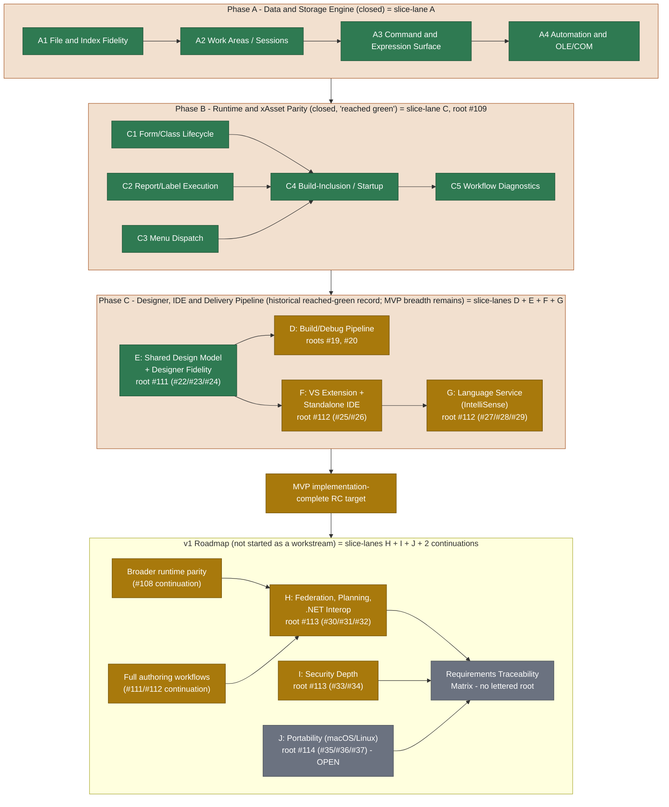

# Roadmap

The Copperfin roadmap is organized as a completion tree rather than a fixed
issue sequence. The top-level product objective is an implementation-complete,
Windows-first MVP release candidate. The v1 roadmap begins after the complete
MVP tree has passed its implementation acceptance criteria.

This document is durable roadmap guidance. It intentionally does not list
individual issue numbers or claim percentage completion. Live issue state,
focused tests, and release artifacts provide the detailed evidence for each
workstream. Where this file cites a specific issue or lane letter below, it is
citing closed historical record, not an active queue — see
[Lettered Lane History](#lettered-lane-history).

## Completion Model

Each workstream has a subgoal tree with observable acceptance criteria:

1. Choose the highest-value unfinished subgoal using current evidence,
   compatibility risk, blockers, and user-visible impact.
2. Implement one small, independently verifiable slice.
3. Run focused regression tests and the relevant broader validation.
4. Record durable constraints and evidence in the appropriate progress or
   handoff document.
5. Mark the subgoal complete only when its implementation and required tests
   pass.

Completed workstreams are not revisited unless a regression, new compatibility
evidence, or release-validation failure creates a new acceptance gap.

Current class-property IntelliSense evidence includes #4886 at product/test
head `bad499421`: class-scope identifier assignments become qualified,
localized property completions and unique dotted definition targets, while
method-local assignments, ambiguous trailing names, existing methods, and
generic members retain safe behavior. The local four-mode matrix and exact-head
Windows VSIX run `30532752948` pass; artifact `8755431111` was uploaded. The
child is closed, while broader IDE parents and RC validation remain separate.

Current cursor-member evidence includes #4885 at corrective product/test head
`7955966d8`: bounded single-line `CREATE CURSOR alias (...)` declarations feed
alias-scoped field completions without splitting nested type clauses such as
`N(12, 2)`. Localized descriptions are added without changing invariant field
names/kinds or existing generic/class members. Trailing `&&` comment punctuation
cannot seed phantom fields. The local four-mode matrix and synchronized Windows
VSIX run `30532334557` pass; artifact `8755271046` was uploaded. The child is
closed, while broader G1 and RC validation remain separate.

Current signature-highlighting evidence includes #4884 at final product/test
head `05bd74dc8`: Visual Studio parameter loci advance through real top-level
declaration starts, preserving distinct highlights for prefix-related names and
for later names mentioned inside earlier default expressions. Nested calls,
quotes, bracket-expression commas, and built-in optional brackets remain
intact. Top-level default-assignment context distinguishes true bracket/brace
defaults, including `[, tcTail]`, from optional `[, parameter]` notation at a
declaration boundary. The local four-mode matrix and exact-head Windows VSIX
run `30531427326` pass; artifact `8754891262` was uploaded. The child is closed,
while broader G1 and RC validation remain separate.

Current class-method discovery evidence includes #4883 at final corrective
product/test head `1bdef1af2`: both managed project scanners now recognize
class-only `PROTECTED` and `HIDDEN` procedure/function declarations, including
`PROC`. Qualified definitions, signatures, references, and rename inputs are
preserved without admitting global lookalikes. Every case-insensitive keyword
regex is culture-invariant, with lowercase `tr-TR` coverage initialized before
either scanner. The local four-mode matrix and exact-head Windows VSIX run
`30529676324` pass; artifact `8754203908` was uploaded. The child is closed,
while broader G1 and RC validation remain separate.

Current VFP declaration-alias evidence includes #4882 at corrected combined
product/test head `b3285feab`: both managed project scanners treat `PROC` and
`PROCEDURE` alike for definitions, signatures, references, and rename inputs
while rejecting the longer `PROCEDURES` near-match. The local four-mode matrix
and exact-head Windows VSIX run `30528541049` pass; artifact `8753733157` was
uploaded. The child is closed, while broader G1 and RC validation remain
separate.

Current runtime/editor-alignment evidence includes #4881 at exact product/test
head `0867efd1a`: project procedures, functions, and qualified class methods
now expose the inline parameter form already supported by the stack-frugal PRG
runtime. Matching-parenthesis extraction preserves nested and quoted defaults;
declarations without inline clauses retain following-line parameter discovery.
The local four-mode matrix and exact-head Windows VSIX run `30527386804` pass;
artifact `8753293045` was uploaded. The child is closed, while broader G1 and
RC validation remain separate.

Current G1 signature-help evidence includes #4880 at exact product/test head
`95dff1c75`: project `PARAMETERS`/`LPARAMETERS` discovery now separates only
top-level commas, preserving nested call, bracket/brace, quoted-comma, and
doubled-quote default expressions instead of surfacing phantom parameters.
The four-mode local managed matrix and exact-head Windows VSIX run
`30526816023` pass; the run uploads artifact `8753063334`. The child is closed,
while broader #27/#112 and the full RC matrix remain separate.

Fresh release-validation failures remain valid implementation input when they
identify a nondeterministic gate. #4878 at exact test head `5d6dd4d13` replaces
two nested-PowerShell held-output fixtures with owned managed child modes while
leaving production process execution unchanged. Local four-locale and repeated
stress evidence, macOS seq1289, and exact-head Windows VSIX run `30525728514`
pass; the run uploads artifact `8752672531`. The child is closed, while the full
RC matrix remains separate.

Current IDE build-cleanliness evidence includes #4879 at exact product/test
head `c990506f0`: editor-pane lookup now uses a shared nullable-safe path
normalization seam with focused null/blank/invalid/relative/absolute coverage.
Exact-head Windows VSIX run `30526202072` is warning-clean, passes all managed
and net472 steps, and uploads artifact `8752823159`. Issue #4879 is closed;
broader IDE and RC validation remain separate.

The shared designer-interaction and report/label implementation trees are
complete at the current MVP fidelity. Their remaining hosted Windows,
Visual Studio, and mounted-VFP9 checks are release evidence gates, not reasons
to reopen completed implementation slices.

## MVP Workstreams

### Report And Label Fidelity

Complete section-aware FRX/LBX editing in the shared designer model:

- root settings, bands, grouping, sorting, and placed objects
- geometry, sizing, positioning, expressions, fonts, and preview metadata
- safe no-op, supported-property, delete/restore, and unsupported-data
  round trips
- identical behavior in standalone Studio and the Visual Studio host, with
  shell-specific chrome kept outside the shared model
- stable host JSON with invariant machine fields and optional display fields

The implementation is complete for the current MVP fidelity. Hosted Windows
validation with real VFP9 samples remains part of the acceptance evidence.

### Localization

Route user-facing native, managed, VSIX, Studio, runtime, diagnostic, and
packaging text through the catalog system. Preserve invariant parser tokens,
diagnostic identities, JSON fields, schema keys, enum values, and runtime
identifiers. Maintain key parity, fallback behavior, pseudo-localization,
placeholder preservation, and Unicode round trips for the supported catalogs.

All new user-facing work is localized by default. Additional translations are
separate content work after the catalog and layout contracts are stable.

### IDE And Designer Workflows

Complete the Windows-first open/edit/build/run/debug path for PJX, PRG, SCX,
VCX, FRX, LBX, and MNX startup assets. The shared designer model must support
the same behavior in standalone Studio and the VSIX. Stabilize the MVP utility
surfaces needed for repeated work: debugger, task list, references, data
explorer, object browser, toolbox/builders, coverage, database, and
security/extensibility summaries.

The shared E2 interaction and builder implementation is complete; remaining
IDE work is the separately owned shell, hosted Visual Studio, and standalone
product-grade surface work described by the live MVP tree.
The shared project workspace also provides grouped, read-only Project Explorer
navigation; project mutation, drag/drop authoring, and full VFP9 Project
Manager parity remain separate implementation work.
The managed WinForms smoke harness now closes its own owner trees before
completion, so a failed or interrupted utility-pane test does not leave a
Copperfin command or terminal window open; hosted Visual Studio and native
window-manager behavior remain separate evidence.

### Runtime And Language Compatibility

Expand VFP9-compatible command, function, object, property, method, and event
behavior using real VFP9 behavior or shipped documentation. Keep PRG execution
stack-frugal and preserve the iterative frame-machine constraints. Track
deliberate fallbacks and unsupported behavior in the runtime stub inventory;
never treat a no-op as completed compatibility.

### Build, Package, And Debug Contracts

Formalize and preserve versioned `app.cfmanifest` and `app.cfdebug` contracts,
staged executable sidecars, source/debug path provenance, and deterministic
package content. Complete the MVP xAsset lifecycle needed for forms/classes,
menus, reports/labels, event-loop behavior, runtime faults, and debugger
recovery.

### Security And Platform Seams

Keep package trust, external-process policy, file-handle binding, secrets,
extension trust, audit, and AI/MCP boundaries explicit and fail-closed where
required. Preserve portable native seams while giving Windows-first behavior
the evidence needed for the MVP release candidate. macOS and Linux standalone
host parity follows the MVP boundary where practical and is expanded in v1.

### RC And Release Evidence

Implementation completion of every MVP workstream is RC readiness. Release
evidence follows that gate and includes:

- native CMake/CTest and platform validation
- Windows VSIX, standalone Studio, designer, runtime, package, and debugger
  smoke tests
- real VFP9 sample validation
- installer and VSIX artifacts
- safety traceability validation and archived evidence
- known limitations and compatibility exceptions

The latest product implementation head is `4a75d3273` (the current branch may
also contain documentation-only coordination commits). The focused shared
platform JSON and Studio-host diagnostic coverage passes locally under
default, `pt_BR.UTF-8`, and `de_DE.UTF-8`; AppleClang/MSVC review and exact-head
hosted evidence remain pending for the Studio-host JSON-control-escape child.
The preceding `NEWID()` UUID-text head `1568b7a11` and APP-archive hex-payload
head `cd6cf9029` have matching Linux, AppleClang, and MSVC evidence; #4872 and
#4871 are closed. The preceding DIF-dimension head `531bbec70` has matching
Linux, AppleClang, and MSVC evidence; #4870 is closed. The preceding
native-wrapper head `c86be275f` has matching Linux,
AppleClang, and MSVC evidence; #4869 is closed. The preceding API-arity
head `858e56929` has matching Linux, AppleClang, and MSVC evidence; #4868 is
closed.
At product head `a2a64427d`, Security Supply Chain
(`30517688033`), Linux Managed UI (`30517688039`), Executable Path
(`30517688026`), and Visual Studio VSIX (`30517688000`) passed while the native
and package lanes remained active. The #4867 report-layout/classification
targets pass under all three locale environments on Linux, macOS/AppleClang,
and Windows/MSVC, closing that implementation child. None of this focused or
superseded hosted evidence is a broad RC claim.

The immediately preceding terminal hosted matrix at product head `ca7889efa`
is green for Linux Native (`30511406972`), macOS Native
(`30511406973`), Linux Managed UI (`30511406936`), Visual Studio VSIX
(`30511406957`), standalone installers (`30511406950`), generated launcher
(`30511406939`), Windows Environment/Executable Path (`30511406944`),
Windows DECLARE ABI (`30511406975`), executable paths (`30511406982`), and
Security Supply Chain (`30511407013`). Windows Native (`30511406940`) also
passed `315/315` CTest cases at the exact product head; its focused
`test_prg_engine_work_areas` target passed in `79.23s` under the per-test
`180s` timeout. The supply-chain lane produced exactly one non-expired
`cyclonedx-sbom` artifact after #4847 pinned Syft `v1.50.0`.

#4846 generated-manifest provenance is accepted on Linux, macOS/AppleClang,
and Windows/MSVC, and #4847's hosted SBOM gate is closed. #4621's hosted
Windows/VFP9/Visual Studio reconciliation remains accepted as historical
evidence for its validated binaries, while the current-head matrix continues
to run. This does not claim complete RC readiness. Independent safety sign-off
under #4403 and protected launcher-trust provisioning under #4409 remain
separate release gates.

Independent local POSIX validation at synchronized head `792f1840c` passed
`ctest --test-dir build --output-on-failure --timeout 180 --parallel 2` with
`316/316` tests passing in `224.56s`. Only the documented platform-conditional
`test_build_host_utf8_launcher_paths` and `test_generated_launcher_process`
tests were skipped; no local UI process was started by this headless run.
A separate Claude-run headless CTest corroboration at coordination head
`f2776b336` also passed `316/316` in `217.52s` with the same two skips.

Independent local evidence at coordination head `4a3a66865` includes the
three package-trust/provisioning contracts (`3/3`), `test_runtime_pipeline`
(`1/1`), and the complete mounted-VFP9 ISO report/label asset subset (`40/40`)
against the original `invoice.frx/.frt` and `cust.lbx/.lbt` fixtures. These
results strengthen package and asset-fidelity evidence but do not substitute
for Windows VFP9 execution, Visual Studio UI smoke, protected signing, or
safety sign-off. Windows Codex subsequently passed the four sample-dependent
runtime equivalents twice at the same product head: RuntimePackage, XAsset,
Report, and Menu, with the installed VFP9 prerequisite present. The artifacts
are recorded under the Windows host's
`E:\Project-Copperfin\artifacts\windows-mounted-vfp9-validation\` path.
The complete RC evidence gate remains unclaimed while #4403 independent
review/closure and #4409 protected launcher-trust provisioning remain open;
the accepted #4621 hosted baseline remains separate from an exact-head live
Visual Studio UI rerun.

The same build tree produced Linux DEB, RPM, and TGZ packages with CPack at
`c95cf269d`; the package/document/install contract subset passed `4/4`.
Current-head installer workflow `30511406950` passed the macOS, Linux, and
Windows installer jobs and uploaded the expected platform artifacts. Local
inspection of the downloaded artifacts confirmed the expected host, standalone
Studio/launcher-guard, and locale-catalog layouts. Artifact packaging still
does not substitute for protected signing evidence.

Managed Linux evidence is also current: `Copperfin.Studio` Release builds with
zero warnings/errors, the portable language-service and Studio target-selection
suites pass, and the shared DesignerSmoke executable builds and lists its full
inventory without warnings. The net472 process-tree fixture is explicitly
Windows-only; VSIX compilation remains a Windows/MSBuild gate.

Current-head hosted Linux UI evidence is represented by managed UI run
`30511406936`; it completed successfully. The current-head Security Supply
Chain Gate `30511407013` is also green.

Current-head VSIX evidence is green: run `30511406957` passed the VSIX build
and managed validation lane, while Windows Deep Validation independently passed
localized resource verification, managed VSIX/language-service tests, and the
net472 process-runner fixture. The Deep run did not execute the mounted-VFP9
runtime sample stages or a live Visual Studio UI walkthrough; the accepted
#4621 hosted baseline is recorded separately and is not claimed as exact-head
`93d44395f` evidence.

For a document-by-document accounting of what the project's own specification
documents require versus what the code currently delivers, see
[31-specification-compliance-gap-analysis.md](31-specification-compliance-gap-analysis.md).

## v1 Roadmap

After MVP implementation completion and release evidence review, continue in
this order. Three of these six items already have a real, historical
lane-letter identity assigned when their root issues were opened — see
[Lettered Lane History](#lettered-lane-history) for what those roots actually
cover:

1. Broaden runtime parity from validated VFP9 behavior and shipped docs.
   *(Continuation of umbrella `#108`; no dedicated lane letter.)*
2. Mature forms/classes, menus, reports/labels, builders, project management,
   property grids, toolbox, object browser, data explorer, and coverage into
   full authoring workflows. *(Continuation of umbrellas `#111`/`#112` past
   their MVP-fidelity closure.)*
3. Add deterministic SQL federation, then document/vector planning, then
   first-class .NET runtime interop beyond launcher stubs. *(This is lane
   **H** — `H1`/`#30` relational backend translators, `H2`/`#31` document/
   vector and AI-assisted planning, `H3`/`#32` .NET outputs, MCP/AI hooks, and
   Python/R sidecars.)*
4. Deepen RBAC, policy profiles, audit, secrets, signing, process controls,
   extension trust, and AI/MCP boundaries. *(This is lane **I** — `I1`/`#33`
   runtime/project security depth, `I2`/`#34` extension/host/AI-MCP security
   boundary.)*
5. Port standalone/core host behavior to macOS and Linux while preserving the
   portable native contracts. *(This is lane **J** — `J1`/`#35` portable core
   boundary, `J2`/`#36` macOS port, `J3`/`#37` Linux port. Still open with no
   shipped evidence as of this writing.)*
6. Build the requirements-to-code-to-test traceability matrix from validated
   VFP9 behavior, shipped documentation, and documented Copperfin exceptions.
   *(No lane letter was ever assigned; this remains a standing, deferred goal
   per `docs/28-repository-ontology.md` §7.)*

## Lettered Lane History

The repo's history contains **two independent systems that reuse the same
letters and must not be conflated**:

1. **Prose "Phase" milestones** — coarse announcements in `CHANGELOG.md`:
   "Phase A closed," "Phase B runtime parity surfaces reached green status,"
   "Phase C reached green status." Only three of these exist; there has never
   been a "Phase D," "Phase E," or "Phase F" milestone announced anywhere in
   the repo.
2. **Slice-lane codes** (`<Letter><Digit>/#<issue>`, e.g. `E3/#3199`) — a
   per-issue tagging scheme. On 2026-04-30/05-12, root/umbrella issues
   `#22`-`#37` were each stamped with one letter+digit code as a permanent
   title prefix (recorded in `issues.txt`), owned by backlog umbrellas
   `#108`-`#114`. That assignment held for the rest of each lane's life — the
   letter names a root issue and its theme, not a batch of nearby issue
   numbers, which is why a single lane's issue numbers can span from double
   digits to the thousands without changing subject.

**These two systems do not line up letter-for-letter.** Only Phase A and
slice-lane A agree. "Phase B" reached green status by shipping slice-lane
**C**'s content (`C1`-`C5`, xAsset executable-model lifecycle), not a "lane B."
"Phase C" reached green status by shipping four lanes at once — **D** (build/
debug pipeline), **E** (shared design model and designer fidelity), **F** (VS
extension and standalone IDE), and **G** (language service/IntelliSense) —
which is exactly the five-item list the Phase C closure note gives: "build/
package/debug pipeline, shared designers, Visual Studio integration,
standalone Studio shell, and FoxPro language-service layer."

| Lane | Root issue(s) | Theme | Status | Backing prose phase |
| --- | --- | --- | --- | --- |
| A | `#7`-`#12` (pre-dates the lettered scheme; `A1`-`A4` retrofitted) | File/index fidelity, work areas/sessions, command/expression surface, OLE/COM automation | Closed | Phase A |
| — | *(none — see below)* | — | — | Phase B's content actually shipped under lane C |
| C | `#109` | xAsset executable-model lifecycle: form/class, report/label, menu lifecycle; build-inclusion/startup resolution; workflow diagnostics | Closed (`#154`-`#162`) | Phase B |
| D | `#110` (`D1`/`#19` packaging pipeline, `D2`/`#20` debugger) | Build/compiler/debug pipeline | Recorded D1/D2 slices closed; broader MVP/release evidence remains under the live tree | Phase C |
| E | `#111` (`E1`/`#22`, `E2`/`#23`, `E3`/`#24`) | Shared design model and designer fidelity (`E3` = report/label parity, the single largest lane in the repo) | Closed 2026-07-24 | Phase C |
| F | `#112` (`F1`/`#25`, `F2`/`#26`) | VS extension parity + utility panes; standalone Studio as a full IDE | MVP implementation complete for standalone shell; hosted UI evidence remains under the RC gate | Phase C |
| G | `#112` (`G1`/`#27`, `G2`/`#28`, `G3`/`#29`) | FoxPro language service: semantic resolution, navigation/refactoring, IntelliSense metadata | Recorded G1/G2/G3 slices closed; broader MVP scope remains under the live tree | Phase C |
| H | `#113` (`H1`/`#30`, `H2`/`#31`, `H3`/`#32`) | Relational backend translators, document/vector + AI planning, .NET/MCP/polyglot outputs | Seeded (see gap analysis) | v1 item 3 |
| I | `#113` (`I1`/`#33`, `I2`/`#34`) | Runtime/project security depth, extension/host/AI-MCP security boundary | Seeded (see gap analysis) | v1 item 4 |
| J | `#114` (`J1`/`#35`, `J2`/`#36`, `J3`/`#37`) | Portable core boundary, macOS port, Linux port | Open, no shipped evidence | v1 item 5 |

Current G1 evidence includes #4874 at product/test head `e70c89e87`: editor
project-symbol discovery follows the unquoted `#INCLUDE` form used by the real
VFPSource ReportBuilder header chain, including recursive headers and trailing
comment separation. Corrected direct-evidence head `765a31bc7` places the
included headers outside the project root so ordinary project enumeration
cannot satisfy the assertions; the focused managed harness passes on Linux.
MacOS seq1268 accepts the product change, and exact-head Windows VSIX run
`30522772118` passes the corrected fixture in the full managed suite. Issue
#4874 is reclosed on direct evidence; the broader #27 parent stays open.

Follow-on G1 child #4875 at exact product/test head `e41325472` aligns external
and recursively external editor include lookup with VFP path casing semantics:
exact filesystem components win, one unique case-folded match is accepted with
actual spelling, and ambiguity fails closed. The focused Release managed
harness passes on Linux, exact-head Windows VSIX run `30522772118` passes the
full managed suite, and macOS seq1273 accepts the actual-spelling correction.
Issue #4875 is closed; broader #27 remains open.

Current managed localization-gate child #4877 is implemented at exact test head
`7dde622ad`. Nine language-service expectations now obtain localized
descriptions from the active catalog while preserving invariant names, kinds,
ranking, definition provenance, and context-specific precedence assertions.
The full Release harness passes locally under default, `pt_BR.UTF-8`,
`de_DE.UTF-8`, and explicit `qps-ploc`; exact-head Windows VSIX run
`30524464648` passes the full managed suite and uploads artifact `8752248824`.
Issue #4877 is closed. This is test-contract hardening only and adds no product
text or catalog key.

Current D-lane machine-contract evidence includes #4876 at exact product/test
head `28b2f3322`: AST/IR JSON and generated C# string literals share the
complete platform control escaper, with real source-derived byte `0x1f`
coverage across all three generated artifacts. The focused runtime-pipeline
suite passes under default, `pt_BR.UTF-8`, and `de_DE.UTF-8` on Linux,
AppleClang seq1280, and Windows/MSVC seq1281. Issue #4876 is closed; broader
#110/release evidence remains pending.

**The letter "B" was never assigned as a root-issue theme.** Unlike C through
J, no umbrella issue was ever opened with a "B" prefix. The only three
`B<n>/#<issue>` occurrences in the repo's history are two unrelated one-off
reuses of the code `B2` — once for an undo-command/managed-compile-gate slice
(`#273`), later for the engine concurrency policy work now documented in
`docs/25-engine-concurrency-policy.md` (`#402`, `#409`). Treat "B" as a
documentation curiosity, not a real lane, when reading historical references.

Also note: `docs/23-phase-a-dependency-breakdown.md` separately uses `G1`-`G18`
as internal graph-node IDs for the closed Phase A dependency diagram. Those
never carry a `#issue` suffix and are unrelated to slice-lane `G1`-`G3`
(IntelliSense) above — the repo has two different, unconnected uses of the
letter G.

**This entire lettering scheme is retired, not extended.** As of 2026-07-24,
`CHANGELOG.md`'s newest entries close out the E2/E3 lanes and describe the
roadmap as reworked "around a queue-neutral MVP subgoal tree." Work that
continues under the same subject matter (packaging, debugging, report/label
polish) is now cited as plain `#<issue> under #<parent>` without a letter
prefix. Do not assign new letters going forward; the table above is a closed
historical record.

## Whole-System Architecture

This map shows the real native/managed build graph together with the
aspirational `copperfin-*` module taxonomy from `docs/02-architecture.md`'s
"Top-Level Product Map," in one diagram, so the distance between what exists
and what is planned is visible at a glance. It mirrors the ground-truth class
diagram in [24-system-uml.md](24-system-uml.md) but in flowchart form rather
than UML, and folds in the aspirational layer that document deliberately
keeps separate.

Moved to its own file — see
[diagrams/roadmap-whole-system-architecture.md](diagrams/roadmap-whole-system-architecture.md) —
because GitHub's Mermaid renderer only reliably renders the first diagram on
a page with multiple diagrams; this page keeps only the
[Full Lettered Phase Dependency Diagram](#full-lettered-phase-dependency-diagram)
inline.

## Phase And Topic Map

This map is a durable view of the project tree by workstream topic. It
describes relationships and completion gates, not a queue or a promise that
every topic is implemented. It predates the lettered-lane reconstruction above
and uses workstream names rather than lane letters; the
[Full Lettered Phase Dependency Diagram](#full-lettered-phase-dependency-diagram)
below gives the same shape using the real lane identities.

Moved to its own file for the same rendering reason — see
[diagrams/roadmap-phase-and-topic-map.md](diagrams/roadmap-phase-and-topic-map.md).

## Full Lettered Phase Dependency Diagram

This is the top-level dependency map using the real lane identities
reconstructed in [Lettered Lane History](#lettered-lane-history): Phase A,
then Phase B (slice-lane C), then Phase C (slice-lanes D+E+F+G), then the MVP
gate, then v1 (slice-lanes H+I+J plus the two un-lettered continuations and
the traceability goal).

## Per-Phase Dependency Diagrams And Roadmaps

Each phase below gets its own flowchart-style dependency diagram — deliberately
plain flowcharts, not UML/class diagrams, matching the style already used for
Phase A's historical graph — plus a short roadmap: what shipped, what's left,
and what closing the remainder actually takes.

### Phase A — Data & Storage Engine

Closed. The full G1-G18 dependency graph that led to closure is preserved as
historical evidence in
[23-phase-a-dependency-breakdown.md](23-phase-a-dependency-breakdown.md#historical-dependency-graph)
rather than duplicated here. **What's left:** nothing at the implementation
level; do not reopen without fresh regression evidence per `agents.md`.

### Phase B — Runtime & xAsset Parity (slice-lane C)

Diagram moved to
[diagrams/roadmap-phase-b-lane-c.md](diagrams/roadmap-phase-b-lane-c.md) to
keep this page's diagram count to one.

**What's done:** all five sub-lanes shipped and closed in a single May 2026
batch — form/class, report/label, and menu xAsset lifecycle sequencing, plus
the build-inclusion and workflow-diagnostics work that depends on all three.
**What's left:** the implementation work formerly named as "host stability and
debugger fault containment" is complete through #4623 and its focused child
slices for the runtime host, PRG debugger, forms/classes/menus, and
reports/labels. The remaining hosted Windows, mounted-VFP9, and Visual Studio
checks were release evidence tracked and recorded under the now-closed #4621
issue, not unfinished Phase B implementation.

### Phase C — Designer, IDE & Delivery Pipeline (slice-lanes D + E + F + G)

Diagram moved to
[diagrams/roadmap-phase-c-lanes-defg.md](diagrams/roadmap-phase-c-lanes-defg.md) —
same rendering reason as above.

**What's done:** lane E (shared design model, designer interactions, and
report/label fidelity) closed on 2026-07-24 — the newest closure in the whole
repo. Lane D's packaging pipeline and debugger, lane F's VS/standalone hosts,
and lane G's language service are substantially shipped in focused slices.
Recent F1 utility-pane slices made Task List, Code References, Data Explorer,
Object Browser, Database, and Project Explorer workflows interactive in both
host modes; the Database pane now owns its filter and exposes selection details
for connector and query-path contracts, while Project Explorer now filters
without losing group hierarchy. Recent G1/G2/G3
slices tightened project symbol resolution, references, rename, signature
help, completions, and source-derived metadata. **What's left:** hosted
Windows, mounted-VFP9, and Visual Studio validation remain release-evidence
gates for lane E and the host surfaces; broader product-grade shell and
language-service scope remains open under the live MVP tree and must not be
treated as complete merely because these focused slices shipped.

### v1 — Post-MVP Roadmap (slice-lanes H + I + J)

Diagram moved to
[diagrams/roadmap-v1-lanes-hij.md](diagrams/roadmap-v1-lanes-hij.md) — same
rendering reason as above.

**What's done:** `H1`'s relational backend translators and `I1`'s security
baseline both have real seeds — `cf_platform_profile`'s deterministic Fox-SQL
translator/execution-planning lane, and `cf_security`'s RBAC/audit/secrets/
signing baseline, respectively. **What's left, and what it takes:** this is
covered in full, document-by-document, in
[31-specification-compliance-gap-analysis.md](31-specification-compliance-gap-analysis.md) —
in particular its interop/federation/trust/security and language/data-fidelity
gap diagrams give the `H`/`I` gaps in the same level of detail as this diagram
gives their dependency shape. Lane `J` (portability) has no shipped evidence
at all yet and is the most clearly not-started item in the entire v1 list.

## Documentation Ownership

- This file owns the durable roadmap, completion model, phase/topic map, the
  lettered-lane historical reconstruction, and the whole-system and per-phase
  dependency diagrams. Diagrams beyond the first on this page live in
  `docs/diagrams/roadmap-*.md`, split out because GitHub's Mermaid renderer
  only reliably renders the first diagram on a page with several.
- [31-specification-compliance-gap-analysis.md](31-specification-compliance-gap-analysis.md)
  owns the specification-vs-implementation gap analysis — what it takes to
  meet each of the project's own specification documents.
- [24-system-uml.md](24-system-uml.md) owns the class-diagram-level (UML)
  view of the system, both ground-truth and aspirational; this file's
  Whole-System Architecture diagram is the flowchart-style counterpart.
- Architecture and reference documents describe stable product boundaries and
  compatibility rules; they should remain issue-neutral where possible.
- `agent-handoff.md` and progress documents record current evidence and may
  reference specific issues, commits, tests, and hosted runs.
- `CHANGELOG.md` records shipped behavior and durable constraints.
- `remaining-work.md` is deprecated and must not become a second roadmap.
