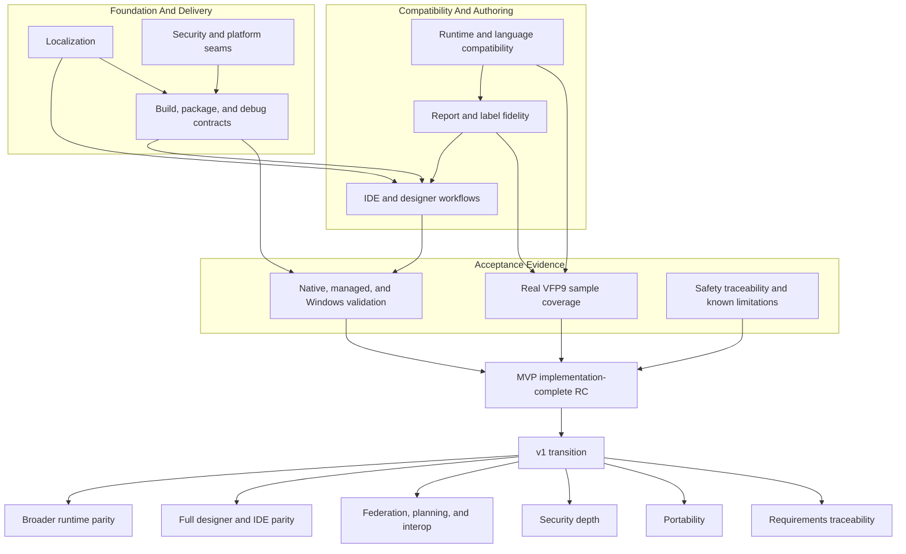
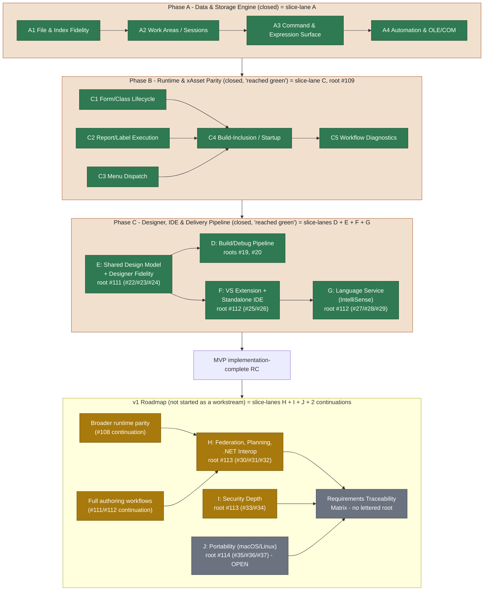
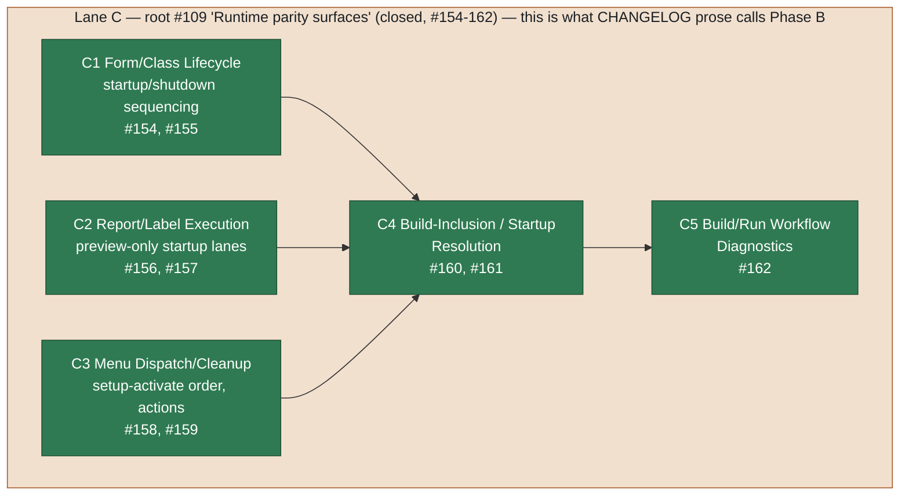
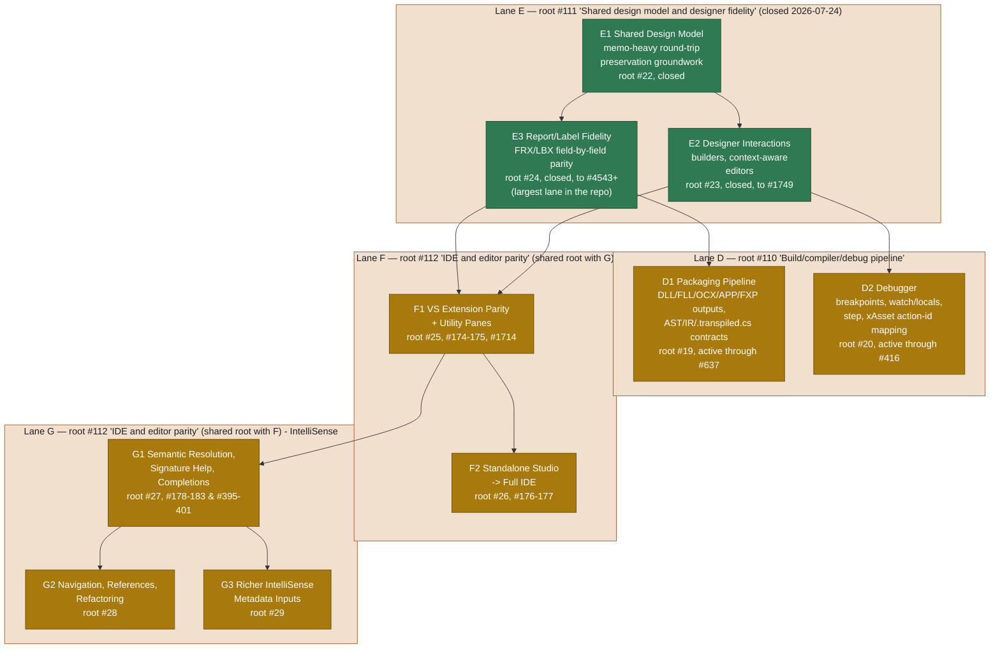
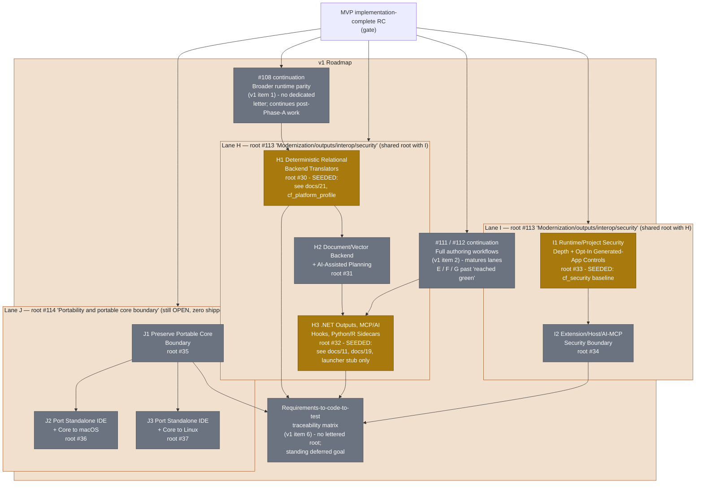

# Roadmap

The Copperfin roadmap is organized as a completion tree rather than a fixed
issue sequence. The top-level product objective is an implementation-complete,
Windows-first MVP release candidate. The v1 roadmap begins after the complete
MVP tree has passed its implementation acceptance criteria.

This document is durable roadmap guidance. It intentionally does not list
individual issue numbers or claim percentage completion. Live issue state,
focused tests, and release artifacts provide the detailed evidence for each
workstream. Where this file cites a specific issue or lane letter below, it is
citing closed historical record, not an active queue — see
[Lettered Lane History](#lettered-lane-history).

## Completion Model

Each workstream has a subgoal tree with observable acceptance criteria:

1. Choose the highest-value unfinished subgoal using current evidence,
   compatibility risk, blockers, and user-visible impact.
2. Implement one small, independently verifiable slice.
3. Run focused regression tests and the relevant broader validation.
4. Record durable constraints and evidence in the appropriate progress or
   handoff document.
5. Mark the subgoal complete only when its implementation and required tests
   pass.

Completed workstreams are not revisited unless a regression, new compatibility
evidence, or release-validation failure creates a new acceptance gap.

The shared designer-interaction and report/label implementation trees are
complete at the current MVP fidelity. Their remaining hosted Windows,
Visual Studio, and mounted-VFP9 checks are release evidence gates, not reasons
to reopen completed implementation slices.

## MVP Workstreams

### Report And Label Fidelity

Complete section-aware FRX/LBX editing in the shared designer model:

- root settings, bands, grouping, sorting, and placed objects
- geometry, sizing, positioning, expressions, fonts, and preview metadata
- safe no-op, supported-property, delete/restore, and unsupported-data
  round trips
- identical behavior in standalone Studio and the Visual Studio host, with
  shell-specific chrome kept outside the shared model
- stable host JSON with invariant machine fields and optional display fields

The implementation is complete for the current MVP fidelity. Hosted Windows
validation with real VFP9 samples remains part of the acceptance evidence.

### Localization

Route user-facing native, managed, VSIX, Studio, runtime, diagnostic, and
packaging text through the catalog system. Preserve invariant parser tokens,
diagnostic identities, JSON fields, schema keys, enum values, and runtime
identifiers. Maintain key parity, fallback behavior, pseudo-localization,
placeholder preservation, and Unicode round trips for the supported catalogs.

All new user-facing work is localized by default. Additional translations are
separate content work after the catalog and layout contracts are stable.

### IDE And Designer Workflows

Complete the Windows-first open/edit/build/run/debug path for PJX, PRG, SCX,
VCX, FRX, LBX, and MNX startup assets. The shared designer model must support
the same behavior in standalone Studio and the VSIX. Stabilize the MVP utility
surfaces needed for repeated work: debugger, task list, references, data
explorer, object browser, toolbox/builders, coverage, database, and
security/extensibility summaries.

The shared E2 interaction and builder implementation is complete; remaining
IDE work is the separately owned shell, hosted Visual Studio, and standalone
product-grade surface work described by the live MVP tree.

### Runtime And Language Compatibility

Expand VFP9-compatible command, function, object, property, method, and event
behavior using real VFP9 behavior or shipped documentation. Keep PRG execution
stack-frugal and preserve the iterative frame-machine constraints. Track
deliberate fallbacks and unsupported behavior in the runtime stub inventory;
never treat a no-op as completed compatibility.

### Build, Package, And Debug Contracts

Formalize and preserve versioned `app.cfmanifest` and `app.cfdebug` contracts,
staged executable sidecars, source/debug path provenance, and deterministic
package content. Complete the MVP xAsset lifecycle needed for forms/classes,
menus, reports/labels, event-loop behavior, runtime faults, and debugger
recovery.

### Security And Platform Seams

Keep package trust, external-process policy, file-handle binding, secrets,
extension trust, audit, and AI/MCP boundaries explicit and fail-closed where
required. Preserve portable native seams while giving Windows-first behavior
the evidence needed for the MVP release candidate. macOS and Linux standalone
host parity follows the MVP boundary where practical and is expanded in v1.

### RC And Release Evidence

Implementation completion of every MVP workstream is RC readiness. Release
evidence follows that gate and includes:

- native CMake/CTest and platform validation
- Windows VSIX, standalone Studio, designer, runtime, package, and debugger
  smoke tests
- real VFP9 sample validation
- installer and VSIX artifacts
- safety traceability validation and archived evidence
- known limitations and compatibility exceptions

For a document-by-document accounting of what the project's own specification
documents require versus what the code currently delivers, see
[31-specification-compliance-gap-analysis.md](31-specification-compliance-gap-analysis.md).

## v1 Roadmap

After MVP implementation completion and release evidence review, continue in
this order. Three of these six items already have a real, historical
lane-letter identity assigned when their root issues were opened — see
[Lettered Lane History](#lettered-lane-history) for what those roots actually
cover:

1. Broaden runtime parity from validated VFP9 behavior and shipped docs.
   *(Continuation of umbrella `#108`; no dedicated lane letter.)*
2. Mature forms/classes, menus, reports/labels, builders, project management,
   property grids, toolbox, object browser, data explorer, and coverage into
   full authoring workflows. *(Continuation of umbrellas `#111`/`#112` past
   their MVP-fidelity closure.)*
3. Add deterministic SQL federation, then document/vector planning, then
   first-class .NET runtime interop beyond launcher stubs. *(This is lane
   **H** — `H1`/`#30` relational backend translators, `H2`/`#31` document/
   vector and AI-assisted planning, `H3`/`#32` .NET outputs, MCP/AI hooks, and
   Python/R sidecars.)*
4. Deepen RBAC, policy profiles, audit, secrets, signing, process controls,
   extension trust, and AI/MCP boundaries. *(This is lane **I** — `I1`/`#33`
   runtime/project security depth, `I2`/`#34` extension/host/AI-MCP security
   boundary.)*
5. Port standalone/core host behavior to macOS and Linux while preserving the
   portable native contracts. *(This is lane **J** — `J1`/`#35` portable core
   boundary, `J2`/`#36` macOS port, `J3`/`#37` Linux port. Still open with no
   shipped evidence as of this writing.)*
6. Build the requirements-to-code-to-test traceability matrix from validated
   VFP9 behavior, shipped documentation, and documented Copperfin exceptions.
   *(No lane letter was ever assigned; this remains a standing, deferred goal
   per `docs/28-repository-ontology.md` §7.)*

## Lettered Lane History

The repo's history contains **two independent systems that reuse the same
letters and must not be conflated**:

1. **Prose "Phase" milestones** — coarse announcements in `CHANGELOG.md`:
   "Phase A closed," "Phase B runtime parity surfaces reached green status,"
   "Phase C reached green status." Only three of these exist; there has never
   been a "Phase D," "Phase E," or "Phase F" milestone announced anywhere in
   the repo.
2. **Slice-lane codes** (`<Letter><Digit>/#<issue>`, e.g. `E3/#3199`) — a
   per-issue tagging scheme. On 2026-04-30/05-12, root/umbrella issues
   `#22`-`#37` were each stamped with one letter+digit code as a permanent
   title prefix (recorded in `issues.txt`), owned by backlog umbrellas
   `#108`-`#114`. That assignment held for the rest of each lane's life — the
   letter names a root issue and its theme, not a batch of nearby issue
   numbers, which is why a single lane's issue numbers can span from double
   digits to the thousands without changing subject.

**These two systems do not line up letter-for-letter.** Only Phase A and
slice-lane A agree. "Phase B" reached green status by shipping slice-lane
**C**'s content (`C1`-`C5`, xAsset executable-model lifecycle), not a "lane B."
"Phase C" reached green status by shipping four lanes at once — **D** (build/
debug pipeline), **E** (shared design model and designer fidelity), **F** (VS
extension and standalone IDE), and **G** (language service/IntelliSense) —
which is exactly the five-item list the Phase C closure note gives: "build/
package/debug pipeline, shared designers, Visual Studio integration,
standalone Studio shell, and FoxPro language-service layer."

| Lane | Root issue(s) | Theme | Status | Backing prose phase |
| --- | --- | --- | --- | --- |
| A | `#7`-`#12` (pre-dates the lettered scheme; `A1`-`A4` retrofitted) | File/index fidelity, work areas/sessions, command/expression surface, OLE/COM automation | Closed | Phase A |
| — | *(none — see below)* | — | — | Phase B's content actually shipped under lane C |
| C | `#109` | xAsset executable-model lifecycle: form/class, report/label, menu lifecycle; build-inclusion/startup resolution; workflow diagnostics | Closed (`#154`-`#162`) | Phase B |
| D | `#110` (`D1`/`#19` packaging pipeline, `D2`/`#20` debugger) | Build/compiler/debug pipeline | Active (`D1` through `#637`, `D2` through `#416`) | Phase C |
| E | `#111` (`E1`/`#22`, `E2`/`#23`, `E3`/`#24`) | Shared design model and designer fidelity (`E3` = report/label parity, the single largest lane in the repo) | Closed 2026-07-24 | Phase C |
| F | `#112` (`F1`/`#25`, `F2`/`#26`) | VS extension parity + utility panes; standalone Studio as a full IDE | Dormant since `#1714`, no closure statement | Phase C |
| G | `#112` (`G1`/`#27`, `G2`/`#28`, `G3`/`#29`) | FoxPro language service: semantic resolution, navigation/refactoring, IntelliSense metadata | Active (`#178`-`#183`, `#395`-`#401`) | Phase C |
| H | `#113` (`H1`/`#30`, `H2`/`#31`, `H3`/`#32`) | Relational backend translators, document/vector + AI planning, .NET/MCP/polyglot outputs | Seeded (see gap analysis) | v1 item 3 |
| I | `#113` (`I1`/`#33`, `I2`/`#34`) | Runtime/project security depth, extension/host/AI-MCP security boundary | Seeded (see gap analysis) | v1 item 4 |
| J | `#114` (`J1`/`#35`, `J2`/`#36`, `J3`/`#37`) | Portable core boundary, macOS port, Linux port | Open, no shipped evidence | v1 item 5 |

**The letter "B" was never assigned as a root-issue theme.** Unlike C through
J, no umbrella issue was ever opened with a "B" prefix. The only three
`B<n>/#<issue>` occurrences in the repo's history are two unrelated one-off
reuses of the code `B2` — once for an undo-command/managed-compile-gate slice
(`#273`), later for the engine concurrency policy work now documented in
`docs/25-engine-concurrency-policy.md` (`#402`, `#409`). Treat "B" as a
documentation curiosity, not a real lane, when reading historical references.

Also note: `docs/23-phase-a-dependency-breakdown.md` separately uses `G1`-`G18`
as internal graph-node IDs for the closed Phase A dependency diagram. Those
never carry a `#issue` suffix and are unrelated to slice-lane `G1`-`G3`
(IntelliSense) above — the repo has two different, unconnected uses of the
letter G.

**This entire lettering scheme is retired, not extended.** As of 2026-07-24,
`CHANGELOG.md`'s newest entries close out the E2/E3 lanes and describe the
roadmap as reworked "around a queue-neutral MVP subgoal tree." Work that
continues under the same subject matter (packaging, debugging, report/label
polish) is now cited as plain `#<issue> under #<parent>` without a letter
prefix. Do not assign new letters going forward; the table above is a closed
historical record.

## Whole-System Architecture

This map shows the real native/managed build graph together with the
aspirational `copperfin-*` module taxonomy from `docs/02-architecture.md`'s
"Top-Level Product Map," in one diagram, so the distance between what exists
and what is planned is visible at a glance. It mirrors the ground-truth class
diagram in [24-system-uml.md](24-system-uml.md) but in flowchart form rather
than UML, and folds in the aspirational layer that document deliberately
keeps separate.

```mermaid
flowchart TB
    classDef real fill:#2f7a52,stroke:#1e5136,color:#ffffff,stroke-width:1px;
    classDef seed fill:#a8790c,stroke:#6e4f07,color:#ffffff,stroke-width:1px;
    classDef none fill:#8a3a3a,stroke:#5c2626,color:#ffffff,stroke-width:1px;
    classDef ground fill:#33475b,stroke:#1f2c38,color:#ffffff,stroke-width:1px;
    classDef exe fill:#4b5563,stroke:#2f353b,color:#ffffff,stroke-width:1px;
    classDef lane fill:#f2e0cf,stroke:#a85a2a,color:#1b2024,stroke-width:1px;

    subgraph CORE["Ground Truth Native Libraries (cf_*)"]
      direction TB
      L1["cf_localization"]
      L2["cf_security"]
      L3["cf_platform_profile"]
      L4["cf_vfp_assets"]
      L5["cf_runtime_text"]
      L6["cf_prg_analysis"]
      L7["cf_design_model"]
      L8["cf_xbase_runtime"]
      L9["cf_runtime_pipeline"]
    end

    subgraph EXEC["Ground Truth Executables + Managed Hosts"]
      direction TB
      X1["copperfin_inspect"]
      X2["copperfin_studio_host"]
      X3["copperfin_runtime_host"]
      X4["copperfin_build_host"]
      X5["Copperfin.VisualStudio (VSIX)"]
      X6["Copperfin.Studio (WinForms)"]
    end

    subgraph ASPIRATIONAL["Aspirational copperfin-* Modules (docs/02 Top-Level Product Map)"]
      direction TB
      A1["copperfin-core — NOT extracted"]
      A2["copperfin-data — NOT extracted"]
      A3["copperfin-connectors — PARTIAL SEED"]
      A4["copperfin-runtime — NOT extracted"]
      A5["copperfin-designer — NOT extracted"]
      A6["copperfin-reports — NOT extracted"]
      A7["copperfin-migrator — NO CODE"]
      A8["copperfin-dotnet — PARTIAL SEED"]
      A9["copperfin-gateway — NO CODE"]
      A10["copperfin-shield — PARTIAL SEED"]
      A11["copperfin-cli — INFORMAL ONLY"]
      A12["copperfin-vsix — ALREADY REAL (label stale)"]
    end

    L2 --> L1
    L3 --> L1
    L4 --> L1
    L5 --> L1
    L6 --> L5
    L7 --> L4
    L7 --> L6
    L7 --> L1
    L8 --> L6
    L8 --> L5
    L8 --> L7
    L9 --> L7
    L9 --> L2
    L9 --> L3
    L9 --> L8

    X1 --> L4
    X1 --> L2
    X2 --> L7
    X2 --> L2
    X2 --> L3
    X3 --> L8
    X3 --> L2
    X3 --> L3
    X4 --> L9
    X5 --> X2
    X5 --> X3
    X6 --> X2
    X6 --> X3

    A1 -.extract from.-> L1
    A2 -.extract from.-> L4
    A2 -.requires.-> A1
    A3 -.deepen: live backend exec.-> L3
    A3 -.requires.-> A2
    A4 -.extract/rename from.-> L8
    A4 -.requires.-> A2
    A5 -.extract from.-> L7
    A5 -.requires.-> A2
    A6 -.new render/export module.-> L7
    A6 -.requires.-> A4
    A7 -.new code entirely.-> L4
    A7 -.requires.-> A5
    A8 -.deepen: real CLR host.-> L9
    A8 -.requires.-> A4
    A9 -.new code entirely.-> L2
    A9 -.requires.-> A8
    A10 -.deepen: policy-profile depth.-> L2
    A11 -.unify existing hosts.-> L9
    A12 -.already implemented as.-> X5

    class L1,L2,L3,L4,L5,L6,L7,L8,L9 ground;
    class X1,X2,X3,X4,X5,X6 exe;
    class A1,A2,A4,A5,A6,A11 none;
    class A3,A8,A10 seed;
    class A7,A9 none;
    class A12 real;
    class CORE,EXEC,ASPIRATIONAL lane;
```

## Phase And Topic Map

This map is a durable view of the project tree by workstream topic. It
describes relationships and completion gates, not a queue or a promise that
every topic is implemented. It predates the lettered-lane reconstruction above
and uses workstream names rather than lane letters; the
[Full Lettered Phase Dependency Diagram](#full-lettered-phase-dependency-diagram)
below gives the same shape using the real lane identities.

## Full Lettered Phase Dependency Diagram

This is the top-level dependency map using the real lane identities
reconstructed in [Lettered Lane History](#lettered-lane-history): Phase A,
then Phase B (slice-lane C), then Phase C (slice-lanes D+E+F+G), then the MVP
gate, then v1 (slice-lanes H+I+J plus the two un-lettered continuations and
the traceability goal).

## Per-Phase Dependency Diagrams And Roadmaps

Each phase below gets its own flowchart-style dependency diagram — deliberately
plain flowcharts, not UML/class diagrams, matching the style already used for
Phase A's historical graph — plus a short roadmap: what shipped, what's left,
and what closing the remainder actually takes.

### Phase A — Data & Storage Engine

Closed. The full G1-G18 dependency graph that led to closure is preserved as
historical evidence in
[23-phase-a-dependency-breakdown.md](23-phase-a-dependency-breakdown.md#historical-dependency-graph)
rather than duplicated here. **What's left:** nothing at the implementation
level; do not reopen without fresh regression evidence per `agents.md`.

### Phase B — Runtime & xAsset Parity (slice-lane C)

**What's done:** all five sub-lanes shipped and closed in a single May 2026
batch — form/class, report/label, and menu xAsset lifecycle sequencing, plus
the build-inclusion and workflow-diagnostics work that depends on all three.
**What's left:** per `docs/22-vfp-language-reference-coverage.md:978`, "host
stability and debugger fault containment" are named explicitly as remaining
runtime-safety work in this area, now that the automation lane (Phase A) is
closed — this is tracked more as depth work in lane D's debugger sub-lane
(`D2`) than as a reopening of lane C itself.

### Phase C — Designer, IDE & Delivery Pipeline (slice-lanes D + E + F + G)

**What's done:** lane E (shared design model, designer interactions, and
report/label fidelity) closed on 2026-07-24 — the newest closure in the whole
repo. Lane D's packaging pipeline and debugger, lane F's VS/standalone hosts,
and lane G's language service are all substantially shipped, though none carry
an explicit closure statement the way lane E and lane C do. **What's left:**
hosted Windows, mounted-VFP9, and Visual Studio validation remain release-
evidence gates for lane E's closed implementation work (per
`agent-handoff.md`); lane F has been dormant since `#1714` with no closure
recorded, which is worth a fresh look before assuming it is done; lane G's
IntelliSense work is still active as of `#395`-`#401`.

### v1 — Post-MVP Roadmap (slice-lanes H + I + J)

**What's done:** `H1`'s relational backend translators and `I1`'s security
baseline both have real seeds — `cf_platform_profile`'s deterministic Fox-SQL
translator/execution-planning lane, and `cf_security`'s RBAC/audit/secrets/
signing baseline, respectively. **What's left, and what it takes:** this is
covered in full, document-by-document, in
[31-specification-compliance-gap-analysis.md](31-specification-compliance-gap-analysis.md) —
in particular its "Interop, Federation, Trust, and Security" and "Language &
Data Fidelity" diagrams give the `H`/`I` gaps in the same level of detail as
this diagram gives their dependency shape. Lane `J` (portability) has no
shipped evidence at all yet and is the most clearly not-started item in the
entire v1 list.

## Documentation Ownership

- This file owns the durable roadmap, completion model, phase/topic map, the
  lettered-lane historical reconstruction, and the whole-system and per-phase
  dependency diagrams.
- [31-specification-compliance-gap-analysis.md](31-specification-compliance-gap-analysis.md)
  owns the specification-vs-implementation gap analysis — what it takes to
  meet each of the project's own specification documents.
- [24-system-uml.md](24-system-uml.md) owns the class-diagram-level (UML)
  view of the system, both ground-truth and aspirational; this file's
  Whole-System Architecture diagram is the flowchart-style counterpart.
- Architecture and reference documents describe stable product boundaries and
  compatibility rules; they should remain issue-neutral where possible.
- `agent-handoff.md` and progress documents record current evidence and may
  reference specific issues, commits, tests, and hosted runs.
- `CHANGELOG.md` records shipped behavior and durable constraints.
- `remaining-work.md` is deprecated and must not become a second roadmap.
