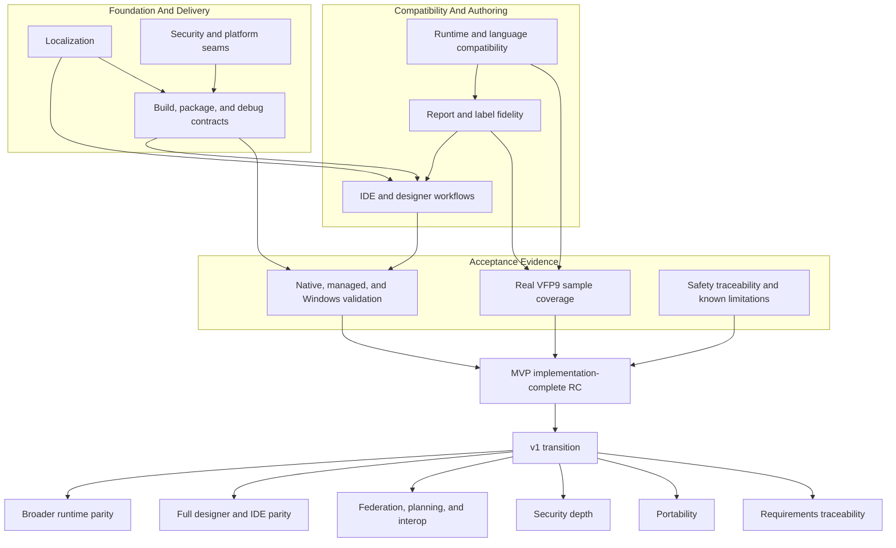

# Roadmap

The Copperfin roadmap is organized as a completion tree rather than a fixed
issue sequence. The top-level product objective is an implementation-complete,
Windows-first MVP release candidate. The v1 roadmap begins after the complete
MVP tree has passed its implementation acceptance criteria.

This document is durable roadmap guidance. It intentionally does not list
individual issue numbers or claim percentage completion. Live issue state,
focused tests, and release artifacts provide the detailed evidence for each
workstream.

## Completion Model

Each workstream has a subgoal tree with observable acceptance criteria:

1. Choose the highest-value unfinished subgoal using current evidence,
   compatibility risk, blockers, and user-visible impact.
2. Implement one small, independently verifiable slice.
3. Run focused regression tests and the relevant broader validation.
4. Record durable constraints and evidence in the appropriate progress or
   handoff document.
5. Mark the subgoal complete only when its implementation and required tests
   pass.

Completed workstreams are not revisited unless a regression, new compatibility
evidence, or release-validation failure creates a new acceptance gap.

The shared designer-interaction and report/label implementation trees are
complete at the current MVP fidelity. Their remaining hosted Windows,
Visual Studio, and mounted-VFP9 checks are release evidence gates, not reasons
to reopen completed implementation slices.

## MVP Workstreams

### Report And Label Fidelity

Complete section-aware FRX/LBX editing in the shared designer model:

- root settings, bands, grouping, sorting, and placed objects
- geometry, sizing, positioning, expressions, fonts, and preview metadata
- safe no-op, supported-property, delete/restore, and unsupported-data
  round trips
- identical behavior in standalone Studio and the Visual Studio host, with
  shell-specific chrome kept outside the shared model
- stable host JSON with invariant machine fields and optional display fields

The implementation is complete for the current MVP fidelity. Hosted Windows
validation with real VFP9 samples remains part of the acceptance evidence.

### Localization

Route user-facing native, managed, VSIX, Studio, runtime, diagnostic, and
packaging text through the catalog system. Preserve invariant parser tokens,
diagnostic identities, JSON fields, schema keys, enum values, and runtime
identifiers. Maintain key parity, fallback behavior, pseudo-localization,
placeholder preservation, and Unicode round trips for the supported catalogs.

All new user-facing work is localized by default. Additional translations are
separate content work after the catalog and layout contracts are stable.

### IDE And Designer Workflows

Complete the Windows-first open/edit/build/run/debug path for PJX, PRG, SCX,
VCX, FRX, LBX, and MNX startup assets. The shared designer model must support
the same behavior in standalone Studio and the VSIX. Stabilize the MVP utility
surfaces needed for repeated work: debugger, task list, references, data
explorer, object browser, toolbox/builders, coverage, database, and
security/extensibility summaries.

The shared E2 interaction and builder implementation is complete; remaining
IDE work is the separately owned shell, hosted Visual Studio, and standalone
product-grade surface work described by the live MVP tree.

### Runtime And Language Compatibility

Expand VFP9-compatible command, function, object, property, method, and event
behavior using real VFP9 behavior or shipped documentation. Keep PRG execution
stack-frugal and preserve the iterative frame-machine constraints. Track
deliberate fallbacks and unsupported behavior in the runtime stub inventory;
never treat a no-op as completed compatibility.

### Build, Package, And Debug Contracts

Formalize and preserve versioned `app.cfmanifest` and `app.cfdebug` contracts,
staged executable sidecars, source/debug path provenance, and deterministic
package content. Complete the MVP xAsset lifecycle needed for forms/classes,
menus, reports/labels, event-loop behavior, runtime faults, and debugger
recovery.

### Security And Platform Seams

Keep package trust, external-process policy, file-handle binding, secrets,
extension trust, audit, and AI/MCP boundaries explicit and fail-closed where
required. Preserve portable native seams while giving Windows-first behavior
the evidence needed for the MVP release candidate. macOS and Linux standalone
host parity follows the MVP boundary where practical and is expanded in v1.

### RC And Release Evidence

Implementation completion of every MVP workstream is RC readiness. Release
evidence follows that gate and includes:

- native CMake/CTest and platform validation
- Windows VSIX, standalone Studio, designer, runtime, package, and debugger
  smoke tests
- real VFP9 sample validation
- installer and VSIX artifacts
- safety traceability validation and archived evidence
- known limitations and compatibility exceptions

## v1 Roadmap

After MVP implementation completion and release evidence review, continue in
this order:

1. Broaden runtime parity from validated VFP9 behavior and shipped docs.
2. Mature forms/classes, menus, reports/labels, builders, project management,
   property grids, toolbox, object browser, data explorer, and coverage into
   full authoring workflows.
3. Add deterministic SQL federation, then document/vector planning, then
   first-class .NET runtime interop beyond launcher stubs.
4. Deepen RBAC, policy profiles, audit, secrets, signing, process controls,
   extension trust, and AI/MCP boundaries.
5. Port standalone/core host behavior to macOS and Linux while preserving the
   portable native contracts.
6. Build the requirements-to-code-to-test traceability matrix from validated
   VFP9 behavior, shipped documentation, and documented Copperfin exceptions.

## Phase And Topic Map

This map is a durable view of the project tree. It describes relationships and
completion gates, not a queue or a promise that every topic is implemented.

## Documentation Ownership

- This file owns the durable roadmap, completion model, and phase/topic map.
- Architecture and reference documents describe stable product boundaries and
  compatibility rules; they should remain issue-neutral where possible.
- `agent-handoff.md` and progress documents record current evidence and may
  reference specific issues, commits, tests, and hosted runs.
- `CHANGELOG.md` records shipped behavior and durable constraints.
- `remaining-work.md` is deprecated and must not become a second roadmap.
