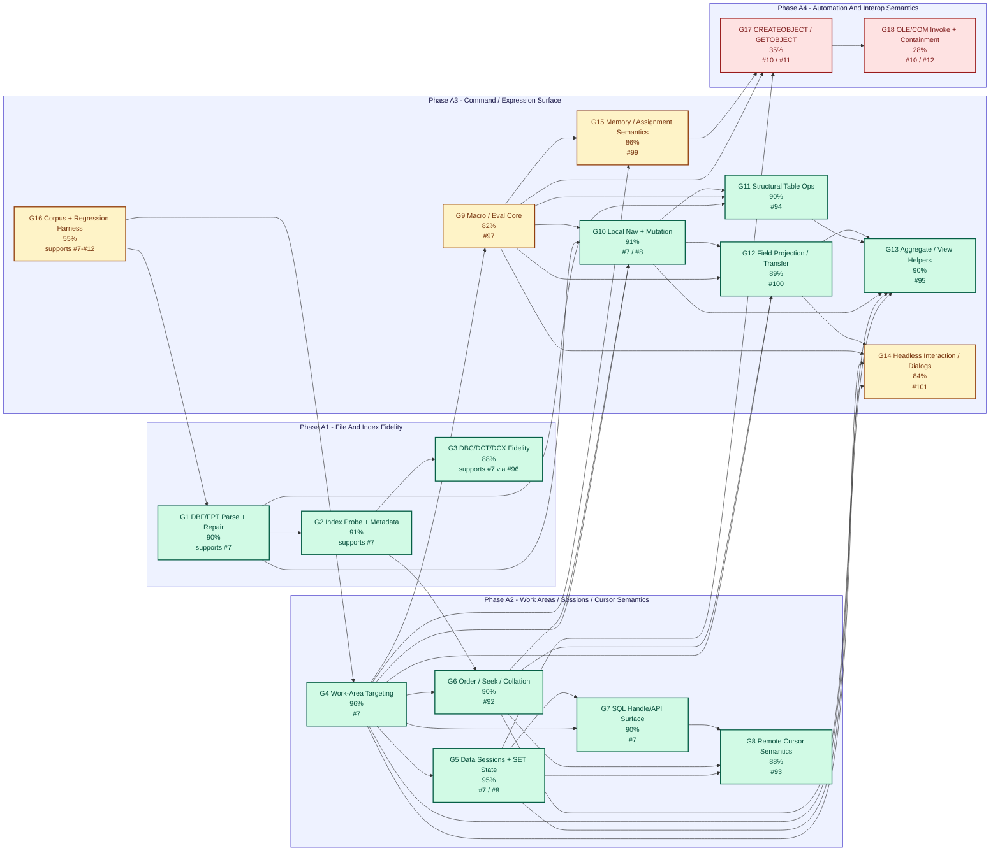
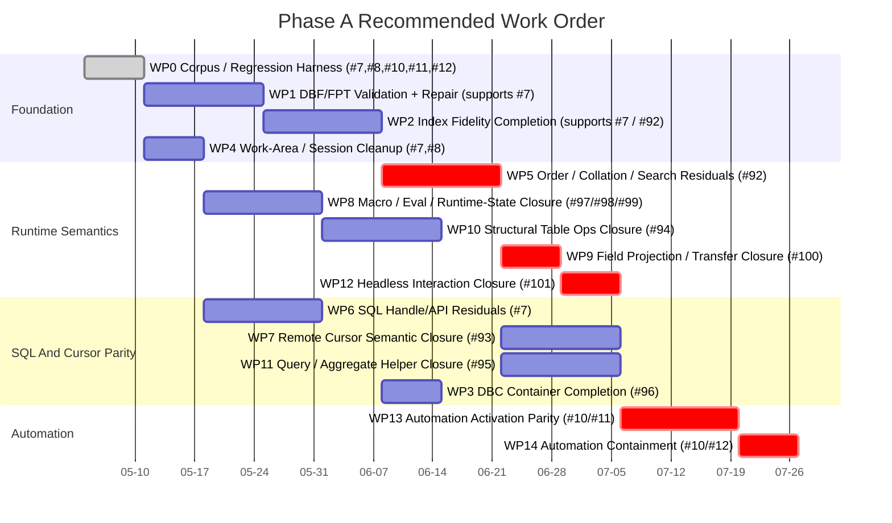
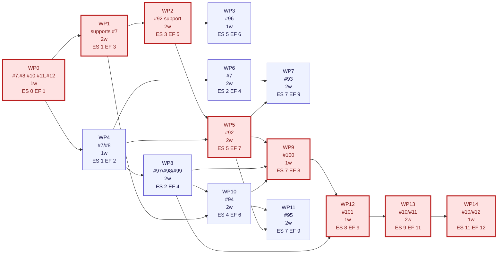

# Phase A Dependency Breakdown

This document expands Phase A of [remaining-work.md](/home/rich/dev/Project-Copperfin/remaining-work.md:306) into a deeper dependency model so the next implementation slices can be chosen in the right order.

It is intentionally narrower than the top-level roadmap:

- scope: Phase A only
- granularity: command/function groups and runtime engine seams
- purpose: decide what to finish first, what can run in parallel, and what is actually on the critical path

## Reading Notes

- Top-level percentages for Phase A areas come directly from [remaining-work.md](/home/rich/dev/Project-Copperfin/remaining-work.md:291).
- Group-level percentages below are inferred planning estimates based on the current backlog text, recent progress notes, and shipped test coverage. They are not yet first-class roadmap metrics.
- The dependency edges are pragmatic engineering dependencies, not strict architectural laws. They answer "what should be finished first if the goal is fastest safe progress toward VFP parity?"
- The CPM section uses longest-path logic over a directed acyclic prerequisite graph. Dijkstra's algorithm is not needed here because this is a precedence-scheduling problem rather than a shortest-path routing problem.

## Phase A Areas

| Phase A Area | Top-Level Progress | Main Risk Still Open |
| --- | --- | --- |
| A1. File and index fidelity | 92-95% | repair breadth, edge-case metadata, and runtime consumption gaps |
| A2. Work areas, sessions, and cursor semantics | 90-96% | richer order/collation/search behavior and remote/result-cursor parity |
| A3. Command and expression surface | 82% | remaining issue `#7` / `#8` command-surface and macro/eval fidelity |
| A4. Automation and interop semantics | ~41% | OLE/COM parity depth and host-failure containment under `#10`, `#11`, and `#12` |

## Command/Function Group Dependency Table

| ID | Group | Linked Issues | Est. Progress | Representative Commands / Functions | Depends On | Primarily Unblocks | Why It Matters Now |
| --- | --- | --- | --- | --- | --- | --- | --- |
| G1 | DBF/FPT parse, validation, and repair | supports `#7` | 90% | DBF/FPT readers, memo decoding, structured asset validation | none | G2, G3, G10, G11 | This is the storage truth layer; if it is wrong, everything above it is noisy. |
| G2 | Index probe fidelity and runtime metadata | supports `#7` | 91% | `CDX`, `DCX`, `IDX`, `NDX`, `MDX`, tag key/`FOR` extraction, normalization hints | G1 | G6, G7, G12, G13 | Search/order parity depends on accurate key expressions, direction, and collation hints. |
| G3 | DBC/DCT/DCX container fidelity | supports `#7` | 88% | DBC object extraction, companion discovery, catalog previews | G1, G2 | later project/runtime surfaces, richer metadata inputs | Near completion; cheap to finish and reduces later heuristics. |
| G4 | Work-area selection and alias targeting | `#7` | 96% | `SELECT`, `USE`, `USE AGAIN`, `USE IN`, `SELECT(0)`, expression-driven `IN` targets | G1 | G5, G6, G9, G10, G11, G12, G13, G14 | Almost every runtime command family assumes this is stable. |
| G5 | Data-session isolation and session-local state | `#7`, `#8` | 95% | `SET DATASESSION`, `SET DEFAULT TO`, session-local `SET()` state, session-local SQL handles | G4 | G8, G13, G14, G15 | Host/runtime parity collapses quickly if session boundaries leak. |
| G6 | Order, seek, and collation semantics | `#7` | 90% | `SET ORDER`, `SEEK`, `SEEK()`, `INDEXSEEK()`, `FOUND()`, `SET NEAR`, tag-expression evaluation | G2, G4 | G10, G11, G12, G13 | This is the main seam between index metadata and FoxPro-visible cursor behavior. |
| G7 | SQL pass-through handle and metadata API | `#7` | 90% | `SQLCONNECT`, `SQLSTRINGCONNECT`, `SQLEXEC`, `SQLPREPARE`, `SQLGETPROP`, `SQLSETPROP`, `SQLTABLES`, `SQLCOLUMNS`, `SQLDATABASES`, `SQLPRIMARYKEYS`, `SQLFOREIGNKEYS`, `SQLCOMMIT`, `SQLROLLBACK`, `SQLCANCEL` | G4, G5 | G8 | The connection/session layer is already strong enough that the remaining work should stay incremental, not disruptive. |
| G8 | Remote and result-cursor semantics | `#7` | 88% | remote cursor navigation, filtering, ordering, `APPEND BLANK`, `REPLACE`, `DELETE`, `RECALL`, targeted `IN` behavior on SQL result cursors | G4, G5, G6, G7 | Phase A closure for A2, later federation/runtime parity | This is where local cursor behavior and SQL pass-through meet. |
| G9 | Macro/eval core and expression compatibility | `#8` | 82% | `EVAL()`, `SET()`, `&macro`, `TEXTMERGE()`, `EXECSCRIPT()`, `TYPE()`, `TRANSFORM()`, macro indirection, macro-expanded identifiers | G4, G5 | G10, G11, G12, G13, G14, G15 | This remains one of the highest leverage remaining lanes for issue `#8`. |
| G10 | Local record navigation and mutation | `#7`, `#8` | 91% | `GO`, `SKIP`, `LOCATE`, `SCAN`, `REPLACE`, `APPEND BLANK`, `DELETE`, `RECALL`, `UNLOCK RECORD` | G1, G4, G6, G9 | G11, G12, G13 | Strong already, but still a shared prerequisite for deeper parity slices above it. |
| G11 | Structural table and import/export operations | `#7`, `#8` | 90% | `CREATE TABLE`, `ALTER TABLE`, `PACK`, `PACK MEMO`, `ZAP`, `APPEND FROM`, `COPY TO`, journaling-backed mutation paths | G1, G4, G9, G10 | corpus confidence, storage parity, data-migration flows | This is the last broad correctness seam in local DBF mutation workflows. |
| G12 | Field projection and data-transfer surface | `#7`, `#8` | 89% | `SCATTER`, `GATHER`, `SET FIELDS`, `BROWSE`, `EDIT`, `CHANGE`, `COPY TO ARRAY`, `APPEND FROM ARRAY`, `FIELDS LIKE/EXCEPT` | G4, G6, G9, G10 | G13, issue `#7` closure | Recently deepened; remaining work here should be narrow and correctness-driven. |
| G13 | Aggregate, lookup, and record-view helpers | `#7` | 90% | `COUNT`, `SUM`, `AVG`, `MIN`, `MAX`, `CALCULATE`, `TOTAL`, `LOOKUP`, `DISPLAY`, `LIST` | G4, G6, G10, G12 | host/report/runtime parity, diagnostics, issue `#7` closure | Mostly close; good candidate for quick closure after upstream blockers are done. |
| G14 | Headless interaction and dialog command surface | `#7`, `#8` | 84% | `WAIT`, `KEYBOARD`, `INPUT`, `ACCEPT`, `GETFILE`, `PUTFILE`, `GETDIR`, `INPUTBOX`, runtime event payloads | G4, G5, G9, G12 | host integration parity, remaining command-surface work | Already much better; remaining work should focus on edge-case clauses and macro fidelity. |
| G15 | Memory-variable and assignment semantics | `#8`, `#11` | 86% | `PUBLIC`, `PRIVATE`, `RELEASE`, `STORE`, array macro names, `DISPLAY/LIST MEMORY` | G4, G5, G9 | G12, G13, G14, A4 work | This is one of the hidden foundations under command-surface parity. |
| G16 | Compatibility corpus and regression harness | supports `#7`, `#8`, `#10`, `#11`, `#12` | 55% | VFP-tree corpus, legacy samples, regression fixtures, focused runtime test expansion | G1, G4 | all groups | This is not a runtime feature, but it is one of the best multipliers for finishing the remaining 10-20% safely. |
| G17 | Automation object activation parity | `#10`, `#11` | 35% | `CREATEOBJECT()`, `GETOBJECT()` | G5, G9, G15 | G18, later interop/runtime parity | This is the visible front door for A4 and still shallow. |
| G18 | Automation property/method behavior and containment | `#10`, `#12` | 28% | OLE/COM property access, method invocation, automation-failure isolation | G17 | Phase A closure, later host safety work | This is the deepest unfinished Phase A lane and should be sequenced after command/macro foundations are steadier. |

## Dependency Table By Recommended Work Package

This is the actionable version of the graph. It groups the above command/function clusters into deliverable slices.

| WP | Work Package | Linked Issues | Duration (Weeks) | Primary Groups | Prerequisites | Expected Output |
| --- | --- | --- | --- | --- | --- | --- |
| WP0 | Corpus and regression harness expansion | `#7`, `#8`, `#10`, `#11`, `#12` | 1 | G16 | none | broader fixture map, missing-edge inventory, faster slice validation |
| WP1 | DBF/FPT validation and repair completion | mostly `#7` | 2 | G1 | WP0 | finish repair/validation gaps in core storage path |
| WP2 | Index fidelity completion | mostly `#7` | 2 | G2 | WP1 | close remaining tag-expression, collation, and index-metadata/runtime seams |
| WP3 | DBC container completion | mostly `#7` | 1 | G3 | WP1, WP2 | close container/object-extraction and companion-resolution gaps |
| WP4 | Work-area and session residual cleanup | `#7`, `#8` | 1 | G4, G5 | WP0 | remove remaining targeting/session edge cases before higher-surface work |
| WP5 | Order/collation/search residuals | `#7` | 2 | G6 | WP2, WP4 | finish the remaining seek/order/collation behaviors that many commands inherit |
| WP6 | SQL handle/API residuals | `#7` | 2 | G7 | WP4 | finish stable connection/property/catalog semantics without disturbing cursor behavior |
| WP7 | Remote/result-cursor semantic closure | `#7` | 2 | G8 | WP5, WP6 | align SQL result-cursor behavior more closely with local cursor semantics |
| WP8 | Macro/eval/runtime-state closure | `#8` | 2 | G9, G15 | WP4 | drive issue `#8` down before more command-surface polishing |
| WP9 | Field-projection and data-transfer closure | `#7`, `#8` | 1 | G12 | WP5, WP8, WP10 | finish narrow `SCATTER`/`GATHER`/`FIELDS`/array transfer seams |
| WP10 | Local structural table-operation closure | `#7`, `#8` | 2 | G10, G11 | WP1, WP4, WP8 | finish the remaining local mutation/import/export correctness seams |
| WP11 | Query/aggregate and helper closure | `#7` | 2 | G10, G13 | WP5, WP10 | finish aggregate/view/helper behavior on top of stable cursor semantics |
| WP12 | Headless interaction/display closure | `#7`, `#8` | 1 | G13, G14 | WP8, WP9 | finish host-visible command/event fidelity after macro and field semantics settle |
| WP13 | Automation activation parity | `#10`, `#11` | 2 | G17 | WP8, WP12 | deepen `CREATEOBJECT()` / `GETOBJECT()` behavior on a steadier runtime base |
| WP14 | Automation containment and fault behavior | `#10`, `#12` | 1 | G18 | WP13 | finish A4 host-safety semantics around automation failure paths |

## Dependency Graph

## Recommended Order

The recommended order is not simply "lowest percentage first." It is:

1. finish the storage and search seams that everything else inherits
2. close the remaining macro/eval/runtime-state seams before polishing more commands
3. finish command groups that sit on those two foundations
4. leave OLE/COM deepening until the runtime/memory/macro base is less noisy

That produces this practical order:

1. `WP0` corpus and regression harness expansion
2. `WP1` DBF/FPT validation and repair completion
3. `WP2` index fidelity completion
4. `WP4` work-area and session residual cleanup
5. `WP5` order/collation/search residuals
6. `WP8` macro/eval/runtime-state closure
7. `WP10` local structural table-operation closure
8. `WP9` field-projection and data-transfer closure
9. `WP12` headless interaction/display closure
10. `WP6` SQL handle/API residuals
11. `WP7` remote/result-cursor semantic closure
12. `WP11` query/aggregate and helper closure
13. `WP3` DBC container completion
14. `WP13` automation activation parity
15. `WP14` automation containment and fault behavior

That sequence is slightly different from the raw dependency graph because it prioritizes:

- issue `#7` / `#8` closure before automation depth
- highest fan-out prerequisites before local polish
- near-complete lanes that can be closed cheaply once their upstream seams are stable

## Gantt Chart

This is a planning schedule, not a delivery promise. It assumes focused sequential attention on the critical path with parallel work only where dependencies are already clean.

## CPM Chart

The critical path below is the longest prerequisite chain for Phase A completion under the above work-package model.

Critical path:

- `WP0 -> WP1 -> WP2 -> WP5 -> WP9 -> WP12 -> WP13 -> WP14`
- issue path: `(#7/#8/#10/#11/#12 support) -> (#92) -> (#100) -> (#101) -> (#10/#11) -> (#12)`

Total critical-path duration:

- `12 weeks`

## First Things To Address

If the goal is "what should be handled first, concretely?", the answer is:

| Priority | First Slice | Why First |
| --- | --- | --- |
| 1 | corpus and fixture expansion around issue `#7` / `#8` leftovers | It lowers the cost of every later parity slice and reduces regression risk. |
| 2 | DBF/FPT validation and repair gaps | Storage correctness is still the deepest common dependency in Phase A. |
| 3 | remaining index-expression/collation/runtime-consumption gaps | Many command families still inherit their hardest parity bugs from this seam. |
| 4 | macro/eval/runtime-state closure | This is the highest-leverage remaining issue `#8` surface and still fans out into many commands. |
| 5 | local structural table-operation residuals | These still touch correctness, rollback, persistence, and import/export behavior. |
| 6 | narrow field-projection and headless command residuals | These are close to done, but should be finished after search and macro foundations are steadier. |
| 7 | automation activation and containment | Important, but lower ROI until the runtime base underneath it is quieter. |

## Issue Hierarchy

GitHub issue hierarchy is now in use for the remaining Phase A work. Repo-wide top-level umbrella issues are now `#108`-`#114`, and within the active runtime tree `#7` and `#8` remain the A3 umbrella issues whose durable lane issues exist as real sub-issues.

Current structure under `#7`:

| Parent | Sub-Issue | Maps To |
| --- | --- | --- |
| `#7` | `#92` Finish residual order/collation/search parity | G6 / WP5 |
| `#7` | `#93` Finish remote/result-cursor behavior parity | G8 / WP7 |
| `#7` | `#94` Finish structural table-operation parity | G10-G11 / WP10 |
| `#7` | `#95` Finish aggregate/view/helper command parity | G13 / WP11 |
| `#7` | `#96` Finish DBC/container and catalog fidelity | G3 / WP3 |

Current structure under `#8`:

| Parent | Sub-Issue | Maps To |
| --- | --- | --- |
| `#8` | `#97` Finish macro suffix/terminator and nested expansion semantics | G9 / WP8 |
| `#8` | `#98` Finish runtime-state normalization and `SET()` compatibility residuals | G5-G9 / WP8 |
| `#8` | `#99` Finish memory-variable, `PUBLIC`/`PRIVATE`/`RELEASE`, and assignment semantics | G15 / WP8 |
| `#8` | `#100` Finish field-transfer and macro-target data movement parity | G12 / WP9 |
| `#8` | `#101` Finish headless interaction macro/eval fidelity | G14 / WP12 |

Current active prompt-sized slice queue:

| Parent | Slice Issue | Intended Prompt Slice |
| --- | --- | --- |
| `#95` | `#119` | close one more aggregate/view/helper parity residual |
| `#95` | `#120` | close one more aggregate/view/helper parity residual |
| `#96` | `#121` | close one more DBC/container fidelity residual |
| `#96` | `#122` | close one more DBC/container fidelity residual |

Additional prompt-sized native slice queues now also exist under the adjacent active A3/A4 lanes:

- `#95`: `#119`, `#120`
- `#96`: `#121`, `#122`
- `#10`: `#131`, `#132`
- `#11`: `#133`, `#134`
- `#12`: `#135`, `#136`

Current dependency links:

- `#93` is blocked by `#92`
- `#95` is blocked by `#94`
- `#100` is blocked by `#97`
- `#10` is blocked by `#99`
- `#11` is blocked by `#99`

## Slice-Issue Policy

For the remaining Phase A runtime work, the implementation unit should be a prompt-sized issue rather than a broad umbrella issue.

- Keep `#7`, `#8`, and their lane issues (`#92`-`#101`) as planning and closure umbrellas.
- Keep the repo-root umbrella issues `#108`-`#114` as navigation/grouping roots rather than execution units.
- Keep milestones aligned to the same tree: `Root/#...` for repo umbrellas, `A3/#...` / `A4/#...` for active runtime lanes, and slice issues inheriting the milestone of their parent lane.
- Before starting code work, pick one open slice issue under the active lane, or create a new slice issue if the intended change does not fit an existing one.
- One implementation prompt should normally map to one slice issue, one focused validation loop, and one doc/handoff update.
- Close or retarget the slice issue when the prompt-sized implementation lands; do not hide shipped work only inside the broader lane issue body.

## Suggested Use

Use this document together with:

- [remaining-work.md](/home/rich/dev/Project-Copperfin/remaining-work.md:306)
- [docs/22-vfp-language-reference-coverage.md](/home/rich/dev/Project-Copperfin/docs/22-vfp-language-reference-coverage.md:1)

Operationally:

- pick work from the current critical path unless there is a very cheap near-complete lane to close
- avoid starting new A4 automation depth before the next A3 macro/eval slice is tighter
- treat G16 corpus expansion as a repeated enabling activity, not a one-time task
