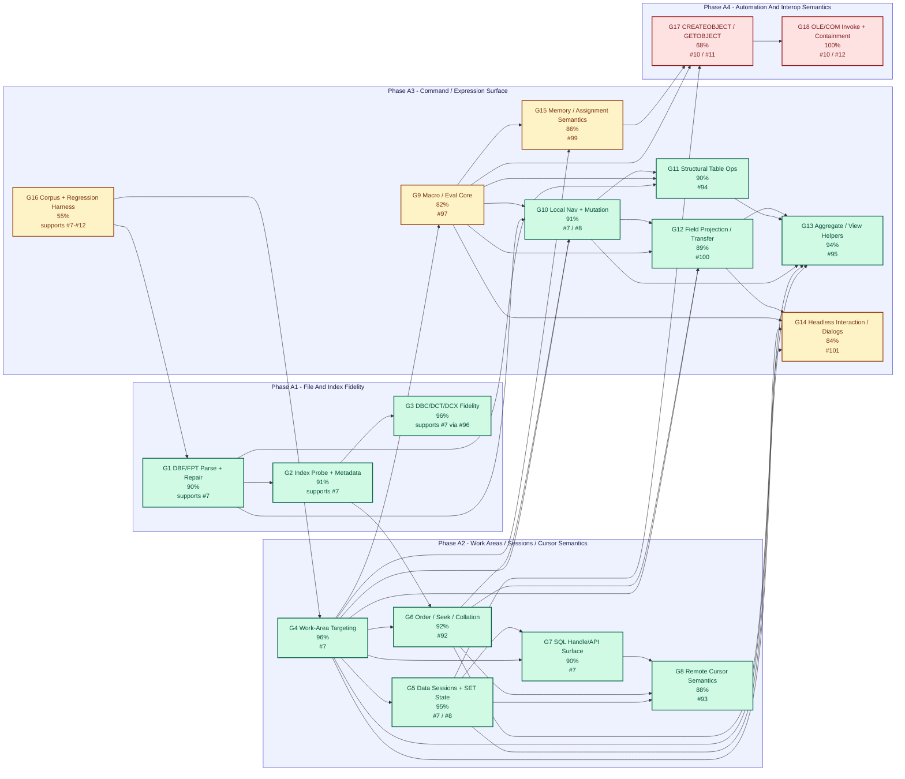
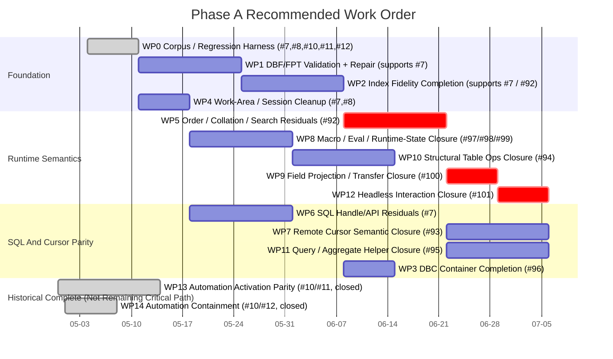
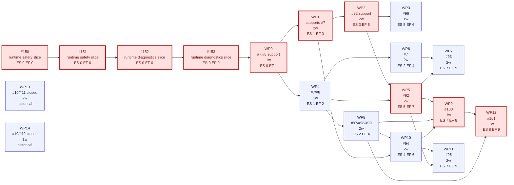

# Phase A Dependency Breakdown

This document began as a Phase A expansion of [remaining-work.md](/home/rich/dev/Project-Copperfin/remaining-work.md:306). Phase A is now closed; the live guidance retained here is the post-D1/E1 continuation queue, while the Phase A content is historical dependency evidence.

It is intentionally narrower than the top-level roadmap:

- scope: historical Phase A dependency evidence plus current post-D1/E1 continuation pointers
- granularity: command/function groups and runtime engine seams
- purpose: preserve the historical dependency reasoning and identify the current prompt-sized continuation lane

## Current Agent Directive

This is the only actionable queue in this file as of 2026-06-17.

- Phase A, D1/#19, and E1/#22 are closed. Do not reopen the old Phase A gate (`#150`-`#153`), runtime lanes (`#92`-`#101`), or shared design-model lane (`#22`) unless fresh issue evidence shows a regression.
- The live execution lane is E2/#23: designer interactions, builders, toolbox flows, and context-aware editors.
- Latest shipped E2 slice: `#1037`, which exposes host tab-stop-object commands by stable target selectors.
- Next work: pick an open prompt-sized child under `#23`, or create one before coding if no suitable child exists.
- Treat every section below this directive as historical evidence unless it explicitly appears in the "Current Active Queue" table.

## Reading Notes

- The Phase A percentages and dependency rows below are historical planning estimates. Do not use them as current completion metrics.
- The dependency edges are pragmatic engineering dependencies, not strict architectural laws. They explain why the Phase A runtime/storage order was chosen.
- The CPM section is historical closure evidence. It is not the current execution gate.
- Current execution guidance is summarized in "Current Agent Directive" and mirrored in the "Current Active Queue" table under "Issue Hierarchy"; create or pick a prompt-sized child there before writing code.

## Historical Phase A Areas

Phase A is closed. The rows below are retained only to explain the old dependency model that led to closure.

| Phase A Area | Historical Top-Level Progress | Closure Note |
| --- | --- | --- |
| A1. File and index fidelity | 92-95% | Historical storage/search risk model; do not treat as an active queue without fresh issue evidence. |
| A2. Work areas, sessions, and cursor semantics | 90-96% | Historical cursor/runtime risk model; old Phase A lane issues are closed. |
| A3. Command and expression surface | 82% | Historical `#7` / `#8` command-surface model; the old Phase A issue tree is closed. |
| A4. Automation and interop semantics | 100% | Historical OLE/COM closure model; broader host-safety depth moved to later runtime/debugger work. |

## Command/Function Group Dependency Table

| ID | Group | Linked Issues | Est. Progress | Representative Commands / Functions | Depends On | Primarily Unblocks | Why It Matters Now |
| --- | --- | --- | --- | --- | --- | --- | --- |
| G1 | DBF/FPT parse, validation, and repair | supports `#7` | 90% | DBF/FPT readers, memo decoding, structured asset validation | none | G2, G3, G10, G11 | This is the storage truth layer; if it is wrong, everything above it is noisy. |
| G2 | Index probe fidelity and runtime metadata | supports `#7` | 91% | `CDX`, `DCX`, `IDX`, `NDX`, `MDX`, tag key/`FOR` extraction, normalization hints | G1 | G6, G7, G12, G13 | Search/order parity depends on accurate key expressions, direction, and collation hints. |
| G3 | DBC/DCT/DCX container fidelity | supports `#7` | 88% | DBC object extraction, companion discovery, catalog previews | G1, G2 | later project/runtime surfaces, richer metadata inputs | Near completion; cheap to finish and reduces later heuristics. |
| G4 | Work-area selection and alias targeting | `#7` | 96% | `SELECT`, `USE`, `USE AGAIN`, `USE IN`, `SELECT(0)`, expression-driven `IN` targets | G1 | G5, G6, G9, G10, G11, G12, G13, G14 | Almost every runtime command family assumes this is stable. |
| G5 | Data-session isolation and session-local state | `#7`, `#8` | 95% | `SET DATASESSION`, `SET DEFAULT TO`, session-local `SET()` state, session-local SQL handles | G4 | G8, G13, G14, G15 | Host/runtime parity collapses quickly if session boundaries leak. |
| G6 | Order, seek, and collation semantics | `#7` | 92% | `SET ORDER`, `SEEK`, `SEEK()`, `INDEXSEEK()`, `FOUND()`, `SET NEAR`, tag-expression evaluation | G2, G4 | G10, G11, G12, G13 | This is the main seam between index metadata and FoxPro-visible cursor behavior. |
| G7 | SQL pass-through handle and metadata API | `#7` | 90% | `SQLCONNECT`, `SQLSTRINGCONNECT`, `SQLEXEC`, `SQLPREPARE`, `SQLGETPROP`, `SQLSETPROP`, `SQLTABLES`, `SQLCOLUMNS`, `SQLDATABASES`, `SQLPRIMARYKEYS`, `SQLFOREIGNKEYS`, `SQLCOMMIT`, `SQLROLLBACK`, `SQLCANCEL` | G4, G5 | G8 | The connection/session layer is already strong enough that the remaining work should stay incremental, not disruptive. |
| G8 | Remote and result-cursor semantics | `#7` | 88% | remote cursor navigation, filtering, ordering, `APPEND BLANK`, `REPLACE`, `DELETE`, `RECALL`, targeted `IN` behavior on SQL result cursors | G4, G5, G6, G7 | Phase A closure for A2, later federation/runtime parity | This is where local cursor behavior and SQL pass-through meet. |
| G9 | Macro/eval core and expression compatibility | `#8` | 82% | `EVAL()`, `SET()`, `&macro`, `TEXTMERGE()`, `EXECSCRIPT()`, `TYPE()`, `TRANSFORM()`, macro indirection, macro-expanded identifiers | G4, G5 | G10, G11, G12, G13, G14, G15 | This remains one of the highest leverage remaining lanes for issue `#8`. |
| G10 | Local record navigation and mutation | `#7`, `#8` | 91% | `GO`, `SKIP`, `LOCATE`, `SCAN`, `REPLACE`, `APPEND BLANK`, `DELETE`, `RECALL`, `UNLOCK RECORD` | G1, G4, G6, G9 | G11, G12, G13 | Strong already, but still a shared prerequisite for deeper parity slices above it. |
| G11 | Structural table and import/export operations | `#7`, `#8` | 90% | `CREATE TABLE`, `ALTER TABLE`, `PACK`, `PACK MEMO`, `ZAP`, `APPEND FROM`, `COPY TO`, journaling-backed mutation paths | G1, G4, G9, G10 | corpus confidence, storage parity, data-migration flows | This is the last broad correctness seam in local DBF mutation workflows. |
| G12 | Field projection and data-transfer surface | `#7`, `#8` | 89% | `SCATTER`, `GATHER`, `SET FIELDS`, `BROWSE`, `EDIT`, `CHANGE`, `COPY TO ARRAY`, `APPEND FROM ARRAY`, `FIELDS LIKE/EXCEPT` | G4, G6, G9, G10 | G13, issue `#7` closure | Recently deepened; remaining work here should be narrow and correctness-driven. |
| G13 | Aggregate, lookup, and record-view helpers | `#7` | 94% | `COUNT`, `SUM`, `AVG`, `MIN`, `MAX`, `CALCULATE`, `TOTAL`, `LOOKUP`, `DISPLAY`, `LIST` | G4, G6, G10, G12 | host/report/runtime parity, diagnostics, issue `#7` closure | Very close; aggregate event/state readback and SQL `LOOKUP()` parity are now locked down, leaving mainly DBC/container-adjacent closure work around this family. |
| G14 | Headless interaction and dialog command surface | `#7`, `#8` | 84% | `WAIT`, `KEYBOARD`, `INPUT`, `ACCEPT`, `GETFILE`, `PUTFILE`, `GETDIR`, `INPUTBOX`, runtime event payloads | G4, G5, G9, G12 | host integration parity, remaining command-surface work | Already much better; remaining work should focus on edge-case clauses and macro fidelity. |
| G15 | Memory-variable and assignment semantics | `#8`, `#11` | 86% | `PUBLIC`, `PRIVATE`, `RELEASE`, `STORE`, array macro names, `DISPLAY/LIST MEMORY` | G4, G5, G9 | G12, G13, G14, A4 work | This is one of the hidden foundations under command-surface parity. |
| G16 | Compatibility corpus and regression harness | supports `#7`, `#8`, `#10`, `#11`, `#12` | 55% | VFP-tree corpus, legacy samples, regression fixtures, focused runtime test expansion | G1, G4 | all groups | This is not a runtime feature, but it is one of the best multipliers for finishing the remaining 10-20% safely. |
| G17 | Automation object activation parity | `#10`, `#11` | 68% | `CREATEOBJECT()`, `GETOBJECT()`, `NEWOBJECT()` activation targeting and reuse | G5, G9, G15 | G18, later interop/runtime parity | The front door is materially deeper now; the remaining work is mostly containment and fault behavior. |
| G18 | Automation property/method behavior and containment | `#10`, `#12` | 100% | OLE/COM property access, method invocation, automation-failure isolation | G17 | Phase A closure, later host safety work | Phase A closure criteria are met; remaining host-safety depth belongs to Phase B runtime-fault work. |

## Historical Dependency Table By Recommended Work Package

This was the actionable version of the old Phase A graph. It is retained only as closure evidence and must not redirect agents away from the current E2/#23 queue.

| WP | Work Package | Linked Issues | Duration (Weeks) | Primary Groups | Prerequisites | Expected Output |
| --- | --- | --- | --- | --- | --- | --- |
| WP0 | Corpus and regression harness expansion | `#7`, `#8`, `#10`, `#11`, `#12` | 1 | G16 | none | broader fixture map, missing-edge inventory, faster slice validation |
| WP1 | DBF/FPT validation and repair completion | mostly `#7` | 2 | G1 | WP0 | finish repair/validation gaps in core storage path |
| WP2 | Index fidelity completion | mostly `#7` | 2 | G2 | WP1 | close remaining tag-expression, collation, and index-metadata/runtime seams |
| WP3 | DBC container completion | mostly `#7` | 1 | G3 | WP1, WP2 | close container/object-extraction and companion-resolution gaps |
| WP4 | Work-area and session residual cleanup | `#7`, `#8` | 1 | G4, G5 | WP0 | remove remaining targeting/session edge cases before higher-surface work |
| WP5 | Order/collation/search residuals | `#7` | 2 | G6 | WP2, WP4 | finish the remaining seek/order/collation behaviors that many commands inherit |
| WP6 | SQL handle/API residuals | `#7` | 2 | G7 | WP4 | finish stable connection/property/catalog semantics without disturbing cursor behavior |
| WP7 | Remote/result-cursor semantic closure | `#7` | 2 | G8 | WP5, WP6 | align SQL result-cursor behavior more closely with local cursor semantics |
| WP8 | Macro/eval/runtime-state closure | `#8` | 2 | G9, G15 | WP4 | drive issue `#8` down before more command-surface polishing |
| WP9 | Field-projection and data-transfer closure | `#7`, `#8` | 1 | G12 | WP5, WP8, WP10 | finish narrow `SCATTER`/`GATHER`/`FIELDS`/array transfer seams |
| WP10 | Local structural table-operation closure | `#7`, `#8` | 2 | G10, G11 | WP1, WP4, WP8 | finish the remaining local mutation/import/export correctness seams |
| WP11 | Query/aggregate and helper closure | `#7` | 2 | G10, G13 | WP5, WP10 | finish aggregate/view/helper behavior on top of stable cursor semantics |
| WP12 | Headless interaction/display closure | `#7`, `#8` | 1 | G13, G14 | WP8, WP9 | finish host-visible command/event fidelity after macro and field semantics settle |
| WP13 | Automation activation parity | `#10`, `#11` | 2 | G17 | WP8, WP12 | completed for Phase A; retained here as historical closure context |
| WP14 | Automation containment and fault behavior | `#10`, `#12` | 1 | G18 | WP13 | completed for Phase A; retained here as historical closure context |

## Dependency Graph

```mermaid
flowchart LR
    classDef green fill:#d1fae5,stroke:#065f46,stroke-width:2px,color:#064e3b;
    classDef amber fill:#fef3c7,stroke:#92400e,stroke-width:2px,color:#78350f;
    classDef red fill:#fee2e2,stroke:#991b1b,stroke-width:2px,color:#7f1d1d;
    classDef critical fill:#fee2e2,stroke:#b91c1c,stroke-width:3px,color:#7f1d1d;
    classDef lane fill:#eef2ff,stroke:#4338ca,stroke-width:1px,color:#1e1b4b;

    subgraph A1[Phase A1 - File And Index Fidelity]
        direction TB
        G1["G1 DBF/FPT Parse + Repair<br/>90%<br/>supports #7"]
        G2["G2 Index Probe + Metadata<br/>91%<br/>supports #7"]
        G3["G3 DBC/DCT/DCX Fidelity<br/>96%<br/>supports #7 via #96"]
    end

    subgraph A2[Phase A2 - Work Areas / Sessions / Cursor Semantics]
        direction TB
        G4["G4 Work-Area Targeting<br/>96%<br/>#7"]
        G5["G5 Data Sessions + SET State<br/>95%<br/>#7 / #8"]
        G6["G6 Order / Seek / Collation<br/>92%<br/>#92"]
        G7["G7 SQL Handle/API Surface<br/>90%<br/>#7"]
        G8["G8 Remote Cursor Semantics<br/>88%<br/>#93"]
    end

    subgraph A3[Phase A3 - Command / Expression Surface]
        direction TB
        G9["G9 Macro / Eval Core<br/>82%<br/>#97"]
        G10["G10 Local Nav + Mutation<br/>91%<br/>#7 / #8"]
        G11["G11 Structural Table Ops<br/>90%<br/>#94"]
        G12["G12 Field Projection / Transfer<br/>89%<br/>#100"]
        G13["G13 Aggregate / View Helpers<br/>94%<br/>#95"]
        G14["G14 Headless Interaction / Dialogs<br/>84%<br/>#101"]
        G15["G15 Memory / Assignment Semantics<br/>86%<br/>#99"]
        G16["G16 Corpus + Regression Harness<br/>55%<br/>supports #7-#12"]
    end

    subgraph A4[Phase A4 - Automation And Interop Semantics]
        direction TB
        G17["G17 CREATEOBJECT / GETOBJECT<br/>68%<br/>#10 / #11"]
        G18["G18 OLE/COM Invoke + Containment<br/>100%<br/>#10 / #12"]
    end

    G16 --> G1
    G16 --> G4

    G1 --> G2 --> G3
    G1 --> G10
    G1 --> G11

    G4 --> G5
    G4 --> G6
    G4 --> G7
    G4 --> G9
    G4 --> G10
    G4 --> G12
    G4 --> G13
    G4 --> G14
    G4 --> G15

    G2 --> G6
    G5 --> G7
    G5 --> G8
    G5 --> G14
    G5 --> G17

    G6 --> G8
    G6 --> G10
    G6 --> G12
    G6 --> G13

    G7 --> G8

    G9 --> G10
    G9 --> G11
    G9 --> G12
    G9 --> G14
    G9 --> G15
    G9 --> G17

    G10 --> G11
    G10 --> G12
    G10 --> G13

    G11 --> G13
    G12 --> G13
    G12 --> G14

    G15 --> G17
    G17 --> G18

    class G1,G2,G3,G4,G5,G6,G7,G8,G10,G11,G12,G13 green;
    class G9,G14,G15,G16 amber;
    class G17,G18 red;
    class A1,A2,A3,A4 lane;
```

## Historical Phase A Recommended Order

This order is retained as closure evidence only. It must not redirect agents away from the current active queue.

The historical recommended order was not simply "lowest percentage first." It was:

1. finish the storage and search seams that everything else inherits
2. close the remaining macro/eval/runtime-state seams before polishing more commands
3. finish command groups that sit on those two foundations
4. treat automation/OLE rows as historical-complete in Phase A closure ordering

That produced this historical Phase A practical order:

1. `#150`, `#151`, `#152`, `#153` runtime-safety/diagnostics slices (closed safety gate)
2. `WP0` corpus and regression harness expansion
3. `WP1` DBF/FPT validation and repair completion
4. `WP2` index fidelity completion
5. `WP4` work-area and session residual cleanup
6. `WP5` order/collation/search residuals (`#92`)
7. `WP8` macro/eval/runtime-state closure (`#97`, `#98`, `#99`)
8. `WP10` local structural table-operation closure (`#94`)
9. `WP9` field-projection and data-transfer closure (`#100`)
10. `WP12` headless interaction/display closure (`#101`)
11. `WP6` SQL handle/API residuals
12. `WP7` remote/result-cursor semantic closure (`#93`, blocked by `#92`)
13. `WP11` query/aggregate and helper closure (historical-closed lane `#95` context)
14. `WP3` DBC container completion (historical-closed lane `#96` context)

That sequence is slightly different from the raw dependency graph because it prioritizes:

- issue `#7` / `#8` closure before automation depth
- highest fan-out prerequisites before local polish
- near-complete lanes that can be closed cheaply once their upstream seams are stable

## Historical Gantt Chart

This is a historical planning schedule, not a delivery promise or current queue. It is retained only to explain the old Phase A ordering.

```mermaid
gantt
    title Phase A Recommended Work Order
    dateFormat  YYYY-MM-DD
    axisFormat  %m-%d

    section Foundation
    WP0 Corpus / Regression Harness (#7,#8,#10,#11,#12) :done, wp0, 2026-05-04, 1w
    WP1 DBF/FPT Validation + Repair (supports #7)       :wp1, after wp0, 2w
    WP2 Index Fidelity Completion (supports #7 / #92)   :wp2, after wp1, 2w
    WP4 Work-Area / Session Cleanup (#7,#8)             :wp4, after wp0, 1w

    section Runtime Semantics
    WP5 Order / Collation / Search Residuals (#92)      :crit, wp5, after wp2, 2w
    WP8 Macro / Eval / Runtime-State Closure (#97/#98/#99) :wp8, after wp4, 2w
    WP10 Structural Table Ops Closure (#94)             :wp10, after wp8, 2w
    WP9 Field Projection / Transfer Closure (#100)      :crit, wp9, after wp5, 1w
    WP12 Headless Interaction Closure (#101)            :crit, wp12, after wp9, 1w

    section SQL And Cursor Parity
    WP6 SQL Handle/API Residuals (#7)                   :wp6, after wp4, 2w
    WP7 Remote Cursor Semantic Closure (#93)           :wp7, after wp5, 2w
    WP11 Query / Aggregate Helper Closure (#95)        :wp11, after wp5, 2w
    WP3 DBC Container Completion (#96)                 :wp3, after wp2, 1w

    section Historical Complete (Not Remaining Critical Path)
    WP13 Automation Activation Parity (#10/#11, closed)   :done, wp13, 2026-04-30, 2w
    WP14 Automation Containment (#10/#12, closed)         :done, wp14, 2026-05-01, 1w
```

## CPM Chart

The critical path below is the longest prerequisite chain for Phase A completion under the above work-package model.

Historical critical path for Phase A work:

- `#150 -> #151 -> #152 -> #153 -> WP0 -> WP1 -> WP2 -> WP5 -> WP9 -> WP12`
- issue path: `(#13/#14 safety gate) -> (#7/#8 support) -> (#92) -> (#100) -> (#101)`

Historical critical-path duration estimate:

- `9 weeks` for WP0-WP12 plus runtime-safety slice execution (`#150`-`#153`); this path is closed in the current issue tracker.

```mermaid
flowchart LR
    classDef normal fill:#eef2ff,stroke:#4338ca,stroke-width:1px,color:#1e1b4b;
    classDef critical fill:#fee2e2,stroke:#b91c1c,stroke-width:3px,color:#7f1d1d;

    WP0["WP0<br/>#7,#8 support<br/>1w<br/>ES 0 EF 1"]
    S150["#150<br/>runtime safety slice<br/>ES 0 EF 0"]
    S151["#151<br/>runtime safety slice<br/>ES 0 EF 0"]
    S152["#152<br/>runtime diagnostics slice<br/>ES 0 EF 0"]
    S153["#153<br/>runtime diagnostics slice<br/>ES 0 EF 0"]
    WP1["WP1<br/>supports #7<br/>2w<br/>ES 1 EF 3"]
    WP2["WP2<br/>#92 support<br/>2w<br/>ES 3 EF 5"]
    WP3["WP3<br/>#96<br/>1w<br/>ES 5 EF 6"]
    WP4["WP4<br/>#7/#8<br/>1w<br/>ES 1 EF 2"]
    WP5["WP5<br/>#92<br/>2w<br/>ES 5 EF 7"]
    WP6["WP6<br/>#7<br/>2w<br/>ES 2 EF 4"]
    WP7["WP7<br/>#93<br/>2w<br/>ES 7 EF 9"]
    WP8["WP8<br/>#97/#98/#99<br/>2w<br/>ES 2 EF 4"]
    WP9["WP9<br/>#100<br/>1w<br/>ES 7 EF 8"]
    WP10["WP10<br/>#94<br/>2w<br/>ES 4 EF 6"]
    WP11["WP11<br/>#95<br/>2w<br/>ES 7 EF 9"]
    WP12["WP12<br/>#101<br/>1w<br/>ES 8 EF 9"]
    WP13["WP13<br/>#10/#11 closed<br/>2w<br/>historical"]
    WP14["WP14<br/>#10/#12 closed<br/>1w<br/>historical"]

    S150 --> S151 --> S152 --> S153 --> WP0
    WP0 --> WP1 --> WP2 --> WP3
    WP0 --> WP4
    WP2 --> WP5
    WP4 --> WP5
    WP4 --> WP6 --> WP7
    WP4 --> WP8
    WP8 --> WP10 --> WP11
    WP5 --> WP9 --> WP12
    WP8 --> WP9
    WP8 --> WP12
    WP1 --> WP10
    WP5 --> WP7
    WP10 --> WP9
    WP5 --> WP11

    class WP3,WP4,WP6,WP7,WP8,WP10,WP11,WP13,WP14 normal;
    class S150,S151,S152,S153,WP0,WP1,WP2,WP5,WP9,WP12 critical;
```

## Historical First Things Addressed

This table records the old Phase A priority rationale. It is not the current work queue.

| Priority | Historical Slice | Why It Was First |
| --- | --- | --- |
| 1 | corpus and fixture expansion around issue `#7` / `#8` leftovers | It lowers the cost of every later parity slice and reduces regression risk. |
| 2 | DBF/FPT validation and repair gaps | Storage correctness is still the deepest common dependency in Phase A. |
| 3 | remaining index-expression/collation/runtime-consumption gaps | Many command families still inherit their hardest parity bugs from this seam. |
| 4 | macro/eval/runtime-state closure | This is the highest-leverage remaining issue `#8` surface and still fans out into many commands. |
| 5 | local structural table-operation residuals | These still touch correctness, rollback, persistence, and import/export behavior. |
| 6 | narrow field-projection and headless command residuals | These are close to done, but should be finished after search and macro foundations are steadier. |
| 7 | remote/result-cursor and structural closure (`#93`, `#94`) after `#92/#97/#100/#101` chain | These are high-value finishers once critical dependencies are quiet. |

## Issue Hierarchy

GitHub issue hierarchy is now in use for ongoing work. Repo-wide top-level umbrella issues are `#108`-`#114`; the old Phase A runtime tree under `#7` and `#8` is closed and retained below as historical dependency evidence.

Historical-closed lane structure under `#7`:

| Parent | Sub-Issue | Maps To |
| --- | --- | --- |
| `#7` | `#92` Finish residual order/collation/search parity | G6 / WP5 |
| `#7` | `#93` Finish remote/result-cursor behavior parity | G8 / WP7 |
| `#7` | `#94` Finish structural table-operation parity | G10-G11 / WP10 |

Historical-closed lane structure under `#7`:

| Parent | Sub-Issue | Maps To |
| --- | --- | --- |
| `#7` | `#95` Finish aggregate/view/helper command parity | G13 / WP11 |
| `#7` | `#96` Finish DBC/container and catalog fidelity | G3 / WP3 |

Historical-closed lane structure under `#8`:

| Parent | Sub-Issue | Maps To |
| --- | --- | --- |
| `#8` | `#97` Finish macro suffix/terminator and nested expansion semantics | G9 / WP8 |
| `#8` | `#98` Finish runtime-state normalization and `SET()` compatibility residuals | G5-G9 / WP8 |
| `#8` | `#99` Finish memory-variable, `PUBLIC`/`PRIVATE`/`RELEASE`, and assignment semantics | G15 / WP8 |
| `#8` | `#100` Finish field-transfer and macro-target data movement parity | G12 / WP9 |
| `#8` | `#101` Finish headless interaction macro/eval fidelity | G14 / WP12 |

## Current Active Queue

Current active-open prompt-sized slice queue after Phase A/D1/E1 closure:

| Parent | Slice Issue | Intended Prompt Slice |
| --- | --- | --- |
| `#23` | open next child | continue designer interaction, builder, and context-aware editor fidelity after `#1037` |

Historical-closed prompt-sized native slice queues:

- `#96`: `#121`, `#122`
- `#10`: `#131`, `#132`
- `#11`: `#133`, `#134`
- `#12`: `#135`, `#136`
- `#13`: `#142`, `#143`
- `#14`: `#144`, `#145`
- `#13`: `#150`, `#151`
- `#14`: `#152`, `#153`
- `#95`: `#146`, `#147`, `#148`, `#149`

Adjacent prompt-sized native slice queues:

- `#22`: closure audit complete after `#729`; all prompt-sized shared design-model children `#658`-`#729` are closed
- `#23`: `#1037` is shipped; continue by opening the next prompt-sized designer interaction/builder/context-aware editor child if no open child remains
- broader repo execution leaves are now also pre-split beyond Phase A under `#22`-`#43`, `#57`, and `#91`; this document now points to the live post-D1 blocker path

Historical post-D1 execution order through the current E2 queue:

The numbered list below is retained as closure evidence for the completed D1/E1 and E2 child-issue sweep. It is **not** the current execution queue. For active work, use the table above and create the next prompt-sized child under `#23` unless the issue tracker shows a higher-weight blocker.

1. `#658`
2. `#659`
3. `#660`
4. `#661`
5. `#662`
6. `#663`
7. `#664`
8. `#665`
9. `#666`
10. `#667`
11. `#668`
12. `#669`
13. `#670`
14. `#671`
15. `#672`
16. `#673`
17. `#674`
18. `#675`
19. `#676`
20. `#677`
21. `#678`
22. `#679`
23. `#680`
24. `#681`
25. `#682`
26. `#683`
27. `#684`
28. `#685`
29. `#686`
30. `#687`
31. `#688`
32. `#689`
33. `#690`
34. `#691`
35. `#692`
36. `#693`
37. `#694`
38. `#695`
39. `#696`
40. `#697`
41. `#698`
42. `#699`
43. `#700`
44. `#701`
45. `#702`
46. `#703`
47. `#704`
48. `#705`
49. `#706`
50. `#707`
51. `#708`
52. `#709`
53. `#710`
54. `#711`
55. `#712`
56. `#713`
57. `#714`
58. `#715`
59. `#716`
60. `#717`
61. `#718`
62. `#719`
63. `#720`
64. `#721`
65. `#722`
66. `#723`
67. `#724`
68. `#725`
69. `#726`
70. `#727`
71. `#728`
72. `#729`
73. close `#22`
74. `#730`
75. `#731`
76. `#732`
77. `#733`
78. `#734`
79. `#735`
80. `#736`
81. `#737`
82. `#738`
83. `#739`
84. `#740`
85. `#741`
86. `#742`
87. `#743`
88. `#744`
89. `#745`
90. `#746`
91. `#747`
92. `#748`
93. `#749`
94. `#750`
95. `#751`
96. `#752`
97. `#753`
98. `#754`
99. `#755`
100. `#756`
101. `#757`
102. `#758`
103. `#759`
104. `#760`
105. `#761`
106. `#762`
107. `#763`
108. `#764`
109. `#765`
110. `#766`
111. `#767`
112. `#768`
113. `#769`
114. `#770`
115. `#771`
116. `#772`
117. `#773`
118. `#774`
119. `#775`
120. `#776`
121. `#777`
122. `#778`
123. `#779`
124. `#780`
125. `#781`
126. `#782`
127. `#783`
128. `#784`
129. `#785`
130. `#786`
131. `#787`
132. `#788`
133. `#789`
134. `#790`
135. `#791`
136. `#792`
137. `#793`
138. `#794`
139. `#795`
140. `#796`
141. `#797`
142. `#798`
143. `#799`
144. `#800`
145. `#801`
146. `#802`
147. `#803`
148. `#804`
149. `#805`
150. `#806`
151. `#807`
152. `#808`
153. `#809`
154. `#810`
155. `#811`
156. `#812`
157. `#813`
158. `#814`
159. `#815`
160. `#816`
161. `#817`
162. `#818`
163. `#819`
164. `#820`
165. `#821`
166. `#822`
167. `#823`
168. `#824`
169. `#825`
170. `#826`
171. `#827`
172. `#828`
173. `#829`
174. `#830`
175. `#831`
176. `#832`
177. `#833`
178. `#834`
179. `#835`
180. `#836`
181. `#837`
182. `#838`
183. `#839`
184. `#840`
185. `#841`
186. `#842`
187. `#843`
188. `#844`
189. `#845`
190. `#846`
191. `#847`
192. `#848`
193. `#849`
194. `#850`
195. `#851`
196. `#852`
197. `#853`
198. `#854`
199. `#855`
200. `#856`
201. `#857`
202. `#858`
203. `#859`
204. `#860`
205. `#861`
206. `#862`
207. `#863`
208. `#864`
209. `#865`
210. `#866`
211. `#867`
212. `#868`
213. `#869`
214. `#870`
215. `#871`
216. `#872`
217. `#873`
218. `#874`
219. `#875`
220. `#876`
221. `#877`
222. `#878`
223. `#879`
224. `#880`
225. `#881`
226. `#882`
227. `#883`
228. `#884`
229. `#885`
230. `#886`
231. `#887`
232. `#888`
233. `#889`
234. `#890`
235. `#891`
236. `#892`
237. `#893`
238. `#894`
239. `#895`
240. `#896`
241. `#897`
242. `#898`
243. `#899`
244. `#900`
245. `#901`
246. `#902`
247. `#903`
248. `#904`
249. `#905`
250. `#906`
251. `#907`
252. `#908`
253. `#909`
254. `#910`
255. `#911`
256. `#912`
257. `#913`
258. `#914`
259. `#915`
260. `#916`
261. `#917`
262. `#918`
263. `#919`
264. `#920`
265. `#921`
266. `#922`
267. `#923`
268. `#924`
269. `#925`
270. `#926`
271. `#927`
272. `#928`
273. `#929`
274. `#930`
275. `#931`
276. `#932`
277. `#933`
278. `#934`
279. `#935`
280. `#936`
281. `#937`
282. `#938`
283. `#939`
284. `#940`
285. `#941`
286. `#942`
287. `#943`
288. `#944`
289. `#945`
290. `#946`
291. `#947`
292. `#948`
293. `#949`
294. `#950`
295. `#951`
296. `#952`
297. `#953`
298. `#954`
299. `#955`
300. `#956`
301. `#957`
302. `#958`
303. `#959`
304. `#960`
305. `#961`
306. `#962`
307. `#963`
308. `#964`
309. `#965`
310. `#966`
311. `#967`
312. `#968`
313. `#969`
314. `#970`
315. `#971`
316. `#972`
317. `#973`
318. `#974`
319. `#975`
320. `#976`
321. `#977`
322. `#978`
323. `#979`
324. `#980`
325. `#981`
326. `#982`
327. `#983`
328. `#984`
329. `#985`
330. `#986`
331. `#987`
332. `#988`
333. `#989`
334. `#990`
335. `#991`
336. `#992`
337. `#993`
338. `#994`
339. `#995`
340. `#996`
341. `#997`
342. `#998`
343. `#999`
344. `#1000`
345. `#1001`
346. `#1002`
347. `#1003`
348. `#1004`
349. `#1005`
350. `#1006`
351. `#1007`
352. `#1008`
353. `#1009`
354. `#1010`
355. `#1011`
356. `#1012`
357. `#1013`
358. `#1014`
359. `#1015`
360. `#1016`
361. `#1017`
362. `#1018`
363. `#1019`
364. `#1020`
365. `#1021`
366. `#1022`
367. `#1023`
368. `#1024`
369. `#1025`
370. `#1026`
371. `#1027`
372. `#1028`
373. `#1029`
374. `#1030`
375. `#1031`
376. `#1032`
377. `#1033`
378. `#1034`
379. `#1035`
380. `#1036`
381. `#1037`

Execution guardrails:

- treat "coverage advanced" notes as progress evidence, not issue-closure evidence
- keep work tied to an open prompt-sized child; create the next child under the active umbrella before coding when none exists

Historical dependency links:

- `#93` was blocked by `#92`; both are now closed
- `#100` was blocked by `#97`; both are now closed
- historical note: `#10` and `#11` previously depended on `#99` and are now closed
- 2026-05-12 historical execution note: `#150` implementation slice advanced in code/test (fault data-session + cursor snapshot restoration across `RETRY`/`RESUME`/ON ERROR unwind); the gate then proceeded to `#151`, and both are now closed.
- 2026-05-12 historical execution note: `#151` implementation slice advanced in focused tests (non-default data-session repeated-`CONTINUE` stability); the gate then proceeded to `#152`, and both are now closed.
- 2026-05-12 historical execution note: `#152` implementation slice advanced in focused tests (repeated nested-fault caller-frame metadata refresh); the gate then proceeded to `#153`, and both are now closed.
- 2026-05-12 historical execution note: `#153` implementation slice advanced in focused tests (repeated-fault diagnostic normalization refresh); the gate then proceeded to `#92`, and both are now closed.
- 2026-05-12 historical execution note: `#98` implementation slice advanced in focused tests (`SET()` option readback/isolation for `FDOW`/`FWEEK`/`POINT`/`SEPARATOR`/`CURRENCY`); the old strict gate order then proceeded through closed `#99` and `#100` work.
- 2026-05-12 historical execution note: `#99` implementation slice advanced in focused tests (`RELEASE ALL` with `PRIVATE` shadow restoration semantics); the old strict gate order then proceeded through closed `#100` work.
- 2026-05-12 historical execution note: `#101` implementation slice advanced in focused tests (`INPUT`/`ACCEPT` `TO LOCAL` target-scope fidelity in headless mode); the old strict gate order then proceeded through closed `#93` work.
- 2026-05-12 historical execution note: `#93` implementation slice advanced in focused tests (`COPY TO ... TYPE JSON` selected SQL/result cursor export parity + pointer/alias preservation); the old strict gate order then proceeded through closed `#94` work.
- 2026-05-12 historical execution note: `#94` implementation slice advanced in focused tests (`ALTER TABLE ... ROLLBACK` open-cursor pointer preservation); the old strict gate order then proceeded through closed `#100` residual work.
- 2026-05-12 historical execution note: help-mining tracker `docs/23-vfp-help-and-component-mining.md` targeted `#100` residual field-transfer semantics after the `#93/#94/#99/#101` coverage expansion; `#100` is now closed, so treat that tracker reference as historical unless new evidence reopens a concrete gap.
- 2026-05-12 historical execution note: `#100` implementation slice advanced in focused tests (`SCATTER FIELDS LIKE ... TO <array>` plus `GATHER FROM <array> FIELDS EXCEPT ...` transfer filtering); `#100` is now closed, so do not treat this as an active residual queue without new regression evidence.
- 2026-05-12 execution note: `#92` optimizer-support slice advanced in focused tests (`test_prg_engine_index_seek_optimization` enum/default contract coverage for `ExecutionStrategy` and `IndexOrderCandidate` planning metadata).
- 2026-05-12 execution note: `#93` implementation slice advanced in focused tests (`APPEND FROM ... TYPE JSON FOR ...` selected SQL/result cursor filtering parity).
- 2026-05-12 execution note: `#94` implementation slice advanced in focused tests (`PACK MEMO` rollback `RECNO()` position preservation plus sidecar/readability restoration checks).
- 2026-05-12 historical execution note: resumed then-active queue branch `#154`-`#203` with C1/#154 lifecycle-order coverage in `test_xasset_methods` (form/class startup and shutdown routine sequence lock-in).
- 2026-05-12 execution note: C1/#155 advanced in focused tests (`test_xasset_methods` root-object selection ignores comment/data-environment records and retains nested object-graph action paths).
- 2026-05-12 execution note: C2/#156 advanced in focused tests (`test_xasset_methods` report preview models remain startup-only without synthetic method/action/shutdown drift).
- 2026-05-12 execution note: C2/#157 advanced in focused tests (`test_xasset_methods` label preview models remain startup-only without synthetic method/action/shutdown drift).
- 2026-05-12 execution note: C3/#158 advanced in focused tests (`test_xasset_methods` menu startup setup→activate order and action dispatch routine binding checks).
- 2026-05-12 execution note: C3/#159 advanced in focused tests (`test_xasset_methods` menu cleanup routine/line identity and single-shutdown emission checks).
- 2026-05-12 execution note: C4/#160 advanced in focused tests (`test_runtime_pipeline` case-insensitive `.PRG` startup-source debug-capability resolution).
- 2026-05-12 execution note: C4/#161 advanced in focused tests (`test_runtime_pipeline` startup asset staging remains required even when startup entry is excluded).
- 2026-05-12 execution note: C5/#162 advanced in focused tests (`test_runtime_pipeline` missing startup-record resolution now emits expected plan warnings and keeps startup debug capabilities disabled).
- 2026-05-12 execution note: D1/#163 advanced in focused tests (`test_runtime_pipeline` runtime-manifest `asset=` contract now includes terminal copied-state (`true`/`false`) fidelity for staged vs excluded assets).
- 2026-05-12 execution note: D2/#164 advanced in focused tests (`test_runtime_pipeline` debug-plan `source_roots` now normalize/deduplicate to preserve watch/locals source-root fidelity when paths overlap).
- 2026-05-12 execution note: D2/#165 advanced in focused tests (`test_prg_engine` first-line breakpoint fidelity after entry pause/continue, plus one-shot same-location re-hit suppression when resuming).
- 2026-05-12 execution note: D3/#166 advanced in focused tests (`test_runtime_pipeline` runtime-host validation now runs before staging assets so invalid host inputs fail fast without partial package content staging).
- 2026-06-13 execution note: D3/#167 shipped in focused tests (`test_runtime_pipeline` packaging/materialization contract now carries launcher, runtime-host, and manifest/report diagnostics without regressing the deployment path).
- 2026-06-13 execution note: E1/#168 shipped in focused tests (`test_project_workspace` normalized workspace model now preserves header-derived title, grouping, startup selection, and excluded-item fallback behavior).
- 2026-06-13 execution note: E1/#169 shipped in focused tests (`test_dbf_table` SCX/SCT memo sidecar repair now preserves updated memo payloads through a round-trip).
- 2026-06-13 execution note: E2/#170 shipped in focused tests (`test_visual_asset_editor` memo-backed property-bag rewrites and direct-field edits now persist through the parsed visual-asset table contract).
- 2026-06-13 execution note: E2/#171 shipped in focused tests (`test_studio_host` launch parsing plus context-aware document open handling now preserve builder/editor diagnostics through the host boundary).
- 2026-06-13 execution note: E3/#172 shipped in focused tests (`test_report_layout` report layout grouping, band decoding, object capture, and expression surfaces now persist through the parsed report contract).
- 2026-06-13 execution note: E3/#173 shipped in focused tests (`test_visual_asset_editor` report-field editing and memo-backed property-bag rewrites now persist through the parsed visual-asset table contract).
- 2026-06-13 execution note: F1/#174 shipped in focused tests (`test_product_subsystems` toolbox/task-pane registry coverage now preserves the planned pane/tool-window entry in the Visual Studio surface registry).
- 2026-06-13 execution note: F1/#175 shipped in focused tests (`test_studio_host` launch parsing plus context-aware open-document handling now preserve the Visual Studio host/editor contract through the studio boundary).
- 2026-06-13 execution note: F2/#176 shipped in focused tests (`test_project_workspace` standalone workspace grouping, startup selection, and excluded-asset fallback behavior now preserve the project-shell contract).
- 2026-06-13 execution note: F2/#177 shipped in focused tests (`test_runtime_pipeline` runtime package materialization plus launcher forwarding now preserve the standalone build/debug workflow contract).

## Slice-Issue Policy

For current post-D1/E1 work, the implementation unit should be a prompt-sized issue rather than a broad umbrella issue.

- Keep `#7`, `#8`, and their lane issues (`#92`-`#101`) as historical planning and closure umbrellas.
- Keep the repo-root umbrella issues `#108`-`#114` as navigation/grouping roots rather than execution units.
- Keep milestones aligned to the same tree: `Root/#...` for repo umbrellas, historical `A3/#...` / `A4/#...` for closed runtime lanes, and slice issues inheriting the milestone of their parent lane.
- Before starting code work, pick one open slice issue under the active lane, or create a new slice issue if the intended change does not fit an existing one.
- One implementation prompt should normally map to one slice issue, one focused validation loop, and one doc/handoff update.
- Close or retarget the slice issue when the prompt-sized implementation lands; do not hide shipped work only inside the broader lane issue body.

## Suggested Use

Use this document together with:

- [remaining-work.md](/home/rich/dev/Project-Copperfin/remaining-work.md:306)
- [docs/22-vfp-language-reference-coverage.md](/home/rich/dev/Project-Copperfin/docs/22-vfp-language-reference-coverage.md:1)

Operationally:

- pick or create one prompt-sized child from the Current Active Queue unless the live issue tracker shows a higher-weight blocker
- do not treat the closed Phase A/A3/A4 notes as active runtime queues without fresh issue evidence
- treat G16 corpus expansion as a repeated enabling activity, not a one-time task
