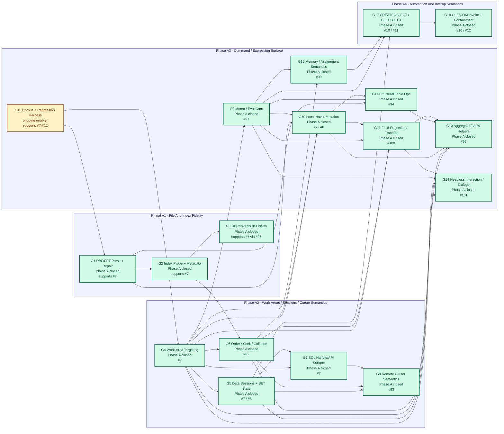
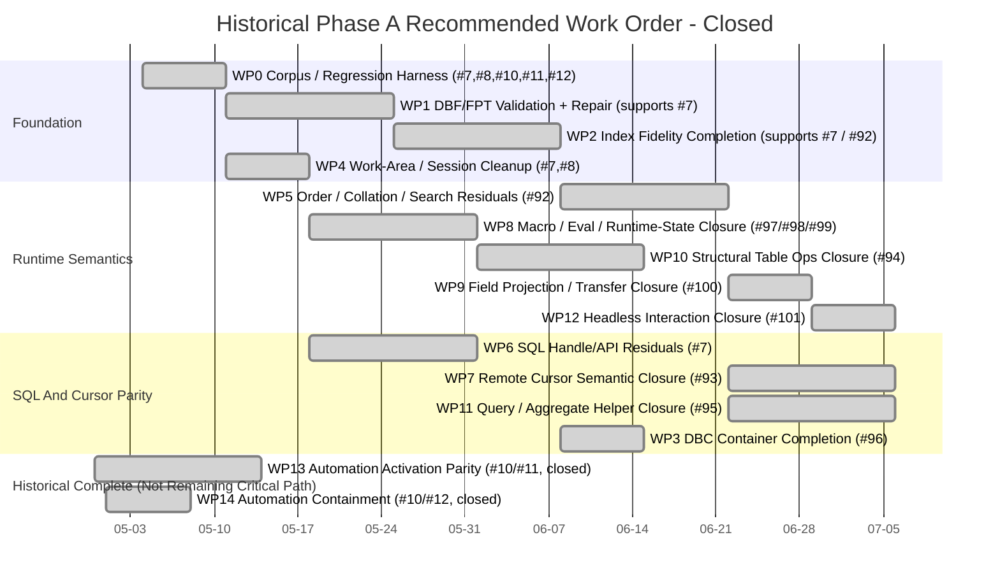
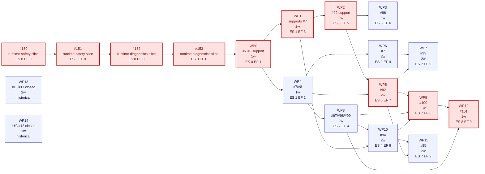

# Phase A Dependency Breakdown

This document began as a Phase A expansion of [remaining-work.md](../remaining-work.md). Phase A is now closed; the live guidance retained here is the post-D1/E1 continuation queue, while the Phase A content is historical dependency evidence. `remaining-work.md` is now deprecated as active planning input.

It is intentionally narrower than the top-level roadmap:

- scope: historical Phase A dependency evidence plus current post-D1/E1 continuation pointers
- granularity: command/function groups and runtime engine seams
- purpose: preserve the historical dependency reasoning and identify the current prompt-sized continuation lane

## Current Agent Directive

This is the only actionable queue in this file as of 2026-06-22. If another section in this document appears to name a different next issue, that section is historical unless GitHub shows a reopened, active issue with fresh regression evidence.

- Phase A, D1/#19, and E1/#22 are closed. Do not reopen the old Phase A gate (`#150`-`#153`), runtime lanes (`#92`-`#101`), shared design-model lane (`#22`), or earlier `#154`-`#203` planning branch unless fresh issue evidence shows a regression.
- The live execution lane has advanced to E3/#24: report/label designer fidelity and section-aware host surfaces. E2/#23 remains open with many prompt-sized children still open in GitHub; treat them as evidence-audit/closure cleanup unless fresh implementation evidence shows a real remaining local miss.
- Latest implemented E3 slice: `#2231`, failed deleted report/label visual-object rename-batch mutation-metadata JSON coverage. Recent adjacent E3 implementation slices through `#2230`-`#1799` are shipped; keep their evidence in the historical tables below instead of repeating it in recurring handoff text.
- Recent non-E3 shipped context: localization/release-readiness slices through `#1856` under `#1779`/`#113`, evidence-management `#1700` under `#108`, F1 error-management `#1714` under `#25`, and E2 raw-code fallback `#1749` under `#23`.
- Evidence-backed child issue closure is approved for completed slices; keep parent/lane issues open unless root-level closure evidence is explicit.
- Current continuation shape: continue prompt-sized E3/#24 children in report/label designer fidelity, report/label section editing, report/label output preview metadata, and layout/runtime parity seams, with stable non-mutating admission/planning seams first, host exposure where useful, focused tests, docs, validation, commit, push, and issue closure per slice.
- Next work: create the next prompt-sized `#24` child in report/label designer fidelity unless the live issue tree shows a higher-weight blocker. A broader visual-asset editor API scan found remaining unwrapped batch APIs after `#1447`; `#1448` duplicate batches, `#1449` rename batches, `#1450` reorder batches, and `#1451` subtree duplication are now closed with evidence-backed approval. The `#1078`-`#1086`, `#1087`-`#1101`, `#1102`-`#1202`, and `#1203`-`#1447` E2 evidence-audit ranges are closed; only older E2 parent/roadmap rows remain open in the local issue snapshot and must not be orphaned. Do not open more E2 wrapper slices unless new APIs are added or the scanner regresses.
- Wishlist and future-facing modernization issues remain valid deferred roadmap work. They are sequenced after important/basic compatibility, usability, release-readiness, and prerequisite architecture unless live GitHub state shows they have become the highest-weight blocker.
- Treat every section below this directive as historical evidence unless it explicitly appears in the "Current Issue Tree Status" table.
- If any older handoff, prompt, transfer note, or planning text says to redirect to `#151`, `#152`, `#153`, `#92`, `#93`, `#94`, or `#154`-`#203` as the active critical path, treat that text as stale unless the corresponding GitHub issue has been reopened with new regression evidence.
- Do not continue work by counting forward through any historical numbered issue list in this file; use the live GitHub issue tree and the "Current Issue Tree Status" table instead.

## Reading Notes

- The Phase A percentages and dependency rows below are historical planning estimates. Do not use them as current completion metrics.
- The dependency edges are pragmatic engineering dependencies, not strict architectural laws. They explain why the Phase A runtime/storage order was chosen.
- The CPM section is historical closure evidence. It is not the current execution gate.
- Current execution guidance is summarized in "Current Agent Directive" and mirrored in the "Current Issue Tree Status" table under "Issue Hierarchy"; create or pick a prompt-sized child there before writing code. Validate against live GitHub state before acting.

## Historical Phase A Areas

Phase A is closed. The rows below are retained only to explain the old dependency model that led to closure.

| Phase A Area | Historical Top-Level Progress | Closure Note |
| --- | --- | --- |
| A1. File and index fidelity | 92-95% | Historical storage/search risk model; do not treat as an active queue without fresh issue evidence. |
| A2. Work areas, sessions, and cursor semantics | 90-96% | Historical cursor/runtime risk model; old Phase A lane issues are closed. |
| A3. Command and expression surface | 82% | Historical `#7` / `#8` command-surface model; the old Phase A issue tree is closed. |
| A4. Automation and interop semantics | 100% | Historical OLE/COM closure model; broader host-safety depth moved to later runtime/debugger work. |

## Command/Function Group Dependency Table

| ID | Group | Linked Issues | Est. Progress | Representative Commands / Functions | Depends On | Primarily Unblocks | Why It Matters Now |
| --- | --- | --- | --- | --- | --- | --- | --- |
| G1 | DBF/FPT parse, validation, and repair | supports `#7` | 90% | DBF/FPT readers, memo decoding, structured asset validation | none | G2, G3, G10, G11 | This is the storage truth layer; if it is wrong, everything above it is noisy. |
| G2 | Index probe fidelity and runtime metadata | supports `#7` | 91% | `CDX`, `DCX`, `IDX`, `NDX`, `MDX`, tag key/`FOR` extraction, normalization hints | G1 | G6, G7, G12, G13 | Search/order parity depends on accurate key expressions, direction, and collation hints. |
| G3 | DBC/DCT/DCX container fidelity | supports `#7` | 88% | DBC object extraction, companion discovery, catalog previews | G1, G2 | later project/runtime surfaces, richer metadata inputs | Near completion; cheap to finish and reduces later heuristics. |
| G4 | Work-area selection and alias targeting | `#7` | 96% | `SELECT`, `USE`, `USE AGAIN`, `USE IN`, `SELECT(0)`, expression-driven `IN` targets | G1 | G5, G6, G9, G10, G11, G12, G13, G14 | Almost every runtime command family assumes this is stable. |
| G5 | Data-session isolation and session-local state | `#7`, `#8` | 95% | `SET DATASESSION`, `SET DEFAULT TO`, session-local `SET()` state, session-local SQL handles | G4 | G8, G13, G14, G15 | Host/runtime parity collapses quickly if session boundaries leak. |
| G6 | Order, seek, and collation semantics | `#7` | 92% | `SET ORDER`, `SEEK`, `SEEK()`, `INDEXSEEK()`, `FOUND()`, `SET NEAR`, tag-expression evaluation | G2, G4 | G10, G11, G12, G13 | This is the main seam between index metadata and FoxPro-visible cursor behavior. |
| G7 | SQL pass-through handle and metadata API | `#7` | 90% | `SQLCONNECT`, `SQLSTRINGCONNECT`, `SQLEXEC`, `SQLPREPARE`, `SQLGETPROP`, `SQLSETPROP`, `SQLTABLES`, `SQLCOLUMNS`, `SQLDATABASES`, `SQLPRIMARYKEYS`, `SQLFOREIGNKEYS`, `SQLCOMMIT`, `SQLROLLBACK`, `SQLCANCEL` | G4, G5 | G8 | The connection/session layer is already strong enough that the remaining work should stay incremental, not disruptive. |
| G8 | Remote and result-cursor semantics | `#7` | 88% | remote cursor navigation, filtering, ordering, `APPEND BLANK`, `REPLACE`, `DELETE`, `RECALL`, targeted `IN` behavior on SQL result cursors | G4, G5, G6, G7 | Phase A closure for A2, later federation/runtime parity | This is where local cursor behavior and SQL pass-through meet. |
| G9 | Macro/eval core and expression compatibility | `#8` | 82% | `EVAL()`, `SET()`, `&macro`, `TEXTMERGE()`, `EXECSCRIPT()`, `TYPE()`, `TRANSFORM()`, macro indirection, macro-expanded identifiers | G4, G5 | G10, G11, G12, G13, G14, G15 | This remains one of the highest leverage remaining lanes for issue `#8`. |
| G10 | Local record navigation and mutation | `#7`, `#8` | 91% | `GO`, `SKIP`, `LOCATE`, `SCAN`, `REPLACE`, `APPEND BLANK`, `DELETE`, `RECALL`, `UNLOCK RECORD` | G1, G4, G6, G9 | G11, G12, G13 | Strong already, but still a shared prerequisite for deeper parity slices above it. |
| G11 | Structural table and import/export operations | `#7`, `#8` | 90% | `CREATE TABLE`, `ALTER TABLE`, `PACK`, `PACK MEMO`, `ZAP`, `APPEND FROM`, `COPY TO`, journaling-backed mutation paths | G1, G4, G9, G10 | corpus confidence, storage parity, data-migration flows | This is the last broad correctness seam in local DBF mutation workflows. |
| G12 | Field projection and data-transfer surface | `#7`, `#8` | 89% | `SCATTER`, `GATHER`, `SET FIELDS`, `BROWSE`, `EDIT`, `CHANGE`, `COPY TO ARRAY`, `APPEND FROM ARRAY`, `FIELDS LIKE/EXCEPT` | G4, G6, G9, G10 | G13, issue `#7` closure | Recently deepened; remaining work here should be narrow and correctness-driven. |
| G13 | Aggregate, lookup, and record-view helpers | `#7` | 94% | `COUNT`, `SUM`, `AVG`, `MIN`, `MAX`, `CALCULATE`, `TOTAL`, `LOOKUP`, `DISPLAY`, `LIST` | G4, G6, G10, G12 | host/report/runtime parity, diagnostics, issue `#7` closure | Very close; aggregate event/state readback and SQL `LOOKUP()` parity are now locked down, leaving mainly DBC/container-adjacent closure work around this family. |
| G14 | Headless interaction and dialog command surface | `#7`, `#8` | 84% | `WAIT`, `KEYBOARD`, `INPUT`, `ACCEPT`, `GETFILE`, `PUTFILE`, `GETDIR`, `INPUTBOX`, runtime event payloads | G4, G5, G9, G12 | host integration parity, remaining command-surface work | Already much better; remaining work should focus on edge-case clauses and macro fidelity. |
| G15 | Memory-variable and assignment semantics | `#8`, `#11` | 86% | `PUBLIC`, `PRIVATE`, `RELEASE`, `STORE`, array macro names, `DISPLAY/LIST MEMORY` | G4, G5, G9 | G12, G13, G14, A4 work | This is one of the hidden foundations under command-surface parity. |
| G16 | Compatibility corpus and regression harness | supports `#7`, `#8`, `#10`, `#11`, `#12` | 55% | VFP-tree corpus, legacy samples, regression fixtures, focused runtime test expansion | G1, G4 | all groups | This is not a runtime feature, but it is one of the best multipliers for finishing the remaining 10-20% safely. |
| G17 | Automation object activation parity | `#10`, `#11` | 68% | `CREATEOBJECT()`, `GETOBJECT()`, `NEWOBJECT()` activation targeting and reuse | G5, G9, G15 | G18, later interop/runtime parity | The front door is materially deeper now; the remaining work is mostly containment and fault behavior. |
| G18 | Automation property/method behavior and containment | `#10`, `#12` | 100% | OLE/COM property access, method invocation, automation-failure isolation | G17 | Phase A closure, later host safety work | Phase A closure criteria are met; remaining host-safety depth belongs to Phase B runtime-fault work. |

## Historical Dependency Table By Recommended Work Package

This was the actionable version of the old Phase A graph. It is retained only as closure evidence and must not redirect agents away from the current E3/#24 lane unless live GitHub state shows a higher-weight blocker.

| WP | Work Package | Linked Issues | Duration (Weeks) | Primary Groups | Prerequisites | Expected Output |
| --- | --- | --- | --- | --- | --- | --- |
| WP0 | Corpus and regression harness expansion | `#7`, `#8`, `#10`, `#11`, `#12` | 1 | G16 | none | broader fixture map, missing-edge inventory, faster slice validation |
| WP1 | DBF/FPT validation and repair completion | mostly `#7` | 2 | G1 | WP0 | finish repair/validation gaps in core storage path |
| WP2 | Index fidelity completion | mostly `#7` | 2 | G2 | WP1 | close remaining tag-expression, collation, and index-metadata/runtime seams |
| WP3 | DBC container completion | mostly `#7` | 1 | G3 | WP1, WP2 | close container/object-extraction and companion-resolution gaps |
| WP4 | Work-area and session residual cleanup | `#7`, `#8` | 1 | G4, G5 | WP0 | remove remaining targeting/session edge cases before higher-surface work |
| WP5 | Order/collation/search residuals | `#7` | 2 | G6 | WP2, WP4 | finish the remaining seek/order/collation behaviors that many commands inherit |
| WP6 | SQL handle/API residuals | `#7` | 2 | G7 | WP4 | finish stable connection/property/catalog semantics without disturbing cursor behavior |
| WP7 | Remote/result-cursor semantic closure | `#7` | 2 | G8 | WP5, WP6 | align SQL result-cursor behavior more closely with local cursor semantics |
| WP8 | Macro/eval/runtime-state closure | `#8` | 2 | G9, G15 | WP4 | drive issue `#8` down before more command-surface polishing |
| WP9 | Field-projection and data-transfer closure | `#7`, `#8` | 1 | G12 | WP5, WP8, WP10 | finish narrow `SCATTER`/`GATHER`/`FIELDS`/array transfer seams |
| WP10 | Local structural table-operation closure | `#7`, `#8` | 2 | G10, G11 | WP1, WP4, WP8 | finish the remaining local mutation/import/export correctness seams |
| WP11 | Query/aggregate and helper closure | `#7` | 2 | G10, G13 | WP5, WP10 | finish aggregate/view/helper behavior on top of stable cursor semantics |
| WP12 | Headless interaction/display closure | `#7`, `#8` | 1 | G13, G14 | WP8, WP9 | finish host-visible command/event fidelity after macro and field semantics settle |
| WP13 | Automation activation parity | `#10`, `#11` | 2 | G17 | WP8, WP12 | completed for Phase A; retained here as historical closure context |
| WP14 | Automation containment and fault behavior | `#10`, `#12` | 1 | G18 | WP13 | completed for Phase A; retained here as historical closure context |

## Historical Dependency Graph

```mermaid
flowchart LR
    classDef green fill:#d1fae5,stroke:#065f46,stroke-width:2px,color:#064e3b;
    classDef amber fill:#fef3c7,stroke:#92400e,stroke-width:2px,color:#78350f;
    classDef red fill:#fee2e2,stroke:#991b1b,stroke-width:2px,color:#7f1d1d;
    classDef critical fill:#fee2e2,stroke:#b91c1c,stroke-width:3px,color:#7f1d1d;
    classDef lane fill:#eef2ff,stroke:#4338ca,stroke-width:1px,color:#1e1b4b;

    subgraph A1[Phase A1 - File And Index Fidelity]
        direction TB
        G1["G1 DBF/FPT Parse + Repair<br/>Phase A closed<br/>supports #7"]
        G2["G2 Index Probe + Metadata<br/>Phase A closed<br/>supports #7"]
        G3["G3 DBC/DCT/DCX Fidelity<br/>Phase A closed<br/>supports #7 via #96"]
    end

    subgraph A2[Phase A2 - Work Areas / Sessions / Cursor Semantics]
        direction TB
        G4["G4 Work-Area Targeting<br/>Phase A closed<br/>#7"]
        G5["G5 Data Sessions + SET State<br/>Phase A closed<br/>#7 / #8"]
        G6["G6 Order / Seek / Collation<br/>Phase A closed<br/>#92"]
        G7["G7 SQL Handle/API Surface<br/>Phase A closed<br/>#7"]
        G8["G8 Remote Cursor Semantics<br/>Phase A closed<br/>#93"]
    end

    subgraph A3[Phase A3 - Command / Expression Surface]
        direction TB
        G9["G9 Macro / Eval Core<br/>Phase A closed<br/>#97"]
        G10["G10 Local Nav + Mutation<br/>Phase A closed<br/>#7 / #8"]
        G11["G11 Structural Table Ops<br/>Phase A closed<br/>#94"]
        G12["G12 Field Projection / Transfer<br/>Phase A closed<br/>#100"]
        G13["G13 Aggregate / View Helpers<br/>Phase A closed<br/>#95"]
        G14["G14 Headless Interaction / Dialogs<br/>Phase A closed<br/>#101"]
        G15["G15 Memory / Assignment Semantics<br/>Phase A closed<br/>#99"]
        G16["G16 Corpus + Regression Harness<br/>ongoing enabler<br/>supports #7-#12"]
    end

    subgraph A4[Phase A4 - Automation And Interop Semantics]
        direction TB
        G17["G17 CREATEOBJECT / GETOBJECT<br/>Phase A closed<br/>#10 / #11"]
        G18["G18 OLE/COM Invoke + Containment<br/>Phase A closed<br/>#10 / #12"]
    end

    G16 --> G1
    G16 --> G4

    G1 --> G2 --> G3
    G1 --> G10
    G1 --> G11

    G4 --> G5
    G4 --> G6
    G4 --> G7
    G4 --> G9
    G4 --> G10
    G4 --> G12
    G4 --> G13
    G4 --> G14
    G4 --> G15

    G2 --> G6
    G5 --> G7
    G5 --> G8
    G5 --> G14
    G5 --> G17

    G6 --> G8
    G6 --> G10
    G6 --> G12
    G6 --> G13

    G7 --> G8

    G9 --> G10
    G9 --> G11
    G9 --> G12
    G9 --> G14
    G9 --> G15
    G9 --> G17

    G10 --> G11
    G10 --> G12
    G10 --> G13

    G11 --> G13
    G12 --> G13
    G12 --> G14

    G15 --> G17
    G17 --> G18

    class G1,G2,G3,G4,G5,G6,G7,G8,G9,G10,G11,G12,G13,G14,G15,G17,G18 green;
    class G16 amber;
    class A1,A2,A3,A4 lane;
```

## Historical Phase A Recommended Order

This order is retained as closure evidence only. It must not redirect agents away from the current E3/#24 directive unless live GitHub state shows a higher-weight blocker.

The historical recommended order was not simply "lowest percentage first." It was:

1. finish the storage and search seams that everything else inherits
2. close the remaining macro/eval/runtime-state seams before polishing more commands
3. finish command groups that sit on those two foundations
4. treat automation/OLE rows as historical-complete in Phase A closure ordering

That produced this historical Phase A practical order:

1. `#150`, `#151`, `#152`, `#153` runtime-safety/diagnostics slices (closed safety gate)
2. `WP0` corpus and regression harness expansion
3. `WP1` DBF/FPT validation and repair completion
4. `WP2` index fidelity completion
5. `WP4` work-area and session residual cleanup
6. `WP5` order/collation/search residuals (`#92`)
7. `WP8` macro/eval/runtime-state closure (`#97`, `#98`, `#99`)
8. `WP10` local structural table-operation closure (`#94`)
9. `WP9` field-projection and data-transfer closure (`#100`)
10. `WP12` headless interaction/display closure (`#101`)
11. `WP6` SQL handle/API residuals
12. `WP7` remote/result-cursor semantic closure (`#93`, blocked by `#92`)
13. `WP11` query/aggregate and helper closure (historical-closed lane `#95` context)
14. `WP3` DBC container completion (historical-closed lane `#96` context)

That sequence is slightly different from the raw dependency graph because it prioritizes:

- issue `#7` / `#8` closure before automation depth
- highest fan-out prerequisites before local polish
- near-complete lanes that can be closed cheaply once their upstream seams are stable

## Historical Gantt Chart

This is a historical planning schedule, not a delivery promise or current queue. It is retained only to explain the old Phase A ordering.

```mermaid
gantt
    title Historical Phase A Recommended Work Order - Closed
    dateFormat  YYYY-MM-DD
    axisFormat  %m-%d

    section Foundation
    WP0 Corpus / Regression Harness (#7,#8,#10,#11,#12) :done, wp0, 2026-05-04, 1w
    WP1 DBF/FPT Validation + Repair (supports #7)       :done, wp1, after wp0, 2w
    WP2 Index Fidelity Completion (supports #7 / #92)   :done, wp2, after wp1, 2w
    WP4 Work-Area / Session Cleanup (#7,#8)             :done, wp4, after wp0, 1w

    section Runtime Semantics
    WP5 Order / Collation / Search Residuals (#92)      :done, wp5, after wp2, 2w
    WP8 Macro / Eval / Runtime-State Closure (#97/#98/#99) :done, wp8, after wp4, 2w
    WP10 Structural Table Ops Closure (#94)             :done, wp10, after wp8, 2w
    WP9 Field Projection / Transfer Closure (#100)      :done, wp9, after wp5, 1w
    WP12 Headless Interaction Closure (#101)            :done, wp12, after wp9, 1w

    section SQL And Cursor Parity
    WP6 SQL Handle/API Residuals (#7)                   :done, wp6, after wp4, 2w
    WP7 Remote Cursor Semantic Closure (#93)           :done, wp7, after wp5, 2w
    WP11 Query / Aggregate Helper Closure (#95)        :done, wp11, after wp5, 2w
    WP3 DBC Container Completion (#96)                 :done, wp3, after wp2, 1w

    section Historical Complete (Not Remaining Critical Path)
    WP13 Automation Activation Parity (#10/#11, closed)   :done, wp13, 2026-04-30, 2w
    WP14 Automation Containment (#10/#12, closed)         :done, wp14, 2026-05-01, 1w
```

## CPM Chart

The critical path below is the longest prerequisite chain for Phase A completion under the above work-package model.

Historical critical path for Phase A work:

- `#150 -> #151 -> #152 -> #153 -> WP0 -> WP1 -> WP2 -> WP5 -> WP9 -> WP12`
- issue path: `(#13/#14 safety gate) -> (#7/#8 support) -> (#92) -> (#100) -> (#101)`

Historical critical-path duration estimate:

- `9 weeks` for WP0-WP12 plus runtime-safety slice execution (`#150`-`#153`); this path is closed in the current issue tracker.

```mermaid
flowchart LR
    classDef normal fill:#eef2ff,stroke:#4338ca,stroke-width:1px,color:#1e1b4b;
    classDef critical fill:#fee2e2,stroke:#b91c1c,stroke-width:3px,color:#7f1d1d;

    WP0["WP0<br/>#7,#8 support<br/>1w<br/>ES 0 EF 1"]
    S150["#150<br/>runtime safety slice<br/>ES 0 EF 0"]
    S151["#151<br/>runtime safety slice<br/>ES 0 EF 0"]
    S152["#152<br/>runtime diagnostics slice<br/>ES 0 EF 0"]
    S153["#153<br/>runtime diagnostics slice<br/>ES 0 EF 0"]
    WP1["WP1<br/>supports #7<br/>2w<br/>ES 1 EF 3"]
    WP2["WP2<br/>#92 support<br/>2w<br/>ES 3 EF 5"]
    WP3["WP3<br/>#96<br/>1w<br/>ES 5 EF 6"]
    WP4["WP4<br/>#7/#8<br/>1w<br/>ES 1 EF 2"]
    WP5["WP5<br/>#92<br/>2w<br/>ES 5 EF 7"]
    WP6["WP6<br/>#7<br/>2w<br/>ES 2 EF 4"]
    WP7["WP7<br/>#93<br/>2w<br/>ES 7 EF 9"]
    WP8["WP8<br/>#97/#98/#99<br/>2w<br/>ES 2 EF 4"]
    WP9["WP9<br/>#100<br/>1w<br/>ES 7 EF 8"]
    WP10["WP10<br/>#94<br/>2w<br/>ES 4 EF 6"]
    WP11["WP11<br/>#95<br/>2w<br/>ES 7 EF 9"]
    WP12["WP12<br/>#101<br/>1w<br/>ES 8 EF 9"]
    WP13["WP13<br/>#10/#11 closed<br/>2w<br/>historical"]
    WP14["WP14<br/>#10/#12 closed<br/>1w<br/>historical"]

    S150 --> S151 --> S152 --> S153 --> WP0
    WP0 --> WP1 --> WP2 --> WP3
    WP0 --> WP4
    WP2 --> WP5
    WP4 --> WP5
    WP4 --> WP6 --> WP7
    WP4 --> WP8
    WP8 --> WP10 --> WP11
    WP5 --> WP9 --> WP12
    WP8 --> WP9
    WP8 --> WP12
    WP1 --> WP10
    WP5 --> WP7
    WP10 --> WP9
    WP5 --> WP11

    class WP3,WP4,WP6,WP7,WP8,WP10,WP11,WP13,WP14 normal;
    class S150,S151,S152,S153,WP0,WP1,WP2,WP5,WP9,WP12 critical;
```

## Historical First Things Addressed

This table records the old Phase A priority rationale. It is not the current work queue.

| Priority | Historical Slice | Why It Was First |
| --- | --- | --- |
| 1 | corpus and fixture expansion around issue `#7` / `#8` leftovers | It lowers the cost of every later parity slice and reduces regression risk. |
| 2 | DBF/FPT validation and repair gaps | Storage correctness is still the deepest common dependency in Phase A. |
| 3 | remaining index-expression/collation/runtime-consumption gaps | Many command families still inherit their hardest parity bugs from this seam. |
| 4 | macro/eval/runtime-state closure | This is the highest-leverage remaining issue `#8` surface and still fans out into many commands. |
| 5 | local structural table-operation residuals | These still touch correctness, rollback, persistence, and import/export behavior. |
| 6 | narrow field-projection and headless command residuals | These are close to done, but should be finished after search and macro foundations are steadier. |
| 7 | remote/result-cursor and structural closure (`#93`, `#94`) after `#92/#97/#100/#101` chain | These are high-value finishers once critical dependencies are quiet. |

## Issue Hierarchy

GitHub issue hierarchy is now in use for ongoing work. Repo-wide top-level umbrella issues are `#108`-`#114`; the old Phase A runtime tree under `#7` and `#8` is closed and retained below as historical dependency evidence.

Historical-closed lane structure under `#7`:

| Parent | Sub-Issue | Maps To |
| --- | --- | --- |
| `#7` | `#92` Finish residual order/collation/search parity | G6 / WP5 |
| `#7` | `#93` Finish remote/result-cursor behavior parity | G8 / WP7 |
| `#7` | `#94` Finish structural table-operation parity | G10-G11 / WP10 |

Historical-closed lane structure under `#7`:

| Parent | Sub-Issue | Maps To |
| --- | --- | --- |
| `#7` | `#95` Finish aggregate/view/helper command parity | G13 / WP11 |
| `#7` | `#96` Finish DBC/container and catalog fidelity | G3 / WP3 |

Historical-closed lane structure under `#8`:

| Parent | Sub-Issue | Maps To |
| --- | --- | --- |
| `#8` | `#97` Finish macro suffix/terminator and nested expansion semantics | G9 / WP8 |
| `#8` | `#98` Finish runtime-state normalization and `SET()` compatibility residuals | G5-G9 / WP8 |
| `#8` | `#99` Finish memory-variable, `PUBLIC`/`PRIVATE`/`RELEASE`, and assignment semantics | G15 / WP8 |
| `#8` | `#100` Finish field-transfer and macro-target data movement parity | G12 / WP9 |
| `#8` | `#101` Finish headless interaction macro/eval fidelity | G14 / WP12 |

## Current Issue Tree Status

Current prompt-sized slice queue and closure status after Phase A/D1/E1 closure. This table supersedes the historical dependency graph, historical critical path, and numbered closure list in this file. If a parent has no open child rows, create the next prompt-sized child in that parent lane before coding under that parent.

| Parent | Slice Issue | Intended Prompt Slice |
| --- | --- | --- |
| `#113` | `#1856` closed | Embedded VSIX launch/workflow dialog text localizes through the shared English/es-419/pt-BR catalog with smoke coverage |
| `#113` | `#1855` closed | Embedded VSIX snapshot, undo, and property-update status text localizes through the shared English/es-419/pt-BR catalog with smoke coverage |
| `#113` | `#1854` closed | Shared localization catalogs expose testable key sets and language-service coverage proves en/es-419/pt-BR key parity with no blank values |
| `#113` | `#1853` closed | Embedded VSIX host-mode subtitles localize through the shared English/es-419/pt-BR catalog with smoke coverage for embedded and standalone modes |
| `#113` | `#1852` closed | Embedded VSIX static asset-family guidance localizes through the shared English/es-419/pt-BR catalog with smoke coverage for every guidance case |
| `#113` | `#1851` closed | Embedded VSIX explorer list column headers localize through the shared English/es-419/pt-BR catalog in initial and project-mode views with smoke coverage |
| `#113` | `#1850` closed | Embedded VSIX project workspace initial placeholder pane text localizes through the shared English/es-419/pt-BR catalog with smoke coverage |
| `#113` | `#1849` closed | Embedded VSIX project command buttons, debugger controls, and initial status/guidance strings localize through the shared English/es-419/pt-BR catalog with smoke coverage |
| `#113` | `#1848` closed | Embedded VSIX project workspace tab labels and the Hide project records option localize through the shared English/es-419/pt-BR catalog with smoke coverage |
| `#113` | `#1847` closed | Embedded VSIX asset editor title/subtitle/guidance/Open/Reveal/Refresh shell chrome localizes through the shared English/es-419/pt-BR catalog with smoke coverage |
| `#113` | `#1846` closed | Standalone Studio asset-kind display names are localized through the shared English/es-419/pt-BR catalog with extension classification and fallback tests |
| `#113` | `#1801` closed | Standalone Studio has a documented Spanish/Portuguese localization contract, shared .NET catalog, locale fallback tests, and localized shell strings |
| `#24` | `#2231` closed | Studio host regressions prove failed deleted report/label visual-object rename-batch JSON keeps batch results null, suppresses stale committed and mutation metadata, suppresses stale undo fields, reports collision errors, rolls back earlier identity mutations, and preserves deleted-state layout identities |
| `#24` | `#2230` closed | Studio host regressions prove failed live report/label visual-object rename-batch JSON keeps batch results null, suppresses stale committed and mutation metadata, suppresses stale undo fields, reports collision errors, rolls back earlier identity mutations, and preserves layout identities |
| `#24` | `#2229` closed | Studio host regressions prove failed deleted report/label visual-object update-batch JSON keeps batch results null, suppresses stale committed and mutation metadata, suppresses stale undo fields, reports missing-selector errors, rolls back earlier property mutations, and preserves deleted-state layout properties |
| `#24` | `#2228` closed | Studio host regressions prove failed live report/label visual-object update-batch JSON keeps batch results null, suppresses stale committed and mutation metadata, suppresses stale undo fields, reports missing-selector errors, rolls back earlier property mutations, and preserves layout properties |
| `#24` | `#2227` closed | Studio host regressions prove failed deleted report/label visual-object reorder-batch JSON keeps batch results null, suppresses stale committed and mutation metadata, suppresses stale undo fields, reports missing-target errors, rolls back earlier reorders, and preserves deleted-state layout rows |
| `#24` | `#2226` closed | Studio host regressions prove failed live report/label visual-object reorder-batch JSON keeps batch results null, suppresses stale committed and mutation metadata, suppresses stale undo fields, reports missing-target errors, rolls back earlier reorders, and preserves layout rows |
| `#24` | `#2225` closed | Studio host regressions prove failed deleted report/label visual-object duplicate-batch JSON keeps batch results null, suppresses stale committed and mutation metadata, suppresses stale undo fields, reports collision errors, rolls back earlier duplicates, and preserves deleted-state layout rows |
| `#24` | `#2224` closed | Studio host regressions prove failed live report/label visual-object duplicate-batch JSON keeps batch results null, suppresses stale committed and mutation metadata, suppresses stale undo fields, reports collision errors, rolls back earlier duplicates, and preserves layout rows |
| `#24` | `#2223` closed | Studio host regressions prove failed deleted report/label visual-object duplicate-subtree JSON keeps duplicate-subtree results null, suppresses stale committed and mutation metadata, suppresses stale undo fields, reports collision errors, and preserves deleted-state layout rows |
| `#24` | `#2222` closed | Studio host regressions prove failed live report/label visual-object duplicate-subtree JSON keeps duplicate-subtree results null, suppresses stale committed and mutation metadata, suppresses stale undo fields, reports collision and missing-selector errors, and preserves layout rows |
| `#24` | `#2221` closed | Studio host regressions prove failed deleted report/label visual-property reorder-batch JSON keeps batch results null, suppresses stale committed and mutation metadata, suppresses stale undo fields, reports direct-field and missing-selector errors, and preserves deleted-state and DBF-backed fields |
| `#24` | `#2220` closed | Studio host regressions prove failed deleted report/label visual-property reorder JSON keeps reorder results null, suppresses stale committed and mutation metadata, suppresses stale undo fields, reports direct-field and missing-selector errors, and preserves deleted-state and DBF-backed fields |
| `#24` | `#2219` closed | Studio host regressions prove failed deleted report/label visual-property rename-batch JSON keeps batch results null, suppresses stale committed and mutation metadata, suppresses stale undo fields, reports direct-field and missing-selector errors, and preserves deleted-state and DBF-backed fields |
| `#24` | `#2218` closed | Studio host regressions prove failed deleted report/label visual-property rename JSON keeps rename results null, suppresses stale committed and mutation metadata, suppresses stale undo fields, reports direct-field and missing-selector errors, and preserves deleted-state and DBF-backed fields |
| `#24` | `#2217` closed | Studio host regressions prove failed deleted report/label visual-property move-batch JSON keeps batch results null, suppresses stale committed and mutation metadata, suppresses stale undo fields, reports expression and geometry selector errors, rolls back earlier moves, and preserves deleted-state and property values |
| `#24` | `#2216` closed | Studio host regressions prove failed deleted report/label visual-property move JSON keeps move results null, suppresses stale committed and mutation metadata, suppresses stale undo fields, reports selector errors, and preserves deleted-state and property values |
| `#24` | `#2215` closed | Studio host regressions prove failed deleted report/label visual-property copy-batch JSON keeps batch results null, suppresses stale committed and mutation metadata, suppresses stale undo fields, reports expression and geometry selector errors, rolls back earlier copies, and preserves deleted-state and property values |
| `#24` | `#2214` closed | Studio host regressions prove failed deleted report/label visual-property copy JSON keeps copy results null, suppresses stale committed and mutation metadata, suppresses stale undo fields, reports selector errors, and preserves deleted-state and property values |
| `#24` | `#2213` closed | Studio host regressions prove failed deleted report/label visual-property clear-batch JSON keeps batch results null, suppresses stale committed and mutation metadata, suppresses stale undo fields, reports selector errors, rolls back earlier clears, and preserves deleted-state and property values |
| `#24` | `#2212` closed | Studio host regressions prove failed deleted report/label visual-property clear JSON keeps clear results null, suppresses stale committed and mutation metadata, suppresses stale undo fields, reports selector errors, and preserves deleted-state and property values |
| `#24` | `#2211` closed | Studio host regressions prove failed deleted report/label visual-property reorder-batch JSON keeps batch results null, does not advertise undo availability, suppresses stale undo labels, reports direct-field and missing-selector errors, and preserves deleted-state and DBF-backed fields |
| `#24` | `#2210` closed | Studio host regressions prove failed deleted report/label visual-property reorder JSON keeps reorder results null, does not advertise undo availability, suppresses stale undo labels, reports direct-field and missing-selector errors, and preserves deleted-state and DBF-backed fields |
| `#24` | `#2209` closed | Studio host regressions prove failed deleted report/label visual-property rename-batch JSON keeps batch results null, does not advertise undo availability, suppresses stale undo labels, reports direct-field and missing-selector errors, and preserves deleted-state and DBF-backed fields |
| `#24` | `#2208` closed | Studio host regressions prove failed deleted report/label visual-property rename JSON keeps rename results null, does not advertise undo availability, suppresses stale undo labels, reports direct-field and missing-selector errors, and preserves deleted-state and DBF-backed fields |
| `#24` | `#2207` closed | Studio host regressions prove failed deleted report/label visual-property move-batch JSON keeps batch results null, does not advertise undo availability, suppresses stale undo labels, reports missing selectors, rolls back earlier moves, and preserves deleted-state and property values |
| `#24` | `#2206` closed | Studio host regressions prove failed deleted report/label visual-property move JSON keeps move results null, does not advertise undo availability, suppresses stale undo labels, reports missing selectors, and preserves deleted-state and property values |
| `#24` | `#2205` closed | Studio host regressions prove failed deleted report/label visual-property copy-batch JSON keeps batch results null, does not advertise undo availability, suppresses stale undo labels, reports missing selectors, rolls back earlier copies, and preserves deleted-state and property values |
| `#24` | `#2204` closed | Studio host regressions prove failed deleted report/label visual-property copy JSON keeps copy results null, does not advertise undo availability, suppresses stale undo labels, reports missing selectors, and preserves deleted-state and property values |
| `#24` | `#2203` closed | Studio host regressions prove failed deleted report/label visual-property clear-batch JSON keeps batch results null, does not advertise undo availability, suppresses stale undo labels, reports missing selectors, rolls back earlier clears, and preserves deleted-state and property values |
| `#24` | `#2202` closed | Studio host regressions prove failed deleted report/label visual-property clear JSON keeps clear results null, does not advertise undo availability, suppresses stale undo labels, reports missing selectors, and preserves deleted-state and property values |
| `#24` | `#2201` closed | Studio host regressions prove live and deleted report/label visual-object update-batch rollback failures keep update-batch results null, do not advertise undo availability, suppress stale undo labels, report missing selectors, and preserve rolled-back property and deleted-state behavior |
| `#24` | `#2200` closed | Studio host regressions prove live report/label duplicate-subtree collision and missing-selector failures plus deleted report/label duplicate-subtree collision failures keep duplicate-subtree results null, do not advertise undo availability, suppress stale undo labels, report errors, and preserve object state |
| `#24` | `#2199` closed | Studio host regressions prove live and deleted report/label visual-object rename, duplicate, and reorder batch failures keep batch results null, do not advertise undo availability, suppress stale undo labels, report collision or missing-target errors, and preserve rolled-back object state |
| `#24` | `#2198` closed | Studio host regressions prove failed deleted report/label visual-property geometry move batches keep move-batch results null, do not advertise undo availability, report missing selectors, preserve original source and target coordinates, and preserve deleted state |
| `#24` | `#2197` closed | Studio host regressions prove failed deleted report/label visual-property geometry copy batches keep copy-batch results null, do not advertise undo availability, report missing selectors, preserve original coordinates, and preserve deleted state |
| `#24` | `#2196` closed | Studio host regressions prove deleted report/label visual-property geometry move batches expose committed state, mutation state, undo availability, geometry undo labels, moved coordinates, source clearing, refreshed selected-object geometry, and preserved deleted state |
| `#24` | `#2195` closed | Studio host regressions prove deleted report/label visual-property geometry copy batches expose committed state, mutation state, undo availability, geometry undo labels, copied coordinates, refreshed selected-object geometry, and preserved deleted state |
| `#24` | `#2194` closed | Studio host regressions prove deleted report/label visual-property geometry moves expose committed state, mutation state, undo availability, geometry undo labels, moved coordinates, source clearing, refreshed selected-object geometry, and preserved deleted state |
| `#24` | `#2193` closed | Studio host regressions prove deleted report/label visual-property geometry copies expose committed state, mutation state, undo availability, geometry undo labels, copied coordinates, refreshed selected-object geometry, and preserved deleted state |
| `#24` | `#2192` closed | Studio host regressions prove deleted report/label visual-property geometry clears expose committed state, mutation state, undo availability, geometry undo labels, refreshed preview bounds, and preserved deleted state |
| `#24` | `#2191` closed | Studio host regressions prove deleted report/label visual-property move-batch missing-selector failures keep move-batch results null, preserve deleted state and object properties, roll back earlier moves, and do not advertise undo availability |
| `#24` | `#2190` closed | Studio host regressions prove deleted report/label visual-property move missing-selector failures keep move results null, preserve deleted state and object properties, and do not advertise undo availability |
| `#24` | `#2189` closed | Studio host regressions prove deleted report/label visual-property copy-batch missing-selector failures keep copy-batch results null, preserve deleted state and object properties, roll back earlier copies, and do not advertise undo availability |
| `#24` | `#2188` closed | Studio host regressions prove deleted report/label visual-property copy missing-selector failures keep copy results null, preserve deleted state and object properties, and do not advertise undo availability |
| `#24` | `#2187` closed | Studio host regressions prove deleted report/label visual-property clear missing-selector failures keep clear results null, preserve deleted state and object properties, and do not advertise undo availability |
| `#24` | `#2186` closed | Studio host regressions prove deleted report/label visual-property clear-batch missing-selector failures keep clear-batch results null, preserve deleted state and object properties, roll back earlier property clears, and do not advertise undo availability |
| `#24` | `#2185` closed | Studio host regressions prove deleted report/label visual-object update-batch missing-selector failures keep update-batch results null, preserve deleted state and object properties, roll back earlier property mutations, and do not advertise undo availability |
| `#24` | `#2184` closed | Studio host regressions prove live report/label visual-object update-batch missing-selector failures keep update-batch results null, preserve object properties, roll back earlier property mutations, and do not advertise undo availability |
| `#24` | `#2183` closed | Studio host regressions prove deleted report/label visual-object reorder-batch missing-target failures keep reorder-batch results null, preserve deleted state and object ordering, roll back earlier reorder mutations, and do not advertise undo availability |
| `#24` | `#2182` closed | Studio host regressions prove live report/label visual-object reorder-batch missing-target failures keep reorder-batch results null, preserve object ordering, roll back earlier reorder mutations, and do not advertise undo availability |
| `#24` | `#2181` closed | Studio host regressions prove deleted report/label visual-object duplicate-batch collision failures keep duplicate-batch results null, preserve deleted state and object ordering, roll back earlier duplicate mutations, and do not advertise undo availability |
| `#24` | `#2180` closed | Studio host regressions prove live report/label visual-object duplicate-batch collision failures keep duplicate-batch results null, preserve identities and object ordering, roll back earlier duplicate mutations, and do not advertise undo availability |
| `#24` | `#2179` closed | Studio host regressions prove deleted report/label visual-object rename-batch collision failures keep rename-batch results null, preserve identities, deleted state, and object ordering, roll back earlier mutations, and do not advertise undo availability |
| `#24` | `#2178` closed | Studio host regressions prove live report/label visual-object rename-batch collision failures keep rename-batch results null, preserve identities and object ordering, roll back earlier mutations, and do not advertise undo availability |
| `#24` | `#2177` closed | Studio host regressions prove deleted report/label visual-object duplicate-subtree collision failures keep duplicate-subtree results null, preserve deleted state and layout rows, report errors, and do not advertise undo availability |
| `#24` | `#2176` closed | Studio host regressions prove live report/label visual-object duplicate-subtree collision and missing-selector failures keep duplicate-subtree results null, preserve layout rows, report errors, and do not advertise undo availability |
| `#24` | `#2175` closed | Studio host regressions prove deleted report/label visual-object duplicate-subtree JSON exposes copied root parent names alongside copied root identity, execution metadata, preserved deleted state, object ordering, and refreshed preview metadata |
| `#24` | `#2174` closed | Studio host regressions prove deleted report/label visual-object duplicate-subtree JSON exposes affected counts, committed state, mutation state, no undo availability, and empty undo labels alongside copied root metadata, preserved deleted state, object ordering, and refreshed preview metadata |
| `#24` | `#2173` closed | Studio host regressions prove live report/label visual-object duplicate-subtree JSON exposes empty undo labels when undo is unavailable alongside copied root metadata, affected counts, mutation state, appended copied identities, object ordering, and refreshed preview metadata |
| `#24` | `#2172` closed | Studio host regressions prove deleted report/label visual-object reorder-batch JSON exposes empty undo labels when undo is unavailable alongside affected counts, mutation state, preserved deleted state, object ordering, and refreshed preview metadata |
| `#24` | `#2171` closed | Studio host regressions prove live report/label visual-object reorder-batch JSON exposes empty undo labels when undo is unavailable alongside affected counts, mutation state, object ordering, and refreshed preview metadata |
| `#24` | `#2170` closed | Studio host regressions prove deleted report/label visual-object duplicate-batch JSON exposes empty undo labels when undo is unavailable alongside affected counts, mutation state, appended deleted duplicate identities, preserved deleted state, object ordering, and refreshed preview metadata |
| `#24` | `#2169` closed | Studio host regressions prove live report/label visual-object duplicate-batch JSON exposes empty undo labels when undo is unavailable alongside affected counts, mutation state, appended duplicate identities, object ordering, and refreshed preview metadata |
| `#24` | `#2168` closed | Studio host regressions prove live report/label visual-object rename-batch JSON exposes stable renamed-identity undo labels alongside affected counts, mutation state, undo availability, renamed identities, object ordering, and refreshed preview metadata |
| `#24` | `#2167` closed | Studio host regressions prove deleted report/label visual-object rename-batch JSON exposes stable renamed-identity undo labels alongside affected counts, mutation state, undo availability, renamed identities, preserved deleted state, object ordering, and refreshed preview metadata |
| `#24` | `#2166` closed | Studio host regressions prove rejected deleted report/label visual-property reorder-batch JSON does not advertise undo availability alongside stale-result suppression, direct-field and selector errors, preserved DBF-backed fields, deleted state, and refreshed preview metadata |
| `#24` | `#2165` closed | Studio host regressions prove rejected deleted report/label visual-property reorder JSON does not advertise undo availability alongside stale-result suppression, direct-field and selector errors, preserved DBF-backed fields, deleted state, and refreshed preview metadata |
| `#24` | `#2164` closed | Studio host regressions prove rejected deleted report/label visual-property rename-batch JSON does not advertise undo availability alongside stale-result suppression, direct-field and selector errors, preserved DBF-backed fields, deleted state, and refreshed preview metadata |
| `#24` | `#2163` closed | Studio host regressions prove rejected deleted report/label visual-property rename JSON does not advertise undo availability alongside stale-result suppression, direct-field and selector errors, preserved DBF-backed fields, deleted state, and refreshed preview metadata |
| `#24` | `#2162` closed | Studio host regressions prove deleted report/label visual-property move-batch JSON exposes stable moved-property undo labels alongside affected counts, mutation state, undo availability, moved values, preserved deleted state, source clearing, and refreshed preview metadata |
| `#24` | `#2161` closed | Studio host regressions prove deleted report/label visual-property move JSON exposes stable moved-property undo labels alongside affected counts, mutation state, undo availability, moved values, preserved deleted state, source clearing, and refreshed preview metadata |
| `#24` | `#2160` closed | Studio host regressions prove deleted report/label visual-property copy-batch JSON exposes stable copied-property undo labels alongside affected counts, mutation state, undo availability, copied values, preserved deleted state, and refreshed preview metadata |
| `#24` | `#2159` closed | Studio host regressions prove deleted report/label visual-property copy JSON exposes stable copied-property undo labels alongside affected counts, mutation state, undo availability, copied values, preserved deleted state, and refreshed preview metadata |
| `#24` | `#2158` closed | Studio host regressions prove deleted report/label visual-property clear-batch JSON exposes the latest undo label alongside affected counts, mutation state, undo availability, preserved deleted state, and refreshed preview metadata |
| `#24` | `#2157` closed | Studio host regressions prove deleted report/label expression and geometry visual-property clears expose stable undo labels alongside affected counts, mutation state, undo availability, preserved deleted state, and refreshed preview metadata |
| `#24` | `#2156` closed | Studio host regressions prove live and deleted report/label stable visual-object update-batch JSON exposes the latest undo label alongside aggregate affected counts, mutation state, undo availability, persisted property updates, and refreshed report/label preview metadata |
| `#24` | `#2155` closed | Studio host regressions prove label-expression selection toolbox batch create-dispatch catalogs expose caller label caption payloads and batch dispatch arguments inside the stable selected-context batch dispatch catalog envelope while preserving admitted non-dry-run mutation intent, no asset mutation, and no form-only TextBox metadata |
| `#24` | `#2154` closed | Studio host regressions prove label-expression selection toolbox batch create-plan catalogs expose caller label caption payloads inside the stable selected-context batch catalog envelope while remaining dry-run, non-mutating, and free of form-only TextBox metadata |
| `#24` | `#2153` closed | Studio host regressions prove report-expression selection toolbox batch create-dispatch catalogs expose caller report label caption payloads and batch dispatch arguments inside the stable selected-context batch dispatch catalog envelope while preserving admitted non-dry-run mutation intent, no asset mutation, and no form-only TextBox metadata |
| `#24` | `#2152` closed | Studio host regressions prove report-expression selection toolbox batch create-plan catalogs expose caller report label caption payloads inside the stable selected-context batch catalog envelope while remaining dry-run, non-mutating, and free of form-only TextBox metadata |
| `#24` | `#2151` closed | Studio host regressions prove label-expression selection toolbox create-dispatch catalogs expose caller label caption payloads and dispatch arguments inside the stable selected-context dispatch catalog envelope while preserving admitted non-dry-run mutation intent, no asset mutation, and no form-only TextBox metadata |
| `#24` | `#2150` closed | Studio host regressions prove label-expression selection toolbox create-plan catalogs expose caller label caption payloads inside the stable selected-context catalog envelope while remaining dry-run, non-mutating, and free of form-only TextBox metadata |
| `#24` | `#2149` closed | Studio host regressions prove report-expression selection toolbox create-dispatch catalogs expose caller report label caption payloads and dispatch arguments inside the stable selected-context dispatch catalog envelope while preserving admitted non-dry-run mutation intent, no asset mutation, and no form-only TextBox metadata |
| `#24` | `#2148` closed | Studio host regressions prove report-expression selection toolbox create-plan catalogs expose caller report label caption payloads inside the stable selected-context catalog envelope while remaining dry-run, non-mutating, and free of form-only TextBox metadata |
| `#24` | `#2147` closed | Studio host regressions prove direct report-context toolbox batch create-dispatch catalogs expose caller report label caption payloads and batch dispatch arguments inside the stable report batch dispatch catalog envelope while preserving admitted non-dry-run mutation intent, no asset mutation, and no form-only TextBox metadata |
| `#24` | `#2146` closed | Studio host regressions prove direct report-context toolbox batch create-plan catalogs expose caller report label caption payloads inside the stable report batch catalog envelope while remaining dry-run, non-mutating, and free of form-only TextBox metadata |
| `#24` | `#2145` closed | Studio host regressions prove direct report-context toolbox create-dispatch catalogs expose caller report label caption payloads and dispatch arguments inside the stable report dispatch catalog envelope while preserving admitted non-dry-run mutation intent, no asset mutation, and no form-only TextBox metadata |
| `#24` | `#2144` closed | Active roadmap and handoff guidance consistently points past stale `#2142` text after the `#2143` report toolbox create-plan catalog field payload slice while preserving `#2143` as the latest implementation coverage reference |
| `#24` | `#2142` closed | Studio host regressions prove explicit report-expression toolbox create-from-dispatch plans expose stable report-context create-plan payloads, dispatch-provided report toolbox context, caller report label parent and caption payloads, dry-run/non-mutating state, no asset mutation, and no form-only TextBox metadata |
| `#24` | `#2141` closed | Studio host regressions prove explicit report-expression toolbox batch create-from-dispatch plans expose stable report-context batch create-plan payloads, dispatch-provided report toolbox context, caller report label parent and caption payloads, dry-run/non-mutating state, no asset mutation, and no form-only TextBox metadata |
| `#24` | `#2140` closed | Studio host regressions prove explicit label-expression toolbox batch create-from-dispatch plans expose stable report-context batch create-plan payloads, dispatch-provided report toolbox context, caller label parent and caption payloads, dry-run/non-mutating state, no asset mutation, and no form-only TextBox metadata |
| `#24` | `#2139` closed | Studio host regressions prove explicit label-expression toolbox create-from-dispatch plans expose stable report-context create-plan payloads, dispatch-provided report toolbox context, caller label parent and caption payloads, dry-run/non-mutating state, no asset mutation, and no form-only TextBox metadata |
| `#24` | `#2138` closed | Studio host regressions prove explicit report-expression toolbox batch create-from-dispatch execution exposes stable report-context batch and create-result payloads, caller report label caption payloads, persisted report-safe label captions, empty create errors, admitted non-dry-run mutation intent, mutation count, and no form-only TextBox metadata |
| `#24` | `#2137` closed | Studio host regressions prove explicit report-expression toolbox create-from-dispatch execution exposes stable report-context create-result payloads, caller report label caption payloads, persisted report-safe label captions, empty create errors, admitted non-dry-run mutation intent, mutation count, and no form-only TextBox metadata |
| `#24` | `#2136` closed | Studio host regressions prove explicit report-expression toolbox batch dispatch-from-dispatch plans expose stable report-context batch dispatch payloads, caller report label parent and caption payloads, preserved batch-create dispatch arguments, admitted non-dry-run mutation intent, non-executing/no-mutation state, and no form-only TextBox metadata |
| `#24` | `#2135` closed | Studio host regressions prove explicit report-expression toolbox create-dispatch-from-dispatch plans expose stable report-context dispatch-plan payloads, caller report label parent and caption payloads, preserved create dispatch arguments, admitted non-dry-run mutation intent, non-executing/no-mutation state, and no form-only TextBox metadata |
| `#24` | `#2134` closed | Studio host regressions prove explicit label-expression toolbox batch dispatch-from-dispatch plans expose stable report-context batch dispatch payloads, caller label parent and caption payloads, preserved batch-create dispatch arguments, admitted non-dry-run mutation intent, non-executing/no-mutation state, and no form-only TextBox metadata |
| `#24` | `#2133` closed | Studio host regressions prove explicit label-expression toolbox create-dispatch-from-dispatch plans expose stable report-context dispatch-plan payloads, caller label parent and caption payloads, preserved create dispatch arguments, admitted non-dry-run mutation intent, non-executing/no-mutation state, and no form-only TextBox metadata |
| `#24` | `#2132` closed | Studio host regressions prove explicit label-expression toolbox batch create-from-dispatch execution exposes stable report-context batch and create-result payloads, caller label parent and caption payloads, persisted report-safe label captions, empty create errors, admitted non-dry-run mutation intent, mutation count, and no form-only TextBox metadata |
| `#24` | `#2131` closed | Studio host regressions prove explicit label-expression toolbox create-from-dispatch execution exposes stable report-context create-result payloads, caller label parent and caption payloads, persisted report-safe label captions, empty create errors, admitted non-dry-run mutation intent, mutation count, and no form-only TextBox metadata |
| `#24` | `#2130` closed | Studio host regressions prove label-expression selection toolbox batch creates expose stable selected-context result payloads, caller label parent and caption payloads, persisted report-safe label captions, empty create errors, admitted non-dry-run mutation intent, mutation count, and no form-only TextBox metadata |
| `#24` | `#2129` closed | Studio host regressions prove label-expression selection toolbox creates expose stable selected-context result payloads, caller label parent and caption payloads, persisted report-safe label captions, empty create errors, admitted non-dry-run mutation intent, mutation count, and no form-only TextBox metadata |
| `#24` | `#2128` closed | Studio host regressions prove label-expression selection toolbox batch create-dispatch catalogs expose stable selected-context catalog payloads, nested label batch dispatches, launch and dispatch state, caller label parent payloads, admitted non-dry-run mutation intent, no asset mutation, ready/blocked summaries, and no form-only TextBox dispatches |
| `#24` | `#2127` closed | Studio host regressions prove label-expression selection toolbox batch create-plan catalogs expose stable selected-context catalog payloads, nested label batch plans, launch state, caller label parent payloads, dry-run/non-mutating state, ready/blocked summaries, and no form-only TextBox plans |
| `#24` | `#2126` closed | Studio host regressions prove label-expression selection toolbox create-dispatch catalogs expose stable selected-context catalog payloads, launch and dispatch state, caller label parent payloads, admitted non-dry-run mutation intent, no asset mutation, ready/blocked summaries, and no form-only TextBox dispatches |
| `#24` | `#2125` closed | Studio host regressions prove label-expression selection toolbox create-plan catalogs expose stable selected-context catalog payloads, launch state, caller label parent payloads, dry-run/non-mutating state, ready/blocked summaries, and no form-only TextBox plans |
| `#24` | `#2124` closed | Studio host regressions prove label-expression selection toolbox batch create-dispatch plans expose stable selected-context result payloads, nested label batch dispatch plans, caller label parent and caption dispatch arguments, admitted non-dry-run mutation intent, non-executing/no-mutation state, empty blocked summaries, and no form-only TextBox plans |
| `#24` | `#2123` closed | Studio host regressions prove label-expression selection toolbox create-dispatch plans expose stable selected-context result payloads, caller label parent dispatch arguments, admitted non-dry-run mutation intent, non-executing/no-mutation state, empty blocked summaries, and no form-only TextBox plans |
| `#24` | `#2122` closed | Studio host regressions prove label-expression selection toolbox batch create plans expose stable selected-context result payloads, nested label batch plans, caller label parent and caption payloads, ready/blocked summaries, dry-run/non-mutating state, and no form-only TextBox plans |
| `#24` | `#2121` closed | Studio host regressions prove label-expression selection toolbox create plans expose stable selected-context result payloads, caller label parent payloads, ready/blocked summaries, dry-run/non-mutating state, and no form-only TextBox plans |
| `#24` | `#2120` closed | Studio host regressions prove report-expression selection toolbox batch create plans expose stable selected-context result payloads, nested report batch plans, caller report parent and caption payloads, ready/blocked summaries, dry-run/non-mutating state, and no form-only TextBox plans |
| `#24` | `#2119` closed | Studio host regressions prove report-expression selection toolbox create plans expose stable selected-context result payloads, caller report parent payloads, ready/blocked summaries, dry-run/non-mutating state, and no form-only TextBox plans |
| `#24` | `#2118` closed | Studio host regressions prove report-expression selection toolbox batch create-dispatch plans expose stable selected-context result payloads, nested report batch dispatch plans, caller report parent and caption dispatch arguments, admitted non-dry-run mutation intent, non-executing/no-mutation state, empty blocked summaries, and no form-only TextBox plans |
| `#24` | `#2117` closed | Studio host regressions prove report-expression selection toolbox create-dispatch plans expose stable selected-context result payloads, caller report parent dispatch arguments, admitted non-dry-run mutation intent, non-executing/no-mutation state, empty blocked summaries, and no form-only TextBox plans |
| `#24` | `#2116` closed | Studio host regressions prove report-expression selection toolbox batch creates expose stable selected-context result payloads, caller report parent and caption payloads, persisted report label captions, empty create errors, mutation count, and no form-only TextBox metadata |
| `#24` | `#2115` closed | Studio host regressions prove report-expression selection toolbox creates expose stable selected-context result payloads, caller report parent and caption payloads, persisted report label captions, empty create errors, admitted non-dry-run mutation intent, and no form-only TextBox metadata |
| `#24` | `#2114` closed | Studio host regressions prove report-expression selection toolbox batch create-dispatch catalogs expose stable selected-context catalog payloads, nested report batch dispatches, caller report parent payloads, admitted non-dry-run mutation intent, and no form-only TextBox dispatches without mutating assets |
| `#24` | `#2113` closed | Studio host regressions prove report-expression selection toolbox batch create-plan catalogs expose stable selected-context catalog payloads, nested report batch plans, caller report parent payloads, dry-run/non-mutating state, and no form-only TextBox plans |
| `#24` | `#2112` closed | Studio host regressions prove report-expression selection toolbox create-dispatch catalogs expose stable selected-context catalog payloads, launch and dispatch state, caller report parent payloads, admitted non-dry-run mutation intent, and no form-only TextBox dispatches without mutating assets |
| `#24` | `#2111` closed | Studio host regressions prove report-expression selection toolbox create-plan catalogs expose stable selected-context catalog payloads, launch state, caller report parent payloads, dry-run/non-mutating state, and no form-only TextBox plans |
| `#24` | `#2110` closed | Studio host regressions prove direct report-context toolbox batch dispatch catalogs expose stable catalog payloads, nested report batch dispatches, caller report parent payloads, admitted non-dry-run mutation intent, and no form-only TextBox dispatches without mutating assets |
| `#24` | `#2109` closed | Studio host regressions prove direct report-context toolbox batch create-plan catalogs expose stable catalog payloads, nested report batch plans, caller report parent payloads, dry-run/non-mutating state, and no form-only TextBox plans |
| `#24` | `#2108` closed | Studio host regressions prove direct report-context toolbox create-dispatch catalogs expose stable catalog payloads, report dispatch counts, caller report parent payloads, admitted non-dry-run mutation intent, and no form-only TextBox dispatches without mutating assets |
| `#24` | `#2143` closed | Studio host regressions prove direct report-context toolbox create-plan catalogs expose caller report label caption payloads inside the stable report catalog envelope while remaining dry-run, non-mutating, and free of form-only TextBox metadata |
| `#24` | `#2107` closed | Studio host regressions prove direct report-context toolbox create-plan catalogs expose stable catalog payloads, report plan counts, caller report parent payloads, dry-run/non-mutating state, and no form-only TextBox plans |
| `#24` | `#2106` closed | Studio host regressions prove direct report-expression toolbox batch create-from-dispatch execution preserves report label field payloads, persists the created label caption, summarizes empty create errors, and excludes form-only TextBox metadata |
| `#24` | `#2105` closed | Studio host regressions prove direct report-expression toolbox create-from-dispatch execution preserves report label field payloads, persists the created label caption, summarizes empty create errors, and excludes form-only TextBox metadata |
| `#24` | `#2104` closed | Studio host regressions prove direct report-context toolbox creates append exactly one report-safe label object, preserve label parent and caption payloads, summarize created label identities, and exclude form-only TextBox metadata |
| `#24` | `#2103` closed | Studio host regressions prove direct report-context toolbox create dispatch plans expose report-safe label plans, deterministic label create arguments, report context propagation, label parent and field payloads, and no form-only TextBox plans without mutating assets |
| `#24` | `#2102` closed | Studio host regressions prove direct report-context toolbox create plans expose report-safe label plans, generated label identities, label parent and field payloads, plan-ready summaries, dry-run state, and no form-only TextBox plans without mutating assets |
| `#24` | `#2101` closed | Studio host regressions prove direct report-context toolbox batch create plans expose report-safe label plans, generated label identities, label parent and field payloads, plan-ready summaries, dry-run state, and no form-only TextBox plans without mutating assets |
| `#24` | `#2100` closed | Studio host regressions prove direct report-context toolbox batch dispatch plans expose report-safe label batch plans, deterministic batch-create dispatch arguments, report context propagation, label parent and field payloads, and no form-only TextBox plans without mutating assets |
| `#24` | `#2099` closed | Studio host regressions prove direct report-context toolbox batch creates append report-safe label objects, summarize created label identities, preserve label parent and field payloads, and exclude form-only TextBox metadata |
| `#24` | `#2098` closed | Studio host regressions prove explicit label_expression toolbox batch create-dispatch-from-dispatch plans resolve report toolbox contexts, expose report-safe label batch dispatch plans, preserve label field and parent dispatch arguments, and exclude form-only TextBox plans without mutating assets |
| `#24` | `#2097` closed | Studio host regressions prove report_expression toolbox batch create-dispatch-from-dispatch plans resolve report toolbox contexts, expose report-safe label batch dispatch plans, preserve label field and parent dispatch arguments, and exclude form-only TextBox plans without mutating assets |
| `#24` | `#2096` closed | Studio host regressions prove explicit label_expression toolbox batch create-from-dispatch execution resolves report toolbox contexts, creates report-safe label objects, summarizes created label identities, preserves label field and parent overrides, and excludes form-only TextBox metadata |
| `#24` | `#2095` closed | Studio host regressions prove explicit label_expression toolbox batch create-from-dispatch plans resolve report toolbox contexts, expose report-safe label batch plans, preserve label field and parent overrides, and exclude form-only TextBox plans without mutating assets |
| `#24` | `#2094` closed | Studio host regressions prove report_expression toolbox batch create-from-dispatch plans resolve report toolbox contexts, expose report-safe label batch plans, preserve label field and parent overrides, and exclude form-only TextBox plans without mutating assets |
| `#24` | `#2093` closed | Studio host regressions prove explicit label_expression toolbox create-dispatch-from-dispatch plans resolve report toolbox contexts, expose report-safe label dispatch plans, preserve label field and parent dispatch arguments, and exclude form-only TextBox plans without mutating assets |
| `#24` | `#2092` closed | Studio host regressions prove report_expression toolbox create-dispatch-from-dispatch plans resolve report toolbox contexts, expose report-safe label dispatch plans, preserve label field and parent dispatch arguments, and exclude form-only TextBox plans without mutating assets |
| `#24` | `#2091` closed | Studio host regressions prove explicit label_expression toolbox create-from-dispatch execution resolves report toolbox contexts, creates report-safe label objects, summarizes created label identities, preserves label field and parent overrides, and excludes form-only TextBox metadata |
| `#24` | `#2090` closed | Studio host regressions prove explicit label_expression toolbox create-from-dispatch plans resolve report toolbox contexts, expose report-safe label plans, preserve label field and parent overrides, and exclude form-only TextBox plans without mutating assets |
| `#24` | `#2089` closed | Studio host regressions prove explicit label_expression selection toolbox batch create-plan catalogs preserve label selections, resolve report toolbox contexts, expose report-safe label plan catalog entries, and exclude form-only TextBox plans |
| `#24` | `#2088` closed | Studio host regressions prove explicit label_expression selection toolbox batch create-dispatch catalogs preserve label selections, resolve report toolbox contexts, expose report-safe label dispatch catalog entries, preserve report dispatch context arguments, and exclude form-only TextBox plans |
| `#24` | `#2087` closed | Studio host regressions prove explicit label_expression selection toolbox batch create plans preserve label selections, resolve report toolbox contexts, expose report-safe label plans, and exclude form-only TextBox plans |
| `#24` | `#2086` closed | Studio host regressions prove explicit label_expression selection toolbox batch create-dispatch plans preserve label selections, resolve report toolbox contexts, expose report-safe label dispatch plans, preserve report dispatch arguments, and exclude form-only TextBox plans |
| `#24` | `#2085` closed | Studio host regressions prove explicit label_expression selection toolbox batch creates preserve label selections, resolve report toolbox contexts, create report-safe label objects, summarize created label identities, and exclude form-only TextBox metadata |
| `#24` | `#2084` closed | Studio host regressions prove explicit label_expression selection toolbox creates preserve label selections, resolve report toolbox contexts, create report-safe label objects, summarize created label identities, and exclude form-only TextBox metadata |
| `#24` | `#2083` closed | Studio host regressions prove explicit label_expression selection toolbox create-dispatch catalogs preserve label selections, resolve report toolbox contexts, include report-safe label dispatch entries, preserve report dispatch contexts, and exclude form-only TextBox dispatches |
| `#24` | `#2082` closed | Studio host regressions prove explicit label_expression selection toolbox create-dispatch plans preserve label selections, resolve report toolbox contexts, include report-safe label dispatches, preserve report dispatch arguments, and exclude form-only TextBox plans |
| `#24` | `#2081` closed | Studio host regressions prove explicit label_expression selection toolbox create plans preserve label selections, resolve report toolbox contexts, include report-safe label plans, and exclude form-only TextBox plans |
| `#24` | `#2080` closed | Studio host regressions prove explicit label_expression selection toolbox create-plan catalogs preserve label selections, resolve report toolbox contexts, include report-safe label plans, and exclude form-only TextBox plans |
| `#24` | `#2079` closed | Studio host regressions prove explicit report_expression and label_expression selections expose report-safe label/image/line/shape toolbox item identities while excluding form-only TextBox metadata |
| `#24` | `#2078` closed | Studio host regressions prove explicit report_expression and label_expression selections expose report/label editor actions and report-safe toolbox counts while excluding form-only TextBox toolbox metadata |
| `#24` | `#2077` closed | Studio host regressions prove default report and label expression contexts expose report-safe label/image/line/shape toolbox metadata and exclude form-only TextBox toolbox metadata |
| `#24` | `#2076` closed | Studio host regressions prove default report and label expression contexts expose expression-editor, toolbox, and data-environment editor actions while retaining their context-specific builders |
| `#24` | `#2075` closed | Studio host regressions prove report DataEnvironment symbol routing exposes data-environment editor-action metadata and zero toolbox metadata while preserving data-environment builder routing |
| `#24` | `#2074` closed | Studio host regressions prove report and label DataEnvironment selections route away from report/label expression contexts without leaking report-builder or label-wizard metadata |
| `#24` | `#2073` closed | Studio host regressions prove default report document JSON routes to report-expression designer context with report-builder metadata and without label-wizard metadata |
| `#24` | `#2072` closed | Studio host regressions prove explicit report-expression designer-context JSON exposes report-builder metadata without leaking label-wizard metadata |
| `#24` | `#2071` closed | Studio host regressions prove stable-selected deleted group-footer report/label object JSON preserves live preview summaries, exposes deleted preview summaries, retains deleted selected-object context, and retains label identity |
| `#24` | `#2070` closed | Studio host regressions prove stable-selected live group-footer report/label object JSON preserves live preview summaries, keeps deleted preview unavailable/zero, retains containing group-footer metadata, and retains label identity |
| `#24` | `#2069` closed | Studio host regressions prove stable-selected deleted group-header report/label object JSON preserves live preview summaries, exposes deleted preview summaries, retains deleted selected-object context, and retains label identity |
| `#24` | `#2068` closed | Studio host regressions prove stable-selected live group-header report/label object JSON preserves live preview summaries, keeps deleted preview unavailable/zero, retains containing group-header metadata, and retains label identity |
| `#24` | `#2067` closed | Studio host regressions prove stable-selected deleted summary report/label object JSON preserves live preview summaries, exposes deleted preview summaries, retains deleted selected-object context, and retains label identity |
| `#24` | `#2066` closed | Studio host regressions prove stable-selected live summary report/label object JSON preserves live preview summaries, keeps deleted preview unavailable/zero, retains containing summary section metadata, and retains label identity |
| `#24` | `#2065` closed | Studio host regressions prove stable-selected deleted report/label visual-property reorder-batch rejection JSON preserves live preview summaries and deleted preview summaries while retaining rejected deleted selected-object context and label identity |
| `#24` | `#2064` closed | Studio host regressions prove stable-selected deleted report/label visual-property reorder rejection JSON preserves live preview summaries and deleted preview summaries while retaining rejected deleted selected-object context and label identity |
| `#24` | `#2063` closed | Studio host regressions prove stable-selected deleted report/label visual-property rename-batch rejection JSON preserves live preview summaries and deleted preview summaries while retaining rejected deleted selected-object context and label identity |
| `#24` | `#2062` closed | Studio host regressions prove stable-selected deleted report/label visual-property rename rejection JSON preserves live preview summaries and deleted preview summaries while retaining rejected deleted selected-object context and label identity |
| `#24` | `#2061` closed | Studio host regressions prove stable-selected deleted report/label visual-property move JSON preserves live preview summaries and deleted preview summaries while refreshing moved deleted selected-object context and retaining label identity |
| `#24` | `#2060` closed | Studio host regressions prove stable-selected deleted report/label visual-property copy JSON preserves live preview summaries and deleted preview summaries while refreshing copied deleted selected-object context and retaining label identity |
| `#24` | `#2059` closed | Studio host regressions prove stable-selected deleted report/label visual-property clear JSON preserves live preview summaries, refreshes deleted preview summaries after clearing deleted-row geometry, preserves cleared deleted selected-object context, and retains label identity |
| `#24` | `#2058` closed | Studio host regressions prove stable-selected deleted report/label visual-property move-batch JSON preserves live preview summaries and deleted preview summaries while refreshing moved deleted selected-object context and retaining label identity |
| `#24` | `#2057` closed | Studio host regressions prove stable-selected deleted report/label visual-property copy-batch JSON preserves live preview summaries and deleted preview summaries while refreshing copied deleted selected-object context and retaining label identity |
| `#24` | `#2056` closed | Studio host regressions prove stable-selected deleted report/label visual-property clear-batch JSON preserves live preview summaries, refreshes deleted preview summaries after clearing deleted-row geometry, preserves cleared deleted selected-object context, and retains label identity |
| `#24` | `#2055` closed | Studio host regressions prove stable-selected deleted report/label visual-object reorder-batch JSON preserves live preview summaries, exposes deleted preview summaries, refreshes selected deleted-object order context, and retains label identity |
| `#24` | `#2054` closed | Studio host regressions prove stable-selected report/label live visual-object reorder-batch JSON preserves live preview summaries, keeps deleted preview unavailable/zero, refreshes selected-object order context, and retains label identity |
| `#24` | `#2053` closed | Studio host regressions prove stable-selected deleted report/label visual-object duplicate-batch JSON preserves live preview summaries, exposes deleted preview summaries, refreshes selected copied-deleted-object context, and retains label identity |
| `#24` | `#2052` closed | Studio host regressions prove stable-selected report/label live visual-object duplicate-batch JSON preserves live preview summaries, keeps deleted preview unavailable/zero, refreshes selected copied-object context, and retains label identity |
| `#24` | `#2051` closed | Studio host regressions prove stable-selected deleted report/label visual-object rename-batch JSON preserves live preview summaries, exposes deleted preview summaries, refreshes deleted selected-object identity context, and retains label identity |
| `#24` | `#2050` closed | Studio host regressions prove stable-selected report/label live visual-object rename-batch JSON preserves live preview summaries, keeps deleted preview unavailable/zero, refreshes selected-object identity context, and retains label identity |
| `#24` | `#2049` closed | Studio host regressions prove stable-selected deleted report/label visual-object update-batch JSON preserves live preview summaries, refreshes deleted preview summaries after deleted geometry edits, preserves deleted selected-object context, and retains label identity |
| `#24` | `#2048` closed | Studio host regressions prove stable-selected report/label live visual-object update-batch JSON refreshes live preview summaries after batch geometry edits while preserving deleted preview summaries, selected-object context, and label identity |
| `#24` | `#2047` closed | Studio host regressions prove stable-selected deleted report/label object subtree duplicate JSON preserves live preview summaries, exposes deleted preview summaries, refreshes deleted copied-object context, and retains label identity |
| `#24` | `#2046` closed | Studio host regressions prove stable-selected report/label object subtree duplicate JSON preserves live preview summaries, keeps deleted preview unavailable/zero, refreshes selected copied-object context, and retains label identity |
| `#24` | `#2045` closed | Studio host regressions prove stable-selected report/label object subtree delete and restore JSON preserves live preview summaries and exposes/clears deleted preview summaries while moving the selected layout object between live/deleted state, preserving selected-object provenance, and retaining label identity |
| `#24` | `#2044` closed | Studio host regressions prove stable-selected report/label mixed deleted-states batch delete and restore JSON preserves refreshed live preview summaries and deleted preview summaries while moving settings, section, and layout-object records between live/deleted state and retaining label identity |
| `#24` | `#2043` closed | Studio host regressions prove stable-selected report/label object deleted-states batch delete and restore JSON preserves live preview summaries and refreshes deleted preview summaries while moving layout objects between live/deleted state and retaining label identity |
| `#24` | `#2042` closed | Studio host regressions prove stable-selected report/label deleted-states batch delete and restore JSON preserves live preview summaries and deleted preview summaries while moving settings plus section records between live/deleted state and retaining label identity |
| `#24` | `#2041` closed | Studio host regressions prove stable-selected report/label settings delete and restore JSON preserves live preview summaries and deleted preview summaries while moving settings between live/deleted state, preserving selected-settings provenance, and retaining label identity |
| `#24` | `#2040` closed | Studio host regressions prove record-selected report/label settings delete and restore JSON preserves live preview summaries and deleted preview summaries while moving settings between live/deleted state and retaining label identity |
| `#24` | `#2039` closed | Studio host regressions prove stable-selected report/label live/deleted EXPR settings memo update and clear JSON preserves live preview summaries and deleted preview summaries while preserving page setup values, selected-settings provenance, and label identity |
| `#24` | `#2038` closed | Studio host regressions prove record-selected report/label live/deleted EXPR settings memo update and clear JSON preserves live preview summaries and deleted preview summaries while preserving page setup values, setting provenance, selected-settings state, and label identity |
| `#24` | `#2037` closed | Studio host regressions prove stable-selected report/label live/deleted EXPR column setup update and clear JSON keeps preview availability false with zero bounds for setup-only assets while preserving column setup values, selected-settings provenance, and label identity |
| `#24` | `#2036` closed | Studio host regressions prove record-selected report/label live/deleted EXPR column setup update and clear JSON keeps preview availability false with zero bounds for setup-only assets while preserving column setup values, setting provenance, selected-settings state, and label identity |
| `#24` | `#2035` closed | Studio host regressions prove stable-selected report/label live/deleted COLSPACING update and clear JSON keeps preview availability false with zero bounds for setup-only assets while preserving column setup values, selected-settings provenance, and label identity |
| `#24` | `#2034` closed | Studio host regressions prove record-selected report/label live/deleted COLSPACING update and clear JSON keeps preview availability false with zero bounds for setup-only assets while preserving column setup values, setting provenance, selected-settings state, and label identity |
| `#24` | `#2033` closed | Studio host regressions prove stable-selected report/label live/deleted COLWIDTH update and clear JSON keeps preview availability false with zero bounds for setup-only assets while preserving column setup values, selected-settings provenance, and label identity |
| `#24` | `#2032` closed | Studio host regressions prove record-selected report/label live/deleted COLWIDTH update and clear JSON keeps preview availability false with zero bounds for setup-only assets while preserving column setup values, setting provenance, selected-settings state, and label identity |
| `#24` | `#2031` closed | Studio host regressions prove stable-selected report/label live/deleted COLS update and clear JSON keeps preview availability false with zero bounds for setup-only assets while preserving column setup values, selected-settings provenance, and label identity |
| `#24` | `#2030` closed | Studio host regressions prove record-selected report/label live/deleted COLS update and clear JSON keeps preview availability false with zero bounds for setup-only assets while preserving column setup values, setting provenance, selected-settings state, and label identity |
| `#24` | `#2029` closed | Studio host regressions prove stable-selected report/label live/deleted BOTMARGIN update and clear JSON keeps preview availability false with zero bounds for setup-only assets while preserving page setup values, selected-settings provenance, and label identity |
| `#24` | `#2028` closed | Studio host regressions prove record-selected report/label live/deleted BOTMARGIN update and clear JSON keeps preview availability false with zero bounds for setup-only assets while preserving page setup values, setting provenance, selected-settings state, and label identity |
| `#24` | `#2027` closed | Studio host regressions prove stable-selected report/label live/deleted GRIDH update and clear JSON keeps preview availability false with zero bounds for setup-only assets while preserving page setup values, selected-settings provenance, and label identity |
| `#24` | `#2026` closed | Studio host regressions prove record-selected report/label live/deleted GRIDH update and clear JSON keeps preview availability false with zero bounds for setup-only assets while preserving page setup values, setting provenance, selected-settings state, and label identity |
| `#24` | `#2025` closed | Studio host regressions prove stable-selected report/label live/deleted GRIDV update and clear JSON keeps preview availability false with zero bounds for setup-only assets while preserving page setup values, selected-settings provenance, and label identity |
| `#24` | `#2024` closed | Studio host regressions prove record-selected report/label live/deleted GRIDV update and clear JSON keeps preview availability false with zero bounds for setup-only assets while preserving page setup values, setting provenance, selected-settings state, and label identity |
| `#24` | `#2023` closed | Studio host regressions prove stable-selected report/label live/deleted ORIENTATION update and clear JSON keeps preview availability false with zero bounds for setup-only assets while preserving page setup values, selected-settings provenance, and label identity |
| `#24` | `#2022` closed | Studio host regressions prove record-selected report/label live/deleted ORIENTATION update and clear JSON keeps preview availability false with zero bounds for setup-only assets while preserving page setup values, setting provenance, selected-settings state, and label identity |
| `#24` | `#2021` closed | Studio host regressions prove stable-selected report/label live/deleted PAPERSIZE update and clear JSON keeps preview availability false with zero bounds for setup-only assets while preserving page setup values, selected-settings provenance, and label identity |
| `#24` | `#2020` closed | Studio host regressions prove record-selected report/label live/deleted PAPERSIZE update and clear JSON keeps preview availability false with zero bounds for setup-only assets while preserving page setup values, setting provenance, selected-settings state, and label identity |
| `#24` | `#2019` closed | Studio host regressions prove stable-selected report/label live/deleted TOPMARGIN update and clear JSON preserves refreshed live/deleted preview bounds, page setup values, selected-settings provenance, and label identity |
| `#24` | `#2018` closed | Studio host regressions prove record-selected report/label live/deleted TOPMARGIN update and clear JSON preserves refreshed live/deleted preview bounds, page setup values, setting provenance, selected-settings state, and label identity |
| `#24` | `#2017` closed | Studio host regressions prove report/label column setup JSON keeps live/deleted preview availability false with zero bounds for setup-only FRX/LBX assets while preserving column setup values, setting provenance, and label identity |
| `#24` | `#2016` closed | Studio host regressions prove generic stable-selected report/label settings preserve live preview bounds, deleted object preview bounds, selected-settings provenance, page setup state, unavailable section/object selections, and label identity |
| `#24` | `#2015` closed | Studio host regressions prove generic stable-selected report/label objects preserve live preview bounds, deleted object preview bounds, selected-object metadata, containing-section metadata/nullability, unavailable section/settings selections, and label identity |
| `#24` | `#2014` closed | Studio host regressions prove generic stable-selected report/label sections preserve live preview bounds, unavailable deleted preview metadata for live selections, live unplaced-object preview bounds for deleted selections, deleted section preview bounds, selected-section metadata, unplaced accounting, null object/settings selections, and label identity |
| `#24` | `#2013` closed | Studio host regressions prove stable-selected deleted page-header report/label sections preserve remaining live preview bounds, deleted page-header/fixture preview bounds, selected deleted page-header section metadata, live/deleted counts, unplaced accounting, null object/settings selections, and label identity |
| `#24` | `#2012` closed | Studio host regressions prove stable-selected page-header report/label sections preserve live preview bounds, fixture deleted preview bounds, selected page-header section metadata, object membership, null object/settings selections, and label identity |
| `#24` | `#2011` closed | Studio host regressions prove record-selected deleted page-header label sections preserve label identity, remaining live detail/page-footer preview bounds, deleted page-header preview bounds, selected deleted page-header section metadata, live sibling context, and null object/settings selection metadata |
| `#24` | `#2010` closed | Studio host regressions prove record-selected deleted page-header report sections preserve remaining live detail/page-footer preview bounds, deleted page-header preview bounds, selected deleted page-header section metadata, live sibling context, and null object/settings selection metadata |
| `#24` | `#2009` closed | Studio host regressions prove record-selected page-header label sections preserve label identity, full-layout live preview bounds, unavailable deleted preview metadata, selected page-header section metadata, sibling detail/page-footer context, and null object/settings selection metadata |
| `#24` | `#2008` closed | Studio host regressions prove record-selected page-header report sections preserve full-layout live preview bounds, unavailable deleted preview metadata, selected page-header section metadata, sibling detail/page-footer context, and null object/settings selection metadata |
| `#24` | `#2007` closed | Studio host regressions prove record-selected deleted column-footer label sections preserve label identity, remaining live column-header/detail preview bounds, deleted column-footer preview bounds, selected deleted column-footer section metadata, live sibling context, and null object/settings selection metadata |
| `#24` | `#2006` closed | Studio host regressions prove record-selected deleted column-footer report sections preserve remaining live column-header/detail preview bounds, deleted column-footer preview bounds, selected deleted column-footer section metadata, live sibling context, and null object/settings selection metadata |
| `#24` | `#2005` closed | Studio host regressions prove record-selected column-footer label sections preserve label identity, full-layout live preview bounds, unavailable deleted preview metadata, selected column-footer section metadata, sibling column-header/detail context, and null object/settings selection metadata |
| `#24` | `#2004` closed | Studio host regressions prove record-selected column-footer report sections preserve full-layout live preview bounds, unavailable deleted preview metadata, selected column-footer section metadata, sibling column-header/detail context, and null object/settings selection metadata |
| `#24` | `#2003` closed | Studio host regressions prove record-selected deleted column-header label sections preserve label identity, remaining live detail/column-footer preview bounds, deleted column-header preview bounds, selected deleted column-header section metadata, live sibling context, and null object/settings selection metadata |
| `#24` | `#2002` closed | Studio host regressions prove record-selected deleted column-header report sections preserve remaining live detail/column-footer preview bounds, deleted column-header preview bounds, selected deleted column-header section metadata, live sibling context, and null object/settings selection metadata |
| `#24` | `#2001` closed | Studio host regressions prove record-selected column-header label sections preserve label identity, full-layout live preview bounds, unavailable deleted preview metadata, selected column-header section metadata, sibling detail/column-footer context, and null object/settings selection metadata |
| `#24` | `#2000` closed | Studio host regressions prove record-selected column-header report sections preserve full-layout live preview bounds, unavailable deleted preview metadata, selected column-header section metadata, sibling detail/column-footer context, and null object/settings selection metadata |
| `#24` | `#1999` closed | Studio host regressions prove record-selected deleted page-footer label sections preserve label identity, remaining live preview bounds, deleted preview bounds for the selected deleted section, selected deleted page-footer section metadata, live title/detail sibling context, and null object/settings selection metadata |
| `#24` | `#1998` closed | Studio host regressions prove record-selected deleted page-footer report sections preserve remaining live preview bounds, deleted preview bounds for the selected deleted section, selected deleted page-footer section metadata, live title/detail sibling context, and null object/settings selection metadata |
| `#24` | `#1997` closed | Studio host regressions prove record-selected page-footer label sections preserve label identity, full-layout live preview bounds, unavailable deleted preview metadata, selected page-footer section metadata, title/detail sibling context, and null object/settings selection metadata |
| `#24` | `#1996` closed | Studio host regressions prove record-selected page-footer report sections preserve full-layout live preview bounds, unavailable deleted preview metadata, selected page-footer section metadata, title/detail sibling context, and null object/settings selection metadata |
| `#24` | `#1995` closed | Studio host regressions prove record-selected deleted title label sections preserve label identity, remaining live preview bounds, deleted preview bounds for the selected deleted section, selected deleted title section metadata, live detail/page-footer sibling context, and null object/settings selection metadata |
| `#24` | `#1994` closed | Studio host regressions prove record-selected deleted title report sections preserve remaining live preview bounds, deleted preview bounds for the selected deleted section, selected deleted title section metadata, live detail/page-footer sibling context, and null object/settings selection metadata |
| `#24` | `#1993` closed | Studio host regressions prove record-selected title label sections preserve label identity, live preview bounds, unavailable deleted preview metadata, selected title section metadata, live detail/page-footer sibling context, and null object/settings selection metadata |
| `#24` | `#1992` closed | Studio host regressions prove record-selected title report sections preserve live preview bounds, unavailable deleted preview metadata, selected title section metadata, live detail/page-footer sibling context, and null object/settings selection metadata |
| `#24` | `#1991` closed | Studio host regressions prove record-selected deleted summary label sections preserve label identity, remaining live preview bounds, deleted preview bounds for the selected deleted section, selected deleted summary section metadata, live detail sibling context, and null object/settings selection metadata |
| `#24` | `#1990` closed | Studio host regressions prove record-selected deleted summary report sections preserve remaining live preview bounds, deleted preview bounds for the selected deleted section, selected deleted summary section metadata, live detail sibling context, and null object/settings selection metadata |
| `#24` | `#1989` closed | Studio host regressions prove record-selected summary label sections preserve label identity, live preview bounds, unavailable deleted preview metadata, selected summary section metadata, live detail sibling context, and null object/settings selection metadata |
| `#24` | `#1988` closed | Studio host regressions prove record-selected summary report sections preserve live preview bounds, unavailable deleted preview metadata, selected summary section metadata, live detail sibling context, and null object/settings selection metadata |
| `#24` | `#1987` closed | Studio host regressions prove record-selected deleted group-footer label sections preserve label identity, remaining live preview bounds, deleted preview bounds for the selected deleted section, selected deleted group-footer expression metadata, live group-header/detail context, and null object/settings selection metadata |
| `#24` | `#1986` closed | Studio host regressions prove record-selected deleted group-footer report sections preserve remaining live preview bounds, deleted preview bounds for the selected deleted section, selected deleted group-footer expression metadata, live group-header/detail context, and null object/settings selection metadata |
| `#24` | `#1985` closed | Studio host regressions prove record-selected deleted group-header label sections preserve label identity, remaining live preview bounds, deleted preview bounds for the selected deleted section, selected deleted group-header expression metadata, live detail/group-footer context, and null object/settings selection metadata |
| `#24` | `#1984` closed | Studio host regressions prove record-selected deleted group-header report sections preserve remaining live preview bounds, deleted preview bounds for the selected deleted section, selected deleted group-header expression metadata, live detail/group-footer context, and null object/settings selection metadata |
| `#24` | `#1983` closed | Studio host regressions prove record-selected group-footer label sections preserve label identity, live preview bounds, unavailable deleted preview metadata, selected group-footer expression metadata, sibling group-header/detail context, and null object/settings selection metadata |
| `#24` | `#1982` closed | Studio host regressions prove record-selected group-footer report sections preserve live preview bounds, unavailable deleted preview metadata, selected group-footer expression metadata, sibling group-header/detail context, and null object/settings selection metadata |
| `#24` | `#1981` closed | Studio host regressions prove record-selected group-header label sections preserve label identity, live preview bounds, unavailable deleted preview metadata, selected group-header expression metadata, sibling detail/group-footer context, and null object/settings selection metadata |
| `#24` | `#1980` closed | Studio host regressions prove record-selected group-header report sections preserve live preview bounds, unavailable deleted preview metadata, selected group-header expression metadata, sibling detail/group-footer context, and null object/settings selection metadata |
| `#24` | `#1979` closed | Studio host regressions prove record-selected deleted summary label objects preserve label identity, live preview bounds for remaining live sections, deleted preview bounds for the selected deleted summary object, selected deleted-object metadata, and null section/settings/containing-section metadata |
| `#24` | `#1978` closed | Studio host regressions prove record-selected deleted summary report objects preserve live preview bounds for remaining live sections, deleted preview bounds for the selected deleted summary object, selected deleted-object metadata, and null section/settings/containing-section metadata |
| `#24` | `#1977` closed | Studio host regressions prove record-selected summary label objects preserve label identity, live preview bounds, unavailable deleted preview metadata, selected summary object metadata, containing-section metadata, and null section/settings selection metadata |
| `#24` | `#1976` closed | Studio host regressions prove record-selected summary report objects preserve live preview bounds, unavailable deleted preview metadata, selected summary object metadata, containing-section metadata, and null section/settings selection metadata |
| `#24` | `#1975` closed | Studio host regressions prove record-selected deleted page-header label objects preserve label identity, live preview bounds, expanded deleted preview bounds, selected deleted-object metadata, and null section/settings/containing-section metadata |
| `#24` | `#1974` closed | Studio host regressions prove record-selected deleted page-header report objects preserve live preview bounds, expanded deleted preview bounds, selected deleted-object metadata, and null section/settings/containing-section metadata |
| `#24` | `#1973` closed | Studio host regressions prove record-selected page-header label objects preserve label identity, live preview bounds, deleted preview bounds, selected page-header object metadata, containing-section metadata, and null section/settings selection metadata |
| `#24` | `#1972` closed | Studio host regressions prove record-selected page-header report objects preserve live preview bounds, deleted preview bounds, selected page-header object metadata, containing-section metadata, and null section/settings selection metadata |
| `#24` | `#1971` closed | Studio host regressions prove record-selected deleted unplaced label objects preserve label identity, remaining live preview bounds, expanded deleted preview bounds, selected deleted-unplaced metadata, and null section/settings/containing-section metadata |
| `#24` | `#1970` closed | Studio host regressions prove record-selected deleted unplaced report objects preserve remaining live preview bounds, expand deleted preview bounds, selected deleted-unplaced metadata, and null section/settings/containing-section metadata |
| `#24` | `#1969` closed | Studio host regressions prove record-selected unplaced label objects preserve label identity, live preview bounds, deleted preview bounds, selected unplaced-object metadata, and null section/settings/containing-section metadata |
| `#24` | `#1968` closed | Studio host regressions prove record-selected unplaced report objects preserve live preview bounds, deleted preview bounds, selected unplaced-object metadata, and null section/settings/containing-section metadata |
| `#24` | `#1967` closed | Studio host regressions prove record-selected deleted label objects preserve label identity, live preview bounds, deleted preview bounds, selected deleted-object metadata, and null section/settings/containing-section metadata |
| `#24` | `#1966` closed | Studio host regressions prove record-selected label objects preserve label identity, live preview bounds, deleted preview bounds, selected-object metadata, containing-section metadata, and null section/settings selection metadata |
| `#24` | `#1965` closed | Studio host regressions prove record-selected deleted report objects preserve live preview bounds, deleted preview bounds, selected deleted-object metadata, and null section/settings/containing-section metadata |
| `#24` | `#1964` closed | Studio host regressions prove record-selected report objects preserve live preview bounds, deleted preview bounds, selected-object metadata, containing-section metadata, and null section/settings selection metadata |
| `#24` | `#1963` closed | Studio host regressions prove record-selected deleted label sections preserve label identity, live preview bounds, deleted section preview bounds, and null settings/object selection metadata |
| `#24` | `#1962` closed | Studio host regressions prove record-selected label sections preserve label identity, live preview bounds, deleted preview bounds, and null settings/object selection metadata |
| `#24` | `#1961` closed | Studio host regressions prove record-selected deleted report sections preserve live preview bounds and deleted section preview bounds |
| `#24` | `#1960` closed | Studio host regressions prove record-selected report sections preserve live preview bounds and expose deleted preview bounds |
| `#24` | `#1959` closed | Studio host regressions prove selected deleted label settings preserve live preview bounds, expose deleted preview bounds, and retain label identity |
| `#24` | `#1958` closed | Studio host regressions prove selected label settings preserve live preview bounds, expose deleted preview bounds, and retain label identity |
| `#24` | `#1957` closed | Studio host regressions prove selected deleted report settings preserve live preview bounds and expose deleted preview bounds |
| `#24` | `#1956` closed | Studio host regressions prove selected report settings preserve live preview bounds and expose deleted preview bounds |
| `#24` | `#1955` closed | Studio host regressions prove stable-selected deleted detail objects orphaned by deleted sections preserve live preview bounds and expose deleted preview bounds |
| `#24` | `#1954` closed | Studio host regressions prove stable-selected detail objects orphaned by deleted sections preserve live preview bounds and expose deleted preview bounds |
| `#24` | `#1953` closed | Studio host regressions prove stable-selected page-header objects orphaned by deleted sections preserve live preview bounds and expose deleted preview bounds |
| `#24` | `#1952` closed | Studio host regressions prove stable-selected deleted page-header report/label object selections preserve live preview bounds and expose deleted preview bounds |
| `#24` | `#1951` closed | Studio host regressions prove stable-selected page-header report/label object selections expose live preview bounds while preserving deleted preview bounds |
| `#24` | `#1950` closed | Studio host regressions prove stable-selected deleted unplaced report/label object selections preserve live preview bounds and expose deleted preview bounds |
| `#24` | `#1949` closed | Studio host regressions prove stable-selected live unplaced report/label object selections expose live preview bounds while preserving deleted preview bounds |
| `#24` | `#1948` closed | Studio host regressions prove stable-selected deleted column-footer report/label object selections preserve remaining live preview bounds and expose deleted preview bounds |
| `#24` | `#1947` closed | Studio host regressions prove stable-selected live column-footer report/label object selections expose live preview bounds without deleted preview bounds |
| `#24` | `#1946` closed | Studio host regressions prove stable-selected deleted column-header report/label object selections preserve remaining live preview bounds and expose deleted preview bounds |
| `#24` | `#1945` closed | Studio host regressions prove stable-selected live column-header report/label object selections expose live preview bounds without deleted preview bounds |
| `#24` | `#1944` closed | Studio host regressions prove stable-selected deleted page-footer report/label object selections preserve remaining live preview bounds and expose deleted preview bounds |
| `#24` | `#1943` closed | Studio host regressions prove stable-selected live page-footer report/label object selections expose live preview bounds without deleted preview bounds |
| `#24` | `#1942` closed | Studio host regressions prove stable-selected deleted title-band report/label object selections preserve remaining live preview bounds and expose deleted preview bounds |
| `#24` | `#1941` closed | Studio host regressions prove stable-selected live title-band report/label object selections expose live preview bounds without deleted preview bounds |
| `#24` | `#1940` closed | Studio host regressions prove stable-selected deleted column-footer report/label section selections preserve remaining live preview bounds and expose deleted preview bounds |
| `#24` | `#1939` closed | Studio host regressions prove stable-selected live column-footer report/label section selections expose live preview bounds without deleted preview bounds |
| `#24` | `#1938` closed | Studio host regressions prove stable-selected deleted column-header report/label section selections preserve remaining live preview bounds and expose deleted preview bounds |
| `#24` | `#1937` closed | Studio host regressions prove stable-selected live column-header report/label section selections expose live preview bounds without deleted preview bounds |
| `#24` | `#1936` closed | Studio host regressions prove stable-selected deleted page-footer report/label section selections preserve remaining live preview bounds and expose deleted preview bounds |
| `#24` | `#1935` closed | Studio host regressions prove stable-selected live page-footer report/label section selections expose live preview bounds without deleted preview bounds |
| `#24` | `#1934` closed | Studio host regressions prove stable-selected deleted title report/label section selections preserve remaining live preview bounds and expose deleted preview bounds |
| `#24` | `#1933` closed | Studio host regressions prove stable-selected live title report/label section selections expose live preview bounds without deleted preview bounds |
| `#24` | `#1932` closed | Studio host regressions prove stable-selected deleted summary report/label section selections preserve remaining live preview bounds and expose deleted preview bounds |
| `#24` | `#1931` closed | Studio host regressions prove stable-selected live summary report/label section selections preserve live preview bounds without deleted preview bounds |
| `#24` | `#1930` closed | Studio host regressions prove stable-selected deleted group-header/footer report/label section expression selections preserve remaining live preview bounds and expose deleted preview bounds |
| `#24` | `#1929` closed | Studio host regressions prove stable-selected live group-header/footer report/label section expression selections preserve live preview bounds without deleted preview bounds |
| `#24` | `#1928` closed | Studio host regressions prove stable-selected deleted Detail Header/Footer report/label section EXPR edits preserve live and deleted preview bounds |
| `#24` | `#1927` closed | Studio host regressions prove stable-selected live Detail Header/Footer report/label section EXPR edits preserve live and deleted preview bounds |
| `#24` | `#1926` closed | Evidence-maintenance row records completed E3/#24 layout-object preview backfill status without reopening implementation work |
| `#24` | `#1925` closed | Current Issue Tree Status backfills already-closed `#1883`-`#1896` E3/#24 layout-object preview-metadata evidence rows |
| `#24` | `#1924` closed | Studio host regressions prove stable-selected deleted report/label section VPOS clears preserve live preview bounds and refresh deleted preview bounds |
| `#24` | `#1923` closed | Studio host regressions prove stable-selected deleted report/label section VPOS edits preserve live preview bounds and refresh deleted preview bounds |
| `#24` | `#1922` closed | Studio host regressions prove stable-selected deleted report/label section HEIGHT clears preserve live preview bounds and refresh deleted preview bounds |
| `#24` | `#1921` closed | Studio host regressions prove stable-selected deleted report/label section HEIGHT edits preserve live preview bounds and refresh deleted preview bounds |
| `#24` | `#1920` closed | Studio host regressions prove record-selected deleted report/label section HEIGHT clears preserve live preview bounds and refresh deleted preview bounds |
| `#24` | `#1919` closed | Studio host regressions prove record-selected deleted report/label section HEIGHT edits preserve live preview bounds and refresh deleted preview bounds |
| `#24` | `#1918` closed | Studio host regressions prove record-selected deleted report/label section VPOS clears preserve live preview bounds and refresh deleted preview bounds |
| `#24` | `#1917` closed | Studio host regressions prove record-selected deleted report/label section VPOS edits preserve live preview bounds and refresh deleted preview bounds |
| `#24` | `#1916` closed | Studio host regressions prove record-selected report/label section VPOS clears refresh selected-section geometry while preserving live and deleted preview bounds |
| `#24` | `#1915` closed | Studio host regressions prove record-selected report/label section VPOS edits move selected-section geometry while preserving live and deleted preview bounds |
| `#24` | `#1914` closed | Studio host regressions prove stable-selected report/label section VPOS clears refresh live preview bounds while avoiding fabricated deleted preview bounds |
| `#24` | `#1913` closed | Studio host regressions prove stable-selected report/label section VPOS edits refresh live preview bounds while avoiding fabricated deleted preview bounds |
| `#24` | `#1912` closed | Studio host regressions prove stable-selected report/label section HEIGHT clears refresh live preview bounds while avoiding fabricated deleted preview bounds |
| `#24` | `#1911` closed | Studio host regressions prove stable-selected report/label section HEIGHT edits refresh live preview bounds while avoiding fabricated deleted preview bounds |
| `#24` | `#1910` closed | Studio host regressions prove record-selected report/label section HEIGHT edits refresh section totals while preserving live and deleted preview bounds |
| `#24` | `#1909` closed | Studio host regressions prove stable-selected report/label layout-object VPOS clears preserve live preview bounds while preserving deleted preview bounds |
| `#24` | `#1908` closed | Studio host regressions prove record-selected report/label layout-object VPOS clears preserve live preview bounds while preserving deleted preview bounds |
| `#24` | `#1907` closed | Studio host regressions prove stable-selected report/label layout-object VPOS edits expand live preview bounds while preserving deleted preview bounds |
| `#24` | `#1906` closed | Studio host regressions prove record-selected report/label layout-object VPOS edits expand live preview bounds while preserving deleted preview bounds |
| `#24` | `#1905` closed | Studio host regressions prove stable-selected report/label layout-object HEIGHT clears preserve live preview bounds while preserving deleted preview bounds |
| `#24` | `#1904` closed | Studio host regressions prove record-selected report/label layout-object HEIGHT clears preserve live preview bounds while preserving deleted preview bounds |
| `#24` | `#1903` closed | Studio host regressions prove stable-selected report/label layout-object HEIGHT edits expand live preview bounds while preserving deleted preview bounds |
| `#24` | `#1902` closed | Studio host regressions prove record-selected report/label layout-object HEIGHT edits expand live preview bounds while preserving deleted preview bounds |
| `#24` | `#1901` closed | Studio host regressions prove stable-selected report/label layout-object HPOS clears refresh live preview bounds while preserving deleted preview bounds |
| `#24` | `#1900` closed | Studio host regressions prove record-selected report/label layout-object HPOS clears refresh live preview bounds while preserving deleted preview bounds |
| `#24` | `#1899` closed | Studio host regressions prove stable-selected report/label layout-object HPOS edits expand live preview bounds while preserving deleted preview bounds |
| `#24` | `#1898` closed | Studio host regressions prove record-selected report/label layout-object HPOS edits expand live preview bounds while preserving deleted preview bounds |
| `#24` | `#1897` closed | Studio host regressions prove stable-selected report/label layout-object WIDTH clears refresh live preview bounds while preserving deleted preview bounds |
| `#24` | `#1896` closed | Studio host regressions prove record-selected report/label layout-object WIDTH clears refresh live preview bounds while preserving deleted preview bounds |
| `#24` | `#1895` closed | Studio host regressions prove stable-selected report/label layout-object WIDTH edits expand live preview bounds while preserving deleted preview bounds |
| `#24` | `#1894` closed | Studio host regressions prove record-selected report/label layout-object WIDTH edits expand live preview bounds while preserving deleted preview bounds |
| `#24` | `#1893` closed | Studio host regressions prove stable-selected deleted report/label layout-object restore-as-unplaced commands refresh live preview bounds and clear deleted preview availability |
| `#24` | `#1892` closed | Studio host regressions prove record-selected deleted report/label layout-object restore-as-unplaced commands refresh live preview bounds and clear deleted preview availability |
| `#24` | `#1891` closed | Studio host regressions prove stable-selected deleted report/label layout-object restores refresh live preview bounds and clear deleted preview availability |
| `#24` | `#1890` closed | Studio host regressions prove edited unplaced report/label layout-object restores refresh live preview bounds while preserving deleted preview bounds |
| `#24` | `#1889` closed | Studio host regressions prove edited unplaced report/label layout-object deletes refresh live preview bounds and expand deleted preview bounds |
| `#24` | `#1888` closed | Studio host regressions prove edited report/label layout-object restores refresh live preview bounds while preserving deleted preview bounds |
| `#24` | `#1887` closed | Studio host regressions prove edited report/label layout-object deletes refresh live preview bounds and expand deleted preview bounds |
| `#24` | `#1886` closed | Studio host regressions prove stable-selected live edited report/label layout-object snaps preserve live and deleted preview bounds |
| `#24` | `#1885` closed | Studio host regressions prove stable-selected live edited report/label layout-object resizes preserve live and deleted preview bounds |
| `#24` | `#1884` closed | Studio host regressions prove stable-selected live edited report/label layout-object alignments preserve live and deleted preview bounds |
| `#24` | `#1883` closed | Studio host regressions prove stable-selected live edited report/label layout-object nudges preserve live and deleted preview bounds |
| `#24` | `#1882` closed | Studio host regressions prove stable-selected live edited unplaced report/label layout-object renames preserve preview bounds while keeping selected-object section metadata null |
| `#24` | `#1881` closed | Studio host regressions prove stable-selected live edited unplaced report/label layout-object duplicates preserve preview bounds while keeping selected-object section metadata null |
| `#24` | `#1880` closed | Studio host regressions prove stable-selected live edited unplaced report/label layout-object reorders preserve preview bounds while keeping selected-object section metadata null |
| `#24` | `#1879` closed | Studio host regressions prove stable-selected live Detail Header/Footer report/label section reorders preserve live and deleted preview bounds while refreshing selected-section JSON |
| `#24` | `#1878` closed | Studio host regressions prove stable-selected live Detail Header/Footer report/label section renames preserve live and deleted preview bounds while refreshing selected-section JSON |
| `#24` | `#1877` closed | Studio host regressions prove stable-selected live Detail Header/Footer report/label section duplicates preserve live and deleted preview bounds while refreshing selected-section JSON |
| `#24` | `#1876` closed | Studio host regressions prove stable-selected deleted Detail Header/Footer report/label section reorders preserve live and deleted preview bounds while refreshing selected deleted-section JSON |
| `#24` | `#1875` closed | Studio host regressions prove stable-selected deleted Detail Header/Footer report/label section renames preserve live and deleted preview bounds while refreshing selected deleted-section JSON |
| `#24` | `#1874` closed | Studio host regressions prove stable-selected deleted Detail Header/Footer report/label section duplicates preserve live and deleted preview bounds while refreshing selected deleted-section JSON |
| `#24` | `#1873` closed | Studio host regressions prove stable-selected deleted report/label visual-property reorder commands reject direct DBF-backed FRX/LBX fields, refresh selected deleted-object JSON after rejection, and preserve DBF state for missing selectors |
| `#24` | `#1872` closed | Studio host regressions prove stable-selected deleted report/label visual-property rename commands reject direct DBF-backed FRX/LBX fields, refresh selected deleted-object JSON after rejection, and preserve DBF state for missing selectors |
| `#24` | `#1871` closed | Studio host regressions prove stable-selected deleted report/label visual-property clear commands clear deleted-row expressions, refresh selected cleared deleted-object JSON, and preserve DBF state for missing selectors |
| `#24` | `#1870` closed | Studio host regressions prove stable-selected deleted report/label visual-property move commands move deleted-row expressions, refresh selected moved target/source deleted-object JSON, and preserve DBF state for missing selectors |
| `#24` | `#1869` closed | Studio host regressions prove stable-selected deleted report/label visual-property copy commands copy deleted-row expressions, refresh selected copied target/source deleted-object JSON, and preserve DBF state for missing selectors |
| `#24` | `#1868` closed | Studio host regressions prove stable-selected deleted report/label visual-property copy batches copy deleted-row expressions, refresh selected copied target/source deleted-object JSON, and roll back missing-selector failures |
| `#24` | `#1867` closed | Studio host regressions prove stable-selected deleted report/label visual-property move batches move deleted-row expressions, refresh selected moved target/source deleted-object JSON, and roll back missing-selector failures |
| `#24` | `#1866` closed | Studio host regressions prove stable-selected deleted report/label visual-property reorder batches reject direct DBF-backed FRX/LBX fields, refresh selected deleted-object JSON after rejection, and preserve DBF state for missing selectors |
| `#24` | `#1865` closed | Studio host regressions prove stable-selected deleted report/label visual-property rename batches reject direct DBF-backed FRX/LBX fields, refresh selected deleted-object JSON after rejection, and preserve DBF state for missing selectors |
| `#24` | `#1864` closed | Studio host regressions prove stable-selected deleted report/label visual-property clear batches clear deleted-row properties, refresh selected cleared deleted-object JSON, and roll back missing-selector failures |
| `#24` | `#1863` closed | Studio host regressions prove stable-selected deleted report/label visual-object update batches persist direct and memo-backed deleted-row property changes, refresh selected updated deleted-object JSON, and roll back missing-selector failures |
| `#24` | `#1862` closed | Studio host regressions prove stable-selected deleted report/label visual-object rename batches replace deleted-row identities, refresh selected renamed deleted-object JSON, and roll back identity-collision failures |
| `#24` | `#1861` closed | Studio host regressions prove stable-selected deleted report/label visual-object reorder batches persist physical deleted-row order, refresh selected moved deleted-object JSON, and roll back missing-target failures |
| `#24` | `#1860` closed | Studio host regressions prove stable-selected deleted report/label visual-object duplicate batches append deleted copied layout rows, refresh selected deleted copied-object JSON, and roll back duplicate identity collisions |
| `#24` | `#1859` closed | Studio host regressions prove stable-selected deleted report/label visual-object duplicate-subtree appends deleted copied layout rows, refreshes selected deleted copied-object JSON, and rejects collisions without mutation |
| `#24` | `#1858` closed | Studio host regressions prove stable-selected report/label visual-object duplicate-subtree appends flat copied layout rows, refreshes selected copied-object JSON, and rejects collisions/missing stable selectors without mutation |
| `#24` | `#1857` closed | Studio host regressions prove stable-selected report/label visual-object subtree deleted-state deletes/restores flat layout rows, refreshes selected object JSON, and rejects missing stable selectors without mutation |
| `#24` | `#1845` closed | Studio host regressions prove stable-selected report/label visual-object reorder batches persist object order, refresh selected object JSON, and roll back missing-target failures |
| `#24` | `#1844` closed | Studio host regressions prove stable-selected report/label visual-object duplicate batches append duplicates, refresh selected duplicate JSON, and roll back identity-collision failures |
| `#24` | `#1843` closed | Studio host regressions prove stable-selected report/label visual-object rename batches replace object identities, refresh selected object JSON, and roll back identity-collision failures |
| `#24` | `#1842` closed | Studio host regressions prove stable-selected report/label visual-object update batches persist direct and memo-backed object property changes, refresh selected report-object JSON, and roll back missing-selector failures |
| `#24` | `#1841` closed | Studio host regressions prove mixed stable-selected report/label deleted-state batches delete/restore settings, section, and layout object rows, refresh report-layout JSON, and roll back missing-selector failures |
| `#24` | `#1840` closed | Studio host regressions prove stable-selected report/label object deleted-state batches delete/restore layout object rows, refresh report-layout JSON, and roll back missing-selector failures |
| `#24` | `#1839` closed | Studio host regressions prove stable-selected report/label deleted-state batches delete/restore settings plus section rows, refresh report-layout JSON, and roll back missing-selector failures |
| `#24` | `#1838` closed | Studio host regressions prove stable-selected live and deleted report/label column-setup memo updates and clears refresh column setup plus live/deleted selected-settings JSON |
| `#24` | `#1837` closed | Studio host regressions prove stable-selected live and deleted report/label column-spacing field updates and clears refresh column setup and selected-settings JSON |
| `#24` | `#1836` closed | Studio host regressions prove stable-selected live and deleted report/label column-width field updates and clears refresh column setup and selected-settings JSON |
| `#24` | `#1835` closed | Studio host regressions prove stable-selected live and deleted report/label column-count field updates and clears refresh column setup and selected-settings JSON |
| `#24` | `#1834` closed | Studio host regressions prove stable-selected live and deleted report/label paper-size field updates and clears refresh page setup and selected-settings JSON |
| `#24` | `#1833` closed | Studio host regressions prove stable-selected live and deleted report/label orientation field updates and clears refresh page setup and selected-settings JSON |
| `#24` | `#1832` closed | Studio host regressions prove stable-selected live and deleted report/label horizontal-grid field updates and clears refresh page setup and selected-settings JSON |
| `#24` | `#1831` closed | Studio host regressions prove stable-selected live and deleted report/label vertical-grid field updates and clears refresh page setup and selected-settings JSON |
| `#24` | `#1830` closed | Studio host regressions prove stable-selected live and deleted report/label bottom-margin field updates and clears refresh selected-settings JSON |
| `#24` | `#1829` closed | Studio host regressions prove stable-selected deleted report/label page-margin field updates and clears refresh deleted and selected-settings JSON |
| `#24` | `#1828` closed | Studio host regressions prove stable-selected live report/label page-margin field updates and clears refresh page setup and selected-settings JSON |
| `#24` | `#1827` closed | Studio host regressions prove stable-selected deleted report/label settings memo updates and clears refresh deleted and selected-settings JSON |
| `#24` | `#1826` closed | Studio host regressions prove stable-selected live report/label settings memo updates and clears refresh page setup and selected-settings JSON |
| `#24` | `#1825` closed | Studio host regressions prove stable-selected generic deleted report/label sections mutate height/top fields and refresh selected deleted-section geometry |
| `#24` | `#1824` closed | Studio host regressions prove stable-selected generic live report/label sections mutate height/top fields and refresh selected-section geometry |
| `#24` | `#1823` closed | Studio host regressions prove stable-selected live and deleted Detail Header/Footer report/label section top clears refresh live and deleted preview bounds |
| `#24` | `#1822` closed | Studio host regressions prove stable-selected live and deleted Detail Header/Footer report/label section height clears refresh live and deleted preview bounds |
| `#24` | `#1821` closed | Studio host regressions prove stable-selected Detail Header/Footer report/label section delete/restore operations refresh live and deleted preview bounds |
| `#24` | `#1820` closed | Studio host regressions prove stable-selected deleted Detail Header/Footer report/label section geometry edits refresh document-level deleted preview bounds |
| `#24` | `#1819` closed | Studio host regressions prove stable-selected live Detail Header/Footer report/label section geometry edits refresh document-level preview bounds |
| `#24` | `#1818` closed | Studio host regressions prove stable-selected deleted Detail Header/Footer report/label section reorders move physical deleted section records and refresh selected deleted-section JSON |
| `#24` | `#1817` closed | Studio host regressions prove stable-selected deleted Detail Header/Footer report/label section renames replace section `UNIQUEID` values without appending records and refresh selected deleted-section JSON |
| `#24` | `#1816` closed | Studio host regressions prove stable-selected deleted Detail Header/Footer report/label section duplicates append deleted replacement-`UNIQUEID` records and refresh selected deleted-section JSON |
| `#24` | `#1815` closed | Studio host regressions prove stable-selected Detail Header/Footer report/label section reorders move physical section records while preserving geometry-derived selected-section JSON |
| `#24` | `#1814` closed | Studio host regressions prove stable-selected Detail Header/Footer report/label section renames replace section `UNIQUEID` values without appending records and refresh selected-section JSON |
| `#24` | `#1813` closed | Studio host regressions prove stable-selected Detail Header/Footer report/label section duplicates append live replacement-`UNIQUEID` section records and refresh selected-section JSON |
| `#24` | `#1812` closed | Studio host regressions prove stable-selected Detail Header/Footer report/label section delete/restore paths move section and object containment metadata between live, deleted, and unplaced layout collections |
| `#24` | `#1811` closed | Studio host regressions prove stable-selected deleted Detail Header/Footer report/label section expression edits and clears refresh selected deleted-section expression metadata without stale values |
| `#24` | `#1810` closed | Studio host regressions prove stable-selected live Detail Header/Footer report/label section expression edits and clears refresh selected-section expression metadata without stale values |
| `#24` | `#1809` closed | Studio host regressions prove stable-selected deleted Detail Header/Footer report/label section top clears blank VPOS fields and refresh zero/default deleted selected-section top geometry |
| `#24` | `#1808` closed | Studio host regressions prove stable-selected deleted Detail Header/Footer report/label section top edits refresh deleted selected-section top/bottom geometry |
| `#24` | `#1807` closed | Studio host regressions prove stable-selected Detail Header/Footer report/label section top clears blank VPOS fields and refresh zero/default selected-section top geometry |
| `#24` | `#1806` closed | Studio host regressions prove stable-selected Detail Header/Footer report/label section top edits refresh selected-section top/bottom geometry |
| `#24` | `#1805` closed | Studio host regressions prove stable-selected deleted Detail Header/Footer report/label section height clears blank HEIGHT fields and refresh zero-height deleted selected-section geometry |
| `#24` | `#1804` closed | Studio host regressions prove stable-selected deleted Detail Header/Footer report/label section height edits refresh deleted selected-section geometry and deleted height totals |
| `#24` | `#1803` closed | Studio host regressions prove stable-selected Detail Header/Footer report/label section height clears blank HEIGHT fields and refresh zero-height selected-section geometry |
| `#24` | `#1802` closed | Studio host regressions prove stable-selected Detail Header/Footer report/label section height edits refresh selected-section geometry and section height totals |
| `#25` | `#1714` closed | Studio host regressions prove VS launch-contract numeric selector errors for record, line, and column arguments |
| `#24` | `#1739` closed | Studio host regressions prove unresolved unplaced report/label layout-object memo placeholders stay suppressed from unplaced-object and selected-object JSON |
| `#24` | `#1740` closed | Studio host regressions prove unresolved report/label geometry memo placeholders default geometry safely without leaking placeholder text |
| `#24` | `#1741` closed | Studio host regressions prove unresolved report/label direct-setting memo placeholders stay suppressed without fabricating page or column setup |
| `#24` | `#1742` closed | Studio host regressions prove valid report/label direct settings survive sibling unresolved memo placeholders while placeholders stay suppressed |
| `#24` | `#1743` closed | Studio host regressions prove blank report/label direct-setting fields are skipped without fabricating setup availability |
| `#24` | `#1744` closed | Studio host regressions prove valid report/label direct settings survive malformed siblings while malformed values stay inspectable |
| `#24` | `#1745` closed | Studio host regressions prove trimmed report/label direct-setting fields still derive setup summaries and selected-settings metadata |
| `#24` | `#1746` closed | Studio host regressions prove fractional report/label direct-setting fields derive setup summaries by integer portion |
| `#24` | `#1747` closed | Studio host regressions prove oversized report/label direct-setting fields stay inspectable without fabricated setup availability |
| `#24` | `#1748` closed | Studio host regressions prove dot-leading report/label direct-setting fields stay inspectable without fabricated setup availability |
| `#24` | `#1750` closed | Studio host regressions prove invalid report/label settings memo values stay inspectable without fabricated setup availability |
| `#24` | `#1751` closed | Studio host regressions prove fractional report/label settings memo values derive setup summaries by integer portion |
| `#24` | `#1752` closed | Studio host regressions prove blank report/label settings memo values stay inspectable without fabricated setup availability |
| `#24` | `#1753` closed | Studio host regressions prove malformed report/label settings memo lines are skipped while valid later settings retain provenance |
| `#24` | `#1754` closed | Studio host regressions prove duplicate report/label settings keep first-match summary precedence while preserving duplicate metadata |
| `#24` | `#1755` closed | Studio host regressions prove invalid-first duplicate report/label settings do not fabricate summaries from later duplicates |
| `#24` | `#1756` closed | Studio host regressions prove CR-only report/label settings memo lines parse as separate settings with provenance |
| `#24` | `#1757` closed | Studio host regressions prove mixed-case report/label settings memo names drive summaries case-insensitively |
| `#24` | `#1758` closed | Studio host regressions prove fractional report/label layout classification codes use integer portions for roots, bands, and objects |
| `#24` | `#1759` closed | Studio host regressions prove trimmed report/label layout classification codes derive roots, bands, and objects after whitespace normalization |
| `#24` | `#1760` closed | Studio host regressions prove dot-leading report/label layout classification codes do not fabricate roots, bands, objects, or selection metadata |
| `#24` | `#1761` closed | Studio host regressions prove negative report/label OBJTYPE classification codes do not fabricate roots, bands, objects, or selection metadata |
| `#24` | `#1762` closed | Studio host regressions prove rectangle, picture, and variable report/label layout objects surface as distinct summary and selected-object kinds |
| `#24` | `#1763` closed | Studio host regressions prove Detail Header and Detail Footer report/label bands surface as distinct summary and selected-section kinds |
| `#24` | `#1764` closed | Studio host regressions prove objects inside Detail Header and Detail Footer report/label bands retain selected-object containing-section metadata |
| `#24` | `#1765` closed | Studio host regressions prove Detail Header and Detail Footer report/label section expression edits and clears refresh selected-section JSON |
| `#24` | `#1766` closed | Studio host regressions prove deleted Detail Header and Detail Footer report/label section expression edits and clears refresh deleted-section and selected-section JSON |
| `#24` | `#1767` closed | Studio host regressions prove stable deleted Detail Header and Detail Footer report/label section selections expose deleted-section and selected-section JSON |
| `#24` | `#1768` closed | Studio host regressions prove stable live Detail Header and Detail Footer report/label section selections expose expression provenance in selected-section JSON |
| `#24` | `#1769` closed | Studio host regressions prove stable live Detail Header and Detail Footer report/label objects expose expression provenance in selected-object JSON |
| `#24` | `#1770` closed | Studio host regressions prove stable live Detail Header and Detail Footer report/label objects support expression set/clear operations with refreshed selected-object JSON |
| `#24` | `#1771` closed | Studio host regressions prove stable deleted Detail Header and Detail Footer report/label objects expose expression provenance without fabricating live section membership |
| `#24` | `#1772` closed | Studio host regressions prove stable deleted Detail Header and Detail Footer report/label objects support expression set/clear operations with refreshed selected-object JSON |
| `#24` | `#1773` closed | Studio host regressions prove stable live Detail Header and Detail Footer report/label objects expose font/highlight provenance in selected-object JSON |
| `#24` | `#1774` closed | Studio host regressions prove stable deleted Detail Header and Detail Footer report/label objects expose font/highlight provenance without fabricating live section membership |
| `#24` | `#1775` closed | Studio host regressions prove stable live Detail Header and Detail Footer report/label objects support font set/clear operations with refreshed selected-object JSON |
| `#24` | `#1776` closed | Studio host regressions prove stable deleted Detail Header and Detail Footer report/label objects support font set/clear operations with refreshed selected-object JSON |
| `#24` | `#1777` closed | Studio host regressions prove stable live Detail Header and Detail Footer report/label objects support font-option set/clear operations with refreshed selected-object JSON |
| `#24` | `#1778` closed | Studio host regressions prove stable deleted Detail Header and Detail Footer report/label objects support font-option set/clear operations with refreshed selected-object JSON |
| `#24` | `#1780` closed | Studio host regressions prove stable live Detail Header and Detail Footer report/label objects support geometry set/clear operations with refreshed selected-object JSON |
| `#24` | `#1781` closed | Studio host regressions prove stable deleted Detail Header and Detail Footer report/label objects support geometry set/clear operations with refreshed selected-object JSON |
| `#24` | `#1782` closed | Studio host regressions prove stable Detail Header and Detail Footer report/label object delete/restore paths refresh selected-object containment JSON |
| `#24` | `#1783` closed | Studio host regressions prove stable Detail Header and Detail Footer report/label object duplicate paths refresh selected-object containment JSON |
| `#24` | `#1784` closed | Studio host regressions prove deleted stable Detail Header and Detail Footer report/label object duplicate paths preserve deleted state and non-containment JSON |
| `#24` | `#1785` closed | Studio host regressions prove stable Detail Header and Detail Footer report/label object rename paths preserve selected-object containment JSON |
| `#24` | `#1786` closed | Studio host regressions prove deleted stable Detail Header and Detail Footer report/label object rename paths preserve deleted state and non-containment JSON |
| `#24` | `#1787` closed | Studio host regressions prove stable Detail Header and Detail Footer report/label object reorder paths preserve selected-object containment JSON |
| `#24` | `#1788` closed | Studio host regressions prove deleted stable Detail Header and Detail Footer report/label object reorder paths preserve deleted state and non-containment JSON |
| `#24` | `#1789` closed | Studio host regressions prove stable Detail Header and Detail Footer report/label object alignment paths preserve selected-object containment JSON |
| `#24` | `#1790` closed | Studio host regressions prove deleted stable Detail Header and Detail Footer report/label object alignment paths preserve deleted state and non-containment JSON |
| `#24` | `#1791` closed | Studio host regressions prove stable Detail Header and Detail Footer report/label object resize paths preserve selected-object containment JSON |
| `#24` | `#1792` closed | Studio host regressions prove deleted stable Detail Header and Detail Footer report/label object resize paths preserve deleted state and non-containment JSON |
| `#24` | `#1793` closed | Studio host regressions prove stable Detail Header and Detail Footer report/label object snap paths preserve selected-object containment JSON |
| `#24` | `#1794` closed | Studio host regressions prove deleted stable Detail Header and Detail Footer report/label object snap paths preserve deleted state and non-containment JSON |
| `#24` | `#1795` closed | Studio host regressions prove stable Detail Header and Detail Footer report/label object nudge paths preserve selected-object containment JSON |
| `#24` | `#1796` closed | Studio host regressions prove deleted stable Detail Header and Detail Footer report/label object nudge paths preserve deleted state and non-containment JSON |
| `#24` | `#1797` closed | Studio host regressions prove stable Detail Header and Detail Footer report/label object distribution paths preserve selected-object containment JSON |
| `#24` | `#1798` closed | Studio host regressions prove deleted stable Detail Header and Detail Footer report/label object distribution paths preserve deleted state and non-containment JSON |
| `#24` | `#1799` closed | Studio host regressions prove stable Detail Header and Detail Footer report/label object vertical distribution paths preserve selected-object containment JSON |
| `#24` | `#1800` closed | Studio host regressions prove deleted stable Detail Header and Detail Footer report/label object vertical distribution paths preserve deleted state and non-containment JSON |
| `#24` | `#1738` closed | Studio host regressions prove unresolved deleted report/label layout-object memo placeholders stay suppressed from deleted-object and selected-object JSON |
| `#24` | `#1737` closed | Studio host regressions prove unresolved report/label section memo placeholders stay suppressed from summary and selected-section JSON |
| `#24` | `#1736` closed | Studio host regressions prove unresolved report/label memo placeholders stay suppressed from summary and selection JSON |
| `#24` | `#1735` closed | Studio host regressions prove invalid direct margin/grid fields preserve raw settings without fabricating summaries |
| `#24` | `#1734` closed | Studio host regressions prove invalid direct column setup fields preserve raw settings without fabricating summaries |
| `#24` | `#1733` closed | Studio host regressions prove invalid direct page setup fields preserve raw settings without fabricating summaries |
| `#24` | `#1732` closed | Studio host regressions prove unsupported OBJTYPE codes do not fabricate report layout entities |
| `#24` | `#1731` closed | Studio host regressions prove OBJCODE-only rows do not infer report layout entities without OBJTYPE |
| `#24` | `#1730` closed | Studio host regressions prove missing report/label root OBJCODE schema preserves settings metadata |
| `#24` | `#1729` closed | Studio host regressions prove missing report/label object OBJCODE schema defaults object-code metadata with null provenance |
| `#24` | `#1728` closed | Studio host regressions prove missing report/label section OBJCODE schema defaults band metadata with null provenance |
| `#24` | `#1727` closed | Studio host regressions prove missing report/label section geometry schema defaults selected-section geometry to zero with null provenance |
| `#24` | `#1726` closed | Studio host regressions prove missing report/label object title schema synthesizes Record N titles with null provenance |
| `#24` | `#1725` closed | Studio host regressions prove missing report/label object EXPR schema preserves selected-object metadata with null expression provenance |
| `#24` | `#1724` closed | Studio host regressions prove missing report/label section EXPR schema preserves band metadata with null expression provenance |
| `#24` | `#1723` closed | Studio host regressions prove missing report/label root EXPR schema preserves direct settings metadata |
| `#24` | `#1722` closed | Studio host regressions prove unknown report/label band OBJCODE values serialize through the explicit other-band fallback |
| `#24` | `#1721` closed | Studio host regressions prove missing report/label OBJTYPE/OBJCODE columns do not infer false layout entities |
| `#24` | `#1720` closed | Studio host regressions prove missing report/label geometry columns default to zero geometry with null field provenance |
| `#24` | `#1719` closed | Studio host regressions prove fractional report/label layout geometry uses integer portions consistently |
| `#24` | `#1718` closed | Studio host regressions prove invalid report/label OBJTYPE/OBJCODE classifications do not create false sections or layout objects |
| `#24` | `#1717` closed | Studio host regressions prove oversized report/label layout numerics default to non-inverted selected-object and preview geometry |
| `#24` | `#1716` closed | Studio host regressions prove malformed report/label layout numerics default to non-inverted selected-object and preview geometry |
| `#24` | `#1715` closed | Studio host regressions prove negative report/label layout dimensions clamp to non-inverted selected-object and preview geometry |
| `#24` | `#1713` closed | Studio host regressions prove out-of-range report/label record selectors clear launch-selection availability without stable-selector fallback |
| `#24` | `#1712` closed | Studio host regressions prove explicit report/label record selectors can resolve rows beyond the default preview window |
| `#24` | `#1711` closed | Studio host regressions prove missing `UNIQUEID` schemas degrade stable report/label selectors to explicit no-selection JSON |
| `#24` | `#1710` closed | Studio host regressions prove blank stable report/label selectors do not match blank stored `UNIQUEID` rows |
| `#24` | `#1709` closed | Studio host regressions prove live preview/deleted deep duplicate stable selectors degrade to explicit no-selection JSON |
| `#24` | `#1708` closed | Studio host regressions prove deep duplicate section/settings stable selectors degrade to explicit no-selection JSON |
| `#24` | `#1707` closed | Studio host regressions prove deep report/label section and settings rows can select by stable id |
| `#24` | `#1706` closed | Studio host regressions prove duplicate stable selectors split between preview and deep report/label object rows degrade to no-selection JSON |
| `#24` | `#1705` closed | Studio host regressions prove stable report/label selectors can resolve rows beyond the default preview window |
| `#24` | `#1704` closed | Studio host regressions prove explicit record selectors stay authoritative when conflicting stable report/label selectors are also supplied |
| `#24` | `#1703` closed | Studio host regressions prove padded stable report/label selectors trim whitespace and remain case-insensitive for object, section, and settings selections |
| `#24` | `#1702` closed | Studio host regressions prove live/deleted duplicate stable report/label selectors degrade to explicit no-selection JSON without selecting either duplicate row |
| `#24` | `#1701` closed | Studio host regressions prove duplicate stable report/label section and settings selectors degrade to explicit no-selection JSON without arbitrary row selection |
| `#24` | `#1699` closed | Studio host regressions prove ambiguous stable report/label selectors degrade to explicit no-selection JSON without arbitrary row selection |
| `#24` | `#1698` closed | Studio host regressions prove missing stable report/label selectors degrade to explicit no-selection JSON without stale metadata |
| `#24` | `#1697` closed | Studio host regressions prove deleted summary FRX/LBX layout objects can select by stable id with null containing-section metadata preserved |
| `#24` | `#1696` closed | Studio host regressions prove summary FRX/LBX layout objects can select by stable id with containing-section metadata preserved |
| `#24` | `#1695` closed | Studio host regressions prove deleted summary FRX/LBX sections can select by stable id with live sibling detail metadata preserved |
| `#24` | `#1694` closed | Studio host regressions prove summary FRX/LBX sections can select by stable id with sibling detail metadata preserved |
| `#24` | `#1693` closed | Studio host regressions prove deleted group-footer FRX/LBX layout objects can select by stable id with null containing-section metadata preserved |
| `#24` | `#1692` closed | Studio host regressions prove deleted group-header FRX/LBX layout objects can select by stable id with null containing-section metadata preserved |
| `#24` | `#1691` closed | Studio host regressions prove group-footer FRX/LBX layout objects can select by stable id with containing-section metadata preserved |
| `#24` | `#1690` closed | Studio host regressions prove group-header FRX/LBX layout objects can select by stable id with containing-section metadata preserved |
| `#24` | `#1689` closed | Studio host regressions prove deleted column-footer FRX/LBX layout objects can select by stable id with null containing-section metadata preserved |
| `#24` | `#1688` closed | Studio host regressions prove deleted column-header FRX/LBX layout objects can select by stable id with null containing-section metadata preserved |
| `#24` | `#1687` closed | Studio host regressions prove deleted page-footer FRX/LBX layout objects can select by stable id with null containing-section metadata preserved |
| `#24` | `#1686` closed | Studio host regressions prove deleted title-band FRX/LBX layout objects can select by stable id with null containing-section metadata preserved |
| `#24` | `#1685` closed | Studio host regressions prove column-footer FRX/LBX layout objects can select by stable id with containing-section metadata preserved |
| `#24` | `#1684` closed | Studio host regressions prove column-header FRX/LBX layout objects can select by stable id with containing-section metadata preserved |
| `#24` | `#1683` closed | Studio host regressions prove page-footer FRX/LBX layout objects can select by stable id with containing-section metadata preserved |
| `#24` | `#1682` closed | Studio host regressions prove title-band FRX/LBX layout objects can select by stable id with containing-section metadata preserved |
| `#24` | `#1681` closed | Studio host regressions prove deleted column-footer FRX/LBX sections can select by stable id with live sibling column-header/detail metadata preserved |
| `#24` | `#1680` closed | Studio host regressions prove deleted column-header FRX/LBX sections can select by stable id with live sibling detail/column-footer metadata preserved |
| `#24` | `#1679` closed | Studio host regressions prove deleted page-footer FRX/LBX sections can select by stable id with live sibling title/detail metadata preserved |
| `#24` | `#1678` closed | Studio host regressions prove deleted title FRX/LBX sections can select by stable id with live sibling detail/page-footer metadata preserved |
| `#24` | `#1677` closed | Studio host regressions prove column-footer FRX/LBX sections can select by stable id with sibling column-header/detail metadata preserved |
| `#24` | `#1676` closed | Studio host regressions prove column-header FRX/LBX sections can select by stable id with sibling detail/column-footer metadata preserved |
| `#24` | `#1675` closed | Studio host regressions prove page-footer FRX/LBX sections can select by stable id with sibling title/detail metadata preserved |
| `#24` | `#1674` closed | Studio host regressions prove title FRX/LBX sections can select by stable id with sibling detail/page-footer metadata preserved |
| `#24` | `#1673` closed | Studio host regressions prove deleted detail FRX/LBX label objects orphaned by deleted sections can select by stable id with expression provenance and null containing-section metadata preserved |
| `#24` | `#1672` closed | Studio host regressions prove detail FRX/LBX field objects orphaned by deleted sections can select by stable id with expression provenance and null containing-section metadata preserved |
| `#24` | `#1671` closed | Studio host regressions prove page-header FRX/LBX label objects orphaned by deleted sections can select by stable id with expression provenance and null containing-section metadata preserved |
| `#24` | `#1670` closed | Studio host regressions prove deleted page-header FRX/LBX label objects can select by stable id with expression provenance and null containing-section metadata preserved |
| `#24` | `#1669` closed | Studio host regressions prove deleted group-footer FRX/LBX sections can select by stable id with expression provenance preserved |
| `#24` | `#1668` closed | Studio host regressions prove deleted group-header FRX/LBX sections can select by stable id with expression provenance preserved |
| `#24` | `#1667` closed | Studio host regressions prove group-footer FRX/LBX sections can select by stable id with expression provenance preserved |
| `#24` | `#1666` closed | Studio host regressions prove group-header FRX/LBX sections can select by stable id with expression provenance preserved |
| `#24` | `#1665` closed | Studio host regressions prove deleted page-header FRX/LBX sections can select by stable id with unplaced accounting preserved |
| `#24` | `#1664` closed | Studio host regressions prove page-header FRX/LBX sections can select by stable id with section object membership preserved |
| `#24` | `#1663` closed | Studio host regressions prove page-header FRX/LBX layout objects can select by stable id with containing-section metadata preserved |
| `#24` | `#1662` closed | Studio host regressions prove deleted unplaced FRX/LBX layout objects can select by stable id with deleted-unplaced accounting preserved |
| `#24` | `#1661` closed | Studio host regressions prove live unplaced FRX/LBX layout objects can select by stable id with null containing-section metadata preserved |
| `#24` | `#1660` closed | Studio host regressions prove live/deleted FRX/LBX layout objects can select by stable id with selected-object metadata preserved |
| `#24` | `#1659` closed | Studio host regressions prove live/deleted FRX/LBX sections can select by stable id with selected-section metadata preserved |
| `#24` | `#1658` closed | Studio host regressions prove live/deleted root FRX/LBX settings can select by stable id with selected-settings provenance preserved |
| `#24` | `#1657` closed | Studio host regressions prove deleted root FRX/LBX settings can restore by stable id with selected-settings JSON rehydrated |
| `#24` | `#1656` closed | Studio host regressions prove root FRX/LBX settings can delete by stable id with selected deleted-settings JSON exposed |
| `#24` | `#1655` closed | Studio host regressions prove live FRX/LBX sections can delete by stable id with selected deleted-section JSON exposed |
| `#24` | `#1654` closed | Studio host regressions prove deleted FRX/LBX sections can restore by stable id with selected-section JSON rehydrated |
| `#24` | `#1653` closed | Studio host regressions prove edited deleted FRX/LBX layout objects can restore as unplaced by stable id while preserving geometry |
| `#24` | `#1652` closed | Studio host regressions prove edited deleted FRX/LBX layout objects can restore by stable id while preserving geometry |
| `#24` | `#1651` closed | Studio host regressions prove deleted FRX/LBX layout object VPOS fields can clear by stable id while preserving deleted state |
| `#24` | `#1650` closed | Studio host regressions prove deleted FRX/LBX layout object VPOS fields can update by stable id while preserving deleted state |
| `#24` | `#1649` closed | Studio host regressions prove deleted FRX/LBX layout object HEIGHT fields can clear by stable id while preserving deleted state |
| `#24` | `#1648` closed | Studio host regressions prove deleted FRX/LBX layout object HEIGHT fields can update by stable id while preserving deleted state |
| `#24` | `#1647` closed | Studio host regressions prove deleted FRX/LBX layout object HPOS fields can clear by stable id while preserving deleted state |
| `#24` | `#1646` closed | Studio host regressions prove deleted FRX/LBX layout object HPOS fields can update by stable id while preserving deleted state |
| `#24` | `#1645` closed | Studio host regressions prove deleted FRX/LBX layout object WIDTH fields can clear by stable id while preserving deleted state |
| `#24` | `#1644` closed | Studio host regressions prove deleted FRX/LBX layout object WIDTH fields can update by stable id while preserving deleted state |
| `#24` | `#1643` closed | Studio host regressions prove live FRX/LBX layout object VPOS fields can clear by stable id with refreshed selected-object section metadata |
| `#24` | `#1642` closed | Studio host regressions prove live FRX/LBX layout object VPOS fields can update by stable id with refreshed preview bounds and placed/unplaced counts |
| `#24` | `#1641` closed | Studio host regressions prove live FRX/LBX layout object HEIGHT fields can clear by stable id with stale selected-object geometry removed |
| `#24` | `#1640` closed | Studio host regressions prove live FRX/LBX layout object HEIGHT fields can update by stable id with refreshed preview bounds and selected-object section metadata preserved |
| `#24` | `#1639` closed | Studio host regressions prove live FRX/LBX layout object HPOS fields can clear by stable id with refreshed preview bounds and stale selected-object geometry removed |
| `#24` | `#1638` closed | Studio host regressions prove live FRX/LBX layout object HPOS fields can update by stable id with refreshed preview bounds and selected-object section metadata preserved |
| `#24` | `#1637` closed | Studio host regressions prove live FRX/LBX layout object WIDTH fields can clear by stable id with refreshed preview bounds and stale selected-object geometry removed |
| `#24` | `#1636` closed | Studio host regressions prove live FRX/LBX layout object WIDTH fields can update by stable id with refreshed preview bounds and selected-object section metadata preserved |
| `#24` | `#1635` closed | Studio host regressions prove section-contained live FRX/LBX layout objects can move out of live sections by stable id with refreshed placement counts and selected-object section metadata cleared/null |
| `#24` | `#1634` closed | Studio host regressions prove initially unplaced live FRX/LBX layout objects can move into live sections by stable id with refreshed placement counts and selected-object section metadata |
| `#24` | `#1633` closed | Studio host regressions prove live FRX/LBX layout object FONTFACE memos can clear by stable id with refreshed selected-object highlight and section metadata pointing at the edited object |
| `#24` | `#1632` closed | Studio host regressions prove live FRX/LBX layout object FONTFACE memos can update by stable id with refreshed selected-object highlight and section metadata pointing at the edited object |
| `#24` | `#1631` closed | Studio host regressions prove live FRX/LBX layout object expressions can clear by stable id with refreshed selected-object section metadata pointing at the cleared object |
| `#24` | `#1630` closed | Studio host regressions prove live FRX/LBX layout object expressions can update by stable id with refreshed selected-object section metadata pointing at the updated object |
| `#24` | `#1629` closed | Studio host regressions prove live edited FRX/LBX layout objects can distribute with edited size preserved and refreshed selected-object section metadata pointing at the distributed object |
| `#24` | `#1628` closed | Studio host regressions prove live edited FRX/LBX layout objects can nudge with edited size preserved and refreshed selected-object section metadata pointing at the nudged object |
| `#24` | `#1627` closed | Studio host regressions prove live edited FRX/LBX layout objects can snap to grid with edited size preserved and refreshed selected-object section metadata pointing at the snapped object |
| `#24` | `#1626` closed | Studio host regressions prove live edited FRX/LBX layout objects can resize with edited position preserved and refreshed selected-object section metadata pointing at the resized object |
| `#24` | `#1625` closed | Studio host regressions prove live edited FRX/LBX layout objects can align with edited geometry preserved and refreshed selected-object section metadata pointing at the aligned object |
| `#24` | `#1624` closed | Studio host regressions prove live edited unplaced FRX/LBX layout objects can reorder with edited geometry preserved and no selected containing-section object fabricated |
| `#24` | `#1623` closed | Studio host regressions prove live edited FRX/LBX layout objects can reorder with edited geometry preserved and refreshed selected-object section metadata pointing at the reordered object |
| `#24` | `#1622` closed | Studio host regressions prove live edited unplaced FRX/LBX layout objects can rename with edited geometry preserved and no selected containing-section object fabricated |
| `#24` | `#1621` closed | Studio host regressions prove live edited FRX/LBX layout objects can rename with edited geometry preserved and refreshed selected-object section metadata pointing at the renamed identity |
| `#24` | `#1620` closed | Studio host regressions prove live edited unplaced FRX/LBX layout objects can duplicate with edited geometry preserved and no selected containing-section object fabricated |
| `#24` | `#1619` closed | Studio host regressions prove live edited FRX/LBX layout objects can duplicate with edited geometry preserved and refreshed selected-object section metadata pointing at the duplicate |
| `#24` | `#1618` closed | Studio host regressions prove live edited FRX/LBX layout objects can move outside section bands, be deleted, and restore as live unplaced objects without fabricated section metadata |
| `#24` | `#1617` closed | Studio host regressions prove live edited FRX/LBX layout objects can be deleted and restored with edited geometry preserved and selected live containing-section metadata rehydrated |
| `#24` | `#1616` closed | Studio host regressions prove live edited FRX/LBX layout objects can move outside section bands and then be deleted with edited geometry preserved in deleted-object and selected-object JSON without fabricated section metadata |
| `#24` | `#1615` closed | Studio host regressions prove live edited FRX/LBX layout objects can be deleted with edited geometry preserved in deleted-object and selected-object JSON without fabricated section metadata |
| `#24` | `#1614` closed | Studio host regressions prove edited deleted FRX/LBX layout-object restores outside live bands become unplaced and expand preview bounds without fabricated section metadata |
| `#24` | `#1613` closed | Studio host regressions prove edited deleted FRX/LBX layout-object restores preserve geometry and rehydrate selected live containing-section metadata |
| `#24` | `#1612` closed | Studio host regressions prove deleted FRX/LBX layout-object VPOS field clears refresh deleted-object and selected deleted-object geometry JSON without fabricating containing-section metadata |
| `#24` | `#1611` closed | Studio host regressions prove deleted FRX/LBX layout-object VPOS field edits refresh deleted-object and selected deleted-object geometry JSON without fabricating containing-section metadata |
| `#24` | `#1610` closed | Studio host regressions prove deleted FRX/LBX layout-object HEIGHT field clears refresh deleted-object and selected deleted-object geometry JSON without fabricating containing-section metadata |
| `#24` | `#1609` closed | Studio host regressions prove deleted FRX/LBX layout-object HEIGHT field edits refresh deleted-object and selected deleted-object geometry JSON without fabricating containing-section metadata |
| `#24` | `#1608` closed | Studio host regressions prove deleted FRX/LBX layout-object HPOS field clears refresh deleted-object and selected deleted-object geometry JSON without fabricating containing-section metadata |
| `#24` | `#1607` closed | Studio host regressions prove deleted FRX/LBX layout-object HPOS field edits refresh deleted-object and selected deleted-object geometry JSON without fabricating containing-section metadata |
| `#24` | `#1606` closed | Studio host regressions prove deleted FRX/LBX layout-object WIDTH field clears refresh deleted-object and selected deleted-object geometry JSON without fabricating containing-section metadata |
| `#24` | `#1605` closed | Studio host regressions prove deleted FRX/LBX layout-object WIDTH field edits refresh deleted-object and selected deleted-object geometry JSON without fabricating containing-section metadata |
| `#24` | `#1604` closed | Studio host regressions prove deleted FRX/LBX layout-object FONTFACE memo clears refresh deleted-object and selected deleted-object highlight JSON without fabricating containing-section metadata |
| `#24` | `#1603` closed | Studio host regressions prove deleted FRX/LBX layout-object FONTFACE memo edits refresh deleted-object and selected deleted-object highlight JSON without fabricating containing-section metadata |
| `#24` | `#1602` closed | Studio host regressions prove deleted FRX/LBX layout-object EXPR memo clears refresh deleted-object and selected deleted-object JSON without fabricating containing-section metadata |
| `#24` | `#1601` closed | Studio host regressions prove deleted FRX/LBX layout-object EXPR memo edits refresh deleted-object and selected deleted-object JSON without fabricating containing-section metadata |
| `#24` | `#1600` closed | Studio host regressions prove deleted FRX/LBX root column setup EXPR memo clears remove deleted settings and selected-settings availability |
| `#24` | `#1599` closed | Studio host regressions prove deleted FRX/LBX root column setup EXPR memo edits refresh deleted-settings and selected-settings JSON |
| `#24` | `#1598` closed | Studio host regressions prove deleted FRX/LBX root column setup COLSPACING field clears refresh deleted-settings and selected-settings JSON |
| `#24` | `#1597` closed | Studio host regressions prove deleted FRX/LBX root column setup COLSPACING field edits refresh deleted-settings and selected-settings JSON |
| `#24` | `#1596` closed | Studio host regressions prove deleted FRX/LBX root column setup COLWIDTH field clears refresh deleted-settings and selected-settings JSON |
| `#24` | `#1595` closed | Studio host regressions prove deleted FRX/LBX root column setup COLWIDTH field edits refresh deleted-settings and selected-settings JSON |
| `#24` | `#1594` closed | Studio host regressions prove deleted FRX/LBX root column setup COLS field clears refresh deleted-settings and selected-settings JSON |
| `#24` | `#1593` closed | Studio host regressions prove deleted FRX/LBX root column setup COLS field edits refresh deleted-settings and selected-settings JSON |
| `#24` | `#1592` closed | Studio host regressions prove deleted FRX/LBX root settings PAPERSIZE field clears refresh deleted-settings and selected-settings JSON |
| `#24` | `#1591` closed | Studio host regressions prove deleted FRX/LBX root settings PAPERSIZE field edits refresh deleted-settings and selected-settings JSON |
| `#24` | `#1590` closed | Studio host regressions prove deleted FRX/LBX root settings ORIENTATION field clears refresh deleted-settings and selected-settings JSON |
| `#24` | `#1589` closed | Studio host regressions prove deleted FRX/LBX root settings ORIENTATION field edits refresh deleted-settings and selected-settings JSON |
| `#24` | `#1588` closed | Studio host regressions prove deleted FRX/LBX root settings GRIDH field clears refresh deleted-settings and selected-settings JSON |
| `#24` | `#1587` closed | Studio host regressions prove deleted FRX/LBX root settings GRIDH field edits refresh deleted-settings and selected-settings JSON |
| `#24` | `#1586` closed | Studio host regressions prove deleted FRX/LBX root settings GRIDV field clears refresh deleted-settings and selected-settings JSON |
| `#24` | `#1585` closed | Studio host regressions prove deleted FRX/LBX root settings GRIDV field edits refresh deleted-settings and selected-settings JSON |
| `#24` | `#1584` closed | Studio host regressions prove deleted FRX/LBX root settings BOTMARGIN field clears refresh deleted-settings and selected-settings JSON |
| `#24` | `#1583` closed | Studio host regressions prove deleted FRX/LBX root settings BOTMARGIN field edits refresh deleted-settings and selected-settings JSON |
| `#24` | `#1582` closed | Studio host regressions prove deleted FRX/LBX root settings TOPMARGIN field clears refresh deleted-settings and selected-settings JSON |
| `#24` | `#1581` closed | Studio host regressions prove deleted FRX/LBX root settings TOPMARGIN field edits refresh deleted-settings and selected-settings JSON |
| `#24` | `#1580` closed | Studio host regressions prove deleted FRX/LBX root settings EXPR memo clears refresh deleted-settings and selected-settings JSON |
| `#24` | `#1579` closed | Studio host regressions prove deleted FRX/LBX root settings EXPR memo edits refresh deleted-settings and selected-settings JSON |
| `#24` | `#1578` closed | Studio host regressions prove deleted FRX/LBX section VPOS clears refresh deleted-section and selected-section geometry JSON |
| `#24` | `#1577` closed | Studio host regressions prove deleted FRX/LBX section VPOS edits refresh deleted-section and selected-section geometry JSON |
| `#24` | `#1576` closed | Studio host regressions prove deleted FRX/LBX section HEIGHT clears refresh deleted-section and selected-section geometry JSON |
| `#24` | `#1575` closed | Studio host regressions prove deleted FRX/LBX section HEIGHT edits refresh deleted-section and selected-section geometry JSON |
| `#24` | `#1574` closed | Studio host regressions prove deleted FRX/LBX group-footer EXPR edits refresh deleted-section and selected-section expression JSON |
| `#24` | `#1573` closed | Studio host regressions prove deleted FRX/LBX group-footer EXPR clears refresh deleted-section and selected-section expression JSON |
| `#24` | `#1572` closed | Studio host regressions prove deleted FRX/LBX group-header EXPR clears refresh deleted-section and selected-section expression JSON |
| `#24` | `#1571` closed | Studio host regressions prove deleted FRX/LBX group-header EXPR edits refresh deleted-section and selected-section expression JSON |
| `#24` | `#1570` closed | Studio host regressions prove deleted FRX/LBX group footers retain expression provenance in deleted-section and selected-section JSON |
| `#24` | `#1569` closed | Studio host regressions prove deleted FRX/LBX group sections retain expression provenance in deleted-section and selected-section JSON |
| `#24` | `#1568` closed | Studio host regressions prove FRX/LBX group footer EXPR edits and clears refresh selected-section expression JSON through the generic property path |
| `#24` | `#1567` closed | Studio host regressions prove FRX/LBX group section EXPR edits and clears refresh selected-section expression JSON through the generic property path |
| `#24` | `#1566` closed | Studio host and model regressions prove FRX/LBX group section expressions expose field and memo provenance in layout and selected-section JSON |
| `#24` | `#1565` closed | Studio host regression coverage proves FRX/LBX section VPOS field clears refresh selected section geometry and relative object metadata |
| `#24` | `#1564` closed | Studio host regression coverage proves FRX/LBX section HEIGHT field clears refresh selected section geometry and object placement counts |
| `#24` | `#1563` closed | Studio host regression coverage proves FRX/LBX layout object VPOS field clears refresh selected object geometry and containing-section placement |
| `#24` | `#1562` closed | Studio host regression coverage proves FRX/LBX layout object HEIGHT field clears refresh selected object geometry |
| `#24` | `#1561` closed | Studio host regression coverage proves FRX/LBX layout object HPOS field clears refresh selected object geometry and preview bounds |
| `#24` | `#1560` closed | Studio host regression coverage proves FRX/LBX layout object WIDTH field clears refresh selected object geometry and preview bounds |
| `#24` | `#1559` closed | Studio host regression coverage proves FRX/LBX layout object FONTFACE memo clears refresh selected object highlight metadata |
| `#24` | `#1558` closed | Studio host regression coverage proves FRX/LBX layout object EXPR memo clears refresh selected object expression metadata |
| `#24` | `#1557` closed | Studio host regression coverage proves FRX/LBX root column setup EXPR memo clears refresh column setup metadata |
| `#24` | `#1556` closed | Studio host regression coverage proves FRX/LBX root settings EXPR memo clears refresh page setup metadata |
| `#24` | `#1555` closed | Studio host regression coverage proves FRX/LBX root settings COLSPACING field clears refresh column setup metadata |
| `#24` | `#1554` closed | Studio host regression coverage proves FRX/LBX root settings COLWIDTH field clears refresh column setup metadata |
| `#24` | `#1553` closed | Studio host regression coverage proves FRX/LBX root settings COLS field clears refresh column setup metadata |
| `#24` | `#1552` closed | Studio host regression coverage proves FRX/LBX root settings GRIDH field clears refresh page setup metadata |
| `#24` | `#1551` closed | Studio host regression coverage proves FRX/LBX root settings GRIDV field clears refresh page setup metadata |
| `#24` | `#1550` closed | Studio host regression coverage proves FRX/LBX root settings BOTMARGIN field clears refresh page setup metadata |
| `#24` | `#1549` closed | Studio host regression coverage proves FRX/LBX root settings TOPMARGIN field clears refresh page setup metadata |
| `#24` | `#1548` closed | Studio host regression coverage proves FRX/LBX root settings ORIENTATION field clears refresh page setup metadata |
| `#24` | `#1547` closed | Studio host regression coverage proves FRX/LBX root settings PAPERSIZE field clears refresh page setup metadata |
| `#24` | `#1545` closed | Studio host regression coverage proves FRX/LBX root settings PAPERSIZE field edits persist and refresh page setup metadata |
| `#24` | `#1546` not planned | Direct-over-duplicate-EXPR summary precedence was rejected because it regressed existing memo-edit behavior |
| `#24` | `#1544` closed | Studio host regression coverage proves FRX/LBX root settings ORIENTATION field edits persist and refresh page setup metadata |
| `#24` | `#1543` closed | Studio host regression coverage proves FRX/LBX root settings GRIDH field edits persist and refresh page setup metadata |
| `#24` | `#1542` closed | Studio host regression coverage proves FRX/LBX root settings GRIDV field edits persist and refresh page setup metadata |
| `#24` | `#1541` closed | Studio host regression coverage proves FRX/LBX root settings BOTMARGIN field edits persist and refresh page setup metadata |
| `#24` | `#1540` closed | Studio host regression coverage proves FRX/LBX root settings COLSPACING field edits persist and refresh column setup metadata |
| `#24` | `#1539` closed | Studio host regression coverage proves FRX/LBX root settings COLWIDTH field edits persist and refresh column setup metadata |
| `#24` | `#1538` closed | Studio host regression coverage proves FRX/LBX root settings COLS field edits persist and refresh column setup metadata |
| `#24` | `#1537` closed | Studio host regression coverage proves FRX/LBX root settings TOPMARGIN field edits persist and refresh page setup metadata |
| `#24` | `#1536` closed | Studio host regression coverage proves FRX/LBX layout object VPOS edits above section bands refresh selected object bounds and document preview top/height bounds |
| `#24` | `#1535` closed | Studio host regression coverage proves FRX/LBX layout object HEIGHT edits refresh selected object bounds and document preview bottom/height bounds |
| `#24` | `#1534` closed | Studio host regression coverage proves FRX/LBX layout object HPOS edits refresh selected object bounds and document preview left/width bounds |
| `#24` | `#1533` closed | Studio host regression coverage proves FRX/LBX layout object WIDTH edits refresh selected object bounds and document preview bounds |
| `#24` | `#1532` closed | Studio host regression coverage proves FRX/LBX layout object VPOS edits can move placed objects outside sections and refresh unplaced metadata |
| `#24` | `#1531` closed | Studio host regression coverage proves FRX/LBX layout object VPOS edits can move unplaced objects into sections and refresh placement metadata |
| `#24` | `#1530` closed | Studio host regression coverage proves FRX/LBX layout object FONTFACE memo edits persist and refresh selected report-layout highlight metadata |
| `#24` | `#1529` closed | Studio host regression coverage proves FRX/LBX layout object EXPR memo edits persist and refresh selected report-layout object metadata |
| `#24` | `#1528` closed | Studio host regression coverage proves FRX/LBX column setup EXPR memo edits persist and refresh report-layout column setup/provenance |
| `#24` | `#1527` closed | Studio host regression coverage proves FRX/LBX settings EXPR memo edits persist and refresh report-layout page setup/provenance |
| `#24` | `#1526` closed | Studio host regression coverage proves FRX/LBX section VPOS edits persist and refresh report-layout relative geometry |
| `#24` | `#1525` closed | Studio host regression coverage proves FRX/LBX section HEIGHT edits persist and refresh report-layout geometry |
| `#24` | `#1524` closed | Studio host JSON exposes compact non-mutating report/label deleted preview bounds while preserving live preview bounds and detailed layout payloads |
| `#24` | `#1523` closed | Studio host JSON exposes compact non-mutating report/label deleted placed/unplaced object counts while preserving detailed layout payloads |
| `#24` | `#1522` closed | Studio host JSON exposes compact non-mutating report/label placed-object counts while preserving detailed layout payloads |
| `#24` | `#1521` closed | Studio host JSON exposes compact non-mutating report/label live and deleted section-height totals while preserving detailed layout payloads |
| `#24` | `#1520` closed | Studio host JSON exposes compact non-mutating report/label live and deleted section band-kind summary counts while preserving detailed layout payloads |
| `#24` | `#1519` closed | Studio host JSON exposes compact non-mutating report/label live, unplaced, and deleted object-kind summary counts while preserving detailed layout payloads |
| `#24` | `#1518` closed | Studio host JSON exposes compact non-mutating report/label column setup summary fields for column count, column width, and column spacing while preserving provenance-rich settings arrays |
| `#24` | `#1517` closed | Studio host JSON exposes compact non-mutating report/label page setup summary fields for orientation, paper size, margins, and grid spacing while preserving provenance-rich settings arrays |
| `#24` | `#1516` closed | Studio host JSON now exposes non-mutating report/label layout preview bounds and live object counts for `.frx` and `.lbx` designer surfaces |
| `#24` | `#1515` closed | Studio host regression coverage now proves selected deleted `.frx` report settings rows preserve deleted-settings selection while explicitly clearing selected-section, selected-object, and containing-object-section JSON surfaces |
| `#24` | `#1514` closed | Studio host regression coverage now proves selected live `.frx` report settings rows preserve settings selection while explicitly clearing selected-section, selected-object, and containing-object-section JSON surfaces |
| `#24` | `#1513` closed | Studio host regression coverage now proves selected deleted `.frx` report section rows preserve deleted-section selection while explicitly clearing selected-object, containing-object-section, and selected-settings JSON surfaces |
| `#24` | `#1512` closed | Studio host regression coverage now proves selected live `.frx` report section rows preserve section selection while explicitly clearing selected-object, containing-object-section, and selected-settings JSON surfaces |
| `#24` | `#1511` closed | Studio host regression coverage now proves selected live unplaced `.frx` report layout object rows preserve unplaced-object selection and null containing-section metadata while explicitly clearing selected-section and selected-settings JSON surfaces |
| `#24` | `#1510` closed | Studio host regression coverage now proves selected deleted `.frx` report layout object rows preserve deleted-object selection and null containing-section metadata while explicitly clearing selected-section and selected-settings JSON surfaces |
| `#24` | `#1509` closed | Studio host regression coverage now proves selected live `.frx` report layout object rows preserve object selection and containing-section metadata while explicitly clearing selected-section and selected-settings JSON surfaces |
| `#24` | `#1508` closed | Studio host regression coverage now proves selected live unplaced `.lbx` label layout object rows preserve unplaced-object selection and null containing-section metadata while explicitly clearing selected-section and selected-settings JSON surfaces |
| `#24` | `#1507` closed | Studio host regression coverage now proves selected deleted `.lbx` label layout object rows preserve deleted-object selection and null containing-section metadata while explicitly clearing selected-section and selected-settings JSON surfaces |
| `#24` | `#1506` closed | Studio host regression coverage now proves selected live `.lbx` label layout object rows preserve object selection and containing-section metadata while explicitly clearing selected-section and selected-settings JSON surfaces |
| `#24` | `#1505` closed | Studio host regression coverage now proves selected deleted `.lbx` label settings rows preserve deleted-settings selection while explicitly clearing selected-section, selected-object, and containing-object-section JSON surfaces |
| `#24` | `#1504` closed | Studio host regression coverage now proves selected `.lbx` label settings rows preserve settings selection while explicitly clearing selected-section, selected-object, and containing-object-section JSON surfaces |
| `#24` | `#1503` closed | Studio host regression coverage now proves selected deleted `.lbx` label section rows preserve deleted-section selection while explicitly clearing selected-object and containing-object-section JSON surfaces |
| `#24` | `#1502` closed | Studio host regression coverage now proves selected `.lbx` label section rows preserve section selection while explicitly clearing selected-object and containing-object-section JSON surfaces |
| `#24` | `#1501` closed | Studio host regression coverage now proves unselected `.lbx` label layout launches expose shared report-layout summary JSON while preserving label identity, live settings/sections, deleted/unplaced object counts, setting provenance, and explicit no-selection metadata |
| `#24` | `#1500` closed | Studio host regression coverage now proves selected deleted `.lbx` label object rows expose shared selected-object JSON while preserving label identity, deleted-object counts, and explicit null containing-section metadata |
| `#24` | `#1499` closed | Studio host regression coverage now proves selected live unplaced `.lbx` label object rows expose shared selected-object JSON while preserving label identity, unplaced-object counts, and explicit null containing-section metadata |
| `#24` | `#1498` closed | Studio host regression coverage now proves selected deleted `.lbx` label section rows expose shared selected-section JSON while preserving label identity, deleted-section counts/provenance, and unplaced-object semantics |
| `#24` | `#1497` closed | Studio host regression coverage now proves selected deleted `.lbx` label root/settings rows expose shared selected-settings JSON while preserving label identity, deleted-setting counts/provenance, section metadata, and deleted-object metadata |
| `#24` | `#1496` closed | Studio host regression coverage now proves selected `.lbx` label root/settings rows expose shared selected-settings JSON while preserving label identity, settings provenance, section metadata, and layout-object metadata |
| `#24` | `#1495` closed | Studio host regression coverage now proves deleted `.lbx` label root/settings rows can be restored by record selection while preserving label identity, live/deleted settings counts, selected settings JSON, and section/object metadata |
| `#24` | `#1494` closed | Studio host regression coverage now proves `.lbx` label root/settings rows can be marked deleted by record selection while preserving label identity, deleted-setting metadata, selected deleted-settings JSON, and section/object metadata |
| `#24` | `#1493` closed | Studio host regression coverage now proves deleted `.lbx` label sections can be restored by record selection while preserving label identity, live/deleted section counts, returned object membership, and containing-section metadata |
| `#24` | `#1492` closed | Studio host regression coverage now proves `.lbx` label sections can be marked deleted by record selection while preserving label identity, deleted-section metadata, selected deleted-section JSON, and unplaced-object semantics |
| `#24` | `#1491` closed | Studio host regression coverage now proves `.lbx` label layout object identities can be renamed through stable selectors while preserving object count/order and refreshed label report-layout JSON membership |
| `#24` | `#1490` closed | Studio host regression coverage now proves `.lbx` label layout objects can be duplicated through stable selectors and refreshed label report-layout JSON preserves label identity, appended live section membership, object index, object count, and copied expression metadata |
| `#24` | `#1489` closed | Studio host regression coverage now proves `.lbx` label layout objects can be reordered through stable selectors and refreshed label report-layout JSON preserves label identity, section object order/index/count metadata, and containing-section availability |
| `#24` | `#1488` closed | Studio host regression coverage now proves `.lbx` label layout objects can be distributed horizontally through stable selectors and refreshed label report-layout JSON preserves label identity, section order/count metadata, and containing-section availability |
| `#24` | `#1487` closed | Studio host regression coverage now proves deleted `.lbx` label layout objects can be restored through stable selectors, return to live section membership, and expose containing-section metadata while preserving label identity |
| `#24` | `#1486` closed | Studio host regression coverage now proves `.lbx` label layout objects can be marked deleted through stable selectors, move into deleted-object metadata, and retain selected deleted-object JSON while preserving label identity |
| `#24` | `#1485` closed | Studio host regression coverage now proves `.lbx` label layout objects can be snapped to grid through stable selectors and refreshed label report-layout JSON recomputes geometry while preserving label identity |
| `#24` | `#1484` closed | Studio host regression coverage now proves `.lbx` label layout objects can be resized through stable selectors and refreshed label report-layout JSON recomputes span and edge geometry while preserving label identity |
| `#24` | `#1483` closed | Studio host regression coverage now proves `.lbx` label layout objects can be aligned through stable selectors and refreshed label report-layout JSON recomputes horizontal geometry while preserving label identity |
| `#24` | `#1482` closed | Studio host regression coverage now proves `.lbx` label layout objects can be nudged through stable selectors and refreshed label report-layout JSON recomputes geometry while preserving label identity |
| `#24` | `#1481` closed | Studio host regression coverage now proves `.lbx` label assets expose report-layout JSON parity including label detection, selected label objects, and selected label sections |
| `#24` | `#1480` closed | Studio host regression coverage now proves live unplaced report layout object records classify as selected objects and expose selected-object metadata while containing-section metadata remains explicitly unavailable |
| `#24` | `#1479` closed | Studio host regression coverage now proves deleted report layout object records still classify as selected objects and expose deleted selected-object metadata while containing-section metadata remains explicitly unavailable |
| `#24` | `#1478` closed | Studio host regression coverage now proves deleted report section records still classify as selected sections and expose deleted selected-section metadata while live/deleted section counts remain distinct |
| `#24` | `#1477` closed | Studio host regression coverage now proves deleted report settings records still classify as selected settings and expose selected-settings provenance while live/deleted setting counts remain distinct |
| `#24` | `#1476` closed | Studio host regression coverage now proves deleted report settings rows can be restored by record selection and refreshed report-layout JSON moves root settings back into live settings metadata while preserving sections and objects |
| `#24` | `#1475` closed | Studio host regression coverage now proves report settings rows can be deleted by record selection and refreshed report-layout JSON moves root settings into deleted-settings metadata while preserving sections and objects |
| `#24` | `#1474` closed | Studio host regression coverage now proves deleted report sections can be restored by record selection and refreshed report-layout JSON moves them back into live-section metadata with object membership restored |
| `#24` | `#1473` closed | Studio host regression coverage now proves report sections can be deleted by record selection and refreshed report-layout JSON moves them into deleted-section metadata while unplacing former section objects |
| `#24` | `#1472` closed | Studio host regression coverage now proves report layout object identities can be renamed through stable selectors while preserving physical order and live section membership |
| `#24` | `#1471` closed | Studio host regression coverage now proves report layout objects can be duplicated through stable selectors and refreshed report-layout JSON reflects appended live section membership for the copied object |
| `#24` | `#1470` closed | Studio host regression coverage now proves report layout objects can be reordered through stable selectors and refreshed report-layout JSON reflects updated physical record order through section object indexes |
| `#24` | `#1469` closed | Studio host regression coverage now proves report layout objects can be distributed through stable selectors and refreshed report-layout JSON reflects updated section object geometry |
| `#24` | `#1468` closed | Studio host regression coverage now proves deleted report layout objects can be restored through stable selectors and refreshed report-layout JSON moves them back into live section membership |
| `#24` | `#1467` closed | Studio host regression coverage now proves report layout objects can be marked deleted through stable selectors and refreshed report-layout JSON moves them out of live section membership |
| `#24` | `#1466` closed | Studio host regression coverage now proves report layout objects can be snapped to grid through stable selectors and refreshed report-layout JSON reflects updated coordinates |
| `#24` | `#1465` closed | Studio host regression coverage now proves report layout objects can be resized through stable selectors and refreshed report-layout JSON reflects updated spans |
| `#24` | `#1464` closed | Studio host regression coverage now proves report layout objects can be aligned through stable selectors and refreshed report-layout JSON reflects updated horizontal geometry |
| `#24` | `#1463` closed | Studio host regression coverage now proves report layout objects can be nudged through stable selectors and refreshed report-layout JSON reflects updated geometry |
| `#24` | `#1462` closed | Report layout objects now carry explicit right-edge coordinates through the core model and Studio host JSON |
| `#24` | `#1461` closed | Report sections and layout objects now carry explicit bottom-edge coordinates, including section-relative object bottoms, through the core model and Studio host JSON |
| `#24` | `#1460` closed | Report sections now carry zero-based section order and live section count through the core model, full report-layout JSON, and selected-section JSON |
| `#24` | `#1459` closed | Report layout objects now carry zero-based section-object index and containing section object count through the core model and Studio host JSON |
| `#24` | `#1458` closed | Report layout objects now carry containing-section ids, containing-section record indexes, and band-relative top coordinates through the core model and Studio host JSON |
| `#24` | `#1457` closed | Studio host JSON now exposes selected report/label selection availability and a stable settings/section/object/none selection-kind discriminator |
| `#24` | `#1456` closed | Studio host JSON now exposes selected report/label root settings with record, field, memo-block, and memo-line provenance and returns false/null for non-settings selections |
| `#24` | `#1455` closed | Studio host JSON now exposes the containing section for selected section-contained report/label layout objects and returns false/null for non-contained selections |
| `#24` | `#1454` closed | Studio host JSON now exposes the selected report/label layout object for selected object records and returns false/null for non-object selections |
| `#24` | `#1453` closed | Studio host JSON now exposes the selected report/label section for selected band records and returns false/null for non-section selections |
| `#24` | `#1452` closed | Studio host JSON now exposes report/label layout provenance, live/deleted counts, deleted collections, section/object raw codes, field ordinals, memo blocks, and memo-line indexes |
| `#23` | `#1749` closed | Studio host regressions prove invalid selected-object raw OBJTYPE/OBJCODE values default parsed codes to zero while preserving raw property metadata |
| `#23` | `#1451` closed | Studio host JSON now exposes visual-object subtree duplication with copied-root metadata and replacement-map failure coverage |
| `#23` | `#1450` closed | Studio host JSON now exposes visual-object reorder-batch mutations with in-memory rollback/no-write failure handling and committed mutation metadata |
| `#23` | `#1449` closed | Studio host JSON now exposes visual-object rename-batch mutations with rollback and committed mutation metadata |
| `#23` | `#1448` closed | Studio host JSON now exposes visual-object duplicate-batch mutations with rollback and committed mutation metadata |
| `#23` | `#1447` closed | Studio host JSON now exposes multi-object property update-batch mutations with nested rollback and undo metadata |
| `#23` | `#1446` closed | Studio host JSON now exposes selected-object property update-batch mutations with rollback and undo metadata |
| `#23` | `#1445` closed | Studio host JSON now exposes visual-object reparent-batch mutations with rollback, undo metadata, and cycle rejection |
| `#23` | `#1444` closed | Studio host JSON now exposes selected-object property reorder-batch mutations with rollback and undo metadata |
| `#23` | `#1443` closed | Studio host JSON now exposes selected-object property reorder mutations with undo metadata |
| `#23` | `#1442` closed | Studio host JSON now exposes selected-object property rename-batch mutations with rollback and undo metadata |
| `#23` | `#1441` closed | Studio host JSON now exposes selected-object property rename mutations with undo metadata |
| `#23` | `#1440` closed | Studio host JSON now exposes selected-object property move-batch mutations with rollback and undo metadata |
| `#23` | `#1439` closed | Studio host JSON now exposes selected-object property move mutations with undo metadata |
| `#23` | `#1438` closed | Studio host JSON now exposes selected-object property copy-batch mutations with rollback and undo metadata |
| `#23` | `#1437` closed | Studio host JSON now exposes selected-object property clear-batch mutations with rollback and undo metadata |
| `#23` | `#1436` closed | Studio host JSON now exposes selected-object property copy mutations with undo metadata |
| `#23` | `#1435` closed | Studio host JSON now exposes selected-object property clear mutations with undo metadata |
| `#23` | `#1434` closed | Studio host JSON now exposes selected-object method reorder-batch mutations with rollback and undo metadata |
| `#23` | `#1433` closed | Studio host JSON now exposes selected-object method move-batch mutations with rollback and undo metadata |
| `#23` | `#1432` closed | Studio host JSON now exposes selected-object method copy-batch mutations with rollback and undo metadata |
| `#23` | `#1431` closed | Studio host JSON now exposes selected-object method rename-batch mutations with rollback and undo metadata |
| `#23` | `#1430` closed | Studio host JSON now exposes selected-object method delete-batch mutations with rollback and undo metadata |
| `#23` | `#1429` closed | Studio host JSON now exposes selected-object method reorder mutations with undo metadata |
| `#23` | `#1428` closed | Studio host JSON now exposes selected-object method move mutations with undo metadata |
| `#23` | `#1427` closed | Studio host JSON now exposes selected-object method copy mutations with undo metadata |
| `#23` | `#1426` closed | Studio host JSON now exposes selected-object method rename mutations with undo metadata |
| `#23` | `#1425` closed | Studio host JSON now exposes selected-object method deletion mutations with undo metadata |
| `#23` | `#1424` closed | Studio host JSON now exposes selected-object method update/append mutations with undo metadata |
| `#23` | `#1423` closed | Studio host JSON now exposes non-mutating selected-object method point queries with absent-method success |
| `#23` | `#1422` closed | Studio host JSON now exposes non-mutating selected-object method listings with source-line and memo metadata |
| `#23` | `#1421` closed | Studio host JSON now exposes non-mutating selected-object ancestor listings with depth and outline snapshot metadata |
| `#23` | `#1420` closed | Studio host JSON now exposes non-mutating selected-object descendant listings with traversal depth and outline snapshot metadata |
| `#23` | `#1419` closed | Studio host JSON now exposes non-mutating selected-object immediate-child listings with outline snapshot metadata |
| `#23` | `#1418` closed | Studio host JSON now exposes non-mutating visual object outline listings with hierarchy, identity, class, caption, and count metadata |
| `#23` | `#1417` closed | Studio host JSON now exposes non-mutating selected-object visual property lists with direct and memo-backed property metadata |
| `#23` | `#1416` closed | Studio host JSON now exposes non-mutating selected-object visual property point reads for direct and memo-backed properties |
| `#23` | `#1415` closed | Studio host JSON now exposes non-mutating selected-object visual property-grid search over direct and memo-backed properties |
| `#23` | `#1414` closed | Studio host JSON now exposes non-mutating toolbox palette context/category/search queries over toolbox descriptors |
| `#23` | `#1413` closed | menu-item selections now expose a dedicated non-mutating menu command editor action through editor/designer surfaces |
| `#23` | `#1412` closed | visual property-grid data now supports non-mutating selected-object search over property names, values, and backing metadata |
| `#23` | `#1411` closed | toolbox palette model now supports non-mutating context/category/search queries over toolbox descriptors |
| `#23` | `#1410` closed | data-environment selections now expose the shared property-grid editor action beside existing data-environment editor/builder actions |
| `#23` | `#1409` closed | Studio host usage now advertises selected-context builder/toolbox dispatch-execution catalog commands with focused usage coverage |
| `#23` | `#1408` closed | selected-context toolbox dispatch-execution catalog JSON now reports non-executing execution readiness with compact ready/blocked item summaries |
| `#23` | `#1407` closed | selected-context builder dispatch-execution catalog JSON now reports non-executing execution readiness with compact ready/blocked builder summaries |
| `#23` | `#1406` closed | selected-context builder launch/admission/dispatch catalog JSON now has compact ready/blocked builder-id and error summaries beside detailed entries |
| `#23` | create/pick next prompt-sized E2 child | continue designer interactions, builder/wizard invocation, toolbox flows, and context-aware editor seams with stable non-mutating planning/admission/dispatch surfaces first, host exposure where useful, and focused tests/docs per slice; do not divert back to the closed Phase A safety gate, `#92`-`#101`, `#22`, or `#154`-`#203` without reopened regression evidence |

Decision rule for agents:

1. Check live GitHub open issues under `#24` first.
2. If a prompt-sized report/label designer-fidelity child exists, work that child.
3. If no such child exists, create the next prompt-sized `#24` child for the highest-value missing report/label non-mutating planning, host exposure, or runtime-parity seam.
4. Check `#23` only for evidence-audit closure cleanup or fresh visual-asset host-wrapper regressions.
5. Ignore closed historical issue sequences below; they are audit evidence, not a queue.

Historical-closed prompt-sized native slice queues:

- `#96`: `#121`, `#122`
- `#10`: `#131`, `#132`
- `#11`: `#133`, `#134`
- `#12`: `#135`, `#136`
- `#13`: `#142`, `#143`
- `#14`: `#144`, `#145`
- `#13`: `#150`, `#151`
- `#14`: `#152`, `#153`
- `#95`: `#146`, `#147`, `#148`, `#149`

Adjacent prompt-sized native slice queues:

- `#22`: closure audit complete after `#729`; all prompt-sized shared design-model children `#658`-`#729` are closed
- `#23`: E2 visual-asset host-wrapper implementation has advanced through `#1451`; remaining open child rows are evidence-audit cleanup unless live GitHub shows a fresh host-wrapper regression
- `#24`: E3 report/label designer fidelity is the active continuation lane; broader repo execution leaves remain pre-split beyond Phase A under `#22`-`#43`, `#57`, and `#91`

Historical post-D1/E1/E2 issue sweep through #1136 implementation

Historical post-D1 execution order through the current E2 queue:

The numbered list below is retained as closure evidence for the completed D1/E1 and E2 child-issue sweep. It is **not** the current execution queue. Do not continue by counting the next number in this list. For active work, use the table above and create the next prompt-sized child under `#24` unless the issue tracker shows a higher-weight blocker.

1. `#658`
2. `#659`
3. `#660`
4. `#661`
5. `#662`
6. `#663`
7. `#664`
8. `#665`
9. `#666`
10. `#667`
11. `#668`
12. `#669`
13. `#670`
14. `#671`
15. `#672`
16. `#673`
17. `#674`
18. `#675`
19. `#676`
20. `#677`
21. `#678`
22. `#679`
23. `#680`
24. `#681`
25. `#682`
26. `#683`
27. `#684`
28. `#685`
29. `#686`
30. `#687`
31. `#688`
32. `#689`
33. `#690`
34. `#691`
35. `#692`
36. `#693`
37. `#694`
38. `#695`
39. `#696`
40. `#697`
41. `#698`
42. `#699`
43. `#700`
44. `#701`
45. `#702`
46. `#703`
47. `#704`
48. `#705`
49. `#706`
50. `#707`
51. `#708`
52. `#709`
53. `#710`
54. `#711`
55. `#712`
56. `#713`
57. `#714`
58. `#715`
59. `#716`
60. `#717`
61. `#718`
62. `#719`
63. `#720`
64. `#721`
65. `#722`
66. `#723`
67. `#724`
68. `#725`
69. `#726`
70. `#727`
71. `#728`
72. `#729`
73. close `#22`
74. `#730`
75. `#731`
76. `#732`
77. `#733`
78. `#734`
79. `#735`
80. `#736`
81. `#737`
82. `#738`
83. `#739`
84. `#740`
85. `#741`
86. `#742`
87. `#743`
88. `#744`
89. `#745`
90. `#746`
91. `#747`
92. `#748`
93. `#749`
94. `#750`
95. `#751`
96. `#752`
97. `#753`
98. `#754`
99. `#755`
100. `#756`
101. `#757`
102. `#758`
103. `#759`
104. `#760`
105. `#761`
106. `#762`
107. `#763`
108. `#764`
109. `#765`
110. `#766`
111. `#767`
112. `#768`
113. `#769`
114. `#770`
115. `#771`
116. `#772`
117. `#773`
118. `#774`
119. `#775`
120. `#776`
121. `#777`
122. `#778`
123. `#779`
124. `#780`
125. `#781`
126. `#782`
127. `#783`
128. `#784`
129. `#785`
130. `#786`
131. `#787`
132. `#788`
133. `#789`
134. `#790`
135. `#791`
136. `#792`
137. `#793`
138. `#794`
139. `#795`
140. `#796`
141. `#797`
142. `#798`
143. `#799`
144. `#800`
145. `#801`
146. `#802`
147. `#803`
148. `#804`
149. `#805`
150. `#806`
151. `#807`
152. `#808`
153. `#809`
154. `#810`
155. `#811`
156. `#812`
157. `#813`
158. `#814`
159. `#815`
160. `#816`
161. `#817`
162. `#818`
163. `#819`
164. `#820`
165. `#821`
166. `#822`
167. `#823`
168. `#824`
169. `#825`
170. `#826`
171. `#827`
172. `#828`
173. `#829`
174. `#830`
175. `#831`
176. `#832`
177. `#833`
178. `#834`
179. `#835`
180. `#836`
181. `#837`
182. `#838`
183. `#839`
184. `#840`
185. `#841`
186. `#842`
187. `#843`
188. `#844`
189. `#845`
190. `#846`
191. `#847`
192. `#848`
193. `#849`
194. `#850`
195. `#851`
196. `#852`
197. `#853`
198. `#854`
199. `#855`
200. `#856`
201. `#857`
202. `#858`
203. `#859`
204. `#860`
205. `#861`
206. `#862`
207. `#863`
208. `#864`
209. `#865`
210. `#866`
211. `#867`
212. `#868`
213. `#869`
214. `#870`
215. `#871`
216. `#872`
217. `#873`
218. `#874`
219. `#875`
220. `#876`
221. `#877`
222. `#878`
223. `#879`
224. `#880`
225. `#881`
226. `#882`
227. `#883`
228. `#884`
229. `#885`
230. `#886`
231. `#887`
232. `#888`
233. `#889`
234. `#890`
235. `#891`
236. `#892`
237. `#893`
238. `#894`
239. `#895`
240. `#896`
241. `#897`
242. `#898`
243. `#899`
244. `#900`
245. `#901`
246. `#902`
247. `#903`
248. `#904`
249. `#905`
250. `#906`
251. `#907`
252. `#908`
253. `#909`
254. `#910`
255. `#911`
256. `#912`
257. `#913`
258. `#914`
259. `#915`
260. `#916`
261. `#917`
262. `#918`
263. `#919`
264. `#920`
265. `#921`
266. `#922`
267. `#923`
268. `#924`
269. `#925`
270. `#926`
271. `#927`
272. `#928`
273. `#929`
274. `#930`
275. `#931`
276. `#932`
277. `#933`
278. `#934`
279. `#935`
280. `#936`
281. `#937`
282. `#938`
283. `#939`
284. `#940`
285. `#941`
286. `#942`
287. `#943`
288. `#944`
289. `#945`
290. `#946`
291. `#947`
292. `#948`
293. `#949`
294. `#950`
295. `#951`
296. `#952`
297. `#953`
298. `#954`
299. `#955`
300. `#956`
301. `#957`
302. `#958`
303. `#959`
304. `#960`
305. `#961`
306. `#962`
307. `#963`
308. `#964`
309. `#965`
310. `#966`
311. `#967`
312. `#968`
313. `#969`
314. `#970`
315. `#971`
316. `#972`
317. `#973`
318. `#974`
319. `#975`
320. `#976`
321. `#977`
322. `#978`
323. `#979`
324. `#980`
325. `#981`
326. `#982`
327. `#983`
328. `#984`
329. `#985`
330. `#986`
331. `#987`
332. `#988`
333. `#989`
334. `#990`
335. `#991`
336. `#992`
337. `#993`
338. `#994`
339. `#995`
340. `#996`
341. `#997`
342. `#998`
343. `#999`
344. `#1000`
345. `#1001`
346. `#1002`
347. `#1003`
348. `#1004`
349. `#1005`
350. `#1006`
351. `#1007`
352. `#1008`
353. `#1009`
354. `#1010`
355. `#1011`
356. `#1012`
357. `#1013`
358. `#1014`
359. `#1015`
360. `#1016`
361. `#1017`
362. `#1018`
363. `#1019`
364. `#1020`
365. `#1021`
366. `#1022`
367. `#1023`
368. `#1024`
369. `#1025`
370. `#1026`
371. `#1027`
372. `#1028`
373. `#1029`
374. `#1030`
375. `#1031`
376. `#1032`
377. `#1033`
378. `#1034`
379. `#1035`
380. `#1036`
381. `#1037`
382. `#1038`
383. `#1039`
384. `#1040`
385. `#1041`
386. `#1042`
387. `#1043`
388. `#1044`
389. `#1045`
390. `#1046`
391. `#1047`
392. `#1048`
393. `#1049`
394. `#1050`
395. `#1051`
396. `#1052`
397. `#1053`
398. `#1054`
399. `#1055`
400. `#1056`
401. `#1057`
402. `#1058`
403. `#1059`
404. `#1060`
405. `#1061`
406. `#1062`
407. `#1063`
408. `#1064`
409. `#1065`
410. `#1066`
411. `#1067`
412. `#1068`
413. `#1069`
414. `#1070`
415. `#1071`
416. `#1072`
417. `#1073`
418. `#1074`
419. `#1075`

Execution guardrails:

- treat "coverage advanced" notes as progress evidence, not issue-closure evidence
- keep work tied to an open prompt-sized child; create the next child under the active umbrella before coding when none exists

Historical dependency links:

- `#93` was blocked by `#92`; both are now closed
- `#100` was blocked by `#97`; both are now closed
- historical note: `#10` and `#11` previously depended on `#99` and are now closed
- 2026-05-12 historical execution note: `#150` implementation slice advanced in code/test (fault data-session + cursor snapshot restoration across `RETRY`/`RESUME`/ON ERROR unwind); the gate then proceeded to `#151`, and both are now closed.
- 2026-05-12 historical execution note: `#151` implementation slice advanced in focused tests (non-default data-session repeated-`CONTINUE` stability); the gate then proceeded to `#152`, and both are now closed.
- 2026-05-12 historical execution note: `#152` implementation slice advanced in focused tests (repeated nested-fault caller-frame metadata refresh); the gate then proceeded to `#153`, and both are now closed.
- 2026-05-12 historical execution note: `#153` implementation slice advanced in focused tests (repeated-fault diagnostic normalization refresh); the gate then proceeded to `#92`, and both are now closed.
- 2026-05-12 historical execution note: `#98` implementation slice advanced in focused tests (`SET()` option readback/isolation for `FDOW`/`FWEEK`/`POINT`/`SEPARATOR`/`CURRENCY`); the old strict gate order then proceeded through closed `#99` and `#100` work.
- 2026-05-12 historical execution note: `#99` implementation slice advanced in focused tests (`RELEASE ALL` with `PRIVATE` shadow restoration semantics); the old strict gate order then proceeded through closed `#100` work.
- 2026-05-12 historical execution note: `#101` implementation slice advanced in focused tests (`INPUT`/`ACCEPT` `TO LOCAL` target-scope fidelity in headless mode); the old strict gate order then proceeded through closed `#93` work.
- 2026-05-12 historical execution note: `#93` implementation slice advanced in focused tests (`COPY TO ... TYPE JSON` selected SQL/result cursor export parity + pointer/alias preservation); the old strict gate order then proceeded through closed `#94` work.
- 2026-05-12 historical execution note: `#94` implementation slice advanced in focused tests (`ALTER TABLE ... ROLLBACK` open-cursor pointer preservation); the old strict gate order then proceeded through closed `#100` residual work.
- 2026-05-12 historical execution note: help-mining tracker `docs/23-vfp-help-and-component-mining.md` targeted `#100` residual field-transfer semantics after the `#93/#94/#99/#101` coverage expansion; `#100` is now closed, so treat that tracker reference as historical unless new evidence reopens a concrete gap.
- 2026-05-12 historical execution note: `#100` implementation slice advanced in focused tests (`SCATTER FIELDS LIKE ... TO <array>` plus `GATHER FROM <array> FIELDS EXCEPT ...` transfer filtering); `#100` is now closed, so do not treat this as an active residual queue without new regression evidence.
- 2026-05-12 execution note: `#92` optimizer-support slice advanced in focused tests (`test_prg_engine_index_seek_optimization` enum/default contract coverage for `ExecutionStrategy` and `IndexOrderCandidate` planning metadata).
- 2026-05-12 execution note: `#93` implementation slice advanced in focused tests (`APPEND FROM ... TYPE JSON FOR ...` selected SQL/result cursor filtering parity).
- 2026-05-12 execution note: `#94` implementation slice advanced in focused tests (`PACK MEMO` rollback `RECNO()` position preservation plus sidecar/readability restoration checks).
- 2026-05-12 historical execution note: resumed then-active queue branch `#154`-`#203` with C1/#154 lifecycle-order coverage in `test_xasset_methods` (form/class startup and shutdown routine sequence lock-in).
- 2026-05-12 execution note: C1/#155 advanced in focused tests (`test_xasset_methods` root-object selection ignores comment/data-environment records and retains nested object-graph action paths).
- 2026-05-12 execution note: C2/#156 advanced in focused tests (`test_xasset_methods` report preview models remain startup-only without synthetic method/action/shutdown drift).
- 2026-05-12 execution note: C2/#157 advanced in focused tests (`test_xasset_methods` label preview models remain startup-only without synthetic method/action/shutdown drift).
- 2026-05-12 execution note: C3/#158 advanced in focused tests (`test_xasset_methods` menu startup setup→activate order and action dispatch routine binding checks).
- 2026-05-12 execution note: C3/#159 advanced in focused tests (`test_xasset_methods` menu cleanup routine/line identity and single-shutdown emission checks).
- 2026-05-12 execution note: C4/#160 advanced in focused tests (`test_runtime_pipeline` case-insensitive `.PRG` startup-source debug-capability resolution).
- 2026-05-12 execution note: C4/#161 advanced in focused tests (`test_runtime_pipeline` startup asset staging remains required even when startup entry is excluded).
- 2026-05-12 execution note: C5/#162 advanced in focused tests (`test_runtime_pipeline` missing startup-record resolution now emits expected plan warnings and keeps startup debug capabilities disabled).
- 2026-05-12 execution note: D1/#163 advanced in focused tests (`test_runtime_pipeline` runtime-manifest `asset=` contract now includes terminal copied-state (`true`/`false`) fidelity for staged vs excluded assets).
- 2026-05-12 execution note: D2/#164 advanced in focused tests (`test_runtime_pipeline` debug-plan `source_roots` now normalize/deduplicate to preserve watch/locals source-root fidelity when paths overlap).
- 2026-05-12 execution note: D2/#165 advanced in focused tests (`test_prg_engine` first-line breakpoint fidelity after entry pause/continue, plus one-shot same-location re-hit suppression when resuming).
- 2026-05-12 execution note: D3/#166 advanced in focused tests (`test_runtime_pipeline` runtime-host validation now runs before staging assets so invalid host inputs fail fast without partial package content staging).
- 2026-06-13 execution note: D3/#167 shipped in focused tests (`test_runtime_pipeline` packaging/materialization contract now carries launcher, runtime-host, and manifest/report diagnostics without regressing the deployment path).
- 2026-06-13 execution note: E1/#168 shipped in focused tests (`test_project_workspace` normalized workspace model now preserves header-derived title, grouping, startup selection, and excluded-item fallback behavior).
- 2026-06-13 execution note: E1/#169 shipped in focused tests (`test_dbf_table` SCX/SCT memo sidecar repair now preserves updated memo payloads through a round-trip).
- 2026-06-13 execution note: E2/#170 shipped in focused tests (`test_visual_asset_editor` memo-backed property-bag rewrites and direct-field edits now persist through the parsed visual-asset table contract).
- 2026-06-13 execution note: E2/#171 shipped in focused tests (`test_studio_host` launch parsing plus context-aware document open handling now preserve builder/editor diagnostics through the host boundary).
- 2026-06-13 execution note: E3/#172 shipped in focused tests (`test_report_layout` report layout grouping, band decoding, object capture, and expression surfaces now persist through the parsed report contract).
- 2026-06-13 execution note: E3/#173 shipped in focused tests (`test_visual_asset_editor` report-field editing and memo-backed property-bag rewrites now persist through the parsed visual-asset table contract).
- 2026-06-13 execution note: F1/#174 shipped in focused tests (`test_product_subsystems` toolbox/task-pane registry coverage now preserves the planned pane/tool-window entry in the Visual Studio surface registry).
- 2026-06-13 execution note: F1/#175 shipped in focused tests (`test_studio_host` launch parsing plus context-aware open-document handling now preserve the Visual Studio host/editor contract through the studio boundary).
- 2026-06-13 execution note: F2/#176 shipped in focused tests (`test_project_workspace` standalone workspace grouping, startup selection, and excluded-asset fallback behavior now preserve the project-shell contract).
- 2026-06-13 execution note: F2/#177 shipped in focused tests (`test_runtime_pipeline` runtime package materialization plus launcher forwarding now preserve the standalone build/debug workflow contract).

## Slice-Issue Policy

For current post-D1/E1 work, the implementation unit should be a prompt-sized issue rather than a broad umbrella issue.

- Keep `#7`, `#8`, and their lane issues (`#92`-`#101`) as historical planning and closure umbrellas.
- Keep the repo-root umbrella issues `#108`-`#114` as navigation/grouping roots rather than execution units.
- Keep milestones aligned to the same tree: `Root/#...` for repo umbrellas, historical `A3/#...` / `A4/#...` for closed runtime lanes, and slice issues inheriting the milestone of their parent lane.
- Before starting code work, pick one open slice issue under the active lane, or create a new slice issue if the intended change does not fit an existing one.
- One implementation prompt should normally map to one slice issue, one focused validation loop, and one doc/handoff update.
- Close or retarget the slice issue when the prompt-sized implementation lands; do not hide shipped work only inside the broader lane issue body.

## Suggested Use

Use this document together with:

- [agents.md](../agents.md)
- [agent-handoff.md](../agent-handoff.md)
- [docs/22-vfp-language-reference-coverage.md](22-vfp-language-reference-coverage.md)

Operationally:

- pick or create one prompt-sized child from the Current Issue Tree Status unless the live issue tracker shows a higher-weight blocker
- do not treat the closed Phase A/A3/A4 notes as active runtime queues without fresh issue evidence
- treat G16 corpus expansion as a repeated enabling activity, not a one-time task
