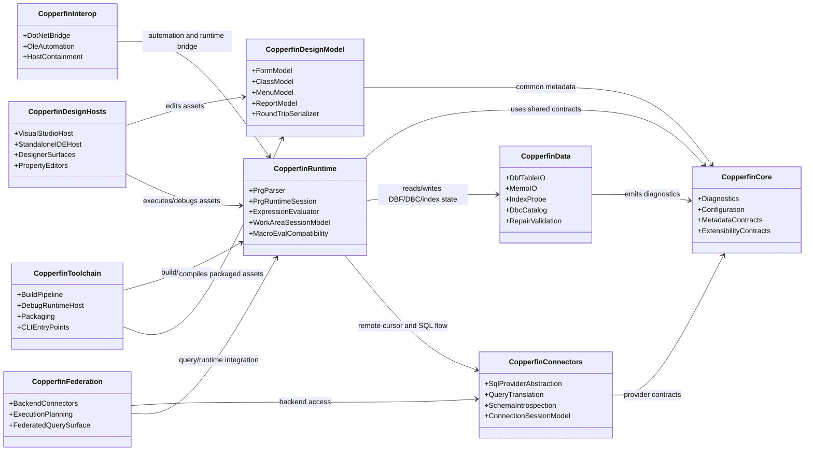
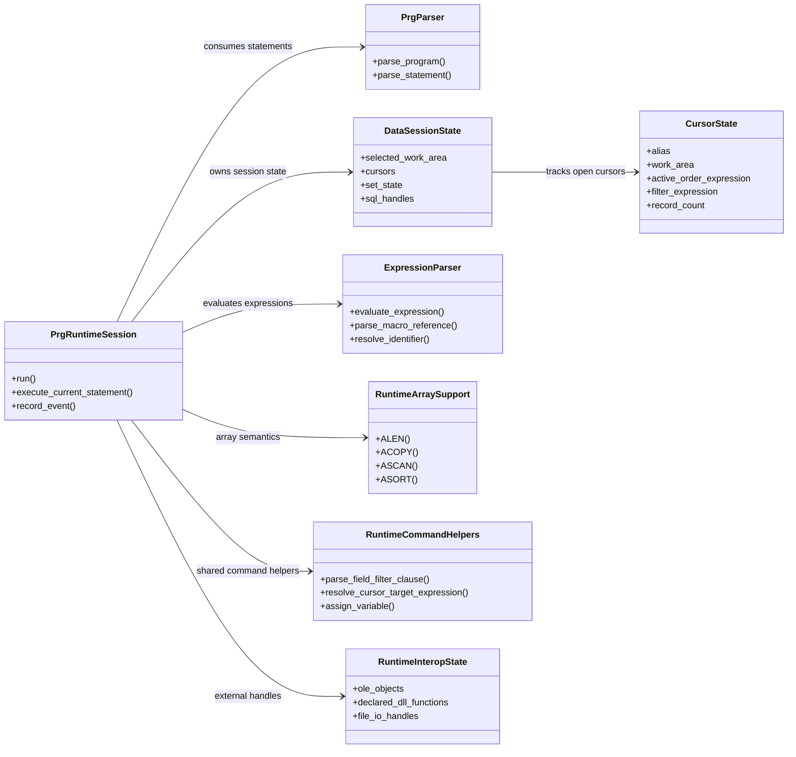

# System UML

This document provides a GitHub-compatible UML view of the Copperfin system.

Format choice:

- GitHub renders Mermaid diagrams natively in Markdown.
- Mermaid `classDiagram` is the safest UML-style format available directly on GitHub without requiring generated binaries or external viewers.
- The diagram below is intentionally architectural rather than code-generated. It is meant to explain subsystem boundaries and dependencies to reviewers who insist on a UML artifact.

## Core System Class Diagram

## Runtime Subsystem UML

## Reading Notes

- `CopperfinRuntime` is the current execution hub.
- `CopperfinData` and `CopperfinConnectors` feed the same runtime cursor/session surface from different storage backends.
- `CopperfinDesignHosts` sit above `CopperfinDesignModel` and should not dictate runtime semantics.
- `CopperfinInterop` and `CopperfinFederation` are deliberately downstream of the runtime core because they depend on stable execution and memory semantics.
