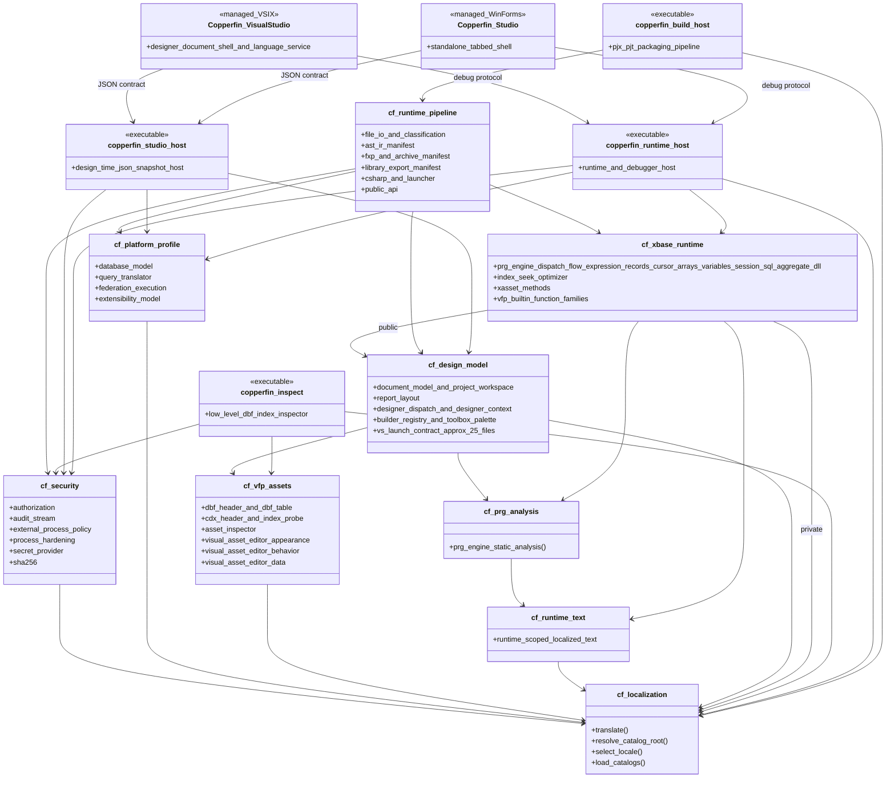
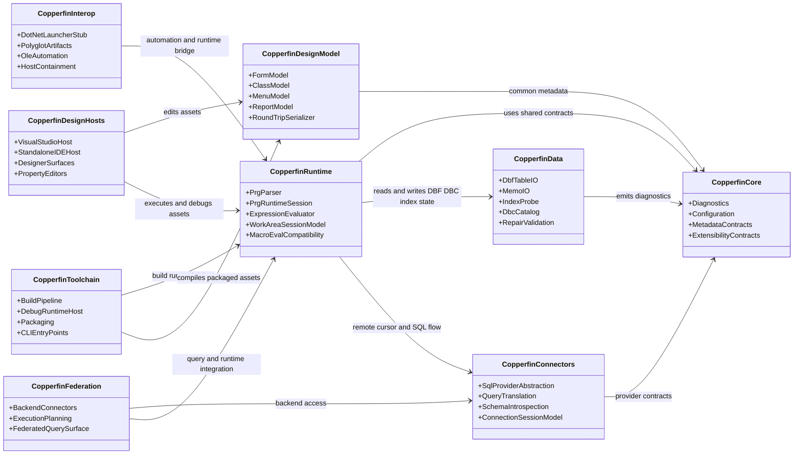
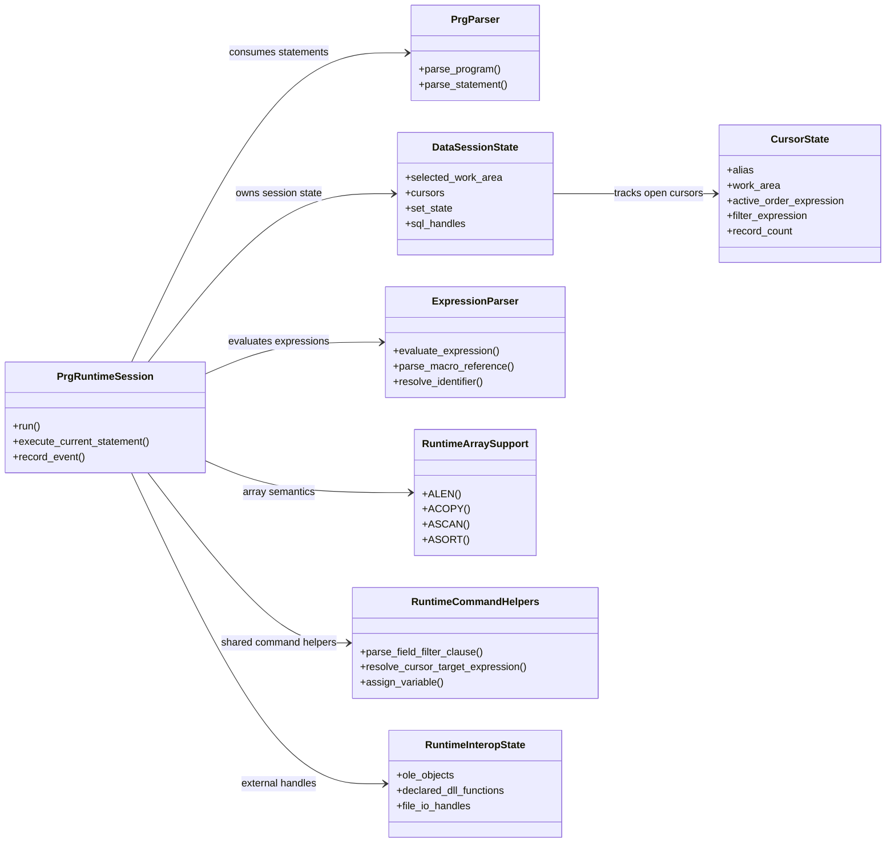

# System UML

This document provides a GitHub-compatible UML view of the Copperfin system.

Format choice:

- GitHub renders Mermaid diagrams natively in Markdown.
- Mermaid `classDiagram` is the safest UML-style format available directly on GitHub without requiring generated binaries or external viewers.
- The current project phase/topic map lives in `docs/05-roadmap.md`, while issue-linked evidence belongs in `agent-handoff.md` and the progress documents.

This file now carries two diagrams that must not be conflated:

1. **Ground-truth diagram** — reverse-engineered directly from `CMakeLists.txt`, `src/`, `apps/`, and `vsix/`, the same way `docs/28-repository-ontology.md` was built. This is what actually compiles and links today.
2. **Aspirational target-state diagram** — the `copperfin-*` module taxonomy from `docs/02-architecture.md`'s "Top-Level Product Map." `docs/28-repository-ontology.md` §6 is explicit that most of these names "do not exist as separate build targets today." Do not read it as current structure.

## Ground-Truth Class Diagram

This mirrors the real native library graph and the four native executables, plus the managed VSIX/Studio layer that talks to them over the JSON design/runtime contract. Class members name real files/concepts, not aspirational APIs.

```mermaid
classDiagram
    direction TB

    class cf_localization {
        +translate()
        +resolve_catalog_root()
        +select_locale()
        +load_catalogs()
    }

    class cf_security {
        +authorization
        +audit_stream
        +external_process_policy
        +process_hardening
        +secret_provider
        +sha256
    }

    class cf_platform_profile {
        +database_model
        +query_translator
        +federation_execution
        +extensibility_model
    }

    class cf_vfp_assets {
        +dbf_header_and_dbf_table
        +cdx_header_and_index_probe
        +asset_inspector
        +visual_asset_editor_appearance
        +visual_asset_editor_behavior
        +visual_asset_editor_data
    }

    class cf_runtime_text {
        +runtime_scoped_localized_text
    }

    class cf_prg_analysis {
        +prg_engine_static_analysis()
    }

    class cf_design_model {
        +document_model_and_project_workspace
        +report_layout
        +designer_dispatch_and_designer_context
        +builder_registry_and_toolbox_palette
        +vs_launch_contract_approx_25_files
    }

    class cf_xbase_runtime {
        +prg_engine_dispatch_flow_expression_records_cursor_arrays_variables_session_sql_aggregate_dll
        +index_seek_optimizer
        +xasset_methods
        +vfp_builtin_function_families
    }

    class cf_runtime_pipeline {
        +file_io_and_classification
        +ast_ir_manifest
        +fxp_and_archive_manifest
        +library_export_manifest
        +csharp_and_launcher
        +public_api
    }

    class copperfin_inspect {
        <<executable>>
        +low_level_dbf_index_inspector
    }

    class copperfin_studio_host {
        <<executable>>
        +design_time_json_snapshot_host
    }

    class copperfin_runtime_host {
        <<executable>>
        +runtime_and_debugger_host
    }

    class copperfin_build_host {
        <<executable>>
        +pjx_pjt_packaging_pipeline
    }

    class Copperfin_VisualStudio {
        <<managed_VSIX>>
        +designer_document_shell_and_language_service
    }

    class Copperfin_Studio {
        <<managed_WinForms>>
        +standalone_tabbed_shell
    }

    cf_security --> cf_localization
    cf_platform_profile --> cf_localization
    cf_vfp_assets --> cf_localization
    cf_runtime_text --> cf_localization
    cf_prg_analysis --> cf_runtime_text

    cf_design_model --> cf_vfp_assets
    cf_design_model --> cf_prg_analysis
    cf_design_model --> cf_localization

    cf_xbase_runtime --> cf_prg_analysis
    cf_xbase_runtime --> cf_runtime_text
    cf_xbase_runtime --> cf_design_model : public
    cf_xbase_runtime --> cf_localization : private

    cf_runtime_pipeline --> cf_design_model
    cf_runtime_pipeline --> cf_security
    cf_runtime_pipeline --> cf_platform_profile
    cf_runtime_pipeline --> cf_xbase_runtime

    copperfin_inspect --> cf_vfp_assets
    copperfin_inspect --> cf_security
    copperfin_inspect --> cf_localization

    copperfin_studio_host --> cf_design_model
    copperfin_studio_host --> cf_security
    copperfin_studio_host --> cf_platform_profile

    copperfin_runtime_host --> cf_xbase_runtime
    copperfin_runtime_host --> cf_security
    copperfin_runtime_host --> cf_platform_profile
    copperfin_runtime_host --> cf_localization

    copperfin_build_host --> cf_runtime_pipeline
    copperfin_build_host --> cf_localization

    Copperfin_VisualStudio --> copperfin_studio_host : JSON contract
    Copperfin_VisualStudio --> copperfin_runtime_host : debug protocol
    Copperfin_Studio --> copperfin_studio_host : JSON contract
    Copperfin_Studio --> copperfin_runtime_host : debug protocol
```

Reading notes for the ground-truth diagram:

- `cf_design_model` (the "designer" concern) is a *dependency of* `cf_xbase_runtime` (the runtime engine), not the reverse — the runtime needs design-model types (e.g. extracted xAsset methods) to execute `SCX/VCX/MNX/FRX/LBX` startup assets. This inverts the layering implied by the aspirational diagram below.
- `copperfin_studio_host` does **not** link `cf_xbase_runtime` directly; design-time JSON snapshot generation only needs `cf_design_model`.
- The managed layer (`Copperfin.VisualStudio`, `Copperfin.Studio`) never talks to native code by static linking — only through the `vs_launch_contract` JSON protocol and the runtime debug protocol, both surfaced by `cf_design_model`/`cf_xbase_runtime`.
- Source: `docs/28-repository-ontology.md` §2–5, generated by inspecting `CMakeLists.txt`/`src/`/`apps/`/`vsix/` directly.

## Aspirational Target-State Class Diagram

This is the `copperfin-*` module taxonomy from `docs/02-architecture.md`. It describes where the architecture is meant to go, not what exists in the build graph above. Treat every class here as a **target**, not a shipped component — with one exception noted below.

## Core System Class Diagram

```mermaid
classDiagram
    direction LR

    class CopperfinCore {
        +Diagnostics
        +Configuration
        +MetadataContracts
        +ExtensibilityContracts
    }

    class CopperfinData {
        +DbfTableIO
        +MemoIO
        +IndexProbe
        +DbcCatalog
        +RepairValidation
    }

    class CopperfinRuntime {
        +PrgParser
        +PrgRuntimeSession
        +ExpressionEvaluator
        +WorkAreaSessionModel
        +MacroEvalCompatibility
    }

    class CopperfinConnectors {
        +SqlProviderAbstraction
        +QueryTranslation
        +SchemaIntrospection
        +ConnectionSessionModel
    }

    class CopperfinDesignModel {
        +FormModel
        +ClassModel
        +MenuModel
        +ReportModel
        +RoundTripSerializer
    }

    class CopperfinDesignHosts {
        +VisualStudioHost
        +StandaloneIDEHost
        +DesignerSurfaces
        +PropertyEditors
    }

    class CopperfinToolchain {
        +BuildPipeline
        +DebugRuntimeHost
        +Packaging
        +CLIEntryPoints
    }

    class CopperfinInterop {
        +DotNetLauncherStub
        +PolyglotArtifacts
        +OleAutomation
        +HostContainment
    }

    class CopperfinFederation {
        +BackendConnectors
        +ExecutionPlanning
        +FederatedQuerySurface
    }

    CopperfinRuntime --> CopperfinCore : uses shared contracts
    CopperfinData --> CopperfinCore : emits diagnostics
    CopperfinRuntime --> CopperfinData : reads and writes DBF DBC index state
    CopperfinRuntime --> CopperfinConnectors : remote cursor and SQL flow
    CopperfinConnectors --> CopperfinCore : provider contracts
    CopperfinDesignModel --> CopperfinCore : common metadata
    CopperfinDesignHosts --> CopperfinDesignModel : edits assets
    CopperfinDesignHosts --> CopperfinRuntime : executes and debugs assets
    CopperfinToolchain --> CopperfinRuntime : build run and debug
    CopperfinToolchain --> CopperfinDesignModel : compiles packaged assets
    CopperfinInterop --> CopperfinRuntime : automation and runtime bridge
    CopperfinFederation --> CopperfinConnectors : backend access
    CopperfinFederation --> CopperfinRuntime : query and runtime integration
```

## Runtime Subsystem UML

This one is ground-truth-adjacent: the class names are illustrative groupings rather than literal type names, but each maps onto a real translation-unit family inside `cf_xbase_runtime`'s `prg_engine.cpp` + `.inl` partials (`_dispatch`, `_flow`, `_expression`, `_records`, `_cursor`, `_arrays`, `_variables`, `_session`, `_sql`, `_aggregate`, `_dll`), per `docs/28-repository-ontology.md` §3.

```mermaid
classDiagram
    direction LR

    class PrgParser {
        +parse_program()
        +parse_statement()
    }

    class PrgRuntimeSession {
        +run()
        +execute_current_statement()
        +record_event()
    }

    class CursorState {
        +alias
        +work_area
        +active_order_expression
        +filter_expression
        +record_count
    }

    class DataSessionState {
        +selected_work_area
        +cursors
        +set_state
        +sql_handles
    }

    class ExpressionParser {
        +evaluate_expression()
        +parse_macro_reference()
        +resolve_identifier()
    }

    class RuntimeArraySupport {
        +ALEN()
        +ACOPY()
        +ASCAN()
        +ASORT()
    }

    class RuntimeCommandHelpers {
        +parse_field_filter_clause()
        +resolve_cursor_target_expression()
        +assign_variable()
    }

    class RuntimeInteropState {
        +ole_objects
        +declared_dll_functions
        +file_io_handles
    }

    PrgRuntimeSession --> PrgParser : consumes statements
    PrgRuntimeSession --> ExpressionParser : evaluates expressions
    PrgRuntimeSession --> RuntimeCommandHelpers : shared command helpers
    PrgRuntimeSession --> DataSessionState : owns session state
    DataSessionState --> CursorState : tracks open cursors
    PrgRuntimeSession --> RuntimeArraySupport : array semantics
    PrgRuntimeSession --> RuntimeInteropState : external handles
```

## Reading Notes

Ground-truth diagram:

- `cf_xbase_runtime` is the current execution hub; `cf_design_model` is upstream of it (see inversion note above), not the other way around.
- `cf_security` and `cf_platform_profile` are siblings consumed identically by `copperfin_studio_host` and `copperfin_runtime_host`.
- Every native library except the base `cf_localization` and the `cf_runtime_text`/`cf_prg_analysis` pair depends on `cf_localization`, reflecting the hard localization-catalog requirement — though actual call-site adoption outside these wired libraries is still thin.

Aspirational diagram:

- `CopperfinRuntime` is meant to be the eventual execution hub; today that role is `cf_xbase_runtime`.
- `CopperfinData` and `CopperfinConnectors` are meant to feed the same runtime cursor/session surface from different storage backends; today `cf_vfp_assets` (data) and `cf_platform_profile` (connectors) are separate libraries with no unifying `copperfin-data`/`copperfin-connectors` target.
- `CopperfinDesignHosts` sit above `CopperfinDesignModel` and should not dictate runtime semantics — this rule already holds in the real graph.
- `CopperfinInterop` currently covers OLE/automation state, bounded Windows .NET Framework static-method `DECLARE` invocation, launcher-stub style .NET integration (real: `cf_runtime_pipeline`'s `_csharp_and_launcher`), and emitted polyglot artifacts; it is not yet a blanket first-class runtime bridge for arbitrary .NET/Python execution.
- `CopperfinInterop` and `CopperfinFederation` are deliberately downstream of the runtime core because they depend on stable execution and memory semantics.
- **Staleness correction:** `docs/02-architecture.md`'s module list still names `copperfin-vsix` as target-state alongside the others. It is not — `vsix/Copperfin.VisualStudio` and `vsix/Copperfin.Studio` are real, shipping managed projects today (see the ground-truth diagram above). Do not treat that one entry as aspirational when reading `docs/02`.
