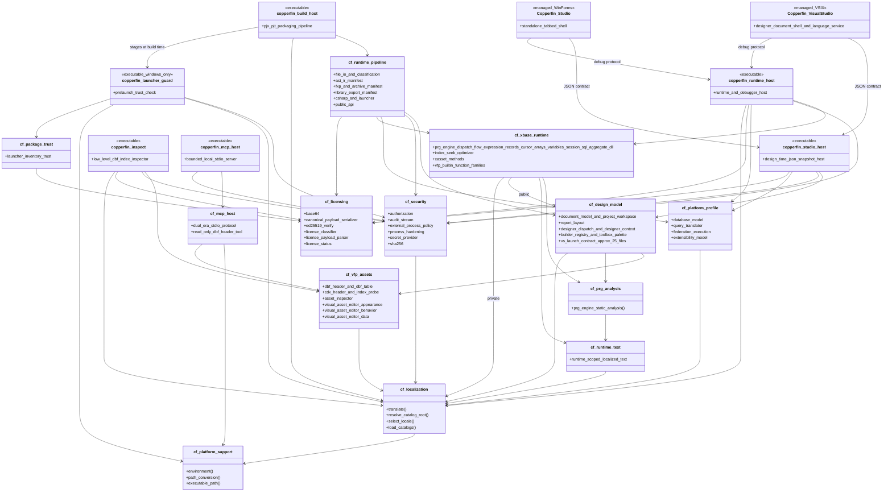

# System UML

This document provides a GitHub-compatible UML view of the Copperfin system.

Format choice:

- GitHub renders Mermaid diagrams natively in Markdown.
- Mermaid `classDiagram` is the safest UML-style format available directly on GitHub without requiring generated binaries or external viewers.
- The current project phase/topic map lives in `docs/05-roadmap.md`, while issue-linked evidence belongs in `agent-handoff.md` and the progress documents.

This UML documentation set now carries three diagrams that must not be conflated:

1. **Ground-truth diagram** (below, in this file) — reverse-engineered directly from `CMakeLists.txt`, `src/`, `apps/`, and `vsix/`, the same way `docs/28-repository-ontology.md` was built. This is what actually compiles and links today.
2. **Aspirational target-state diagram** (in [diagrams/uml-aspirational.md](diagrams/uml-aspirational.md)) — the `copperfin-*` module taxonomy from `docs/02-architecture.md`'s "Top-Level Product Map." `docs/28-repository-ontology.md` §6 is explicit that most of these names "do not exist as separate build targets today." Do not read it as current structure.

A third diagram, the [Runtime Subsystem UML](diagrams/uml-runtime-subsystem.md), is also split out. All three diagrams used to live on this one page; GitHub's Mermaid renderer only reliably renders the first diagram on a page with multiple diagrams and silently leaves the rest blank, so only the diagram most readers need inline — the ground-truth one — stays here.

## Ground-Truth Class Diagram

This mirrors the real native library graph and the five native executables, plus the managed VSIX/Studio layer that talks to them over the JSON design/runtime contract. Class members name real files/concepts, not aspirational APIs. Refreshed 2026-07-24 to add `cf_platform_support`, `cf_licensing`, `cf_package_trust`, and `copperfin_launcher_guard`, which were added to `CMakeLists.txt` after this diagram was first drawn.

```mermaid
classDiagram
    direction TB

    class cf_platform_support {
        +environment()
        +path_conversion()
        +executable_path()
    }

    class cf_localization {
        +translate()
        +resolve_catalog_root()
        +select_locale()
        +load_catalogs()
    }

    class cf_security {
        +authorization
        +audit_stream
        +external_process_policy
        +process_hardening
        +secret_provider
        +sha256
    }

    class cf_licensing {
        +base64
        +canonical_payload_serializer
        +ed25519_verify
        +license_classifier
        +license_payload_parser
        +license_status
    }

    class cf_package_trust {
        +launcher_inventory_trust
    }

    class cf_platform_profile {
        +database_model
        +query_translator
        +federation_execution
        +extensibility_model
    }

    class cf_mcp_host {
        +dual_era_stdio_protocol
        +read_only_dbf_header_tool
    }

    class cf_vfp_assets {
        +dbf_header_and_dbf_table
        +cdx_header_and_index_probe
        +asset_inspector
        +visual_asset_editor_appearance
        +visual_asset_editor_behavior
        +visual_asset_editor_data
    }

    class cf_runtime_text {
        +runtime_scoped_localized_text
    }

    class cf_prg_analysis {
        +prg_engine_static_analysis()
    }

    class cf_design_model {
        +document_model_and_project_workspace
        +report_layout
        +designer_dispatch_and_designer_context
        +builder_registry_and_toolbox_palette
        +vs_launch_contract_approx_25_files
    }

    class cf_xbase_runtime {
        +prg_engine_dispatch_flow_expression_records_cursor_arrays_variables_session_sql_aggregate_dll
        +index_seek_optimizer
        +xasset_methods
        +vfp_builtin_function_families
    }

    class cf_runtime_pipeline {
        +file_io_and_classification
        +ast_ir_manifest
        +fxp_and_archive_manifest
        +library_export_manifest
        +csharp_and_launcher
        +public_api
    }

    class copperfin_inspect {
        <<executable>>
        +low_level_dbf_index_inspector
    }

    class copperfin_mcp_host {
        <<executable>>
        +bounded_local_stdio_server
    }

    class copperfin_studio_host {
        <<executable>>
        +design_time_json_snapshot_host
    }

    class copperfin_runtime_host {
        <<executable>>
        +runtime_and_debugger_host
    }

    class copperfin_build_host {
        <<executable>>
        +pjx_pjt_packaging_pipeline
    }

    class copperfin_launcher_guard {
        <<executable_windows_only>>
        +prelaunch_trust_check
    }

    class Copperfin_VisualStudio {
        <<managed_VSIX>>
        +designer_document_shell_and_language_service
    }

    class Copperfin_Studio {
        <<managed_WinForms>>
        +standalone_tabbed_shell
    }

    cf_localization --> cf_platform_support
    cf_package_trust --> cf_licensing

    cf_security --> cf_localization
    cf_platform_profile --> cf_localization
    cf_vfp_assets --> cf_localization
    cf_mcp_host --> cf_platform_support
    cf_mcp_host --> cf_vfp_assets
    cf_runtime_text --> cf_localization
    cf_prg_analysis --> cf_runtime_text

    cf_design_model --> cf_vfp_assets
    cf_design_model --> cf_prg_analysis
    cf_design_model --> cf_localization

    cf_xbase_runtime --> cf_prg_analysis
    cf_xbase_runtime --> cf_runtime_text
    cf_xbase_runtime --> cf_design_model : public
    cf_xbase_runtime --> cf_localization : private

    cf_runtime_pipeline --> cf_design_model
    cf_runtime_pipeline --> cf_security
    cf_runtime_pipeline --> cf_platform_profile
    cf_runtime_pipeline --> cf_xbase_runtime
    cf_runtime_pipeline --> cf_licensing

    copperfin_inspect --> cf_vfp_assets
    copperfin_inspect --> cf_security
    copperfin_inspect --> cf_licensing
    copperfin_inspect --> cf_localization

    copperfin_mcp_host --> cf_mcp_host
    copperfin_mcp_host --> cf_security

    copperfin_studio_host --> cf_design_model
    copperfin_studio_host --> cf_security
    copperfin_studio_host --> cf_platform_profile
    copperfin_studio_host --> cf_licensing

    copperfin_runtime_host --> cf_xbase_runtime
    copperfin_runtime_host --> cf_security
    copperfin_runtime_host --> cf_platform_profile
    copperfin_runtime_host --> cf_licensing
    copperfin_runtime_host --> cf_localization

    copperfin_build_host --> cf_runtime_pipeline
    copperfin_build_host --> cf_localization
    copperfin_build_host --> copperfin_launcher_guard : stages at build time

    copperfin_launcher_guard --> cf_security
    copperfin_launcher_guard --> cf_localization
    copperfin_launcher_guard --> cf_platform_support
    copperfin_launcher_guard --> cf_package_trust

    Copperfin_VisualStudio --> copperfin_studio_host : JSON contract
    Copperfin_VisualStudio --> copperfin_runtime_host : debug protocol
    Copperfin_Studio --> copperfin_studio_host : JSON contract
    Copperfin_Studio --> copperfin_runtime_host : debug protocol
```

Reading notes for the ground-truth diagram:

- `cf_design_model` (the "designer" concern) is a *dependency of* `cf_xbase_runtime` (the runtime engine), not the reverse — the runtime needs design-model types (e.g. extracted xAsset methods) to execute `SCX/VCX/MNX/FRX/LBX` startup assets. This inverts the layering implied by the aspirational diagram below.
- `copperfin_studio_host` does **not** link `cf_xbase_runtime` directly; design-time JSON snapshot generation only needs `cf_design_model`.
- The managed layer (`Copperfin.VisualStudio`, `Copperfin.Studio`) never talks to native code by static linking — only through the `vs_launch_contract` JSON protocol and the runtime debug protocol, both surfaced by `cf_design_model`/`cf_xbase_runtime`.
- `cf_platform_support` is now the true root of the graph — `cf_localization` links it, so everything that transitively depends on `cf_localization` picks it up too.
- `cf_licensing` and `cf_package_trust` sit in their own small subgraph, deliberately outside the `cf_localization` catalog requirement: `cf_licensing` is dependency-free for offline unit-testability, and `cf_package_trust` links only `cf_licensing`'s verify-only Ed25519 primitive, never its parsing/status logic.
- `copperfin_launcher_guard` (Windows-only) is a build-time dependency of `copperfin_build_host` (staged into packages), not a link-time one — it implements the pre-launch trust check from `docs/29-package-trust-contract.md`.
- `copperfin_mcp_host` is an installed local stdio executable. Its dedicated
  `cf_mcp_host` library reuses strict platform JSON and DBF-header parsing;
  the executable adds process hardening, the existing `ai.mcp` permission
  check, and content-free audit events but no network or caller-file adapter.
- Source: `docs/28-repository-ontology.md` §2–5, generated by inspecting
  `CMakeLists.txt`/`src/`/`apps/`/`vsix/` directly; refreshed 2026-08-11.

## Aspirational Target-State Class Diagram

This is the `copperfin-*` module taxonomy from `docs/02-architecture.md`. It describes where the architecture is meant to go, not what exists in the build graph above. Treat every class here as a **target**, not a shipped component.

Moved to its own file to keep this page's diagram count to one — see
[diagrams/uml-aspirational.md](diagrams/uml-aspirational.md) for the full
diagram and reading notes.

## Runtime Subsystem UML

This one is ground-truth-adjacent: the class names are illustrative groupings rather than literal type names, but each maps onto a real translation-unit family inside `cf_xbase_runtime`'s `prg_engine.cpp` + `.inl` partials (`_dispatch`, `_flow`, `_expression`, `_records`, `_cursor`, `_arrays`, `_variables`, `_session`, `_sql`, `_aggregate`, `_dll`), per `docs/28-repository-ontology.md` §3.

Moved to its own file for the same reason — see
[diagrams/uml-runtime-subsystem.md](diagrams/uml-runtime-subsystem.md).

## Reading Notes

Ground-truth diagram:

- `cf_xbase_runtime` is the current execution hub; `cf_design_model` is upstream of it (see inversion note above), not the other way around.
- `cf_security` and `cf_platform_profile` are siblings consumed identically by `copperfin_studio_host` and `copperfin_runtime_host`.
- Every native library depends on `cf_localization` (and therefore `cf_platform_support`) except the two deliberately independent bases: `cf_licensing` and `cf_platform_support` itself. This reflects the hard localization-catalog requirement — though actual call-site adoption outside these wired libraries is still thin.

Aspirational and Runtime Subsystem reading notes now live alongside their
diagrams in [diagrams/uml-aspirational.md](diagrams/uml-aspirational.md) and
[diagrams/uml-runtime-subsystem.md](diagrams/uml-runtime-subsystem.md).
