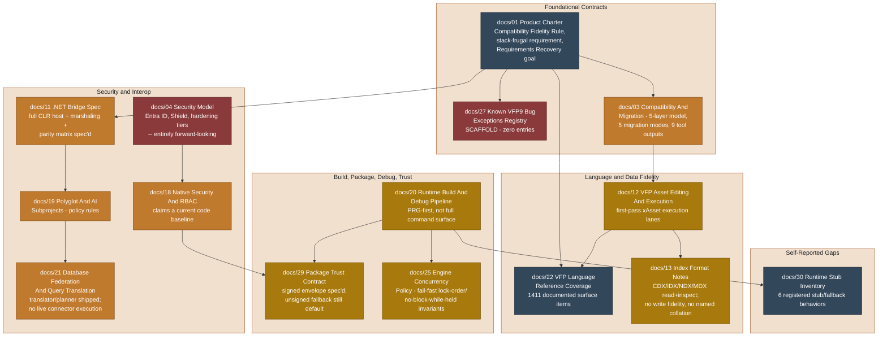

# Specification Compliance Gap Analysis

This document answers one question: **for every document in `docs/` that reads as a
specification or contract rather than narrative direction, what would it take to
make the repository actually meet it?** It is a snapshot, built by reading each
candidate document in full and extracting its concrete, testable requirements,
then comparing them against the ground-truth build graph in
[28-repository-ontology.md](28-repository-ontology.md) and the self-reported gaps in
[30-runtime-stub-inventory.md](30-runtime-stub-inventory.md).

This file does not replace the durable roadmap in [05-roadmap.md](05-roadmap.md) or
the phase/lane evidence in [23-phase-a-dependency-breakdown.md](23-phase-a-dependency-breakdown.md).
It exists to answer "what's the gap between the spec and the code" in one place,
since no other document does that comparison directly.

## Method

- A document counts as a **specification** here if it contains concrete, numbered,
  testable requirements — exact field names, contract shapes, enum lists, format
  bytes, "must"/"shall" statements — not just direction or preference.
- A document counts as **narrative** if it only expresses intent or design taste
  ("modernize the toolbox," "keep the shell thin"). Narrative docs are listed but
  not scored.
- "Gap" evidence is pulled from the specification document's own admissions where
  it makes one (several of these docs are unusually candid about their own
  incompleteness), cross-checked against `docs/28-repository-ontology.md`'s
  ground-truth build graph and `docs/30-runtime-stub-inventory.md`'s registered
  stubs.
- Percentages are not used here for the same reason `docs/05-roadmap.md` avoids
  them: several of the source documents explicitly reject percentage-based
  completion claims. Status is expressed as **met / partial / scaffold-only /
  narrative** instead.

## Specification Compliance Map

Legend: dark slate = the specification itself is primarily a measurement/inventory
(coverage matrix, stub registry) rather than a pass/fail contract. Amber = the
contract is substantially implemented with named, bounded gaps. Burnt orange =
a real seed exists but the bulk of the spec's scope is still ahead. Red = scaffold
only — the mechanism exists but is empty or entirely unclaimed.

## Foundational Contracts

### docs/01 — Product Charter

The charter's **Compatibility Fidelity Rule** is the load-bearing requirement for
the whole project: Copperfin must "exactly duplicate VFP9 behavior, including
undocumented edge-case behavior," with exactly two carve-outs — cataloged known-bug
exceptions and cataloged crash-input exceptions — both of which must be evidenced
against real, installed VFP9 or shipped documentation, never decompiled binaries.

**What it will take:** the rule is only as good as its exception registry. See
`docs/27` immediately below — until that registry has real entries, the charter's
rule is *unfalsifiable* in the sense that nothing currently distinguishes an
intentional exception from an unfiled parity bug. The charter's second concrete
requirement — the runtime must "remain stack-frugal rather than reproducing the
native-stack failure profile of `VFP.exe`" — is evidenced as implemented in
`docs/20-runtime-build-and-debug-pipeline.md` ("a heap-backed frame stack inside
the native runtime session... with a tested `MAXCALLDEPTH` guardrail"), so that
half of the charter is met. The charter's Requirements Recovery goal (a
DO-178-style traceability matrix) is explicitly a standing goal per
`docs/28-repository-ontology.md` §7. The durable matrix now begins in
`docs/32-recovered-requirements-traceability.md`; its first shipped-help-backed
row recovers the VFP period-decimal calculation contract. Broad subsystem
coverage remains unfinished.

### docs/27 — Known VFP9 Bug Exceptions Registry

**Status: scaffold only.** The document defines a precise 8-column entry schema
(`KBX-NNN`, classification, VFP9 behavior, evidence, Copperfin behavior, rationale,
status, linked issue) and a 7-step process for adding an entry — but the registry
itself states plainly: *"No entries yet. This is a scaffold... populate it as edge
cases are discovered and validated against real VFP9, not retroactively justified
after Copperfin's behavior is written."*

**What it will take:** a dedicated audit pass that (1) inventories every place the
runtime, designer, or asset layer is already known to diverge from real VFP9
behavior, (2) classifies each as `known-bug` or `crash`, (3) attaches evidence from
shipped VFP9 help/Language Reference/KB content or an installed VFP9 instance —
never decompiled binaries, per `docs/07-clean-room-rules.md` — and (4) files each
as a `KBX-NNN` row before any code comment or test can cite it as an intentional
exception. Until this exists, every undocumented Copperfin/VFP9 behavioral
difference is, by the charter's own rule, a parity defect rather than a sanctioned
exception.

### docs/03 — Compatibility And Migration

Defines a five-layer compatibility model (Data / Metadata / Runtime / UX-Designer /
Execution), five migration modes (Preserve, Wrap, Refactor, Replace, Retarget), a
9-step import pipeline, and a **9-file migration-tool output contract**
(`inventory.json`, `compatibility-report.md`, `unsupported-features.csv`,
`import-manifest.json`, `security-findings.md`, `database-target-plan.md`,
`type-mapping-report.csv`, `asset-roundtrip-report.md`,
`execution-compatibility-report.md`).

**What it will take:** per `docs/28-repository-ontology.md` §6, there is no
`copperfin-migrator` code at all yet — none of the 9 named output files have a
generator. The Data/Metadata/Runtime layers are substantially seeded by
`cf_vfp_assets`/`cf_design_model`/`cf_xbase_runtime`, but the migration *pipeline*
that would inventory a legacy project and emit these 9 specific artifacts does not
exist as a distinct deliverable. This is one of the widest gaps in the whole
review — a fully specified tool contract with zero implementing code.

## Language & Data Fidelity

### docs/22 — VFP Language Reference Coverage

This is a **coverage matrix**, not a pass/fail contract: it documents the full
official VFP9 language surface — **429 commands, 413 functions, 323 properties,
83 methods, 72 system variables, 69 events, 22 objects — 1,411 documented items
total** — and tracks per-symbol Copperfin coverage against it, hundreds of entries
deep, each phrased as "documented VFP9 behavior → current partial coverage claim
→ explicitly excluded remaining behavior."

**What it will take:** the document's own backlog section states plainly "the
official command inventory is much larger than the current runtime," and maps the
remaining work to open issues `#7`, `#8`, `#10`, `#11`, `#13`, `#14`, `#22`, `#24`,
`#30`, `#31`. Closing this gap is symbol-by-symbol, evidenced work — there is no
shortcut, by design (per `docs/07-clean-room-rules.md`, coverage can only expand
against real VFP9 behavior or shipped documentation).

### docs/13 — Index Format Notes

**Status: partial.** `CDX`/`DCX`/`IDX`/`NDX`/`MDX` header probing and read/inspect
behavior are implemented, including a shared `has_production_index()` flag and
`runtime.order`/`runtime.seek`/`runtime.rushmore` diagnostic events. But the
document is explicit about two named gaps: normalization/collation hints are
"heuristic metadata rather than true binary collation fidelity" and are not yet
mapped to named collation sequences, and `MDX`/general index **write fidelity is
explicitly out of scope**.

**What it will take:** two bounded, separable slices — (1) a named-collation
mapping table validated against format documentation, and (2) a dedicated
index-write fidelity slice kept deliberately separate from the existing
read/inspection parsing path, per the document's own "Next Steps."

### docs/12 — VFP Asset Editing And Execution

Defines four required modes (Inspect, Round-Trip Edit, Normalize, Execute) across
eight priority asset families. Its own "Current Implementation Snapshot" is candid:
inspection is solid for `DBF`/`FPT`/index families and first-pass `DBC`; local-table
mutation coverage is real; the runtime "can execute a substantial first-pass PRG
surface" including work areas, local queries, and SQL pass-through — but xAsset
bootstraps for forms/classes, reports/labels, and menus are explicitly qualified as
**"first-pass compatibility lanes rather than full VFP parity."**

**What it will take:** the milestones (A–D) in this document give the shape of the
remaining work; the concrete blocker is the same one `docs/22` names — expanding
xAsset execution fidelity is bounded by how much of the underlying language surface
is covered, so this gap and the `docs/22` gap close together, not independently.

## Build, Package, Debug, Trust

### docs/20 — Runtime Build And Debug Pipeline

**Status: partial, and unusually well-instrumented about its own limits.** Concrete,
implemented contracts exist: the `app.cfmanifest`/`app.cfdebug` package layout, the
`key=value` manifest format, the MVP recovery walkthrough's exact CTest targets, and
a stack-safety implementation (heap-backed frame stack, tested `MAXCALLDEPTH`). The
document's own "Current Limitations" section states the execution engine is
**"PRG-first, not yet the full FoxPro/VFP command/runtime surface,"** that
`SCX`/`VCX` embedded xBase code is "partially executable," that `MNX` menu
navigation and `FRX`/`LBX` report execution both "still need work," and that
package manifests are "not the finished long-term runtime format."

**What it will take:** this document is honest that its own MVP walkthrough "does
not replace the full platform validation matrix" and does not by itself satisfy
the release-readiness DV/DQ ledger IDs it cites. Closing this gap is the same
symbol-by-symbol runtime-surface work as `docs/22`, plus a follow-on pass to
formalize the manifest format beyond the current line-based `key=value` contract.

### docs/29 — Package Trust Contract

**Status: partial — spec is exact, default posture is not enforced.** The signed
envelope (`app.cftrust` + `app.cftrust.sig`) has a byte-exact canonical format,
a native verifier (`copperfin::package_trust`, explicitly distinct from
`copperfin::licensing`), and a CI workflow for validation. But the document states
plainly: **"ordinary development packages intentionally use the unsigned fallback
and must not be presented as meeting the Windows release trust boundary"** until an
approved signer and key registry are provisioned, and **"POSIX and macOS do not
claim this Windows trust boundary yet."**

**What it will take:** two concrete, named blockers — (1) provisioning a real
signing key and an out-of-tree approved public-key registry, then setting
`COPPERFIN_ENFORCE_LAUNCHER_TRUST=ON` for release builds, and (2) a separate,
not-yet-scoped decision about whether/how POSIX and macOS get an equivalent trust
boundary at all, since the current design is explicitly Windows-first here.

### docs/25 — Engine Concurrency Policy

**Status: implementation verified by source audit and focused native tests.** Four
hard invariants (named-mutex critical sections, ascending lock order across
sections, strict LIFO exit, no blocking operations while any section is held) are
specified with exact event-category names
(`runtime.critical.order_violation`, `runtime.critical.blocking_violation`) and a
4-step implementation-obligation checklist for any new blocking-capable path.

The shared `ensure_non_blocking_critical_section_policy()` helper is used by
`AWAIT`, positive-duration `SLEEP`, and lock-retry waits reached from record/file
mutation paths. The focused `test_prg_engine_control_flow` and
`test_prg_engine_table_mutation` suites cover ordering, strict-LIFO exits,
reentrancy, fast-fail blocking violations, cooperative `YIELD`, and cleanup after
task faults. This is source/test evidence only; hosted cross-platform validation
remains a separate release gate, and any future blocking path must route through
the same helper.

## Security & Interop

### docs/04 vs docs/18 — Security Model vs Native Security And RBAC

These two documents need to be read together, and they disagree in tense.
`docs/04-security-model.md` is written **entirely in the future conditional** — no
current-implementation claim appears anywhere in it. `docs/18-native-security-and-rbac.md`
claims a **present-tense baseline**: "a native security profile with explicit
permissions, roles, providers, features, audit events, and hardening profiles,"
surfaced in the Studio host JSON and project workspace summary, built around 5
named roles (`developer`, `build-engineer`, `security-admin`, `auditor`,
`runtime-operator`) and 3 hardening tiers (bronze/silver/gold).

**What it will take:** `docs/18`'s baseline claim maps onto real code —
`cf_security`'s `authorization`, `audit_stream`, `external_process_policy`,
`process_hardening`, and `secret_provider` modules per
`docs/28-repository-ontology.md` §3 — so the RBAC *mechanism* is real. What is
still missing is the wider vision in `docs/04`: enterprise identity federation
(Entra ID/OIDC/SAML), the 9-capability "Copperfin Shield" surface as a distinct
product component (today it's folded into `cf_security`, not a separate
`copperfin-shield` deliverable per the aspirational module list), and independent
verification that the 11-item audit-event enum `docs/04` specifies actually
matches the events `cf_security`'s `audit_stream` emits today.

### docs/11 — Engineering Spec: Copperfin .NET Bridge

**Status: spec'd in full, with a portable policy gateway and parity-call
execution still absent.** The document specs four native
modules (`cf_dotnet_host`, `cf_dotnet_marshaler`, `cf_dotnet_policy`,
`cf_dotnet_codegen`), three managed surfaces, a typed marshaling contract for 11
value kinds, a policy-driven call gateway with three outcomes
(`allow`/`fallback_native`/`reject`), and a three-tier parity matrix
(`exact`/`adapted`/`intentionally_not_supported`).

The portable profile now enforces verified actor, exact capability scope,
required audit readiness, and separate reflection/assembly/I/O/secret scopes;
it emits stable diagnostics and a structured audit record. An audited allow is
non-executable until a trusted sink commits the event and returns a non-empty
receipt; the focused adapter exercises the contained hash-chained audit stream.
The threat model in `docs/37-dotnet-interop-threat-model.md` fixes the
PRG-supervised job and foreign-thread boundary. The runtime now implements the
nonblocking supervision half for existing `SPAWN` tasks, including status,
cooperative cancellation, retained return values, and completed print output.
Per-task completion publication is synchronized and directly exercised by two
sibling supervisors polling the same handle under ThreadSanitizer; unrelated
tasks remain independently scheduled.
The portable external-process prerequisite now captures exact stdout/stderr
bytes under independent fixed ceilings while preserving timeout, cancellation,
and complete descendant cleanup. Cross-stream drainers prevent pipe deadlock,
and Windows restricts inherited handles to the three explicit standard handles.
This is transport evidence only: captured bytes are not yet tied to an admitted
artifact, request, route, or PRG dispatch.
It also exposes bounded native JSON validation, type inspection, and JSON
Pointer selection so PRG can examine immutable structured completion payloads
without embedding foreign source or losing exact number spelling.
The native safe-regex facade additionally provides bounded byte-oriented text
validation/extraction without a backtracking engine; advanced regex features
remain unsupported unless a future separately approved route supplies them.
The native payload facade also exposes bounded exact-byte SHA-256,
HMAC-SHA256 generation/verification, and strict canonical Base64 encode/decode
for PRG-controlled immutable results,
without claiming sender authentication, encryption, or artifact admission.
External artifact admission, dispatch, and managed execution remain absent.

**What it will take:** none of the four named native execution/marshaling
modules exist yet. What exists today, per `docs/28-repository-ontology.md` §3, is
`cf_runtime_pipeline`'s `_csharp_and_launcher` — a generated C# launcher stub
that runs as a child and forwards to the native runtime host. That is the
entire current footprint of a
fully-specified CLR-hosting-and-marshaling subsystem beyond the portable policy
model. This is corroborated
verbatim in three places — `docs/01` (charter), `docs/19` (polyglot), and here —
all stating the same thing in nearly identical language: **the transpiled C#
output is emitted, never executed, by the runtime host.** The runnable launcher
and the separately emitted transpilation artifact are distinct outputs.

### docs/19 — Polyglot And AI Subprojects

Restates the same .NET gap and adds: **"Python and broader polyglot support are
planning/scaffolding surfaces only; there is no Python runtime hook today."**
Specifies 7 hard rules for MCP/AI tooling (opt-in only, provider-agnostic,
policy-controlled, auditable, local-or-enterprise model choice, user-selectable
models within admin policy, and — critically — ordinary relational queries must
stay deterministic and not require AI).

**What it will take:** the AI/MCP rules are policy constraints on a capability
that doesn't fully exist yet either — `cf_platform_profile`'s
`extensibility_model` is the closest real seed. Nothing here is contradicted by
current code; it simply hasn't been built out to the point where the policy rules
have much surface area to govern yet.

### docs/21 — Database Federation And Query Translation

**Status: partial, real seed.** The document's own "Current Implementation
Snapshot" states the platform already has "a deterministic Fox SQL translation
lane for relational backends" and "a deterministic federation execution-planning
lane that materializes backend/target/sql plans" — this matches
`cf_platform_profile`'s `query_translator`/`federation_execution`/`database_model`
in the real build graph. The same section states what's missing in one sentence:
**"the live end-to-end connector layer: actual backend execution integration,
broader provider/session behavior, and deeper non-relational connector slices."**

**What it will take:** the document names its own near-term completion bar
explicitly — live relational connector execution behind the existing
translator/planner, clearer provider-session/cursor capability contracts, and
deeper local-to-relational mapping documentation. This is the cleanest-specified
gap in the whole review because the source document already states its own exit
criteria.

## Self-Reported Gaps

### docs/30 — Runtime Stub Inventory

This document is gap-evidence by construction — a living register of intentional
stubs and fallbacks, each with a file path, a reason, and a follow-up note. Six
entries exist today: `AMEMBERS()`/`ACLASS()` and `PEMSTATUS()`/`GETPEM()`/
`SETPEM()`/`ADDPROPERTY()`/`REMOVEPROPERTY()` (both in
`prg_engine_runtime_surface_dispatch_object.inl`, host-capability fallbacks),
`CURSORTOXML()`/`XMLTOCURSOR()` (same file), `AFONT()` (`prg_engine_variables.inl`,
host-aware platform font-directory discovery with a fixed headless fallback when
no host fonts are found), generated
runtime bridge exports (`runtime_pipeline_library_export_manifest.cpp`, a
deliberate interop boundary), and unsupported optimizer/query shapes
(`index_seek_optimizer.h`/`rushmore_planning.h`, a deliberate semantic boundary).

**What it will take:** the document's own maintenance rule is the answer — "a
completion slice removes or updates the row only after focused tests prove the
replacement behavior and the relevant cross-platform validation passes." Each row
is independently closeable; none of the six are blocked on each other. The
`AMEMBERS()`/`GETPEM()` family and the runtime bridge exports both explicitly
depend on the eventual `.NET`/native interop roadmap (see `docs/11` above) before
they can move past fallback.

## Detailed Gap Diagrams

Both moved to their own files because GitHub's Mermaid renderer only
reliably renders the first diagram on a page with multiple diagrams; this
page keeps only the Specification Compliance Map inline.

### Interop, Federation, Trust, and Security

See
[diagrams/gap-analysis-interop-federation-trust-security.md](diagrams/gap-analysis-interop-federation-trust-security.md).

### Language & Data Fidelity

See
[diagrams/gap-analysis-language-data-fidelity.md](diagrams/gap-analysis-language-data-fidelity.md).

## Narrative Documents (Not Scored)

These read as direction/preference rather than testable contracts, and are
excluded from the compliance map above:

- `docs/09-adr-cpp-first.md` — architecture decision record; accepted, narrative by design.
- `docs/14-hybrid-studio-and-visual-studio-host.md` — host-model decision and sequencing; forward-looking recommendation, no current-state claims.
- `docs/16-vfp9-equivalent-subsystems.md` — a VFP9-module-to-Copperfin-target naming map, not a behavioral contract.
- `docs/17-modern-designer-direction.md` — UX/design direction only.

## Summary Table

| Doc | Subject | Status | Single biggest blocker |
| --- | --- | --- | --- |
| 01 | Product Charter | Partial | Empty exception registry makes the Compatibility Fidelity Rule unfalsifiable |
| 03 | Compatibility And Migration | Scaffold-only (migrator) | Zero code toward the 9-file migration tool output contract |
| 04 | Security Model | Scaffold (aspirational) | No enterprise identity/Shield product surface distinct from `cf_security` |
| 11 | .NET Bridge Spec | Seed only | None of the four named native `cf_dotnet_*` modules exist |
| 12 | VFP Asset Editing And Execution | Partial | xAsset execution is first-pass, bounded by language-surface coverage |
| 13 | Index Format Notes | Partial | No index write fidelity; collation hints are heuristic, not named |
| 18 | Native Security And RBAC | Partial (real baseline) | Not yet verified against docs/04's fuller vision |
| 19 | Polyglot And AI Subprojects | Seed only | No Python runtime hook; AI/MCP policy has little to govern yet |
| 20 | Runtime Build And Debug Pipeline | Partial | Engine is PRG-first, not the full command surface |
| 21 | Database Federation And Query Translation | Partial (real seed) | No live connector execution behind the translator/planner |
| 22 | VFP Language Reference Coverage | Partial, measured | 1,411 documented items; official surface exceeds current runtime |
| 25 | Engine Concurrency Policy | Met for current implementation | Shared blocking-policy helper and focused native coverage verify the four invariants; hosted cross-platform evidence remains a release gate |
| 27 | Known VFP9 Bug Exceptions Registry | Scaffold-only | Zero entries |
| 29 | Package Trust Contract | Partial | Unsigned fallback is still the default; POSIX/macOS unclaimed |
| 30 | Runtime Stub Inventory | Self-reporting | 6 registered stubs, each independently closeable |

## Documentation Ownership

- This file owns the specification-vs-implementation gap analysis. Its two
  detailed gap diagrams live in `docs/diagrams/gap-analysis-*.md`, split out
  because GitHub's Mermaid renderer only reliably renders the first diagram
  on a page with several.
- It does not restate `docs/05-roadmap.md`'s completion model or phase/topic map,
  and does not claim overall project completion percentages.
- Refresh it when a cited document's own status language changes, or when a
  gap closes and should move to the historical record instead.
