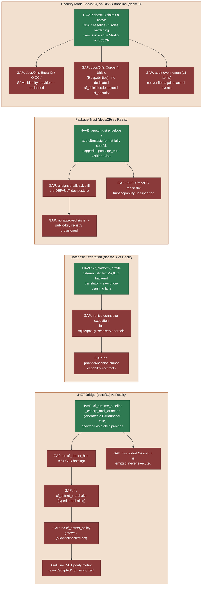

# Interop, Federation, Trust, and Security — Detailed Gap Diagram

Part of [31-specification-compliance-gap-analysis.md](../31-specification-compliance-gap-analysis.md).

This diagram is kept in its own file because GitHub's Mermaid renderer only
reliably renders the first diagram on a page; a page with several diagrams
tends to render only the first and leave the rest blank.

