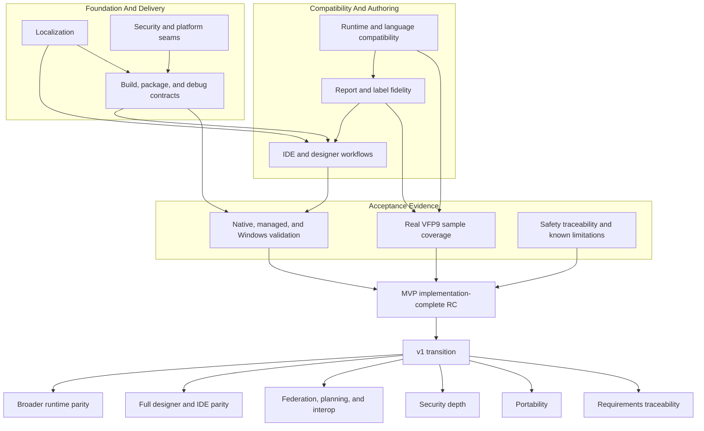

# Phase And Topic Map

Part of [05-roadmap.md](../05-roadmap.md). This map is a durable view of the
project tree by workstream topic. It describes relationships and completion
gates, not a queue or a promise that every topic is implemented. It predates
the lettered-lane reconstruction and uses workstream names rather than lane
letters; see
[roadmap-full-phase-dependency.md](roadmap-full-phase-dependency.md) for the
same shape using the real lane identities.

This diagram is kept in its own file because GitHub's Mermaid renderer only
reliably renders the first diagram on a page; a page with several diagrams
tends to render only the first and leave the rest blank.

