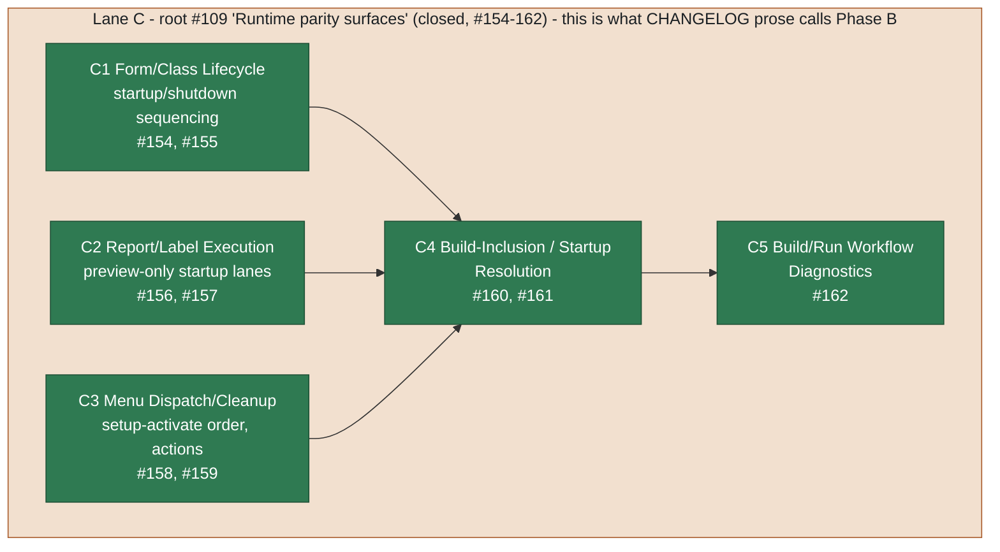

# Phase B — Runtime & xAsset Parity (slice-lane C)

Part of [05-roadmap.md](../05-roadmap.md), one of the
[Per-Phase Dependency Diagrams And Roadmaps](../05-roadmap.md#per-phase-dependency-diagrams-and-roadmaps).

This diagram is kept in its own file because GitHub's Mermaid renderer only
reliably renders the first diagram on a page; a page with several diagrams
tends to render only the first and leave the rest blank.

**What's done:** all five sub-lanes shipped and closed in a single May 2026
batch — form/class, report/label, and menu xAsset lifecycle sequencing, plus
the build-inclusion and workflow-diagnostics work that depends on all three.
**What's left:** the implementation work formerly named as "host stability and
debugger fault containment" is complete through #4623 and its focused child
slices for the runtime host, PRG debugger, forms/classes/menus, and
reports/labels. Hosted Windows, mounted-VFP9, and Visual Studio validation
was release evidence under #4621 and is now recorded by that closed issue, not
unfinished Phase B implementation.
