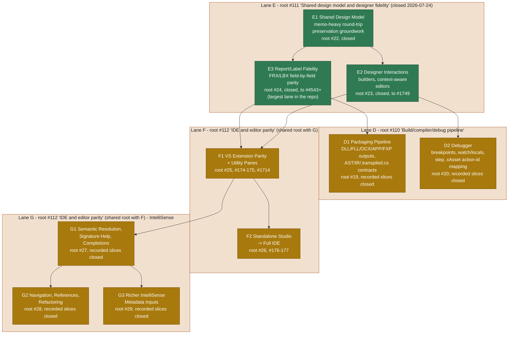

# Phase C — Designer, IDE & Delivery Pipeline (slice-lanes D + E + F + G)

Part of [05-roadmap.md](../05-roadmap.md), one of the
[Per-Phase Dependency Diagrams And Roadmaps](../05-roadmap.md#per-phase-dependency-diagrams-and-roadmaps).

This diagram is kept in its own file because GitHub's Mermaid renderer only
reliably renders the first diagram on a page; a page with several diagrams
tends to render only the first and leave the rest blank.

**What's done:** lane E (shared design model, designer interactions, and
report/label fidelity) closed on 2026-07-24 — the newest closure in the whole
repo. The cited D1/D2 and most G1/G2/G3 slices are also closed in live GitHub state,
while lane F has substantial shipped host and utility-pane slices. F2 now also
has localized standalone Build/Run/Debug menu routing at #4888 and focus-scoped
Edit/Undo routing at #4889, while the broader full-IDE parent stays open. G2
child #4887 is reclosed at corrected combined head `9f8f425cf` after array-
subscript and `TEXT ... ENDTEXT` reference fixes.
**What's left:** hosted Windows,
mounted-VFP9, and Visual Studio validation remain
release-evidence gates for the completed implementation slices (per
`agent-handoff.md`); the broader D, F, and G umbrella scopes remain open under
the current MVP subgoal tree and must not be inferred complete from the cited
slice closures.
