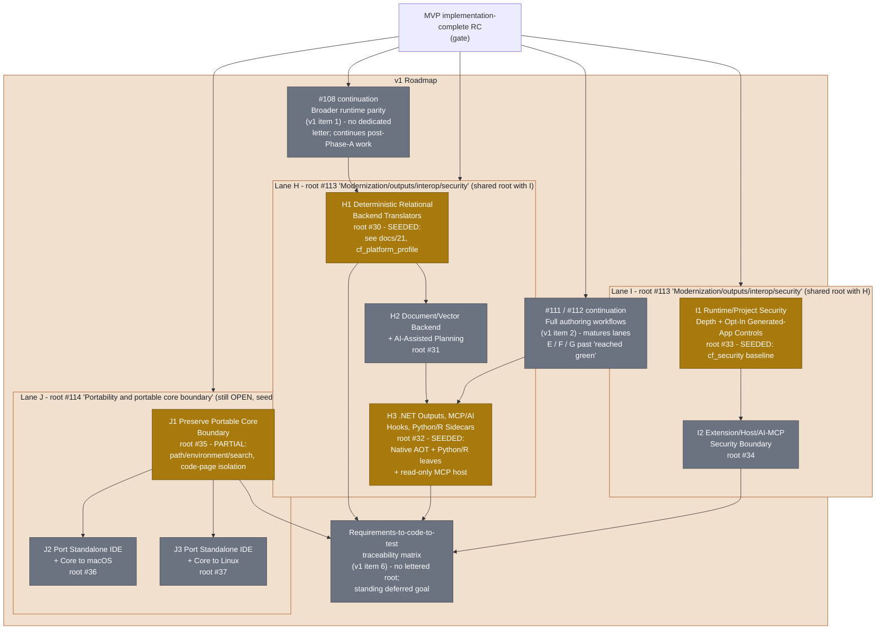

# v1 — Post-MVP Roadmap (slice-lanes H + I + J)

Part of [05-roadmap.md](../05-roadmap.md), one of the
[Per-Phase Dependency Diagrams And Roadmaps](../05-roadmap.md#per-phase-dependency-diagrams-and-roadmaps).

This diagram is kept in its own file because GitHub's Mermaid renderer only
reliably renders the first diagram on a page; a page with several diagrams
tends to render only the first and leave the rest blank.

**What's done:** `H1` has relational backend translators; `H3` has an admitted
Native AOT leaf, admitted Python and R sidecar leaves, one bounded read-only MCP
DBF-header host, advisory measured-route strategy, and versioned representative
benchmark evidence; and `I1` has a security baseline. These real seeds are
`cf_platform_profile`'s deterministic Fox-SQL
translator/execution-planning lane, the trusted polyglot host and route-impact
boundary, and `cf_security`'s RBAC/audit/secrets/signing baseline, respectively.
`J1` now has explicit portable public path, process-environment,
executable-search, file-version metadata, and code-page boundaries plus a private SQLite
native-ABI boundary:
platform-neutral declarations remain in the broadly consumed headers while
Windows/POSIX selection and native implementation stay private to
`cf_platform_support`, with direct and source-contract tests scheduled on all
three hosts.
`AGETFILEVERSION()` keeps its seven-row VFP and verified-snapshot contracts
while Windows version-resource APIs and the POSIX PE-resource fallback remain
private to that base layer.
The read-only connector retains Windows/POSIX SQLite selection privately;
public Copperfin headers reject host-selection and native SQLite API tokens.
`H3` still lacks broader managed-language environments and model/provider or
mutable MCP/AI adapters. **What's left, and what it
takes:** this is
covered in full, document-by-document, in
[31-specification-compliance-gap-analysis.md](../31-specification-compliance-gap-analysis.md) —
in particular its interop/federation/trust/security and language/data-fidelity
gap diagrams give the `H`/`I` gaps in the same level of detail as this diagram
gives their dependency shape. Lane `J` still needs a broader portable-core
inventory and isolation of shell, printing, OLE/COM, CLR-hosting, and other
native seams before J1 can close; the J2/J3 host ports remain planned.
