# Whole-System Architecture

Part of [05-roadmap.md](../05-roadmap.md). This map shows the real
native/managed build graph together with the aspirational `copperfin-*`
module taxonomy from `docs/02-architecture.md`'s "Top-Level Product Map," in
one diagram, so the distance between what exists and what is planned is
visible at a glance. It mirrors the ground-truth class diagram in
[24-system-uml.md](../24-system-uml.md) but in flowchart form rather than
UML, and folds in the aspirational layer that document deliberately keeps
separate.

This diagram is kept in its own file because GitHub's Mermaid renderer only
reliably renders the first diagram on a page; a page with several diagrams
tends to render only the first and leave the rest blank.

```mermaid
flowchart TB
    classDef real fill:#2f7a52,stroke:#1e5136,color:#ffffff,stroke-width:1px;
    classDef seed fill:#a8790c,stroke:#6e4f07,color:#ffffff,stroke-width:1px;
    classDef none fill:#8a3a3a,stroke:#5c2626,color:#ffffff,stroke-width:1px;
    classDef ground fill:#33475b,stroke:#1f2c38,color:#ffffff,stroke-width:1px;
    classDef exe fill:#4b5563,stroke:#2f353b,color:#ffffff,stroke-width:1px;
    classDef lane fill:#f2e0cf,stroke:#a85a2a,color:#1b2024,stroke-width:1px;

    subgraph CORE["Ground Truth Native Libraries (cf_*)"]
      direction TB
      L1["cf_localization"]
      L2["cf_security"]
      L3["cf_platform_profile"]
      L4["cf_vfp_assets"]
      L5["cf_runtime_text"]
      L6["cf_prg_analysis"]
      L7["cf_design_model"]
      L8["cf_xbase_runtime"]
      L9["cf_runtime_pipeline"]
    end

    subgraph EXEC["Ground Truth Executables + Managed Hosts"]
      direction TB
      X1["copperfin_inspect"]
      X2["copperfin_studio_host"]
      X3["copperfin_runtime_host"]
      X4["copperfin_build_host"]
      X5["Copperfin.VisualStudio (VSIX)"]
      X6["Copperfin.Studio (WinForms)"]
    end

    subgraph ASPIRATIONAL["Aspirational copperfin-* Modules (docs/02 Top-Level Product Map)"]
      direction TB
      A1["copperfin-core - NOT extracted"]
      A2["copperfin-data - NOT extracted"]
      A3["copperfin-connectors - PARTIAL SEED"]
      A4["copperfin-runtime - NOT extracted"]
      A5["copperfin-designer - NOT extracted"]
      A6["copperfin-reports - NOT extracted"]
      A7["copperfin-migrator - NO CODE"]
      A8["copperfin-dotnet - PARTIAL SEED"]
      A9["copperfin-gateway - NO CODE"]
      A10["copperfin-shield - PARTIAL SEED"]
      A11["copperfin-cli - INFORMAL ONLY"]
      A12["copperfin-vsix - ALREADY REAL (label stale)"]
    end

    L2 --> L1
    L3 --> L1
    L4 --> L1
    L5 --> L1
    L6 --> L5
    L7 --> L4
    L7 --> L6
    L7 --> L1
    L8 --> L6
    L8 --> L5
    L8 --> L7
    L9 --> L7
    L9 --> L2
    L9 --> L3
    L9 --> L8

    X1 --> L4
    X1 --> L2
    X2 --> L7
    X2 --> L2
    X2 --> L3
    X3 --> L8
    X3 --> L2
    X3 --> L3
    X4 --> L9
    X5 --> X2
    X5 --> X3
    X6 --> X2
    X6 --> X3

    A1 -.extract from.-> L1
    A2 -.extract from.-> L4
    A2 -.requires.-> A1
    A3 -.deepen: live backend exec.-> L3
    A3 -.requires.-> A2
    A4 -.extract/rename from.-> L8
    A4 -.requires.-> A2
    A5 -.extract from.-> L7
    A5 -.requires.-> A2
    A6 -.new render/export module.-> L7
    A6 -.requires.-> A4
    A7 -.new code entirely.-> L4
    A7 -.requires.-> A5
    A8 -.deepen: real CLR host.-> L9
    A8 -.requires.-> A4
    A9 -.new code entirely.-> L2
    A9 -.requires.-> A8
    A10 -.deepen: policy-profile depth.-> L2
    A11 -.unify existing hosts.-> L9
    A12 -.already implemented as.-> X5

    class L1,L2,L3,L4,L5,L6,L7,L8,L9 ground;
    class X1,X2,X3,X4,X5,X6 exe;
    class A1,A2,A4,A5,A6,A11 none;
    class A3,A8,A10 seed;
    class A7,A9 none;
    class A12 real;
    class CORE,EXEC,ASPIRATIONAL lane;
```

