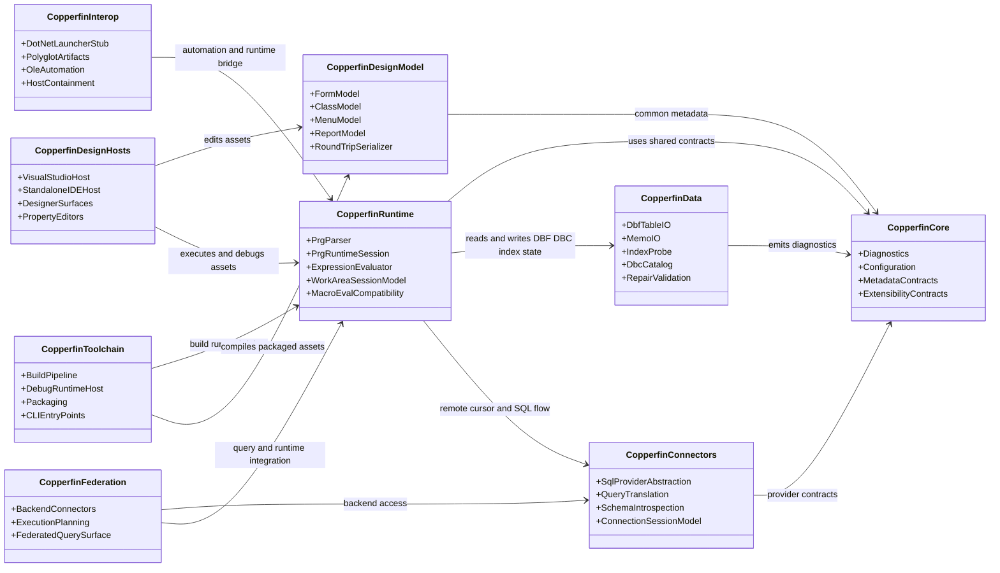

# Aspirational Target-State Class Diagram

Part of [24-system-uml.md](../24-system-uml.md). This is the `copperfin-*` module
taxonomy from `docs/02-architecture.md`. It describes where the architecture is
meant to go, not what exists in the build graph — see the Ground-Truth Class
Diagram in [24-system-uml.md](../24-system-uml.md) for what actually compiles
today. Treat every class here as a **target**, not a shipped component — with
one exception noted in the reading notes below.

This diagram is kept in its own file because GitHub's Mermaid renderer only
reliably renders the first diagram on a page; a page with several diagrams
tends to render only the first and leave the rest blank. See
[28-repository-ontology.md](../28-repository-ontology.md) §6 for the prose
version of this same target-state gap.

## Reading Notes

- `CopperfinRuntime` is meant to be the eventual execution hub; today that role
  is `cf_xbase_runtime`.
- `CopperfinData` and `CopperfinConnectors` are meant to feed the same runtime
  cursor/session surface from different storage backends; today `cf_vfp_assets`
  (data) and `cf_platform_profile` (connectors) are separate libraries with no
  unifying `copperfin-data`/`copperfin-connectors` target.
- `CopperfinDesignHosts` sit above `CopperfinDesignModel` and should not
  dictate runtime semantics — this rule already holds in the real graph.
- `CopperfinInterop` currently covers OLE/automation state, bounded Windows
  .NET Framework static-method `DECLARE` invocation, launcher-stub style .NET
  integration (real: `cf_runtime_pipeline`'s `_csharp_and_launcher`), and
  emitted polyglot artifacts; it is not yet a blanket first-class runtime
  bridge for arbitrary .NET/Python execution.
- `CopperfinInterop` and `CopperfinFederation` are deliberately downstream of
  the runtime core because they depend on stable execution and memory
  semantics.
- **Staleness correction:** `docs/02-architecture.md`'s module list still
  names `copperfin-vsix` as target-state alongside the others. It is not —
  `vsix/Copperfin.VisualStudio` and `vsix/Copperfin.Studio` are real, shipping
  managed projects today (see the Ground-Truth Class Diagram in
  [24-system-uml.md](../24-system-uml.md)). Do not treat that one entry as
  aspirational when reading `docs/02`.
