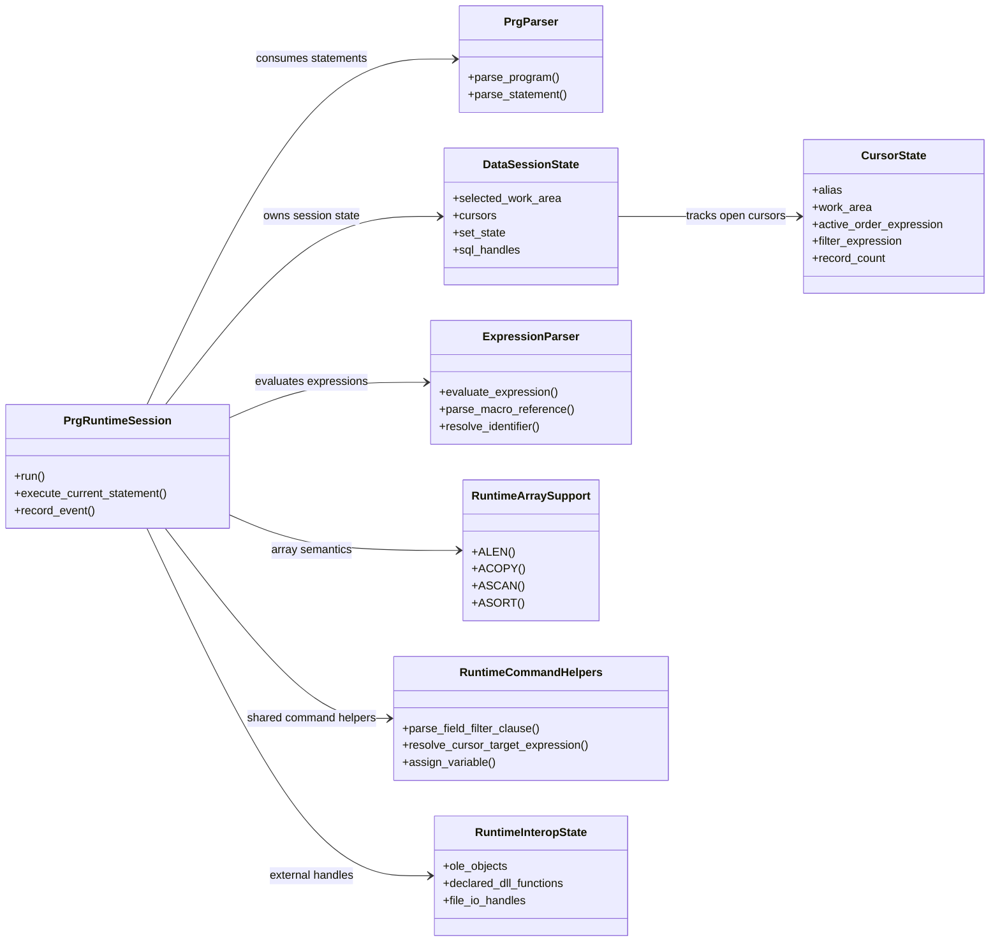

# Runtime Subsystem UML

Part of [24-system-uml.md](../24-system-uml.md). This one is ground-truth-adjacent:
the class names are illustrative groupings rather than literal type names, but
each maps onto a real translation-unit family inside `cf_xbase_runtime`'s
`prg_engine.cpp` + `.inl` partials (`_dispatch`, `_flow`, `_expression`,
`_records`, `_cursor`, `_arrays`, `_variables`, `_session`, `_sql`,
`_aggregate`, `_dll`), per
[28-repository-ontology.md](../28-repository-ontology.md) §3.

This diagram is kept in its own file because GitHub's Mermaid renderer only
reliably renders the first diagram on a page; a page with several diagrams
tends to render only the first and leave the rest blank.

