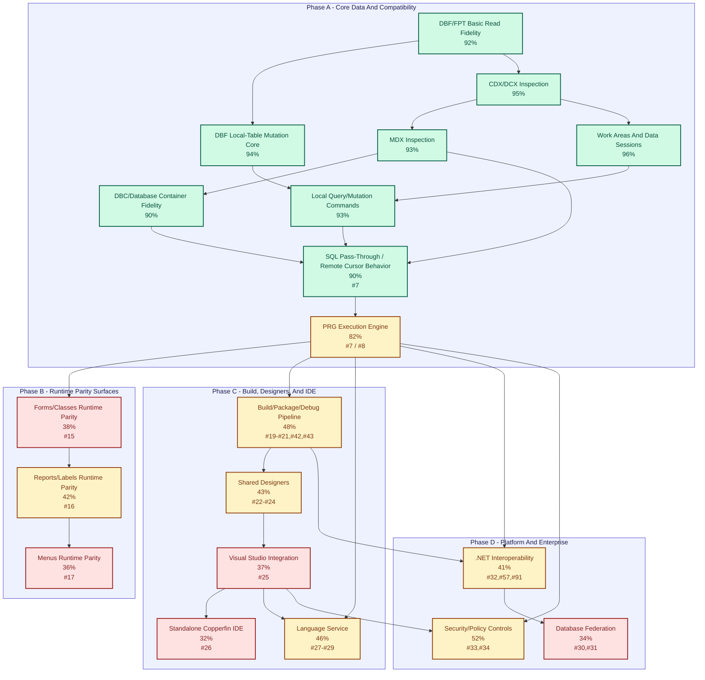
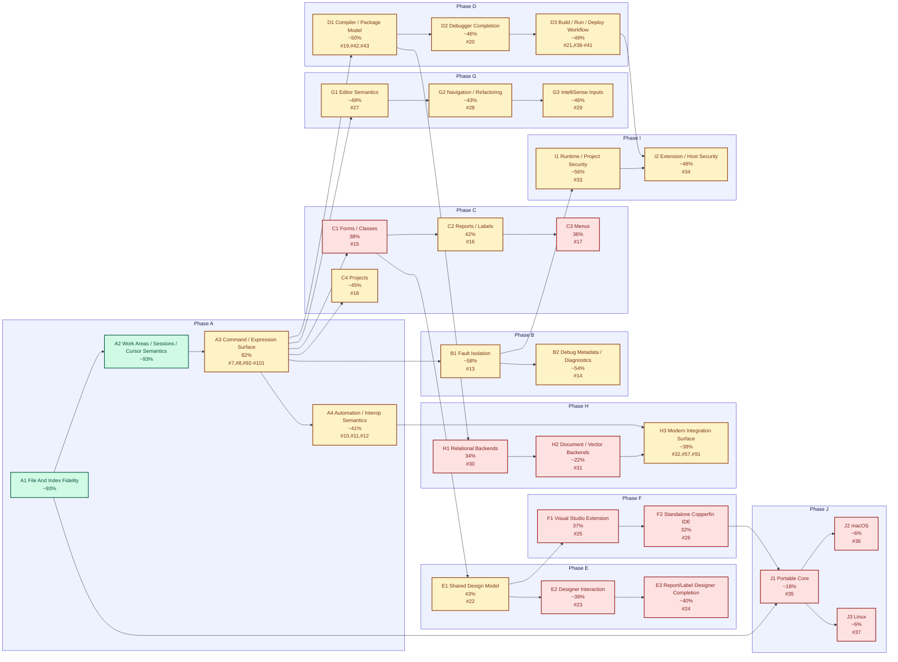

# Remaining Work

This file is the working guide for the remaining Copperfin implementation effort.

It is intentionally ordered by dependency depth:

1. deepest shared engine layers first
2. runtime semantics next
3. designer/runtime integration after that
4. IDE shells and workflow surfaces on top
5. portability after the Windows-first product is genuinely solid

The goal is not merely feature count. The goal is to finish the stack in an order where each completed layer reduces risk for the layers above it.

## North Star

Copperfin should eventually provide:

- full behavioral compatibility with the parts of `vfp9.exe` that FoxPro developers expect in real projects
- a full Visual Studio 2022+ experience for FoxPro/VFP assets and code
- a full standalone Copperfin IDE experience
- native security and policy controls
- first-class .NET interoperability
- modern database federation
- modern AI/MCP/polyglot workflows where they add value
- a future path to macOS and Linux without poisoning the Windows-first core

## Working Rules

- Keep the trusted runtime, data engine, and compatibility core native-first.
- Do not let designer or shell shortcuts dictate runtime semantics.
- Treat external xBase-family tooling as an accelerator for language-service, project-system, and modern tooling ideas.
- Treat community-maintained FoxPro tooling as an accelerator for FoxPro-specific workflow, tooling, and parity expectations.
- Reuse ideas and reference behavior aggressively, but keep Copperfin implementation clean-room.
- Do not start real cross-platform host work until the Windows runtime and standalone IDE core are stable enough to port.
- Treat this file and `docs/22-vfp-language-reference-coverage.md` as the backlog source of truth; `agent-handoff.md` is the canonical continuation brief for automation, and ad hoc prompt files should be merged back here or deleted once stale.

## Priority Ladder

The implementation order should be:

1. Data fidelity and execution engine
2. Compatibility semantics and runtime safety
3. Report/form/menu/class runtime parity
4. Compiler/build/debug pipeline completion
5. Shared design model and visual-designer fidelity
6. Visual Studio and standalone IDE parity
7. Modernization layers: database federation, AI/MCP, polyglot, security polish
8. Portability work for standalone IDE and core runtime

## Open Issue Groups (Current)

This grouped list mirrors the active GitHub issue set so this backlog stays aligned with real unfinished work.

Native root umbrella issues now exist for the repo-wide backlog forest: `#108` runtime compatibility/command surface, `#109` runtime parity surfaces, `#110` build/compiler/debug pipeline, `#111` shared design model/designer fidelity, `#112` IDE/editor parity, `#113` modernization/outputs/interop/security, and `#114` portability/core-boundary work.

GitHub milestones now mirror that same tree:

- `Root/#...` milestones for the repo-level umbrella issues
- phase/lane milestones such as `A3/#92 ...` or `A4/#10 ...` for active execution lanes
- family milestones such as `C1/#15 ...` or `D2/#20 ...` for the non-sliced branches
- prompt-sized slice issues inherit their parent lane milestone instead of each getting a standalone milestone

### Runtime Compatibility And Command Surface

- A3 runtime semantics and command depth: #7, #8
  - lane issues: #92, #93, #94, #95, #96, #97, #98, #99, #100, #101
  - active prompt-sized slice issues: #102, #103, #104, #105, #106, #107
  - additional native slice queues now exist under #93-#101: #115-#130
- A4 automation and host containment: #10, #11, #12
  - native prompt-sized slice issues: #131-#136
- Runtime safety and diagnostics: #13, #14

### Runtime Parity Surfaces

- Forms/classes runtime fidelity: #15
- Reports/labels runtime fidelity: #16
- Menus runtime fidelity: #17
- Project startup/build behavior: #18

### Build, Compiler, And Debug Pipeline

- Compiler/runtime contract and package model: #19
- Debugger completion: #20
- Build/run/deploy workflow tightening: #21
- AST/IR and transpilation outputs: #42, #43
- Build artifact breadth and round-trip safety: #38, #39, #40, #41

### Designers And IDE Parity

- Shared design model and memo-heavy round-trip: #22
- Designer interaction/builder/editor completion: #23, #24
- Visual Studio extension parity: #25
- Standalone IDE parity: #26

### Language Service

- Editor semantics and completions: #27
- Navigation/refactoring depth: #28
- IntelliSense metadata inputs: #29

### Federation, Interop, And Modern Platform

- Relational federation and connector behavior: #30
- Document/vector translation and AI planning policy: #31
- .NET outputs and integration hooks: #32
- Interop/compiler LINQ and runtime bridge contracts: #57, #91

### Security And Policy

- Runtime/project security depth: #33
- Extension/host/AI policy hardening: #34

### Portability

- Portable core boundary: #35
- macOS standalone/core port: #36
- Linux standalone/core port: #37

## Dependency Diagrams

### Area Dependency Diagram (Exact Progress)

This diagram uses the exact percentages from the gap matrix.

### Sub-Area Dependency Diagram (Inferred Progress)

This diagram adds the phase sub-areas from the lower roadmap. Percentages with `~` are inferred from the exact gap-matrix areas plus the current backlog text, so they should be treated as planning estimates rather than hard status numbers.

Status legend: green = 85-100%, amber = 40-84%, red = 0-39%. Exact percentages come from the gap matrix; `~` values are planning estimates for sub-areas that do not yet have their own explicit matrix row.

## Gap Matrix

Current repo status against the Windows-first product goal:

| Area | Progress | Notes |
| --- | --- | --- |
| DBF/FPT basic read fidelity | 92% | Real DBF parsing, memo decoding, inspector/design-surface consumption, and first-pass structured asset-validation findings for storage/sidecar inconsistencies are in place for representative assets, though broader repair logic is still incomplete. |
| DBF local-table mutation core | 94% | Native DBF append/field-update/delete-flag writes now exist for local table-backed runtime flows, including shared memo-backed `M`/`G`/`P` pointer-field persistence via FoxPro-compatible sidecars, fixed-width `B`/`I`/`Y`/`T` field create/replace/append support, first-pass `V`/`Q` var-length field create/replace/append support, constrained `NULL` token handling across supported write paths, staged/backup write semantics for DBF/memo updates (with staged-artifact cleanup checks), sidecar-path anomaly recovery for memo writes, and indexed-table mutation parity for production-flag/same-base-companion tables while preserving readable round-trip behavior. |
| CDX/DCX inspection | 95% | Shared CDX/DCX probing now preserves per-tag page hints plus per-tag page header markers, binds key/`FOR` expressions from tag-page-local neighborhoods before whole-file fallback, surfaces expression-derived normalization/collation hints, and has focused synthetic plus optional real-sample coverage for direct probing and DBC companion discovery. |
| MDX inspection | 93% | MDX probing now validates block-oriented headers, parses the tag table with per-tag page/format/type/thread markers, extracts first-pass key and `FOR` expressions from tag-header pages with offset hints, surfaces expression-derived normalization/collation metadata, and is covered through direct and companion-inspection tests. |
| DBC/database container fidelity | 90% | DBC inspection now includes first-pass catalog-object extraction over container records (`OBJECTTYPE`/`OBJECTNAME`/`PARENT*` heuristics), per-type object counts and preview rows, structured warnings when catalog extraction fails or yields no object metadata, and companion `DCT/DCX` validation + parse flow through the shared asset inspector path. |
| Work areas and data sessions | 96% | The runtime now provides robust session-scoped work-area semantics across `SELECT`, plain `USE`, `USE AGAIN`, `SET DATASESSION`, cursor identity and alias lookup functions, expression-driven `SELECT`/`USE ... IN` designators, `SELECT(0)` next-free probing with freed-area reuse, session-local SQL cursor/handle allocation, session-local `SET DEFAULT TO` and `SET` state restoration, and strict cross-session alias/work-area isolation (including same-work-area-number independence and close semantics) with full runtime regression coverage. |
| Local query/mutation commands | 93% | Local runtime command parity now includes `GO`, `SKIP`, `SEEK`, `LOCATE`, `SCAN`, `REPLACE`, `APPEND BLANK`, `DELETE`, `RECALL`, SQL-style `DELETE FROM` / `INSERT INTO`, first-pass `CREATE TABLE`, first-pass structural `ALTER TABLE ... ADD/DROP/ALTER COLUMN`, `PACK`, `PACK MEMO`, and `ZAP` with command-level `FOR`/`WHILE` and expression-driven `IN`/cursor-target support where applicable, plus `SET FILTER TO/OFF`, aggregate built-ins, `CALCULATE`, command-level `COUNT`/`SUM`/`AVERAGE` with scope/`WHILE`/`IN` and `TO ARRAY`, and `TOTAL` with `IN` targeting plus local `I`/`Y` field support. Focused regressions now lock down cross-cursor targeting, boundary behavior, SQL-style local DBF insert/delete persistence and rollback, physical DBF creation/schema rewrite/compaction/memo-sidecar rewrite/truncation, and mutation persistence across local DBF workflows. |
| SQL pass-through/remote cursor behavior | 90% | SQL pass-through now includes connection/session plumbing (`SQLCONNECT`/`SQLSTRINGCONNECT`/`SQLDISCONNECT`), command execution (`SQLEXEC`) with DML rows-affected tracking (`SQLROWCOUNT`), prepared-command execution (`SQLPREPARE` + `SQLEXEC(handle)`), and connection property metadata (`SQLGETPROP`/`SQLSETPROP`) with provider-hint classification. Remote cursor behavior covers local-style field lookup/navigation/filter-aware visibility, index-aware seek/order flows, aggregate semantics, in-memory mutation commands (`APPEND BLANK`, `REPLACE`, `DELETE`/`RECALL` including `FOR`/`WHILE` targeting), and SQL-style `INSERT INTO` / `DELETE FROM` over `SQLEXEC()` result cursors with focused runtime regression coverage. |
| PRG execution engine | 82% | Core execution semantics are in place, but command-surface depth and runtime-state/macro parity still have active backlog in #7 and #8. |
| Forms/classes runtime parity | 38% | First-pass runtime bootstrap is shipped, but event/lifecycle and behavior-fidelity depth remains open in #15. |
| Reports/labels runtime parity | 42% | Preview and first output paths are shipped, but report/label runtime and pipeline completion remains open in #16. |
| Menus runtime parity | 36% | First-pass bootstrap and dispatch are shipped, but menu routing/state semantics remain open in #17. |
| Build/package/debug pipeline | 48% | Baseline orchestration is shipped, but compiler/runtime contract, debugger completion, and workflow tightening remain open in #19, #20, and #21. |
| Shared designers | 43% | Shared design surfaces exist, but high-fidelity model completion and round-trip robustness remain open in #22. |
| Visual Studio integration | 37% | Extension baseline is shipped, but full parity and utility-pane completion remain open in #25. |
| Standalone Copperfin IDE | 32% | Standalone shell is shipped, but full daily-driver IDE parity remains open in #26. |
| Language service | 46% | Core language-service features are shipped, but semantic resolution/navigation/refactoring depth remains open in #27, #28, and #29. |
| .NET interoperability | 41% | Build-time launcher generation and documented architecture exist, but broad first-class runtime interop is still incomplete. |
| Database federation | 34% | Platform models now include a first-pass deterministic Fox SQL translator lane for relational backends (`sqlite`, `postgresql`, `sqlserver`, `oracle`) with focused unit coverage, and runtime host now has a deterministic federated query execution-planning lane for backend/target/sql plan materialization, but live connector execution integration is still incomplete. |
| Security/policy controls | 52% | Baseline security controls are shipped (integrity verification, policy-gated process launch, RBAC checks, secret-provider enforcement, immutable audit stream, SBOM/CVE gate), but deeper runtime/project and extension/AI policy hardening remains open in #33 and #34. |

## Phase A: Core Data And Compatibility Engine

This is the deepest layer and should continue to absorb the most effort until it is boringly reliable.

### Progress Notes

- 2026-04-30: The nearby `FIELDS` lane deepened again toward completion. Command-level `FIELDS` parsing had already been widened beyond the first `SCATTER` / `GATHER` fix so single-field forms such as `SCATTER FIELDS NAME MEMVAR`, `SCATTER FIELDS NAME NAME oRow`, `GATHER MEMVAR FIELDS NAME`, and `GATHER NAME oRow FIELDS NAME` keep treating `NAME` as the selected field instead of misparsing it as the command's `NAME` clause, and that parser hardening also applies across adjacent `BROWSE`, `COPY TO`, `COPY TO ARRAY`, `APPEND FROM`, and `APPEND FROM ARRAY` families so keyword-named fields such as `TYPE` still survive `FIELDS <name>` extraction. On top of that, runtime field-visibility and browse metadata now honor `LIKE` / `EXCEPT` filters through `SET FIELDS TO LIKE ...`, `SET FIELDS TO EXCEPT ...`, and inline `BROWSE FIELDS ...` forms, while focused `test_prg_engine_data_io` plus `test_prg_engine_work_areas` coverage now locks down deeper `FIELDS LIKE` / `FIELDS EXCEPT` behavior across `SCATTER/GATHER NAME`, browse event payloads, field lookup visibility, and adjacent copy/import array flows.

- 2026-04-30: The same near-complete record-view lane now covers `DISPLAY` / `LIST` `RECORDS` metadata at the same fidelity level as `BROWSE`. Parser support now extracts `IN`, `FIELDS`, and `FOR` clauses from record-display forms, and the headless `runtime.display` / `runtime.list` event payloads now surface effective alias/work-area, record-count, active filter, and effective visible-field lists, including session `SET FIELDS TO LIKE ...` state and inline `FIELDS EXCEPT ...` overrides. Focused `test_prg_engine_data_io` coverage validates both commands.

- 2026-04-30: The same headless local-data lane now deepens adjacent `EDIT` / `CHANGE` record-context metadata instead of leaving them behind as shallow event stubs. When a selected cursor exists, `runtime.edit` and `runtime.change` now surface effective alias/work-area, record-count, active filter, and visible-field metadata alongside existing memo/field-list detail, so those host-facing editing commands line up better with the richer shipped `BROWSE` / `DISPLAY` / `LIST` record-view events. Focused `test_prg_engine_data_io` coverage validates both commands.

- 2026-04-30: Issue `#92` advanced on the critical path instead of only in the synthetic SQL lane. Local DBF-backed indexed-search now accepts first-pass ad hoc order expressions such as `SET ORDER TO UPPER(NAME)`, `SEEK('bravo', 'People', 'UPPER(NAME)')`, and descending one-off probes like `SEEK('beta', 'People', 'UPPER(NAME) DESCENDING')`, deriving the same normalization/collation hints already used on SQL result cursors instead of rejecting non-tag expressions. Focused `test_prg_engine_seek_index` coverage validates command/function matches, descending `SET NEAR` behavior, `ORDER()` readback, and emitted runtime order/seek metadata.

- 2026-04-30: The same `#92` local temporary-order slice now has focused non-selected-target parity coverage, matching the earlier synthetic SQL `IN <alias>` search/order checks. Local `SET ORDER TO UPPER(NAME) IN People`, `SEEK 'CHARLIE' IN People`, and descending `SET ORDER ... IN People DESCENDING` plus `SET NEAR` now have regression coverage proving that the targeted local cursor moves while the selected non-target cursor alias, order state, and record pointer stay intact. `test_prg_engine_seek_index` remains green.

- 2026-04-30: The same local temporary-order slice now also locks down helper-path parity for `INDEXSEEK()` over ad hoc expressions. Focused local coverage now proves `INDEXSEEK(.F./.T., 'UPPER(NAME)')` pointer semantics plus descending `SET NEAR` miss positioning without permanently changing `ORDER()`, matching the already-shipped SQL temporary-order helper coverage. `test_prg_engine_seek_index` remains green.

- 2026-04-30: Issue `#99` advanced with tighter `PRIVATE` / `RELEASE` semantics. Releasing a name that is currently shadowed by a `PRIVATE` declaration now restores the saved outer binding immediately instead of leaving the name undefined until frame teardown, which keeps in-scope memory-variable behavior aligned with the existing `PRIVATE` masking model. Focused `test_prg_engine_control_flow` coverage passes.

- 2026-04-30: The same `#99` memory-variable lane now reaches arrays on wildcard `RELEASE ALL` paths instead of only scalar/global bindings. `RELEASE ALL LIKE ...` and `RELEASE ALL EXCEPT ...` now consider array-only names as release candidates while still preserving pinned `PUBLIC` bindings. Focused `test_prg_engine_control_flow` coverage passes.

- 2026-04-30: `CLEAR MEMORY` now also clears deferred `PRIVATE` restoration state instead of allowing cleared outer bindings to reappear when the current frame later unwinds. That keeps cleared memory state stable across nested routine returns and closes another `#99` lifetime edge case. Focused `test_prg_engine_control_flow` coverage passes.

- 2026-04-30: The same `#99` release/clear lane now reaches current-frame `LOCAL` bindings on `RELEASE ALL`, and reassigning those released locals no longer leaks replacement globals after the routine returns. This closes a local-scope lifetime gap that sat underneath the earlier scalar/global-focused release implementation. Focused `test_prg_engine_control_flow` coverage passes.

- 2026-04-30: `CLEAR MEMORY` now also clears current-frame `LOCAL` bindings instead of only global/public/private state, while preserving local declaration routing so later in-scope reassignment still stays local and does not leak globals after return. Focused `test_prg_engine_control_flow` coverage passes.

- 2026-04-30: The same `#99` memory-file lane now has a much deeper `SAVE TO` / `RESTORE FROM` surface instead of only scalar global round-trips. `SAVE TO` now serializes runtime arrays with dimensions and preserves `PUBLIC` scope markers, `RESTORE FROM` now recreates arrays and `PUBLIC` bindings, additive restore now populates current-frame `LOCAL` bindings instead of hiding restored values behind stale locals, and non-additive restore now clears stale arrays plus deferred `PRIVATE` shadow state instead of leaving pre-restore memory artifacts behind. Focused `test_prg_engine_data_io` coverage passes.

- 2026-04-30: Issue `#92` advanced with a first-pass runtime collation step instead of metadata-only `SET COLLATE` handling. Plain string indexed seeks now case-fold through the current non-`MACHINE` session collation when an active order does not already carry an explicit case-folding expression hint, so `SET COLLATE TO GENERAL` can make `SEEK 'bravo'` find a `NAME` key stored as `BRAVO` without requiring `UPPER(...)` order expressions. Focused `test_prg_engine_seek_index` coverage passes.

- 2026-04-30: The same `#92` indexed-search lane now consumes a broader first-pass grounded `FOR` expression family instead of only honoring `DELETED()` filters. Local `SEEK` now respects simple string and numeric comparisons such as `NAME = 'BRAVO'` and `AGE >= 20` embedded in loaded order metadata, including `SET NEAR` miss positioning against the surviving filtered candidate set. Focused `test_prg_engine_seek_index` coverage passes.

- 2026-04-30: Issue `#98` runtime-state readback deepened in the adjacent date/time lane. `SET('DATE')` now defaults to `MDY` instead of falling through to `OFF`, and focused `test_prg_engine_date_time_functions` coverage now locks down default/readback plus `SET DATASESSION` isolation/restoration for `DATE`, `CENTURY`, `MARK`, `HOURS`, and `SECONDS`.

- 2026-04-30: The same `#98` runtime-state lane now locks down six more session-scoped `SET()` surfaces that were already implemented but not yet defended with focused regression coverage: `COLLATE`, `NULL`, `ANSI`, `REPROCESS`, `MULTILOCKS`, and `EXCLUSIVE`. Focused `test_prg_engine_runtime_surface_functions` and `test_prg_engine_table_mutation` coverage now validates default/readback plus `SET DATASESSION` isolation/restoration for each of those options.

- 2026-04-30: The adjacent headless input/wait lane deepened instead of leaving `INPUT`, `ACCEPT`, and `WAIT` behind as event-only stubs. `INPUT` / `ACCEPT` now reuse the same selected-cursor/view metadata surfaced by the richer local-data commands and assign deterministic empty-string headless results through `TO <target>` variables, while `WAIT` now captures common `WINDOW`, prompt, `TIMEOUT`, `NOWAIT`, `NOCLEAR`, and `TO <target>` detail and likewise assigns a deterministic empty-string target result in headless mode. Focused `test_prg_engine_data_io` coverage validates the expanded event payloads and target-assignment behavior.

- 2026-04-30: The same headless interaction lane deepened again across five adjacent command surfaces instead of stopping at `WAIT`. `KEYBOARD` now preserves common `PLAIN` / `CLEAR` flags in its runtime event payload, while `DISPLAY` / `LIST` `STRUCTURE` forms now surface selected-cursor schema metadata and `DISPLAY` / `LIST` `STATUS` forms now surface data-session/open-cursor plus selected-view metadata. Focused `test_prg_engine_data_io` coverage validates the expanded event detail for `KEYBOARD`, `DISPLAY STRUCTURE`, `DISPLAY STATUS`, `LIST STRUCTURE`, and `LIST STATUS`.

- 2026-04-30: The adjacent `DISPLAY/LIST MEMORY` slice now moved beyond a mode-only event stub. Headless `runtime.display` / `runtime.list` payloads for `MEMORY` forms now summarize visible memory-variable state by scope (`public`, `private`, `local`, ordinary global), include first-pass type/value detail for each visible memvar, and also surface runtime array names plus dimensions. Focused `test_prg_engine_data_io` coverage validates both commands across mixed public/private/local/global variables and declared arrays.

- 2026-04-30: Issue #7/#8 closure work advanced through the same headless command lane instead of stopping at mode-level metadata. `WAIT` and `KEYBOARD` payloads now carry resolved runtime values alongside their source expressions, which closes a real macro/eval gap for host-driven integrations; `DISPLAY/LIST MEMORY` now also surface shadowed bindings, object previews, and scoped array detail instead of flattening everything into a single visible memvar list. Focused `test_prg_engine_data_io` coverage validates the richer wait/keyboard expression handling plus memory-object/array/shadowing detail.

- 2026-04-30: Financial/misc expression-function batch shipped. The runtime now supports first-pass `HEX()` (uppercase hex without prefix), `FV()`, `PV()`, and `PAYMENT()` financial helpers in `prg_engine_numeric_functions.cpp`; first-pass `NEWID()` (UUID v4 via mt19937_64), `CPCURRENT()` / `CPCONVERT()` / `CPDBF()` code-page stubs, and headless dialog/context stubs `GETPICT()` / `GETCOLOR()` / `GETFONT()` / `VARREAD()` in `prg_engine_runtime_surface_functions.cpp`; and first-pass `TEXTMERGE()` with configurable delimiters and recursive evaluation support, first-pass `EXECSCRIPT()` RETURN-expression pass-through, and first-pass `LOOKUP()` seek-and-evaluate over local alias/tag indexes in `prg_engine_expression.inl`. Focused `test_prg_engine_string_math_functions` and `test_prg_engine_runtime_surface_functions` coverage validates all 14 new helpers.

- 2026-04-29: SQL pass-through helper breadth advanced with two adjacent runtime batches on the existing per-session connection model. The runtime now supports first-pass `SQLCANCEL()`, `SQLCOMMIT()`, `SQLROLLBACK()`, `SQLTABLES()`, and `SQLCOLUMNS()` alongside the shipped `SQLCONNECT` / `SQLEXEC` / `SQLDISCONNECT` / `SQLROWCOUNT` / `SQLPREPARE` / `SQLGETPROP` / `SQLSETPROP` slice. Connection metadata now tracks last SQL action plus first-pass transaction-dirty and cancel-requested flags, those helpers emit deterministic `sql.cancel` / `sql.commit` / `sql.rollback` events, and the new metadata helpers open deterministic synthetic remote cursors for FoxPro-style and native-style catalog probing, including schema-preserving empty native metadata cursors. Focused `test_prg_engine_sql_cursors` coverage validates the helper surface, metadata cursor schemas, and session-isolation behavior, while the expression parser now accepts both single-quoted and double-quoted string literals in those calls instead of spinning on double-quoted arguments.

- 2026-04-29: The adjacent SQL metadata lane extended again with first-pass `SQLDATABASES()`. The runtime now exposes a deterministic synthetic database catalog over the existing session-local remote-cursor machinery, preserving explicit two-column metadata schema (`DATABASE_NAME`, `REMARKS`) and `LastSqlAction='databases'` state on the connection. Focused `test_prg_engine_sql_cursors` coverage now validates `SQLDATABASES()` alongside the earlier `SQLTABLES()` / `SQLCOLUMNS()` metadata helpers.

- 2026-04-29: `SQLGETPROP()` / `SQLSETPROP()` breadth advanced on the same session-local handle model instead of jumping to deeper provider emulation. The runtime now exposes deterministic `Connected`, `ConnectHandle`, `ConnectString`, `CurrentCatalog`, `LastCursorAlias`, `LastResultCount`, `Asynchronous`, `BatchMode`, and `DispWarnings` behavior on top of the shipped provider/timeout/prepared-command properties, with `CurrentCatalog` inferred from the synthetic catalog set and normalized on update. Focused `test_prg_engine_sql_cursors` coverage validates property round-tripping, last-cursor/result metadata after `SQLEXEC`, exact `sql.setprop` events, and cross-session handle rejection.

- 2026-04-29: The adjacent SQL catalog/property/navigation lane advanced as a coordinated batch. The runtime now adds deterministic first-pass `SQLPRIMARYKEYS()` and `SQLFOREIGNKEYS()` over the synthetic Northwind catalog, including schema-preserving empty metadata cursors for misses and `sql.primarykeys` / `sql.foreignkeys` events. The connection-property surface also widened again with deterministic `ConnectName`, `DispLogin`, `Transactions`, `WaitTime`, and `PacketSize` support on top of the existing session-local SQL handle state. Focused `test_prg_engine_sql_cursors` coverage now also locks down targeted backward/boundary SQL cursor navigation (`GO BOTTOM IN`, `SKIP -1 IN`, targeted `BOF()` / `EOF()`) to preserve selected alias/pointer state while moving the requested remote cursor.

- 2026-04-27: Issue #7 parser and PUBLIC-release parity advanced. The shared top-level command keyword scanner now ignores keywords inside double-quoted strings, bracketed expressions, and braced blocks, and the CSV-like command splitter now keeps braced block commas together. `PUBLIC` declarations now track public identity, so `RELEASE ALL`, `RELEASE ALL LIKE`, and `RELEASE ALL EXCEPT` preserve public-pinned scalar variables and arrays while still releasing matching non-public bindings. Focused `test_prg_engine_control_flow` coverage validates the helper and runtime behavior.

- 2026-04-27: Issue #7/#8 runtime-state and command-surface chunk advanced. `UNLOCK RECORD <n> [IN <alias>]` now releases only the requested record lock while preserving file/table locks and other record locks. Common `SET` options now normalize/evaluate more VFP-like RHS values for literals, variables, and macro-expanded expressions across `PATH`, `MARK`, `DECIMALS`, `COLLATE`, `NULL`, `ANSI`, and related date/numeric/string state. Macro-expanded array names now work across `SCATTER TO`, `GATHER FROM`, `COPY TO ARRAY`, and `APPEND FROM ARRAY` instead of creating or reading arrays literally named `&cName`. Focused `test_prg_engine_table_mutation`, `test_prg_engine_runtime_surface_functions`, and `test_prg_engine_data_io` coverage validates the slice.

- 2026-04-27: Copilot follow-up audit found and fixed two runtime correctness gaps. Durable DBF transaction journaling now covers additional direct mutation paths (`PACK MEMO`, `CREATE TABLE`, `ALTER TABLE`, `APPEND FROM ARRAY`, `APPEND FROM` DBF/SDF/CSV/delimited, and `GATHER`) instead of only the core helper paths, and rollback refresh now closes local cursors whose backing table was removed by replay. `STORE` now reuses the ordinary assignment-target path, so scalar, direct array-element, macro-expanded array-element, `m.` namespace, and OLE property targets stay consistent with normal assignment. Focused `test_prg_engine_table_mutation` and `test_prg_engine_arrays` coverage validates the fixes.

- 2026-04-27: Command-level aggregate scope depth advanced for `COUNT`. The stale non-`ALL/FOR/TO` limitation path is gone; `COUNT REST`, `COUNT NEXT <n>`, `COUNT RECORD <n>`, and `COUNT WHILE <expr>` now run through the shared aggregate scope collector while preserving existing visibility/filter/deleted semantics and `TO ARRAY` assignment behavior. Focused `test_prg_engine_control_flow` and `test_prg_engine_aggregate_array_functions` coverage pass.

- 2026-04-27: `SCATTER` / `GATHER` field-type parity advanced for date/datetime values. `SCATTER` now converts `D` and `T` fields into runtime-facing `MM/DD/YYYY` and `MM/DD/YYYY HH:MM:SS` strings, `SCATTER ... BLANK` now produces blank string values for those field types, and `GATHER MEMVAR` / `GATHER FROM <array>` now restore date/datetime/blank values back into DBF storage consistently. Focused `test_prg_engine_data_io` coverage passes.

- 2026-04-27: Runtime array semantics gained macro-expanded identifier depth. Helper entry points such as `ALEN(&cArrayName)`, `ALINES(&cTargetName, ...)`, and `ACOPY(&cSourceName, &cTargetName, ...)` now resolve macro-expanded array identifiers through the existing bounded macro path, and direct macro-expanded element access now works for both bracket and paren syntax (`&cArrayName[2,1]`, `&cArrayName(1,2)`). Focused `test_prg_engine_arrays` coverage passes.

- 2026-04-27: Runtime diagnostics depth advanced with handler-stable fault snapshots. During `ON ERROR` handler execution, `MESSAGE()`, `PROGRAM()`, `LINENO()`, `ERROR()`, `SYS(2018)`, and `AERROR()` now remain bound to the original fault even if the handler triggers and catches a secondary runtime error. The snapshot is released on handler return and on `RETRY` / `RESUME` unwinds. Focused `test_prg_engine_control_flow` coverage passes.

- 2026-04-27: Expression macro semantics gained a deeper bounded-indirection lane. `&macro` expansion now follows identifier chains before expression evaluation (for common indirect patterns such as `name -> expressionVar -> expressionText`) while deterministically breaking self-referential/cyclic chains to avoid recursion. Existing non-evaluable fallback behavior remains intact (string fallback), and focused `test_prg_engine_functions` coverage now validates direct expansion, one-level indirection, cyclic-safety behavior, and non-expression fallback.

- 2026-04-27: Expression/runtime helper depth gained adjacent `TYPE()` and `TRANSFORM()` compatibility behavior. `TYPE('<expr>')` now strips fully wrapping parentheses before classification/evaluation so resolvable parenthesized and array-element expressions report concrete type codes where available, while preserving bare-array `A` detection. `TRANSFORM()` now includes first-pass `@Z` (blank zero output) and `@B` (left-justified trimmed output) semantics in addition to existing picture handling. Focused `test_prg_engine_functions` coverage validates the new behavior.

- 2026-04-27: Native command-surface depth gained adjacent `CALL` compatibility improvements. Parser support now recognizes `CALL <target> WITH ...` argument forms (instead of treating the whole clause as a target identifier), and dispatcher behavior now resolves external `.prg` targets for `CALL` similarly to `DO` when local routines are absent. Focused `test_prg_engine_control_flow` coverage validates `CALL ... WITH` LPARAMETER binding plus external `CALL <file> WITH @var` BYREF write-back behavior.

- 2026-04-27: Aggregate expression parity gained a focused no-expression compatibility lane. `COUNT()` now returns visible-row counts without requiring explicit expressions, and no-expression `SUM()` / `AVG()` / `MIN()` / `MAX()` now use the first numeric-compatible field (`N/F/B/I/Y`) in cursor field order under existing visibility/filter semantics. Deterministic fallback behavior was added when no numeric-compatible fields exist (`SUM`/`AVG` => `0`, `MIN`/`MAX` => empty value), and focused `test_prg_engine_aggregate_array_functions` coverage now locks down both normal and non-numeric-field paths.

- 2026-04-27: First-pass dialog-helper semantics were deepened for `GETFILE`, `PUTFILE`, `GETDIR`, and `INPUTBOX`. Parser extraction now handles common parenthesized/positional forms in addition to clause-keyword forms, and dispatcher behavior now assigns deterministic empty-string results to `TO <target>` variables in headless mode while preserving event emission (`runtime.getfile`, `runtime.putfile`, `runtime.getdir`, `runtime.inputbox`). Focused `test_prg_engine_data_io` coverage validates clause extraction and target-assignment behavior across local/global/`m.` variable forms.

- 2026-04-27: Runtime command-surface depth gained first-pass headless dialog-helper command support for `GETFILE`, `PUTFILE`, `GETDIR`, and `INPUTBOX`. The parser now recognizes these command forms and captures prompt/title/default/filter/target metadata where present; the dispatcher emits non-blocking `runtime.getfile`, `runtime.putfile`, `runtime.getdir`, and `runtime.inputbox` events with structured detail payloads for host-driven UI integration. Focused `test_prg_engine_data_io` coverage validates one-event-per-command behavior and detail capture.

- 2026-04-27: Runtime command-surface depth gained first-pass session-scoped stack semantics for `PUSH KEY` / `POP KEY`, `PUSH MENU` / `POP MENU`, and `PUSH POPUP` / `POP POPUP`. The parser now recognizes all six forms, per-session stack state tracks key/menu/popup markers, and dispatcher events (`runtime.push_*` / `runtime.pop_*`) include stack depth plus empty-pop signaling for deterministic host behavior. Focused `test_prg_engine_control_flow` coverage validates depth transitions and safe empty-pop behavior.

- 2026-04-27: Runtime-surface helper compatibility gained a first-pass XML cursor bridge with `CURSORTOXML()` and `XMLTOCURSOR()`. The helper path now supports deterministic Copperfin XML serialization for cursor rows/fields, file or in-memory transfer in `CURSORTOXML()`, and first-pass `XMLTOCURSOR()` materialization from that same XML shape with row-count return semantics. Runtime events (`runtime.cursortoxml`, `runtime.xmltocursor`) plus warning events on invalid input are now emitted, and focused `test_prg_engine_runtime_surface_functions` coverage validates round-trip behavior and invalid-input safety.

- 2026-04-27: Runtime compatibility gained a first-pass memory-persistence hardening lane for `SAVE TO` / `RESTORE FROM`. The `.mem` serializer now escapes delimiter-sensitive and control characters (`\\`, `=`, `:`, `\n`, `\r`, `\t`) for round-trip-safe string values, restore now symmetrically unescapes persisted payloads, and explicit empty values are now preserved with an `E` type marker instead of collapsing into ambiguous empty strings. `RESTORE FROM` numeric parsing now rejects trailing-garbage payloads, and focused `test_prg_engine_data_io` coverage now locks down `ALL EXCEPT` filtering, auto `.mem` extension behavior, escaped value round-trips, non-`ADDITIVE` global clearing semantics, and numeric trailing-garbage fallback handling.

- 2026-04-27: Runtime object reflection helpers advanced beyond the initial stub lane. `AMEMBERS()` now supports first-pass flag unions (`0` all, `1` properties, `2` methods, `4` events) with deterministic case-insensitive sorting, `ACLASS()` now emits canonical class token plus `OBJECT`, and `PEMSTATUS()` now checks member existence across properties/methods/events with first-pass read-only handling for seeded `Scripting.Dictionary` `COUNT`. Runtime OLE object state now tracks reflection-only method/event containers, with first-pass seeded member metadata for `Scripting.Dictionary` methods (`ADD`, `EXISTS`, `ITEM`, `REMOVE`, `REMOVEALL`, `KEYS`, `ITEMS`) and properties (`COUNT`, `COMPAREMODE`). Focused `test_prg_engine_runtime_surface_functions` coverage validates the new flag filtering, class-token extraction, and attribute checks.
- 2026-04-27: Runtime object reflection helpers advanced beyond the initial stub lane. `AMEMBERS()` now supports first-pass flag unions (`0` all, `1` properties, `2` methods, `4` events) with deterministic case-insensitive sorting, `ACLASS()` now emits canonical class token plus `OBJECT`, and `PEMSTATUS()` now checks member existence across properties/methods/events with first-pass read-only handling for seeded `Scripting.Dictionary` `COUNT`. Runtime OLE object state now tracks reflection-only method/event containers, with first-pass seeded member metadata for `Scripting.Dictionary` methods (`ADD`, `EXISTS`, `ITEM`, `REMOVE`, `REMOVEALL`, `KEYS`, `ITEMS`) and properties (`COUNT`, `COMPAREMODE`). Focused `test_prg_engine_runtime_surface_functions` coverage validates the new flag filtering, class-token extraction, and attribute checks.

- 2026-04-27: Fix SET('PATH') test expectations (88d1d4b). Codex f700a50 correctly changed SET('PATH') not-found readback to return "" (VFP-accurate). Two assertions in `tests/test_prg_engine.cpp` updated to use `.empty()` instead of `== "OFF"`. 29/29 green.

- 2026-04-29: Issue #8 macro/runtime follow-up trio shipped. Logical-line preprocessing now keeps `&&` inside nested double-quoted, bracketed, and braced text instead of truncating those expressions as comments; `PARAMETERS` / `LPARAMETERS` now honor default-value expressions when callers omit trailing arguments, including macro-expanded defaults such as `LPARAMETERS x = &cExpr`; and focused regression coverage now locks down macro-expanded `FOR &cExpr` filters for SQL-style `DELETE FROM` and `UPDATE` command forms. `test_prg_engine_functions` and `test_prg_engine_table_mutation` pass.

- 2026-04-29: Local DBF mutation closed an `APPEND BLANK` layout gap. Tables that include otherwise readable opaque/unsupported field families (for example synthetic `W` fields) no longer hard-fail `APPEND BLANK`; the append path now zero-initializes those field bytes conservatively and grows the table normally, which keeps runtime mutation flowing over mixed-layout tables without overclaiming direct typed write support for those field families. Focused `test_dbf_table` and `test_prg_engine_table_mutation` coverage passes.

- 2026-04-29: Adjacent local-data parity slices shipped for opaque writes and first-pass spreadsheet interchange. Shared DBF direct writes now accept conservative opaque/binary payloads on otherwise readable unsupported field families: callers can clear with `NULL`, write raw text that fits the field width, or use `0x`-prefixed hex payloads, while `APPEND BLANK` still zero-initializes those field bytes. Runtime/local-command coverage also now includes a first-pass SpreadsheetML lane for `COPY TO ... TYPE XLS` and `APPEND FROM ... TYPE XLS`, reusing existing `FIELDS` filtering and shared append/replace mutation paths instead of adding an event-only stub. Focused `test_dbf_table`, `test_prg_engine_table_mutation`, and `test_prg_engine_data_io` coverage passes.

- 2026-04-29: `SCATTER NAME` object-state parity advanced with real additive reuse semantics. The parser now recognizes `ADDITIVE` on `SCATTER`, and `SCATTER NAME <object> ADDITIVE` now reuses an existing runtime object when one is already bound instead of always allocating a fresh `Empty` object. Existing non-field properties are preserved while matching field properties are refreshed from the current record and missing field properties are added. Focused `test_prg_engine_data_io` coverage passes.

- 2026-04-29: The next adjacent interchange/object slice shipped. `COPY TO ... TYPE DIF` and `APPEND FROM ... TYPE DIF` now have a real first-pass interchange lane using a conservative DIF-style text serializer/parser with header-row emission and import header skipping, flowing through the same `FIELDS` filtering and shared append/replace DBF mutation path as the other non-DBF formats. `SCATTER NAME` / `GATHER NAME` now also resolve macro-expanded object variable names such as `NAME &cObjectName`, so object-target command forms line up better with the macro-expanded array-name behavior already shipped nearby. Focused `test_prg_engine_data_io` coverage passes.

- 2026-04-29: Another adjacent interchange/object slice shipped. `COPY TO ... TYPE SYLK` and `APPEND FROM ... TYPE SYLK` now have a real first-pass text interchange lane using a conservative SYLK-style serializer/parser with header-row emission and import header skipping, again reusing existing `FIELDS` filtering and the shared append/replace DBF mutation path. `SCATTER NAME` / `GATHER NAME` also now resolve nested object-property targets such as `oHolder.Row`, so runtime object scattering/gathering can operate on an object already stored inside another object property instead of only top-level variables. Focused `test_prg_engine_data_io` coverage passes.

- 2026-04-29: The next adjacent interchange/object slice shipped. `COPY TO ... TYPE TAB` and `APPEND FROM ... TYPE TAB` now reuse the delimited-text substrate with tab separators as a real first-pass interchange lane instead of requiring callers to spell the broader `DELIMITED` form. `SCATTER NAME` / `GATHER NAME` also now create missing nested object targets such as `oHolder.Row` on demand during scatter, so nearby object-path runtime flows no longer require those child objects to be pre-seeded before they can participate. Focused `test_prg_engine_data_io` coverage passes.

- 2026-04-29: The next deeper `SCATTER/GATHER` and modern interchange slice shipped. `SCATTER NAME` without `ADDITIVE` now replaces an existing target object on nested paths instead of mutating it in place and leaking unrelated stale properties through the old object instance. In parallel, `COPY TO ... TYPE JSON` and `APPEND FROM ... TYPE JSON` now provide a first-pass modern object-array interchange lane with typed numeric/logical emission and import by matching field names through the shared append/replace DBF mutation path. Focused `test_prg_engine_data_io` coverage passes.

- 2026-04-27: Wave 5 (47f66d3) — four parallel slices shipped:
    - Macro dot-suffix form: `parse_macro_reference()` reads suffix after dot terminator; `parse_identifier()` handles embedded `m&cType.ID` compound form. `test_macro_dot_suffix_form()` in `tests/test_prg_engine_functions.cpp`.
    - Array fill functions ASESSIONS/AFONT/APRINTERS/AGETFILEVERSION: populate helpers in `prg_engine_variables.inl`; dispatch in `prg_engine_arrays.inl`; registered in `prg_engine_expression.inl`. ASESSIONS returns active session IDs; AFONT stubs font list; APRINTERS enumerates /dev/lp*; AGETFILEVERSION stubs 7-row version info for existing files. Four new tests in `tests/test_prg_engine_arrays.cpp`.
    - Runtime surface improvements: NEWOBJECT optional library arg stored in OLE state source field; GETPEM(oObj, cMember) returns property/.T. for methods/.NULL. for unknown; SETPEM(oObj, cMember, val) sets property/stores method refs/.F. for read-only or unknown; COMPOBJ deepened null handling (.F. when either is null). `test_newobject_getpem_setpem_compobj_functions()` in `tests/test_prg_engine_runtime_surface_functions.cpp`.
    - SCATTER/GATHER deepened: SCATTER NAME / GATHER NAME scatter fields to/from object properties; SCATTER MEMO includes M/G/W memo-type fields (default excludes); 2D [n,2] arrays act as name/value maps; row-1 scatter for wider 2D arrays. Parser extended in `prg_engine_parser.cpp`. Four new tests in `tests/test_prg_engine_data_io.cpp`. 29/29 CTest passing.
- 2026-04-26: Interactive local-data runtime coverage gained a first-pass headless `BROWSE` lane. The parser/dispatcher now accept `BROWSE` plus common `IN`, `FIELDS`, and `FOR` clauses, resolve the targeted local cursor/work area through the existing designator path, reuse session `SET FILTER` and `SET FIELDS` state for the effective view, and emit `runtime.browse` events with alias/work-area, position, record-count, field-list, current filter, and inline clause metadata for later host/UI wiring. Focused `test_prg_engine_data_io` coverage validates selected-cursor and targeted-cursor browse event payloads.

- 2026-04-26: SQL/OLE `AERROR()` compatibility gained a deeper captured-payload lane without widening the broader fault model. The runtime now snapshots SQL failure context (handle/detail, provider or operation context, and command/target payload where present) plus OLE/automation fault context (member-path detail, source object identifier, and failing action text) so the `1526` and `1429` `AERROR()` rows stop returning placeholder trailing columns when Copperfin already knows the failing payload. Focused `test_prg_engine_control_flow` coverage validates provider/target capture for `SQLEXEC()` faults and source/action capture for OLE assignment faults.

- 2026-04-26: `CREATE CURSOR` now uses a real temp-backed local DBF path instead of the old in-memory stub. The dispatcher reuses parsed field declarations plus the shared field-rule mapping used by `CREATE TABLE`, so temp cursors participate in normal local-table flows (`APPEND BLANK`, `REPLACE`, `INSERT INTO`, `AFIELDS`, `FCOUNT`, `FSIZE`, `RECCOUNT`) while preserving `DEFAULT` and `NOT NULL` metadata through the existing insert/validation path. Focused `test_prg_engine_table_structure` coverage validates local schema introspection, persisted temp-backed mutation, default application, and rollback on `NOT NULL` failures.

- 2026-04-26: `ON ERROR` / `AERROR()` compatibility gained a deeper normal-runtime fault lane without widening the command surface. The runtime now snapshots the faulting work area alongside existing fault location/procedure state, and normal seven-column `AERROR()` rows now carry fault work area, source line, procedure, and failing statement text instead of dropping columns 5-7 on the floor. Focused `test_prg_engine_control_flow` coverage validates that handler-side `SELECT 0` work-area changes no longer clobber the captured fault payload.

- 2026-04-26: Local DBF transaction durability gained a first-pass journal lane. Root `BEGIN TRANSACTION` now initializes an on-disk per-session journal, local DBF mutations capture one-time preimage backups for companion files (`.dbf`/`.fpt`/`.cdx`), `ROLLBACK` replays backups and refreshes active local cursors, and runtime startup now scans/replays pending journals to undo interrupted transactions after process loss. Focused `test_prg_engine_table_mutation` coverage now validates explicit rollback restoration plus startup crash-replay restoration for interrupted transactions.

- 2026-04-26: Runtime context/introspection helpers gained a deterministic first-pass compatibility lane. Expression evaluation now supports `PCOUNT()` (current frame argument count) and `PUTENV(<name>, <value>)` alongside the existing `GETENV(<name>)` helper, and `SYS()` now includes first-pass deterministic responses for `SYS(3)`, `SYS(7)`, `SYS(11)`, and `SYS(13)`. Focused `test_prg_engine_runtime_surface_functions` coverage validates routine-frame argument counting, environment set/read/clear behavior, and non-empty deterministic `SYS(3)`/`SYS(7)` values with stable placeholder counters for `SYS(11)`/`SYS(13)`.

- 2026-04-26: Transaction-processing compatibility gained a first-pass in-process lane. The parser/dispatcher now support `BEGIN TRANSACTION`, `END TRANSACTION`, and `ROLLBACK`; runtime state tracks nested transaction depth per data session; and `TXNLEVEL()` now reports the active nesting depth through the expression path. Focused PRG-engine regression coverage validates nesting behavior, rollback-to-zero semantics, runtime transaction event emission, and `SET DATASESSION` isolation/restoration of transaction levels. This intentionally stops short of durable DBF transaction journaling/undo replay.

- 2026-04-26: Locking semantics gained a first-pass in-process runtime foundation. `SET REPROCESS` and `SET MULTILOCKS` now round-trip through `SET()`, open cursor state can be record-locked or table-locked through `RLOCK()`, `FLOCK()` / `LOCK()`, queried through `ISRLOCKED()` / `ISFLOCKED()`, and released through `UNLOCK` or `UNLOCK ALL`. Focused `test_prg_engine_table_mutation` coverage validates state readback, current/named cursor locks, and multi-cursor unlock behavior. This deliberately stops short of cross-process OS locking.

- 2026-04-26: Table-maintenance safety gained first-pass `SET EXCLUSIVE` and `USE ... SHARED|EXCLUSIVE` support. `SET('EXCLUSIVE')` defaults to `ON`, local `USE` cursors inherit the session default unless an explicit open mode is provided, and local `PACK`/`PACK MEMO`/`ZAP` now require an exclusive cursor while synthetic remote/result cursors keep their existing in-memory behavior. Focused `test_prg_engine_table_mutation` coverage validates shared-cursor guard failures plus explicit exclusive override success.

- 2026-04-26: Work-area field visibility gained first-pass `SET FIELDS` support. `SET('FIELDS')` defaults to `OFF`; `SET FIELDS TO <field-list>` enables a session-scoped visible-field list for field lookup, `SET FIELDS OFF` disables the restriction, `SET FIELDS ON` restores the prior list, and `SET FIELDS TO ALL` restores unrestricted lookup while preserving readback. Focused `test_prg_engine_work_areas` coverage validates bare and alias-qualified field lookup hiding/restoration over a local DBF cursor.

- 2026-04-26: Numeric picture formatting gained first-pass `SET POINT TO`, `SET SEPARATOR TO`, and `SET CURRENCY TO` state. `SET('POINT')` now defaults to `.`, `SET('SEPARATOR')` defaults to `,`, `SET('CURRENCY')` defaults to `$`, explicit symbols round-trip through `SET()`, and `TRANSFORM(<number>, <picture>)` applies the configured decimal point, grouped thousands separator, and currency symbol when the picture includes numeric decimal/group/currency markers. Focused `test_prg_engine_string_math_functions` coverage passes.

- 2026-04-26: Week-number runtime state gained first-pass `SET FDOW TO` and `SET FWEEK TO` support. `SET('FDOW')` and `SET('FWEEK')` default to `1`, validate configured ranges, and now provide the default first-day and first-week modes for `WEEK(date)` when callers omit explicit arguments; explicit `WEEK(date, firstDay[, firstWeekMode])` arguments still override session state. Focused `test_prg_engine_date_time_functions` coverage passes.

- 2026-04-26: Date/time display state gained first-pass `SET HOURS TO 12/24` and `SET SECONDS ON/OFF` support. `SET('HOURS')` now defaults to `24`, `SET('SECONDS')` defaults to `ON`, and `TIME()` plus date/time string helpers use the configured 12-hour/24-hour and seconds-display settings while preserving the existing 24-hour-with-seconds default. Focused `test_prg_engine_date_time_functions` coverage passes.

- 2026-04-26: Date separator runtime state gained first-pass `SET MARK TO` support. `SET('MARK')` now defaults to `/`, explicit separators such as `-` and `.` round-trip through `SET()`, and the date/time helper path uses the configured separator when formatting and parsing common `MDY`/`DMY`/`YMD` date values. Focused `test_prg_engine_date_time_functions` coverage passes.

- 2026-04-26: Date/time expression helpers now honor first-pass `SET DATE TO` and `SET CENTURY` runtime state. `CTOD()`, `DTOC()`, `CTOT()`, `TTOC()`, `TTOD()`, `DTOT()`, `DATE()`, and `DATETIME()` keep the existing MDY/four-digit default, while explicit `DMY`/`BRITISH`-style and `YMD`/`ANSI`-style date orders plus two-digit century-off formatting round-trip through `SET()` and the date/time helper surface. Focused `test_prg_engine_date_time_functions` coverage passes.

- 2026-04-26: File system helper coverage gained `FILESIZE()` expression function. The implementation resolves relative paths against the runtime default directory, returns file size in bytes for existing files, and returns 0 for missing files or empty arguments. Focused `test_prg_engine_runtime_surface_functions` coverage validates relative/absolute paths and missing-file behavior. This completes the first-pass file metadata helper surface alongside the existing `FILE()`, `HOME()`, and path helpers.

- 2026-04-26: String expression memo-line coverage now includes session-scoped `SET MEMOWIDTH TO` and `_MLINE` state wiring. `MEMLINES()` and `MLINE()` consume the active session memo width, `_MLINE` exposes the current setting, and focused string/math regression coverage validates width-dependent wrapping behavior plus line extraction after runtime width changes.

- 2026-04-26: Runtime configuration parity for memo-width state now includes `SET('MEMOWIDTH')` reporting. Session-scoped memo width values now surface through the `SET()` expression path (default `50`, updated values after `SET MEMOWIDTH TO ...`), with focused string/math coverage validating default and post-update reads alongside `_MLINE` and width-sensitive memo wrapping behavior.

- 2026-04-26: Runtime-surface file metadata helpers now honor `SET PATH` search entries for relative `FILE()` and `FILESIZE()` probes after checking the current default directory, so path-only files are discoverable through configured search paths. String helper parity also gained first-pass `STRTRAN()` occurrence controls via optional start-occurrence and replacement-count arguments, with focused runtime-surface and string/math regression coverage.

- 2026-04-26: Session-state regression coverage now validates `SET PATH` isolation and restoration alongside existing `SET NEAR`/`SET DEFAULT` checks. Focused runtime tests confirm `FILE()` path-only probes are session-local: they fail before `SET PATH`, succeed after configuration in the owning session, remain unavailable in a fresh data session, and restore when returning to the configured session.

- 2026-04-26: Session-state regression coverage now also locks down `SET('EXACT')` and `SET('DELETED')` isolation/restoration behavior across `SET DATASESSION` transitions. Focused PRG-engine coverage verifies default `OFF` values in fresh sessions, `ON` reporting after enabling in the owning session, and restored `ON` state when switching back.

- 2026-04-26: Memo-line helper parity gained first-pass optional line-length arguments for `MEMLINES()` and `MLINE()`. `MEMLINES(source, width)` now supports explicit positive widths (with non-positive values falling back to session/default memo width), and `MLINE(source, line, startOffset, width)` now accepts an explicit width override in the fourth argument. Focused string/math coverage validates override and fallback behavior.

- 2026-04-26: Memo-line helper compatibility depth now includes first-pass option semantics beyond width overrides. `MEMLINES(source, width, tabWidth, flags)` and `MLINE(source, line, startOffset, width, tabWidth, flags)` now support optional explicit tab expansion when `tabWidth` is provided and opt-in LF hard-break splitting via `flags` bit `1`, while preserving legacy behavior when those options are omitted. Focused string/math regression coverage validates tab-expansion, LF-break, and default-compat behavior.

- 2026-04-26: Session-state SET parity now normalizes boolean option forms for `NEAR`, `EXACT`, and `DELETED` beyond plain `ON/OFF`. Runtime handling now accepts `SET ... TO` forms and logical-token variants (`.T./.F.`, `true/false`, `1/0`, `yes/no`) with consistent `SET()` reporting and runtime-flag evaluation, and focused session-state regression coverage now validates toggle and restoration behavior across `SET DATASESSION` transitions.

- 2026-04-26: Session-state SET parity now also treats `TALK`, `SAFETY`, and `ESCAPE` as boolean runtime flags in the dispatcher normalization lane. `SET ... TO` logical-token variants (`.T./.F.`, `true/false`, `1/0`, `yes/no`) now round-trip through `SET()` as `ON`/`OFF` for these options too, and focused PRG-engine regression coverage validates cross-session isolation and restoration across `SET DATASESSION` transitions.

- 2026-04-26: Expression helper coverage gained another batched utility slice: portable `DEFAULTEXT()` and first-pass `CURDIR()` in the path helper dispatch, plus numeric `RGB()` color packing and first-pass `RAND()` generation with explicit reseeding for negative or positive seed arguments. Focused path and string/math regression targets validate extension preservation/appending, runtime working-directory exposure, color packing/clamping, and RAND range behavior.

- 2026-04-26: Runtime schema/work-area introspection gained a higher-impact adjacent slice. `FIELD()` and `FSIZE()` now resolve against local DBF-backed cursors and synthetic SQL result cursors through the expression callback path, including post-`ALTER TABLE` local schema widths and synthetic SQL field widths. `AFIELDS()` now reuses the shared cursor descriptor path, so synthetic SQL cursor schemas populate array metadata too. `AUSED()` now populates a two-column runtime array of aliases and work-area numbers for the current data session. Focused array, table-structure, and SQL-cursor regression targets pass.

- 2026-04-26: Runtime-surface host/environment helper coverage gained first-pass `HOME()`, `OS()`, `DISKSPACE()`, and `DRIVETYPE()` plus adjacent `SYS(2003)`, `SYS(2004)`, `SYS(2020)`, and `SYS(2023)` path/disk variants. The implementation uses Copperfin's runtime default directory where VFP host-install paths do not exist, filesystem-backed available-space probes, and conservative local-drive typing. Focused runtime-surface regression coverage passes.

- 2026-04-26: Low-level file I/O function family added as a new compatibility lane. `FOPEN`, `FCLOSE`, `FREAD`, `FWRITE`, `FGETS`, `FPUTS`, `FSEEK`, `FTELL`, `FEOF`, `FFLUSH`, `FCHSIZE`, `FILETOSTR`, and `STRTOFILE` are now implemented in `prg_engine_file_io_functions.cpp` and dispatched through the runtime-surface evaluator. Handle table, path resolution against the runtime default directory, binary and text I/O modes, append vs. truncate semantics for `STRTOFILE`, and `FCHSIZE` platform branching (POSIX `ftruncate`/Win32 `_chsize_s`) are all covered. Focused `test_prg_engine_file_io_functions` regression coverage passes.

- 2026-04-26: Expression helper coverage gained a larger mixed utility batch instead of another one-off: expression-list `MIN()` / `MAX()` now work for numeric and string argument lists without stealing one-argument cursor aggregate behavior; `STRCONV(..., 7)` / `STRCONV(..., 8)` provide first-pass lower/upper casing while DBCS/Unicode modes pass through unchanged; and `ISLEADBYTE()` returns false under the current single-byte runtime model. Focused string/type/aggregate regression targets pass.

- 2026-04-26: Type/null expression helper coverage gained first-pass `ISBLANK()` for expression values. Character values containing only whitespace and runtime empty values return true; numeric and logical values return false until DBF field state can preserve pristine blank metadata separately from stored zero/false values. Focused `test_prg_engine_functions` coverage validates the current expression-level behavior.

- 2026-04-26: String expression parity gained first-pass phonetic helpers `SOUNDEX()` and `DIFFERENCE()` in the extracted `prg_engine_string_functions` dispatch. The implementation returns four-character Soundex keys and scores `DIFFERENCE()` from 0 to 4 by positional Soundex similarity, with focused coverage for the VFP reference examples (`Tamar`, `ted`, `Smith`, and `Schmidt`).

- 2026-04-26: Runtime-surface bit helper parity gained the adjacent `BITCLEAR()`, `BITSET()`, and `BITTEST()` helpers with VFP-style zero-based bit positions over 32-bit signed values. Existing `BITAND()`, `BITOR()`, and `BITXOR()` now also accept more than two arguments. Focused runtime-surface coverage validates set/clear/test behavior, high-bit signed results, and variadic boolean operations.

- 2026-04-26: Numeric expression parity gained the next manifest-backed helper batch: `SIN()`, `COS()`, `TAN()`, `ASIN()`, `ACOS()`, `ATAN()`, `ATN2()`, `DTOR()`, `RTOD()`, and `LOG10()`. The functions live in the extracted `prg_engine_numeric_functions` dispatch, and focused `test_prg_engine_string_math_functions` coverage validates degree/radian conversion, inverse trig round-trips, VFP-style `ATN2(y, x)` argument order, and base-10 logarithms.

- 2026-04-21: Runtime-surface expression dispatch was reduced again by extracting `CAST()`, bitwise helpers (`BITAND()` / `BITOR()` / `BITXOR()` / `BITNOT()` / `BITLSHIFT()` / `BITRSHIFT()`), binary conversion helpers (`BINTOC()` / `CTOBIN()`), and the current first-pass `CURSORGETPROP()` / `CURSORSETPROP()` / lock-key probe stubs into dedicated `prg_engine_runtime_surface_functions` sources. Focused `test_prg_engine_runtime_surface_functions` coverage now locks down those helpers outside the legacy catch-all paths.

- 2026-04-21: Runtime source-size cleanup continued by extracting portable path expression helpers into dedicated `prg_engine_path_functions` sources. The focused path regression target guards `FULLPATH()`, `JUST*`, `FORCE*`, and `ADDBS()` behavior while `prg_engine_expression.inl` drops to roughly 1.5K lines.

- 2026-04-21: Date/time conversion parity gained compact sortable datetime input support for `CTOT()` and `TTOD()`. Focused `test_prg_engine_date_time_functions` coverage now accepts `YYYYMMDDHHMMSS` input and normalizes it to `MM/DD/YYYY HH:MM:SS` or `MM/DD/YYYY` output respectively.

- 2026-04-21: Runtime source-size cleanup continued by extracting numeric math expression helpers into dedicated `prg_engine_numeric_functions` sources. The focused string/math regression target guards the move while `prg_engine_expression.inl` drops to roughly 1.5K lines.

- 2026-04-21: `STREXTRACT()` expression parity tightened with focused TDD coverage against the Visual FoxPro flag semantics: bit `1` enables case-insensitive delimiter search, bit `2` allows a missing end delimiter to return the trailing content, and bit `4` includes delimiters in the returned expression.

- 2026-04-21: Focused expression-function test splitting continued by moving runtime-surface utility coverage (`EVALUATE()`, `TRANSFORM()`, `TYPE()`, and `SET()`) into dedicated `test_prg_engine_runtime_surface_functions`. The original `test_prg_engine_functions` target is now narrowed to type/null helper coverage.

- 2026-04-21: Runtime source-size cleanup continued by extracting type/null and simple conditional expression helpers into dedicated `prg_engine_type_functions` sources. The now-narrow `test_prg_engine_functions` target guards `EMPTY()`, `VARTYPE()`, `NVL()`, and related behavior while `prg_engine_expression.inl` drops to roughly 1.6K lines.

- 2026-04-21: Expression `PADL()` / `PADR()` / `PADC()` truncation parity tightened with focused TDD coverage in `test_prg_engine_string_math_functions`. `PADL()` now keeps the rightmost characters on overflow, `PADR()` keeps the leftmost characters, and `PADC()` keeps the centered slice while preserving existing default/custom padding behavior.

- 2026-04-21: Focused expression-function test splitting continued by moving aggregate `TO ARRAY` coverage into dedicated `test_prg_engine_aggregate_array_functions`. The mixed `test_prg_engine_functions` target now keeps only type/null and runtime-surface expression coverage.

- 2026-04-21: Runtime source-size cleanup continued by extracting the main string helper expression dispatch into dedicated `prg_engine_string_functions` sources. The focused string/math regression target guards the move while reducing `prg_engine_expression.inl` by another roughly 270 lines.

- 2026-04-21: `TTOC()` expression conversion parity gained focused compact output support: `TTOC(datetime, 1)` now returns deterministic `YYYYMMDDHHMMSS` output while preserving default normalized datetime behavior, and date-only compact input is pinned to midnight output.

- 2026-04-21: Expression `STR()` gained first-pass width/decimal formatting parity under focused TDD coverage. The runtime now honors `STR(value, width)`, `STR(value, width, decimals)`, right-justifies into the requested width, rounds fixed decimals, and emits asterisks for overflow.

- 2026-04-21: Focused expression-function test splitting continued by moving string/math helper coverage into dedicated `test_prg_engine_string_math_functions`. The split isolates the `LEN`/`LEFT`/`RIGHT`/case/trim/math/search/word/`STR()` utility batch from the remaining aggregate and runtime-surface coverage.

- 2026-04-21: `GETWORDCOUNT()` / `GETWORDNUM()` expression parity tightened with focused TDD coverage. Delimiter arguments now behave as delimiter-character sets instead of one literal delimiter substring, and default delimiters now include common whitespace such as tabs and line breaks.

- 2026-04-21: Runtime source-size cleanup continued by extracting callback-backed runtime-surface expression helpers from `prg_engine_expression.inl` into `prg_engine_runtime_surface_functions`: `FILE()`, `SYS()`, `MESSAGE()`, `AERROR()`, `EVAL()` / `EVALUATE()`, `SET()`, `ERROR()`, `PROGRAM()`, `LINENO()`, `VERSION()`, `ON()`, and `MESSAGEBOX()`. Focused `test_prg_engine_runtime_surface_functions` coverage now locks down the extracted file/system/configuration helpers, while existing `test_prg_engine_control_flow` coverage continues guarding the error-state helpers.

- 2026-04-21: `DTOC()` expression conversion parity gained focused support for optional compact output mode: `DTOC(date, 1)` now returns deterministic `YYYYMMDD` output while preserving default normalized `MM/DD/YYYY` behavior.

- 2026-04-21: Runtime source-size cleanup continued by extracting expression date/time helper dispatch from `prg_engine_expression.inl` into dedicated `prg_engine_date_time_functions` sources. The move keeps the existing focused `test_prg_engine_functions` date/time coverage as the regression guard while reducing the expression parser include by roughly 545 lines.

- 2026-04-21: Focused expression-function test splitting continued by moving date/time expression regressions into a dedicated `test_prg_engine_date_time_functions` target. The original `test_prg_engine_functions` target now keeps the remaining path/string/math/type/null/aggregate/runtime-surface batches smaller, while the date/time target owns constructor, conversion, week, Julian, and invalid-input coverage.

- 2026-04-21: Focused expression-function test splitting continued again by moving portable path helper coverage into a dedicated `test_prg_engine_path_functions` target. The split keeps Windows-style and POSIX-style `JUST*` / `FORCE*` regressions isolated from the remaining mixed expression-function batches.

- 2026-04-21: Date/time conversion invalid-input semantics were tightened with focused TDD coverage in `test_prg_engine_functions`: `JTOD()` / `JTOT()` now reject out-of-runtime-range Julian values instead of materializing impossible negative-year dates, `DTOJ()` / `CTOD()` reject trailing garbage after slash or compact date input, and `TTOJ()` now preserves datetime input support through explicit datetime parsing.

- 2026-04-21: The first-pass `WEEK()` expression helper now accepts a third argument for first-week-of-year mode in addition to the existing first-day argument: mode `1` keeps Jan-1-containing week behavior, mode `2` uses first full week semantics, and mode `3` uses first-4-day-week semantics. Focused `test_prg_engine_functions` coverage now locks down deterministic year-boundary and cross-year rollover behavior for these modes, including January rollback into the prior week-year and late-December mode-3 rollover into week 1.

- 2026-04-21: Expression-function date/time conversion coverage gained first-pass `STOD()` and `TTOS()` in `test_prg_engine_functions`. `STOD()` now accepts compact `YYYYMMDD` inputs and returns normalized `MM/DD/YYYY` dates with empty-string output for malformed inputs; `TTOS()` now emits deterministic sortable `YYYYMMDDHHMMSS` strings from datetime or date inputs (date-only values normalize to midnight).

- 2026-04-21: Expression-function date/time coverage gained constructor-argument support for `DATE()` and `DATETIME()` in `test_prg_engine_functions`. The runtime now accepts `DATE(year, month, day)` and `DATETIME(year, month, day[, hour[, minute[, second]]])` with first-pass range validation and deterministic `MM/DD/YYYY` and `MM/DD/YYYY HH:MM:SS` output formatting, while preserving existing no-argument current-date/current-datetime behavior.

- 2026-04-21: Expression-function date/time coverage gained another adjacent helper batch in `test_prg_engine_functions`: first-pass `WEEK()`, `QUARTER()`, and `EOMONTH()`. The runtime now computes week-of-year values with optional first-day offset (`WEEK(date, firstDay)`), quarter-of-year extraction from parsed date inputs, and end-of-month date materialization with optional month deltas (`EOMONTH(date, nMonths)`) while preserving existing `MM/DD/YYYY` string-date semantics.

- 2026-04-18: command-level aggregate follow-through gained first-pass `TO ARRAY` parity for `COUNT`, `SUM`, and `AVERAGE` using the shared runtime array assignment path. Focused `test_prg_engine_functions` coverage now validates one-element array assignment, scope-clause behavior (`ALL`/`REST`/`NEXT`/`RECORD`), `FOR` filters, `IN` alias targeting, and malformed `TO ARRAY` diagnostics.

- 2026-04-18: Expression-function date/time coverage gained the next adjacent conversion batch in `test_prg_engine_functions`: `CTOT()`, `DTOT()`, `TTOD()`, `HOUR()`, `MINUTE()`, and `SEC()`. The runtime now parses first-pass `MM/DD/YYYY HH:MM:SS` datetime strings for conversion and extraction helpers, emits normalized `MM/DD/YYYY HH:MM:SS` output for `CTOT()` / `DTOT()`, and supports component extraction from both time-only and datetime string inputs for deterministic regression assertions.

- 2026-04-18: Expression-function date/time helper coverage gained the next small adjacent batch in `test_prg_engine_functions`: `DOW()`, `CDOW()`, `CMONTH()`, `GOMONTH()`, `SECONDS()`, and `MDY()`. The runtime now parses `MM/DD/YYYY` (plus compact `YYYYMMDD`) for these helpers, supports first-pass `DOW(..., <firstDayOfWeek>)` shifting, clamps `GOMONTH()` to month-end on overflow days (for example, `01/31 + 1` month), and keeps `SECONDS()` as second-of-day output for deterministic numeric assertions.

- 2026-04-18: `ASCAN()` predicate search now preserves unquoted braced block-style arguments through expression parsing, so forms like `ASCAN(aValues, {|x| x > 8}, -1, -1, -1, 16)` work in addition to stringified predicates. Array declaration/element and array metadata/text helper regressions moved from the legacy PRG catch-all into `test_prg_engine_arrays`. A new `test_prg_engine_functions` target now starts the standalone expression-function split and covers portable string parsing for `JUSTPATH()`, `JUSTFNAME()`, `JUSTSTEM()`, `JUSTEXT()`, and new `JUSTDRIVE()` across Windows-style and POSIX-style paths.

- 2026-04-18: Expression-function test splitting continued: string/math and type/null function coverage moved from `test_prg_engine` into `test_prg_engine_functions`. The same focused target now covers the next small manifest-derived utility batch: `FORCEEXT()`, `FORCEPATH()`, and first-pass case-insensitive `CHRTRANC()` behavior. Local focused validation passed for both `test_prg_engine_functions` and the trimmed legacy `test_prg_engine`.

- 2026-04-18: Array parity now has a dedicated `test_prg_engine_arrays` regression target. `ASCAN()` gained first-pass predicate-expression search under flag `16`, including stringified `{|x| ...}` block-style predicates and temporary `_ASCANVALUE` / `_ASCANINDEX` / `_ASCANROW` / `_ASCANCOLUMN` metadata restored after the scan. Focused coverage also locks down common two-dimensional `ACOPY()` workflows: whole-row copies via `AELEMENT()` + `ALEN(..., 2)` and column-helper copies through one-element `ACOPY()` calls.

- 2026-04-18: Array parity now covers numeric-aware `ASORT()` ordering and VFP-style `ADEL()`/`AINS()` row and column behavior for two-dimensional arrays, including false-filled trailing or inserted slots. Focused PRG regression coverage exercises numeric sorting, bounded/windowed sorting, two-dimensional row sorts, row deletion/insertion, and column deletion/insertion.

- 2026-04-18: Runtime array parity advanced again: `ASCAN()` now understands search columns plus case-insensitive, exactness override, and row-return flags; `ASORT()` now supports start/count windows, descending order, case-insensitive keys, and two-dimensional row sorting by the start element's column. The Linux validation warning noise was reduced by replacing several partial designated initializers in runtime code, moving Windows-only DLL parameter helpers behind the Windows guard, formatting date/time strings without fixed buffers, and suppressing intentional test harness aggregate-default warnings locally in `test_prg_engine.cpp`.

- 2026-04-17: GitHub-hosted validation now has a dedicated native CMake workflow across Linux, macOS, and Windows, current Node 24-compatible action versions, manual-only Windows deep validation for native/VSIX/Studio/smoke-test build coverage, and fixed installer artifact uploads for CPack outputs. Runtime array parity also gained start/count-bounded `ASCAN()` scans over row-major array storage with focused regression coverage.

- 2026-04-17: Linux-side validation is now available from a repo-local `.codex-venv` CMake install, with local generated artifacts ignored and a `scripts/validate-posix.sh` wrapper that runs under `zsh`, `bash`, or `sh`. The first Linux runs exposed portability issues in Windows-only process includes, PowerShell test launching, path-separator-specific exporter assertions, DBF memo-sidecar directory reads, project-workspace Windows-path fallback handling, runtime-host canonical-name validation, and non-Windows SHA-256 hashing; those were fixed without changing the Windows-first product direction. The full native CTest suite now builds and passes under the local Linux CMake/Ninja toolchain.

- 2026-04-17: The PRG expression-function surface gained the next small official string/comparison utility batch: occurrence-aware `AT()` / `RAT()`, first-pass case-insensitive `ATC()` / `RATC()`, line-oriented `ATLINE()` / `ATCLINE()` / `RATLINE()`, wildcard `LIKE()`, `INLIST()`, and `PROPER()`. Focused coverage was added to the existing string/math expression regression cluster.

- 2026-04-17: Structural local-table coverage now includes first-pass `ALTER TABLE ... ADD COLUMN`, implemented as a conservative DBF schema rewrite that appends one supported field while preserving existing values and deleted flags. `CREATE TABLE` field parsing also accepts the broader DBF write-surface type family (`B`/`DOUBLE`, `V`/`VARCHAR`, `Q`/`VARBINARY`) and nullable/default annotations as declaration syntax. Synthetic SQL result cursor parity now covers direct SQL-style `INSERT INTO <sqlcursor>` and `DELETE FROM <sqlcursor> WHERE ...` while preserving the selected cursor and target row state. Focused `test_prg_engine` coverage passes, and `test_dbf_table` remains green.

- 2026-04-17: The structural table slice now also covers `ALTER TABLE ... DROP COLUMN`, `ALTER TABLE ... ALTER COLUMN`, runtime-enforced `DEFAULT`/`NOT NULL` metadata for created or altered open cursors, and first-pass `PACK MEMO` memo-sidecar compaction. Structural field parsing moved out of the PRG engine monolith into `prg_engine_table_structure_helpers`, and table-structure runtime regressions moved into the dedicated `test_prg_engine_table_structure` executable so new coverage no longer grows the already-large main PRG test file. `test_dbf_table`, `test_prg_engine`, and `test_prg_engine_table_structure` pass.

- 2026-04-17: The large PRG-engine regression file has started its incremental split. Shared fixture helpers now live in `tests/prg_engine_test_support.{h,cpp}`. SQL result cursor coverage moved to `test_prg_engine_sql_cursors`, and local table mutation/update coverage moved to `test_prg_engine_table_mutation`, cutting `tests/test_prg_engine.cpp` from roughly 10,240 lines to roughly 7,460 lines while keeping a legacy catch-all for the remaining clusters. `test_prg_engine`, `test_prg_engine_sql_cursors`, `test_prg_engine_table_mutation`, and `test_prg_engine_table_structure` pass.

- 2026-04-17: Local table-maintenance commands now include first-pass `PACK` and `ZAP` support in the PRG runtime. `PACK` physically compacts local DBF-backed cursors by removing deleted records while preserving schema and row order for kept records; `ZAP` truncates local DBF-backed cursors to zero records while keeping the table appendable through the existing `APPEND BLANK` / `REPLACE` mutation path. Synthetic remote/result cursors get matching in-memory first-pass behavior. New focused `test_prg_engine` coverage verifies updated `RECCOUNT()`, readable DBF output, file-size shrinkage, event emission, and append-after-`ZAP` persistence; `test_dbf_table` and `test_prg_engine` pass.

- 2026-04-17: SQL-style local table mutation now includes first-pass `DELETE FROM <target> WHERE/FOR <expr>` and `INSERT INTO <target> [(fields)] VALUES (...)`. `DELETE FROM` uses a distinct statement kind so conditionless SQL-style deletes tombstone all target-visible rows instead of inheriting xBase bare-`DELETE` current-record semantics. `INSERT INTO` appends through the existing blank-row plus field-replacement path, maps omitted field lists by target schema order, and supports expression-driven cursor targets. The shared command CSV splitter now keeps commas inside both single- and double-quoted tokens together, while expression-level double-quoted string semantics remain a separate language-compatibility slice. Focused `test_prg_engine` coverage verifies expression target resolution, reversed field-list mapping, schema-order insertion, `DELETE FROM WHERE` tombstoning, event emission, selected-cursor preservation, and persisted DBF readability.

- 2026-04-17: `INSERT INTO` failure handling now rolls back the appended blank row when a later field write fails. Local DBF-backed inserts truncate the table back to the pre-insert record count; synthetic remote/result cursors resize the in-memory row set back to its original count. Focused `test_prg_engine` coverage verifies oversized character inserts pause on the field-write error, then continuing execution sees the original `RECCOUNT()`, original DBF file size, readable DBF output, and original row values.

- 2026-04-17: `CREATE TABLE` now has first-pass local DBF support for simple field declarations (`C`/`CHAR`, `N`/`NUMERIC`, `F`/`FLOAT`, `L`/`LOGICAL`, `D`/`DATE`, `I`/`INTEGER`, `Y`/`CURRENCY`, `T`/`DATETIME`, and `M`/`MEMO`). The command creates a DBF through `create_dbf_table_file`, opens the created table as a local cursor, and immediately participates in `INSERT INTO`, field lookup, and `RECCOUNT()`. Focused `test_prg_engine` coverage verifies created schema metadata, insert/read behavior, event emission, and persisted DBF readability.

- 2026-04-16: The next combined runtime/data batch added first-pass `ALINES()`, `ADIR()`, and `AFIELDS()` over the runtime array substrate; broadened diagnostics so SQL/ODBC-like failures populate a VFP-style `1526` `AERROR()` row and OLE/automation-like failures populate a `1429` row; and expanded text import/export beyond SDF with VFP-style `COPY TO ... TYPE CSV`, `COPY TO ... DELIMITED`, `APPEND FROM ... TYPE CSV`, and `APPEND FROM ... DELIMITED`. CSV export now writes the field-name header row, quoted character fields, and unquoted numeric/logical fields; CSV import skips a matching header row. `DELIMITED` honors both field enclosure (`WITH '_'`) and separator (`WITH CHARACTER ';'`) options. Focused `test_prg_engine` coverage locks down array metadata functions, SQL/OLE `AERROR()` row shapes, and CSV/delimited round-trips.

- 2026-04-16: Runtime arrays now include the next adjacent helper family: `ACOPY()`, `AELEMENT()`, and `ASUBSCRIPT()` in addition to the existing mutator/search helpers. `ACOPY()` copies row-major windows between runtime arrays and can grow the target array when needed; `AELEMENT()` / `ASUBSCRIPT()` translate between 2D subscripts and VFP-style one-based element numbers. The diagnostics slice was corrected against the VFP reference shape: `AERROR(<array>)` now emits a one-row/seven-column array for normal runtime errors, with code, message, mixed-case error parameter, selected work area, and empty trigger/reserved columns; `SYS(2018)` exposes the uppercase error parameter. Focused `test_prg_engine` coverage locks down the array helper behavior and corrected `AERROR()`/`SYS(2018)` metadata.

- 2026-04-16: Runtime arrays now also support first-pass `DIMENSION` plus array-form `DECLARE`, direct element assignment through bracket and parenthesis syntax (`array[1] = ...`, `array[1,2] = ...`, `array(1) = ...`, `array(1,2) = ...`), and two-dimensional reads that preserve values across `ASIZE()` growth. The shared command CSV splitter was tightened so commas inside `[]` dimensions do not split declarations or argument lists prematurely. Focused `test_prg_engine` coverage locks down declared 1D/2D arrays, mixed bracket/paren reads and writes, and 2D resize preservation.

- 2026-04-16: Runtime arrays now support first-pass mutator/search helpers: `ASIZE()`, `ASCAN()`, `ADEL()`, `AINS()`, and `ASORT()` over arrays created by runtime paths such as `SCATTER TO` and `AERROR()`. `UPDATE` parsing also now covers `UPDATE SET ...` against the selected cursor and `UPDATE IN <alias> SET ...` in addition to the existing `UPDATE <alias> SET ...` form. Focused `test_prg_engine` coverage locks down the new array mutators and expanded update grammar. A later diagnostics correction restored `AERROR()` to the VFP-aligned seven-column shape.

- 2026-04-16: `AERROR(<array>)` now populates the first real structured runtime error array on top of the new runtime array substrate. The corrected first-pass shape is one row by seven columns for normal runtime errors: error code, message, mixed-case error parameter, selected work area, and empty trigger/reserved columns. This complements `MESSAGE()`, `PROGRAM()`, `LINENO()`, `ERROR()`, `SYS(2018)`, and `ON('ERROR')` and gives diagnostics/debugger work richer state to inspect without overclaiming a non-VFP nine-column shape. `UPDATE <alias> SET field = expr [, ...] WHERE/FOR <expr>` also shipped as a first-pass scoped mutation command over local and remote cursors, reusing the existing replacement engine while keeping legacy `REPLACE` current-record semantics intact. Focused `test_prg_engine` coverage locks down both `AERROR()` array access and scoped `UPDATE` mutation.

- 2026-04-16: `SCATTER` / `GATHER` parity moved beyond memvar-only basics. `SCATTER FIELDS ... MEMVAR`, `SCATTER ... MEMVAR BLANK`, and `GATHER MEMVAR FIELDS ... FOR ...` now honor field filtering, typed value conversion, typed blank values, and `FOR`-gated replacement. The runtime also has first-pass internal array storage for `SCATTER ... TO <array>` and `GATHER FROM <array>`, including one-dimensional `ALEN(<array>)`, `ALEN(<array>, 1/2)`, bracket reads (`array[1]`), and paren reads (`array(1)`). Focused `test_prg_engine` coverage locks down memvar and array round-trips, giving the upcoming `AERROR()` slice a real array substrate instead of the old `ALEN()` stub.

- 2026-04-16: `COPY TO ... TYPE SDF` and `APPEND FROM ... TYPE SDF` now have first-pass fixed-width text support. SDF export writes one CRLF-terminated row per visible local DBF record using selected field descriptor widths, with `FIELDS` and `FOR` clauses flowing through the existing DBF export selection path. SDF import reads fixed-width rows back into the current local DBF cursor by slicing against the current table schema and optional `FIELDS` selection, appending each row through the shared `append_blank_record_to_file` + `replace_record_field_value` mutation path. Focused `test_prg_engine` coverage locks down export and import round-trips.

- 2026-04-16: `m.` memory-variable namespace parity was tightened across assignment, lookup, expression evaluation, and declarations. `m.<name>`, `M.<name>`, and bare `<name>` now share the same local/global runtime binding instead of creating separate prefixed variables or falling through to OLE property resolution. `PUBLIC`/`LOCAL`/`PRIVATE`/`LPARAMETERS` declarations also canonicalize the prefix, and focused `test_prg_engine` coverage locks down prefixed-to-bare and bare-to-prefixed reads/writes.

- 2026-04-16: `COPY TO`, `COPY STRUCTURE TO`, and `APPEND FROM` moved from event-only stubs to full local-DBF implementations. `COPY TO` resolves and creates the destination file via `create_dbf_table_file`, respecting optional `FIELDS` and `FOR` clauses. `COPY STRUCTURE TO` follows the same path but skips record population (zero rows). `APPEND FROM` parses the source via `parse_dbf_table_from_file` then inserts each non-deleted source record using `append_blank_record_to_file` + `replace_record_field_value`. `GATHER MEMVAR` correctness was fixed: the old path built `"value"` string expressions and re-evaluated them (lossy for numeric/logical/date); the new path calls `replace_record_field_value` directly. A related assignment-handler bug was fixed: dotted identifiers with `m.` prefix were being incorrectly dispatched through the OLE property path; `m.` is now recognized as the VFP memory-variable namespace and stored as a plain variable. All four changes have focused regression tests in `test_prg_engine`; all tests pass.

- 2026-04-13: status classification was re-aligned to the active issue backlog. Multiple areas previously marked green are now tracked as partial until the corresponding open issue groups are closed and validated.

- 2026-04-13: the old gray dependency callouts under Phase C were retired from the architecture diagram. Shared designers, Visual Studio integration, the standalone Studio shell, and the shipped language-service baseline are all now green, so those relationships are no longer tracked as unresolved blockers.
- 2026-04-13: Phase C reached green status. The repo now treats the build/package/debug pipeline, shared designers, Visual Studio integration, standalone Studio shell, and FoxPro language-service layer as implemented, with the subsystem registry updated to match the shipped Phase C surfaces.
- 2026-04-13: Phase B runtime parity surfaces reached green status. The shared xAsset runtime model now covers first-pass form/class startup and shutdown sequencing (`DataEnvironment` open/close hooks plus root-object lifecycle methods where present), report/label preview and `TO FILE` runtime lanes are both regression-covered, and menu bootstrap generation now includes setup, action dispatch, submenu activation wrapping, and cleanup with real-sample model validation.
- 2026-04-13: PRG execution-engine parity reached green status. The runtime now supports first-pass `WITH/ENDWITH` execution semantics for leading-dot member access, first-pass `TRY/CATCH/FINALLY/ENDTRY` control flow with handled-error continuation and `FINALLY` execution, and first-pass `DO ... WITH @var` reference semantics that write callee updates back to the caller.
- 2026-04-13: first-pass host/process hardening landed across build/runtime/studio/inspect executables. Windows process startup now applies DLL search-path hardening, security-enabled package materialization now rejects non-canonical runtime-host binary names, and generated launcher publish now avoids shell-based command execution.
- 2026-04-13: enterprise security controls now have an end-to-end baseline. Runtime packages now emit SHA-256 digests for the packaged runtime host and extension payload entries, runtime host verifies those digests before execution when security is enabled, external process launches are policy-gated through trusted signature/publisher allow-list checks, security-enabled release packaging enforces provider-backed signing-key references (`env:<NAME>`), immutable hash-chained audit events are emitted for build/runtime security actions, runtime/build hosts enforce role permissions for privileged operations, and CI now includes SBOM output plus a HIGH/CRITICAL CVE gate.
- 2026-04-14: PRG engine parity extended to cover `FOR EACH/ENDFOR` iteration over declared arrays and scalar expressions, `RELEASE <varlist>`, `RELEASE ALL [LIKE/EXCEPT <pattern>]`, `CLEAR MEMORY`, `CLEAR ALL`, `CANCEL`, and `QUIT`. The `LoopState` struct now tracks FOR EACH snapshot state; `wildcard_match_insensitive` drives LIKE/EXCEPT pattern filtering; CANCEL and QUIT unwind the full call stack and emit `runtime.cancel`/`runtime.quit` events respectively. Focused regression coverage added in `test_prg_engine_control_flow`.
- 2026-04-14: QUIT statement now supports host-configurable confirmation. `RuntimeSessionOptions` gains `quit_confirm_callback` (`std::function<bool()>`); when set, QUIT calls it before unwinding — if the callback returns `false` the quit is cancelled and execution continues from the next statement, emitting a `runtime.quit_cancelled` event instead of `runtime.quit`. `copperfin_runtime_host` wires a console-based "Do you want to quit this application?" prompt that reads from stdin (EOF → allow quit). Regression test `test_quit_cancelled_by_callback` validates the cancellation path.
- 2026-04-26: shutdown-handler compatibility improved for event-loop apps. `QUIT` now implicitly exits `READ EVENTS` restoration paths (`waiting_for_events=false`, `restore_event_loop_after_dispatch=false`) so explicit cleanup lines like `CLEAR EVENTS` are no longer required during shutdown handlers. Legacy cleanup code remains harmless when present. Regression tests `test_shutdown_handler_quit_exits_event_loop_without_clear_events` and `test_shutdown_handler_cleanup_code_remains_harmless` cover both paths.
- 2026-04-26: QUIT now performs explicit runtime resource cleanup to reduce lingering file/connection locks and shutdown-risked corruption windows. Confirmed QUIT now closes all open work-area cursors/aliases across data sessions, disconnects SQL connection state, releases OLE/API interop state, unloads declared DLL handles on Windows, and force-closes outstanding `FOPEN` handles via a new `close_all_file_io_handles()` utility. Added regression coverage in `test_quit_closes_open_database_and_runtime_handles` to verify database/session cleanup and that post-QUIT `FCLOSE(<previous_handle>)` returns `-1`.
- 2026-04-26: `CLOSE` command cleanup depth now also releases non-DBF runtime handles for `CLOSE ALL` and `CLOSE DATABASES`: active SQL connection state is disconnected, tracked OLE objects are cleared, and outstanding `FOPEN` handles are force-closed through `close_all_file_io_handles()`. This makes explicit shutdown-style close flows safer against lingering file/connection locks even without `QUIT`. Focused regression `test_close_all_releases_runtime_handles` validates SQL/OLE release and verifies follow-up `FCLOSE(<previous_handle>)` returns `-1`.
- 2026-04-26: control-flow shutdown compatibility now includes first-pass `ON SHUTDOWN`. The runtime records a shutdown handler clause, executes `ON SHUTDOWN DO <routine> [WITH ...]` before the final `QUIT` unwind, supports the common inline `ON SHUTDOWN CLEAR EVENTS` form, and prevents recursive multi-quit loops when the shutdown routine itself calls `QUIT`. Focused regression coverage validates inline `CLEAR EVENTS` handling and an event-loop cleanup procedure that runs `CLEAR EVENTS`, `CLOSE DATABASES ALL`, and nested `QUIT` before final shutdown completion.
- 2026-04-26: shutdown introspection/inline compatibility deepened again. `ON('SHUTDOWN')` now returns the active shutdown clause the same way `ON('ERROR')` reports the active error handler, and inline `ON SHUTDOWN` clauses now also recognize close-style cleanup commands (`CLOSE ALL`, `CLOSE TABLES`, `CLOSE DATABASE(S) [ALL]`) in addition to `CLEAR EVENTS`. Focused regression coverage validates `ON('SHUTDOWN')` readback and inline `ON SHUTDOWN CLOSE DATABASES ALL` execution before final quit completion.
- 2026-04-13: database federation now has a first-pass deterministic translator slice in native code. Copperfin can now translate constrained Fox SQL `SELECT ... FROM ...` inputs into backend-targeted relational SQL variants for `sqlite`, `postgresql`, `sqlserver`, and `oracle`, with focused regression coverage in `test_query_translator` while deeper connector/runtime execution integration remains open.
- 2026-04-13: runtime federation integration now has a first-pass deterministic connector execution-planning lane. `copperfin_runtime_host` can now materialize federated query plans (`--federation-backend` + `--federation-query`) that consume the shared translator, emit backend/connector/target metadata, and return deterministic execution-command scaffolding with focused coverage in `test_federation_execution`, while live backend connector execution still remains open.
- 2026-04-12: PRG structured-flow semantics now include first-pass `ELSEIF` branch support and `DO ... WITH` argument binding into `PARAMETERS`/`LPARAMETERS` locals for called routines, with focused regression coverage.
- 2026-04-12: the PRG engine split progressed further: parser loading now lives in `prg_engine_parser.cpp`, static diagnostics live in a shared `cf_prg_analysis` library, and the Studio document path now carries analyzer diagnostics for `.prg` files without introducing a runtime/design-model link cycle.
- 2026-04-12: `ON ERROR` compatibility now has a richer first-pass handler lane. `ON ERROR DO <routine> WITH ...` can pass evaluated handler arguments, and handler-visible `MESSAGE()`, `PROGRAM()`, `LINENO()`, and `ERROR()` now expose the failing statement context with focused runtime regression coverage.
- 2026-04-12: PRG runtime safety now includes configurable guardrails (`max_call_depth`, `max_executed_statements`, `max_loop_iterations`), cooperative scheduler yielding, and first-pass `CONFIG.FPW`/`CONFIG.FP` loading for guardrail and temp-directory policy. Runtime temp defaults now prefer OS-local temp rather than application/share paths.
- 2026-04-12: PRG runtime internals were split into dedicated modules for maintainability (`prg_engine_runtime_config.cpp` and `prg_engine_static_analysis.cpp`) to reduce monolith pressure in `prg_engine.cpp` while preserving full regression coverage.
- 2026-04-12: local mutation command parity now supports first-pass `WHILE` clause semantics across `REPLACE`, `DELETE`, and `RECALL` in addition to `FOR`/`IN` targeting. Runtime mutation walks now stop at the first failing `WHILE` boundary and preserve non-targeted records, with focused regression coverage on targeted-cursor write behavior.
- 2026-04-12: SQL pass-through now includes first-pass prepared execution and connection-property control surfaces. `SQLPREPARE`, `SQLEXEC(<handle>)`, `SQLGETPROP`, and `SQLSETPROP` are now wired through runtime connection state with provider/timeout/prepared-command metadata and event emission coverage.
- 2026-04-12: local query command parity now supports first-pass `WHILE` clause semantics on `LOCATE` and `SCAN`, including expression-driven `IN` targeting. Runtime cursor walks now stop at the first failing `WHILE` boundary, and focused regression coverage locks down targeted-cursor positioning and scan-iteration counts.
- 2026-04-12: SQL pass-through now has first-pass DML metadata coverage beyond cursor-only SELECT flows. Runtime `SQLEXEC()` now tracks rows-affected semantics for insert/update/delete-style commands and exposes the latest result through `SQLROWCOUNT(<handle>)`, while SQL connection state now infers provider hints (for example ODBC/OLE DB-style connect strings) for runtime inspection.
- 2026-04-12: command-level local mutation parity now includes first-pass `REPLACE ... FOR ... IN ...` coverage. Runtime execution now applies replacements across all matching visible records for the targeted cursor instead of only the current record, with focused regression coverage on matching/non-matching row behavior.
- 2026-04-12: reports/labels now support a first-pass non-preview render lane through `REPORT/LABEL ... TO FILE`. Runtime execution now emits render artifacts and continues script execution without entering event-loop preview mode, with focused runtime coverage for the TO FILE path.
- 2026-04-12: indexed-table local mutation guardrails were removed for production-flag and same-base companion-index tables. Shared DBF mutation APIs (`APPEND BLANK`, `REPLACE`, `DELETE`/`RECALL`) now execute on indexed tables, with focused DBF/runtime regressions locking down persisted writes and readable round-trip behavior.
- 2026-04-12: synthetic SQL remote-cursor parity now has focused mutation-command coverage. Runtime regressions now lock down `APPEND BLANK`, `REPLACE`, `DELETE FOR`, and `RECALL FOR` over `SQLEXEC()` result cursors, including appended-row value persistence and runtime event emission.
- 2026-04-12: PRG `TEXT` blocks now support first-pass `TEXTMERGE` interpolation. Runtime execution now resolves `<<expression>>` segments inside `TEXT ... ENDTEXT` blocks using the existing expression evaluator, and focused regression coverage locks down merged output values and runtime event emission.
- 2026-04-12: work-area/data-session runtime parity now has explicit cross-session isolation coverage. Regression checks now lock down that alias lookup is session-local, the same table can be opened in different sessions without collision, work-area `1` is independent per session, and `USE IN 1` only closes the current session's area 1 without bleeding into other sessions.
- 2026-04-12: DBC container inspection now surfaces first-pass catalog metadata instead of only header/companion checks. The inspector now loads container records, extracts normalized object-type/name/parent hints, emits per-type object counts plus bounded object previews, and reports structured warnings when catalog extraction fails or returns no catalog-object metadata.
- 2026-04-12: index inspection now captures richer per-tag metadata for both CDX/DCX and MDX. CDX/DCX probes now expose tag-page header marker hints (`flags`/entry counts) in addition to grounded tag-page key/`FOR` binding, while MDX probes now parse tag-table marker bytes (format/type/thread), tag-header page offsets, and first-pass key/`FOR` expressions from tag-header pages instead of name-only block hints.
- 2026-04-12: shared DBF mutation now supports first-pass `V`/`Q` var-length field create/replace/append flows using trailing-length storage semantics, with focused round-trip coverage for value updates plus blank append initialization while keeping unsupported-layout guards pinned to genuinely unsupported field types.
- 2026-04-12: shared DBF mutation now accepts a constrained `NULL` token across supported direct-write field families (`C`/`N`/`F`/`L`/`D`/`B`/`I`/`Y`/`T`) using first-pass clear/zero semantics, and date display decoding now renders all-space stored dates as empty values instead of synthetic `----` placeholders.
- 2026-04-12: staged DBF/memo writes now have focused cleanup coverage that locks down removal of temporary (`.cptmp`) and backup (`.cpbak`) artifacts after successful mutation writes.
- 2026-04-12: shared DBF mutation writes now use staged temporary-file swaps with backup/restore behavior to reduce partial-write risk during local-table mutation. Memo-backed replacements now also recover sidecar-path anomalies (for example, unexpected directory collisions at the memo sidecar path) while keeping DBF data readable and updated.
- 2026-04-12: shared DBF mutation now supports FoxPro `General (G)` and `Picture (P)` pointer fields using the same memo-sidecar write path as `M`. Create/replace/append flows now persist and reload G/P memo payloads, with focused round-trip coverage locking down pointer updates and blank-append pointer initialization.
- 2026-04-12: shared DBF mutation now supports FoxPro `Double (B)` field create/replace/append flows. The layer now enforces fixed-width 8-byte `B` storage, persists binary double values on write paths, decodes `B` values back through parser display output, and has focused round-trip coverage locking down positive/negative replacement plus blank-append zero initialization.
- 2026-04-12: local indexed-search now evaluates a constrained first-pass `STR(<numeric>[, <width>[, <decimals>]])` tag-expression path on shipped command/function `SEEK` flows. Loaded tags such as `UPPER(STR(AGE, 3))`, `UPPER(STR(AGE))`, and `UPPER(STR(AGE, 5, 1))` now produce fixed-width right-aligned keys with focused regression coverage for default-width and decimal seek behavior.
- 2026-04-12: local indexed-search now locks down first-pass default-space `PADL(...)` / `PADR(...)` tag-expression behavior in addition to explicit pad-character forms. This slice also preserves significant seek-key whitespace on command/function `SEEK`, which is required for padded-key tag matches.
- 2026-04-12: local indexed-search now evaluates first-pass padded tag expressions with `PADL(...)` / `PADR(...)` on the shipped `SEEK` path. Loaded tags such as `UPPER(PADL(NAME, 8, '0'))` and `UPPER(PADR(NAME, 8, '0'))` now produce derived keys for command/function `SEEK`, with focused regression coverage locking down padded-key matches.
- 2026-04-12: local selected-work-area reuse now has focused data-session round-trip coverage after closing the selected alias. Regression checks now lock down `USE IN <selected-alias>`, `SELECT(0)`, and restored plain `USE` behavior so the original session keeps reusing the emptied selected work area after switching away and back.
- 2026-04-12: local indexed-search now evaluates first-pass substring-style tag expressions with `RIGHT(...)` and `SUBSTR(...)` on the shipped `SEEK` path in addition to the earlier `LEFT(...)` slice. Loaded tags such as `UPPER(RIGHT(NAME, 3))` and `UPPER(SUBSTR(NAME, 2, 3))` now produce derived keys for command/function `SEEK`, and the shared CDX parser now also binds descriptive stored tag names such as `FULLNAME` to their hinted tag-page-local expressions even when the tag name does not resemble the key expression.
- 2026-04-12: local indexed-search now evaluates first-pass substring-style tag expressions with `LEFT(...)` on the shipped `SEEK` path. Loaded tags such as `UPPER(LEFT(NAME, 3))` now produce truncated normalized keys for command/function `SEEK`, and the synthetic CDX fixture coverage now writes realistic tag-page pointers so composite/tag-expression regressions keep exercising the parser/runtime seam the way FoxPro indexes expect.
- 2026-04-12: local indexed-search now evaluates first-pass composite tag expressions on the shipped `SEEK` path instead of only simple field/unary expressions. Concatenated expressions such as `UPPER(LAST+FIRST)` now produce real composite keys for command/function `SEEK`, with focused regression coverage locking down case-folded concatenated matches.
- 2026-04-12: first-pass local `TOTAL` parity now accepts FoxPro `Integer (I)` and `Currency (Y)` fields in addition to `N/F`. Output DBFs preserve fixed-width `I`/`Y` field layouts instead of widening them into invalid descriptors, and focused regression coverage now locks down grouped currency-plus-integer totals while preserving the current record position.
- 2026-04-12: local-table selection-flow parity now has focused data-session round-trip coverage alongside the existing SQL variant. Regression checks now lock down `SELECT 0`, plain `USE`, and restored selected-work-area/alias behavior across `SET DATASESSION` switches so each session keeps reusing its own selected empty local work area.
- 2026-04-12: synthetic SQL temporary-order probe coverage now also locks down the combined direction-suffix path. `SEEK()` / `INDEXSEEK(.T.)` with one-off designators such as `UPPER(NAME) DESCENDING` now have focused regression coverage proving case-folded descending near-positioning while still preserving the controlling order.
- 2026-04-12: synthetic SQL temporary-order expressions now derive and consume first-pass normalization metadata instead of treating every ad hoc order as raw string compare only. `SEEK()` with one-off order expressions such as `UPPER(NAME)` plus command-path `SET ORDER TO UPPER(NAME)` / `SEEK` now case-fold search keys against in-memory SQL rows, with focused regression coverage and runtime event metadata.
- 2026-04-12: synthetic SQL order-direction targeting now has focused non-selected-target `IN` coverage for `SET ORDER ... DESCENDING` composed with command-path `SEEK` plus `SET NEAR`. Regression checks now lock down targeted descending miss positioning while preserving the selected SQL alias and pointer.
- 2026-04-12: synthetic SQL targeted-filter parity now has focused `SET FILTER ... IN` coverage composed with `GO ... IN` / `SKIP ... IN`. Regression checks now lock down filtered targeted-cursor visibility and EOF-edge behavior while preserving the currently selected SQL alias and record pointer.
- 2026-04-12: synthetic SQL navigation parity now has focused non-selected-target `IN` coverage for `GO`, `SKIP`, and composing `LOCATE`. Regression checks now lock down targeted SQL pointer movement (including EOF-edge positioning) while preserving the currently selected SQL alias and record pointer.
- 2026-04-12: synthetic SQL mutation command-family parity now has focused non-selected-target `IN` coverage for `REPLACE`, `DELETE FOR`, and `RECALL`. Regression checks now lock down selected-cursor preservation (alias/pointer unchanged) while targeted-cursor row updates, tombstone transitions, and pointer restoration behave as expected.
- 2026-04-12: synthetic SQL scan-flow parity now has focused `SCAN ... IN <alias|work area>` coverage. Regression checks now lock down non-selected-target scan behavior so the targeted SQL cursor iterates and lands just past end-of-file while the currently selected SQL cursor alias and pointer remain unchanged.
- 2026-04-12: command-path `SET ORDER` / `SEEK` now has focused `IN <alias|work area>` parity coverage for synthetic SQL cursors. Regression checks now lock down non-selected-target behavior so targeted SQL cursor ordering/seeking updates the requested cursor while preserving the currently selected cursor alias and pointer.
- 2026-04-12: `APPEND BLANK` now has first-pass `IN <alias|work area>` command-path targeting support. The runtime can append into a non-selected synthetic SQL result cursor without switching the current selection, while still advancing the targeted cursor pointer, and focused regression coverage now locks down that behavior alongside follow-on `SET ORDER`/`SEEK` checks.
- 2026-04-12: synthetic SQL mutation parity now has focused indexed-search follow-through coverage. After `APPEND BLANK` + `REPLACE`, command-path `SET ORDER TO <expr>` / `SEEK` now stays pinned to the in-memory SQL row set and can find the appended row values, with regression coverage locking down the post-mutation `RECNO()`/field lookup behavior.
- 2026-04-12: synthetic SQL result cursors now have a writable mutation slice in the native runtime. `REPLACE`, `APPEND BLANK`, `DELETE`, and `RECALL` can mutate the in-memory result rows opened by `SQLEXEC()`, including command-level targeting coverage (`FOR`/`WHILE`), with focused regression coverage across cursor-state and row-value behavior.
- 2026-04-12: `TOTAL` now has remote-cursor compatibility coverage. `TOTAL ... IN <sql-alias>` can aggregate grouped output DBFs from synthetic SQL result rows using the same visibility/scope machinery as local cursors, with focused regression coverage.
- 2026-04-12: selected-alias replacement now has focused parity coverage. Replacing the currently selected alias with `USE ... IN <selected-alias>` is now locked down so the old alias lookup clears, the new alias stays in the same work area, the replacement cursor resets to its first record, and stale active-order state does not leak through that in-place swap.
- 2026-04-12: local indexed-search now consumes a first grounded `FOR`-filter hint on loaded orders. `SEEK` now skips records filtered out by an order's extracted `FOR` expression for the shipped `DELETED() = .F./.T.` cases, with focused regression coverage proving filtered-out keys no longer match and `SET NEAR` positions to the next visible indexed row.
- 2026-04-12: synthetic SQL result cursors now have command-path indexed-search parity in addition to helper-function probes. `SET ORDER TO <expr>` can establish a temporary remote order expression such as `NAME`, and command-level `SEEK` honors that order plus `SET NEAR` miss positioning with focused regression coverage.
- 2026-04-12: synthetic SQL result cursors now have an indexed-search bridge for one-off probes. `SEEK()` and `INDEXSEEK()` can evaluate temporary order expressions such as `NAME` against in-memory SQL result rows, including `INDEXSEEK(.F./.T.)` pointer semantics plus `SET NEAR` miss positioning, with focused regression coverage.
- 2026-04-12: function-path indexed-search parity now accepts one-off order-direction suffixes in order designators. `SEEK()` and `INDEXSEEK()` now parse trailing `ASCENDING` / `DESCENDING` in the order-designator argument and route that override through the same temporary-order seek path used by command-level probes, with focused runtime coverage locking down descending miss positioning via `SEEK(..., ..., 'TAG DESCENDING')`-style calls while preserving the controlling order.
- 2026-04-12: the local indexed-search runtime now consumes grounded normalization hints on the seek path instead of only surfacing them as metadata. `SEEK` and `SEEK()` now case-fold search keys for orders backed by `UPPER(...)` metadata, including descending orders and one-off tag/order probes, with focused regression coverage locking down normalized matches across command and function entry points.
- 2026-04-12: indexed-search parity now includes first-pass order-direction control on the shipped local `SET ORDER`/`SEEK` path. `SET ORDER TO ... [ASCENDING|DESCENDING]` now preserves descending state on the active order, one-off `SEEK ... TAG/ORDER ... [ASCENDING|DESCENDING]` probes can temporarily override direction without changing the controlling order, and focused regression coverage now locks down descending exact-match plus `SET NEAR` miss positioning.
- 2026-04-12: expression-driven cursor targeting now reaches beyond `SELECT` and `USE`. Variable-driven alias/work-area designators now flow through the shipped local `IN`-targeted data/search command family, including `SET ORDER`, `SEEK`, `LOCATE`, `SCAN`, `GO`, `SKIP`, `REPLACE`, `DELETE`, and `RECALL`, with focused regression coverage keeping those commands pinned to the targeted non-selected cursor while preserving the current selection.
- 2026-04-12: `SET DEFAULT TO` now behaves as a data-session-local runtime setting instead of one global value. A fresh `SET DATASESSION` now starts from the startup working directory unless it changes its own default path, restoring the original session also restores its changed default directory, and focused runtime coverage now locks that down with `SET('DEFAULT')` and relative `FILE()` checks across session switches.
- 2026-04-12: continuation guidance is now consolidated around the tracked backlog docs plus the canonical `agent-handoff.md` used by `scripts/drive-codex.ps1`. Stale throwaway prompt files should no longer be treated as backlog sources once their still-useful notes have been folded back into the repo docs.
- 2026-04-12: the earlier runtime-safety refactor that extracted `prg_engine_helpers.{h,cpp}` and `prg_engine_command_helpers.{h,cpp}` is now part of the shipped baseline, so follow-on runtime work should keep using those seams instead of rebuilding equivalent helper logic inside the `prg_engine.cpp` monolith.
- 2026-04-12: expression-based work-area targeting is now more consistent across adjacent runtime commands. `SELECT <expr>` and `USE ... IN <expr>` now route through the shared cursor-designator expression helper already used by `SET FILTER ... IN`, and focused runtime coverage now locks down numeric-variable and alias-variable targeting for both selection and replacement flows.
- 2026-04-12: `PRIVATE` variable scoping and `STORE` command are now implemented. `PRIVATE` saves the caller's global value before creating a fresh slot, makes that slot visible to callees (since it lives in globals), and restores the saved value when the declaring frame pops via the new `pop_frame()` helper that replaces all `stack.pop_back()` call sites except the one inside `pop_frame()` itself. `STORE <expr> TO var1, var2, ...` evaluates the expression once and assigns to all listed targets. Three focused regression tests lock down PRIVATE masking, PRIVATE callée visibility, and STORE multi-target assignment.
- 2026-04-11: `NDX` key-domain metadata now drives a first narrow runtime compare slice. The runtime preserves `NDX` key-domain hints on loaded orders and now uses numeric-domain ordering for `SEEK`/`SET NEAR` behavior when that grounded header metadata is available, while leaving broader `CDX/DCX/IDX` collation semantics untouched.
- 2026-04-11: single-index probe metadata now goes one step beyond expression-derived hints. `IDX` and `NDX` probes surface opaque header sort-marker hints from already-read header bytes, and `NDX` probes now expose a key-domain hint derived from the numeric/date header flag, while intentionally avoiding invented named-collation mappings or runtime compare changes.
- 2026-04-11: indexed metadata now carries first-pass normalization/collation hints from the shared probe layer into runtime order state. Expression-derived hints such as `UPPER(...)` now flow through `SET ORDER`, cursor snapshot/restore, and temporary `SEEK ... TAG` overrides, and focused runtime coverage now verifies those hints through `runtime.order` and `runtime.seek` event detail without changing indexed compare behavior yet.
- 2026-04-11: read-only real-fixture validation now reaches beyond the original `customer.cdx` smoke test. Optional coverage now exercises additional installed VFP `CDX` and `DCX` samples plus the local `CHNGREAS.NDX` fixture so the shared index probe has broader real-world sanity checks without requiring checked-in binaries.
- 2026-04-11: `CDX/DCX` inspection now preserves conservative per-tag page hints from directory leaf entries and prefers those hinted page neighborhoods when binding first-pass key/`FOR` expressions. Focused adversarial coverage now proves earlier stray printable expressions no longer steal direct-probe tag metadata.
- 2026-04-11: `MDX` inspection is now less heuristic-heavy. The read-only probe now enumerates first-pass tag hints from non-header 512-byte metadata regions instead of whole-file scavenging, rejects obviously implausible all-zero headers or hint-free files, and exercises that tighter behavior through both direct probe and companion inspection coverage.
- 2026-04-11: structured asset validation now extends into DBF field descriptors and record layout. Readable DBF-family assets can now report missing descriptor terminators, malformed descriptor spans, overlapping or overflowing field layouts, record-length mismatches, and duplicate or invalid field names without failing inspection or blocking Studio document open.
- 2026-04-11: structured asset validation now extends into memo sidecars. Readable DBF-family assets can now report malformed memo-sidecar headers, invalid block-size metadata, out-of-range memo block pointers, and truncated referenced memo payloads without failing inspection or blocking Studio document open.
- 2026-04-11: the native asset inspector now carries structured validation findings without failing otherwise-readable DBF-family assets. `inspect_asset()` can now report header/file-size inconsistencies, truncated record storage, missing memo or structural companion files, and malformed companion index files through additive validation metadata that also flows into the Studio document model.
- 2026-04-10: the native PRG expression/runtime slice now covers first-pass `EVAL()`, `SET()`, and `&macro` substitution plus expression-driven `USE IN` close targeting. Stored expression strings can now run through the evaluator against the current record/runtime context, macro-expanded field/alias names work in expression paths, `SET()` can inspect current session/default-directory state, and focused runtime coverage now locks down restored `SET` state across data sessions.
- 2026-04-10: native PRG command coverage now includes a first-pass literal `TEXT/ENDTEXT` slice. The parser/runtime can capture multiline text blocks into variables with `TEXT TO ... [ADDITIVE] [NOSHOW]`, preserves literal block lines without stripping FoxPro comment markers inside the block, and locks that down with focused runtime regression coverage.
- 2026-04-09: `CDX/DCX` inspection now uses first-pass real directory leaf-page parsing for tag names instead of whole-file tag-name scavenging. The asset parser now lifts stored tag names from plausible compound-index directory pages, attaches first-pass page-local key and `FOR` expression hints to those tags, and validates the shape against both synthetic fixtures and the real VFP `customer.cdx` sample.
- 2026-04-09: the shared `CDX/DCX` parser path now has focused `.dcx` regression coverage. Synthetic direct-probe coverage now locks down `DCX` tag, key-expression, and `FOR`-expression extraction, and `inspect_asset()` now has a companion-collection regression for `DBC` plus same-base `.dcx`.
- 2026-04-09: `MDX` probing now moves past file-level structural recognition. The read-only probe now surfaces first-pass tag-name hints from printable metadata runs, and same-base companion inspection exercises those hints through `inspect_asset()` while deeper layout parsing remains open.
- 2026-04-09: `APPEND BLANK` now fails fast on unsupported field layouts instead of guessing blank bytes for binary storage it does not understand. The shared DBF layer now rejects tables carrying unsupported field types during blank-record initialization, focused DBF/runtime coverage locks down the unchanged-file error path, and that closes another silent-corruption seam while broader field-type fidelity remains open.
- 2026-04-09: the shared DBF mutation layer now covers first-pass FoxPro `Currency (Y)` and `DateTime (T)` field writes. `create_dbf_table_file()`, `replace_record_field_value()`, and `append_blank_record_to_file()` now persist `Y` values as signed 4-decimal scaled integers, persist `T` values through the existing `julian:<day> millis:<milliseconds>` storage contract, initialize blank appended fixed-width values to zero bytes, and round-trip that behavior through focused DBF coverage.
- 2026-04-09: the shared DBF mutation layer now covers first-pass FoxPro `Integer (I)` field writes. `create_dbf_table_file()`, `replace_record_field_value()`, and `append_blank_record_to_file()` can now persist `I` fields as 4-byte little-endian signed values, initialize blank appended integers to zero, and round-trip that behavior through focused DBF coverage.
- 2026-04-09: the shared DBF mutation layer now fails fast on indexed tables instead of silently diverging from companion structural indexes. `append_blank_record_to_file()`, `replace_record_field_value()`, and `set_record_deleted_flag()` now reject DBFs marked with production indexes or carrying same-base `.cdx` companions, and focused DBF/runtime coverage locks down the error path while true `CDX` write/rebuild support remains open.
- 2026-04-09: the shared DBF layer now has first-pass memo write fidelity for `M` fields. `create_dbf_table_file()` and `replace_record_field_value()` can now persist FoxPro-compatible memo sidecars, blank memo fields append with zero pointers instead of corrupted placeholders, and focused DBF round-trip coverage now exercises memo-backed create/update/append flows.
- 2026-04-09: `SET NEAR` now has focused data-session restoration coverage. Missed-`SEEK` behavior is locked down across `SET DATASESSION` switches so session-local nearest-record behavior stays independent and restores correctly after returning to the original session.
- 2026-04-10: synthetic SQL result cursor auto-allocation now follows each data session's current selected work-area flow instead of always forcing another `IN 0` allocation. Focused runtime coverage now locks down `SELECT 0` plus `SQLEXEC()` behavior across two data sessions so each session reuses its own selected empty work area and restores that placement after switching back.
- 2026-04-10: work-area allocation now reuses freed areas instead of monotonically climbing forever, and `SELECT(0)` now reports the next available work area without consuming it. Focused runtime coverage locks down `USE IN`, `SELECT(0)`, and subsequent `USE ... IN 0` reopening so alias/work-area selection stays closer to practical VFP behavior after closing a cursor.
- 2026-04-10: synthetic SQL result cursors now participate in a first-pass read-only local-cursor flow. The runtime can evaluate synthetic SQL fields during `SET FILTER`, `GO TOP`, `LOCATE`, aggregate built-ins, and `CALCULATE`, and focused regression coverage now locks down that filter/locate/aggregate behavior against `SQLEXEC()` result cursors.
- 2026-04-09: `SQLCONNECT()` handle numbering now restarts per data session instead of sharing one global handle sequence. Combined with the prior session-scoped SQL handle storage, this keeps synthetic SQL connection lifecycles closer to the local cursor/session model and adds focused regression coverage for cross-session handle lookup and restored SQL cursor visibility.
- 2026-04-09: synthetic SQL result cursors now have stronger data-session isolation. SQL connection handles are now scoped per data session instead of globally, and focused runtime coverage now locks down cross-session `SQLEXEC`/`SQLDISCONNECT` isolation plus restored SQL cursor lookup after `SET DATASESSION` switches.
- 2026-04-08: plain `USE <table>` now reuses the current selected work area instead of behaving like `IN 0`, so opening into an empty selected area and replacing the selected cursor now happen in place with focused runtime regression coverage.
- 2026-04-08: `USE ... IN <alias|work area>` now preserves the current selected work area when replacing a different non-selected local cursor, and focused runtime coverage now locks down both replacement and close flows for that alias/work-area edge case.
- 2026-04-08: aggregate command follow-through now includes first-pass `IN <alias|work area>` targeting for command-level `COUNT`, `SUM`, and `AVERAGE`, and `TOTAL` can now target a non-selected local DBF cursor the same way. The runtime preserves both the selected cursor position and the targeted cursor position with focused regression coverage.
- 2026-04-08: first-pass `TOTAL` now works for local DBF-backed cursors. The native PRG runtime can write grouped DBF totals with `TOTAL TO ... ON ... FIELDS ...` plus basic visibility-aware `REST`/`FOR` semantics, and the DBF layer now has focused coverage for creating output tables without corrupting FoxPro-compatible files.
- 2026-04-08: aggregate command follow-through now covers first-pass scope-clause and `WHILE` semantics for command-level `COUNT`, `SUM`, and `AVERAGE`. `ALL`, `REST`, `NEXT n`, and `RECORD n` now run through the native visibility-aware cursor engine, preserve the selected record position, and have focused regression coverage.
- 2026-04-08: command-level aggregate follow-through now exists in the native PRG runtime. First-pass `COUNT`, `SUM`, and `AVERAGE` commands can assign visibility-aware results into variables with `FOR`/`TO`, the expression parser now handles multiplicative arithmetic needed by multi-expression aggregates, and quoted `IN` alias targets now resolve cleanly across adjacent aggregate/search commands such as `USE`, `CALCULATE`, `LOCATE`, and `SCAN`.
- 2026-04-08: first-pass command-level aggregates now exist in the native PRG runtime. `CALCULATE` can assign `COUNT()`, `SUM()`, `AVG()`, `MIN()`, and `MAX()` results into variables, supports `TO`/`INTO`, optional `FOR`, optional `IN` alias targeting, and reuses the shipped visibility-aware aggregate semantics with focused regression coverage.
- 2026-04-08: first-pass aggregate built-ins now exist in the native PRG runtime for local DBF-backed cursors. `COUNT()`, `SUM()`, `AVG()/AVERAGE()`, `MIN()`, and `MAX()` now evaluate across visible rows, respect `SET FILTER TO/OFF`, honor `SET DELETED ON`, and can target a named alias with focused regression coverage.
- 2026-04-08: native PRG branching now covers first-pass `DO CASE/CASE/OTHERWISE/ENDCASE`, including nested case blocks and case-driven execution inside `SCAN`, with focused runtime regression coverage.
- 2026-04-08: native PRG control flow now covers first-pass `DO WHILE/ENDDO` plus shared `LOOP`/`CONTINUE`/`EXIT` behavior across `DO WHILE`, `FOR`, and `SCAN`, with focused regression coverage for nested loops and cursor-backed iteration.
- 2026-04-08: persistent cursor filtering now has a first native runtime slice. `SET FILTER TO/OFF` is now cursor-scoped for local DBF-backed work areas, and `GO TOP/BOTTOM`, `SKIP`, `LOCATE`, `SCAN`, and `DELETE/RECALL FOR` now honor active filter visibility with regression coverage.
- 2026-04-08: local-table mutation/query flow moved forward materially in the native PRG engine. `LOCATE`, `SCAN ... ENDSCAN`, `REPLACE`, `APPEND BLANK`, `DELETE`, and `RECALL` now work against local DBF-backed cursors with persisted table writes, current-record field resolution, and regression coverage in both the DBF layer and runtime layer.
- 2026-04-08: `CDX/DCX` inspection moved beyond header-only probing. Copperfin now enumerates first-pass tag/expression hints from real file contents and surfaces them through the asset inspector and CLI.
- 2026-04-08: `GO`, `GOTO`, and `SKIP` cursor navigation now have runtime coverage in the native `PRG` engine tests, which closes one more piece of work-area behavior before broader table/session semantics.
- 2026-04-08: `USED()`, `DBF()`, and `FCOUNT()` now participate in the native cursor/session model for both local tables and synthetic SQL result cursors, with explicit regression coverage for data-session isolation and `USE IN`.
- 2026-04-08: `SELECT` now fails cleanly on missing aliases instead of inventing new work areas, and `USE AGAIN` / duplicate-open rules now participate in the native runtime with regression coverage.
- 2026-04-08: `SET ORDER TO TAG`, `SEEK`, and `FOUND()` now work as a first indexed-lookup slice for local DBF-backed cursors, using companion index metadata and explicit runtime regression coverage.
- 2026-04-10: command-level `SEEK` now accepts one-off `TAG` / `ORDER` overrides for local DBF-backed cursors without requiring a prior `SET ORDER`, which closes a focused indexed-search parity gap and keeps the active controlling order unchanged after the probe.
- 2026-04-10: indexed runtime metadata now preserves the actual inspected index file identity for loaded local-table orders. `ORDER(alias, 1)` now reports the real companion index path instead of assuming `.cdx`, `TAG(indexFile, ...)` now accepts supported xBase index extensions beyond `.cdx`, and focused runtime coverage locks that down with a synthetic `.idx` companion.
- 2026-04-08: the official Learn language-reference index is now part of the working parity process, with a generated command inventory plus `FOXHELP.DBF` as a fallback source for older or missing command-behavior details.
- 2026-04-08: the installed VFP CHM files now have a generated local keyword-to-topic index, so command behavior can be mined offline from `dv_foxhelp.chm` and `foxtools.chm` without treating the CHMs as opaque binaries.
- 2026-04-08: `SET NEAR ON/OFF` now participates in indexed `SEEK` behavior for local DBF-backed cursors, which closes another documented VFP search-behavior slice and gives the runtime a clearer path beyond exact-match-only index probes.
- 2026-04-08: `SEEK()`, `INDEXSEEK()`, `ORDER()`, and `TAG()` now have first-pass runtime coverage grounded in the installed VFP help topics, which expands the indexed-search surface from command-only behavior into documented helper functions.
- 2026-04-08: `SET LIBRARY TO`, `FoxToolVer()`, `MainHwnd()`, `RegFn32()`, and `CallFn()` now have a first-pass FoxTools compatibility bridge, giving Copperfin an initial modeled path for old DLL-call workflows without destabilizing the host runtime.
- 2026-04-08: `SET EXACT` now participates in both string comparison semantics and indexed `SEEK` behavior, and that setting is now scoped per data session instead of being treated as one global runtime toggle.

### A1. File And Index Fidelity

- Finish first-class read/write fidelity for `DBF`, `FPT`, `CDX`, `DCX`, `IDX`, `NDX`, `MDX`, and `DBC`.
- Add broader validation and repair logic for damaged or inconsistent xBase assets.
- Strengthen round-trip confidence on real-world FoxPro and dBase datasets.
- Expand metadata coverage for edge-case field types, memo storage, and index expressions.

### A2. Work Areas, Sessions, And Cursor Semantics

- Finish the remaining alias scoping and work-area selection behavior to match VFP expectations.
- Deepen data-session isolation, switching, restoration, and nested behavior.
- Extend indexed lookup beyond the first-pass `SET ORDER TO TAG` / `SEEK` / `FOUND()` slice into richer order, collation, and search behavior.
- Support remote cursors and result cursors with behavior closer to SQL pass-through in VFP.

### A3. Command And Expression Surface

- Expand the native execution engine from `PRG-first` into a broader FoxPro/VFP command surface.
- Keep closing gaps in command semantics, expression evaluation, macro/eval behavior, and runtime state changes.
- For issue #7, keep closing remaining command-surface gaps after the shipped parser scanner and PUBLIC-release identity work.
- For issue #8, prioritize macro suffix/terminator behavior such as `&stem.suffix` and the remaining runtime-state/macro edge cases after the shipped macro-expanded array command-name and common `SET` RHS work.
- For issue #8: the earlier targeted macro edge-case trio from the audit is now shipped (`&stem.suffix`, nested `&&` comment handling in nested text, macro-expanded parameter defaults, and macro-expanded SQL-style `FOR` filters). Continue with broader macro/eval fidelity work only where a specific remaining behavior gap is identified.
- Build a compatibility corpus from the installed VFP tree, `E:\VFPSource`, your legacy projects, and regression samples.

### A4. Automation And Interop Semantics

- Deepen OLE/COM behavior beyond current object/property/method handling.
- Improve `CREATEOBJECT()` and `GETOBJECT()` parity.
- Preserve host stability when automation calls fail or behave unexpectedly.

## Phase B: Runtime Safety, Fault Tolerance, And Crash Containment

This layer protects real users working with broken legacy code.

### B1. Fault Isolation

- Keep runtime faults non-fatal to the host wherever possible.
- Pause execution at the offending statement with useful debugger context.
- Preserve runtime/session state well enough for diagnosis after failure.

### B2. Debug Metadata And Diagnostics

- Improve stack traces, statement context, variable inspection, and event traces.
- Capture richer runtime diagnostics for xAsset execution, report preview, menu flow, and data operations.
- Make error messages and pause reasons feel like a serious developer tool, not a prototype host.

## Phase C: Asset Runtime Parity

This is where Copperfin stops being only an engine and starts being a FoxPro application platform.

### C1. Forms And Classes

- First-pass runtime parity is now in place through executable xAsset bootstrap generation, extracted method dispatch, and root/data-environment lifecycle sequencing.
- Follow-on work should deepen container/object semantics and visual/runtime fidelity instead of reopening the now-shipped bootstrap surface.
- Designer and IDE work can build on this runtime path rather than carrying separate form/class execution heuristics.

### C2. Reports And Labels

- First-pass runtime parity is now in place for `FRX/FRT` and `LBX/LBT` preview plus `TO FILE` execution.
- Follow-on work should deepen layout fidelity, expression evaluation, export breadth, and report-object behavior on top of the shipped runtime lane.
- Treat the render/export pipeline as an area for refinement, not as a blocker for basic runtime coverage anymore.

### C3. Menus

- First-pass `MNX/MNT` runtime parity is now in place for startup, activation, action dispatch, submenu activation wrapping, and cleanup bootstrap flow.
- Follow-on work should deepen popup/menu navigation, routing, state handling, and event semantics without regressing the shipped executable bootstrap surface.

### C4. Projects

- Strengthen `PJX/PJT` project interpretation and startup/build behavior.
- Reduce heuristic-driven planning and move toward a fuller project execution model.

## Phase D: Build, Compiler, And Debug Pipeline Completion

This phase should build directly on the engine/runtime work, not the other way around.

### D1. Compiler And Package Model

- The native manifest/package/debug model is now shipped and should be treated as the baseline contract.
- Follow-on work should deepen compiler fidelity, executable generation, and `.NET`-friendly outputs without regressing the working package/run/debug lane.
- Replace remaining heuristics only where a stronger compiler/runtime contract clearly reduces risk.

### D2. Debugger Completion

- First-pass debugger coverage is now in place through the runtime host, stepping model, breakpoint support, pause-state reporting, and xAsset action dispatch.
- Follow-on work should add richer watch tooling, coverage surfaces, and tighter shell integration.
- Improve linkage between debugger state and source/design surfaces as a refinement pass rather than a blocker.

### D3. Build/Run/Deploy Workflow

- Build/run/debug orchestration is now shipped through the native hosts, generated launcher flow, and runtime package materialization.
- Follow-on work should improve deployment/runtime redistribution and migration-aware reporting instead of reopening the now-working workflow baseline.
- Keep this lane stable so later compiler/interoperability work can build on it.

## Phase E: Shared Design Model And Visual Designer Fidelity

The design model should be completed before polishing host-specific shells.

### E1. Shared Design Model

- Finish high-fidelity normalized models for forms, classes, reports, labels, menus, and projects.
- Improve memo-heavy asset decoding and round-trip preservation.
- Make the shared design model strong enough that both Visual Studio and the standalone IDE can rely on the same core.

### E2. Designer Interaction

- Add toolbox-driven creation and editing of controls and designer objects.
- Improve drag/drop, resize, alignment, grouping, container editing, and property-grid fidelity.
- Add builders, wizards, and context-aware editors where FoxPro developers expect them.

### E3. Report And Label Designer Completion

- Finish section-aware editing so it behaves like a real modern report designer.
- Keep the visual direction modern, but preserve VFP workflow expectations.

## Phase F: IDE Parity On Top Of The Shared Core

This phase should consume the completed runtime and design model rather than inventing substitutes.

### F1. Visual Studio Extension

- The Visual Studio extension is now a shipped first-pass surface with asset editors, host bridges, project insights, and FoxPro IntelliSense/navigation.
- Follow-on work should deepen designer fidelity and utility-pane richness instead of treating the extension as missing.
- Tighten build/run/debug ergonomics as refinement work, not as a blocker for baseline IDE parity.

### F2. Standalone Copperfin IDE

- The standalone Studio shell is now a shipped first-pass IDE surface with tabbed document hosting and shared native-host integration.
- Follow-on work should deepen workflow coverage and polish until it fully matches the strongest daily-driver scenarios.
- Keep it converged with the shared core rather than forking behavior away from the Visual Studio path.

## Phase G: Language Service Deepening

The baseline language-service surface is now shipped. What remains here is depth, breadth, and stronger semantics on top of that baseline.

### G1. Editor Semantics

- The shipped language-service baseline now covers completion, quick info, signature help, and project-symbol definition resolution.
- Follow-on work should improve symbol resolution across includes, defines, dotted/member contexts, and project boundaries.
- Expand completions using project symbols, open cursors, DBC metadata, and object members without regressing the current baseline.

### G2. Navigation And Refactoring

- The shipped baseline includes first-pass definition resolution and project browsing.
- Follow-on work should add richer peek/reference workflows and safe rename/refactor behavior.
- Build more semantic editor behavior inspired by external xBase tooling patterns without forcing Copperfin into another runtime model.

### G3. IntelliSense Inputs

- The current IntelliSense catalog is already shipping and should now be treated as an extensible baseline.
- Follow-on work should investigate FOXCODE-style or metadata-driven enrichment for richer completion and hints.
- Incorporate relevant ideas from `FoxcodePlus`, `GoToDefinition`, `foxref`, and `GoFish` where they strengthen the existing baseline.

## Phase H: Database Federation And Modern App Platform

This sits above the core engine. It should not destabilize parity work underneath.

### H1. Relational Backends

- Finish deterministic translation and provider behavior for SQLite, PostgreSQL, SQL Server, and Oracle.
- Make FoxPro-style data access work naturally against those backends where possible.

### H2. Document And Vector Backends

- Build the backend translation layer for JSON/document/vector stores.
- Define where deterministic translation is sufficient and where AI-assisted planning is optional.
- Keep AI assistance policy-controlled and user-selectable rather than mandatory.

### H3. Modern Integration Surface

- Improve `.NET` output and consumption paths.
- Add real MCP/AI integration hooks in the product, not only in docs and shells.
- Add practical Python/R sidecar workflows for data science scenarios without making them part of the trusted core.

## Phase I: Security Completion

Security should keep growing throughout the project, but these remaining items deserve their own completion pass.

### I1. Runtime And Project Security

- Deepen native RBAC, policy enforcement, secrets handling, and audit behavior across the runtime and project model.
- Ensure generated applications can opt into native security controls cleanly.

### I2. Extension And Host Security

- Lock down managed-extension loading, interop boundaries, and external process policy.
- Make AI/MCP integration policy-aware and enterprise-friendly.

## Phase J: Portability

Do not start broad host-porting work until the Windows-first stack is solid.

### J1. Portable Core

- Keep core runtime, data engine, parser, and connector abstractions portable by boundary.
- Isolate Windows-only functionality behind shell, printing, OLE, COM, and CLR-host seams.

### J2. macOS

- Port the standalone IDE and portable core.
- Do not assume Visual Studio extension portability because VS 2022+ is Windows-only.
- If a future macOS code editor integration is needed, treat it as a separate host strategy.

### J3. Linux

- Port the standalone IDE and portable core for Red Hat/Fedora and Debian-family targets first.
- Do not couple Linux progress to Visual Studio-specific assumptions.

## External Tooling Incorporation Plan (Language Service And IDE)

External xBase-family tooling may save substantial tooling time, but it should be used selectively.

### Use External Tooling As A Model For

- language-service structure
- project-system layering
- IntelliSense architecture
- signature help and navigation patterns
- debugger/tool-window organization
- modern xBase-family tooling strategy inside Visual Studio

### Do Not Blindly Import From External Tooling

- runtime semantics
- compiler behavior
- language differences where external tooling diverges from VFP
- assumptions that would distort FoxPro/VFP compatibility

### Immediate Language-Service Follow-Up

- audit mature external language-service and project-system layers for concepts we still lack
- identify which pieces can be mirrored clean-room in Copperfin
- prefer architecture and workflow ideas over direct feature cloning

## Community Workflow Tooling Incorporation Plan

Community-maintained FoxPro tooling should continue to inform parity and workflows.

### Highest-Value Community Inputs

- `GoToDefinition`
- `FoxcodePlus`
- `Project Explorer`
- `DataExplorer`
- `Toolbox`
- `Code References`
- `GoFish`
- `FoxBin2Prg`
- `PEM Editor`
- `Thor`
- `Automated Test Harness`
- `FoxUnit`
- `DeployFox`

### Local Source Trees To Continue Mining

- `E:\VFPSource\foxref`
- `E:\VFPSource\DataExplorer`
- `E:\VFPSource\toolbox`
- `E:\VFPSource\tasklist`
- `E:\VFPSource\taskpane`
- `E:\VFPSource\coverage`
- `E:\VFPSource\obrowser`
- `E:\VFPSource\builders`
- `E:\VFPSource\ReportBuilder`

## Agent Guidance

When spawning agents, assign them work that respects the dependency order above.

Good agent tasks:

- deepen one runtime subsystem without touching host UX
- improve one data/index format implementation
- improve one designer family on top of an already-stable model
- strengthen one language-service feature against the shared project index
- extract lessons from one external/community subsystem into a clean-room implementation note

Bad agent tasks:

- polishing shell UX before the shared model is ready
- building cross-platform host layers before Windows parity is credible
- inventing ad hoc designer logic outside the shared design model
- adding AI workflows into trusted runtime code paths

## Definition Of Done For The Windows-First Product

The Windows-first product is not done until:

- representative VFP applications can be opened, edited, built, run, and debugged
- runtime crashes are contained and diagnosable
- designers are truly useful, not just inspectable
- Visual Studio and standalone Copperfin Studio are both credible daily-driver environments
- native security is optional but real
- .NET interoperability is practical and documented
- modern database backends work without sacrificing core FoxPro compatibility

At that point, portability becomes a product-expansion effort instead of a moving target.
