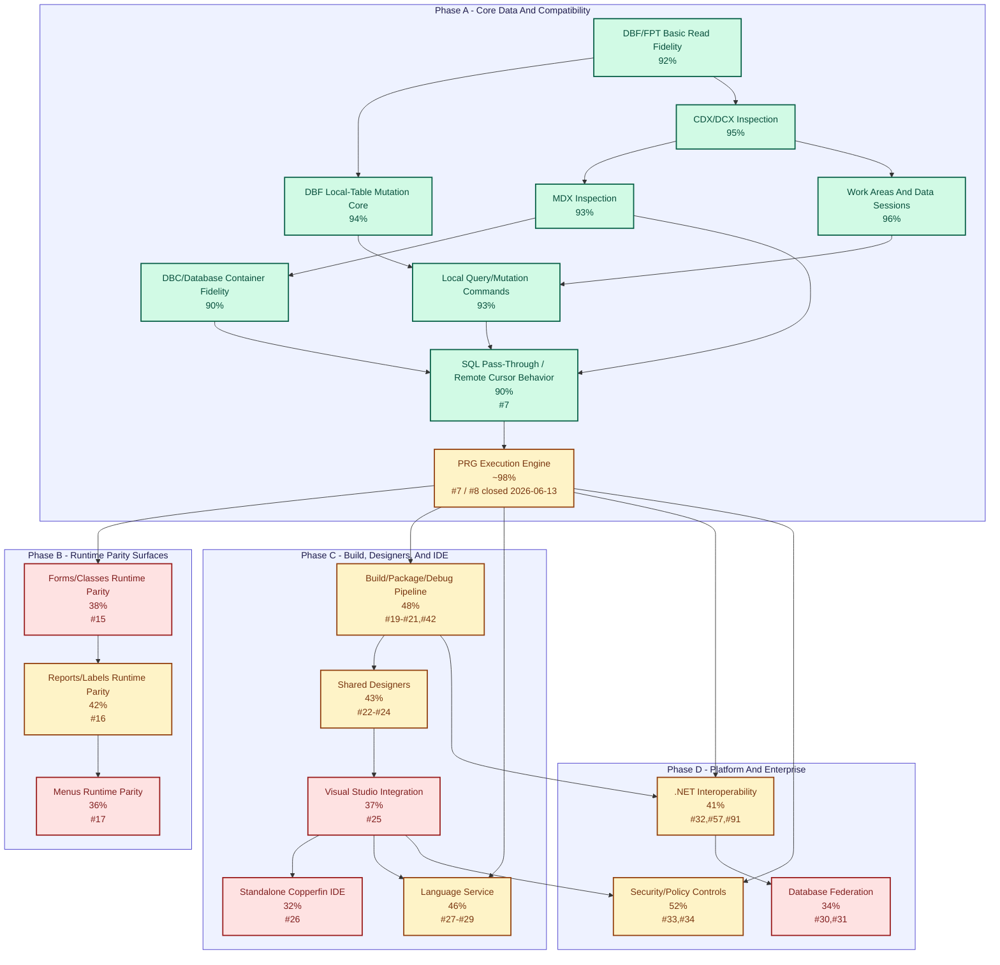
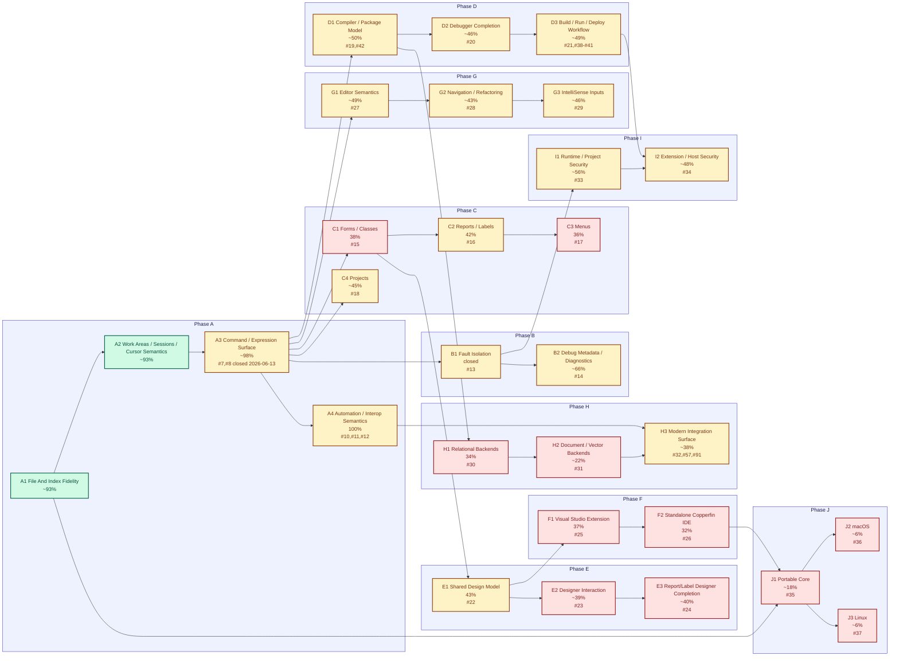

- 2026-06-18: E2/#1120 host grid-line-color-object command is now implemented. `copperfin_studio_host --grid-line-color-object` routes stable target selector grid-line-color assignment through `set_visual_object_grid_line_color`, accepts non-negative integer `--grid-line-color <n>`, rejects non-integer or negative values and ambiguous grid-line-color-object/locked-object/property command combinations before mutation, and preserves no-mutation behavior for missing targets, missing selectors, missing values, duplicate targets, or incomplete requests. Focused validation passed with `make -C build -j4 test_studio_host test_studio_host_json copperfin_studio_host`, `./build/tests/test_studio_host`, and `./build/tests/test_studio_host_json ./build/copperfin_studio_host`. Issue closure remains pending explicit user approval if the no-close-without-approval standing rule is active.
- 2026-06-18: E2/#1119 host data-session-object command is now implemented. `copperfin_studio_host --data-session-object` routes stable target selector data-session assignment through `set_visual_object_data_session`, accepts non-negative integer `--data-session <n>`, rejects non-integer or negative values and ambiguous data-session-object/locked-object/property command combinations before mutation, and preserves no-mutation behavior for missing targets, missing selectors, missing values, duplicate targets, or incomplete requests. Focused validation passed with `make -C build -j4 test_studio_host test_studio_host_json copperfin_studio_host`, `./build/tests/test_studio_host`, and `./build/tests/test_studio_host_json ./build/copperfin_studio_host`. Issue closure remains pending explicit user approval if the no-close-without-approval standing rule is active.
- 2026-06-18: E2/#1118 host buffer-mode-override-object command is now implemented. `copperfin_studio_host --buffer-mode-override-object` routes stable target selector buffer-mode-override assignment through `set_visual_object_buffer_mode_override`, accepts non-negative integer `--buffer-mode-override <n>`, rejects non-integer or negative values and ambiguous buffer-mode-override-object/locked-object/property command combinations before mutation, and preserves no-mutation behavior for missing targets, missing selectors, missing values, duplicate targets, or incomplete requests. Focused validation passed with `make -C build -j4 test_studio_host test_studio_host_json copperfin_studio_host`, `./build/tests/test_studio_host`, and `./build/tests/test_studio_host_json ./build/copperfin_studio_host`. Issue closure remains pending explicit user approval if the no-close-without-approval standing rule is active.
- 2026-06-18: E2/#1117 host buffer-mode-object command is now implemented. `copperfin_studio_host --buffer-mode-object` routes stable target selector buffer-mode assignment through `set_visual_object_buffer_mode`, accepts non-negative integer `--buffer-mode <n>`, rejects non-integer or negative values and ambiguous buffer-mode-object/locked-object/property command combinations before mutation, and preserves no-mutation behavior for missing targets, missing selectors, missing values, duplicate targets, or incomplete requests. Focused validation passed with `make -C build -j4 test_studio_host test_studio_host_json copperfin_studio_host`, `./build/tests/test_studio_host`, and `./build/tests/test_studio_host_json ./build/copperfin_studio_host`. Issue closure remains pending explicit user approval if the no-close-without-approval standing rule is active.
- 2026-06-18: E2/#1116 host scale-mode-object command is now implemented. `copperfin_studio_host --scale-mode-object` routes stable target selector scale-mode assignment through `set_visual_object_scale_mode`, accepts non-negative integer `--scale-mode <n>`, rejects non-integer or negative values and ambiguous scale-mode-object/locked-object/property command combinations before mutation, and preserves no-mutation behavior for missing targets, missing selectors, missing values, duplicate targets, or incomplete requests. Focused validation passed with `make -C build -j4 test_studio_host test_studio_host_json copperfin_studio_host`, `./build/tests/test_studio_host`, and `./build/tests/test_studio_host_json ./build/copperfin_studio_host`. Issue closure remains pending explicit user approval if the no-close-without-approval standing rule is active.
- 2026-06-18: E2/#1115 host fill-style-object command is now implemented. `copperfin_studio_host --fill-style-object` routes stable target selector fill-style assignment through `set_visual_object_fill_style`, accepts non-negative integer `--fill-style <n>`, rejects non-integer or negative values and ambiguous fill-style-object/locked-object/property command combinations before mutation, and preserves no-mutation behavior for missing targets, missing selectors, missing values, duplicate targets, or incomplete requests. Focused validation passed with `make -C build -j4 test_studio_host test_studio_host_json copperfin_studio_host`, `./build/tests/test_studio_host`, and `./build/tests/test_studio_host_json ./build/copperfin_studio_host`. Issue closure remains pending explicit user approval if the no-close-without-approval standing rule is active.
- 2026-06-18: E2/#1114 host draw-width-object command is now implemented. `copperfin_studio_host --draw-width-object` routes stable target selector draw-width assignment through `set_visual_object_draw_width`, accepts non-negative integer `--draw-width <n>`, rejects non-integer or negative values and ambiguous draw-width-object/locked-object/property command combinations before mutation, and preserves no-mutation behavior for missing targets, missing selectors, missing values, duplicate targets, or incomplete requests. Focused validation passed with `make -C build -j4 test_studio_host test_studio_host_json copperfin_studio_host`, `./build/tests/test_studio_host`, and `./build/tests/test_studio_host_json ./build/copperfin_studio_host`. Issue closure remains pending explicit user approval if the no-close-without-approval standing rule is active.
- 2026-06-18: E2/#1113 host draw-style-object command is now implemented. `copperfin_studio_host --draw-style-object` routes stable target selector draw-style assignment through `set_visual_object_draw_style`, accepts non-negative integer `--draw-style <n>`, rejects non-integer or negative values and ambiguous draw-style-object/locked-object/property command combinations before mutation, and preserves no-mutation behavior for missing targets, missing selectors, missing values, duplicate targets, or incomplete requests. Focused validation passed with `make -C build -j4 test_studio_host test_studio_host_json copperfin_studio_host`, `./build/tests/test_studio_host`, and `./build/tests/test_studio_host_json ./build/copperfin_studio_host`. Issue closure remains pending explicit user approval if the no-close-without-approval standing rule is active.
- 2026-06-18: E2/#1112 host draw-mode-object command is now implemented. `copperfin_studio_host --draw-mode-object` routes stable target selector draw-mode assignment through `set_visual_object_draw_mode`, accepts non-negative integer `--draw-mode <n>`, rejects non-integer or negative values and ambiguous draw-mode-object/locked-object/property command combinations before mutation, and preserves no-mutation behavior for missing targets, missing selectors, missing values, duplicate targets, or incomplete requests. Focused validation passed with `make -C build -j4 test_studio_host test_studio_host_json copperfin_studio_host`, `./build/tests/test_studio_host`, and `./build/tests/test_studio_host_json ./build/copperfin_studio_host`. Issue closure remains pending explicit user approval if the no-close-without-approval standing rule is active.
- 2026-06-18: E2/#1111 host curvature-object command is now implemented. `copperfin_studio_host --curvature-object` routes stable target selector curvature assignment through `set_visual_object_curvature`, accepts non-negative integer `--curvature <n>`, rejects non-integer or negative values and ambiguous curvature-object/locked-object/property command combinations before mutation, and preserves no-mutation behavior for missing targets, missing selectors, missing values, duplicate targets, or incomplete requests. Focused validation passed with `make -C build -j4 test_studio_host test_studio_host_json copperfin_studio_host`, `./build/tests/test_studio_host`, and `./build/tests/test_studio_host_json ./build/copperfin_studio_host`. Issue closure remains pending explicit user approval if the no-close-without-approval standing rule is active.
# Remaining Work

This file is the working guide for the remaining Copperfin implementation effort.

- 2026-06-18: E2/#1110 host button-count-object command is now implemented. `copperfin_studio_host --button-count-object` routes stable target selector button-count assignment through `set_visual_object_button_count`, accepts non-negative integer `--button-count <n>`, rejects non-integer or negative values and ambiguous button-count-object/locked-object/property command combinations before mutation, and preserves no-mutation behavior for missing targets, missing selectors, missing values, duplicate targets, or incomplete requests. Focused validation passed with `make -C build -j4 test_studio_host test_studio_host_json copperfin_studio_host`, `./build/tests/test_studio_host`, and `./build/tests/test_studio_host_json ./build/copperfin_studio_host`. Issue closure remains pending explicit user approval if the no-close-without-approval standing rule is active.
- 2026-06-18: E2/#1109 host hide-selection-object command is now implemented. `copperfin_studio_host --hide-selection-object` routes stable target selector hide-selection assignment through `set_visual_object_hide_selection`, accepts boolean `--hide-selection true|false`, rejects invalid boolean values and ambiguous hide-selection-object/auto-size-object/property command combinations before mutation, and preserves no-mutation behavior for missing targets, missing selectors, missing values, duplicate targets, or incomplete requests. Focused validation passed with `make -C build -j4 test_studio_host test_studio_host_json copperfin_studio_host`, `./build/tests/test_studio_host`, and `./build/tests/test_studio_host_json ./build/copperfin_studio_host`. Issue closure remains pending explicit user approval if the no-close-without-approval standing rule is active.
- 2026-06-18: E2/#1108 host OLE drop text-insertion-object command is now implemented. `copperfin_studio_host --ole-drop-text-insertion-object` routes stable target selector OLE drop text-insertion assignment through `set_visual_object_ole_drop_text_insertion`, accepts non-negative integer `--ole-drop-text-insertion <n>`, rejects non-integer or negative values and ambiguous OLE drop text-insertion-object/locked-object/property command combinations before mutation, and preserves no-mutation behavior for missing targets, missing selectors, missing values, duplicate targets, or incomplete requests. Focused validation passed with `make -C build -j4 test_studio_host test_studio_host_json copperfin_studio_host`, `./build/tests/test_studio_host`, and `./build/tests/test_studio_host_json ./build/copperfin_studio_host`. Issue closure remains pending explicit user approval if the no-close-without-approval standing rule is active.
- 2026-06-18: E2/#1107 host OLE drop-effects-object command is now implemented. `copperfin_studio_host --ole-drop-effects-object` routes stable target selector OLE drop-effects assignment through `set_visual_object_ole_drop_effects`, accepts non-negative integer `--ole-drop-effects <n>`, rejects non-integer or negative values and ambiguous OLE drop-effects-object/locked-object/property command combinations before mutation, and preserves no-mutation behavior for missing targets, missing selectors, missing values, duplicate targets, or incomplete requests. Focused validation passed with `make -C build -j4 test_studio_host test_studio_host_json copperfin_studio_host`, `./build/tests/test_studio_host`, and `./build/tests/test_studio_host_json ./build/copperfin_studio_host`. Issue closure remains pending explicit user approval if the no-close-without-approval standing rule is active.
- 2026-06-18: E2/#1106 host OLE drop-mode-object command is now implemented. `copperfin_studio_host --ole-drop-mode-object` routes stable target selector OLE drop-mode assignment through `set_visual_object_ole_drop_mode`, accepts non-negative integer `--ole-drop-mode <n>`, rejects non-integer or negative values and ambiguous OLE drop-mode-object/locked-object/property command combinations before mutation, and preserves no-mutation behavior for missing targets, missing selectors, missing values, duplicate targets, or incomplete requests. Focused validation passed with `make -C build -j4 test_studio_host test_studio_host_json copperfin_studio_host`, `./build/tests/test_studio_host`, and `./build/tests/test_studio_host_json ./build/copperfin_studio_host`. Issue closure remains pending explicit user approval if the no-close-without-approval standing rule is active.
- 2026-06-18: E2/#1105 host OLE drag-mode-object command is now implemented. `copperfin_studio_host --ole-drag-mode-object` routes stable target selector OLE drag-mode assignment through `set_visual_object_ole_drag_mode`, accepts non-negative integer `--ole-drag-mode <n>`, rejects non-integer or negative values and ambiguous OLE drag-mode-object/locked-object/property command combinations before mutation, and preserves no-mutation behavior for missing targets, missing selectors, missing values, duplicate targets, or incomplete requests. Focused validation passed with `make -C build -j4 test_studio_host test_studio_host_json copperfin_studio_host`, `./build/tests/test_studio_host`, and `./build/tests/test_studio_host_json ./build/copperfin_studio_host`. Issue closure remains pending explicit user approval if the no-close-without-approval standing rule is active.
- 2026-06-18: E2/#1104 host drag-mode-object command is now implemented. `copperfin_studio_host --drag-mode-object` routes stable target selector drag-mode assignment through `set_visual_object_drag_mode`, accepts non-negative integer `--drag-mode <n>`, rejects non-integer or negative values and ambiguous drag-mode-object/locked-object/property command combinations before mutation, and preserves no-mutation behavior for missing targets, missing selectors, missing values, duplicate targets, or incomplete requests. Focused validation passed with `make -C build -j4 test_studio_host test_studio_host_json copperfin_studio_host`, `./build/tests/test_studio_host`, and `./build/tests/test_studio_host_json ./build/copperfin_studio_host`. Issue closure remains pending explicit user approval if the no-close-without-approval standing rule is active.
- 2026-06-18: E2/#1103 host drag-icon-object command is now implemented. `copperfin_studio_host --drag-icon-object` routes stable target selector drag-icon assignment through `set_visual_object_drag_icon`, accepts `--drag-icon <value>`, rejects ambiguous drag-icon-object/locked-object/property command combinations before mutation, and preserves no-mutation behavior for missing targets, missing selectors, missing values, duplicate targets, or incomplete requests. Focused validation passed with `make -C build -j4 test_studio_host test_studio_host_json copperfin_studio_host`, `./build/tests/test_studio_host`, and `./build/tests/test_studio_host_json ./build/copperfin_studio_host`. Issue closure remains pending explicit user approval if the no-close-without-approval standing rule is active.
- 2026-06-18: E2/#1102 host mouse-icon-object command is now implemented. `copperfin_studio_host --mouse-icon-object` routes stable target selector mouse-icon assignment through `set_visual_object_mouse_icon`, accepts `--mouse-icon <value>`, rejects ambiguous mouse-icon-object/locked-object/property command combinations before mutation, and preserves no-mutation behavior for missing targets, missing selectors, missing values, duplicate targets, or incomplete requests. Focused validation passed with `make -C build -j4 test_studio_host test_studio_host_json copperfin_studio_host`, `./build/tests/test_studio_host`, and `./build/tests/test_studio_host_json ./build/copperfin_studio_host`. Issue closure remains pending explicit user approval if the no-close-without-approval standing rule is active.
- 2026-06-18: E2/#1101 host OLE drag-picture-object command is now implemented. `copperfin_studio_host --ole-drag-picture-object` routes stable target selector OLE drag-picture assignment through `set_visual_object_ole_drag_picture`, accepts `--ole-drag-picture <value>`, rejects ambiguous OLE drag-picture-object/locked-object/property command combinations before mutation, and preserves no-mutation behavior for missing targets, missing selectors, missing values, duplicate targets, or incomplete requests. Focused validation passed with `make -C build -j4 test_studio_host test_studio_host_json copperfin_studio_host`, `./build/tests/test_studio_host`, and `./build/tests/test_studio_host_json ./build/copperfin_studio_host`. Issue closure remains pending explicit user approval if the no-close-without-approval standing rule is active.
- 2026-06-18: E2/#1100 host disabled-picture-object command is now implemented. `copperfin_studio_host --disabled-picture-object` routes stable target selector disabled-picture assignment through `set_visual_object_disabled_picture`, accepts `--disabled-picture <value>`, rejects ambiguous disabled-picture-object/locked-object/property command combinations before mutation, and preserves no-mutation behavior for missing targets, missing selectors, missing values, duplicate targets, or incomplete requests. Focused validation passed with `make -C build -j4 test_studio_host test_studio_host_json copperfin_studio_host`, `./build/tests/test_studio_host`, and `./build/tests/test_studio_host_json ./build/copperfin_studio_host`. Issue closure remains pending explicit user approval if the no-close-without-approval standing rule is active.
- 2026-06-18: E2/#1099 host down-picture-object command is now implemented. `copperfin_studio_host --down-picture-object` routes stable target selector down-picture assignment through `set_visual_object_down_picture`, accepts `--down-picture <value>`, rejects ambiguous down-picture-object/locked-object/property command combinations before mutation, and preserves no-mutation behavior for missing targets, missing selectors, missing values, duplicate targets, or incomplete requests. Focused validation passed with `make -C build -j4 test_studio_host test_studio_host_json copperfin_studio_host`, `./build/tests/test_studio_host`, and `./build/tests/test_studio_host_json ./build/copperfin_studio_host`. Issue closure remains pending explicit user approval if the no-close-without-approval standing rule is active.
- 2026-06-18: E2/#1098 host picture-object command is now implemented. `copperfin_studio_host --picture-object` routes stable target selector picture assignment through `set_visual_object_picture`, accepts `--picture <value>`, rejects ambiguous picture-object/locked-object/property command combinations before mutation, and preserves no-mutation behavior for missing targets, missing selectors, missing values, duplicate targets, or incomplete requests. Focused validation passed with `make -C build -j4 test_studio_host test_studio_host_json copperfin_studio_host`, `./build/tests/test_studio_host`, and `./build/tests/test_studio_host_json ./build/copperfin_studio_host`. Issue closure remains pending explicit user approval if the no-close-without-approval standing rule is active.
- 2026-06-18: E2/#1097 host always-on-bottom-object command is now implemented. `copperfin_studio_host --always-on-bottom-object` routes stable target selector always-on-bottom assignment through `set_visual_object_always_on_bottom`, accepts `--always-on-bottom true|false`, rejects invalid boolean values and ambiguous always-on-bottom-object/auto-size-object/property command combinations before mutation, and preserves no-mutation behavior for missing targets, missing selectors, missing values, duplicate targets, or incomplete requests. Focused validation passed with `make -C build -j4 test_studio_host test_studio_host_json copperfin_studio_host`, `./build/tests/test_studio_host`, and `./build/tests/test_studio_host_json ./build/copperfin_studio_host`. Issue closure remains pending explicit user approval if the no-close-without-approval standing rule is active.
- 2026-06-18: E2/#1096 host always-on-top-object command is now implemented. `copperfin_studio_host --always-on-top-object` routes stable target selector always-on-top assignment through `set_visual_object_always_on_top`, accepts `--always-on-top true|false`, rejects invalid boolean values and ambiguous always-on-top-object/auto-size-object/property command combinations before mutation, and preserves no-mutation behavior for missing targets, missing selectors, missing values, duplicate targets, or incomplete requests. Focused validation passed with `make -C build -j4 test_studio_host test_studio_host_json copperfin_studio_host`, `./build/tests/test_studio_host`, and `./build/tests/test_studio_host_json ./build/copperfin_studio_host`. Issue closure remains pending explicit user approval if the no-close-without-approval standing rule is active.
- 2026-06-18: E2/#1095 host add-line-feeds-object command is now implemented. `copperfin_studio_host --add-line-feeds-object` routes stable target selector add-line-feeds assignment through `set_visual_object_add_line_feeds`, accepts `--add-line-feeds true|false`, rejects invalid boolean values and ambiguous add-line-feeds-object/auto-size-object/property command combinations before mutation, and preserves no-mutation behavior for missing targets, missing selectors, missing values, duplicate targets, or incomplete requests. Focused validation passed with `make -C build -j4 test_studio_host test_studio_host_json copperfin_studio_host`, `./build/tests/test_studio_host`, and `./build/tests/test_studio_host_json ./build/copperfin_studio_host`. Issue closure remains pending explicit user approval if the no-close-without-approval standing rule is active.
- 2026-06-18: E2/#1094 host resizable-object command is now implemented. `copperfin_studio_host --resizable-object` routes stable target selector resizable assignment through `set_visual_object_resizable`, accepts `--resizable true|false`, rejects invalid boolean values and ambiguous resizable-object/auto-size-object/property command combinations before mutation, and preserves no-mutation behavior for missing targets, missing selectors, missing values, duplicate targets, or incomplete requests. Focused validation passed with `make -C build -j4 test_studio_host test_studio_host_json copperfin_studio_host`, `./build/tests/test_studio_host`, and `./build/tests/test_studio_host_json ./build/copperfin_studio_host`. Issue closure remains pending explicit user approval if the no-close-without-approval standing rule is active.
- 2026-06-18: E2/#1093 host allow-row-sizing-object command is now implemented. `copperfin_studio_host --allow-row-sizing-object` routes stable target selector allow-row-sizing assignment through `set_visual_object_allow_row_sizing`, accepts `--allow-row-sizing true|false`, rejects invalid boolean values and ambiguous allow-row-sizing-object/auto-size-object/property command combinations before mutation, and preserves no-mutation behavior for missing targets, missing selectors, missing values, duplicate targets, or incomplete requests. Focused validation passed with `make -C build -j4 test_studio_host test_studio_host_json copperfin_studio_host`, `./build/tests/test_studio_host`, and `./build/tests/test_studio_host_json ./build/copperfin_studio_host`. Issue closure remains pending explicit user approval if the no-close-without-approval standing rule is active.
- 2026-06-18: E2/#1092 host allow-header-sizing-object command is now implemented. `copperfin_studio_host --allow-header-sizing-object` routes stable target selector allow-header-sizing assignment through `set_visual_object_allow_header_sizing`, accepts `--allow-header-sizing true|false`, rejects invalid boolean values and ambiguous allow-header-sizing-object/auto-size-object/property command combinations before mutation, and preserves no-mutation behavior for missing targets, missing selectors, missing values, duplicate targets, or incomplete requests. Focused validation passed with `make -C build -j4 test_studio_host test_studio_host_json copperfin_studio_host`, `./build/tests/test_studio_host`, and `./build/tests/test_studio_host_json ./build/copperfin_studio_host`. Issue closure remains pending explicit user approval if the no-close-without-approval standing rule is active.
- 2026-06-18: E2/#1091 host panel-link-object command is now implemented. `copperfin_studio_host --panel-link-object` routes stable target selector panel-link assignment through `set_visual_object_panel_link`, accepts `--panel-link true|false`, rejects invalid boolean values and ambiguous panel-link-object/auto-size-object/property command combinations before mutation, and preserves no-mutation behavior for missing targets, missing selectors, missing values, duplicate targets, or incomplete requests. Focused validation passed with `make -C build -j4 test_studio_host test_studio_host_json copperfin_studio_host`, `./build/tests/test_studio_host`, and `./build/tests/test_studio_host_json ./build/copperfin_studio_host`. Issue closure remains pending explicit user approval if the no-close-without-approval standing rule is active.
- 2026-06-18: E2/#1090 host highlight-row-object command is now implemented. `copperfin_studio_host --highlight-row-object` routes stable target selector highlight-row assignment through `set_visual_object_highlight_row`, accepts `--highlight-row true|false`, rejects invalid boolean values and ambiguous highlight-row-object/auto-size-object/property command combinations before mutation, and preserves no-mutation behavior for missing targets, missing selectors, missing values, duplicate targets, or incomplete requests. Focused validation passed with `make -C build -j4 test_studio_host test_studio_host_json copperfin_studio_host`, `./build/tests/test_studio_host`, and `./build/tests/test_studio_host_json ./build/copperfin_studio_host`. Issue closure remains pending explicit user approval if the no-close-without-approval standing rule is active.
- 2026-06-18: E2/#1089 host split-bar-object command is now implemented. `copperfin_studio_host --split-bar-object` routes stable target selector split-bar assignment through `set_visual_object_split_bar`, accepts `--split-bar true|false`, rejects invalid boolean values and ambiguous split-bar-object/auto-size-object/property command combinations before mutation, and preserves no-mutation behavior for missing targets, missing selectors, missing values, duplicate targets, or incomplete requests. Focused validation passed with `make -C build -j4 test_studio_host test_studio_host_json copperfin_studio_host`, `./build/tests/test_studio_host`, and `./build/tests/test_studio_host_json ./build/copperfin_studio_host`. Issue closure remains pending explicit user approval if the no-close-without-approval standing rule is active.
- 2026-06-18: E2/#1088 host record-mark-object command is now implemented. `copperfin_studio_host --record-mark-object` routes stable target selector record-mark assignment through `set_visual_object_record_mark`, accepts `--record-mark true|false`, rejects invalid boolean values and ambiguous record-mark-object/auto-size-object/property command combinations before mutation, and preserves no-mutation behavior for missing targets, missing selectors, missing values, duplicate targets, or incomplete requests. Focused validation passed with `make -C build -j4 test_studio_host test_studio_host_json copperfin_studio_host`, `./build/tests/test_studio_host`, and `./build/tests/test_studio_host_json ./build/copperfin_studio_host`. Issue closure remains pending explicit user approval if the no-close-without-approval standing rule is active.
- 2026-06-17: E2/#1087 host delete-mark-object command is now implemented. `copperfin_studio_host --delete-mark-object` routes stable target selector delete-mark assignment through `set_visual_object_delete_mark`, accepts `--delete-mark true|false`, rejects invalid boolean values and ambiguous delete-mark-object/auto-size-object/property command combinations before mutation, and preserves no-mutation behavior for missing targets, missing selectors, missing values, duplicate targets, or incomplete requests. Focused validation passed with `make -C build -j4 test_studio_host test_studio_host_json copperfin_studio_host`, `./build/tests/test_studio_host`, and `./build/tests/test_studio_host_json ./build/copperfin_studio_host`. Issue closure remains pending explicit user approval if the no-close-without-approval standing rule is active.
- 2026-06-17: E2/#1086 host allow-cell-selection-object command is now implemented. `copperfin_studio_host --allow-cell-selection-object` routes stable target selector allow-cell-selection assignment through `set_visual_object_allow_cell_selection`, accepts `--allow-cell-selection true|false`, rejects invalid boolean values and ambiguous allow-cell-selection-object/auto-size-object/property command combinations before mutation, and preserves no-mutation behavior for missing targets, missing selectors, missing values, duplicate targets, or incomplete requests. Focused validation passed with `make -C build -j4 test_studio_host test_studio_host_json copperfin_studio_host`, `./build/tests/test_studio_host`, and `./build/tests/test_studio_host_json ./build/copperfin_studio_host`. Issue closure remains pending explicit user approval if the no-close-without-approval standing rule is active.
- 2026-06-17: E2/#1085 host lock-screen-object command is now implemented. `copperfin_studio_host --lock-screen-object` routes stable target selector lock-screen assignment through `set_visual_object_lock_screen`, accepts `--lock-screen true|false`, rejects invalid boolean values and ambiguous lock-screen-object/auto-size-object/property command combinations before mutation, and preserves no-mutation behavior for missing targets, missing selectors, missing values, duplicate targets, or incomplete requests. Focused validation passed with `make -C build -j4 test_studio_host test_studio_host_json copperfin_studio_host`, `./build/tests/test_studio_host`, and `./build/tests/test_studio_host_json ./build/copperfin_studio_host`. Issue closure remains pending explicit user approval if the no-close-without-approval standing rule is active.
- 2026-06-17: E2/#1084 host sparse-object command is now implemented. `copperfin_studio_host --sparse-object` routes stable target selector sparse assignment through `set_visual_object_sparse`, accepts `--sparse true|false`, rejects invalid boolean values and ambiguous sparse-object/auto-size-object/property command combinations before mutation, and preserves no-mutation behavior for missing targets, missing selectors, missing values, duplicate targets, or incomplete requests. Focused validation passed with `make -C build -j4 test_studio_host test_studio_host_json copperfin_studio_host`, `./build/tests/test_studio_host`, and `./build/tests/test_studio_host_json ./build/copperfin_studio_host`. Issue closure remains pending explicit user approval if the no-close-without-approval standing rule is active.
- 2026-06-17: E2/#1083 host clip-controls-object command is now implemented. `copperfin_studio_host --clip-controls-object` routes stable target selector clip-controls assignment through `set_visual_object_clip_controls`, accepts `--clip-controls true|false`, rejects invalid boolean values and ambiguous clip-controls-object/auto-size-object/property command combinations before mutation, and preserves no-mutation behavior for missing targets, missing selectors, missing values, duplicate targets, or incomplete requests. Focused validation passed with `make -C build -j4 test_studio_host test_studio_host_json copperfin_studio_host`, `./build/tests/test_studio_host`, and `./build/tests/test_studio_host_json ./build/copperfin_studio_host`. Issue closure remains pending explicit user approval if the no-close-without-approval standing rule is active.
- 2026-06-17: E2/#1082 host dockable-object command is now implemented. `copperfin_studio_host --dockable-object` routes stable target selector dockable assignment through `set_visual_object_dockable`, accepts `--dockable true|false`, rejects invalid boolean values and ambiguous dockable-object/auto-size-object/property command combinations before mutation, and preserves no-mutation behavior for missing targets, missing selectors, missing values, duplicate targets, or incomplete requests. Focused validation passed with `make -C build -j4 test_studio_host test_studio_host_json copperfin_studio_host`, `./build/tests/test_studio_host`, and `./build/tests/test_studio_host_json ./build/copperfin_studio_host`. Issue closure remains pending explicit user approval if the no-close-without-approval standing rule is active.
- 2026-06-17: E2/#1081 host continuous-scroll-object command is now implemented. `copperfin_studio_host --continuous-scroll-object` routes stable target selector continuous-scroll assignment through `set_visual_object_continuous_scroll`, accepts `--continuous-scroll true|false`, rejects invalid boolean values and ambiguous continuous-scroll-object/auto-size-object/property command combinations before mutation, and preserves no-mutation behavior for missing targets, missing selectors, missing values, duplicate targets, or incomplete requests. Focused validation passed with `make -C build -j4 test_studio_host test_studio_host_json copperfin_studio_host`, `./build/tests/test_studio_host`, and `./build/tests/test_studio_host_json ./build/copperfin_studio_host`. Issue closure remains pending explicit user approval if the no-close-without-approval standing rule is active.
- 2026-06-17: E2/#1080 host auto-release-object command is now implemented. `copperfin_studio_host --auto-release-object` routes stable target selector auto-release assignment through `set_visual_object_auto_release`, accepts `--auto-release true|false`, rejects invalid boolean values and ambiguous auto-release-object/auto-size-object/property command combinations before mutation, and preserves no-mutation behavior for missing targets, missing selectors, missing values, duplicate targets, or incomplete requests. Focused validation passed with `make -C build -j4 test_studio_host test_studio_host_json copperfin_studio_host`, `./build/tests/test_studio_host`, and `./build/tests/test_studio_host_json ./build/copperfin_studio_host`. Issue closure remains pending explicit user approval if the no-close-without-approval standing rule is active.
- 2026-06-17: E2/#1079 host auto-size-object command is now implemented. `copperfin_studio_host --auto-size-object` routes stable target selector auto-size assignment through `set_visual_object_auto_size`, accepts `--auto-size true|false`, rejects invalid boolean values and ambiguous auto-size-object/auto-center-object/property command combinations before mutation, and preserves no-mutation behavior for missing targets, missing selectors, missing values, duplicate targets, or incomplete requests. Focused validation passed with `make -C build -j4 test_studio_host test_studio_host_json copperfin_studio_host`, `./build/tests/test_studio_host`, and `./build/tests/test_studio_host_json ./build/copperfin_studio_host`. Issue closure remains pending explicit user approval if the no-close-without-approval standing rule is active.
- 2026-06-17: E2/#1078 host auto-center-object command is now implemented. `copperfin_studio_host --auto-center-object` routes stable target selector auto-center assignment through `set_visual_object_auto_center`, accepts `--auto-center true|false`, rejects invalid boolean values and ambiguous auto-center-object/allow-output-object/property command combinations before mutation, and preserves no-mutation behavior for missing targets, missing selectors, missing values, duplicate targets, or incomplete requests. Focused validation passed with `make -C build -j4 test_studio_host test_studio_host_json copperfin_studio_host`, `./build/tests/test_studio_host`, and `./build/tests/test_studio_host_json ./build/copperfin_studio_host`. Issue closure remains pending explicit user approval if the no-close-without-approval standing rule is active.
- 2026-06-17: E2/#1075 host allow-output-object command is now shipped. `copperfin_studio_host --allow-output-object` routes stable target selector allow-output assignment through `set_visual_object_allow_output`, accepts `--allow-output true|false`, rejects invalid boolean values and ambiguous allow-output-object/delete/restore/duplicate/rename-object/reparent-object/reorder-object/group-object/align-object/resize-object/distribute-object/snap-object/nudge-object/tab-order-object/tab-stop-object/visibility-object/enabled-object/read-only-object/locked-object/caption-object/tooltip-text-object/status-bar-text-object/control-source-object/current-control-object/input-mask-object/format-object/row-source-object/row-source-type-object/bound-column-object/column-count-object/style-object/list-index-object/left-column-object/display-value-object/selected-back-color-object/selected-fore-color-object/selected-item-back-color-object/selected-item-fore-color-object/disabled-item-back-color-object/disabled-item-fore-color-object/item-back-color-object/item-fore-color-object/highlight-back-color-object/highlight-fore-color-object/back-color-object/fore-color-object/disabled-back-color-object/disabled-fore-color-object/dynamic-back-color-object/dynamic-fore-color-object/closable-object/control-box-object/ungroup-object/property command combinations before mutation, and preserves no-mutation behavior for missing targets, missing selectors, missing values, duplicate targets, or incomplete requests.
- 2026-06-17: E2/#1074 host control-box-object command is now shipped. `copperfin_studio_host --control-box-object` routes stable target selector control-box assignment through `set_visual_object_control_box`, accepts `--control-box true|false`, rejects invalid boolean values and ambiguous control-box-object/delete/restore/duplicate/rename-object/reparent-object/reorder-object/group-object/align-object/resize-object/distribute-object/snap-object/nudge-object/tab-order-object/tab-stop-object/visibility-object/enabled-object/read-only-object/locked-object/caption-object/tooltip-text-object/status-bar-text-object/control-source-object/current-control-object/input-mask-object/format-object/row-source-object/row-source-type-object/bound-column-object/column-count-object/style-object/list-index-object/left-column-object/display-value-object/selected-back-color-object/selected-fore-color-object/selected-item-back-color-object/selected-item-fore-color-object/disabled-item-back-color-object/disabled-item-fore-color-object/item-back-color-object/item-fore-color-object/highlight-back-color-object/highlight-fore-color-object/back-color-object/fore-color-object/disabled-back-color-object/disabled-fore-color-object/dynamic-back-color-object/dynamic-fore-color-object/closable-object/ungroup-object/property command combinations before mutation, and preserves no-mutation behavior for missing targets, missing selectors, missing values, duplicate targets, or incomplete requests.
- 2026-06-17: E2/#1073 host closable-object command is now shipped. `copperfin_studio_host --closable-object` routes stable target selector closable assignment through `set_visual_object_closable`, accepts `--closable true|false`, rejects invalid boolean values and ambiguous closable-object/delete/restore/duplicate/rename-object/reparent-object/reorder-object/group-object/align-object/resize-object/distribute-object/snap-object/nudge-object/tab-order-object/tab-stop-object/visibility-object/enabled-object/read-only-object/locked-object/caption-object/tooltip-text-object/status-bar-text-object/control-source-object/current-control-object/input-mask-object/format-object/row-source-object/row-source-type-object/bound-column-object/column-count-object/style-object/list-index-object/left-column-object/display-value-object/selected-back-color-object/selected-fore-color-object/selected-item-back-color-object/selected-item-fore-color-object/disabled-item-back-color-object/disabled-item-fore-color-object/item-back-color-object/item-fore-color-object/highlight-back-color-object/highlight-fore-color-object/back-color-object/fore-color-object/disabled-back-color-object/disabled-fore-color-object/dynamic-back-color-object/dynamic-fore-color-object/ungroup-object/property command combinations before mutation, and preserves no-mutation behavior for missing targets, missing selectors, missing values, duplicate targets, or incomplete requests.
- 2026-06-17: E2/#1072 host current-control-object command is now shipped. `copperfin_studio_host --current-control-object` routes stable target selector current-control assignment through `set_visual_object_current_control`, accepts `--current-control <value>` including space-containing argv values, rejects ambiguous current-control-object/delete/restore/duplicate/rename-object/reparent-object/reorder-object/group-object/align-object/resize-object/distribute-object/snap-object/nudge-object/tab-order-object/tab-stop-object/visibility-object/enabled-object/read-only-object/locked-object/caption-object/tooltip-text-object/status-bar-text-object/control-source-object/input-mask-object/format-object/row-source-object/row-source-type-object/bound-column-object/column-count-object/style-object/list-index-object/left-column-object/display-value-object/selected-back-color-object/selected-fore-color-object/selected-item-back-color-object/selected-item-fore-color-object/disabled-item-back-color-object/disabled-item-fore-color-object/item-back-color-object/item-fore-color-object/highlight-back-color-object/highlight-fore-color-object/back-color-object/fore-color-object/disabled-back-color-object/disabled-fore-color-object/dynamic-back-color-object/dynamic-fore-color-object/ungroup-object/property command combinations before mutation, and preserves no-mutation behavior for missing targets, missing selectors, missing values, duplicate targets, or incomplete requests.
- 2026-06-17: E2/#1071 host dynamic-fore-color-object command is now shipped. `copperfin_studio_host --dynamic-fore-color-object` routes stable target selector dynamic fore-color assignment through `set_visual_object_dynamic_fore_color`, accepts `--dynamic-fore-color <expr>` as raw expression text, rejects ambiguous dynamic-fore-color-object/delete/restore/duplicate/rename-object/reparent-object/reorder-object/group-object/align-object/resize-object/distribute-object/snap-object/nudge-object/tab-order-object/tab-stop-object/visibility-object/enabled-object/read-only-object/locked-object/caption-object/tooltip-text-object/status-bar-text-object/control-source-object/input-mask-object/format-object/row-source-object/row-source-type-object/bound-column-object/column-count-object/style-object/list-index-object/left-column-object/display-value-object/selected-back-color-object/selected-fore-color-object/selected-item-back-color-object/selected-item-fore-color-object/disabled-item-back-color-object/disabled-item-fore-color-object/item-back-color-object/item-fore-color-object/highlight-back-color-object/highlight-fore-color-object/back-color-object/fore-color-object/disabled-back-color-object/disabled-fore-color-object/dynamic-back-color-object/ungroup-object/property command combinations before mutation, and preserves no-mutation behavior for missing targets, missing selectors, missing values, duplicate targets, or incomplete requests.
- 2026-06-17: E2/#1070 host dynamic-back-color-object command is now shipped. `copperfin_studio_host --dynamic-back-color-object` routes stable target selector dynamic back-color assignment through `set_visual_object_dynamic_back_color`, accepts `--dynamic-back-color <expr>` as raw expression text, rejects ambiguous dynamic-back-color-object/delete/restore/duplicate/rename-object/reparent-object/reorder-object/group-object/align-object/resize-object/distribute-object/snap-object/nudge-object/tab-order-object/tab-stop-object/visibility-object/enabled-object/read-only-object/locked-object/caption-object/tooltip-text-object/status-bar-text-object/control-source-object/input-mask-object/format-object/row-source-object/row-source-type-object/bound-column-object/column-count-object/style-object/list-index-object/left-column-object/display-value-object/selected-back-color-object/selected-fore-color-object/selected-item-back-color-object/selected-item-fore-color-object/disabled-item-back-color-object/disabled-item-fore-color-object/item-back-color-object/item-fore-color-object/highlight-back-color-object/highlight-fore-color-object/back-color-object/fore-color-object/disabled-back-color-object/disabled-fore-color-object/ungroup-object/property command combinations before mutation, and preserves no-mutation behavior for missing targets, missing selectors, missing values, duplicate targets, or incomplete requests.
- 2026-06-17: E2/#1069 host disabled-fore-color-object command is now shipped. `copperfin_studio_host --disabled-fore-color-object` routes stable target selector disabled fore-color assignment through `set_visual_object_disabled_fore_color`, accepts `--disabled-fore-color <n>`, rejects negative values and ambiguous disabled-fore-color-object/delete/restore/duplicate/rename-object/reparent-object/reorder-object/group-object/align-object/resize-object/distribute-object/snap-object/nudge-object/tab-order-object/tab-stop-object/visibility-object/enabled-object/read-only-object/locked-object/caption-object/tooltip-text-object/status-bar-text-object/control-source-object/input-mask-object/format-object/row-source-object/row-source-type-object/bound-column-object/column-count-object/style-object/list-index-object/left-column-object/display-value-object/selected-back-color-object/selected-fore-color-object/selected-item-back-color-object/selected-item-fore-color-object/disabled-item-back-color-object/disabled-item-fore-color-object/item-back-color-object/item-fore-color-object/highlight-back-color-object/highlight-fore-color-object/back-color-object/fore-color-object/disabled-back-color-object/ungroup-object/property command combinations before mutation, and preserves no-mutation behavior for missing targets, missing selectors, missing values, duplicate targets, or incomplete requests.
- 2026-06-17: E2/#1068 host disabled-back-color-object command is now shipped. `copperfin_studio_host --disabled-back-color-object` routes stable target selector disabled back-color assignment through `set_visual_object_disabled_back_color`, accepts `--disabled-back-color <n>`, rejects negative values and ambiguous disabled-back-color-object/delete/restore/duplicate/rename-object/reparent-object/reorder-object/group-object/align-object/resize-object/distribute-object/snap-object/nudge-object/tab-order-object/tab-stop-object/visibility-object/enabled-object/read-only-object/locked-object/caption-object/tooltip-text-object/status-bar-text-object/control-source-object/input-mask-object/format-object/row-source-object/row-source-type-object/bound-column-object/column-count-object/style-object/list-index-object/left-column-object/display-value-object/selected-back-color-object/selected-fore-color-object/selected-item-back-color-object/selected-item-fore-color-object/disabled-item-back-color-object/disabled-item-fore-color-object/item-back-color-object/item-fore-color-object/highlight-back-color-object/highlight-fore-color-object/back-color-object/fore-color-object/ungroup-object/property command combinations before mutation, and preserves no-mutation behavior for missing targets, missing selectors, missing values, duplicate targets, or incomplete requests.
- 2026-06-17: E2/#1067 host fore-color-object command is now shipped. `copperfin_studio_host --fore-color-object` routes stable target selector fore-color assignment through `set_visual_object_fore_color`, accepts `--fore-color <n>`, rejects negative values and ambiguous fore-color-object/delete/restore/duplicate/rename-object/reparent-object/reorder-object/group-object/align-object/resize-object/distribute-object/snap-object/nudge-object/tab-order-object/tab-stop-object/visibility-object/enabled-object/read-only-object/locked-object/caption-object/tooltip-text-object/status-bar-text-object/control-source-object/input-mask-object/format-object/row-source-object/row-source-type-object/bound-column-object/column-count-object/style-object/list-index-object/left-column-object/display-value-object/selected-back-color-object/selected-fore-color-object/selected-item-back-color-object/selected-item-fore-color-object/disabled-item-back-color-object/disabled-item-fore-color-object/item-back-color-object/item-fore-color-object/highlight-back-color-object/highlight-fore-color-object/back-color-object/ungroup-object/property command combinations before mutation, and preserves no-mutation behavior for missing targets, missing selectors, missing values, duplicate targets, or incomplete requests.
- 2026-06-17: E2/#1066 host back-color-object command is now shipped. `copperfin_studio_host --back-color-object` routes stable target selector back-color assignment through `set_visual_object_back_color`, accepts `--back-color <n>`, rejects negative values and ambiguous back-color-object/delete/restore/duplicate/rename-object/reparent-object/reorder-object/group-object/align-object/resize-object/distribute-object/snap-object/nudge-object/tab-order-object/tab-stop-object/visibility-object/enabled-object/read-only-object/locked-object/caption-object/tooltip-text-object/status-bar-text-object/control-source-object/input-mask-object/format-object/row-source-object/row-source-type-object/bound-column-object/column-count-object/style-object/list-index-object/left-column-object/display-value-object/selected-back-color-object/selected-fore-color-object/selected-item-back-color-object/selected-item-fore-color-object/disabled-item-back-color-object/disabled-item-fore-color-object/item-back-color-object/item-fore-color-object/highlight-back-color-object/highlight-fore-color-object/ungroup-object/property command combinations before mutation, and preserves no-mutation behavior for missing targets, missing selectors, missing values, duplicate targets, or incomplete requests.
- 2026-06-17: E2/#1065 host highlight-fore-color-object command is now shipped. `copperfin_studio_host --highlight-fore-color-object` routes stable target selector highlight fore-color assignment through `set_visual_object_highlight_fore_color`, accepts `--highlight-fore-color <n>`, rejects negative values and ambiguous highlight-fore-color-object/delete/restore/duplicate/rename-object/reparent-object/reorder-object/group-object/align-object/resize-object/distribute-object/snap-object/nudge-object/tab-order-object/tab-stop-object/visibility-object/enabled-object/read-only-object/locked-object/caption-object/tooltip-text-object/status-bar-text-object/control-source-object/input-mask-object/format-object/row-source-object/row-source-type-object/bound-column-object/column-count-object/style-object/list-index-object/left-column-object/display-value-object/selected-back-color-object/selected-fore-color-object/selected-item-back-color-object/selected-item-fore-color-object/disabled-item-back-color-object/disabled-item-fore-color-object/item-back-color-object/item-fore-color-object/highlight-back-color-object/ungroup-object/property command combinations before mutation, and preserves no-mutation behavior for missing targets, missing selectors, missing values, duplicate targets, or incomplete requests.
- 2026-06-17: E2/#1064 host highlight-back-color-object command is now shipped. `copperfin_studio_host --highlight-back-color-object` routes stable target selector highlight back-color assignment through `set_visual_object_highlight_back_color`, accepts `--highlight-back-color <n>`, rejects negative values and ambiguous highlight-back-color-object/delete/restore/duplicate/rename-object/reparent-object/reorder-object/group-object/align-object/resize-object/distribute-object/snap-object/nudge-object/tab-order-object/tab-stop-object/visibility-object/enabled-object/read-only-object/locked-object/caption-object/tooltip-text-object/status-bar-text-object/control-source-object/input-mask-object/format-object/row-source-object/row-source-type-object/bound-column-object/column-count-object/style-object/list-index-object/left-column-object/display-value-object/selected-back-color-object/selected-fore-color-object/selected-item-back-color-object/selected-item-fore-color-object/disabled-item-back-color-object/disabled-item-fore-color-object/item-back-color-object/item-fore-color-object/ungroup-object/property command combinations before mutation, and preserves no-mutation behavior for missing targets, missing selectors, missing values, duplicate targets, or incomplete requests.
- 2026-06-17: E2/#1063 host item-fore-color-object command is now shipped. `copperfin_studio_host --item-fore-color-object` routes stable target selector item fore-color assignment through `set_visual_object_item_fore_color`, accepts `--item-fore-color <n>`, rejects negative values and ambiguous item-fore-color-object/delete/restore/duplicate/rename-object/reparent-object/reorder-object/group-object/align-object/resize-object/distribute-object/snap-object/nudge-object/tab-order-object/tab-stop-object/visibility-object/enabled-object/read-only-object/locked-object/caption-object/tooltip-text-object/status-bar-text-object/control-source-object/input-mask-object/format-object/row-source-object/row-source-type-object/bound-column-object/column-count-object/style-object/list-index-object/left-column-object/display-value-object/selected-back-color-object/selected-fore-color-object/selected-item-back-color-object/selected-item-fore-color-object/disabled-item-back-color-object/disabled-item-fore-color-object/item-back-color-object/ungroup-object/property command combinations before mutation, and preserves no-mutation behavior for missing targets, missing selectors, missing values, duplicate targets, or incomplete requests.
- 2026-06-17: E2/#1062 host item-back-color-object command is now shipped. `copperfin_studio_host --item-back-color-object` routes stable target selector item back-color assignment through `set_visual_object_item_back_color`, accepts `--item-back-color <n>`, rejects negative values and ambiguous item-back-color-object/delete/restore/duplicate/rename-object/reparent-object/reorder-object/group-object/align-object/resize-object/distribute-object/snap-object/nudge-object/tab-order-object/tab-stop-object/visibility-object/enabled-object/read-only-object/locked-object/caption-object/tooltip-text-object/status-bar-text-object/control-source-object/input-mask-object/format-object/row-source-object/row-source-type-object/bound-column-object/column-count-object/style-object/list-index-object/left-column-object/display-value-object/selected-back-color-object/selected-fore-color-object/selected-item-back-color-object/selected-item-fore-color-object/disabled-item-back-color-object/disabled-item-fore-color-object/ungroup-object/property command combinations before mutation, and preserves no-mutation behavior for missing targets, missing selectors, missing values, duplicate targets, or incomplete requests.
- 2026-06-17: E2/#1061 host disabled-item-fore-color-object command is now shipped. `copperfin_studio_host --disabled-item-fore-color-object` routes stable target selector disabled-item-fore-color assignment through `set_visual_object_disabled_item_fore_color`, accepts `--disabled-item-fore-color <n>`, rejects negative values and ambiguous disabled-item-fore-color-object/delete/restore/duplicate/rename-object/reparent-object/reorder-object/group-object/align-object/resize-object/distribute-object/snap-object/nudge-object/tab-order-object/tab-stop-object/visibility-object/enabled-object/read-only-object/locked-object/caption-object/tooltip-text-object/status-bar-text-object/control-source-object/input-mask-object/format-object/row-source-object/row-source-type-object/bound-column-object/column-count-object/style-object/list-index-object/left-column-object/display-value-object/selected-back-color-object/selected-fore-color-object/selected-item-back-color-object/selected-item-fore-color-object/disabled-item-back-color-object/ungroup-object/property command combinations before mutation, and preserves no-mutation behavior for missing targets, missing selectors, missing values, duplicate targets, or incomplete requests.
- 2026-06-17: E2/#1060 host disabled-item-back-color-object command is now shipped. `copperfin_studio_host --disabled-item-back-color-object` routes stable target selector disabled-item-back-color assignment through `set_visual_object_disabled_item_back_color`, accepts `--disabled-item-back-color <n>`, rejects negative values and ambiguous disabled-item-back-color-object/delete/restore/duplicate/rename-object/reparent-object/reorder-object/group-object/align-object/resize-object/distribute-object/snap-object/nudge-object/tab-order-object/tab-stop-object/visibility-object/enabled-object/read-only-object/locked-object/caption-object/tooltip-text-object/status-bar-text-object/control-source-object/input-mask-object/format-object/row-source-object/row-source-type-object/bound-column-object/column-count-object/style-object/list-index-object/left-column-object/display-value-object/selected-back-color-object/selected-fore-color-object/selected-item-back-color-object/selected-item-fore-color-object/ungroup-object/property command combinations before mutation, and preserves no-mutation behavior for missing targets, missing selectors, missing values, duplicate targets, or incomplete requests.
- 2026-06-17: E2/#1059 host selected-item-fore-color-object command is now shipped. `copperfin_studio_host --selected-item-fore-color-object` routes stable target selector selected-item-fore-color assignment through `set_visual_object_selected_item_fore_color`, accepts `--selected-item-fore-color <n>`, rejects negative values and ambiguous selected-item-fore-color-object/delete/restore/duplicate/rename-object/reparent-object/reorder-object/group-object/align-object/resize-object/distribute-object/snap-object/nudge-object/tab-order-object/tab-stop-object/visibility-object/enabled-object/read-only-object/locked-object/caption-object/tooltip-text-object/status-bar-text-object/control-source-object/input-mask-object/format-object/row-source-object/row-source-type-object/bound-column-object/column-count-object/style-object/list-index-object/left-column-object/display-value-object/selected-back-color-object/selected-fore-color-object/selected-item-back-color-object/ungroup-object/property command combinations before mutation, and preserves no-mutation behavior for missing targets, missing selectors, missing values, duplicate targets, or incomplete requests.
- 2026-06-17: E2/#1058 host selected-item-back-color-object command is now shipped. `copperfin_studio_host --selected-item-back-color-object` routes stable target selector selected-item-back-color assignment through `set_visual_object_selected_item_back_color`, accepts `--selected-item-back-color <n>`, rejects negative values and ambiguous selected-item-back-color-object/delete/restore/duplicate/rename-object/reparent-object/reorder-object/group-object/align-object/resize-object/distribute-object/snap-object/nudge-object/tab-order-object/tab-stop-object/visibility-object/enabled-object/read-only-object/locked-object/caption-object/tooltip-text-object/status-bar-text-object/control-source-object/input-mask-object/format-object/row-source-object/row-source-type-object/bound-column-object/column-count-object/style-object/list-index-object/left-column-object/display-value-object/selected-back-color-object/selected-fore-color-object/ungroup-object/property command combinations before mutation, and preserves no-mutation behavior for missing targets, missing selectors, missing values, duplicate targets, or incomplete requests.
- 2026-06-17: E2/#1057 host selected-fore-color-object command is now shipped. `copperfin_studio_host --selected-fore-color-object` routes stable target selector selected-fore-color assignment through `set_visual_object_selected_fore_color`, accepts `--selected-fore-color <n>`, rejects negative values and ambiguous selected-fore-color-object/delete/restore/duplicate/rename-object/reparent-object/reorder-object/group-object/align-object/resize-object/distribute-object/snap-object/nudge-object/tab-order-object/tab-stop-object/visibility-object/enabled-object/read-only-object/locked-object/caption-object/tooltip-text-object/status-bar-text-object/control-source-object/input-mask-object/format-object/row-source-object/row-source-type-object/bound-column-object/column-count-object/style-object/list-index-object/left-column-object/display-value-object/selected-back-color-object/ungroup-object/property command combinations before mutation, and preserves no-mutation behavior for missing targets, missing selectors, missing values, duplicate targets, or incomplete requests.
- 2026-06-17: E2/#1056 host selected-back-color-object command is now shipped. `copperfin_studio_host --selected-back-color-object` routes stable target selector selected-back-color assignment through `set_visual_object_selected_back_color`, accepts `--selected-back-color <n>`, rejects negative values and ambiguous selected-back-color-object/delete/restore/duplicate/rename-object/reparent-object/reorder-object/group-object/align-object/resize-object/distribute-object/snap-object/nudge-object/tab-order-object/tab-stop-object/visibility-object/enabled-object/read-only-object/locked-object/caption-object/tooltip-text-object/status-bar-text-object/control-source-object/input-mask-object/format-object/row-source-object/row-source-type-object/bound-column-object/column-count-object/style-object/list-index-object/left-column-object/display-value-object/ungroup-object/property command combinations before mutation, and preserves no-mutation behavior for missing targets, missing selectors, missing values, duplicate targets, or incomplete requests.
- 2026-06-17: E2/#1055 host display-value-object command is now shipped. `copperfin_studio_host --display-value-object` routes stable target selector display-value assignment through `set_visual_object_display_value`, accepts `--display-value <value>` including quoted text passed as one argv value, rejects ambiguous display-value-object/delete/restore/duplicate/rename-object/reparent-object/reorder-object/group-object/align-object/resize-object/distribute-object/snap-object/nudge-object/tab-order-object/tab-stop-object/visibility-object/enabled-object/read-only-object/locked-object/caption-object/tooltip-text-object/status-bar-text-object/control-source-object/input-mask-object/format-object/row-source-object/row-source-type-object/bound-column-object/column-count-object/style-object/list-index-object/left-column-object/ungroup-object/property command combinations before mutation, and preserves no-mutation behavior for missing targets, missing selectors, missing values, duplicate targets, or incomplete requests.
- 2026-06-17: E2/#1054 host left-column-object command is now shipped. `copperfin_studio_host --left-column-object` routes stable target selector left-column assignment through `set_visual_object_left_column`, accepts `--left-column <n>`, rejects negative values and ambiguous left-column-object/delete/restore/duplicate/rename-object/reparent-object/reorder-object/group-object/align-object/resize-object/distribute-object/snap-object/nudge-object/tab-order-object/tab-stop-object/visibility-object/enabled-object/read-only-object/locked-object/caption-object/tooltip-text-object/status-bar-text-object/control-source-object/input-mask-object/format-object/row-source-object/row-source-type-object/bound-column-object/column-count-object/style-object/list-index-object/ungroup-object/property command combinations before mutation, and preserves no-mutation behavior for missing targets, missing selectors, missing values, duplicate targets, or incomplete requests.
- 2026-06-17: E2/#1053 host list-index-object command is now shipped. `copperfin_studio_host --list-index-object` routes stable target selector list-index assignment through `set_visual_object_list_index`, accepts `--list-index <n>`, rejects negative values and ambiguous list-index-object/delete/restore/duplicate/rename-object/reparent-object/reorder-object/group-object/align-object/resize-object/distribute-object/snap-object/nudge-object/tab-order-object/tab-stop-object/visibility-object/enabled-object/read-only-object/locked-object/caption-object/tooltip-text-object/status-bar-text-object/control-source-object/input-mask-object/format-object/row-source-object/row-source-type-object/bound-column-object/column-count-object/style-object/ungroup-object/property command combinations before mutation, and preserves no-mutation behavior for missing targets, missing selectors, missing values, duplicate targets, or incomplete requests.
- 2026-06-17: E2/#1052 host style-object command is now shipped. `copperfin_studio_host --style-object` routes stable target selector style assignment through `set_visual_object_style`, accepts `--style <n>`, rejects negative values and ambiguous style-object/delete/restore/duplicate/rename-object/reparent-object/reorder-object/group-object/align-object/resize-object/distribute-object/snap-object/nudge-object/tab-order-object/tab-stop-object/visibility-object/enabled-object/read-only-object/locked-object/caption-object/tooltip-text-object/status-bar-text-object/control-source-object/input-mask-object/format-object/row-source-object/row-source-type-object/bound-column-object/column-count-object/ungroup-object/property command combinations before mutation, and preserves no-mutation behavior for missing targets, missing selectors, missing values, duplicate targets, or incomplete requests.
- 2026-06-17: E2/#1051 host column-count-object command is now shipped. `copperfin_studio_host --column-count-object` routes stable target selector column-count assignment through `set_visual_object_column_count`, accepts `--column-count <n>`, rejects negative values and ambiguous column-count-object/delete/restore/duplicate/rename-object/reparent-object/reorder-object/group-object/align-object/resize-object/distribute-object/snap-object/nudge-object/tab-order-object/tab-stop-object/visibility-object/enabled-object/read-only-object/locked-object/caption-object/tooltip-text-object/status-bar-text-object/control-source-object/input-mask-object/format-object/row-source-object/row-source-type-object/bound-column-object/ungroup-object/property command combinations before mutation, and preserves no-mutation behavior for missing targets, missing selectors, missing values, duplicate targets, or incomplete requests.
- 2026-06-17: E2/#1050 host bound-column-object command is now shipped. `copperfin_studio_host --bound-column-object` routes stable target selector bound-column assignment through `set_visual_object_bound_column`, accepts `--bound-column <n>`, rejects negative values and ambiguous bound-column-object/delete/restore/duplicate/rename-object/reparent-object/reorder-object/group-object/align-object/resize-object/distribute-object/snap-object/nudge-object/tab-order-object/tab-stop-object/visibility-object/enabled-object/read-only-object/locked-object/caption-object/tooltip-text-object/status-bar-text-object/control-source-object/input-mask-object/format-object/row-source-object/row-source-type-object/ungroup-object/property command combinations before mutation, and preserves no-mutation behavior for missing targets, missing selectors, missing values, duplicate targets, or incomplete requests.
- 2026-06-17: E2/#1049 host row-source-type-object command is now shipped. `copperfin_studio_host --row-source-type-object` routes stable target selector row-source-type assignment through `set_visual_object_row_source_type`, accepts `--row-source-type <n>`, rejects negative values and ambiguous row-source-type-object/delete/restore/duplicate/rename-object/reparent-object/reorder-object/group-object/align-object/resize-object/distribute-object/snap-object/nudge-object/tab-order-object/tab-stop-object/visibility-object/enabled-object/read-only-object/locked-object/caption-object/tooltip-text-object/status-bar-text-object/control-source-object/input-mask-object/format-object/row-source-object/ungroup-object/property command combinations before mutation, and preserves no-mutation behavior for missing targets, missing selectors, missing values, duplicate targets, or incomplete requests.
- 2026-06-17: E2/#1048 host row-source-object command is now shipped. `copperfin_studio_host --row-source-object` routes stable target selector row-source assignment through `set_visual_object_row_source`, accepts `--row-source <value>` including space-containing argv values, rejects ambiguous row-source-object/delete/restore/duplicate/rename-object/reparent-object/reorder-object/group-object/align-object/resize-object/distribute-object/snap-object/nudge-object/tab-order-object/tab-stop-object/visibility-object/enabled-object/read-only-object/locked-object/caption-object/tooltip-text-object/status-bar-text-object/control-source-object/input-mask-object/format-object/ungroup-object/property command combinations, and preserves no-mutation behavior for missing targets, missing selectors, missing values, duplicate targets, or incomplete requests.
- 2026-06-17: E2/#1047 host format-object command is now shipped. `copperfin_studio_host --format-object` routes stable target selector format assignment through `set_visual_object_format`, accepts `--format <value>` including space-containing argv values, rejects ambiguous format-object/delete/restore/duplicate/rename-object/reparent-object/reorder-object/group-object/align-object/resize-object/distribute-object/snap-object/nudge-object/tab-order-object/tab-stop-object/visibility-object/enabled-object/read-only-object/locked-object/caption-object/tooltip-text-object/status-bar-text-object/control-source-object/input-mask-object/ungroup-object/property command combinations, and preserves no-mutation behavior for missing targets, missing selectors, missing values, duplicate targets, or incomplete requests.
- 2026-06-17: E2/#1046 host input-mask-object command is now shipped. `copperfin_studio_host --input-mask-object` routes stable target selector input-mask assignment through `set_visual_object_input_mask`, accepts `--input-mask <value>` including space-containing argv values, rejects ambiguous input-mask-object/delete/restore/duplicate/rename-object/reparent-object/reorder-object/group-object/align-object/resize-object/distribute-object/snap-object/nudge-object/tab-order-object/tab-stop-object/visibility-object/enabled-object/read-only-object/locked-object/caption-object/tooltip-text-object/status-bar-text-object/control-source-object/ungroup-object/property command combinations, and preserves no-mutation behavior for missing targets, missing selectors, missing values, duplicate targets, or incomplete requests.
- 2026-06-17: E2/#1045 host control-source-object command is now shipped. `copperfin_studio_host --control-source-object` routes stable target selector control-source assignment through `set_visual_object_control_source`, accepts `--control-source <value>` including space-containing argv values, rejects ambiguous control-source-object/delete/restore/duplicate/rename-object/reparent-object/reorder-object/group-object/align-object/resize-object/distribute-object/snap-object/nudge-object/tab-order-object/tab-stop-object/visibility-object/enabled-object/read-only-object/locked-object/caption-object/tooltip-text-object/status-bar-text-object/ungroup-object/property command combinations, and preserves no-mutation behavior for missing targets, missing selectors, missing values, duplicate targets, or incomplete requests.
- 2026-06-17: E2/#1044 host status-bar-text-object command is now shipped. `copperfin_studio_host --status-bar-text-object` routes stable target selector status-bar assignment through `set_visual_object_status_bar_text`, accepts `--status-bar-text <value>` including space-containing argv values, rejects ambiguous status-bar-text-object/delete/restore/duplicate/rename-object/reparent-object/reorder-object/group-object/align-object/resize-object/distribute-object/snap-object/nudge-object/tab-order-object/tab-stop-object/visibility-object/enabled-object/read-only-object/locked-object/caption-object/tooltip-text-object/ungroup-object/property command combinations, and preserves no-mutation behavior for missing targets, missing selectors, missing values, duplicate targets, or incomplete requests.
- 2026-06-17: E2/#1043 host tooltip-text-object command is now shipped. `copperfin_studio_host --tooltip-text-object` routes stable target selector tooltip assignment through `set_visual_object_tooltip_text`, accepts `--tooltip-text <value>` including space-containing argv values, rejects ambiguous tooltip-text-object/delete/restore/duplicate/rename-object/reparent-object/reorder-object/group-object/align-object/resize-object/distribute-object/snap-object/nudge-object/tab-order-object/tab-stop-object/visibility-object/enabled-object/read-only-object/locked-object/caption-object/ungroup-object/property command combinations, and preserves no-mutation behavior for missing targets, missing selectors, missing values, duplicate targets, or incomplete requests.
- 2026-06-17: E2/#1042 host caption-object command is now shipped. `copperfin_studio_host --caption-object` routes stable target selector caption assignment through `set_visual_object_caption`, accepts `--caption <value>` including space-containing argv values, rejects ambiguous caption-object/delete/restore/duplicate/rename-object/reparent-object/reorder-object/group-object/align-object/resize-object/distribute-object/snap-object/nudge-object/tab-order-object/tab-stop-object/visibility-object/enabled-object/read-only-object/locked-object/ungroup-object/property command combinations, and preserves no-mutation behavior for missing targets, missing selectors, missing values, duplicate targets, or incomplete requests.
- 2026-06-17: E2/#1041 host locked-object command is now shipped. `copperfin_studio_host --locked-object` routes stable target selector locked-state assignment through `set_visual_object_locked`, accepts `--locked true|false`, rejects ambiguous locked-object/delete/restore/duplicate/rename-object/reparent-object/reorder-object/group-object/align-object/resize-object/distribute-object/snap-object/nudge-object/tab-order-object/tab-stop-object/visibility-object/enabled-object/read-only-object/ungroup-object/property command combinations, and preserves no-mutation behavior for missing targets, missing selectors, missing values, duplicate targets, or incomplete requests.
- 2026-06-17: E2/#1040 host read-only-object command is now shipped. `copperfin_studio_host --read-only-object` routes stable target selector read-only assignment through `set_visual_object_read_only`, accepts `--object-read-only true|false` without changing the global `--read-only` launch flag, rejects ambiguous read-only-object/delete/restore/duplicate/rename-object/reparent-object/reorder-object/group-object/align-object/resize-object/distribute-object/snap-object/nudge-object/tab-order-object/tab-stop-object/visibility-object/enabled-object/ungroup-object/property command combinations, and preserves no-mutation behavior for missing targets, missing selectors, missing values, duplicate targets, or incomplete requests.
- 2026-06-17: E2/#1039 host enabled-object command is now shipped. `copperfin_studio_host --enabled-object` routes stable target selector enabled-state assignment through `set_visual_object_enabled`, accepts `--enabled true|false`, rejects ambiguous enabled-object/delete/restore/duplicate/rename-object/reparent-object/reorder-object/group-object/align-object/resize-object/distribute-object/snap-object/nudge-object/tab-order-object/tab-stop-object/visibility-object/ungroup-object/property command combinations, and preserves no-mutation behavior for missing targets, missing selectors, missing values, duplicate targets, or incomplete requests.
- 2026-06-17: E2/#1038 host visibility-object command is now shipped. `copperfin_studio_host --visibility-object` routes stable target selector visibility assignment through `set_visual_object_visibility`, accepts `--visible true|false`, rejects ambiguous visibility-object/delete/restore/duplicate/rename-object/reparent-object/reorder-object/group-object/align-object/resize-object/distribute-object/snap-object/nudge-object/tab-order-object/tab-stop-object/ungroup-object/property command combinations, and preserves no-mutation behavior for missing targets, missing selectors, missing values, duplicate targets, or incomplete requests.
- 2026-06-17: E2/#1037 host tab-stop-object command is now shipped. `copperfin_studio_host --tab-stop-object` routes stable target selector tab-stop assignment through `set_visual_object_tab_stop`, accepts `--tab-stop true|false`, rejects ambiguous tab-stop-object/delete/restore/duplicate/rename-object/reparent-object/reorder-object/group-object/align-object/resize-object/distribute-object/snap-object/nudge-object/tab-order-object/ungroup-object/property command combinations, and preserves no-mutation behavior for missing targets, missing selectors, missing values, duplicate targets, or incomplete requests.
- 2026-06-17: E2/#1036 host tab-order-object command is now shipped. `copperfin_studio_host --tab-order-object` routes stable target selector tab-order assignment through `set_visual_object_tab_order`, accepts optional `--starting-tab-index`, rejects ambiguous tab-order-object/delete/restore/duplicate/rename-object/reparent-object/reorder-object/group-object/align-object/resize-object/distribute-object/snap-object/nudge-object/ungroup-object/property command combinations, and preserves no-mutation behavior for missing targets, duplicate targets, negative starting indexes, or incomplete requests.
- 2026-06-17: E2/#1035 host nudge-object command is now shipped. `copperfin_studio_host --nudge-object` routes stable target selector nudges through `nudge_visual_objects`, accepts `--nudge-mode horizontal|vertical|both`, `--delta-hpos`, and `--delta-vpos`, rejects ambiguous nudge-object/delete/restore/duplicate/rename-object/reparent-object/reorder-object/group-object/align-object/resize-object/distribute-object/snap-object/ungroup-object/property command combinations, and preserves no-mutation behavior for missing targets, zero deltas, unsupported modes, or incomplete requests.
- 2026-06-17: E2/#1034 host snap-object command is now shipped. `copperfin_studio_host --snap-object` routes stable target selector snap-to-grid operations through `snap_visual_objects_to_grid`, accepts `--snap-mode horizontal|vertical|both`, `--grid-width`, and `--grid-height`, rejects ambiguous snap-object/delete/restore/duplicate/rename-object/reparent-object/reorder-object/group-object/align-object/resize-object/distribute-object/ungroup-object/property command combinations, and preserves no-mutation behavior for missing targets, invalid grids, unsupported modes, or incomplete requests.
- 2026-06-17: E2/#1033 host distribute-object command is now shipped. `copperfin_studio_host --distribute-object` routes stable target selector distribution through `distribute_visual_objects`, accepts `--distribution-mode horizontal|vertical`, rejects ambiguous distribute-object/delete/restore/duplicate/rename-object/reparent-object/reorder-object/group-object/align-object/resize-object/ungroup-object/property command combinations, and preserves no-mutation behavior for missing targets, too few targets, unsupported modes, or incomplete requests.
- 2026-06-17: E2/#1032 host resize-object command is now shipped. `copperfin_studio_host --resize-object` routes stable anchor/target selector resizing through `resize_visual_objects`, accepts `--resize-mode width|height|size`, rejects ambiguous resize-object/delete/restore/duplicate/rename-object/reparent-object/reorder-object/group-object/align-object/ungroup-object/property command combinations, and preserves no-mutation behavior for missing anchors, missing targets, or incomplete requests.
- 2026-06-17: E2/#1031 host align-object command is now shipped. `copperfin_studio_host --align-object` routes stable anchor/target selector alignment through `align_visual_objects`, accepts `--alignment-mode left|right|top|bottom|horizontal-center|vertical-center`, rejects ambiguous align-object/delete/restore/duplicate/rename-object/reparent-object/reorder-object/group-object/ungroup-object/property command combinations, and preserves no-mutation behavior for missing anchors, missing targets, or incomplete requests.
- 2026-06-17: E2/#1030 host group-object command is now shipped. `copperfin_studio_host --group-object` routes stable child selector grouping through `group_visual_objects`, reuses repeated `--field-value name=value` assignments for the created container, rejects ambiguous group-object/delete/restore/duplicate/rename-object/reparent-object/reorder-object/ungroup-object/property command combinations, and preserves no-mutation behavior for missing children or incomplete requests.
- 2026-06-17: E2/#1029 host ungroup-object command is now shipped. `copperfin_studio_host --ungroup-object` routes record-index, object-name, or unique-id targeted ungroup operations through `ungroup_visual_object`, rejects ambiguous ungroup-object/delete/restore/duplicate/rename-object/reparent-object/reorder-object/property command combinations, and preserves no-mutation behavior for missing or empty containers.
- 2026-06-17: E2/#1028 host reorder-object command is now shipped. `copperfin_studio_host --reorder-object` routes record-index, object-name, or unique-id targeted reorders through `reorder_visual_object`, accepts `--placement front|back|before|after` with optional `--target-object-name` and `--target-unique-id` for relative moves, rejects missing placement and ambiguous reorder-object/delete/restore/duplicate/rename-object/reparent-object/property command combinations, and preserves no-mutation behavior for missing targets or unsupported placements.
- 2026-06-17: E2/#1027 host reparent-object command is now shipped. `copperfin_studio_host --reparent-object` routes record-index, object-name, or unique-id targeted reparent operations through `reparent_visual_object`, accepts `--parent-name`, `--parent-unique-id`, or `--clear-parent`, rejects missing parent selectors and ambiguous reparent-object/delete/restore/duplicate/rename-object/property command combinations, and preserves no-mutation behavior for missing source or parent targets.
- 2026-06-17: E2/#1026 host rename-object command is now shipped. `copperfin_studio_host --rename-object` routes record-index, object-name, or unique-id targeted identity renames through `rename_visual_object`, accepts optional `--new-object-name`, `--new-name`, and `--new-unique-id` replacement identity fields, rejects empty replacement identity and ambiguous rename-object/delete/restore/duplicate/property command combinations, and preserves no-mutation behavior for missing target objects.
- 2026-06-17: E2/#1025 host duplicate-object command is now shipped. `copperfin_studio_host --duplicate-object` routes record-index, object-name, or unique-id targeted duplicates through `duplicate_visual_object`, accepts optional `--new-object-name`, `--new-name`, and `--new-unique-id` replacement identity fields, rejects ambiguous duplicate/delete/restore/property command combinations, and preserves no-mutation behavior for missing target objects.
- 2026-06-17: E2/#1024 host restore-object command is now shipped. `copperfin_studio_host --restore-object` routes record-index, object-name, or unique-id targeted restores through `set_visual_object_deleted_state(... deleted=false)`, rejects ambiguous delete/restore/property command combinations, and preserves no-mutation behavior for missing target objects.
- 2026-06-17: E2/#1023 host delete-object command is now shipped. `copperfin_studio_host --delete-object` routes record-index, object-name, or unique-id targeted deletes through `set_visual_object_deleted_state(... deleted=true)`, rejects ambiguous delete/property command combinations, and preserves no-mutation behavior for missing target objects.
- 2026-06-17: E2/#1022 host rename-property command is now shipped. `copperfin_studio_host --rename-property` routes record-index, object-name, or unique-id targeted memo-backed property renames through `rename_visual_object_property`, requires `--new-property-name`, rejects ambiguous property command combinations, and preserves no-mutation behavior for missing target objects.
- 2026-06-17: E2/#1021 host clear-property command is now shipped. `copperfin_studio_host --clear-property` routes record-index, object-name, or unique-id targeted clears through `clear_visual_object_property`, rejects simultaneous set/clear property requests as ambiguous, and preserves no-mutation behavior for missing target objects.
- 2026-06-17: E2/#1020 stable-selector host property edits are now shipped. `StudioOpenRequest` and `parse_launch_arguments` carry optional `--object-name` and `--unique-id` selectors for `--set-property`, and `copperfin_studio_host` passes those selectors into `update_visual_object_property` while preserving existing record-index behavior.
- 2026-06-17: E2/#1019 toolbox creation context filtering is now shipped. `StudioToolboxObjectCreateRequest` accepts an optional `StudioToolboxContext`, `create_visual_object_from_toolbox_item` rejects toolbox items that are not available in that designer context without mutating the asset, and `copperfin_studio_host --toolbox-create` exposes the same filter through `--toolbox-context`.
- 2026-06-17: E2/#1018 Studio host toolbox-create JSON is now shipped. `copperfin_studio_host` accepts `--toolbox-create <id>` with optional `--object-name`, `--unique-id`, `--parent-name`, and repeatable `--field-value name=value` arguments, delegates to `create_visual_object_from_toolbox_item`, and emits deterministic JSON with success/failure, error text, record index, object name, unique id, and parent name while preserving no-mutation behavior for unknown toolbox ids.
- 2026-06-17: E2/#1017 toolbox descriptor visual creation is now shipped. Studio now exposes `create_visual_object_from_toolbox_item`, which resolves toolbox palette item metadata into rollback-safe `create_visual_object` requests with generated default names that avoid existing OBJNAME/NAME collisions, descriptor class/baseclass fields, optional unique id/parent metadata, caller-provided extra fields, and clean unknown-toolbox failures without mutating the asset.
- 2026-06-17: E2/#1016 report/label DataEnvironment context inference is now shipped. DataEnvironment symbols and selected DataEnvironment records now infer `data_environment` for FRX/LBX assets as well as forms/classes, while report/label expression defaults and explicit override precedence remain intact.
- 2026-06-17: E2/#1015 selected visual container context inference is now shipped. Form/class launches that select container-like records such as PageFrame or Grid now infer `container_object` when no explicit context override is present, while DataEnvironment and explicit override precedence remain intact.
- 2026-06-17: E2/#1014 explicit container designer selection context is now shipped. Explicit Studio launches can request `container_object`, which exposes property-grid, method-editor, control/grid builders, and container-safe toolbox metadata without inheriting form/class/report/menu/project/data-environment builders.
- 2026-06-17: E2/#1013 explicit menu designer selection context is now shipped. MNX/MNT documents default to `menu_item`, explicit launch parsing accepts the token, and menu contexts expose property-grid plus `menu-designer` builder metadata with zero toolbox items and no form/report builder leakage.
- 2026-06-17: E2/#1012 explicit class designer selection context is now shipped. VCX/VCT documents default to `class_designer`, explicit launch parsing accepts the token, and class contexts expose property-grid, method-editor, class-safe toolbox, and `class-builder` metadata without inheriting form/control builders.
- 2026-06-17: E2/#1011 explicit label designer selection context is now shipped. LBX/LBT documents default to `label_expression`, explicit launch parsing accepts the token, and label contexts expose shared expression editing, report-safe toolbox items, and `label-wizard` metadata without reusing report-builder metadata.
- 2026-06-17: E2/#1010 form-builder visual context exposure is now shipped. Visual-object designer contexts now include the VFP-compatible `form-builder` before existing control/grid builders, while visual-method contexts retain the narrower control-builder list.
- 2026-06-17: E2/#1009 designer context count metadata is now shipped. Designer-context results and Studio host JSON expose editor-action, builder, and toolbox-item counts derived from the same filtered descriptor vectors used for context menus and panes.
- 2026-06-17: E2/#1008 visual property undo affected-count reporting is now shipped. Successful `undo_visual_object_property` calls report one affected object/property operation, while missing-history failures report zero and retain existing undo journal behavior.
- 2026-06-17: E2/#1007 base property edit affected-count reporting is now shipped. `update_visual_object_property` and `update_visual_object_properties` report one affected object on successful selected-object edits, while failed or empty base edit paths report zero and retain rollback/no-mutation behavior.
- 2026-06-17: E2/#1006 structural object command affected-count reporting is now shipped. Single visual object reparent, rename, reorder, and deleted-state operations report one affected object; successful batch reparent, rename, reorder, and deleted-state operations report their applied item count; subtree deleted-state operations report the root plus changed descendants; and failed or empty structural command paths report zero while preserving existing rollback and no-mutation behavior.
- 2026-06-17: E2/#1005 visual property command affected-count reporting is now shipped. Single visual property clear/copy/move/rename/reorder operations now report one affected object through `VisualAssetEditResult::affected_object_count`, successful batch property clear/copy/move/rename/reorder operations report their applied item count, and failed or empty property command paths report zero while preserving existing rollback and no-mutation behavior.
- 2026-06-17: E2/#1004 visual method command affected-count reporting is now shipped. Single visual method update/delete/rename/copy/move/reorder operations now report one affected object through `VisualAssetEditResult::affected_object_count`, successful batch method delete/rename/copy/move/reorder operations report their applied item count, and failed or empty method command paths report zero while preserving existing rollback and no-mutation behavior.
- 2026-06-17: E2/#1003 shared property helper affected-count reporting is now locked in. The reusable logical and non-negative numeric property coverage now asserts propagated `VisualAssetEditResult::affected_object_count` behavior: successful two-object assignments report two affected objects, and empty-selection failures report zero across the helper-backed property command families.
- 2026-06-17: E2/#1002 text property command affected-count reporting is now locked in. `set_visual_object_tooltip_text`, `set_visual_object_status_bar_text`, `set_visual_object_control_source`, and the shared text-property harness used by `set_visual_object_current_control` expose propagated `VisualAssetEditResult::affected_object_count` behavior through focused coverage: successful two-object assignments report two affected objects, and empty-selection failures report zero.
- 2026-06-17: E2/#1001 scalar property command affected-count reporting is now locked in. `set_visual_object_visibility`, `set_visual_object_enabled`, `set_visual_object_read_only`, `set_visual_object_locked`, and `set_visual_object_caption` expose their propagated `VisualAssetEditResult::affected_object_count` behavior through focused coverage: successful two-object assignments report two affected objects, and empty-selection failures report zero.
- 2026-06-17: E2/#1000 tab command affected-count reporting is now locked in. `set_visual_object_tab_order` and `set_visual_object_tab_stop` expose their propagated `VisualAssetEditResult::affected_object_count` behavior through focused coverage: successful tab-order assignment reports three affected objects, successful tab-stop assignment reports two affected objects, and empty-selection failures report zero.
- 2026-06-17: E2/#999 geometry command affected-count reporting is now locked in. `align_visual_objects`, `resize_visual_objects`, `distribute_visual_objects`, `snap_visual_objects_to_grid`, and `nudge_visual_objects` now expose their propagated `VisualAssetEditResult::affected_object_count` behavior through focused coverage: successful two-object geometry edits report two affected objects, distribution reports the two rewritten interior objects, and failed alignment/distribution/snap/nudge paths report zero.
- 2026-06-17: E2/#998 batch visual object edit affected-count reporting is now shipped. `VisualAssetEditResult` now carries `affected_object_count` with zero as the default, and successful `update_visual_object_batch` calls report the number of edited batch items while rollback/failure paths report zero. Focused `test_visual_asset_editor` coverage proves successful two-object batch edits report two affected objects, empty-item rollback failures report zero, and empty-batch failures report zero.
- 2026-06-17: E2/#997 ungrouped visual object container result identity reporting is now shipped. `VisualObjectUngroupResult` now carries the selected container's resolved `container_object_name`, `container_unique_id`, and `container_parent_name`, populated from the pre-delete container record while failed ungroup paths return empty container identity metadata. Focused `test_visual_asset_editor` coverage proves successful ungroup container identity metadata and empty-container failures do not report stale metadata.
- 2026-06-17: E2/#996 grouped visual object container result identity reporting is now shipped. `VisualObjectGroupResult` now carries the created container's resolved `container_object_name`, `container_unique_id`, and `container_parent_name`, populated from the underlying create result while failed grouping paths return empty container identity metadata. Focused `test_visual_asset_editor` coverage proves successful grouping container identity metadata and missing-selection rollback failures do not report stale metadata.
- 2026-06-17: E2/#995 subtree-duplicated root visual object result identity reporting is now shipped. `VisualObjectSubtreeDuplicateResult` now carries the copied root object's resolved `root_object_name`, `root_unique_id`, and `root_parent_name`, populated from the appended copied-root DBF record after write/deleted-row restoration while failed subtree-duplicate paths return empty root identity metadata. Focused `test_visual_asset_editor` coverage proves successful copied-root identity metadata and collision failures do not report stale metadata.
- 2026-06-17: E2/#994 batch duplicated visual object result identity reporting is now shipped. `VisualObjectDuplicateBatchResult::duplicated_objects` now reports each appended duplicate object's record index, resolved object name, unique id, and parent name in append order, populated from the single-duplicate result metadata while failed batch-duplicate paths return empty identity metadata. Focused `test_visual_asset_editor` coverage proves successful batch duplicate identity metadata and collision failures do not report stale metadata.
- 2026-06-17: E2/#993 duplicated visual object result identity reporting is now shipped. `VisualObjectDuplicateResult` now carries the duplicated object's resolved `object_name`, `unique_id`, and `parent_name`, populated from the appended DBF record after write/deleted-row restoration while failed duplicate paths return empty identity metadata. Focused `test_visual_asset_editor` coverage proves successful selected-object duplicate identity metadata and collision failures do not report stale metadata.
- 2026-06-17: E2/#992 batch visual object create result identity reporting is now shipped. `VisualObjectCreatedObject` and `VisualObjectCreateBatchResult::created_objects` now report each appended object's record index, resolved object name, unique id, and parent name in append order, populated from the written DBF records after deleted-row restoration while failed batch-create paths return empty identity metadata. Focused `test_visual_asset_editor` coverage proves successful batch identity metadata and collision/invalid-field failures do not report stale metadata.
- 2026-06-17: E2/#991 visual object create result identity reporting is now shipped. `VisualObjectCreateResult` now carries the appended object's resolved `object_name`, `unique_id`, and `parent_name`, populated from the created DBF record after write/delete-flag restoration while failed create paths return empty identity metadata. Focused `test_visual_asset_editor` coverage proves successful toolbox creates report identity metadata and collision/invalid-field failures do not report stale metadata.
- 2026-06-17: E2/#990 visual object ungroup target-parent reporting is now shipped. `VisualObjectUngroupResult` now carries the target parent name plus resolved parent-record availability/index, successful nested ungroup reports the container's former parent record, root-level ungroup reports an empty unavailable parent, and failed ungroup paths report empty/unavailable parent metadata while preserving child-count reporting and rollback behavior. Focused `test_visual_asset_editor` coverage proves nested, root-level, empty-container, nameless-container, and missing-container result metadata.
- 2026-06-17: E2/#989 visual object grouping child-count reporting is now shipped. `VisualObjectGroupResult` now carries `child_count`, successful grouping returns the number of selected objects reparented into the new container, and every failed grouping path reports zero while preserving existing rollback behavior. Focused `test_visual_asset_editor` coverage proves the successful count plus zero counts for missing-selection, invalid-container, nameless-container, empty-container-field, and empty-selection failures.
- 2026-06-17: E2/#988 visual editor outline property/method counts are now shipped. `VisualObjectSnapshot` now carries property and method counts, using the existing property-blob and method-blob parsers so outline rows can size property grids and method browsers without issuing per-object detail queries first. Focused `test_visual_asset_editor` coverage proves direct DBF-backed plus memo-backed property counts, parsed `PROCEDURE`/`FUNCTION` method counts, empty memo behavior, and count propagation through object, child, descendant, and ancestor listing snapshots.
- 2026-06-17: E2/#987 visual editor outline path/sibling metadata is now shipped. `VisualObjectSnapshot` now carries object path, object depth, ancestor record indexes, sibling index, and sibling count alongside the resolved parent and child-count metadata from `#986`, and object/child/descendant/ancestor listing APIs populate the fields from the same hierarchy enrichment pass. Focused `test_visual_asset_editor` coverage proves root and child object paths/depth, case-insensitive parent path construction, sibling order/counts, ancestor links, and embedded child/descendant/ancestor snapshot metadata.
- 2026-06-17: E2/#986 visual editor outline hierarchy links are now shipped. `VisualObjectSnapshot` now carries explicit resolved parent-record availability/index plus direct child counts, and `list_visual_objects`, `list_visual_object_children`, `list_visual_object_descendants`, and `list_visual_object_ancestors` populate those fields through their embedded snapshots, so designer object browsers can render tree affordances without extra per-row hierarchy calls. Focused `test_visual_asset_editor` coverage proves root objects report no parent plus direct child counts, children report resolved parent record links, case-insensitive parent matching, and embedded child/descendant/ancestor snapshots carry the same metadata.
- 2026-06-17: E2/#985 Studio object ancestor-link JSON is now shipped. `build_object_snapshot()` now derives root-to-parent `ancestor_record_indexes` from resolved parent record links, and `copperfin_studio_host --json` emits `ancestorRecordIndexes` on non-null `selectedObject` summaries and full `document.objects[]` entries, so designer tree panes and context-aware editors can expand parent chains without walking links client-side. Focused `test_studio_host_json` coverage proves root objects report `[]` while child controls report `[1]`.
- 2026-06-17: E2/#984 Studio object sibling-order JSON is now shipped. `build_object_snapshot()` now derives `sibling_index` and `sibling_count` from resolved parent record links, and `copperfin_studio_host --json` emits `siblingIndex` and `siblingCount` on non-null `selectedObject` summaries and full `document.objects[]` entries, so designer tree panes can navigate stable object ordering without regrouping client-side. Focused `test_studio_host_json` coverage proves root-object sibling order under the implicit document root plus two child controls with sibling indexes 0 and 1/count 2.
- 2026-06-17: E2/#983 Studio object tree-depth JSON is now shipped. `build_object_snapshot()` now derives `object_depth` from resolved parent record links, and `copperfin_studio_host --json` emits `objectDepth` on non-null `selectedObject` summaries and full `document.objects[]` entries plus document-level `maxObjectDepth`, so designer tree panes can indent and virtualize hierarchy rows without rebuilding parent chains. Focused `test_studio_host_json` coverage proves a synthetic SCX root object has depth 0, its child has depth 1, and the document reports max depth 1.
- 2026-06-17: E2/#982 Studio document leaf-record-link JSON is now shipped. `copperfin_studio_host --json` now emits document-level `leafObjectCount` and `leafRecordIndexes`, derived from parsed object snapshots with empty child-record links, so designer tree panes can identify terminal nodes without scanning `document.objects[]` first. Focused `test_studio_host_json` coverage proves a synthetic SCX document reports three leaf objects and leaf record indexes `[0, 2, 3]`.
- 2026-06-17: E2/#981 Studio document root-record-link JSON is now shipped. `copperfin_studio_host --json` now emits document-level `rootRecordIndexes`, derived from parsed object snapshots with no resolved parent record link, so designer tree panes can seed top-level nodes without scanning `document.objects[]` first. Focused `test_studio_host_json` coverage proves a synthetic SCX document reports root record indexes `[0, 1]` beside its existing root-object count.
- 2026-06-17: E2/#980 Studio object child-record-link JSON is now shipped. `build_object_snapshot()` now carries `child_record_indexes` beside `child_count`, derived from the same resolved parent record links, and `copperfin_studio_host --json` emits `childRecordIndexes` on non-null `selectedObject` summaries and full `document.objects[]` entries. Focused `test_studio_host_json` coverage proves a synthetic SCX parent object lists child record indexes while child controls expose empty child-record arrays.
- 2026-06-17: E2/#979 selected Studio object availability JSON is now shipped. `copperfin_studio_host --json` now emits document-level `selectedObjectAvailable`, set only when an explicit selection record resolves to a parsed object snapshot, so hosts can distinguish absent/unmatched selections from real selected objects without inferring solely from `selectedObject: null`. Focused `test_studio_host_json` coverage proves unmatched selected records report false while matched synthetic SCX records report true.
- 2026-06-17: E2/#978 Studio document root-object-count JSON is now shipped. `copperfin_studio_host --json` now emits document-level `rootObjectCount` derived from parsed object snapshots with no resolved parent record link, so designer tree panes can size top-level nodes without scanning `document.objects[]` first. Focused `test_studio_host_json` coverage proves a synthetic SCX document reports two root objects (`Dataenvironment` and `frmCustomer`) beside its existing total/deleted object counts.
- 2026-06-17: E2/#977 Studio document object-count JSON is now shipped. `copperfin_studio_host --json` now emits document-level `objectCount` and `deletedObjectCount` values derived from the same object snapshot vector emitted as `document.objects[]`, so designer panes can size object browsers without scanning the object array first. Focused `test_studio_host_json` coverage proves a synthetic SCX document reports four parsed objects and zero deleted objects.
- 2026-06-17: E2/#976 Studio object property-count JSON is now shipped. `copperfin_studio_host --json` now emits `propertyCount` on non-null `selectedObject` summaries and full `document.objects[]` entries, derived directly from each emitted property snapshot vector, so designer/property-grid panes can size and lazy-load property rows without scanning each property array first. Focused `test_studio_host_json` coverage proves synthetic SCX selected parent and child objects both expose the expected direct property count.
- 2026-06-17: E2/#975 Studio property provenance JSON is now shipped. `copperfin_studio_host --json` now emits `fieldIndex`, `memoBlockNumber`, `derivedFromPropertyBlob`, and nullable `sourceLineIndex` for every property under non-null `selectedObject.properties` and full `document.objects[].properties`, while preserving `name`, `type`, `isNull`, and `value`. Focused `test_studio_host_json` coverage proves a synthetic SCX direct `OBJNAME` property exposes DBF field-index provenance, memo-block provenance, non-property-blob status, and null source-line metadata.
- 2026-06-17: E2/#974 selected Studio object deletion-state JSON is now shipped. Non-null `selectedObject` summaries in `copperfin_studio_host --json` now emit the parsed `deleted` boolean already present on full `document.objects[]` entries, so hosts can render selected deleted records without consulting the object array. Focused `test_studio_host_json` coverage proves the selected synthetic SCX object exposes `deleted: false` inside the selected-object section while preserving all selected metadata and property output.
- 2026-06-17: E2/#973 Studio object-code metadata JSON is now shipped. `copperfin_studio_host --json` now emits `objectTypeCode`, `objectCode`, and `platform` on both non-null `selectedObject` summaries and full `document.objects[]` entries, so designer panes can distinguish raw parsed object families without scanning DBF property rows. Focused `test_studio_host_json` coverage proves synthetic SCX `OBJTYPE`, `OBJCODE`, and `PLATFORM` fields surface for both selected parent objects and child controls.
- 2026-06-17: E2/#972 Studio object-path JSON is now shipped. `build_object_snapshot()` now derives dot-separated `object_path` values from parsed object names and resolved parent record links, and `copperfin_studio_host --json` emits `objectPath` on both non-null `selectedObject` summaries and full `document.objects[]` entries. Focused `test_studio_host_json` coverage proves a synthetic SCX root form reports `frmCustomer` while its child command button reports `frmCustomer.cmdSave`.
- 2026-06-17: E2/#971 Studio object parent-link JSON is now shipped. `build_object_snapshot()` now resolves `parent_record_index` from parsed parent-name/object-name relationships using the same case-insensitive matching as child counts, and `copperfin_studio_host --json` emits nullable `parentRecordIndex` on both non-null `selectedObject` summaries and full `document.objects[]` entries. Focused `test_studio_host_json` coverage proves a synthetic SCX root form reports `parentRecordIndex: null` while its child command button reports the parent form's record index.
- 2026-06-17: E2/#970 Studio object child-count JSON is now shipped. `build_object_snapshot()` derives `child_count` from parsed object-name/parent-name relationships, and `copperfin_studio_host --json` emits `childCount` on both non-null `selectedObject` summaries and full `document.objects[]` entries, so designer tree panes can show hierarchy affordances without rescanning every object. Focused `test_studio_host_json` coverage proves a synthetic SCX parent form reports two children while child controls report zero children.
- 2026-06-17: E2/#969 Studio object-list identity JSON is now shipped. `copperfin_studio_host --json` now emits `objectName`, `uniqueId`, `parentName`, `className`, and `baseclassName` directly on each `document.objects[]` entry while preserving existing `recordIndex`, `deleted`, `title`, `subtitle`, and `properties` output, so designer hosts can populate object browsers without scanning DBF property rows. Focused `test_studio_host_json` coverage proves the synthetic SCX object array exposes direct identity fields for `frmCustomer` / `form-1` / `customerform` / `form`.
- 2026-06-17: E2/#968 selected Studio object property JSON is now shipped. `copperfin_studio_host --json` now embeds a `properties` array inside non-null `selectedObject` summaries, using the same stable `name`, `type`, `isNull`, and `value` shape as the full `objects` array, so external Studio/Visual Studio hosts can populate selected-object property panes without scanning every object. Focused `test_studio_host_json` coverage proves the selected-object section for a synthetic SCX record includes direct DBF field properties such as `OBJNAME` and `BASECLASS` while preserving null selected-object output for unmatched selections.
- 2026-06-17: E2/#967 selected Studio object JSON is now shipped. `copperfin_studio_host --json` emits `selectedObject` as `null` when no explicit record selection matches a parsed designer object, and emits a compact selected-object summary when the selected record exists, including record index, title, subtitle, object name, unique id, parent name, class name, and baseclass name while preserving the full `objects` array. Focused `test_studio_host_json` coverage proves null output for unmatched selected records and selected-object metadata output for a synthetic SCX object.
- 2026-06-17: E2/#966 selected-record DataEnvironment inference is now shipped. Form/class launches with `--record` targeting a parsed DataEnvironment object now infer the `data_environment` designer context when no explicit override is supplied and no DataEnvironment symbol already selected that context, while other selected records preserve visual-object defaults. Focused `test_studio_host` coverage proves selected DataEnvironment record inference, data-environment builder exposure, non-DataEnvironment record fallback, and explicit report-expression override precedence.
- 2026-06-17: E2/#965 Studio DataEnvironment symbol inference is now shipped. Form/class launches targeting DataEnvironment symbols such as `Dataenvironment.OpenTables` now infer the `data_environment` designer context before generic visual-method fallback, while explicit `--selection-context` requests remain authoritative. Focused `test_studio_host` and `test_studio_host_json` coverage proves model-level data-environment inference, data-environment action/builder exposure, public JSON inference, and explicit report-expression override precedence.
- 2026-06-17: E2/#964 Studio launch selection metadata is now shipped. `StudioDocumentModel` now preserves launch selection symbol, line, column, and record-index metadata from `StudioOpenRequest`, and `copperfin_studio_host --json` emits those fields under `launchSelection` so external Studio/Visual Studio shells can correlate context-aware designer output with the requested selection. Focused `test_studio_host` and `test_studio_host_json` coverage proves default selection preservation, explicit record metadata preservation, and public JSON serialization.
- 2026-06-17: E2/#963 Studio host method-symbol context inference is now shipped. Form/class launches with method-like symbols such as `cmdSave.Click` now default opened-document designer contexts to `visual_method` when no explicit context override is supplied, while non-method launches keep asset-kind defaults and repeatable `--selection-context` requests remain authoritative. Focused `test_studio_host` and `test_studio_host_json` coverage proves model-level visual-method inference, public JSON inference, and explicit report-expression override precedence over method-symbol inference.
- 2026-06-17: E2/#962 Studio host selection-context override is now shipped. `copperfin_studio_host` accepts repeatable `--selection-context` tokens using stable `StudioEditorSelectionContext` names, rejects unknown tokens with a parse error, and threads requested contexts through `StudioOpenRequest` so `StudioDocumentModel::designer_contexts` and host JSON reflect explicit active-selection surfaces instead of only asset-kind defaults. Focused `test_studio_host` and `test_studio_host_json` coverage proves parse rejection, request-order preservation, explicit visual-method/report-expression model contexts, and JSON serialization of an explicit visual-method context without the default visual-object selection context.
- 2026-06-17: E2/#961 Studio host designer-context JSON is now shipped. `copperfin_studio_host --json` serializes each opened document's `designerContexts` with stable selection-context tokens, context-aware editor action descriptors, builder/wizard descriptors, and toolbox item descriptors. Focused `test_studio_host_json` coverage proves a synthetic form host response exposes the visual-object context, property-grid action, control builder, and TextBox toolbox item through the public host JSON contract.
- 2026-06-17: E2/#960 opened-document designer contexts are now shipped. `StudioDocumentModel::designer_contexts` carries default `StudioDesignerContextResult` entries derived from the opened asset kind: form/class documents expose visual-object contexts, report/label documents expose report-expression contexts, project documents expose project-item contexts, and table/database-container documents expose data-environment contexts. Focused `test_studio_host` coverage proves opened synthetic form, report, project, and database assets expose representative editor actions, builder/wizard entries, and toolbox entries while excluding toolbox entries from project/data contexts and form-only controls from report contexts.
- 2026-06-17: E2/#959 designer context aggregation is now shipped. `StudioDesignerContextRequest`, `StudioDesignerContextResult`, and `studio_designer_context_for_selection` provide a single Studio shell query that aggregates filtered editor actions, builder/wizard entries, and toolbox entries for active designer selections. Focused `test_designer_context` coverage proves visual-object contexts include property-grid/method-editor actions plus control/grid builders and form toolbox entries; report-expression contexts include expression editing, report builder, and report-safe toolbox entries while excluding form-only controls; project-item contexts include project navigation and application wizard without toolbox entries; and data-environment contexts include data-environment actions/builders without toolbox entries.
- 2026-06-17: E2/#958 context-aware editor action registry is now shipped. `StudioEditorActionDescriptor`, `studio_editor_action_registry`, and `studio_editor_actions_for_context` expose stable selection-context action metadata for visual objects, visual methods, report expressions, project items, and data-environment selections, including action kinds, command tokens, target surfaces, labels, and descriptions. Focused `test_context_editor_actions` coverage proves descriptor completeness, stable context/action token names, required property-grid/method-editor/expression-editor/builder/toolbox/navigation actions, and context filtering that exposes relevant visual-object, report-expression, and project-item actions while excluding unrelated editor surfaces.
- 2026-06-17: E2/#957 designer toolbox palette registry is now shipped. `StudioToolboxItemDescriptor`, `studio_toolbox_palette`, and `studio_toolbox_items_for_context` expose stable VFP-compatible toolbox metadata for common form/class/container/report designer entries, including VFP class/baseclass names, categories, default object-name prefixes, container flags, target contexts, and creation descriptions. Focused `test_toolbox_palette` coverage proves descriptor completeness, stable context token names, required common controls (`Label`, `TextBox`, `CommandButton`, `ComboBox`, `Grid`, `Container`, `PageFrame`), container/data/report metadata, and context filtering that exposes form/container controls while excluding form-only controls from report palettes.
- 2026-06-17: E2/#956 context-aware builder and wizard registry is now shipped. `StudioBuilderDescriptor`, `studio_builder_registry`, and `studio_builders_for_context` expose stable VFP-compatible builder/wizard metadata for form, class, control, report, label, project, and data-environment contexts, including VFP 9 equivalent names, Copperfin component ownership, entry-point tokens, and action descriptions. Focused `test_builder_registry` coverage proves descriptor completeness, stable kind/context token names, preservation of `builder.app`/`ReportBuilder.app`/`Wizards` equivalence, required form/control/report/project actions, and context filtering that keeps control, report, and project actions scoped to the relevant designer surfaces.
- 2026-06-17: E2/#955 selected visual object min-width assignment is now shipped. `VisualObjectMinWidthRequest` and `set_visual_object_min_width` assign caller-provided non-negative numeric `MinWidth` values to selected visual objects using record-index, object-name, or stable `UNIQUEID` selectors. Assignment shares the scalar-property preflight path with MinHeight, MaxTop, MaxLeft, MaxWidth, MaxHeight, LeftColumn, ListItemID, TabOrientation, DisplayOrientation, HelpContextID, WhatsThis-help-ID, child-order, highlight-style, column-order, partition, record-source-type, highlight-row-line-width, grid-lines, grid-line-width, lock-columns-left, lock-columns, row-height, header-height, grid-line-color, data-session, buffer-mode-override, buffer-mode, scale-mode, fill-style, draw-width, draw-style, draw-mode, curvature, special-effect, border styling, and existing numeric designer assignments; verifies writable `MinWidth` carriers across direct fields, existing serialized properties, and writable `PROPERTIES` memo rows where `MinWidth` is absent; rejects negative values and duplicate resolved selections before writes; preserves unrelated objects; stores unquoted numeric text in direct fields and serialized `PROPERTIES` assignments; and writes through existing rollback-safe batch property edits so successful min-width changes remain undo-backed. Focused `test_visual_asset_editor` coverage uses the reusable non-negative numeric property harness and proves object-name, record-index, and `UNIQUEID` selector modes; direct-field numeric assignment; serialized numeric assignment; serialized `MinWidth` append behavior; unrelated-object preservation; undo restoration for direct and serialized writes; appended-property undo removal; negative-value failure; empty-selection failure; missing-object failure; duplicate-selection failure; and missing writable carrier failure.
- 2026-06-17: E2/#954 selected visual object min-height assignment is now shipped. `VisualObjectMinHeightRequest` and `set_visual_object_min_height` assign caller-provided non-negative numeric `MinHeight` values to selected visual objects using record-index, object-name, or stable `UNIQUEID` selectors. Assignment shares the scalar-property preflight path with MaxTop, MaxLeft, MaxWidth, MaxHeight, LeftColumn, ListItemID, TabOrientation, DisplayOrientation, HelpContextID, WhatsThis-help-ID, child-order, highlight-style, column-order, partition, record-source-type, highlight-row-line-width, grid-lines, grid-line-width, lock-columns-left, lock-columns, row-height, header-height, grid-line-color, data-session, buffer-mode-override, buffer-mode, scale-mode, fill-style, draw-width, draw-style, draw-mode, curvature, special-effect, border styling, and existing numeric designer assignments; verifies writable `MinHeight` carriers across direct fields, existing serialized properties, and writable `PROPERTIES` memo rows where `MinHeight` is absent; rejects negative values and duplicate resolved selections before writes; preserves unrelated objects; stores unquoted numeric text in direct fields and serialized `PROPERTIES` assignments; and writes through existing rollback-safe batch property edits so successful min-height changes remain undo-backed. Focused `test_visual_asset_editor` coverage uses the reusable non-negative numeric property harness and proves object-name, record-index, and `UNIQUEID` selector modes; direct-field numeric assignment; serialized numeric assignment; serialized `MinHeight` append behavior; unrelated-object preservation; undo restoration for direct and serialized writes; appended-property undo removal; negative-value failure; empty-selection failure; missing-object failure; duplicate-selection failure; and missing writable carrier failure.
- 2026-06-17: E2/#953 selected visual object max-top assignment is now shipped. `VisualObjectMaxTopRequest` and `set_visual_object_max_top` assign caller-provided non-negative numeric `MaxTop` values to selected visual objects using record-index, object-name, or stable `UNIQUEID` selectors. Assignment shares the scalar-property preflight path with MaxLeft, MaxWidth, MaxHeight, LeftColumn, ListItemID, TabOrientation, DisplayOrientation, HelpContextID, WhatsThis-help-ID, child-order, highlight-style, column-order, partition, record-source-type, highlight-row-line-width, grid-lines, grid-line-width, lock-columns-left, lock-columns, row-height, header-height, grid-line-color, data-session, buffer-mode-override, buffer-mode, scale-mode, fill-style, draw-width, draw-style, draw-mode, curvature, special-effect, border styling, and existing numeric designer assignments; verifies writable `MaxTop` carriers across direct fields, existing serialized properties, and writable `PROPERTIES` memo rows where `MaxTop` is absent; rejects negative values and duplicate resolved selections before writes; preserves unrelated objects; stores unquoted numeric text in direct fields and serialized `PROPERTIES` assignments; and writes through existing rollback-safe batch property edits so successful max-top changes remain undo-backed. Focused `test_visual_asset_editor` coverage uses the reusable non-negative numeric property harness and proves object-name, record-index, and `UNIQUEID` selector modes; direct-field numeric assignment; serialized numeric assignment; serialized `MaxTop` append behavior; unrelated-object preservation; undo restoration for direct and serialized writes; appended-property undo removal; negative-value failure; empty-selection failure; missing-object failure; duplicate-selection failure; and missing writable carrier failure.
- 2026-06-17: E2/#952 selected visual object max-left assignment is now shipped. `VisualObjectMaxLeftRequest` and `set_visual_object_max_left` assign caller-provided non-negative numeric `MaxLeft` values to selected visual objects using record-index, object-name, or stable `UNIQUEID` selectors. Assignment shares the scalar-property preflight path with MaxWidth, MaxHeight, LeftColumn, ListItemID, TabOrientation, DisplayOrientation, HelpContextID, WhatsThis-help-ID, child-order, highlight-style, column-order, partition, record-source-type, highlight-row-line-width, grid-lines, grid-line-width, lock-columns-left, lock-columns, row-height, header-height, grid-line-color, data-session, buffer-mode-override, buffer-mode, scale-mode, fill-style, draw-width, draw-style, draw-mode, curvature, special-effect, border styling, and existing numeric designer assignments; verifies writable `MaxLeft` carriers across direct fields, existing serialized properties, and writable `PROPERTIES` memo rows where `MaxLeft` is absent; rejects negative values and duplicate resolved selections before writes; preserves unrelated objects; stores unquoted numeric text in direct fields and serialized `PROPERTIES` assignments; and writes through existing rollback-safe batch property edits so successful max-left changes remain undo-backed. Focused `test_visual_asset_editor` coverage uses the reusable non-negative numeric property harness and proves object-name, record-index, and `UNIQUEID` selector modes; direct-field numeric assignment; serialized numeric assignment; serialized `MaxLeft` append behavior; unrelated-object preservation; undo restoration for direct and serialized writes; appended-property undo removal; negative-value failure; empty-selection failure; missing-object failure; duplicate-selection failure; and missing writable carrier failure.
- 2026-06-17: E2/#951 selected visual object max-width assignment is now shipped. `VisualObjectMaxWidthRequest` and `set_visual_object_max_width` assign caller-provided non-negative numeric `MaxWidth` values to selected visual objects using record-index, object-name, or stable `UNIQUEID` selectors. Assignment shares the scalar-property preflight path with MaxHeight, LeftColumn, ListItemID, TabOrientation, DisplayOrientation, HelpContextID, WhatsThis-help-ID, child-order, highlight-style, column-order, partition, record-source-type, highlight-row-line-width, grid-lines, grid-line-width, lock-columns-left, lock-columns, row-height, header-height, grid-line-color, data-session, buffer-mode-override, buffer-mode, scale-mode, fill-style, draw-width, draw-style, draw-mode, curvature, special-effect, border styling, and existing numeric designer assignments; verifies writable `MaxWidth` carriers across direct fields, existing serialized properties, and writable `PROPERTIES` memo rows where `MaxWidth` is absent; rejects negative values and duplicate resolved selections before writes; preserves unrelated objects; stores unquoted numeric text in direct fields and serialized `PROPERTIES` assignments; and writes through existing rollback-safe batch property edits so successful max-width changes remain undo-backed. Focused `test_visual_asset_editor` coverage uses the reusable non-negative numeric property harness and proves object-name, record-index, and `UNIQUEID` selector modes; direct-field numeric assignment; serialized numeric assignment; serialized `MaxWidth` append behavior; unrelated-object preservation; undo restoration for direct and serialized writes; appended-property undo removal; negative-value failure; empty-selection failure; missing-object failure; duplicate-selection failure; and missing writable carrier failure.
- 2026-06-17: E2/#950 selected visual object max-height assignment is now shipped. `VisualObjectMaxHeightRequest` and `set_visual_object_max_height` assign caller-provided non-negative numeric `MaxHeight` values to selected visual objects using record-index, object-name, or stable `UNIQUEID` selectors. Assignment shares the scalar-property preflight path with LeftColumn, ListItemID, TabOrientation, DisplayOrientation, HelpContextID, WhatsThis-help-ID, child-order, highlight-style, column-order, partition, record-source-type, highlight-row-line-width, grid-lines, grid-line-width, lock-columns-left, lock-columns, row-height, header-height, grid-line-color, data-session, buffer-mode-override, buffer-mode, scale-mode, fill-style, draw-width, draw-style, draw-mode, curvature, special-effect, border styling, and existing numeric designer assignments; verifies writable `MaxHeight` carriers across direct fields, existing serialized properties, and writable `PROPERTIES` memo rows where `MaxHeight` is absent; rejects negative values and duplicate resolved selections before writes; preserves unrelated objects; stores unquoted numeric text in direct fields and serialized `PROPERTIES` assignments; and writes through existing rollback-safe batch property edits so successful max-height changes remain undo-backed. Focused `test_visual_asset_editor` coverage uses the reusable non-negative numeric property harness and proves object-name, record-index, and `UNIQUEID` selector modes; direct-field numeric assignment; serialized numeric assignment; serialized `MaxHeight` append behavior; unrelated-object preservation; undo restoration for direct and serialized writes; appended-property undo removal; negative-value failure; empty-selection failure; missing-object failure; duplicate-selection failure; and missing writable carrier failure.
- 2026-06-17: E2/#949 selected visual object lock-screen assignment is now shipped. `VisualObjectLockScreenRequest` and `set_visual_object_lock_screen` assign caller-provided FoxPro logical `LockScreen` state to selected visual objects using record-index, object-name, or stable `UNIQUEID` selectors. Assignment shares the logical scalar-property preflight path with Resizable, allow-row-sizing, allow-header-sizing, panel-link, highlight-row, split-bar, record-mark, delete-mark, allow-cell-selection, sparse, bind-controls, auto-verb-menu, auto-release, continuous-scroll, dockable, clip-controls, auto-size, auto-center, desktop, key-preview, Mac desktop, WhatsThis-help, WhatsThis-button, MDI form, half-height-caption, movable, min-button, max-button, control-box, closable, hide-selection, and existing logical designer assignments; verifies writable `LockScreen` carriers across direct fields, existing serialized properties, and writable `PROPERTIES` memo rows where `LockScreen` is absent; rejects duplicate resolved selections before writes; preserves unrelated objects; stores `.T.`/`.F.` logical text in direct fields and serialized `PROPERTIES` assignments; and writes through existing rollback-safe batch property edits so successful lock-screen changes remain undo-backed. Focused `test_visual_asset_editor` coverage uses the reusable logical property harness and proves object-name, record-index, and `UNIQUEID` selector modes; direct-field logical assignment; serialized logical assignment; serialized `LockScreen` append behavior; unrelated-object preservation; undo restoration for direct and serialized writes; appended-property undo removal; empty-selection failure; missing-object failure; duplicate-selection failure; and missing writable carrier failure.
- 2026-06-17: E2/#948 selected visual object left-column assignment is now shipped. `VisualObjectLeftColumnRequest` and `set_visual_object_left_column` assign caller-provided non-negative numeric `LeftColumn` values to selected visual objects using record-index, object-name, or stable `UNIQUEID` selectors. Assignment shares the scalar-property preflight path with ListItemID, TabOrientation, DisplayOrientation, HelpContextID, WhatsThis-help-ID, child-order, highlight-style, column-order, partition, record-source-type, highlight-row-line-width, grid-lines, grid-line-width, lock-columns-left, lock-columns, row-height, header-height, grid-line-color, data-session, buffer-mode-override, buffer-mode, scale-mode, fill-style, draw-width, draw-style, draw-mode, curvature, special-effect, border styling, and existing numeric designer assignments; verifies writable `LeftColumn` carriers across direct fields, existing serialized properties, and writable `PROPERTIES` memo rows where `LeftColumn` is absent; rejects negative values and duplicate resolved selections before writes; preserves unrelated objects; stores unquoted numeric text in direct fields and serialized `PROPERTIES` assignments; and writes through existing rollback-safe batch property edits so successful left-column changes remain undo-backed. Focused `test_visual_asset_editor` coverage uses the reusable non-negative numeric property harness and proves object-name, record-index, and `UNIQUEID` selector modes; direct-field numeric assignment; serialized numeric assignment; serialized `LeftColumn` append behavior; unrelated-object preservation; undo restoration for direct and serialized writes; appended-property undo removal; negative-value failure; empty-selection failure; missing-object failure; duplicate-selection failure; and missing writable carrier failure.
- 2026-06-17: E2/#947 selected visual object list-item-id assignment is now shipped. `VisualObjectListItemIdRequest` and `set_visual_object_list_item_id` assign caller-provided non-negative numeric `ListItemID` values to selected visual objects using record-index, object-name, or stable `UNIQUEID` selectors. Assignment shares the scalar-property preflight path with TabOrientation, DisplayOrientation, HelpContextID, WhatsThis-help-ID, child-order, highlight-style, column-order, partition, record-source-type, highlight-row-line-width, grid-lines, grid-line-width, lock-columns-left, lock-columns, row-height, header-height, grid-line-color, data-session, buffer-mode-override, buffer-mode, scale-mode, fill-style, draw-width, draw-style, draw-mode, curvature, special-effect, border styling, and existing numeric designer assignments; verifies writable `ListItemID` carriers across direct fields, existing serialized properties, and writable `PROPERTIES` memo rows where `ListItemID` is absent; rejects negative values and duplicate resolved selections before writes; preserves unrelated objects; stores unquoted numeric text in direct fields and serialized `PROPERTIES` assignments; and writes through existing rollback-safe batch property edits so successful list-item-id changes remain undo-backed. Focused `test_visual_asset_editor` coverage uses the reusable non-negative numeric property harness and proves object-name, record-index, and `UNIQUEID` selector modes; direct-field numeric assignment; serialized numeric assignment; serialized `ListItemID` append behavior; unrelated-object preservation; undo restoration for direct and serialized writes; appended-property undo removal; negative-value failure; empty-selection failure; missing-object failure; duplicate-selection failure; and missing writable carrier failure.
- 2026-06-17: E2/#946 selected visual object form-set-class assignment is now shipped. `VisualObjectFormSetClassRequest` and `set_visual_object_form_set_class` assign caller-provided text `FormSetClass` values to selected visual objects using record-index, object-name, or stable `UNIQUEID` selectors. Assignment shares the text-property preflight path with DefaultFilePath, InitialSelectedAlias, LinkMaster, RecordSource, RowSource, InputMask, Format, FontName, and existing text designer assignments; verifies writable `FormSetClass` carriers across direct fields, existing serialized properties, and writable `PROPERTIES` memo rows where `FormSetClass` is absent; rejects duplicate resolved selections before writes; preserves unrelated objects; stores plain text in direct fields and quoted text in serialized `PROPERTIES` assignments; and writes through existing rollback-safe batch property edits so successful form-set-class changes remain undo-backed. Focused `test_visual_asset_editor` coverage uses the reusable text property harness and proves object-name, record-index, and `UNIQUEID` selector modes; direct-field text assignment; serialized text assignment; serialized `FormSetClass` append behavior; unrelated-object preservation; undo restoration for direct and serialized writes; appended-property undo removal; empty-selection failure; missing-object failure; duplicate-selection failure; and missing writable carrier failure.
- 2026-06-17: E2/#945 selected visual object default-file-path assignment is now shipped. `VisualObjectDefaultFilePathRequest` and `set_visual_object_default_file_path` assign caller-provided text `DefaultFilePath` values to selected visual objects using record-index, object-name, or stable `UNIQUEID` selectors. Assignment shares the text-property preflight path with InitialSelectedAlias, LinkMaster, RecordSource, RowSource, InputMask, Format, FontName, and existing text designer assignments; verifies writable `DefaultFilePath` carriers across direct fields, existing serialized properties, and writable `PROPERTIES` memo rows where `DefaultFilePath` is absent; rejects duplicate resolved selections before writes; preserves unrelated objects; stores plain text in direct fields and quoted text in serialized `PROPERTIES` assignments; and writes through existing rollback-safe batch property edits so successful default-file-path changes remain undo-backed. Focused `test_visual_asset_editor` coverage uses the reusable text property harness and proves object-name, record-index, and `UNIQUEID` selector modes; direct-field text assignment; serialized text assignment; serialized `DefaultFilePath` append behavior; unrelated-object preservation; undo restoration for direct and serialized writes; appended-property undo removal; empty-selection failure; missing-object failure; duplicate-selection failure; and missing writable carrier failure.
- 2026-06-17: E2/#944 selected visual object initial-selected-alias assignment is now shipped. `VisualObjectInitialSelectedAliasRequest` and `set_visual_object_initial_selected_alias` assign caller-provided text `InitialSelectedAlias` values to selected visual objects using record-index, object-name, or stable `UNIQUEID` selectors. Assignment shares the text-property preflight path with LinkMaster, RecordSource, RowSource, InputMask, Format, FontName, and existing text designer assignments; verifies writable `InitialSelectedAlias` carriers across direct fields, existing serialized properties, and writable `PROPERTIES` memo rows where `InitialSelectedAlias` is absent; rejects duplicate resolved selections before writes; preserves unrelated objects; stores plain text in direct fields and quoted text in serialized `PROPERTIES` assignments; and writes through existing rollback-safe batch property edits so successful initial-selected-alias changes remain undo-backed. Focused `test_visual_asset_editor` coverage uses the reusable text property harness and proves object-name, record-index, and `UNIQUEID` selector modes; direct-field text assignment; serialized text assignment; serialized `InitialSelectedAlias` append behavior; unrelated-object preservation; undo restoration for direct and serialized writes; appended-property undo removal; empty-selection failure; missing-object failure; duplicate-selection failure; and missing writable carrier failure.
- 2026-06-17: E2/#943 selected visual object tab-orientation assignment is now shipped. `VisualObjectTabOrientationRequest` and `set_visual_object_tab_orientation` assign caller-provided non-negative numeric `TabOrientation` values to selected visual objects using record-index, object-name, or stable `UNIQUEID` selectors. Assignment shares the scalar-property preflight path with DisplayOrientation, HelpContextID, WhatsThis-help-ID, child-order, highlight-style, column-order, partition, record-source-type, highlight-row-line-width, grid-lines, grid-line-width, lock-columns-left, lock-columns, row-height, header-height, grid-line-color, data-session, buffer-mode-override, buffer-mode, scale-mode, fill-style, draw-width, draw-style, draw-mode, curvature, special-effect, border styling, and existing numeric designer assignments; verifies writable `TabOrientation` carriers across direct fields, existing serialized properties, and writable `PROPERTIES` memo rows where `TabOrientation` is absent; rejects negative values and duplicate resolved selections before writes; preserves unrelated objects; stores unquoted numeric text in direct fields and serialized `PROPERTIES` assignments; and writes through existing rollback-safe batch property edits so successful tab-orientation changes remain undo-backed. Focused `test_visual_asset_editor` coverage uses the reusable non-negative numeric property harness and proves object-name, record-index, and `UNIQUEID` selector modes; direct-field numeric assignment; serialized numeric assignment; serialized `TabOrientation` append behavior; unrelated-object preservation; undo restoration for direct and serialized writes; appended-property undo removal; negative-value failure; empty-selection failure; missing-object failure; duplicate-selection failure; and missing writable carrier failure.
- 2026-06-17: E2/#942 selected visual object display-orientation assignment is now shipped. `VisualObjectDisplayOrientationRequest` and `set_visual_object_display_orientation` assign caller-provided non-negative numeric `DisplayOrientation` values to selected visual objects using record-index, object-name, or stable `UNIQUEID` selectors. Assignment shares the scalar-property preflight path with HelpContextID, WhatsThis-help-ID, child-order, highlight-style, column-order, partition, record-source-type, highlight-row-line-width, grid-lines, grid-line-width, lock-columns-left, lock-columns, row-height, header-height, grid-line-color, data-session, buffer-mode-override, buffer-mode, scale-mode, fill-style, draw-width, draw-style, draw-mode, curvature, special-effect, border styling, and existing numeric designer assignments; verifies writable `DisplayOrientation` carriers across direct fields, existing serialized properties, and writable `PROPERTIES` memo rows where `DisplayOrientation` is absent; rejects negative values and duplicate resolved selections before writes; preserves unrelated objects; stores unquoted numeric text in direct fields and serialized `PROPERTIES` assignments; and writes through existing rollback-safe batch property edits so successful display-orientation changes remain undo-backed. Focused `test_visual_asset_editor` coverage uses the reusable non-negative numeric property harness and proves object-name, record-index, and `UNIQUEID` selector modes; direct-field numeric assignment; serialized numeric assignment; serialized `DisplayOrientation` append behavior; unrelated-object preservation; undo restoration for direct and serialized writes; appended-property undo removal; negative-value failure; empty-selection failure; missing-object failure; duplicate-selection failure; and missing writable carrier failure.
- 2026-06-17: E2/#941 selected visual object help-context-id assignment is now shipped. `VisualObjectHelpContextIdRequest` and `set_visual_object_help_context_id` assign caller-provided non-negative numeric `HelpContextID` values to selected visual objects using record-index, object-name, or stable `UNIQUEID` selectors. Assignment shares the scalar-property preflight path with WhatsThis-help-ID, child-order, highlight-style, column-order, partition, record-source-type, highlight-row-line-width, grid-lines, grid-line-width, lock-columns-left, lock-columns, row-height, header-height, grid-line-color, data-session, buffer-mode-override, buffer-mode, scale-mode, fill-style, draw-width, draw-style, draw-mode, curvature, special-effect, border styling, and existing numeric designer assignments; verifies writable `HelpContextID` carriers across direct fields, existing serialized properties, and writable `PROPERTIES` memo rows where `HelpContextID` is absent; rejects negative values and duplicate resolved selections before writes; preserves unrelated objects; stores unquoted numeric text in direct fields and serialized `PROPERTIES` assignments; and writes through existing rollback-safe batch property edits so successful help-context-id changes remain undo-backed. Focused `test_visual_asset_editor` coverage uses the reusable non-negative numeric property harness and proves object-name, record-index, and `UNIQUEID` selector modes; direct-field numeric assignment; serialized numeric assignment; serialized `HelpContextID` append behavior; unrelated-object preservation; undo restoration for direct and serialized writes; appended-property undo removal; negative-value failure; empty-selection failure; missing-object failure; duplicate-selection failure; and missing writable carrier failure.
- 2026-06-17: E2/#940 selected visual object resizable assignment is now shipped. `VisualObjectResizableRequest` and `set_visual_object_resizable` assign caller-provided FoxPro logical `Resizable` state to selected visual objects using record-index, object-name, or stable `UNIQUEID` selectors. Assignment shares the logical scalar-property preflight path with allow-row-sizing, allow-header-sizing, panel-link, highlight-row, split-bar, record-mark, delete-mark, allow-cell-selection, sparse, bind-controls, auto-verb-menu, auto-release, continuous-scroll, dockable, clip-controls, auto-size, auto-center, desktop, key-preview, Mac desktop, WhatsThis-help, WhatsThis-button, MDI form, half-height-caption, movable, min-button, max-button, control-box, closable, hide-selection, and existing logical designer assignments; verifies writable `Resizable` carriers across direct fields, existing serialized properties, and writable `PROPERTIES` memo rows where `Resizable` is absent; rejects duplicate resolved selections before writes; preserves unrelated objects; stores `.T.`/`.F.` logical text in direct fields and serialized `PROPERTIES` assignments; and writes through existing rollback-safe batch property edits so successful resizable changes remain undo-backed. Focused `test_visual_asset_editor` coverage uses the reusable logical property harness and proves object-name, record-index, and `UNIQUEID` selector modes; direct-field logical assignment; serialized logical assignment; serialized `Resizable` append behavior; unrelated-object preservation; undo restoration for direct and serialized writes; appended-property undo removal; empty-selection failure; missing-object failure; duplicate-selection failure; and missing writable carrier failure.
- 2026-06-17: E2/#939 selected visual object fill-color assignment is now shipped. `VisualObjectFillColorRequest` and `set_visual_object_fill_color` assign caller-provided non-negative numeric `FillColor` values to selected visual objects using record-index, object-name, or stable `UNIQUEID` selectors. Assignment shares the scalar-property preflight path with child-order, highlight-style, column-order, partition, record-source-type, highlight-row-line-width, grid-lines, grid-line-width, lock-columns-left, lock-columns, row-height, header-height, grid-line-color, data-session, buffer-mode-override, buffer-mode, scale-mode, fill-style, draw-width, draw-style, draw-mode, curvature, special-effect, border styling, and existing numeric designer assignments; verifies writable `FillColor` carriers across direct fields, existing serialized properties, and writable `PROPERTIES` memo rows where `FillColor` is absent; rejects negative values and duplicate resolved selections before writes; preserves unrelated objects; stores unquoted numeric text in direct fields and serialized `PROPERTIES` assignments; and writes through existing rollback-safe batch property edits so successful fill-color changes remain undo-backed. Focused `test_visual_asset_editor` coverage uses the reusable non-negative numeric property harness and proves object-name, record-index, and `UNIQUEID` selector modes; direct-field numeric assignment; serialized numeric assignment; serialized `FillColor` append behavior; unrelated-object preservation; undo restoration for direct and serialized writes; appended-property undo removal; negative-value failure; empty-selection failure; missing-object failure; duplicate-selection failure; and missing writable carrier failure.
- 2026-06-17: E2/#938 selected visual object child-order assignment is now shipped. `VisualObjectChildOrderRequest` and `set_visual_object_child_order` assign caller-provided non-negative numeric `ChildOrder` values to selected visual objects using record-index, object-name, or stable `UNIQUEID` selectors. Assignment shares the scalar-property preflight path with highlight-style, column-order, partition, record-source-type, highlight-row-line-width, grid-lines, grid-line-width, lock-columns-left, lock-columns, row-height, header-height, grid-line-color, data-session, buffer-mode-override, buffer-mode, scale-mode, fill-style, draw-width, draw-style, draw-mode, curvature, special-effect, border styling, and existing numeric designer assignments; verifies writable `ChildOrder` carriers across direct fields, existing serialized properties, and writable `PROPERTIES` memo rows where `ChildOrder` is absent; rejects negative values and duplicate resolved selections before writes; preserves unrelated objects; stores unquoted numeric text in direct fields and serialized `PROPERTIES` assignments; and writes through existing rollback-safe batch property edits so successful child-order changes remain undo-backed. Focused `test_visual_asset_editor` coverage uses the reusable non-negative numeric property harness and proves object-name, record-index, and `UNIQUEID` selector modes; direct-field numeric assignment; serialized numeric assignment; serialized `ChildOrder` append behavior; unrelated-object preservation; undo restoration for direct and serialized writes; appended-property undo removal; negative-value failure; empty-selection failure; missing-object failure; duplicate-selection failure; and missing writable carrier failure.
- 2026-06-17: E2/#937 selected visual object highlight-style assignment is now shipped. `VisualObjectHighlightStyleRequest` and `set_visual_object_highlight_style` assign caller-provided non-negative numeric `HighlightStyle` values to selected visual objects using record-index, object-name, or stable `UNIQUEID` selectors. Assignment shares the scalar-property preflight path with column-order, partition, record-source-type, highlight-row-line-width, grid-lines, grid-line-width, lock-columns-left, lock-columns, row-height, header-height, grid-line-color, data-session, buffer-mode-override, buffer-mode, scale-mode, fill-style, draw-width, draw-style, draw-mode, curvature, special-effect, border styling, and existing numeric designer assignments; verifies writable `HighlightStyle` carriers across direct fields, existing serialized properties, and writable `PROPERTIES` memo rows where `HighlightStyle` is absent; rejects negative values and duplicate resolved selections before writes; preserves unrelated objects; stores unquoted numeric text in direct fields and serialized `PROPERTIES` assignments; and writes through existing rollback-safe batch property edits so successful highlight-style changes remain undo-backed. Focused `test_visual_asset_editor` coverage uses the reusable non-negative numeric property harness and proves object-name, record-index, and `UNIQUEID` selector modes; direct-field numeric assignment; serialized numeric assignment; serialized `HighlightStyle` append behavior; unrelated-object preservation; undo restoration for direct and serialized writes; appended-property undo removal; negative-value failure; empty-selection failure; missing-object failure; duplicate-selection failure; and missing writable carrier failure.
- 2026-06-17: E2/#936 selected visual object column-order assignment is now shipped. `VisualObjectColumnOrderRequest` and `set_visual_object_column_order` assign caller-provided non-negative numeric `ColumnOrder` values to selected visual objects using record-index, object-name, or stable `UNIQUEID` selectors. Assignment shares the scalar-property preflight path with partition, record-source-type, highlight-row-line-width, grid-lines, grid-line-width, lock-columns-left, lock-columns, row-height, header-height, grid-line-color, data-session, buffer-mode-override, buffer-mode, scale-mode, fill-style, draw-width, draw-style, draw-mode, curvature, special-effect, border styling, and existing numeric designer assignments; verifies writable `ColumnOrder` carriers across direct fields, existing serialized properties, and writable `PROPERTIES` memo rows where `ColumnOrder` is absent; rejects negative values and duplicate resolved selections before writes; preserves unrelated objects; stores unquoted numeric text in direct fields and serialized `PROPERTIES` assignments; and writes through existing rollback-safe batch property edits so successful column-order changes remain undo-backed. Focused `test_visual_asset_editor` coverage uses the reusable non-negative numeric property harness and proves object-name, record-index, and `UNIQUEID` selector modes; direct-field numeric assignment; serialized numeric assignment; serialized `ColumnOrder` append behavior; unrelated-object preservation; undo restoration for direct and serialized writes; appended-property undo removal; negative-value failure; empty-selection failure; missing-object failure; duplicate-selection failure; and missing writable carrier failure.
- 2026-06-17: E2/#935 selected visual object allow-row-sizing assignment is now shipped. `VisualObjectAllowRowSizingRequest` and `set_visual_object_allow_row_sizing` assign caller-provided FoxPro logical `AllowRowSizing` state to selected visual objects using record-index, object-name, or stable `UNIQUEID` selectors. Assignment shares the logical scalar-property preflight path with allow-header-sizing, panel-link, highlight-row, split-bar, record-mark, delete-mark, allow-cell-selection, sparse, bind-controls, auto-verb-menu, auto-release, continuous-scroll, dockable, clip-controls, auto-size, auto-center, desktop, key-preview, Mac desktop, WhatsThis-help, WhatsThis-button, MDI form, half-height-caption, movable, min-button, max-button, control-box, closable, hide-selection, and existing logical designer assignments; verifies writable `AllowRowSizing` carriers across direct fields, existing serialized properties, and writable `PROPERTIES` memo rows where `AllowRowSizing` is absent; rejects duplicate resolved selections before writes; preserves unrelated objects; stores `.T.`/`.F.` logical text in direct fields and serialized `PROPERTIES` assignments; and writes through existing rollback-safe batch property edits so successful allow-row-sizing changes remain undo-backed. Focused `test_visual_asset_editor` coverage uses the reusable logical property harness and proves object-name, record-index, and `UNIQUEID` selector modes; direct-field logical assignment; serialized logical assignment; serialized `AllowRowSizing` append behavior; unrelated-object preservation; undo restoration for direct and serialized writes; appended-property undo removal; empty-selection failure; missing-object failure; duplicate-selection failure; and missing writable carrier failure.
- 2026-06-17: E2/#934 selected visual object allow-header-sizing assignment is now shipped. `VisualObjectAllowHeaderSizingRequest` and `set_visual_object_allow_header_sizing` assign caller-provided FoxPro logical `AllowHeaderSizing` state to selected visual objects using record-index, object-name, or stable `UNIQUEID` selectors. Assignment shares the logical scalar-property preflight path with panel-link, highlight-row, split-bar, record-mark, delete-mark, allow-cell-selection, sparse, bind-controls, auto-verb-menu, auto-release, continuous-scroll, dockable, clip-controls, auto-size, auto-center, desktop, key-preview, Mac desktop, WhatsThis-help, WhatsThis-button, MDI form, half-height-caption, movable, min-button, max-button, control-box, closable, hide-selection, and existing logical designer assignments; verifies writable `AllowHeaderSizing` carriers across direct fields, existing serialized properties, and writable `PROPERTIES` memo rows where `AllowHeaderSizing` is absent; rejects duplicate resolved selections before writes; preserves unrelated objects; stores `.T.`/`.F.` logical text in direct fields and serialized `PROPERTIES` assignments; and writes through existing rollback-safe batch property edits so successful allow-header-sizing changes remain undo-backed. Focused `test_visual_asset_editor` coverage uses the reusable logical property harness and proves object-name, record-index, and `UNIQUEID` selector modes; direct-field logical assignment; serialized logical assignment; serialized `AllowHeaderSizing` append behavior; unrelated-object preservation; undo restoration for direct and serialized writes; appended-property undo removal; empty-selection failure; missing-object failure; duplicate-selection failure; and missing writable carrier failure.
- 2026-06-17: E2/#933 selected visual object partition assignment is now shipped. `VisualObjectPartitionRequest` and `set_visual_object_partition` assign caller-provided non-negative numeric `Partition` values to selected visual objects using record-index, object-name, or stable `UNIQUEID` selectors. Assignment shares the scalar-property preflight path with record-source-type, highlight-row-line-width, grid-lines, grid-line-width, lock-columns-left, lock-columns, row-height, header-height, grid-line-color, data-session, buffer-mode-override, buffer-mode, scale-mode, fill-style, draw-width, draw-style, draw-mode, curvature, special-effect, border styling, and existing numeric designer assignments; verifies writable `Partition` carriers across direct fields, existing serialized properties, and writable `PROPERTIES` memo rows where `Partition` is absent; rejects negative values and duplicate resolved selections before writes; preserves unrelated objects; stores unquoted numeric text in direct fields and serialized `PROPERTIES` assignments; and writes through existing rollback-safe batch property edits so successful partition changes remain undo-backed. Focused `test_visual_asset_editor` coverage uses the reusable non-negative numeric property harness and proves object-name, record-index, and `UNIQUEID` selector modes; direct-field numeric assignment; serialized numeric assignment; serialized `Partition` append behavior; unrelated-object preservation; undo restoration for direct and serialized writes; appended-property undo removal; negative-value failure; empty-selection failure; missing-object failure; duplicate-selection failure; and missing writable carrier failure.
- 2026-06-17: E2/#932 selected visual object panel-link assignment is now shipped. `VisualObjectPanelLinkRequest` and `set_visual_object_panel_link` assign caller-provided FoxPro logical `PanelLink` state to selected visual objects using record-index, object-name, or stable `UNIQUEID` selectors. Assignment shares the logical scalar-property preflight path with highlight-row, split-bar, record-mark, delete-mark, allow-cell-selection, sparse, bind-controls, auto-verb-menu, auto-release, continuous-scroll, dockable, clip-controls, auto-size, auto-center, desktop, key-preview, Mac desktop, WhatsThis-help, WhatsThis-button, MDI form, half-height-caption, movable, min-button, max-button, control-box, closable, hide-selection, and existing logical designer assignments; verifies writable `PanelLink` carriers across direct fields, existing serialized properties, and writable `PROPERTIES` memo rows where `PanelLink` is absent; rejects duplicate resolved selections before writes; preserves unrelated objects; stores `.T.`/`.F.` logical text in direct fields and serialized `PROPERTIES` assignments; and writes through existing rollback-safe batch property edits so successful panel-link changes remain undo-backed. Focused `test_visual_asset_editor` coverage uses the reusable logical property harness and proves object-name, record-index, and `UNIQUEID` selector modes; direct-field logical assignment; serialized logical assignment; serialized `PanelLink` append behavior; unrelated-object preservation; undo restoration for direct and serialized writes; appended-property undo removal; empty-selection failure; missing-object failure; duplicate-selection failure; and missing writable carrier failure.
- 2026-06-17: E2/#931 selected visual object link-master assignment is now shipped. `VisualObjectLinkMasterRequest` and `set_visual_object_link_master` assign caller-provided text `LinkMaster` values to selected visual objects using record-index, object-name, or stable `UNIQUEID` selectors. Assignment shares the text-property preflight path with record-source, row-source, input-mask, format, font-name, and existing text designer assignments; verifies writable `LinkMaster` carriers across direct fields, existing serialized properties, and writable `PROPERTIES` memo rows where `LinkMaster` is absent; rejects duplicate resolved selections before writes; preserves unrelated objects; stores plain text in direct fields and quoted text in serialized `PROPERTIES` assignments; and writes through existing rollback-safe batch property edits so successful link-master changes remain undo-backed. Focused `test_visual_asset_editor` coverage uses the reusable text property harness and proves object-name, record-index, and `UNIQUEID` selector modes; direct-field text assignment; serialized text assignment; serialized `LinkMaster` append behavior; unrelated-object preservation; undo restoration for direct and serialized writes; appended-property undo removal; empty-selection failure; missing-object failure; duplicate-selection failure; and missing writable carrier failure.
- 2026-06-17: E2/#930 selected visual object record-source assignment is now shipped. `VisualObjectRecordSourceRequest` and `set_visual_object_record_source` assign caller-provided text `RecordSource` values to selected visual objects using record-index, object-name, or stable `UNIQUEID` selectors. Assignment shares the text-property preflight path with record-source-type, row-source, input-mask, format, font-name, and existing text designer assignments; verifies writable `RecordSource` carriers across direct fields, existing serialized properties, and writable `PROPERTIES` memo rows where `RecordSource` is absent; rejects duplicate resolved selections before writes; preserves unrelated objects; stores plain text in direct fields and quoted text in serialized `PROPERTIES` assignments; and writes through existing rollback-safe batch property edits so successful record-source changes remain undo-backed. Focused `test_visual_asset_editor` coverage uses the reusable text property harness and proves object-name, record-index, and `UNIQUEID` selector modes; direct-field text assignment; serialized text assignment; serialized `RecordSource` append behavior; unrelated-object preservation; undo restoration for direct and serialized writes; appended-property undo removal; empty-selection failure; missing-object failure; duplicate-selection failure; and missing writable carrier failure.
- 2026-06-17: E2/#929 selected visual object record-source-type assignment is now shipped. `VisualObjectRecordSourceTypeRequest` and `set_visual_object_record_source_type` assign caller-provided non-negative numeric `RecordSourceType` values to selected visual objects using record-index, object-name, or stable `UNIQUEID` selectors. Assignment shares the scalar-property preflight path with highlight-row-line-width, grid-lines, grid-line-width, lock-columns-left, lock-columns, row-height, header-height, grid-line-color, data-session, buffer-mode-override, buffer-mode, scale-mode, fill-style, draw-width, draw-style, draw-mode, curvature, special-effect, border styling, and existing numeric designer assignments; verifies writable `RecordSourceType` carriers across direct fields, existing serialized properties, and writable `PROPERTIES` memo rows where `RecordSourceType` is absent; rejects negative values and duplicate resolved selections before writes; preserves unrelated objects; stores unquoted numeric text in direct fields and serialized `PROPERTIES` assignments; and writes through existing rollback-safe batch property edits so successful record-source-type changes remain undo-backed. Focused `test_visual_asset_editor` coverage uses the reusable non-negative numeric property harness and proves object-name, record-index, and `UNIQUEID` selector modes; direct-field numeric assignment; serialized numeric assignment; serialized `RecordSourceType` append behavior; unrelated-object preservation; undo restoration for direct and serialized writes; appended-property undo removal; negative-value failure; empty-selection failure; missing-object failure; duplicate-selection failure; and missing writable carrier failure.
- 2026-06-17: E2/#928 selected visual object highlight-row-line-width assignment is now shipped. `VisualObjectHighlightRowLineWidthRequest` and `set_visual_object_highlight_row_line_width` assign caller-provided non-negative numeric `HighlightRowLineWidth` values to selected visual objects using record-index, object-name, or stable `UNIQUEID` selectors. Assignment shares the scalar-property preflight path with grid-lines, grid-line-width, lock-columns-left, lock-columns, row-height, header-height, grid-line-color, data-session, buffer-mode-override, buffer-mode, scale-mode, fill-style, draw-width, draw-style, draw-mode, curvature, special-effect, border styling, and existing numeric designer assignments; verifies writable `HighlightRowLineWidth` carriers across direct fields, existing serialized properties, and writable `PROPERTIES` memo rows where `HighlightRowLineWidth` is absent; rejects negative values and duplicate resolved selections before writes; preserves unrelated objects; stores unquoted numeric text in direct fields and serialized `PROPERTIES` assignments; and writes through existing rollback-safe batch property edits so successful highlight-row-line-width changes remain undo-backed. Focused `test_visual_asset_editor` coverage uses the reusable non-negative numeric property harness and proves object-name, record-index, and `UNIQUEID` selector modes; direct-field numeric assignment; serialized numeric assignment; serialized `HighlightRowLineWidth` append behavior; unrelated-object preservation; undo restoration for direct and serialized writes; appended-property undo removal; negative-value failure; empty-selection failure; missing-object failure; duplicate-selection failure; and missing writable carrier failure.
- 2026-06-17: E2/#927 selected visual object highlight-row assignment is now shipped. `VisualObjectHighlightRowRequest` and `set_visual_object_highlight_row` assign caller-provided FoxPro logical `HighlightRow` state to selected visual objects using record-index, object-name, or stable `UNIQUEID` selectors. Assignment shares the logical scalar-property preflight path with split-bar, record-mark, delete-mark, allow-cell-selection, sparse, bind-controls, auto-verb-menu, auto-release, continuous-scroll, dockable, clip-controls, auto-size, auto-center, desktop, key-preview, Mac desktop, WhatsThis-help, WhatsThis-button, MDI form, half-height-caption, movable, min-button, max-button, control-box, closable, hide-selection, and existing logical designer assignments; verifies writable `HighlightRow` carriers across direct fields, existing serialized properties, and writable `PROPERTIES` memo rows where `HighlightRow` is absent; rejects duplicate resolved selections before writes; preserves unrelated objects; stores `.T.`/`.F.` logical text in direct fields and serialized `PROPERTIES` assignments; and writes through existing rollback-safe batch property edits so successful highlight-row changes remain undo-backed. Focused `test_visual_asset_editor` coverage uses the reusable logical property harness and proves object-name, record-index, and `UNIQUEID` selector modes; direct-field logical assignment; serialized logical assignment; serialized `HighlightRow` append behavior; unrelated-object preservation; undo restoration for direct and serialized writes; appended-property undo removal; empty-selection failure; missing-object failure; duplicate-selection failure; and missing writable carrier failure.
- 2026-06-17: E2/#926 selected visual object split-bar assignment is now shipped. `VisualObjectSplitBarRequest` and `set_visual_object_split_bar` assign caller-provided FoxPro logical `SplitBar` state to selected visual objects using record-index, object-name, or stable `UNIQUEID` selectors. Assignment shares the logical scalar-property preflight path with record-mark, delete-mark, allow-cell-selection, sparse, bind-controls, auto-verb-menu, auto-release, continuous-scroll, dockable, clip-controls, auto-size, auto-center, desktop, key-preview, Mac desktop, WhatsThis-help, WhatsThis-button, MDI form, half-height-caption, movable, min-button, max-button, control-box, closable, hide-selection, and existing logical designer assignments; verifies writable `SplitBar` carriers across direct fields, existing serialized properties, and writable `PROPERTIES` memo rows where `SplitBar` is absent; rejects duplicate resolved selections before writes; preserves unrelated objects; stores `.T.`/`.F.` logical text in direct fields and serialized `PROPERTIES` assignments; and writes through existing rollback-safe batch property edits so successful split-bar changes remain undo-backed. Focused `test_visual_asset_editor` coverage uses the reusable logical property harness and proves object-name, record-index, and `UNIQUEID` selector modes; direct-field logical assignment; serialized logical assignment; serialized `SplitBar` append behavior; unrelated-object preservation; undo restoration for direct and serialized writes; appended-property undo removal; empty-selection failure; missing-object failure; duplicate-selection failure; and missing writable carrier failure.
- 2026-06-17: E2/#925 selected visual object record-mark assignment is now shipped. `VisualObjectRecordMarkRequest` and `set_visual_object_record_mark` assign caller-provided FoxPro logical `RecordMark` state to selected visual objects using record-index, object-name, or stable `UNIQUEID` selectors. Assignment shares the logical scalar-property preflight path with delete-mark, allow-cell-selection, sparse, bind-controls, auto-verb-menu, auto-release, continuous-scroll, dockable, clip-controls, auto-size, auto-center, desktop, key-preview, Mac desktop, WhatsThis-help, WhatsThis-button, MDI form, half-height-caption, movable, min-button, max-button, control-box, closable, hide-selection, and existing logical designer assignments; verifies writable `RecordMark` carriers across direct fields, existing serialized properties, and writable `PROPERTIES` memo rows where `RecordMark` is absent; rejects duplicate resolved selections before writes; preserves unrelated objects; stores `.T.`/`.F.` logical text in direct fields and serialized `PROPERTIES` assignments; and writes through existing rollback-safe batch property edits so successful record-mark changes remain undo-backed. Focused `test_visual_asset_editor` coverage uses the reusable logical property harness and proves object-name, record-index, and `UNIQUEID` selector modes; direct-field logical assignment; serialized logical assignment; serialized `RecordMark` append behavior; unrelated-object preservation; undo restoration for direct and serialized writes; appended-property undo removal; empty-selection failure; missing-object failure; duplicate-selection failure; and missing writable carrier failure.
- 2026-06-17: E2/#924 selected visual object delete-mark assignment is now shipped. `VisualObjectDeleteMarkRequest` and `set_visual_object_delete_mark` assign caller-provided FoxPro logical `DeleteMark` state to selected visual objects using record-index, object-name, or stable `UNIQUEID` selectors. Assignment shares the logical scalar-property preflight path with allow-cell-selection, sparse, bind-controls, auto-verb-menu, auto-release, continuous-scroll, dockable, clip-controls, auto-size, auto-center, desktop, key-preview, Mac desktop, WhatsThis-help, WhatsThis-button, MDI form, half-height-caption, movable, min-button, max-button, control-box, closable, hide-selection, and existing logical designer assignments; verifies writable `DeleteMark` carriers across direct fields, existing serialized properties, and writable `PROPERTIES` memo rows where `DeleteMark` is absent; rejects duplicate resolved selections before writes; preserves unrelated objects; stores `.T.`/`.F.` logical text in direct fields and serialized `PROPERTIES` assignments; and writes through existing rollback-safe batch property edits so successful delete-mark changes remain undo-backed. Focused `test_visual_asset_editor` coverage uses the reusable logical property harness and proves object-name, record-index, and `UNIQUEID` selector modes; direct-field logical assignment; serialized logical assignment; serialized `DeleteMark` append behavior; unrelated-object preservation; undo restoration for direct and serialized writes; appended-property undo removal; empty-selection failure; missing-object failure; duplicate-selection failure; and missing writable carrier failure.
- 2026-06-17: E2/#923 selected visual object grid-lines assignment is now shipped. `VisualObjectGridLinesRequest` and `set_visual_object_grid_lines` assign caller-provided non-negative numeric `GridLines` values to selected visual objects using record-index, object-name, or stable `UNIQUEID` selectors. Assignment shares the scalar-property preflight path with grid-line-width, lock-columns-left, lock-columns, row-height, header-height, grid-line-color, data-session, buffer-mode-override, buffer-mode, scale-mode, fill-style, draw-width, draw-style, draw-mode, curvature, special-effect, border styling, and existing numeric designer assignments; verifies writable `GridLines` carriers across direct fields, existing serialized properties, and writable `PROPERTIES` memo rows where `GridLines` is absent; rejects negative values and duplicate resolved selections before writes; preserves unrelated objects; stores unquoted numeric text in direct fields and serialized `PROPERTIES` assignments; and writes through existing rollback-safe batch property edits so successful grid-lines changes remain undo-backed. Focused `test_visual_asset_editor` coverage uses the reusable non-negative numeric property harness and proves object-name, record-index, and `UNIQUEID` selector modes; direct-field numeric assignment; serialized numeric assignment; serialized `GridLines` append behavior; unrelated-object preservation; undo restoration for direct and serialized writes; appended-property undo removal; negative-value failure; empty-selection failure; missing-object failure; duplicate-selection failure; and missing writable carrier failure.
- 2026-06-17: E2/#922 selected visual object grid-line-width assignment is now shipped. `VisualObjectGridLineWidthRequest` and `set_visual_object_grid_line_width` assign caller-provided non-negative numeric `GridLineWidth` values to selected visual objects using record-index, object-name, or stable `UNIQUEID` selectors. Assignment shares the scalar-property preflight path with lock-columns-left, lock-columns, row-height, header-height, grid-line-color, data-session, buffer-mode-override, buffer-mode, scale-mode, fill-style, draw-width, draw-style, draw-mode, curvature, special-effect, border styling, and existing numeric designer assignments; verifies writable `GridLineWidth` carriers across direct fields, existing serialized properties, and writable `PROPERTIES` memo rows where `GridLineWidth` is absent; rejects negative values and duplicate resolved selections before writes; preserves unrelated objects; stores unquoted numeric text in direct fields and serialized `PROPERTIES` assignments; and writes through existing rollback-safe batch property edits so successful grid-line-width changes remain undo-backed. Focused `test_visual_asset_editor` coverage uses the reusable non-negative numeric property harness and proves object-name, record-index, and `UNIQUEID` selector modes; direct-field numeric assignment; serialized numeric assignment; serialized `GridLineWidth` append behavior; unrelated-object preservation; undo restoration for direct and serialized writes; appended-property undo removal; negative-value failure; empty-selection failure; missing-object failure; duplicate-selection failure; and missing writable carrier failure.
- 2026-06-17: E2/#921 selected visual object lock-columns-left assignment is now shipped. `VisualObjectLockColumnsLeftRequest` and `set_visual_object_lock_columns_left` assign caller-provided non-negative numeric `LockColumnsLeft` values to selected visual objects using record-index, object-name, or stable `UNIQUEID` selectors. Assignment shares the scalar-property preflight path with lock-columns, row-height, header-height, grid-line-color, data-session, buffer-mode-override, buffer-mode, scale-mode, fill-style, draw-width, draw-style, draw-mode, curvature, special-effect, border styling, and existing numeric designer assignments; verifies writable `LockColumnsLeft` carriers across direct fields, existing serialized properties, and writable `PROPERTIES` memo rows where `LockColumnsLeft` is absent; rejects negative values and duplicate resolved selections before writes; preserves unrelated objects; stores unquoted numeric text in direct fields and serialized `PROPERTIES` assignments; and writes through existing rollback-safe batch property edits so successful lock-columns-left changes remain undo-backed. Focused `test_visual_asset_editor` coverage uses the reusable non-negative numeric property harness and proves object-name, record-index, and `UNIQUEID` selector modes; direct-field numeric assignment; serialized numeric assignment; serialized `LockColumnsLeft` append behavior; unrelated-object preservation; undo restoration for direct and serialized writes; appended-property undo removal; negative-value failure; empty-selection failure; missing-object failure; duplicate-selection failure; and missing writable carrier failure.
- 2026-06-17: E2/#920 selected visual object lock-columns assignment is now shipped. `VisualObjectLockColumnsRequest` and `set_visual_object_lock_columns` assign caller-provided non-negative numeric `LockColumns` values to selected visual objects using record-index, object-name, or stable `UNIQUEID` selectors. Assignment shares the scalar-property preflight path with row-height, header-height, grid-line-color, data-session, buffer-mode-override, buffer-mode, scale-mode, fill-style, draw-width, draw-style, draw-mode, curvature, special-effect, border styling, and existing numeric designer assignments; verifies writable `LockColumns` carriers across direct fields, existing serialized properties, and writable `PROPERTIES` memo rows where `LockColumns` is absent; rejects negative values and duplicate resolved selections before writes; preserves unrelated objects; stores unquoted numeric text in direct fields and serialized `PROPERTIES` assignments; and writes through existing rollback-safe batch property edits so successful lock-columns changes remain undo-backed. Focused `test_visual_asset_editor` coverage uses the reusable non-negative numeric property harness and proves object-name, record-index, and `UNIQUEID` selector modes; direct-field numeric assignment; serialized numeric assignment; serialized `LockColumns` append behavior; unrelated-object preservation; undo restoration for direct and serialized writes; appended-property undo removal; negative-value failure; empty-selection failure; missing-object failure; duplicate-selection failure; and missing writable carrier failure.
- 2026-06-17: E2/#919 selected visual object row-height assignment is now shipped. `VisualObjectRowHeightRequest` and `set_visual_object_row_height` assign caller-provided non-negative numeric `RowHeight` values to selected visual objects using record-index, object-name, or stable `UNIQUEID` selectors. Assignment shares the scalar-property preflight path with header-height, grid-line-color, data-session, buffer-mode-override, buffer-mode, scale-mode, fill-style, draw-width, draw-style, draw-mode, curvature, special-effect, border styling, and existing numeric designer assignments; verifies writable `RowHeight` carriers across direct fields, existing serialized properties, and writable `PROPERTIES` memo rows where `RowHeight` is absent; rejects negative values and duplicate resolved selections before writes; preserves unrelated objects; stores unquoted numeric text in direct fields and serialized `PROPERTIES` assignments; and writes through existing rollback-safe batch property edits so successful row-height changes remain undo-backed. Focused `test_visual_asset_editor` coverage uses the reusable non-negative numeric property harness and proves object-name, record-index, and `UNIQUEID` selector modes; direct-field numeric assignment; serialized numeric assignment; serialized `RowHeight` append behavior; unrelated-object preservation; undo restoration for direct and serialized writes; appended-property undo removal; negative-value failure; empty-selection failure; missing-object failure; duplicate-selection failure; and missing writable carrier failure.
- 2026-06-17: E2/#918 selected visual object header-height assignment is now shipped. `VisualObjectHeaderHeightRequest` and `set_visual_object_header_height` assign caller-provided non-negative numeric `HeaderHeight` values to selected visual objects using record-index, object-name, or stable `UNIQUEID` selectors. Assignment shares the scalar-property preflight path with grid-line-color, data-session, buffer-mode-override, buffer-mode, scale-mode, fill-style, draw-width, draw-style, draw-mode, curvature, special-effect, border styling, and existing numeric designer assignments; verifies writable `HeaderHeight` carriers across direct fields, existing serialized properties, and writable `PROPERTIES` memo rows where `HeaderHeight` is absent; rejects negative values and duplicate resolved selections before writes; preserves unrelated objects; stores unquoted numeric text in direct fields and serialized `PROPERTIES` assignments; and writes through existing rollback-safe batch property edits so successful header-height changes remain undo-backed. Focused `test_visual_asset_editor` coverage uses the reusable non-negative numeric property harness and proves object-name, record-index, and `UNIQUEID` selector modes; direct-field numeric assignment; serialized numeric assignment; serialized `HeaderHeight` append behavior; unrelated-object preservation; undo restoration for direct and serialized writes; appended-property undo removal; negative-value failure; empty-selection failure; missing-object failure; duplicate-selection failure; and missing writable carrier failure.
- 2026-06-17: E2/#917 selected visual object grid-line-color assignment is now shipped. `VisualObjectGridLineColorRequest` and `set_visual_object_grid_line_color` assign caller-provided non-negative numeric `GridLineColor` values to selected visual objects using record-index, object-name, or stable `UNIQUEID` selectors. Assignment shares the scalar-property preflight path with data-session, buffer-mode-override, buffer-mode, scale-mode, fill-style, draw-width, draw-style, draw-mode, curvature, special-effect, border styling, and existing numeric designer assignments; verifies writable `GridLineColor` carriers across direct fields, existing serialized properties, and writable `PROPERTIES` memo rows where `GridLineColor` is absent; rejects negative values and duplicate resolved selections before writes; preserves unrelated objects; stores unquoted numeric text in direct fields and serialized `PROPERTIES` assignments; and writes through existing rollback-safe batch property edits so successful grid-line-color changes remain undo-backed. Focused `test_visual_asset_editor` coverage uses the reusable non-negative numeric property harness and proves object-name, record-index, and `UNIQUEID` selector modes; direct-field numeric assignment; serialized numeric assignment; serialized `GridLineColor` append behavior; unrelated-object preservation; undo restoration for direct and serialized writes; appended-property undo removal; negative-value failure; empty-selection failure; missing-object failure; duplicate-selection failure; and missing writable carrier failure.
- 2026-06-17: E2/#916 selected visual object data-session assignment is now shipped. `VisualObjectDataSessionRequest` and `set_visual_object_data_session` assign caller-provided non-negative numeric `DataSession` values to selected visual objects using record-index, object-name, or stable `UNIQUEID` selectors. Assignment shares the scalar-property preflight path with buffer-mode-override, buffer-mode, scale-mode, fill-style, draw-width, draw-style, draw-mode, curvature, special-effect, border styling, and existing numeric designer assignments; verifies writable `DataSession` carriers across direct fields, existing serialized properties, and writable `PROPERTIES` memo rows where `DataSession` is absent; rejects negative values and duplicate resolved selections before writes; preserves unrelated objects; stores unquoted numeric text in direct fields and serialized `PROPERTIES` assignments; and writes through existing rollback-safe batch property edits so successful data-session changes remain undo-backed. Focused `test_visual_asset_editor` coverage uses the reusable non-negative numeric property harness and proves object-name, record-index, and `UNIQUEID` selector modes; direct-field numeric assignment; serialized numeric assignment; serialized `DataSession` append behavior; unrelated-object preservation; undo restoration for direct and serialized writes; appended-property undo removal; negative-value failure; empty-selection failure; missing-object failure; duplicate-selection failure; and missing writable carrier failure.
- 2026-06-17: E2/#915 selected visual object allow-output assignment is now shipped. `VisualObjectAllowOutputRequest` and `set_visual_object_allow_output` assign caller-provided FoxPro logical `AllowOutput` state to selected visual objects using record-index, object-name, or stable `UNIQUEID` selectors. Assignment shares the logical scalar-property preflight path with bind-controls, auto-verb-menu, auto-release, continuous-scroll, dockable, clip-controls, auto-size, auto-center, desktop, key-preview, Mac desktop, WhatsThis-help, WhatsThis-button, MDI form, half-height-caption, movable, min-button, max-button, control-box, closable, hide-selection, allow-cell-selection, sparse, and existing logical designer assignments; verifies writable `AllowOutput` carriers across direct fields, existing serialized properties, and writable `PROPERTIES` memo rows where `AllowOutput` is absent; rejects duplicate resolved selections before writes; preserves unrelated objects; stores `.T.`/`.F.` logical text in direct fields and serialized `PROPERTIES` assignments; and writes through existing rollback-safe batch property edits so successful allow-output changes remain undo-backed. Focused `test_visual_asset_editor` coverage uses the reusable logical property harness and proves object-name, record-index, and `UNIQUEID` selector modes; direct-field logical assignment; serialized logical assignment; serialized `AllowOutput` append behavior; unrelated-object preservation; undo restoration for direct and serialized writes; appended-property undo removal; empty-selection failure; missing-object failure; duplicate-selection failure; and missing writable carrier failure.
- 2026-06-17: E2/#914 selected visual object buffer-mode-override assignment is now shipped. `VisualObjectBufferModeOverrideRequest` and `set_visual_object_buffer_mode_override` assign caller-provided non-negative numeric `BufferModeOverride` values to selected visual objects using record-index, object-name, or stable `UNIQUEID` selectors. Assignment shares the scalar-property preflight path with buffer-mode, scale-mode, fill-style, draw-width, draw-style, draw-mode, curvature, special-effect, border styling, and existing numeric designer assignments; verifies writable `BufferModeOverride` carriers across direct fields, existing serialized properties, and writable `PROPERTIES` memo rows where `BufferModeOverride` is absent; rejects negative values and duplicate resolved selections before writes; preserves unrelated objects; stores unquoted numeric text in direct fields and serialized `PROPERTIES` assignments; and writes through existing rollback-safe batch property edits so successful buffer-mode-override changes remain undo-backed. Focused `test_visual_asset_editor` coverage uses the reusable non-negative numeric property harness and proves object-name, record-index, and `UNIQUEID` selector modes; direct-field numeric assignment; serialized numeric assignment; serialized `BufferModeOverride` append behavior; unrelated-object preservation; undo restoration for direct and serialized writes; appended-property undo removal; negative-value failure; empty-selection failure; missing-object failure; duplicate-selection failure; and missing writable carrier failure.
- 2026-06-17: E2/#913 selected visual object buffer-mode assignment is now shipped. `VisualObjectBufferModeRequest` and `set_visual_object_buffer_mode` assign caller-provided non-negative numeric `BufferMode` values to selected visual objects using record-index, object-name, or stable `UNIQUEID` selectors. Assignment shares the scalar-property preflight path with scale-mode, fill-style, draw-width, draw-style, draw-mode, curvature, special-effect, border styling, and existing numeric designer assignments; verifies writable `BufferMode` carriers across direct fields, existing serialized properties, and writable `PROPERTIES` memo rows where `BufferMode` is absent; rejects negative values and duplicate resolved selections before writes; preserves unrelated objects; stores unquoted numeric text in direct fields and serialized `PROPERTIES` assignments; and writes through existing rollback-safe batch property edits so successful buffer-mode changes remain undo-backed. Focused `test_visual_asset_editor` coverage uses the reusable non-negative numeric property harness and proves object-name, record-index, and `UNIQUEID` selector modes; direct-field numeric assignment; serialized numeric assignment; serialized `BufferMode` append behavior; unrelated-object preservation; undo restoration for direct and serialized writes; appended-property undo removal; negative-value failure; empty-selection failure; missing-object failure; duplicate-selection failure; and missing writable carrier failure.
- 2026-06-17: E2/#912 selected visual object bind-controls assignment is now shipped. `VisualObjectBindControlsRequest` and `set_visual_object_bind_controls` assign caller-provided FoxPro logical `BindControls` state to selected visual objects using record-index, object-name, or stable `UNIQUEID` selectors. Assignment shares the logical scalar-property preflight path with auto-verb-menu, auto-release, continuous-scroll, dockable, clip-controls, auto-size, auto-center, desktop, key-preview, Mac desktop, WhatsThis-help, WhatsThis-button, MDI form, half-height-caption, movable, min-button, max-button, control-box, closable, hide-selection, allow-cell-selection, sparse, and existing logical designer assignments; verifies writable `BindControls` carriers across direct fields, existing serialized properties, and writable `PROPERTIES` memo rows where `BindControls` is absent; rejects duplicate resolved selections before writes; preserves unrelated objects; stores `.T.`/`.F.` logical text in direct fields and serialized `PROPERTIES` assignments; and writes through existing rollback-safe batch property edits so successful bind-controls changes remain undo-backed. Focused `test_visual_asset_editor` coverage uses the reusable logical property harness and proves object-name, record-index, and `UNIQUEID` selector modes; direct-field logical assignment; serialized logical assignment; serialized `BindControls` append behavior; unrelated-object preservation; undo restoration for direct and serialized writes; appended-property undo removal; empty-selection failure; missing-object failure; duplicate-selection failure; and missing writable carrier failure.
- 2026-06-17: E2/#911 selected visual object auto-verb-menu assignment is now shipped. `VisualObjectAutoVerbMenuRequest` and `set_visual_object_auto_verb_menu` assign caller-provided FoxPro logical `AutoVerbMenu` state to selected visual objects using record-index, object-name, or stable `UNIQUEID` selectors. Assignment shares the logical scalar-property preflight path with auto-release, continuous-scroll, dockable, clip-controls, auto-size, auto-center, desktop, key-preview, Mac desktop, WhatsThis-help, WhatsThis-button, MDI form, half-height-caption, movable, min-button, max-button, control-box, closable, hide-selection, allow-cell-selection, sparse, and existing logical designer assignments; verifies writable `AutoVerbMenu` carriers across direct fields, existing serialized properties, and writable `PROPERTIES` memo rows where `AutoVerbMenu` is absent; rejects duplicate resolved selections before writes; preserves unrelated objects; stores `.T.`/`.F.` logical text in direct fields and serialized `PROPERTIES` assignments; and writes through existing rollback-safe batch property edits so successful auto-verb-menu changes remain undo-backed. Focused `test_visual_asset_editor` coverage uses the reusable logical property harness and proves object-name, record-index, and `UNIQUEID` selector modes; direct-field logical assignment; serialized logical assignment; serialized `AutoVerbMenu` append behavior; unrelated-object preservation; undo restoration for direct and serialized writes; appended-property undo removal; empty-selection failure; missing-object failure; duplicate-selection failure; and missing writable carrier failure.
- 2026-06-17: E2/#910 selected visual object auto-release assignment is now shipped. `VisualObjectAutoReleaseRequest` and `set_visual_object_auto_release` assign caller-provided FoxPro logical `AutoRelease` state to selected visual objects using record-index, object-name, or stable `UNIQUEID` selectors. Assignment shares the logical scalar-property preflight path with continuous-scroll, dockable, clip-controls, auto-size, auto-center, desktop, key-preview, Mac desktop, WhatsThis-help, WhatsThis-button, MDI form, half-height-caption, movable, min-button, max-button, control-box, closable, hide-selection, allow-cell-selection, sparse, and existing logical designer assignments; verifies writable `AutoRelease` carriers across direct fields, existing serialized properties, and writable `PROPERTIES` memo rows where `AutoRelease` is absent; rejects duplicate resolved selections before writes; preserves unrelated objects; stores `.T.`/`.F.` logical text in direct fields and serialized `PROPERTIES` assignments; and writes through existing rollback-safe batch property edits so successful auto-release changes remain undo-backed. Focused `test_visual_asset_editor` coverage uses the reusable logical property harness and proves object-name, record-index, and `UNIQUEID` selector modes; direct-field logical assignment; serialized logical assignment; serialized `AutoRelease` append behavior; unrelated-object preservation; undo restoration for direct and serialized writes; appended-property undo removal; empty-selection failure; missing-object failure; duplicate-selection failure; and missing writable carrier failure.
- 2026-06-17: E2/#909 selected visual object continuous-scroll assignment is now shipped. `VisualObjectContinuousScrollRequest` and `set_visual_object_continuous_scroll` assign caller-provided FoxPro logical `ContinuousScroll` state to selected visual objects using record-index, object-name, or stable `UNIQUEID` selectors. Assignment shares the logical scalar-property preflight path with dockable, clip-controls, auto-size, auto-center, desktop, key-preview, Mac desktop, WhatsThis-help, WhatsThis-button, MDI form, half-height-caption, movable, min-button, max-button, control-box, closable, hide-selection, allow-cell-selection, sparse, and existing logical designer assignments; verifies writable `ContinuousScroll` carriers across direct fields, existing serialized properties, and writable `PROPERTIES` memo rows where `ContinuousScroll` is absent; rejects duplicate resolved selections before writes; preserves unrelated objects; stores `.T.`/`.F.` logical text in direct fields and serialized `PROPERTIES` assignments; and writes through existing rollback-safe batch property edits so successful continuous-scroll changes remain undo-backed. Focused `test_visual_asset_editor` coverage uses the reusable logical property harness and proves object-name, record-index, and `UNIQUEID` selector modes; direct-field logical assignment; serialized logical assignment; serialized `ContinuousScroll` append behavior; unrelated-object preservation; undo restoration for direct and serialized writes; appended-property undo removal; empty-selection failure; missing-object failure; duplicate-selection failure; and missing writable carrier failure.
- 2026-06-17: E2/#908 selected visual object dockable assignment is now shipped. `VisualObjectDockableRequest` and `set_visual_object_dockable` assign caller-provided FoxPro logical `Dockable` state to selected visual objects using record-index, object-name, or stable `UNIQUEID` selectors. Assignment shares the logical scalar-property preflight path with clip-controls, auto-size, auto-center, desktop, key-preview, Mac desktop, WhatsThis-help, WhatsThis-button, MDI form, half-height-caption, movable, min-button, max-button, control-box, closable, hide-selection, allow-cell-selection, sparse, and existing logical designer assignments; verifies writable `Dockable` carriers across direct fields, existing serialized properties, and writable `PROPERTIES` memo rows where `Dockable` is absent; rejects duplicate resolved selections before writes; preserves unrelated objects; stores `.T.`/`.F.` logical text in direct fields and serialized `PROPERTIES` assignments; and writes through existing rollback-safe batch property edits so successful dockable changes remain undo-backed. Focused `test_visual_asset_editor` coverage uses the reusable logical property harness and proves object-name, record-index, and `UNIQUEID` selector modes; direct-field logical assignment; serialized logical assignment; serialized `Dockable` append behavior; unrelated-object preservation; undo restoration for direct and serialized writes; appended-property undo removal; empty-selection failure; missing-object failure; duplicate-selection failure; and missing writable carrier failure.
- 2026-06-17: E2/#907 selected visual object clip-controls assignment is now shipped. `VisualObjectClipControlsRequest` and `set_visual_object_clip_controls` assign caller-provided FoxPro logical `ClipControls` state to selected visual objects using record-index, object-name, or stable `UNIQUEID` selectors. Assignment shares the logical scalar-property preflight path with auto-size, auto-center, desktop, key-preview, Mac desktop, WhatsThis-help, WhatsThis-button, MDI form, half-height-caption, movable, min-button, max-button, control-box, closable, hide-selection, allow-cell-selection, sparse, and existing logical designer assignments; verifies writable `ClipControls` carriers across direct fields, existing serialized properties, and writable `PROPERTIES` memo rows where `ClipControls` is absent; rejects duplicate resolved selections before writes; preserves unrelated objects; stores `.T.`/`.F.` logical text in direct fields and serialized `PROPERTIES` assignments; and writes through existing rollback-safe batch property edits so successful clip-controls changes remain undo-backed. Focused `test_visual_asset_editor` coverage uses the reusable logical property harness and proves object-name, record-index, and `UNIQUEID` selector modes; direct-field logical assignment; serialized logical assignment; serialized `ClipControls` append behavior; unrelated-object preservation; undo restoration for direct and serialized writes; appended-property undo removal; empty-selection failure; missing-object failure; duplicate-selection failure; and missing writable carrier failure.
- 2026-06-17: E2/#906 selected visual object auto-size assignment is now shipped. `VisualObjectAutoSizeRequest` and `set_visual_object_auto_size` assign caller-provided FoxPro logical `AutoSize` state to selected visual objects using record-index, object-name, or stable `UNIQUEID` selectors. Assignment shares the logical scalar-property preflight path with auto-center, desktop, key-preview, Mac desktop, WhatsThis-help, WhatsThis-button, MDI form, half-height-caption, movable, min-button, max-button, control-box, closable, hide-selection, allow-cell-selection, sparse, and existing logical designer assignments; verifies writable `AutoSize` carriers across direct fields, existing serialized properties, and writable `PROPERTIES` memo rows where `AutoSize` is absent; rejects duplicate resolved selections before writes; preserves unrelated objects; stores `.T.`/`.F.` logical text in direct fields and serialized `PROPERTIES` assignments; and writes through existing rollback-safe batch property edits so successful auto-size changes remain undo-backed. Focused `test_visual_asset_editor` coverage uses the reusable logical property harness and proves object-name, record-index, and `UNIQUEID` selector modes; direct-field logical assignment; serialized logical assignment; serialized `AutoSize` append behavior; unrelated-object preservation; undo restoration for direct and serialized writes; appended-property undo removal; empty-selection failure; missing-object failure; duplicate-selection failure; and missing writable carrier failure.
- 2026-06-16: E2/#905 selected visual object title-bar assignment is now shipped. `VisualObjectTitleBarRequest` and `set_visual_object_title_bar` assign caller-provided non-negative numeric `TitleBar` values to selected visual objects using record-index, object-name, or stable `UNIQUEID` selectors. Assignment shares the scalar-property preflight path with show-window, window-state, scroll-bars, scale-mode, fill-style, draw-width, draw-style, draw-mode, curvature, special-effect, border styling, and existing numeric designer assignments; verifies writable `TitleBar` carriers across direct fields, existing serialized properties, and writable `PROPERTIES` memo rows where `TitleBar` is absent; rejects negative values and duplicate resolved selections before writes; preserves unrelated objects; stores unquoted numeric text in direct fields and serialized `PROPERTIES` assignments; and writes through existing rollback-safe batch property edits so successful title-bar changes remain undo-backed. Focused `test_visual_asset_editor` coverage uses the reusable non-negative numeric property harness and proves object-name, record-index, and `UNIQUEID` selector modes; direct-field numeric assignment; serialized numeric assignment; serialized `TitleBar` append behavior; unrelated-object preservation; undo restoration for direct and serialized writes; appended-property undo removal; negative-value failure; empty-selection failure; missing-object failure; duplicate-selection failure; and missing writable carrier failure.
- 2026-06-16: E2/#904 selected visual object show-window assignment is now shipped. `VisualObjectShowWindowRequest` and `set_visual_object_show_window` assign caller-provided non-negative numeric `ShowWindow` values to selected visual objects using record-index, object-name, or stable `UNIQUEID` selectors. Assignment shares the scalar-property preflight path with window-state, scroll-bars, scale-mode, fill-style, draw-width, draw-style, draw-mode, curvature, special-effect, border styling, and existing numeric designer assignments; verifies writable `ShowWindow` carriers across direct fields, existing serialized properties, and writable `PROPERTIES` memo rows where `ShowWindow` is absent; rejects negative values and duplicate resolved selections before writes; preserves unrelated objects; stores unquoted numeric text in direct fields and serialized `PROPERTIES` assignments; and writes through existing rollback-safe batch property edits so successful show-window changes remain undo-backed. Focused `test_visual_asset_editor` coverage uses the reusable non-negative numeric property harness and proves object-name, record-index, and `UNIQUEID` selector modes; direct-field numeric assignment; serialized numeric assignment; serialized `ShowWindow` append behavior; unrelated-object preservation; undo restoration for direct and serialized writes; appended-property undo removal; negative-value failure; empty-selection failure; missing-object failure; duplicate-selection failure; and missing writable carrier failure.
- 2026-06-16: E2/#903 selected visual object Mac desktop assignment is now shipped. `VisualObjectMacDesktopRequest` and `set_visual_object_mac_desktop` assign caller-provided FoxPro logical `MacDesktop` state to selected visual objects using record-index, object-name, or stable `UNIQUEID` selectors. Assignment shares the logical scalar-property preflight path with key-preview, desktop, auto-center, WhatsThis-help, WhatsThis-button, MDI form, half-height-caption, movable, min-button, max-button, control-box, closable, hide-selection, allow-cell-selection, sparse, and existing logical designer assignments; verifies writable `MacDesktop` carriers across direct fields, existing serialized properties, and writable `PROPERTIES` memo rows where `MacDesktop` is absent; rejects duplicate resolved selections before writes; preserves unrelated objects; stores `.T.`/`.F.` logical text in direct fields and serialized `PROPERTIES` assignments; and writes through existing rollback-safe batch property edits so successful Mac desktop changes remain undo-backed. Focused `test_visual_asset_editor` coverage uses the reusable logical property harness and proves object-name, record-index, and `UNIQUEID` selector modes; direct-field logical assignment; serialized logical assignment; serialized `MacDesktop` append behavior; unrelated-object preservation; undo restoration for direct and serialized writes; appended-property undo removal; empty-selection failure; missing-object failure; duplicate-selection failure; and missing writable carrier failure.
- 2026-06-16: E2/#902 selected visual object key-preview assignment is now shipped. `VisualObjectKeyPreviewRequest` and `set_visual_object_key_preview` assign caller-provided FoxPro logical `KeyPreview` state to selected visual objects using record-index, object-name, or stable `UNIQUEID` selectors. Assignment shares the logical scalar-property preflight path with desktop, auto-center, WhatsThis-help, WhatsThis-button, MDI form, half-height-caption, movable, min-button, max-button, control-box, closable, hide-selection, allow-cell-selection, sparse, and existing logical designer assignments; verifies writable `KeyPreview` carriers across direct fields, existing serialized properties, and writable `PROPERTIES` memo rows where `KeyPreview` is absent; rejects duplicate resolved selections before writes; preserves unrelated objects; stores `.T.`/`.F.` logical text in direct fields and serialized `PROPERTIES` assignments; and writes through existing rollback-safe batch property edits so successful key-preview changes remain undo-backed. Focused `test_visual_asset_editor` coverage uses the reusable logical property harness and proves object-name, record-index, and `UNIQUEID` selector modes; direct-field logical assignment; serialized logical assignment; serialized `KeyPreview` append behavior; unrelated-object preservation; undo restoration for direct and serialized writes; appended-property undo removal; empty-selection failure; missing-object failure; duplicate-selection failure; and missing writable carrier failure.
- 2026-06-16: E2/#901 selected visual object desktop assignment is now shipped. `VisualObjectDesktopRequest` and `set_visual_object_desktop` assign caller-provided FoxPro logical `Desktop` state to selected visual objects using record-index, object-name, or stable `UNIQUEID` selectors. Assignment shares the logical scalar-property preflight path with auto-center, WhatsThis-help, WhatsThis-button, MDI form, half-height-caption, movable, min-button, max-button, control-box, closable, hide-selection, allow-cell-selection, sparse, and existing logical designer assignments; verifies writable `Desktop` carriers across direct fields, existing serialized properties, and writable `PROPERTIES` memo rows where `Desktop` is absent; rejects duplicate resolved selections before writes; preserves unrelated objects; stores `.T.`/`.F.` logical text in direct fields and serialized `PROPERTIES` assignments; and writes through existing rollback-safe batch property edits so successful desktop changes remain undo-backed. Focused `test_visual_asset_editor` coverage uses the reusable logical property harness and proves object-name, record-index, and `UNIQUEID` selector modes; direct-field logical assignment; serialized logical assignment; serialized `Desktop` append behavior; unrelated-object preservation; undo restoration for direct and serialized writes; appended-property undo removal; empty-selection failure; missing-object failure; duplicate-selection failure; and missing writable carrier failure.
- 2026-06-16: E2/#900 selected visual object auto-center assignment is now shipped. `VisualObjectAutoCenterRequest` and `set_visual_object_auto_center` assign caller-provided FoxPro logical `AutoCenter` state to selected visual objects using record-index, object-name, or stable `UNIQUEID` selectors. Assignment shares the logical scalar-property preflight path with WhatsThis-help, WhatsThis-button, MDI form, half-height-caption, movable, min-button, max-button, control-box, closable, hide-selection, allow-cell-selection, sparse, and existing logical designer assignments; verifies writable `AutoCenter` carriers across direct fields, existing serialized properties, and writable `PROPERTIES` memo rows where `AutoCenter` is absent; rejects duplicate resolved selections before writes; preserves unrelated objects; stores `.T.`/`.F.` logical text in direct fields and serialized `PROPERTIES` assignments; and writes through existing rollback-safe batch property edits so successful auto-center changes remain undo-backed. Focused `test_visual_asset_editor` coverage uses the reusable logical property harness and proves object-name, record-index, and `UNIQUEID` selector modes; direct-field logical assignment; serialized logical assignment; serialized `AutoCenter` append behavior; unrelated-object preservation; undo restoration for direct and serialized writes; appended-property undo removal; empty-selection failure; missing-object failure; duplicate-selection failure; and missing writable carrier failure.
- 2026-06-16: E2/#899 selected visual object WhatsThis-help-ID assignment is now shipped. `VisualObjectWhatsThisHelpIdRequest` and `set_visual_object_whats_this_help_id` assign caller-provided non-negative numeric `WhatsThisHelpID` values to selected visual objects using record-index, object-name, or stable `UNIQUEID` selectors. Assignment shares the scalar-property preflight path with window-state, scroll-bars, scale-mode, fill-style, draw-width, draw-style, draw-mode, curvature, special-effect, border styling, and existing numeric designer assignments; verifies writable `WhatsThisHelpID` carriers across direct fields, existing serialized properties, and writable `PROPERTIES` memo rows where `WhatsThisHelpID` is absent; rejects negative values and duplicate resolved selections before writes; preserves unrelated objects; stores unquoted numeric text in direct fields and serialized `PROPERTIES` assignments; and writes through existing rollback-safe batch property edits so successful WhatsThis-help-ID changes remain undo-backed. Focused `test_visual_asset_editor` coverage uses the reusable non-negative numeric property harness and proves object-name, record-index, and `UNIQUEID` selector modes; direct-field numeric assignment; serialized numeric assignment; serialized `WhatsThisHelpID` append behavior; unrelated-object preservation; undo restoration for direct and serialized writes; appended-property undo removal; negative-value failure; empty-selection failure; missing-object failure; duplicate-selection failure; and missing writable carrier failure.
- 2026-06-16: E2/#898 selected visual object WhatsThis-help assignment is now shipped. `VisualObjectWhatsThisHelpRequest` and `set_visual_object_whats_this_help` assign caller-provided FoxPro logical `WhatsThisHelp` state to selected visual objects using record-index, object-name, or stable `UNIQUEID` selectors. Assignment shares the logical scalar-property preflight path with WhatsThis-button, MDI form, half-height-caption, movable, min-button, max-button, control-box, closable, hide-selection, allow-cell-selection, sparse, and existing logical designer assignments; verifies writable `WhatsThisHelp` carriers across direct fields, existing serialized properties, and writable `PROPERTIES` memo rows where `WhatsThisHelp` is absent; rejects duplicate resolved selections before writes; preserves unrelated objects; stores `.T.`/`.F.` logical text in direct fields and serialized `PROPERTIES` assignments; and writes through existing rollback-safe batch property edits so successful WhatsThis-help changes remain undo-backed. Focused `test_visual_asset_editor` coverage uses the reusable logical property harness and proves object-name, record-index, and `UNIQUEID` selector modes; direct-field logical assignment; serialized logical assignment; serialized `WhatsThisHelp` append behavior; unrelated-object preservation; undo restoration for direct and serialized writes; appended-property undo removal; empty-selection failure; missing-object failure; duplicate-selection failure; and missing writable carrier failure.
- 2026-06-16: E2/#897 selected visual object WhatsThis-button assignment is now shipped. `VisualObjectWhatsThisButtonRequest` and `set_visual_object_whats_this_button` assign caller-provided FoxPro logical `WhatsThisButton` state to selected visual objects using record-index, object-name, or stable `UNIQUEID` selectors. Assignment shares the logical scalar-property preflight path with MDI form, half-height-caption, movable, min-button, max-button, control-box, closable, hide-selection, allow-cell-selection, sparse, and existing logical designer assignments; verifies writable `WhatsThisButton` carriers across direct fields, existing serialized properties, and writable `PROPERTIES` memo rows where `WhatsThisButton` is absent; rejects duplicate resolved selections before writes; preserves unrelated objects; stores `.T.`/`.F.` logical text in direct fields and serialized `PROPERTIES` assignments; and writes through existing rollback-safe batch property edits so successful WhatsThis-button changes remain undo-backed. Focused `test_visual_asset_editor` coverage uses the reusable logical property harness and proves object-name, record-index, and `UNIQUEID` selector modes; direct-field logical assignment; serialized logical assignment; serialized `WhatsThisButton` append behavior; unrelated-object preservation; undo restoration for direct and serialized writes; appended-property undo removal; empty-selection failure; missing-object failure; duplicate-selection failure; and missing writable carrier failure.
- 2026-06-16: E2/#896 selected visual object MDI form assignment is now shipped. `VisualObjectMdiFormRequest` and `set_visual_object_mdi_form` assign caller-provided FoxPro logical `MDIForm` state to selected visual objects using record-index, object-name, or stable `UNIQUEID` selectors. Assignment shares the logical scalar-property preflight path with half-height-caption, movable, min-button, max-button, control-box, closable, hide-selection, allow-cell-selection, sparse, and existing logical designer assignments; verifies writable `MDIForm` carriers across direct fields, existing serialized properties, and writable `PROPERTIES` memo rows where `MDIForm` is absent; rejects duplicate resolved selections before writes; preserves unrelated objects; stores `.T.`/`.F.` logical text in direct fields and serialized `PROPERTIES` assignments; and writes through existing rollback-safe batch property edits so successful MDI form changes remain undo-backed. Focused `test_visual_asset_editor` coverage uses the reusable logical property harness and proves object-name, record-index, and `UNIQUEID` selector modes; direct-field logical assignment; serialized logical assignment; serialized `MDIForm` append behavior; unrelated-object preservation; undo restoration for direct and serialized writes; appended-property undo removal; empty-selection failure; missing-object failure; duplicate-selection failure; and missing writable carrier failure.
- 2026-06-16: E2/#895 selected visual object half-height-caption assignment is now shipped. `VisualObjectHalfHeightCaptionRequest` and `set_visual_object_half_height_caption` assign caller-provided FoxPro logical `HalfHeightCaption` state to selected visual objects using record-index, object-name, or stable `UNIQUEID` selectors. Assignment shares the logical scalar-property preflight path with movable, min-button, max-button, control-box, closable, hide-selection, allow-cell-selection, sparse, and existing logical designer assignments; verifies writable `HalfHeightCaption` carriers across direct fields, existing serialized properties, and writable `PROPERTIES` memo rows where `HalfHeightCaption` is absent; rejects duplicate resolved selections before writes; preserves unrelated objects; stores `.T.`/`.F.` logical text in direct fields and serialized `PROPERTIES` assignments; and writes through existing rollback-safe batch property edits so successful half-height-caption changes remain undo-backed. Focused `test_visual_asset_editor` coverage uses the reusable logical property harness and proves object-name, record-index, and `UNIQUEID` selector modes; direct-field logical assignment; serialized logical assignment; serialized `HalfHeightCaption` append behavior; unrelated-object preservation; undo restoration for direct and serialized writes; appended-property undo removal; empty-selection failure; missing-object failure; duplicate-selection failure; and missing writable carrier failure.
- 2026-06-16: E2/#894 selected visual object window-state assignment is now shipped. `VisualObjectWindowStateRequest` and `set_visual_object_window_state` assign caller-provided non-negative numeric `WindowState` values to selected visual objects using record-index, object-name, or stable `UNIQUEID` selectors. Assignment shares the scalar-property preflight path with scroll-bars, scale-mode, fill-style, draw-width, draw-style, draw-mode, curvature, special-effect, border styling, and existing numeric designer assignments; verifies writable `WindowState` carriers across direct fields, existing serialized properties, and writable `PROPERTIES` memo rows where `WindowState` is absent; rejects negative values and duplicate resolved selections before writes; preserves unrelated objects; stores unquoted numeric text in direct fields and serialized `PROPERTIES` assignments; and writes through existing rollback-safe batch property edits so successful window-state changes remain undo-backed. Focused `test_visual_asset_editor` coverage uses the reusable non-negative numeric property harness and proves object-name, record-index, and `UNIQUEID` selector modes; direct-field numeric assignment; serialized numeric assignment; serialized `WindowState` append behavior; unrelated-object preservation; undo restoration for direct and serialized writes; appended-property undo removal; negative-value failure; empty-selection failure; missing-object failure; duplicate-selection failure; and missing writable carrier failure.
- 2026-06-16: E2/#893 selected visual object scroll-bars assignment is now shipped. `VisualObjectScrollBarsRequest` and `set_visual_object_scroll_bars` assign caller-provided non-negative numeric `ScrollBars` values to selected visual objects using record-index, object-name, or stable `UNIQUEID` selectors. Assignment shares the scalar-property preflight path with scale-mode, fill-style, draw-width, draw-style, draw-mode, curvature, special-effect, border styling, and existing numeric designer assignments; verifies writable `ScrollBars` carriers across direct fields, existing serialized properties, and writable `PROPERTIES` memo rows where `ScrollBars` is absent; rejects negative values and duplicate resolved selections before writes; preserves unrelated objects; stores unquoted numeric text in direct fields and serialized `PROPERTIES` assignments; and writes through existing rollback-safe batch property edits so successful scroll-bars changes remain undo-backed. Focused `test_visual_asset_editor` coverage uses the reusable non-negative numeric property harness and proves object-name, record-index, and `UNIQUEID` selector modes; direct-field numeric assignment; serialized numeric assignment; serialized `ScrollBars` append behavior; unrelated-object preservation; undo restoration for direct and serialized writes; appended-property undo removal; negative-value failure; empty-selection failure; missing-object failure; duplicate-selection failure; and missing writable carrier failure.
- 2026-06-16: E2/#892 selected visual object scale-mode assignment is now shipped. `VisualObjectScaleModeRequest` and `set_visual_object_scale_mode` assign caller-provided non-negative numeric `ScaleMode` values to selected visual objects using record-index, object-name, or stable `UNIQUEID` selectors. Assignment shares the scalar-property preflight path with fill-style, draw-width, draw-style, draw-mode, curvature, special-effect, border styling, and existing numeric designer assignments; verifies writable `ScaleMode` carriers across direct fields, existing serialized properties, and writable `PROPERTIES` memo rows where `ScaleMode` is absent; rejects negative values and duplicate resolved selections before writes; preserves unrelated objects; stores unquoted numeric text in direct fields and serialized `PROPERTIES` assignments; and writes through existing rollback-safe batch property edits so successful scale-mode changes remain undo-backed. Focused `test_visual_asset_editor` coverage uses the reusable non-negative numeric property harness and proves object-name, record-index, and `UNIQUEID` selector modes; direct-field numeric assignment; serialized numeric assignment; serialized `ScaleMode` append behavior; unrelated-object preservation; undo restoration for direct and serialized writes; appended-property undo removal; negative-value failure; empty-selection failure; missing-object failure; duplicate-selection failure; and missing writable carrier failure.
- 2026-06-16: E2/#891 selected visual object movable assignment is now shipped. `VisualObjectMovableRequest` and `set_visual_object_movable` assign caller-provided FoxPro logical `Movable` state to selected visual objects using record-index, object-name, or stable `UNIQUEID` selectors. Assignment shares the logical scalar-property preflight path with min-button, max-button, control-box, closable, hide-selection, allow-cell-selection, sparse, and existing logical designer assignments; verifies writable `Movable` carriers across direct fields, existing serialized properties, and writable `PROPERTIES` memo rows where `Movable` is absent; rejects duplicate resolved selections before writes; preserves unrelated objects; stores `.T.`/`.F.` logical text in direct fields and serialized `PROPERTIES` assignments; and writes through existing rollback-safe batch property edits so successful movable changes remain undo-backed. Focused `test_visual_asset_editor` coverage uses the reusable logical property harness and proves object-name, record-index, and `UNIQUEID` selector modes; direct-field logical assignment; serialized logical assignment; serialized `Movable` append behavior; unrelated-object preservation; undo restoration for direct and serialized writes; appended-property undo removal; empty-selection failure; missing-object failure; duplicate-selection failure; and missing writable carrier failure.
- 2026-06-16: E2/#890 selected visual object min-button assignment is now shipped. `VisualObjectMinButtonRequest` and `set_visual_object_min_button` assign caller-provided FoxPro logical `MinButton` state to selected visual objects using record-index, object-name, or stable `UNIQUEID` selectors. Assignment shares the logical scalar-property preflight path with max-button, control-box, closable, hide-selection, allow-cell-selection, sparse, and existing logical designer assignments; verifies writable `MinButton` carriers across direct fields, existing serialized properties, and writable `PROPERTIES` memo rows where `MinButton` is absent; rejects duplicate resolved selections before writes; preserves unrelated objects; stores `.T.`/`.F.` logical text in direct fields and serialized `PROPERTIES` assignments; and writes through existing rollback-safe batch property edits so successful min-button changes remain undo-backed. Focused `test_visual_asset_editor` coverage uses the reusable logical property harness and proves object-name, record-index, and `UNIQUEID` selector modes; direct-field logical assignment; serialized logical assignment; serialized `MinButton` append behavior; unrelated-object preservation; undo restoration for direct and serialized writes; appended-property undo removal; empty-selection failure; missing-object failure; duplicate-selection failure; and missing writable carrier failure.
- 2026-06-16: E2/#889 selected visual object max-button assignment is now shipped. `VisualObjectMaxButtonRequest` and `set_visual_object_max_button` assign caller-provided FoxPro logical `MaxButton` state to selected visual objects using record-index, object-name, or stable `UNIQUEID` selectors. Assignment shares the logical scalar-property preflight path with control-box, closable, hide-selection, allow-cell-selection, sparse, and existing logical designer assignments; verifies writable `MaxButton` carriers across direct fields, existing serialized properties, and writable `PROPERTIES` memo rows where `MaxButton` is absent; rejects duplicate resolved selections before writes; preserves unrelated objects; stores `.T.`/`.F.` logical text in direct fields and serialized `PROPERTIES` assignments; and writes through existing rollback-safe batch property edits so successful max-button changes remain undo-backed. Focused `test_visual_asset_editor` coverage uses the reusable logical property harness and proves object-name, record-index, and `UNIQUEID` selector modes; direct-field logical assignment; serialized logical assignment; serialized `MaxButton` append behavior; unrelated-object preservation; undo restoration for direct and serialized writes; appended-property undo removal; empty-selection failure; missing-object failure; duplicate-selection failure; and missing writable carrier failure.
- 2026-06-16: E2/#888 selected visual object fill-style assignment is now shipped. `VisualObjectFillStyleRequest` and `set_visual_object_fill_style` assign caller-provided non-negative numeric `FillStyle` values to selected visual objects using record-index, object-name, or stable `UNIQUEID` selectors. Assignment shares the scalar-property preflight path with draw-width, draw-style, draw-mode, curvature, special-effect, border styling, button-count, and existing numeric designer assignments; verifies writable `FillStyle` carriers across direct fields, existing serialized properties, and writable `PROPERTIES` memo rows where `FillStyle` is absent; rejects negative values and duplicate resolved selections before writes; preserves unrelated objects; stores unquoted numeric text in direct fields and serialized `PROPERTIES` assignments; and writes through existing rollback-safe batch property edits so successful fill-style changes remain undo-backed. Focused `test_visual_asset_editor` coverage uses the reusable non-negative numeric property harness and proves object-name, record-index, and `UNIQUEID` selector modes; direct-field numeric assignment; serialized numeric assignment; serialized `FillStyle` append behavior; unrelated-object preservation; undo restoration for direct and serialized writes; appended-property undo removal; negative-value failure; empty-selection failure; missing-object failure; duplicate-selection failure; and missing writable carrier failure.
- 2026-06-16: E2/#887 selected visual object draw-width assignment is now shipped. `VisualObjectDrawWidthRequest` and `set_visual_object_draw_width` assign caller-provided non-negative numeric `DrawWidth` values to selected visual objects using record-index, object-name, or stable `UNIQUEID` selectors. Assignment shares the scalar-property preflight path with draw-style, draw-mode, curvature, special-effect, border styling, button-count, and existing numeric designer assignments; verifies writable `DrawWidth` carriers across direct fields, existing serialized properties, and writable `PROPERTIES` memo rows where `DrawWidth` is absent; rejects negative values and duplicate resolved selections before writes; preserves unrelated objects; stores unquoted numeric text in direct fields and serialized `PROPERTIES` assignments; and writes through existing rollback-safe batch property edits so successful draw-width changes remain undo-backed. Focused `test_visual_asset_editor` coverage uses the reusable non-negative numeric property harness and proves object-name, record-index, and `UNIQUEID` selector modes; direct-field numeric assignment; serialized numeric assignment; serialized `DrawWidth` append behavior; unrelated-object preservation; undo restoration for direct and serialized writes; appended-property undo removal; negative-value failure; empty-selection failure; missing-object failure; duplicate-selection failure; and missing writable carrier failure.
- 2026-06-16: E2/#886 selected visual object draw-style assignment is now shipped. `VisualObjectDrawStyleRequest` and `set_visual_object_draw_style` assign caller-provided non-negative numeric `DrawStyle` values to selected visual objects using record-index, object-name, or stable `UNIQUEID` selectors. Assignment shares the scalar-property preflight path with draw-mode, curvature, special-effect, border styling, button-count, and existing numeric designer assignments; verifies writable `DrawStyle` carriers across direct fields, existing serialized properties, and writable `PROPERTIES` memo rows where `DrawStyle` is absent; rejects negative values and duplicate resolved selections before writes; preserves unrelated objects; stores unquoted numeric text in direct fields and serialized `PROPERTIES` assignments; and writes through existing rollback-safe batch property edits so successful draw-style changes remain undo-backed. Focused `test_visual_asset_editor` coverage uses the reusable non-negative numeric property harness and proves object-name, record-index, and `UNIQUEID` selector modes; direct-field numeric assignment; serialized numeric assignment; serialized `DrawStyle` append behavior; unrelated-object preservation; undo restoration for direct and serialized writes; appended-property undo removal; negative-value failure; empty-selection failure; missing-object failure; duplicate-selection failure; and missing writable carrier failure.
- 2026-06-16: E2/#885 selected visual object draw-mode assignment is now shipped. `VisualObjectDrawModeRequest` and `set_visual_object_draw_mode` assign caller-provided non-negative numeric `DrawMode` values to selected visual objects using record-index, object-name, or stable `UNIQUEID` selectors. Assignment shares the scalar-property preflight path with curvature, special-effect, border styling, button-count, and existing numeric designer assignments; verifies writable `DrawMode` carriers across direct fields, existing serialized properties, and writable `PROPERTIES` memo rows where `DrawMode` is absent; rejects negative values and duplicate resolved selections before writes; preserves unrelated objects; stores unquoted numeric text in direct fields and serialized `PROPERTIES` assignments; and writes through existing rollback-safe batch property edits so successful draw-mode changes remain undo-backed. Focused `test_visual_asset_editor` coverage uses the reusable non-negative numeric property harness and proves object-name, record-index, and `UNIQUEID` selector modes; direct-field numeric assignment; serialized numeric assignment; serialized `DrawMode` append behavior; unrelated-object preservation; undo restoration for direct and serialized writes; appended-property undo removal; negative-value failure; empty-selection failure; missing-object failure; duplicate-selection failure; and missing writable carrier failure.
- 2026-06-16: E2/#884 selected visual object curvature assignment is now shipped. `VisualObjectCurvatureRequest` and `set_visual_object_curvature` assign caller-provided non-negative numeric `Curvature` values to selected visual objects using record-index, object-name, or stable `UNIQUEID` selectors. Assignment shares the scalar-property preflight path with special-effect, border styling, button-count, and existing numeric designer assignments; verifies writable `Curvature` carriers across direct fields, existing serialized properties, and writable `PROPERTIES` memo rows where `Curvature` is absent; rejects negative values and duplicate resolved selections before writes; preserves unrelated objects; stores unquoted numeric text in direct fields and serialized `PROPERTIES` assignments; and writes through existing rollback-safe batch property edits so successful curvature changes remain undo-backed. Focused `test_visual_asset_editor` coverage uses the reusable non-negative numeric property harness and proves object-name, record-index, and `UNIQUEID` selector modes; direct-field numeric assignment; serialized numeric assignment; serialized `Curvature` append behavior; unrelated-object preservation; undo restoration for direct and serialized writes; appended-property undo removal; negative-value failure; empty-selection failure; missing-object failure; duplicate-selection failure; and missing writable carrier failure.
- 2026-06-16: E2/#883 selected visual object control-box assignment is now shipped. `VisualObjectControlBoxRequest` and `set_visual_object_control_box` assign caller-provided FoxPro logical `ControlBox` state to selected visual objects using record-index, object-name, or stable `UNIQUEID` selectors. Assignment shares the logical scalar-property preflight path with closable, hide-selection, allow-cell-selection, sparse, and existing logical designer assignments; verifies writable `ControlBox` carriers across direct fields, existing serialized properties, and writable `PROPERTIES` memo rows where `ControlBox` is absent; rejects duplicate resolved selections before writes; preserves unrelated objects; stores `.T.`/`.F.` logical text in direct fields and serialized `PROPERTIES` assignments; and writes through existing rollback-safe batch property edits so successful control-box changes remain undo-backed. Focused `test_visual_asset_editor` coverage uses the reusable logical property harness and proves object-name, record-index, and `UNIQUEID` selector modes; direct-field logical assignment; serialized logical assignment; serialized `ControlBox` append behavior; unrelated-object preservation; undo restoration for direct and serialized writes; appended-property undo removal; empty-selection failure; missing-object failure; duplicate-selection failure; and missing writable carrier failure.
- 2026-06-16: E2/#882 selected visual object closable assignment is now shipped. `VisualObjectClosableRequest` and `set_visual_object_closable` assign caller-provided FoxPro logical `Closable` state to selected visual objects using record-index, object-name, or stable `UNIQUEID` selectors. Assignment shares the logical scalar-property preflight path with hide-selection, allow-cell-selection, sparse, and existing logical designer assignments; verifies writable `Closable` carriers across direct fields, existing serialized properties, and writable `PROPERTIES` memo rows where `Closable` is absent; rejects duplicate resolved selections before writes; preserves unrelated objects; stores `.T.`/`.F.` logical text in direct fields and serialized `PROPERTIES` assignments; and writes through existing rollback-safe batch property edits so successful closable changes remain undo-backed. Focused `test_visual_asset_editor` coverage uses the reusable logical property harness and proves object-name, record-index, and `UNIQUEID` selector modes; direct-field logical assignment; serialized logical assignment; serialized `Closable` append behavior; unrelated-object preservation; undo restoration for direct and serialized writes; appended-property undo removal; empty-selection failure; missing-object failure; duplicate-selection failure; and missing writable carrier failure.
- 2026-06-16: E2/#881 selected visual object button-count assignment is now shipped. `VisualObjectButtonCountRequest` and `set_visual_object_button_count` assign caller-provided non-negative numeric `ButtonCount` values to selected visual objects using record-index, object-name, or stable `UNIQUEID` selectors. Assignment shares the scalar-property preflight path with bound-column, column-count, selected colors, and existing numeric designer assignments; verifies writable `ButtonCount` carriers across direct fields, existing serialized properties, and writable `PROPERTIES` memo rows where `ButtonCount` is absent; rejects negative values and duplicate resolved selections before writes; preserves unrelated objects; stores unquoted numeric text in direct fields and serialized `PROPERTIES` assignments; and writes through existing rollback-safe batch property edits so successful button-count changes remain undo-backed. Focused `test_visual_asset_editor` coverage uses the reusable non-negative numeric property harness and proves object-name, record-index, and `UNIQUEID` selector modes; direct-field numeric assignment; serialized numeric assignment; serialized `ButtonCount` append behavior; unrelated-object preservation; undo restoration for direct and serialized writes; appended-property undo removal; negative-value failure; empty-selection failure; missing-object failure; duplicate-selection failure; and missing writable carrier failure.
- 2026-06-16: E2/#880 selected visual object selected fore-color assignment is now shipped. `VisualObjectSelectedForeColorRequest` and `set_visual_object_selected_fore_color` assign caller-provided non-negative numeric `SelectedForeColor` values to selected visual objects using record-index, object-name, or stable `UNIQUEID` selectors. Assignment shares the scalar-property preflight path with selected back-color, selected-item, disabled-item, item, highlight, back/fore color, and existing numeric designer assignments; verifies writable `SelectedForeColor` carriers across direct fields, existing serialized properties, and writable `PROPERTIES` memo rows where `SelectedForeColor` is absent; rejects negative values and duplicate resolved selections before writes; preserves unrelated objects; stores unquoted numeric text in direct fields and serialized `PROPERTIES` assignments; and writes through existing rollback-safe batch property edits so successful selected fore-color changes remain undo-backed. Focused `test_visual_asset_editor` coverage uses the reusable non-negative numeric property harness and proves object-name, record-index, and `UNIQUEID` selector modes; direct-field numeric assignment; serialized numeric assignment; serialized `SelectedForeColor` append behavior; unrelated-object preservation; undo restoration for direct and serialized writes; appended-property undo removal; negative-value failure; empty-selection failure; missing-object failure; duplicate-selection failure; and missing writable carrier failure.
- 2026-06-16: E2/#879 selected visual object selected back-color assignment is now shipped. `VisualObjectSelectedBackColorRequest` and `set_visual_object_selected_back_color` assign caller-provided non-negative numeric `SelectedBackColor` values to selected visual objects using record-index, object-name, or stable `UNIQUEID` selectors. Assignment shares the scalar-property preflight path with selected-item, disabled-item, item, highlight, back/fore color, and existing numeric designer assignments; verifies writable `SelectedBackColor` carriers across direct fields, existing serialized properties, and writable `PROPERTIES` memo rows where `SelectedBackColor` is absent; rejects negative values and duplicate resolved selections before writes; preserves unrelated objects; stores unquoted numeric text in direct fields and serialized `PROPERTIES` assignments; and writes through existing rollback-safe batch property edits so successful selected back-color changes remain undo-backed. Focused `test_visual_asset_editor` coverage uses the reusable non-negative numeric property harness and proves object-name, record-index, and `UNIQUEID` selector modes; direct-field numeric assignment; serialized numeric assignment; serialized `SelectedBackColor` append behavior; unrelated-object preservation; undo restoration for direct and serialized writes; appended-property undo removal; negative-value failure; empty-selection failure; missing-object failure; duplicate-selection failure; and missing writable carrier failure.
- 2026-06-16: E2/#878 selected visual object allow-cell-selection assignment is now shipped. `VisualObjectAllowCellSelectionRequest` and `set_visual_object_allow_cell_selection` assign caller-provided FoxPro logical `AllowCellSelection` state to selected visual objects using record-index, object-name, or stable `UNIQUEID` selectors. Assignment shares the logical scalar-property preflight path with hide-selection, always-on-bottom, always-on-top, add-line-feeds, sparse, tab-stop, visibility, enabled/read-only/locked, font logicals, and combo/list logical assignments; verifies writable `AllowCellSelection` carriers across direct fields, existing serialized properties, and writable `PROPERTIES` memo rows where `AllowCellSelection` is absent; rejects duplicate resolved selections before writes; preserves unrelated objects; stores `.T.`/`.F.` logical text in direct fields and serialized `PROPERTIES` assignments; and writes through existing rollback-safe batch property edits so successful allow-cell-selection changes remain undo-backed. Focused `test_visual_asset_editor` coverage proves object-name, record-index, and `UNIQUEID` selector modes; direct-field logical assignment; serialized logical assignment; serialized `AllowCellSelection` append behavior; unrelated-object preservation; undo restoration for direct and serialized writes; appended-property undo removal; empty-selection failure; missing-object failure; duplicate-selection failure; and missing writable carrier failure.
- 2026-06-16: E2/#877 selected visual object hide-selection assignment is now shipped. `VisualObjectHideSelectionRequest` and `set_visual_object_hide_selection` assign caller-provided FoxPro logical `HideSelection` state to selected visual objects using record-index, object-name, or stable `UNIQUEID` selectors. Assignment shares the logical scalar-property preflight path with always-on-bottom, always-on-top, add-line-feeds, sparse, tab-stop, visibility, enabled/read-only/locked, font logicals, and combo/list logical assignments; verifies writable `HideSelection` carriers across direct fields, existing serialized properties, and writable `PROPERTIES` memo rows where `HideSelection` is absent; rejects duplicate resolved selections before writes; preserves unrelated objects; stores `.T.`/`.F.` logical text in direct fields and serialized `PROPERTIES` assignments; and writes through existing rollback-safe batch property edits so successful hide-selection changes remain undo-backed. Focused `test_visual_asset_editor` coverage proves object-name, record-index, and `UNIQUEID` selector modes; direct-field logical assignment; serialized logical assignment; serialized `HideSelection` append behavior; unrelated-object preservation; undo restoration for direct and serialized writes; appended-property undo removal; empty-selection failure; missing-object failure; duplicate-selection failure; and missing writable carrier failure.
- 2026-06-16: E2/#876 selected visual object OLE drop text-insertion assignment is now shipped. `VisualObjectOleDropTextInsertionRequest` and `set_visual_object_ole_drop_text_insertion` assign caller-provided non-negative numeric `OLEDropTextInsertion` values to selected visual objects using record-index, object-name, or stable `UNIQUEID` selectors. Assignment shares the scalar-property preflight path with OLE drop-effects, OLE drop-mode, OLE drag-mode, drag-mode, picture-selection-display, picture-spacing, picture-position, picture-margin, mouse-pointer, special-effect, border-color, border-width, border-style, back-style, and existing numeric designer assignments; verifies writable `OLEDropTextInsertion` carriers across direct fields, existing serialized properties, and writable `PROPERTIES` memo rows where `OLEDropTextInsertion` is absent; rejects negative values and duplicate resolved selections before writes; preserves unrelated objects; stores unquoted numeric text in direct fields and serialized `PROPERTIES` assignments; and writes through existing rollback-safe batch property edits so successful OLE drop text-insertion changes remain undo-backed. Focused `test_visual_asset_editor` coverage uses the reusable non-negative numeric property harness and proves object-name, record-index, and `UNIQUEID` selector modes; direct-field numeric assignment; serialized numeric assignment; serialized `OLEDropTextInsertion` append behavior; unrelated-object preservation; undo restoration for direct and serialized writes; appended-property undo removal; negative-value failure; empty-selection failure; missing-object failure; duplicate-selection failure; and missing writable carrier failure.
- 2026-06-16: E2/#875 selected visual object OLE drop-effects assignment is now shipped. `VisualObjectOleDropEffectsRequest` and `set_visual_object_ole_drop_effects` assign caller-provided non-negative numeric `OLEDropEffects` values to selected visual objects using record-index, object-name, or stable `UNIQUEID` selectors. Assignment shares the scalar-property preflight path with OLE drop-mode, OLE drag-mode, drag-mode, picture-selection-display, picture-spacing, picture-position, picture-margin, mouse-pointer, special-effect, border-color, border-width, border-style, back-style, and existing numeric designer assignments; verifies writable `OLEDropEffects` carriers across direct fields, existing serialized properties, and writable `PROPERTIES` memo rows where `OLEDropEffects` is absent; rejects negative values and duplicate resolved selections before writes; preserves unrelated objects; stores unquoted numeric text in direct fields and serialized `PROPERTIES` assignments; and writes through existing rollback-safe batch property edits so successful OLE drop-effects changes remain undo-backed. Focused `test_visual_asset_editor` coverage uses the reusable non-negative numeric property harness and proves object-name, record-index, and `UNIQUEID` selector modes; direct-field numeric assignment; serialized numeric assignment; serialized `OLEDropEffects` append behavior; unrelated-object preservation; undo restoration for direct and serialized writes; appended-property undo removal; negative-value failure; empty-selection failure; missing-object failure; duplicate-selection failure; and missing writable carrier failure.
- 2026-06-16: E2/#874 selected visual object OLE drop-mode assignment is now shipped. `VisualObjectOleDropModeRequest` and `set_visual_object_ole_drop_mode` assign caller-provided non-negative numeric `OLEDropMode` values to selected visual objects using record-index, object-name, or stable `UNIQUEID` selectors. Assignment shares the scalar-property preflight path with OLE drag-mode, drag-mode, picture-selection-display, picture-spacing, picture-position, picture-margin, mouse-pointer, special-effect, border-color, border-width, border-style, back-style, and existing numeric designer assignments; verifies writable `OLEDropMode` carriers across direct fields, existing serialized properties, and writable `PROPERTIES` memo rows where `OLEDropMode` is absent; rejects negative values and duplicate resolved selections before writes; preserves unrelated objects; stores unquoted numeric text in direct fields and serialized `PROPERTIES` assignments; and writes through existing rollback-safe batch property edits so successful OLE drop-mode changes remain undo-backed. Focused `test_visual_asset_editor` coverage uses the reusable non-negative numeric property harness and proves object-name, record-index, and `UNIQUEID` selector modes; direct-field numeric assignment; serialized numeric assignment; serialized `OLEDropMode` append behavior; unrelated-object preservation; undo restoration for direct and serialized writes; appended-property undo removal; negative-value failure; empty-selection failure; missing-object failure; duplicate-selection failure; and missing writable carrier failure.
- 2026-06-16: E2/#873 selected visual object OLE drag-mode assignment is now shipped. `VisualObjectOleDragModeRequest` and `set_visual_object_ole_drag_mode` assign caller-provided non-negative numeric `OLEDragMode` values to selected visual objects using record-index, object-name, or stable `UNIQUEID` selectors. Assignment shares the scalar-property preflight path with drag-mode, picture-selection-display, picture-spacing, picture-position, picture-margin, mouse-pointer, special-effect, border-color, border-width, border-style, back-style, and existing numeric designer assignments; verifies writable `OLEDragMode` carriers across direct fields, existing serialized properties, and writable `PROPERTIES` memo rows where `OLEDragMode` is absent; rejects negative values and duplicate resolved selections before writes; preserves unrelated objects; stores unquoted numeric text in direct fields and serialized `PROPERTIES` assignments; and writes through existing rollback-safe batch property edits so successful OLE drag-mode changes remain undo-backed. Focused `test_visual_asset_editor` coverage uses the reusable non-negative numeric property harness and proves object-name, record-index, and `UNIQUEID` selector modes; direct-field numeric assignment; serialized numeric assignment; serialized `OLEDragMode` append behavior; unrelated-object preservation; undo restoration for direct and serialized writes; appended-property undo removal; negative-value failure; empty-selection failure; missing-object failure; duplicate-selection failure; and missing writable carrier failure.
- 2026-06-16: E2/#872 selected visual object drag-mode assignment is now shipped. `VisualObjectDragModeRequest` and `set_visual_object_drag_mode` assign caller-provided non-negative numeric `DragMode` values to selected visual objects using record-index, object-name, or stable `UNIQUEID` selectors. Assignment shares the scalar-property preflight path with picture-selection-display, picture-spacing, picture-position, picture-margin, mouse-pointer, special-effect, border-color, border-width, border-style, back-style, and existing numeric designer assignments; verifies writable `DragMode` carriers across direct fields, existing serialized properties, and writable `PROPERTIES` memo rows where `DragMode` is absent; rejects negative values and duplicate resolved selections before writes; preserves unrelated objects; stores unquoted numeric text in direct fields and serialized `PROPERTIES` assignments; and writes through existing rollback-safe batch property edits so successful drag-mode changes remain undo-backed. Focused `test_visual_asset_editor` coverage uses the reusable non-negative numeric property harness and proves object-name, record-index, and `UNIQUEID` selector modes; direct-field numeric assignment; serialized numeric assignment; serialized `DragMode` append behavior; unrelated-object preservation; undo restoration for direct and serialized writes; appended-property undo removal; negative-value failure; empty-selection failure; missing-object failure; duplicate-selection failure; and missing writable carrier failure.
- 2026-06-16: E2/#871 selected visual object drag-icon assignment is now shipped. `VisualObjectDragIconRequest` and `set_visual_object_drag_icon` assign caller-provided `DragIcon` text/path values to selected visual objects using record-index, object-name, or stable `UNIQUEID` selectors. Assignment shares the text-property preflight path with mouse-icon, OLE drag-picture, disabled-picture, down-picture, picture, caption, tooltip, status-bar, control-source, current-control, input-mask, format, row-source, column-widths, and display-value assignment; verifies writable `DragIcon` carriers across direct fields, existing serialized properties, and writable `PROPERTIES` memo rows where `DragIcon` is absent; rejects duplicate resolved selections before writes; preserves unrelated objects; stores raw text in direct fields; stores quoted VFP string literals in serialized `PROPERTIES` assignments; and writes through existing rollback-safe batch property edits so successful drag-icon changes remain undo-backed. Focused `test_visual_asset_editor` coverage proves object-name, record-index, and `UNIQUEID` selector modes; direct-field text assignment; serialized assignment with quote escaping; serialized `DragIcon` append behavior; unrelated-object preservation; undo restoration for direct and serialized writes; appended-property undo removal; empty-selection failure; missing-object failure; duplicate-selection failure; and missing writable carrier failure.
- 2026-06-16: E2/#870 selected visual object mouse-icon assignment is now shipped. `VisualObjectMouseIconRequest` and `set_visual_object_mouse_icon` assign caller-provided `MouseIcon` text/path values to selected visual objects using record-index, object-name, or stable `UNIQUEID` selectors. Assignment shares the text-property preflight path with OLE drag-picture, disabled-picture, down-picture, picture, caption, tooltip, status-bar, control-source, current-control, input-mask, format, row-source, column-widths, and display-value assignment; verifies writable `MouseIcon` carriers across direct fields, existing serialized properties, and writable `PROPERTIES` memo rows where `MouseIcon` is absent; rejects duplicate resolved selections before writes; preserves unrelated objects; stores raw text in direct fields; stores quoted VFP string literals in serialized `PROPERTIES` assignments; and writes through existing rollback-safe batch property edits so successful mouse-icon changes remain undo-backed. Focused `test_visual_asset_editor` coverage proves object-name, record-index, and `UNIQUEID` selector modes; direct-field text assignment; serialized assignment with quote escaping; serialized `MouseIcon` append behavior; unrelated-object preservation; undo restoration for direct and serialized writes; appended-property undo removal; empty-selection failure; missing-object failure; duplicate-selection failure; and missing writable carrier failure.
- 2026-06-16: E2/#869 selected visual object picture-selection-display assignment is now shipped. `VisualObjectPictureSelectionDisplayRequest` and `set_visual_object_picture_selection_display` assign caller-provided non-negative numeric `PictureSelectionDisplay` values to selected visual objects using record-index, object-name, or stable `UNIQUEID` selectors. Assignment shares the scalar-property preflight path with picture-spacing, picture-position, picture-margin, mouse-pointer, special-effect, border-color, border-width, border-style, back-style, and existing numeric designer assignments; verifies writable `PictureSelectionDisplay` carriers across direct fields, existing serialized properties, and writable `PROPERTIES` memo rows where `PictureSelectionDisplay` is absent; rejects negative values and duplicate resolved selections before writes; preserves unrelated objects; stores unquoted numeric text in direct fields and serialized `PROPERTIES` assignments; and writes through existing rollback-safe batch property edits so successful picture-selection-display changes remain undo-backed. Focused `test_visual_asset_editor` coverage uses the reusable non-negative numeric property harness and proves object-name, record-index, and `UNIQUEID` selector modes; direct-field numeric assignment; serialized numeric assignment; serialized `PictureSelectionDisplay` append behavior; unrelated-object preservation; undo restoration for direct and serialized writes; appended-property undo removal; negative-value failure; empty-selection failure; missing-object failure; duplicate-selection failure; and missing writable carrier failure.
- 2026-06-16: E2/#868 selected visual object picture-spacing assignment is now shipped. `VisualObjectPictureSpacingRequest` and `set_visual_object_picture_spacing` assign caller-provided non-negative numeric `PictureSpacing` values to selected visual objects using record-index, object-name, or stable `UNIQUEID` selectors. Assignment shares the scalar-property preflight path with picture-position, picture-margin, mouse-pointer, special-effect, border-color, border-width, border-style, back-style, and existing numeric designer assignments; verifies writable `PictureSpacing` carriers across direct fields, existing serialized properties, and writable `PROPERTIES` memo rows where `PictureSpacing` is absent; rejects negative values and duplicate resolved selections before writes; preserves unrelated objects; stores unquoted numeric text in direct fields and serialized `PROPERTIES` assignments; and writes through existing rollback-safe batch property edits so successful picture-spacing changes remain undo-backed. Focused `test_visual_asset_editor` coverage uses the reusable non-negative numeric property harness and proves object-name, record-index, and `UNIQUEID` selector modes; direct-field numeric assignment; serialized numeric assignment; serialized `PictureSpacing` append behavior; unrelated-object preservation; undo restoration for direct and serialized writes; appended-property undo removal; negative-value failure; empty-selection failure; missing-object failure; duplicate-selection failure; and missing writable carrier failure.
- 2026-06-16: E2/#867 selected visual object picture-position assignment is now shipped. `VisualObjectPicturePositionRequest` and `set_visual_object_picture_position` assign caller-provided non-negative numeric `PicturePosition` values to selected visual objects using record-index, object-name, or stable `UNIQUEID` selectors. Assignment shares the scalar-property preflight path with picture-margin, mouse-pointer, special-effect, border-color, border-width, border-style, back-style, and existing numeric designer assignments; verifies writable `PicturePosition` carriers across direct fields, existing serialized properties, and writable `PROPERTIES` memo rows where `PicturePosition` is absent; rejects negative values and duplicate resolved selections before writes; preserves unrelated objects; stores unquoted numeric text in direct fields and serialized `PROPERTIES` assignments; and writes through existing rollback-safe batch property edits so successful picture-position changes remain undo-backed. Focused `test_visual_asset_editor` coverage uses the reusable non-negative numeric property harness and proves object-name, record-index, and `UNIQUEID` selector modes; direct-field numeric assignment; serialized numeric assignment; serialized `PicturePosition` append behavior; unrelated-object preservation; undo restoration for direct and serialized writes; appended-property undo removal; negative-value failure; empty-selection failure; missing-object failure; duplicate-selection failure; and missing writable carrier failure.
- 2026-06-16: E2/#866 selected visual object picture-margin assignment is now shipped. `VisualObjectPictureMarginRequest` and `set_visual_object_picture_margin` assign caller-provided non-negative numeric `PictureMargin` values to selected visual objects using record-index, object-name, or stable `UNIQUEID` selectors. Assignment shares the scalar-property preflight path with mouse-pointer, special-effect, border-color, border-width, border-style, back-style, and existing numeric designer assignments; verifies writable `PictureMargin` carriers across direct fields, existing serialized properties, and writable `PROPERTIES` memo rows where `PictureMargin` is absent; rejects negative values and duplicate resolved selections before writes; preserves unrelated objects; stores unquoted numeric text in direct fields and serialized `PROPERTIES` assignments; and writes through existing rollback-safe batch property edits so successful picture-margin changes remain undo-backed. Focused `test_visual_asset_editor` coverage uses the reusable non-negative numeric property harness and proves object-name, record-index, and `UNIQUEID` selector modes; direct-field numeric assignment; serialized numeric assignment; serialized `PictureMargin` append behavior; unrelated-object preservation; undo restoration for direct and serialized writes; appended-property undo removal; negative-value failure; empty-selection failure; missing-object failure; duplicate-selection failure; and missing writable carrier failure.
- 2026-06-16: E2/#865 selected visual object mouse-pointer assignment is now shipped. `VisualObjectMousePointerRequest` and `set_visual_object_mouse_pointer` assign caller-provided non-negative numeric `MousePointer` values to selected visual objects using record-index, object-name, or stable `UNIQUEID` selectors. Assignment shares the scalar-property preflight path with special-effect, border-color, border-width, border-style, back-style, and existing numeric designer assignments; verifies writable `MousePointer` carriers across direct fields, existing serialized properties, and writable `PROPERTIES` memo rows where `MousePointer` is absent; rejects negative values and duplicate resolved selections before writes; preserves unrelated objects; stores unquoted numeric text in direct fields and serialized `PROPERTIES` assignments; and writes through existing rollback-safe batch property edits so successful mouse-pointer changes remain undo-backed. Focused `test_visual_asset_editor` coverage uses the reusable non-negative numeric property harness and proves object-name, record-index, and `UNIQUEID` selector modes; direct-field numeric assignment; serialized numeric assignment; serialized `MousePointer` append behavior; unrelated-object preservation; undo restoration for direct and serialized writes; appended-property undo removal; negative-value failure; empty-selection failure; missing-object failure; duplicate-selection failure; and missing writable carrier failure.
- 2026-06-16: E2/#864 selected visual object special-effect assignment is now shipped. `VisualObjectSpecialEffectRequest` and `set_visual_object_special_effect` assign caller-provided non-negative numeric `SpecialEffect` values to selected visual objects using record-index, object-name, or stable `UNIQUEID` selectors. Assignment shares the scalar-property preflight path with border-color, border-width, border-style, back-style, and existing numeric designer assignments; verifies writable `SpecialEffect` carriers across direct fields, existing serialized properties, and writable `PROPERTIES` memo rows where `SpecialEffect` is absent; rejects negative values and duplicate resolved selections before writes; preserves unrelated objects; stores unquoted numeric text in direct fields and serialized `PROPERTIES` assignments; and writes through existing rollback-safe batch property edits so successful special-effect changes remain undo-backed. Focused `test_visual_asset_editor` coverage uses the reusable non-negative numeric property harness and proves object-name, record-index, and `UNIQUEID` selector modes; direct-field numeric assignment; serialized numeric assignment; serialized `SpecialEffect` append behavior; unrelated-object preservation; undo restoration for direct and serialized writes; appended-property undo removal; negative-value failure; empty-selection failure; missing-object failure; duplicate-selection failure; and missing writable carrier failure.
- 2026-06-16: E2/#863 selected visual object border-color assignment is now shipped. `VisualObjectBorderColorRequest` and `set_visual_object_border_color` assign caller-provided non-negative numeric `BorderColor` values to selected visual objects using record-index, object-name, or stable `UNIQUEID` selectors. Assignment shares the scalar-property preflight path with border-width, border-style, back-style, and existing numeric designer assignments; verifies writable `BorderColor` carriers across direct fields, existing serialized properties, and writable `PROPERTIES` memo rows where `BorderColor` is absent; rejects negative values and duplicate resolved selections before writes; preserves unrelated objects; stores unquoted numeric text in direct fields and serialized `PROPERTIES` assignments; and writes through existing rollback-safe batch property edits so successful border-color changes remain undo-backed. Focused `test_visual_asset_editor` coverage uses the reusable non-negative numeric property harness and proves object-name, record-index, and `UNIQUEID` selector modes; direct-field numeric assignment; serialized numeric assignment; serialized `BorderColor` append behavior; unrelated-object preservation; undo restoration for direct and serialized writes; appended-property undo removal; negative-value failure; empty-selection failure; missing-object failure; duplicate-selection failure; and missing writable carrier failure.
- 2026-06-16: E2/#862 selected visual object border-width assignment is now shipped. `VisualObjectBorderWidthRequest` and `set_visual_object_border_width` assign caller-provided non-negative numeric `BorderWidth` values to selected visual objects using record-index, object-name, or stable `UNIQUEID` selectors. Assignment shares the scalar-property preflight path with border-style, back-style, and existing numeric designer assignments; verifies writable `BorderWidth` carriers across direct fields, existing serialized properties, and writable `PROPERTIES` memo rows where `BorderWidth` is absent; rejects negative values and duplicate resolved selections before writes; preserves unrelated objects; stores unquoted numeric text in direct fields and serialized `PROPERTIES` assignments; and writes through existing rollback-safe batch property edits so successful border-width changes remain undo-backed. Focused `test_visual_asset_editor` coverage uses the reusable non-negative numeric property harness and proves object-name, record-index, and `UNIQUEID` selector modes; direct-field numeric assignment; serialized numeric assignment; serialized `BorderWidth` append behavior; unrelated-object preservation; undo restoration for direct and serialized writes; appended-property undo removal; negative-value failure; empty-selection failure; missing-object failure; duplicate-selection failure; and missing writable carrier failure.
- 2026-06-16: E2/#861 selected visual object border-style assignment is now shipped. `VisualObjectBorderStyleRequest` and `set_visual_object_border_style` assign caller-provided non-negative numeric `BorderStyle` values to selected visual objects using record-index, object-name, or stable `UNIQUEID` selectors. Assignment shares the scalar-property preflight path with back-style and existing numeric designer assignments; verifies writable `BorderStyle` carriers across direct fields, existing serialized properties, and writable `PROPERTIES` memo rows where `BorderStyle` is absent; rejects negative values and duplicate resolved selections before writes; preserves unrelated objects; stores unquoted numeric text in direct fields and serialized `PROPERTIES` assignments; and writes through existing rollback-safe batch property edits so successful border-style changes remain undo-backed. Focused `test_visual_asset_editor` coverage uses the reusable non-negative numeric property harness and proves object-name, record-index, and `UNIQUEID` selector modes; direct-field numeric assignment; serialized numeric assignment; serialized `BorderStyle` append behavior; unrelated-object preservation; undo restoration for direct and serialized writes; appended-property undo removal; negative-value failure; empty-selection failure; missing-object failure; duplicate-selection failure; and missing writable carrier failure.
- 2026-06-16: E2/#860 selected visual object back-style assignment is now shipped. `VisualObjectBackStyleRequest` and `set_visual_object_back_style` assign caller-provided non-negative numeric `BackStyle` values to selected visual objects using record-index, object-name, or stable `UNIQUEID` selectors. Assignment shares the scalar-property preflight path with existing numeric designer assignments; verifies writable `BackStyle` carriers across direct fields, existing serialized properties, and writable `PROPERTIES` memo rows where `BackStyle` is absent; rejects negative values and duplicate resolved selections before writes; preserves unrelated objects; stores unquoted numeric text in direct fields and serialized `PROPERTIES` assignments; and writes through existing rollback-safe batch property edits so successful back-style changes remain undo-backed. Focused `test_visual_asset_editor` coverage adds a reusable non-negative numeric property harness and proves object-name, record-index, and `UNIQUEID` selector modes; direct-field numeric assignment; serialized numeric assignment; serialized `BackStyle` append behavior; unrelated-object preservation; undo restoration for direct and serialized writes; appended-property undo removal; negative-value failure; empty-selection failure; missing-object failure; duplicate-selection failure; and missing writable carrier failure.
- 2026-06-16: E2/#859 selected visual object OLE drag-picture assignment is now shipped. `VisualObjectOleDragPictureRequest` and `set_visual_object_ole_drag_picture` assign caller-provided `OLEDragPicture` text/path values to selected visual objects using record-index, object-name, or stable `UNIQUEID` selectors. Assignment shares the text-property preflight path with disabled-picture, down-picture, picture, caption, tooltip, status-bar, control-source, current-control, input-mask, format, row-source, column-widths, and display-value assignment; verifies writable `OLEDragPicture` carriers across direct fields, existing serialized properties, and writable `PROPERTIES` memo rows where `OLEDragPicture` is absent; rejects duplicate resolved selections before writes; preserves unrelated objects; stores raw text in direct fields; stores quoted VFP string literals in serialized `PROPERTIES` assignments; and writes through existing rollback-safe batch property edits so successful OLE drag-picture changes remain undo-backed. Focused `test_visual_asset_editor` coverage proves object-name, record-index, and `UNIQUEID` selector modes; direct-field text assignment; serialized assignment with quote escaping; serialized `OLEDragPicture` append behavior; unrelated-object preservation; undo restoration for direct and serialized writes; appended-property undo removal; empty-selection failure; missing-object failure; duplicate-selection failure; and missing writable carrier failure.
- 2026-06-16: E2/#858 selected visual object disabled-picture assignment is now shipped. `VisualObjectDisabledPictureRequest` and `set_visual_object_disabled_picture` assign caller-provided `DisabledPicture` text/path values to selected visual objects using record-index, object-name, or stable `UNIQUEID` selectors. Assignment shares the text-property preflight path with down-picture, picture, caption, tooltip, status-bar, control-source, current-control, input-mask, format, row-source, column-widths, and display-value assignment; verifies writable `DisabledPicture` carriers across direct fields, existing serialized properties, and writable `PROPERTIES` memo rows where `DisabledPicture` is absent; rejects duplicate resolved selections before writes; preserves unrelated objects; stores raw text in direct fields; stores quoted VFP string literals in serialized `PROPERTIES` assignments; and writes through existing rollback-safe batch property edits so successful disabled-picture changes remain undo-backed. Focused `test_visual_asset_editor` coverage proves object-name, record-index, and `UNIQUEID` selector modes; direct-field text assignment; serialized assignment with quote escaping; serialized `DisabledPicture` append behavior; unrelated-object preservation; undo restoration for direct and serialized writes; appended-property undo removal; empty-selection failure; missing-object failure; duplicate-selection failure; and missing writable carrier failure.
- 2026-06-16: E2/#857 selected visual object down-picture assignment is now shipped. `VisualObjectDownPictureRequest` and `set_visual_object_down_picture` assign caller-provided `DownPicture` text/path values to selected visual objects using record-index, object-name, or stable `UNIQUEID` selectors. Assignment shares the text-property preflight path with picture, caption, tooltip, status-bar, control-source, current-control, input-mask, format, row-source, column-widths, and display-value assignment; verifies writable `DownPicture` carriers across direct fields, existing serialized properties, and writable `PROPERTIES` memo rows where `DownPicture` is absent; rejects duplicate resolved selections before writes; preserves unrelated objects; stores raw text in direct fields; stores quoted VFP string literals in serialized `PROPERTIES` assignments; and writes through existing rollback-safe batch property edits so successful down-picture changes remain undo-backed. Focused `test_visual_asset_editor` coverage proves object-name, record-index, and `UNIQUEID` selector modes; direct-field text assignment; serialized assignment with quote escaping; serialized `DownPicture` append behavior; unrelated-object preservation; undo restoration for direct and serialized writes; appended-property undo removal; empty-selection failure; missing-object failure; duplicate-selection failure; and missing writable carrier failure.
- 2026-06-16: E2/#856 selected visual object picture assignment is now shipped. `VisualObjectPictureRequest` and `set_visual_object_picture` assign caller-provided `Picture` text/path values to selected visual objects using record-index, object-name, or stable `UNIQUEID` selectors. Assignment shares the text-property preflight path with caption, tooltip, status-bar, control-source, current-control, input-mask, format, row-source, column-widths, and display-value assignment; verifies writable `Picture` carriers across direct fields, existing serialized properties, and writable `PROPERTIES` memo rows where `Picture` is absent; rejects duplicate resolved selections before writes; preserves unrelated objects; stores raw text in direct fields; stores quoted VFP string literals in serialized `PROPERTIES` assignments; and writes through existing rollback-safe batch property edits so successful picture changes remain undo-backed. Focused `test_visual_asset_editor` coverage proves object-name, record-index, and `UNIQUEID` selector modes; direct-field text assignment; serialized assignment with quote escaping; serialized `Picture` append behavior; unrelated-object preservation; undo restoration for direct and serialized writes; appended-property undo removal; empty-selection failure; missing-object failure; duplicate-selection failure; and missing writable carrier failure.
- 2026-06-16: E2/#855 selected visual object always-on-bottom assignment is now shipped. `VisualObjectAlwaysOnBottomRequest` and `set_visual_object_always_on_bottom` assign caller-provided FoxPro logical `AlwaysOnBottom` state to selected visual objects using record-index, object-name, or stable `UNIQUEID` selectors. Assignment shares the logical scalar-property preflight path with always-on-top, add-line-feeds, sparse, tab-stop, visibility, enabled/read-only/locked, font logicals, and combo/list logical assignments; verifies writable `AlwaysOnBottom` carriers across direct fields, existing serialized properties, and writable `PROPERTIES` memo rows where `AlwaysOnBottom` is absent; rejects duplicate resolved selections before writes; preserves unrelated objects; stores `.T.`/`.F.` logical text in direct fields and serialized `PROPERTIES` assignments; and writes through existing rollback-safe batch property edits so successful always-on-bottom changes remain undo-backed. Focused `test_visual_asset_editor` coverage proves object-name, record-index, and `UNIQUEID` selector modes; direct-field logical assignment; serialized logical assignment; serialized `AlwaysOnBottom` append behavior; unrelated-object preservation; undo restoration for direct and serialized writes; appended-property undo removal; empty-selection failure; missing-object failure; duplicate-selection failure; and missing writable carrier failure.
- 2026-06-16: E2/#854 selected visual object always-on-top assignment is now shipped. `VisualObjectAlwaysOnTopRequest` and `set_visual_object_always_on_top` assign caller-provided FoxPro logical `AlwaysOnTop` state to selected visual objects using record-index, object-name, or stable `UNIQUEID` selectors. Assignment shares the logical scalar-property preflight path with add-line-feeds, sparse, tab-stop, visibility, enabled/read-only/locked, font logicals, and combo/list logical assignments; verifies writable `AlwaysOnTop` carriers across direct fields, existing serialized properties, and writable `PROPERTIES` memo rows where `AlwaysOnTop` is absent; rejects duplicate resolved selections before writes; preserves unrelated objects; stores `.T.`/`.F.` logical text in direct fields and serialized `PROPERTIES` assignments; and writes through existing rollback-safe batch property edits so successful always-on-top changes remain undo-backed. Focused `test_visual_asset_editor` coverage proves object-name, record-index, and `UNIQUEID` selector modes; direct-field logical assignment; serialized logical assignment; serialized `AlwaysOnTop` append behavior; unrelated-object preservation; undo restoration for direct and serialized writes; appended-property undo removal; empty-selection failure; missing-object failure; duplicate-selection failure; and missing writable carrier failure.
- 2026-06-16: E2/#853 selected visual object add-line-feeds assignment is now shipped. `VisualObjectAddLineFeedsRequest` and `set_visual_object_add_line_feeds` assign caller-provided FoxPro logical `AddLineFeeds` state to selected visual objects using record-index, object-name, or stable `UNIQUEID` selectors. Assignment shares the logical scalar-property preflight path with sparse, tab-stop, visibility, enabled/read-only/locked, font logicals, and combo/list logical assignments; verifies writable `AddLineFeeds` carriers across direct fields, existing serialized properties, and writable `PROPERTIES` memo rows where `AddLineFeeds` is absent; rejects duplicate resolved selections before writes; preserves unrelated objects; stores `.T.`/`.F.` logical text in direct fields and serialized `PROPERTIES` assignments; and writes through existing rollback-safe batch property edits so successful add-line-feeds changes remain undo-backed. Focused `test_visual_asset_editor` coverage proves object-name, record-index, and `UNIQUEID` selector modes; direct-field logical assignment; serialized logical assignment; serialized `AddLineFeeds` append behavior; unrelated-object preservation; undo restoration for direct and serialized writes; appended-property undo removal; empty-selection failure; missing-object failure; duplicate-selection failure; and missing writable carrier failure.
- 2026-06-16: E2/#852 selected visual object sparse-state assignment is now shipped. `VisualObjectSparseRequest` and `set_visual_object_sparse` assign caller-provided FoxPro logical `Sparse` state to selected visual objects using record-index, object-name, or stable `UNIQUEID` selectors. Assignment shares the logical scalar-property preflight path with tab-stop, visibility, enabled/read-only/locked, font logicals, and combo/list logical assignments; verifies writable `Sparse` carriers across direct fields, existing serialized properties, and writable `PROPERTIES` memo rows where `Sparse` is absent; rejects duplicate resolved selections before writes; preserves unrelated objects; stores `.T.`/`.F.` logical text in direct fields and serialized `PROPERTIES` assignments; and writes through existing rollback-safe batch property edits so successful sparse-state changes remain undo-backed. Focused `test_visual_asset_editor` coverage proves object-name, record-index, and `UNIQUEID` selector modes; direct-field logical assignment; serialized logical assignment; serialized `Sparse` append behavior; unrelated-object preservation; undo restoration for direct and serialized writes; appended-property undo removal; empty-selection failure; missing-object failure; duplicate-selection failure; and missing writable carrier failure.
- 2026-06-16: E2/#851 selected visual object current-control assignment is now shipped. `VisualObjectCurrentControlRequest` and `set_visual_object_current_control` assign caller-provided `CurrentControl` text to selected visual objects using record-index, object-name, or stable `UNIQUEID` selectors. Assignment shares the text-property preflight path with caption, tooltip, status-bar, control-source, input-mask, format, row-source, column-widths, and display-value assignment; verifies writable `CurrentControl` carriers across direct fields, existing serialized properties, and writable `PROPERTIES` memo rows where `CurrentControl` is absent; rejects duplicate resolved selections before writes; preserves unrelated objects; stores raw text in direct fields; stores quoted VFP string literals in serialized `PROPERTIES` assignments; and writes through existing rollback-safe batch property edits so successful current-control changes remain undo-backed. Focused `test_visual_asset_editor` coverage proves object-name, record-index, and `UNIQUEID` selector modes; direct-field text assignment; serialized assignment with quote escaping; serialized `CurrentControl` append behavior; unrelated-object preservation; undo restoration for direct and serialized writes; appended-property undo removal; empty-selection failure; missing-object failure; duplicate-selection failure; and missing writable carrier failure.
- 2026-06-16: E2/#850 selected visual object dynamic current-control assignment is now shipped. `VisualObjectDynamicCurrentControlRequest` and `set_visual_object_dynamic_current_control` assign caller-provided raw `DynamicCurrentControl` expressions to selected visual objects using record-index, object-name, or stable `UNIQUEID` selectors. Assignment shares the raw scalar-property preflight path with dynamic alignment/line-height/input-mask/color/font assignments while preserving dynamic expression text instead of serializing it as quoted string literals or coercing it to static current-control text; verifies writable `DynamicCurrentControl` carriers across direct fields, existing serialized properties, and writable `PROPERTIES` memo rows where `DynamicCurrentControl` is absent; rejects duplicate resolved selections before writes; preserves unrelated objects; stores raw expression text in direct fields and serialized `PROPERTIES` assignments; and writes through existing rollback-safe batch property edits so successful dynamic current-control changes remain undo-backed. Focused `test_visual_asset_editor` coverage proves object-name, record-index, and `UNIQUEID` selector modes; direct-field expression assignment; serialized expression assignment; serialized `DynamicCurrentControl` append behavior; unrelated-object preservation; undo restoration for direct and serialized writes; appended-property undo removal; empty-selection failure; missing-object failure; duplicate-selection failure; and missing writable carrier failure.
- 2026-06-16: E2/#849 selected visual object dynamic line-height assignment is now shipped. `VisualObjectDynamicLineHeightRequest` and `set_visual_object_dynamic_line_height` assign caller-provided raw `DynamicLineHeight` expressions to selected visual objects using record-index, object-name, or stable `UNIQUEID` selectors. Assignment shares the raw scalar-property preflight path with dynamic alignment/input-mask/color/font assignments while preserving dynamic expression text instead of serializing it as quoted string literals or coercing it to static numeric line-height state; verifies writable `DynamicLineHeight` carriers across direct fields, existing serialized properties, and writable `PROPERTIES` memo rows where `DynamicLineHeight` is absent; rejects duplicate resolved selections before writes; preserves unrelated objects; stores raw expression text in direct fields and serialized `PROPERTIES` assignments; and writes through existing rollback-safe batch property edits so successful dynamic line-height changes remain undo-backed. Focused `test_visual_asset_editor` coverage proves object-name, record-index, and `UNIQUEID` selector modes; direct-field expression assignment; serialized expression assignment; serialized `DynamicLineHeight` append behavior; unrelated-object preservation; undo restoration for direct and serialized writes; appended-property undo removal; empty-selection failure; missing-object failure; duplicate-selection failure; and missing writable carrier failure.
- 2026-06-16: E2/#848 selected visual object dynamic input-mask assignment is now shipped. `VisualObjectDynamicInputMaskRequest` and `set_visual_object_dynamic_input_mask` assign caller-provided raw `DynamicInputMask` expressions to selected visual objects using record-index, object-name, or stable `UNIQUEID` selectors. Assignment shares the raw scalar-property preflight path with dynamic alignment/color/font assignments while preserving dynamic expression text instead of serializing it as quoted string literals or coercing it to static input-mask text; verifies writable `DynamicInputMask` carriers across direct fields, existing serialized properties, and writable `PROPERTIES` memo rows where `DynamicInputMask` is absent; rejects duplicate resolved selections before writes; preserves unrelated objects; stores raw expression text in direct fields and serialized `PROPERTIES` assignments; and writes through existing rollback-safe batch property edits so successful dynamic input-mask changes remain undo-backed. Focused `test_visual_asset_editor` coverage proves object-name, record-index, and `UNIQUEID` selector modes; direct-field expression assignment; serialized expression assignment; serialized `DynamicInputMask` append behavior; unrelated-object preservation; undo restoration for direct and serialized writes; appended-property undo removal; empty-selection failure; missing-object failure; duplicate-selection failure; and missing writable carrier failure.
- 2026-06-16: E2/#847 selected visual object dynamic-alignment assignment is now shipped. `VisualObjectDynamicAlignmentRequest` and `set_visual_object_dynamic_alignment` assign caller-provided raw `DynamicAlignment` expressions to selected visual objects using record-index, object-name, or stable `UNIQUEID` selectors. Assignment shares the raw scalar-property preflight path with dynamic color and dynamic font assignments while preserving dynamic expression text instead of serializing it as quoted string literals or coercing it to static numeric alignment state; verifies writable `DynamicAlignment` carriers across direct fields, existing serialized properties, and writable `PROPERTIES` memo rows where `DynamicAlignment` is absent; rejects duplicate resolved selections before writes; preserves unrelated objects; stores raw expression text in direct fields and serialized `PROPERTIES` assignments; and writes through existing rollback-safe batch property edits so successful dynamic-alignment changes remain undo-backed. Focused `test_visual_asset_editor` coverage proves object-name, record-index, and `UNIQUEID` selector modes; direct-field expression assignment; serialized expression assignment; serialized `DynamicAlignment` append behavior; unrelated-object preservation; undo restoration for direct and serialized writes; appended-property undo removal; empty-selection failure; missing-object failure; duplicate-selection failure; and missing writable carrier failure.
- 2026-06-16: E2/#846 selected visual object dynamic font-shadow assignment is now shipped. `VisualObjectDynamicFontShadowRequest` and `set_visual_object_dynamic_font_shadow` assign caller-provided raw `DynamicFontShadow` expressions to selected visual objects using record-index, object-name, or stable `UNIQUEID` selectors. Assignment shares the raw scalar-property preflight path with dynamic color and dynamic font-name/size/bold/italic/underline/strikethru/outline assignments while preserving dynamic expression text instead of serializing it as quoted string literals or coercing it to static logical state; verifies writable `DynamicFontShadow` carriers across direct fields, existing serialized properties, and writable `PROPERTIES` memo rows where `DynamicFontShadow` is absent; rejects duplicate resolved selections before writes; preserves unrelated objects; stores raw expression text in direct fields and serialized `PROPERTIES` assignments; and writes through existing rollback-safe batch property edits so successful dynamic font-shadow changes remain undo-backed. Focused `test_visual_asset_editor` coverage proves object-name, record-index, and `UNIQUEID` selector modes; direct-field expression assignment; serialized expression assignment; serialized `DynamicFontShadow` append behavior; unrelated-object preservation; undo restoration for direct and serialized writes; appended-property undo removal; empty-selection failure; missing-object failure; duplicate-selection failure; and missing writable carrier failure.
- 2026-06-16: E2/#845 selected visual object dynamic font-outline assignment is now shipped. `VisualObjectDynamicFontOutlineRequest` and `set_visual_object_dynamic_font_outline` assign caller-provided raw `DynamicFontOutline` expressions to selected visual objects using record-index, object-name, or stable `UNIQUEID` selectors. Assignment shares the raw scalar-property preflight path with dynamic color and dynamic font-name/size/bold/italic/underline/strikethru assignments while preserving dynamic expression text instead of serializing it as quoted string literals or coercing it to static logical state; verifies writable `DynamicFontOutline` carriers across direct fields, existing serialized properties, and writable `PROPERTIES` memo rows where `DynamicFontOutline` is absent; rejects duplicate resolved selections before writes; preserves unrelated objects; stores raw expression text in direct fields and serialized `PROPERTIES` assignments; and writes through existing rollback-safe batch property edits so successful dynamic font-outline changes remain undo-backed. Focused `test_visual_asset_editor` coverage proves object-name, record-index, and `UNIQUEID` selector modes; direct-field expression assignment; serialized expression assignment; serialized `DynamicFontOutline` append behavior; unrelated-object preservation; undo restoration for direct and serialized writes; appended-property undo removal; empty-selection failure; missing-object failure; duplicate-selection failure; and missing writable carrier failure.
- 2026-06-16: E2/#844 selected visual object dynamic font-strikethru assignment is now shipped. `VisualObjectDynamicFontStrikethruRequest` and `set_visual_object_dynamic_font_strikethru` assign caller-provided raw `DynamicFontStrikethru` expressions to selected visual objects using record-index, object-name, or stable `UNIQUEID` selectors. Assignment shares the raw scalar-property preflight path with dynamic color and dynamic font-name/size/bold/italic/underline assignments while preserving dynamic expression text instead of serializing it as quoted string literals or coercing it to static logical state; verifies writable `DynamicFontStrikethru` carriers across direct fields, existing serialized properties, and writable `PROPERTIES` memo rows where `DynamicFontStrikethru` is absent; rejects duplicate resolved selections before writes; preserves unrelated objects; stores raw expression text in direct fields and serialized `PROPERTIES` assignments; and writes through existing rollback-safe batch property edits so successful dynamic font-strikethru changes remain undo-backed. Focused `test_visual_asset_editor` coverage proves object-name, record-index, and `UNIQUEID` selector modes; direct-field expression assignment; serialized expression assignment; serialized `DynamicFontStrikethru` append behavior; unrelated-object preservation; undo restoration for direct and serialized writes; appended-property undo removal; empty-selection failure; missing-object failure; duplicate-selection failure; and missing writable carrier failure.
- 2026-06-16: E2/#843 selected visual object dynamic font-underline assignment is now shipped. `VisualObjectDynamicFontUnderlineRequest` and `set_visual_object_dynamic_font_underline` assign caller-provided raw `DynamicFontUnderline` expressions to selected visual objects using record-index, object-name, or stable `UNIQUEID` selectors. Assignment shares the raw scalar-property preflight path with dynamic color and dynamic font-name/size/bold/italic assignments while preserving dynamic expression text instead of serializing it as quoted string literals or coercing it to static logical state; verifies writable `DynamicFontUnderline` carriers across direct fields, existing serialized properties, and writable `PROPERTIES` memo rows where `DynamicFontUnderline` is absent; rejects duplicate resolved selections before writes; preserves unrelated objects; stores raw expression text in direct fields and serialized `PROPERTIES` assignments; and writes through existing rollback-safe batch property edits so successful dynamic font-underline changes remain undo-backed. Focused `test_visual_asset_editor` coverage proves object-name, record-index, and `UNIQUEID` selector modes; direct-field expression assignment; serialized expression assignment; serialized `DynamicFontUnderline` append behavior; unrelated-object preservation; undo restoration for direct and serialized writes; appended-property undo removal; empty-selection failure; missing-object failure; duplicate-selection failure; and missing writable carrier failure.
- 2026-06-16: E2/#842 selected visual object dynamic font-italic assignment is now shipped. `VisualObjectDynamicFontItalicRequest` and `set_visual_object_dynamic_font_italic` assign caller-provided raw `DynamicFontItalic` expressions to selected visual objects using record-index, object-name, or stable `UNIQUEID` selectors. Assignment shares the raw scalar-property preflight path with dynamic color and dynamic font-name/size/bold assignments while preserving dynamic expression text instead of serializing it as quoted string literals or coercing it to static logical state; verifies writable `DynamicFontItalic` carriers across direct fields, existing serialized properties, and writable `PROPERTIES` memo rows where `DynamicFontItalic` is absent; rejects duplicate resolved selections before writes; preserves unrelated objects; stores raw expression text in direct fields and serialized `PROPERTIES` assignments; and writes through existing rollback-safe batch property edits so successful dynamic font-italic changes remain undo-backed. Focused `test_visual_asset_editor` coverage proves object-name, record-index, and `UNIQUEID` selector modes; direct-field expression assignment; serialized expression assignment; serialized `DynamicFontItalic` append behavior; unrelated-object preservation; undo restoration for direct and serialized writes; appended-property undo removal; empty-selection failure; missing-object failure; duplicate-selection failure; and missing writable carrier failure.
- 2026-06-16: E2/#841 selected visual object dynamic font-bold assignment is now shipped. `VisualObjectDynamicFontBoldRequest` and `set_visual_object_dynamic_font_bold` assign caller-provided raw `DynamicFontBold` expressions to selected visual objects using record-index, object-name, or stable `UNIQUEID` selectors. Assignment shares the raw scalar-property preflight path with dynamic color and dynamic font-name/size assignments while preserving dynamic expression text instead of serializing it as quoted string literals or coercing it to static logical state; verifies writable `DynamicFontBold` carriers across direct fields, existing serialized properties, and writable `PROPERTIES` memo rows where `DynamicFontBold` is absent; rejects duplicate resolved selections before writes; preserves unrelated objects; stores raw expression text in direct fields and serialized `PROPERTIES` assignments; and writes through existing rollback-safe batch property edits so successful dynamic font-bold changes remain undo-backed. Focused `test_visual_asset_editor` coverage proves object-name, record-index, and `UNIQUEID` selector modes; direct-field expression assignment; serialized expression assignment; serialized `DynamicFontBold` append behavior; unrelated-object preservation; undo restoration for direct and serialized writes; appended-property undo removal; empty-selection failure; missing-object failure; duplicate-selection failure; and missing writable carrier failure.
- 2026-06-16: E2/#840 selected visual object dynamic font-size assignment is now shipped. `VisualObjectDynamicFontSizeRequest` and `set_visual_object_dynamic_font_size` assign caller-provided raw `DynamicFontSize` expressions to selected visual objects using record-index, object-name, or stable `UNIQUEID` selectors. Assignment shares the raw scalar-property preflight path with dynamic color and dynamic font-name assignments while preserving dynamic expression text instead of serializing it as quoted string literals; verifies writable `DynamicFontSize` carriers across direct fields, existing serialized properties, and writable `PROPERTIES` memo rows where `DynamicFontSize` is absent; rejects duplicate resolved selections before writes; preserves unrelated objects; stores raw expression text in direct fields and serialized `PROPERTIES` assignments; and writes through existing rollback-safe batch property edits so successful dynamic font-size changes remain undo-backed. Focused `test_visual_asset_editor` coverage proves object-name, record-index, and `UNIQUEID` selector modes; direct-field expression assignment; serialized expression assignment; serialized `DynamicFontSize` append behavior; unrelated-object preservation; undo restoration for direct and serialized writes; appended-property undo removal; empty-selection failure; missing-object failure; duplicate-selection failure; and missing writable carrier failure.
- 2026-06-16: E2/#839 selected visual object dynamic font-name assignment is now shipped. `VisualObjectDynamicFontNameRequest` and `set_visual_object_dynamic_font_name` assign caller-provided raw `DynamicFontName` expressions to selected visual objects using record-index, object-name, or stable `UNIQUEID` selectors. Assignment shares the raw scalar-property preflight path with dynamic color assignments while preserving dynamic expression text instead of serializing it as quoted string literals; verifies writable `DynamicFontName` carriers across direct fields, existing serialized properties, and writable `PROPERTIES` memo rows where `DynamicFontName` is absent; rejects duplicate resolved selections before writes; preserves unrelated objects; stores raw expression text in direct fields and serialized `PROPERTIES` assignments; and writes through existing rollback-safe batch property edits so successful dynamic font-name changes remain undo-backed. Focused `test_visual_asset_editor` coverage proves object-name, record-index, and `UNIQUEID` selector modes; direct-field expression assignment; serialized expression assignment; serialized `DynamicFontName` append behavior; unrelated-object preservation; undo restoration for direct and serialized writes; appended-property undo removal; empty-selection failure; missing-object failure; duplicate-selection failure; and missing writable carrier failure.
- 2026-06-16: E2/#838 selected visual object font-shadow assignment is now shipped. `VisualObjectFontShadowRequest` and `set_visual_object_font_shadow` assign caller-provided FoxPro logical `FontShadow` state to selected visual objects using record-index, object-name, or stable `UNIQUEID` selectors. Assignment shares the scalar-property preflight path with logical designer assignments; verifies writable `FontShadow` carriers across direct fields, existing serialized properties, and writable `PROPERTIES` memo rows where `FontShadow` is absent; rejects duplicate resolved selections before writes; preserves unrelated objects; stores `.T.`/`.F.` logical text in direct fields and serialized `PROPERTIES` assignments; and writes through existing rollback-safe batch property edits so successful font-shadow changes remain undo-backed. Focused `test_visual_asset_editor` coverage proves object-name, record-index, and `UNIQUEID` selector modes; direct-field logical assignment; serialized logical assignment; serialized `FontShadow` append behavior; unrelated-object preservation; undo restoration for direct and serialized writes; appended-property undo removal; empty-selection failure; missing-object failure; duplicate-selection failure; and missing writable carrier failure.
- 2026-06-16: E2/#837 selected visual object font-outline assignment is now shipped. `VisualObjectFontOutlineRequest` and `set_visual_object_font_outline` assign caller-provided FoxPro logical `FontOutline` state to selected visual objects using record-index, object-name, or stable `UNIQUEID` selectors. Assignment shares the scalar-property preflight path with logical designer assignments; verifies writable `FontOutline` carriers across direct fields, existing serialized properties, and writable `PROPERTIES` memo rows where `FontOutline` is absent; rejects duplicate resolved selections before writes; preserves unrelated objects; stores `.T.`/`.F.` logical text in direct fields and serialized `PROPERTIES` assignments; and writes through existing rollback-safe batch property edits so successful font-outline changes remain undo-backed. Focused `test_visual_asset_editor` coverage proves object-name, record-index, and `UNIQUEID` selector modes; direct-field logical assignment; serialized logical assignment; serialized `FontOutline` append behavior; unrelated-object preservation; undo restoration for direct and serialized writes; appended-property undo removal; empty-selection failure; missing-object failure; duplicate-selection failure; and missing writable carrier failure.
- 2026-06-16: E2/#836 selected visual object font-strikethru assignment is now shipped. `VisualObjectFontStrikethruRequest` and `set_visual_object_font_strikethru` assign caller-provided FoxPro logical `FontStrikethru` state to selected visual objects using record-index, object-name, or stable `UNIQUEID` selectors. Assignment shares the scalar-property preflight path with logical designer assignments; verifies writable `FontStrikethru` carriers across direct fields, existing serialized properties, and writable `PROPERTIES` memo rows where `FontStrikethru` is absent; rejects duplicate resolved selections before writes; preserves unrelated objects; stores `.T.`/`.F.` logical text in direct fields and serialized `PROPERTIES` assignments; and writes through existing rollback-safe batch property edits so successful font-strikethru changes remain undo-backed. Focused `test_visual_asset_editor` coverage proves object-name, record-index, and `UNIQUEID` selector modes; direct-field logical assignment; serialized logical assignment; serialized `FontStrikethru` append behavior; unrelated-object preservation; undo restoration for direct and serialized writes; appended-property undo removal; empty-selection failure; missing-object failure; duplicate-selection failure; and missing writable carrier failure.
- 2026-06-16: E2/#835 selected visual object font-underline assignment is now shipped. `VisualObjectFontUnderlineRequest` and `set_visual_object_font_underline` assign caller-provided FoxPro logical `FontUnderline` state to selected visual objects using record-index, object-name, or stable `UNIQUEID` selectors. Assignment shares the scalar-property preflight path with logical designer assignments; verifies writable `FontUnderline` carriers across direct fields, existing serialized properties, and writable `PROPERTIES` memo rows where `FontUnderline` is absent; rejects duplicate resolved selections before writes; preserves unrelated objects; stores `.T.`/`.F.` logical text in direct fields and serialized `PROPERTIES` assignments; and writes through existing rollback-safe batch property edits so successful font-underline changes remain undo-backed. Focused `test_visual_asset_editor` coverage proves object-name, record-index, and `UNIQUEID` selector modes; direct-field logical assignment; serialized logical assignment; serialized `FontUnderline` append behavior; unrelated-object preservation; undo restoration for direct and serialized writes; appended-property undo removal; empty-selection failure; missing-object failure; duplicate-selection failure; and missing writable carrier failure.
- 2026-06-16: E2/#834 selected visual object font-italic assignment is now shipped. `VisualObjectFontItalicRequest` and `set_visual_object_font_italic` assign caller-provided FoxPro logical `FontItalic` state to selected visual objects using record-index, object-name, or stable `UNIQUEID` selectors. Assignment shares the scalar-property preflight path with logical designer assignments; verifies writable `FontItalic` carriers across direct fields, existing serialized properties, and writable `PROPERTIES` memo rows where `FontItalic` is absent; rejects duplicate resolved selections before writes; preserves unrelated objects; stores `.T.`/`.F.` logical text in direct fields and serialized `PROPERTIES` assignments; and writes through existing rollback-safe batch property edits so successful font-italic changes remain undo-backed. Focused `test_visual_asset_editor` coverage proves object-name, record-index, and `UNIQUEID` selector modes; direct-field logical assignment; serialized logical assignment; serialized `FontItalic` append behavior; unrelated-object preservation; undo restoration for direct and serialized writes; appended-property undo removal; empty-selection failure; missing-object failure; duplicate-selection failure; and missing writable carrier failure.
- 2026-06-16: E2/#833 selected visual object font-bold assignment is now shipped. `VisualObjectFontBoldRequest` and `set_visual_object_font_bold` assign caller-provided FoxPro logical `FontBold` state to selected visual objects using record-index, object-name, or stable `UNIQUEID` selectors. Assignment shares the scalar-property preflight path with logical designer assignments; verifies writable `FontBold` carriers across direct fields, existing serialized properties, and writable `PROPERTIES` memo rows where `FontBold` is absent; rejects duplicate resolved selections before writes; preserves unrelated objects; stores `.T.`/`.F.` logical text in direct fields and serialized `PROPERTIES` assignments; and writes through existing rollback-safe batch property edits so successful font-bold changes remain undo-backed. Focused `test_visual_asset_editor` coverage proves object-name, record-index, and `UNIQUEID` selector modes; direct-field logical assignment; serialized logical assignment; serialized `FontBold` append behavior; unrelated-object preservation; undo restoration for direct and serialized writes; appended-property undo removal; empty-selection failure; missing-object failure; duplicate-selection failure; and missing writable carrier failure.
- 2026-06-16: E2/#832 selected visual object font-size assignment is now shipped. `VisualObjectFontSizeRequest` and `set_visual_object_font_size` assign caller-provided finite non-negative `FontSize` values to selected visual objects using record-index, object-name, or stable `UNIQUEID` selectors. Assignment shares the scalar-property preflight path with numeric designer assignments while formatting integral and fractional sizes through the compact geometry-number formatter; verifies writable `FontSize` carriers across direct fields, existing serialized properties, and writable `PROPERTIES` memo rows where `FontSize` is absent; rejects non-finite and negative values before writes; rejects duplicate resolved selections before writes; preserves unrelated objects; stores unquoted compact numeric text in direct fields and serialized `PROPERTIES` assignments; and writes through existing rollback-safe batch property edits so successful font-size changes remain undo-backed. Focused `test_visual_asset_editor` coverage proves object-name, record-index, and `UNIQUEID` selector modes; direct-field fractional assignment; serialized fractional assignment; serialized `FontSize` append behavior; unrelated-object preservation; undo restoration for direct and serialized writes; appended-property undo removal; empty-selection failure; negative-value failure; missing-object failure; duplicate-selection failure; and missing writable carrier failure.
- 2026-06-16: E2/#831 selected visual object font-name assignment is now shipped. `VisualObjectFontNameRequest` and `set_visual_object_font_name` assign caller-provided `FontName` text to selected visual objects using record-index, object-name, or stable `UNIQUEID` selectors. Assignment shares the text-property preflight path with caption, tooltip, status-bar text, control-source, input-mask, format, row-source, and column-width helpers; verifies writable `FontName` carriers across direct fields, existing serialized properties, and writable `PROPERTIES` memo rows where `FontName` is absent; rejects duplicate resolved selections before writes; preserves unrelated objects; stores raw text in direct fields and quoted VFP string literals in serialized `PROPERTIES` assignments; and writes through existing rollback-safe batch property edits so successful font-name changes remain undo-backed. Focused `test_visual_asset_editor` coverage proves object-name, record-index, and `UNIQUEID` selector modes; direct-field text assignment; serialized string escaping; serialized `FontName` append behavior; unrelated-object preservation; undo restoration for direct and serialized writes; appended-property undo removal; empty-selection failure; missing-object failure; duplicate-selection failure; and missing writable carrier failure.
- 2026-06-16: E2/#830 selected visual object dynamic fore-color assignment is now shipped. `VisualObjectDynamicForeColorRequest` and `set_visual_object_dynamic_fore_color` assign caller-provided raw `DynamicForeColor` expressions to selected visual objects using record-index, object-name, or stable `UNIQUEID` selectors. Assignment shares the raw scalar-property preflight path with dynamic back-color and numeric designer assignments while preserving dynamic expression text instead of serializing it as quoted string literals; verifies writable `DynamicForeColor` carriers across direct fields, existing serialized properties, and writable `PROPERTIES` memo rows where `DynamicForeColor` is absent; rejects duplicate resolved selections before writes; preserves unrelated objects; stores raw expression text in direct fields and serialized `PROPERTIES` assignments; and writes through existing rollback-safe batch property edits so successful dynamic fore-color changes remain undo-backed. Focused `test_visual_asset_editor` coverage proves object-name, record-index, and `UNIQUEID` selector modes; direct-field expression assignment; serialized expression assignment; serialized `DynamicForeColor` append behavior; unrelated-object preservation; undo restoration for direct and serialized writes; appended-property undo removal; empty-selection failure; missing-object failure; duplicate-selection failure; and missing writable carrier failure.
- 2026-06-16: E2/#829 selected visual object dynamic back-color assignment is now shipped. `VisualObjectDynamicBackColorRequest` and `set_visual_object_dynamic_back_color` assign caller-provided raw `DynamicBackColor` expressions to selected visual objects using record-index, object-name, or stable `UNIQUEID` selectors. Assignment shares the raw scalar-property preflight path with numeric designer assignments while preserving dynamic expression text instead of serializing it as quoted string literals; verifies writable `DynamicBackColor` carriers across direct fields, existing serialized properties, and writable `PROPERTIES` memo rows where `DynamicBackColor` is absent; rejects duplicate resolved selections before writes; preserves unrelated objects; stores raw expression text in direct fields and serialized `PROPERTIES` assignments; and writes through existing rollback-safe batch property edits so successful dynamic back-color changes remain undo-backed. Focused `test_visual_asset_editor` coverage proves object-name, record-index, and `UNIQUEID` selector modes; direct-field expression assignment; serialized expression assignment; serialized `DynamicBackColor` append behavior; unrelated-object preservation; undo restoration for direct and serialized writes; appended-property undo removal; empty-selection failure; missing-object failure; duplicate-selection failure; and missing writable carrier failure.
- 2026-06-16: E2/#828 selected visual object disabled fore-color assignment is now shipped. `VisualObjectDisabledForeColorRequest` and `set_visual_object_disabled_fore_color` assign caller-provided non-negative numeric `DisabledForeColor` values to selected visual objects using record-index, object-name, or stable `UNIQUEID` selectors. Assignment shares the scalar-property preflight path with row-source-type, bound-column, column-count, style, list-index, selected-item colors, disabled-item colors, item colors, highlight colors, base colors, disabled back-color, and related designer assignments; verifies writable `DisabledForeColor` carriers across direct fields, existing serialized properties, and writable `PROPERTIES` memo rows where `DisabledForeColor` is absent; rejects negative values and duplicate resolved selections before writes; preserves unrelated objects; stores unquoted numeric text in direct fields and serialized `PROPERTIES` assignments; and writes through existing rollback-safe batch property edits so successful disabled fore-color changes remain undo-backed. Focused `test_visual_asset_editor` coverage proves object-name, record-index, and `UNIQUEID` selector modes; direct-field numeric assignment; serialized assignment; serialized `DisabledForeColor` append behavior; unrelated-object preservation; undo restoration for direct and serialized writes; appended-property undo removal; empty-selection failure; negative-value failure; missing-object failure; duplicate-selection failure; and missing writable carrier failure.
- 2026-06-16: E2/#827 selected visual object disabled back-color assignment is now shipped. `VisualObjectDisabledBackColorRequest` and `set_visual_object_disabled_back_color` assign caller-provided non-negative numeric `DisabledBackColor` values to selected visual objects using record-index, object-name, or stable `UNIQUEID` selectors. Assignment shares the scalar-property preflight path with row-source-type, bound-column, column-count, style, list-index, selected-item colors, disabled-item colors, item colors, highlight colors, base colors, and related designer assignments; verifies writable `DisabledBackColor` carriers across direct fields, existing serialized properties, and writable `PROPERTIES` memo rows where `DisabledBackColor` is absent; rejects negative values and duplicate resolved selections before writes; preserves unrelated objects; stores unquoted numeric text in direct fields and serialized `PROPERTIES` assignments; and writes through existing rollback-safe batch property edits so successful disabled back-color changes remain undo-backed. Focused `test_visual_asset_editor` coverage proves object-name, record-index, and `UNIQUEID` selector modes; direct-field numeric assignment; serialized assignment; serialized `DisabledBackColor` append behavior; unrelated-object preservation; undo restoration for direct and serialized writes; appended-property undo removal; empty-selection failure; negative-value failure; missing-object failure; duplicate-selection failure; and missing writable carrier failure.
- 2026-06-16: E2/#826 selected visual object fore-color assignment is now shipped. `VisualObjectForeColorRequest` and `set_visual_object_fore_color` assign caller-provided non-negative numeric `ForeColor` values to selected visual objects using record-index, object-name, or stable `UNIQUEID` selectors. Assignment shares the scalar-property preflight path with row-source-type, bound-column, column-count, style, list-index, selected-item colors, disabled-item colors, item colors, highlight colors, back-color, and related designer assignments; verifies writable `ForeColor` carriers across direct fields, existing serialized properties, and writable `PROPERTIES` memo rows where `ForeColor` is absent; rejects negative values and duplicate resolved selections before writes; preserves unrelated objects; stores unquoted numeric text in direct fields and serialized `PROPERTIES` assignments; and writes through existing rollback-safe batch property edits so successful fore-color changes remain undo-backed. Focused `test_visual_asset_editor` coverage proves object-name, record-index, and `UNIQUEID` selector modes; direct-field numeric assignment; serialized assignment; serialized `ForeColor` append behavior; unrelated-object preservation; undo restoration for direct and serialized writes; appended-property undo removal; empty-selection failure; negative-value failure; missing-object failure; duplicate-selection failure; and missing writable carrier failure.
- 2026-06-16: E2/#825 selected visual object back-color assignment is now shipped. `VisualObjectBackColorRequest` and `set_visual_object_back_color` assign caller-provided non-negative numeric `BackColor` values to selected visual objects using record-index, object-name, or stable `UNIQUEID` selectors. Assignment shares the scalar-property preflight path with row-source-type, bound-column, column-count, style, list-index, selected-item colors, disabled-item colors, item colors, highlight colors, and related designer assignments; verifies writable `BackColor` carriers across direct fields, existing serialized properties, and writable `PROPERTIES` memo rows where `BackColor` is absent; rejects negative values and duplicate resolved selections before writes; preserves unrelated objects; stores unquoted numeric text in direct fields and serialized `PROPERTIES` assignments; and writes through existing rollback-safe batch property edits so successful back-color changes remain undo-backed. Focused `test_visual_asset_editor` coverage proves object-name, record-index, and `UNIQUEID` selector modes; direct-field numeric assignment; serialized assignment; serialized `BackColor` append behavior; unrelated-object preservation; undo restoration for direct and serialized writes; appended-property undo removal; empty-selection failure; negative-value failure; missing-object failure; duplicate-selection failure; and missing writable carrier failure.
- 2026-06-16: E2/#824 selected visual object highlight fore-color assignment is now shipped. `VisualObjectHighlightForeColorRequest` and `set_visual_object_highlight_fore_color` assign caller-provided non-negative numeric `HighlightForeColor` values to selected visual objects using record-index, object-name, or stable `UNIQUEID` selectors. Assignment shares the scalar-property preflight path with row-source-type, bound-column, column-count, style, list-index, selected-item colors, disabled-item colors, item colors, highlight back-color, and related list/combo assignments; verifies writable `HighlightForeColor` carriers across direct fields, existing serialized properties, and writable `PROPERTIES` memo rows where `HighlightForeColor` is absent; rejects negative values and duplicate resolved selections before writes; preserves unrelated objects; stores unquoted numeric text in direct fields and serialized `PROPERTIES` assignments; and writes through existing rollback-safe batch property edits so successful highlight fore-color changes remain undo-backed. Focused `test_visual_asset_editor` coverage proves object-name, record-index, and `UNIQUEID` selector modes; direct-field numeric assignment; serialized assignment; serialized `HighlightForeColor` append behavior; unrelated-object preservation; undo restoration for direct and serialized writes; appended-property undo removal; empty-selection failure; negative-value failure; missing-object failure; duplicate-selection failure; and missing writable carrier failure.
- 2026-06-16: E2/#823 selected visual object highlight back-color assignment is now shipped. `VisualObjectHighlightBackColorRequest` and `set_visual_object_highlight_back_color` assign caller-provided non-negative numeric `HighlightBackColor` values to selected visual objects using record-index, object-name, or stable `UNIQUEID` selectors. Assignment shares the scalar-property preflight path with row-source-type, bound-column, column-count, style, list-index, selected-item colors, disabled-item colors, item colors, and related list/combo assignments; verifies writable `HighlightBackColor` carriers across direct fields, existing serialized properties, and writable `PROPERTIES` memo rows where `HighlightBackColor` is absent; rejects negative values and duplicate resolved selections before writes; preserves unrelated objects; stores unquoted numeric text in direct fields and serialized `PROPERTIES` assignments; and writes through existing rollback-safe batch property edits so successful highlight back-color changes remain undo-backed. Focused `test_visual_asset_editor` coverage proves object-name, record-index, and `UNIQUEID` selector modes; direct-field numeric assignment; serialized assignment; serialized `HighlightBackColor` append behavior; unrelated-object preservation; undo restoration for direct and serialized writes; appended-property undo removal; empty-selection failure; negative-value failure; missing-object failure; duplicate-selection failure; and missing writable carrier failure.
- 2026-06-16: E2/#822 selected visual object item fore-color assignment is now shipped. `VisualObjectItemForeColorRequest` and `set_visual_object_item_fore_color` assign caller-provided non-negative numeric `ItemForeColor` values to selected visual objects using record-index, object-name, or stable `UNIQUEID` selectors. Assignment shares the scalar-property preflight path with row-source-type, bound-column, column-count, style, list-index, selected-item colors, disabled-item colors, item back-color, and related list/combo assignments; verifies writable `ItemForeColor` carriers across direct fields, existing serialized properties, and writable `PROPERTIES` memo rows where `ItemForeColor` is absent; rejects negative values and duplicate resolved selections before writes; preserves unrelated objects; stores unquoted numeric text in direct fields and serialized `PROPERTIES` assignments; and writes through existing rollback-safe batch property edits so successful item fore-color changes remain undo-backed. Focused `test_visual_asset_editor` coverage proves object-name, record-index, and `UNIQUEID` selector modes; direct-field numeric assignment; serialized assignment; serialized `ItemForeColor` append behavior; unrelated-object preservation; undo restoration for direct and serialized writes; appended-property undo removal; empty-selection failure; negative-value failure; missing-object failure; duplicate-selection failure; and missing writable carrier failure.
- 2026-06-16: E2/#821 selected visual object item back-color assignment is now shipped. `VisualObjectItemBackColorRequest` and `set_visual_object_item_back_color` assign caller-provided non-negative numeric `ItemBackColor` values to selected visual objects using record-index, object-name, or stable `UNIQUEID` selectors. Assignment shares the scalar-property preflight path with row-source-type, bound-column, column-count, style, list-index, selected-item colors, disabled-item colors, and related list/combo assignments; verifies writable `ItemBackColor` carriers across direct fields, existing serialized properties, and writable `PROPERTIES` memo rows where `ItemBackColor` is absent; rejects negative values and duplicate resolved selections before writes; preserves unrelated objects; stores unquoted numeric text in direct fields and serialized `PROPERTIES` assignments; and writes through existing rollback-safe batch property edits so successful item back-color changes remain undo-backed. Focused `test_visual_asset_editor` coverage proves object-name, record-index, and `UNIQUEID` selector modes; direct-field numeric assignment; serialized assignment; serialized `ItemBackColor` append behavior; unrelated-object preservation; undo restoration for direct and serialized writes; appended-property undo removal; empty-selection failure; negative-value failure; missing-object failure; duplicate-selection failure; and missing writable carrier failure.
- 2026-06-16: E2/#820 selected visual object disabled-item fore-color assignment is now shipped. `VisualObjectDisabledItemForeColorRequest` and `set_visual_object_disabled_item_fore_color` assign caller-provided non-negative numeric `DisabledItemForeColor` values to selected visual objects using record-index, object-name, or stable `UNIQUEID` selectors. Assignment shares the scalar-property preflight path with row-source-type, bound-column, column-count, style, list-index, selected-item colors, disabled-item back-color, and related list/combo assignments; verifies writable `DisabledItemForeColor` carriers across direct fields, existing serialized properties, and writable `PROPERTIES` memo rows where `DisabledItemForeColor` is absent; rejects negative values and duplicate resolved selections before writes; preserves unrelated objects; stores unquoted numeric text in direct fields and serialized `PROPERTIES` assignments; and writes through existing rollback-safe batch property edits so successful disabled-item fore-color changes remain undo-backed. Focused `test_visual_asset_editor` coverage proves object-name, record-index, and `UNIQUEID` selector modes; direct-field numeric assignment; serialized assignment; serialized `DisabledItemForeColor` append behavior; unrelated-object preservation; undo restoration for direct and serialized writes; appended-property undo removal; empty-selection failure; negative-value failure; missing-object failure; duplicate-selection failure; and missing writable carrier failure.
- 2026-06-16: E2/#819 selected visual object disabled-item back-color assignment is now shipped. `VisualObjectDisabledItemBackColorRequest` and `set_visual_object_disabled_item_back_color` assign caller-provided non-negative numeric `DisabledItemBackColor` values to selected visual objects using record-index, object-name, or stable `UNIQUEID` selectors. Assignment shares the scalar-property preflight path with row-source-type, bound-column, column-count, style, list-index, selected-item colors, and related list/combo assignments; verifies writable `DisabledItemBackColor` carriers across direct fields, existing serialized properties, and writable `PROPERTIES` memo rows where `DisabledItemBackColor` is absent; rejects negative values and duplicate resolved selections before writes; preserves unrelated objects; stores unquoted numeric text in direct fields and serialized `PROPERTIES` assignments; and writes through existing rollback-safe batch property edits so successful disabled-item back-color changes remain undo-backed. Focused `test_visual_asset_editor` coverage proves object-name, record-index, and `UNIQUEID` selector modes; direct-field numeric assignment; serialized assignment; serialized `DisabledItemBackColor` append behavior; unrelated-object preservation; undo restoration for direct and serialized writes; appended-property undo removal; empty-selection failure; negative-value failure; missing-object failure; duplicate-selection failure; and missing writable carrier failure.
- 2026-06-16: E2/#818 selected visual object selected-item fore-color assignment is now shipped. `VisualObjectSelectedItemForeColorRequest` and `set_visual_object_selected_item_fore_color` assign caller-provided non-negative numeric `SelectedItemForeColor` values to selected visual objects using record-index, object-name, or stable `UNIQUEID` selectors. Assignment shares the scalar-property preflight path with row-source-type, bound-column, column-count, style, list-index, selected-item back-color, and related list/combo assignments; verifies writable `SelectedItemForeColor` carriers across direct fields, existing serialized properties, and writable `PROPERTIES` memo rows where `SelectedItemForeColor` is absent; rejects negative values and duplicate resolved selections before writes; preserves unrelated objects; stores unquoted numeric text in direct fields and serialized `PROPERTIES` assignments; and writes through existing rollback-safe batch property edits so successful selected-item fore-color changes remain undo-backed. Focused `test_visual_asset_editor` coverage proves object-name, record-index, and `UNIQUEID` selector modes; direct-field numeric assignment; serialized assignment; serialized `SelectedItemForeColor` append behavior; unrelated-object preservation; undo restoration for direct and serialized writes; appended-property undo removal; empty-selection failure; negative-value failure; missing-object failure; duplicate-selection failure; and missing writable carrier failure.
- 2026-06-16: E2/#817 selected visual object selected-item back-color assignment is now shipped. `VisualObjectSelectedItemBackColorRequest` and `set_visual_object_selected_item_back_color` assign caller-provided non-negative numeric `SelectedItemBackColor` values to selected visual objects using record-index, object-name, or stable `UNIQUEID` selectors. Assignment shares the scalar-property preflight path with row-source-type, bound-column, column-count, style, list-index, and related list/combo assignments; verifies writable `SelectedItemBackColor` carriers across direct fields, existing serialized properties, and writable `PROPERTIES` memo rows where `SelectedItemBackColor` is absent; rejects negative values and duplicate resolved selections before writes; preserves unrelated objects; stores unquoted numeric text in direct fields and serialized `PROPERTIES` assignments; and writes through existing rollback-safe batch property edits so successful selected-item back-color changes remain undo-backed. Focused `test_visual_asset_editor` coverage proves object-name, record-index, and `UNIQUEID` selector modes; direct-field numeric assignment; serialized assignment; serialized `SelectedItemBackColor` append behavior; unrelated-object preservation; undo restoration for direct and serialized writes; appended-property undo removal; empty-selection failure; negative-value failure; missing-object failure; duplicate-selection failure; and missing writable carrier failure.
- 2026-06-16: E2/#816 selected visual object display-value assignment is now shipped. `VisualObjectDisplayValueRequest` and `set_visual_object_display_value` assign caller-provided `DisplayValue` text to selected visual objects using record-index, object-name, or stable `UNIQUEID` selectors. Assignment shares the text-property preflight path with caption, tooltip, status-bar, control-source, input-mask, format, row-source, and column-widths assignment; verifies writable `DisplayValue` carriers across direct fields, existing serialized properties, and writable `PROPERTIES` memo rows where `DisplayValue` is absent; rejects duplicate resolved selections before writes; preserves unrelated objects; stores raw text in direct fields; stores quoted VFP string literals in serialized `PROPERTIES` assignments; and writes through existing rollback-safe batch property edits so successful display-value changes remain undo-backed. Focused `test_visual_asset_editor` coverage proves object-name, record-index, and `UNIQUEID` selector modes; direct-field text assignment; serialized assignment with quote escaping; serialized `DisplayValue` append behavior; unrelated-object preservation; undo restoration for direct and serialized writes; appended-property undo removal; empty-selection failure; missing-object failure; duplicate-selection failure; and missing writable carrier failure.
- 2026-06-16: E2/#815 selected visual object list-index assignment is now shipped. `VisualObjectListIndexRequest` and `set_visual_object_list_index` assign caller-provided non-negative numeric `ListIndex` values to selected visual objects using record-index, object-name, or stable `UNIQUEID` selectors. Assignment shares the scalar-property preflight path with row-source-type, bound-column, column-count, style, and related logical list/combo assignments; verifies writable `ListIndex` carriers across direct fields, existing serialized properties, and writable `PROPERTIES` memo rows where `ListIndex` is absent; rejects negative values and duplicate resolved selections before writes; preserves unrelated objects; stores unquoted numeric text in direct fields and serialized `PROPERTIES` assignments; and writes through existing rollback-safe batch property edits so successful list-index changes remain undo-backed. Focused `test_visual_asset_editor` coverage proves object-name, record-index, and `UNIQUEID` selector modes; direct-field numeric assignment; serialized assignment; serialized `ListIndex` append behavior; unrelated-object preservation; undo restoration for direct and serialized writes; appended-property undo removal; empty-selection failure; negative-value failure; missing-object failure; duplicate-selection failure; and missing writable carrier failure.
- 2026-06-16: E2/#814 selected visual object style assignment is now shipped. `VisualObjectStyleRequest` and `set_visual_object_style` assign caller-provided non-negative numeric `Style` values to selected visual objects using record-index, object-name, or stable `UNIQUEID` selectors. Assignment shares the scalar-property preflight path with row-source-type, bound-column, column-count, and related logical list/combo assignments; verifies writable `Style` carriers across direct fields, existing serialized properties, and writable `PROPERTIES` memo rows where `Style` is absent; rejects negative values and duplicate resolved selections before writes; preserves unrelated objects; stores unquoted numeric text in direct fields and serialized `PROPERTIES` assignments; and writes through existing rollback-safe batch property edits so successful style changes remain undo-backed. Focused `test_visual_asset_editor` coverage proves object-name, record-index, and `UNIQUEID` selector modes; direct-field numeric assignment; serialized assignment; serialized `Style` append behavior; unrelated-object preservation; undo restoration for direct and serialized writes; appended-property undo removal; empty-selection failure; negative-value failure; missing-object failure; duplicate-selection failure; and missing writable carrier failure.
- 2026-06-16: E2/#813 selected visual object multi-select assignment is now shipped. `VisualObjectMultiSelectRequest` and `set_visual_object_multi_select` assign caller-provided logical `MultiSelect` values to selected visual objects using record-index, object-name, or stable `UNIQUEID` selectors. Assignment shares the scalar-property preflight path with row-source-type, bound-column, column-count, column-lines, integral-height, and incremental-search assignment; verifies writable `MultiSelect` carriers across direct fields, existing serialized properties, and writable `PROPERTIES` memo rows where `MultiSelect` is absent; rejects duplicate resolved selections before writes; preserves unrelated objects; stores FoxPro logical `.T.`/`.F.` text in direct fields and serialized `PROPERTIES` assignments; and writes through existing rollback-safe batch property edits so successful multi-select changes remain undo-backed. Focused `test_visual_asset_editor` coverage proves object-name, record-index, and `UNIQUEID` selector modes; direct-field logical assignment; serialized assignment; serialized `MultiSelect` append behavior; unrelated-object preservation; undo restoration for direct and serialized writes; appended-property undo removal; empty-selection failure; missing-object failure; duplicate-selection failure; and missing writable carrier failure.
- 2026-06-16: E2/#812 selected visual object incremental-search assignment is now shipped. `VisualObjectIncrementalSearchRequest` and `set_visual_object_incremental_search` assign caller-provided logical `IncrementalSearch` values to selected visual objects using record-index, object-name, or stable `UNIQUEID` selectors. Assignment shares the scalar-property preflight path with row-source-type, bound-column, column-count, column-lines, and integral-height assignment; verifies writable `IncrementalSearch` carriers across direct fields, existing serialized properties, and writable `PROPERTIES` memo rows where `IncrementalSearch` is absent; rejects duplicate resolved selections before writes; preserves unrelated objects; stores FoxPro logical `.T.`/`.F.` text in direct fields and serialized `PROPERTIES` assignments; and writes through existing rollback-safe batch property edits so successful incremental-search changes remain undo-backed. Focused `test_visual_asset_editor` coverage proves object-name, record-index, and `UNIQUEID` selector modes; direct-field logical assignment; serialized assignment; serialized `IncrementalSearch` append behavior; unrelated-object preservation; undo restoration for direct and serialized writes; appended-property undo removal; empty-selection failure; missing-object failure; duplicate-selection failure; and missing writable carrier failure.
- 2026-06-16: E2/#811 selected visual object integral-height assignment is now shipped. `VisualObjectIntegralHeightRequest` and `set_visual_object_integral_height` assign caller-provided logical `IntegralHeight` values to selected visual objects using record-index, object-name, or stable `UNIQUEID` selectors. Assignment shares the scalar-property preflight path with row-source-type, bound-column, column-count, and column-lines assignment; verifies writable `IntegralHeight` carriers across direct fields, existing serialized properties, and writable `PROPERTIES` memo rows where `IntegralHeight` is absent; rejects duplicate resolved selections before writes; preserves unrelated objects; stores FoxPro logical `.T.`/`.F.` text in direct fields and serialized `PROPERTIES` assignments; and writes through existing rollback-safe batch property edits so successful integral-height changes remain undo-backed. Focused `test_visual_asset_editor` coverage proves object-name, record-index, and `UNIQUEID` selector modes; direct-field logical assignment; serialized assignment; serialized `IntegralHeight` append behavior; unrelated-object preservation; undo restoration for direct and serialized writes; appended-property undo removal; empty-selection failure; missing-object failure; duplicate-selection failure; and missing writable carrier failure.
- 2026-06-16: E2/#810 selected visual object column-lines assignment is now shipped. `VisualObjectColumnLinesRequest` and `set_visual_object_column_lines` assign caller-provided logical `ColumnLines` values to selected visual objects using record-index, object-name, or stable `UNIQUEID` selectors. Assignment shares the scalar-property preflight path with row-source-type, bound-column, and column-count assignment; verifies writable `ColumnLines` carriers across direct fields, existing serialized properties, and writable `PROPERTIES` memo rows where `ColumnLines` is absent; rejects duplicate resolved selections before writes; preserves unrelated objects; stores FoxPro logical `.T.`/`.F.` text in direct fields and serialized `PROPERTIES` assignments; and writes through existing rollback-safe batch property edits so successful column-lines changes remain undo-backed. Focused `test_visual_asset_editor` coverage proves object-name, record-index, and `UNIQUEID` selector modes; direct-field logical assignment; serialized assignment; serialized `ColumnLines` append behavior; unrelated-object preservation; undo restoration for direct and serialized writes; appended-property undo removal; empty-selection failure; missing-object failure; duplicate-selection failure; and missing writable carrier failure.
- 2026-06-16: E2/#809 selected visual object column-widths assignment is now shipped. `VisualObjectColumnWidthsRequest` and `set_visual_object_column_widths` assign caller-provided `ColumnWidths` text to selected visual objects using record-index, object-name, or stable `UNIQUEID` selectors. Assignment shares the text-property preflight path with caption, tooltip, status-bar, control-source, input-mask, format, and row-source assignment; verifies writable `ColumnWidths` carriers across direct fields, existing serialized properties, and writable `PROPERTIES` memo rows where `ColumnWidths` is absent; rejects duplicate resolved selections before writes; preserves unrelated objects; stores raw text in direct fields; stores quoted VFP string literals in serialized `PROPERTIES` assignments; and writes through existing rollback-safe batch property edits so successful column-widths changes remain undo-backed. Focused `test_visual_asset_editor` coverage proves object-name, record-index, and `UNIQUEID` selector modes; direct-field text assignment; serialized assignment with quote escaping; serialized `ColumnWidths` append behavior; unrelated-object preservation; undo restoration for direct and serialized writes; appended-property undo removal; empty-selection failure; missing-object failure; duplicate-selection failure; and missing writable carrier failure.
- 2026-06-16: E2/#808 selected visual object column-count assignment is now shipped. `VisualObjectColumnCountRequest` and `set_visual_object_column_count` assign caller-provided non-negative numeric `ColumnCount` values to selected visual objects using record-index, object-name, or stable `UNIQUEID` selectors. Assignment shares the scalar-property preflight path with row-source-type and bound-column assignment across direct fields, existing serialized properties, and writable `PROPERTIES` memo rows where `ColumnCount` is absent; rejects negative values and duplicate resolved selections before writes; preserves unrelated objects; stores unquoted numeric text in direct fields and serialized `PROPERTIES` assignments; and writes through existing rollback-safe batch property edits so successful column-count changes remain undo-backed. Focused `test_visual_asset_editor` coverage proves object-name, record-index, and `UNIQUEID` selector modes; direct-field numeric assignment; serialized assignment; serialized `ColumnCount` append behavior; unrelated-object preservation; undo restoration for direct and serialized writes; appended-property undo removal; empty-selection failure; negative-value failure; missing-object failure; duplicate-selection failure; and missing writable carrier failure.
- 2026-06-16: E2/#807 selected visual object bound-column assignment is now shipped. `VisualObjectBoundColumnRequest` and `set_visual_object_bound_column` assign caller-provided non-negative numeric `BoundColumn` values to selected visual objects using record-index, object-name, or stable `UNIQUEID` selectors. Assignment shares the scalar-property preflight path with row-source-type assignment across direct fields, existing serialized properties, and writable `PROPERTIES` memo rows where `BoundColumn` is absent; rejects negative values and duplicate resolved selections before writes; preserves unrelated objects; stores unquoted numeric text in direct fields and serialized `PROPERTIES` assignments; and writes through existing rollback-safe batch property edits so successful bound-column changes remain undo-backed. Focused `test_visual_asset_editor` coverage proves object-name, record-index, and `UNIQUEID` selector modes; direct-field numeric assignment; serialized assignment; serialized `BoundColumn` append behavior; unrelated-object preservation; undo restoration for direct and serialized writes; appended-property undo removal; empty-selection failure; negative-value failure; missing-object failure; duplicate-selection failure; and missing writable carrier failure.
- 2026-06-16: E2/#806 selected visual object row-source-type assignment is now shipped. `VisualObjectRowSourceTypeRequest` and `set_visual_object_row_source_type` assign caller-provided non-negative numeric `RowSourceType` values to selected visual objects using record-index, object-name, or stable `UNIQUEID` selectors. Assignment shares the scalar-property preflight path with direct fields, existing serialized properties, and writable `PROPERTIES` memo rows where `RowSourceType` is absent; rejects negative values and duplicate resolved selections before writes; preserves unrelated objects; stores unquoted numeric text in direct fields and serialized `PROPERTIES` assignments; and writes through existing rollback-safe batch property edits so successful row-source-type changes remain undo-backed. Focused `test_visual_asset_editor` coverage proves object-name, record-index, and `UNIQUEID` selector modes; direct-field numeric assignment; serialized assignment; serialized `RowSourceType` append behavior; unrelated-object preservation; undo restoration for direct and serialized writes; appended-property undo removal; empty-selection failure; negative-value failure; missing-object failure; duplicate-selection failure; and missing writable carrier failure.
- 2026-06-16: E2/#805 selected visual object row-source assignment is now shipped. `VisualObjectRowSourceRequest` and `set_visual_object_row_source` assign caller-provided `RowSource` text to selected visual objects using record-index, object-name, or stable `UNIQUEID` selectors. Assignment shares the text-property preflight path with caption, tooltip, status-bar, control-source, input-mask, and format assignment; verifies writable `RowSource` carriers across direct fields, existing serialized properties, and writable `PROPERTIES` memo rows where `RowSource` is absent; rejects duplicate resolved selections before writes; preserves unrelated objects; stores raw text in direct fields; stores quoted VFP string literals in serialized `PROPERTIES` assignments; and writes through existing rollback-safe batch property edits so successful row-source changes remain undo-backed. Focused `test_visual_asset_editor` coverage proves object-name, record-index, and `UNIQUEID` selector modes; direct-field text assignment; serialized assignment with quote escaping; serialized `RowSource` append behavior; unrelated-object preservation; undo restoration for direct and serialized writes; appended-property undo removal; empty-selection failure; missing-object failure; duplicate-selection failure; and missing writable carrier failure.
- 2026-06-16: E2/#804 selected visual object format assignment is now shipped. `VisualObjectFormatRequest` and `set_visual_object_format` assign caller-provided `Format` text to selected visual objects using record-index, object-name, or stable `UNIQUEID` selectors. Assignment shares the text-property preflight path with caption, tooltip, status-bar, control-source, and input-mask assignment; verifies writable `Format` carriers across direct fields, existing serialized properties, and writable `PROPERTIES` memo rows where `Format` is absent; rejects duplicate resolved selections before writes; preserves unrelated objects; stores raw text in direct fields; stores quoted VFP string literals in serialized `PROPERTIES` assignments; and writes through existing rollback-safe batch property edits so successful format changes remain undo-backed. Focused `test_visual_asset_editor` coverage proves object-name, record-index, and `UNIQUEID` selector modes; direct-field text assignment; serialized assignment with quote escaping; serialized `Format` append behavior; unrelated-object preservation; undo restoration for direct and serialized writes; appended-property undo removal; empty-selection failure; missing-object failure; duplicate-selection failure; and missing writable carrier failure.
- 2026-06-16: E2/#803 selected visual object input-mask assignment is now shipped. `VisualObjectInputMaskRequest` and `set_visual_object_input_mask` assign caller-provided `InputMask` text to selected visual objects using record-index, object-name, or stable `UNIQUEID` selectors. Assignment shares the text-property preflight path with caption, tooltip, status-bar, and control-source assignment; verifies writable `InputMask` carriers across direct fields, existing serialized properties, and writable `PROPERTIES` memo rows where `InputMask` is absent; rejects duplicate resolved selections before writes; preserves unrelated objects; stores raw text in direct fields; stores quoted VFP string literals in serialized `PROPERTIES` assignments; and writes through existing rollback-safe batch property edits so successful input-mask changes remain undo-backed. Focused `test_visual_asset_editor` coverage proves object-name, record-index, and `UNIQUEID` selector modes; direct-field text assignment; serialized assignment with quote escaping; serialized `InputMask` append behavior; unrelated-object preservation; undo restoration for direct and serialized writes; appended-property undo removal; empty-selection failure; missing-object failure; duplicate-selection failure; and missing writable carrier failure.
- 2026-06-16: E2/#802 selected visual object control-source assignment is now shipped. `VisualObjectControlSourceRequest` and `set_visual_object_control_source` assign caller-provided `ControlSource` text to selected visual objects using record-index, object-name, or stable `UNIQUEID` selectors. Assignment shares the text-property preflight path with caption, tooltip, and status-bar assignment; verifies writable `ControlSource` carriers across direct fields, existing serialized properties, and writable `PROPERTIES` memo rows where `ControlSource` is absent; rejects duplicate resolved selections before writes; preserves unrelated objects; stores raw text in direct fields; stores quoted VFP string literals in serialized `PROPERTIES` assignments; and writes through existing rollback-safe batch property edits so successful control-source changes remain undo-backed. Focused `test_visual_asset_editor` coverage proves object-name, record-index, and `UNIQUEID` selector modes; direct-field text assignment; serialized assignment with quote escaping; serialized `ControlSource` append behavior; unrelated-object preservation; undo restoration for direct and serialized writes; appended-property undo removal; empty-selection failure; missing-object failure; duplicate-selection failure; and missing writable carrier failure.
- 2026-06-16: E2/#801 selected visual object status-bar text assignment is now shipped. `VisualObjectStatusBarTextRequest` and `set_visual_object_status_bar_text` assign caller-provided `StatusBarText` text to selected visual objects using record-index, object-name, or stable `UNIQUEID` selectors. Assignment shares the text-property preflight path with caption and tooltip assignment, verifies writable `StatusBarText` carriers across direct fields, existing serialized properties, and writable `PROPERTIES` memo rows where `StatusBarText` is absent; rejects duplicate resolved selections before writes; preserves unrelated objects; stores raw text in direct fields; stores quoted VFP string literals in serialized `PROPERTIES` assignments; and writes through existing rollback-safe batch property edits so successful status-bar changes remain undo-backed. Focused `test_visual_asset_editor` coverage proves object-name, record-index, and `UNIQUEID` selector modes; direct-field text assignment; serialized assignment with quote escaping; serialized `StatusBarText` append behavior; unrelated-object preservation; undo restoration for direct and serialized writes; appended-property undo removal; empty-selection failure; missing-object failure; duplicate-selection failure; and missing writable carrier failure.
- 2026-06-16: E2/#800 selected visual object tooltip text assignment is now shipped. `VisualObjectToolTipTextRequest` and `set_visual_object_tooltip_text` assign caller-provided `ToolTipText` text to selected visual objects using record-index, object-name, or stable `UNIQUEID` selectors. Assignment shares the text-property preflight path with caption assignment, verifies writable `ToolTipText` carriers across direct fields, existing serialized properties, and writable `PROPERTIES` memo rows where `ToolTipText` is absent; rejects duplicate resolved selections before writes; preserves unrelated objects; stores raw text in direct fields; stores quoted VFP string literals in serialized `PROPERTIES` assignments; and writes through existing rollback-safe batch property edits so successful tooltip changes remain undo-backed. Focused `test_visual_asset_editor` coverage proves mixed selector modes, record-index selectors, direct-field text assignment, serialized assignment with quote escaping, serialized `ToolTipText` append behavior, unrelated-object preservation, undo restoration for direct and serialized writes, appended-property undo removal, empty-selection failure, missing-object failure, duplicate-selection failure, and missing writable carrier failure.
- 2026-06-16: E2/#799 selected visual object caption assignment is now shipped. `VisualObjectCaptionRequest` and `set_visual_object_caption` assign caller-provided `Caption` text to selected visual objects using record-index, object-name, or stable `UNIQUEID` selectors. Assignment preflights writable `Caption` carriers across direct fields, existing serialized properties, and writable `PROPERTIES` memo rows where `Caption` is absent; rejects duplicate resolved selections before writes; preserves unrelated objects; stores raw text in direct `CAPTION` fields; stores quoted VFP string literals in serialized `PROPERTIES` assignments; and writes through existing rollback-safe batch property edits so successful caption changes remain undo-backed. Focused `test_visual_asset_editor` coverage proves mixed selector modes, record-index selectors, direct-field text assignment, serialized assignment with quote escaping, serialized `Caption` append behavior, unrelated-object preservation, undo restoration for direct and serialized writes, appended-property undo removal, empty-selection failure, missing-object failure, duplicate-selection failure, and missing writable carrier failure.
- 2026-06-16: E2/#798 selected visual object locked-state assignment is now shipped. `VisualObjectLockedRequest` and `set_visual_object_locked` assign FoxPro logical `.T.`/`.F.` `LOCKED` values to selected visual objects using record-index, object-name, or stable `UNIQUEID` selectors. Assignment preflights `LOCKED` availability across direct fields and existing serialized properties, rejects duplicate resolved selections before writes, preserves unrelated objects, and writes through existing rollback-safe batch property edits so successful locked-state changes remain undo-backed. Focused `test_visual_asset_editor` coverage proves mixed selector modes, record-index selectors, true and false logical assignment, existing serialized property assignment, unrelated-object preservation, undo restoration for direct and serialized writes, empty-selection failure, missing-object failure, duplicate-selection failure, missing serialized property failure, and missing-`LOCKED` field failure.
- 2026-06-16: E2/#797 selected visual object read-only assignment is now shipped. `VisualObjectReadOnlyRequest` and `set_visual_object_read_only` assign FoxPro logical `.T.`/`.F.` `READONLY` values to selected visual objects using record-index, object-name, or stable `UNIQUEID` selectors. Assignment preflights `READONLY` availability across direct fields and existing serialized properties, rejects duplicate resolved selections before writes, preserves unrelated objects, and writes through existing rollback-safe batch property edits so successful read-only changes remain undo-backed. Focused `test_visual_asset_editor` coverage proves mixed selector modes, record-index selectors, true and false logical assignment, existing serialized property assignment, unrelated-object preservation, undo restoration for direct and serialized writes, empty-selection failure, missing-object failure, duplicate-selection failure, missing serialized property failure, and missing-`READONLY` field failure.
- 2026-06-16: E2/#796 selected visual object enabled-state assignment is now shipped. `VisualObjectEnabledRequest` and `set_visual_object_enabled` assign FoxPro logical `.T.`/`.F.` `ENABLED` values to selected visual objects using record-index, object-name, or stable `UNIQUEID` selectors. Assignment preflights `ENABLED` availability across direct fields and existing serialized properties, rejects duplicate resolved selections before writes, preserves unrelated objects, and writes through existing rollback-safe batch property edits so successful enabled-state changes remain undo-backed. Focused `test_visual_asset_editor` coverage proves mixed selector modes, record-index selectors, true and false logical assignment, existing serialized property assignment, unrelated-object preservation, undo restoration for direct and serialized writes, empty-selection failure, missing-object failure, duplicate-selection failure, missing serialized property failure, and missing-`ENABLED` field failure.
- 2026-06-16: E2/#795 selected visual object visibility assignment is now shipped. `VisualObjectVisibilityRequest` and `set_visual_object_visibility` assign FoxPro logical `.T.`/`.F.` `VISIBLE` values to selected visual objects using record-index, object-name, or stable `UNIQUEID` selectors. Assignment preflights `VISIBLE` availability, rejects duplicate resolved selections before writes, preserves unrelated objects, and writes through existing rollback-safe batch property edits so successful visibility changes remain undo-backed. Focused `test_visual_asset_editor` coverage proves mixed selector modes, record-index selectors, true and false logical assignment, unrelated-object preservation, undo restoration, empty-selection failure, missing-object failure, duplicate-selection failure, and missing-`VISIBLE` failure.
- 2026-06-16: E2/#794 selected visual object tab-stop assignment is now shipped. `VisualObjectTabStopRequest` and `set_visual_object_tab_stop` assign FoxPro logical `.T.`/`.F.` `TABSTOP` values to selected visual objects using record-index, object-name, or stable `UNIQUEID` selectors. Assignment preflights `TABSTOP` availability, rejects duplicate resolved selections before writes, preserves unrelated objects, and writes through existing rollback-safe batch property edits so successful tab-stop changes remain undo-backed. Focused `test_visual_asset_editor` coverage proves mixed selector modes, record-index selectors, true and false logical assignment, unrelated-object preservation, undo restoration, empty-selection failure, missing-object failure, duplicate-selection failure, and missing-`TABSTOP` failure.
- 2026-06-16: E2/#793 selected visual object tab-order assignment is now shipped. `VisualObjectTabOrderRequest` and `set_visual_object_tab_order` assign sequential `TABINDEX` values to selected visual objects in caller-provided order using record-index, object-name, or stable `UNIQUEID` selectors. Assignment accepts zero-based and positive starting indexes, formats values as integer property values, rejects duplicate resolved selections before writes, preserves unrelated objects, and writes through existing rollback-safe batch property edits so successful tab-order changes remain undo-backed. Focused `test_visual_asset_editor` coverage proves mixed selector modes, record-index selectors, caller-order assignment, zero-based assignment, unrelated-object preservation, undo restoration, empty-selection failure, missing-object failure, negative-start failure, duplicate-selection failure, and missing-`TABINDEX` failure.
- 2026-06-16: E2/#792 selected visual object nudging is now shipped. `VisualObjectNudgeRequest` and `nudge_visual_objects` move selected visual objects by `horizontal` (`HPOS`), `vertical` (`VPOS`), or `both` axis deltas using record-index, object-name, or stable `UNIQUEID` selectors. Nudging adds caller-provided non-zero deltas to existing coordinates, preserves unrelated objects, and writes through existing rollback-safe batch property edits so successful nudges remain undo-backed. Focused `test_visual_asset_editor` coverage proves mixed selector modes, record-index selectors, horizontal nudging, vertical nudging, both-axis nudging, unrelated-object preservation, undo restoration, empty-selection failure, missing-object failure, non-numeric-coordinate failure, unsupported-mode failure, zero-delta failure, and missing-coordinate-field failure.
- 2026-06-16: E2/#791 selected visual object snap-to-grid is now shipped. `VisualObjectSnapToGridRequest` and `snap_visual_objects_to_grid` snap selected visual objects by `horizontal` (`HPOS`), `vertical` (`VPOS`), or `both` axes using record-index, object-name, or stable `UNIQUEID` selectors. Snapping accepts positive grid increments, rounds coordinates to the nearest grid coordinate, preserves unrelated objects, and writes through existing rollback-safe batch property edits so successful snaps remain undo-backed. Focused `test_visual_asset_editor` coverage proves mixed selector modes, record-index selectors, horizontal snapping, vertical snapping, both-axis snapping, unrelated-object preservation, undo restoration, empty-selection failure, missing-object failure, non-numeric-coordinate failure, unsupported-mode failure, invalid-grid failure, and missing-coordinate-field failure.
- 2026-06-16: E2/#790 selected visual object distribution is now shipped. `VisualObjectDistributeRequest` and `distribute_visual_objects` distribute selected visual objects by `horizontal` (`HPOS`) or `vertical` (`VPOS`) axis using record-index, object-name, or stable `UNIQUEID` selectors. Distribution sorts selected objects by the active coordinate, preserves the endpoint coordinates, spaces interior objects evenly between min/max positions, and writes through existing rollback-safe batch property edits so successful distribution remains undo-backed. Focused `test_visual_asset_editor` coverage proves mixed selector modes, unsorted input handling, horizontal spacing, vertical spacing, undo restoration, too-few-selection failure, missing-object failure, non-numeric-coordinate failure, duplicate-endpoint failure, unsupported-mode failure, and missing-coordinate-field failure.
- 2026-06-16: E2/#789 selected visual object ungrouping is now shipped. `VisualObjectUngroupRequest`, `VisualObjectUngroupResult`, and `ungroup_visual_object` ungroup one selected container using record-index, object-name, or stable `UNIQUEID`. Ungrouping finds immediate children, reparents them to the container parent or clears `PARENT` for root-level containers, marks the container deleted after successful child reparenting, preserves unrelated objects and memo-backed child fields, and keeps successful parent writes undo-backed. Focused `test_visual_asset_editor` coverage proves selected-container reporting, child-count reporting, parent reparenting, root-level parent clearing, container deletion, successful reparent undo, empty-container failure, nameless-container failure, and missing-container failure.
- 2026-06-16: E2/#788 selected visual object grouping is now shipped. `VisualObjectGroupRequest`, `VisualObjectGroupResult`, and `group_visual_objects` create a group/container row from caller-provided field values and reparent selected visual objects under the new container using record-index, object-name, or stable `UNIQUEID` selectors. Grouping reuses toolbox-create and rollback-safe reparent semantics, preserves unrelated objects, memo-backed fields, deleted flags, and undo-backed successful parent writes, and restores original table/memo bytes if container creation, container naming, or selected-object reparenting fails. Focused `test_visual_asset_editor` coverage proves container metadata, selected-object reparenting, unrelated-object preservation, successful reparent undo, missing-selection rollback, invalid-container rollback, nameless-container rollback, empty-container failure, and empty-selection failure.
- 2026-06-16: E2/#787 selected visual object resize-to-anchor is now shipped. `VisualObjectResizeRequest` and `resize_visual_objects` resize multiple selected visual objects to an anchor selected by record-index, object-name, or stable `UNIQUEID`. Resize modes support `width`, `height`, and `size` using numeric `WIDTH`/`HEIGHT` geometry, and writes route through existing rollback-safe batch property edits so successful resizes remain undo-backed. Focused `test_visual_asset_editor` coverage proves mixed selector modes, all three resize modes, unsupported-mode failure, empty-target failure, missing-anchor failure, missing-target failure, missing-geometry failure, non-numeric-geometry failure, unrelated size preservation, and undo restoration.
- 2026-06-16: E2/#786 selected visual object alignment is now shipped. `VisualObjectAlignmentTarget`, `VisualObjectAlignmentRequest`, and `align_visual_objects` align multiple selected visual objects to an anchor selected by record-index, object-name, or stable `UNIQUEID`. Alignment modes support `left`, `right`, `top`, `bottom`, `horizontal-center`, and `vertical-center` using numeric `HPOS`/`VPOS`/`WIDTH`/`HEIGHT` geometry, and writes route through existing rollback-safe batch property edits so successful alignments remain undo-backed. Focused `test_visual_asset_editor` coverage proves mixed selector modes, all six alignment modes, per-object width/height calculations, unsupported-mode failure, empty-target failure, missing-anchor failure, missing-target failure, missing-geometry failure, non-numeric-geometry failure, unrelated geometry preservation, and undo restoration.
- 2026-06-16: E2/#785 batch selected visual object duplication is now shipped. `VisualObjectDuplicateBatchRequest`, `VisualObjectDuplicateBatchItem`, `VisualObjectDuplicateBatchResult`, and `duplicate_visual_objects` duplicate multiple selected visual object rows using record-index, object-name, or stable `UNIQUEID` selectors per item and return the appended duplicate record indexes. Batch duplication reuses single-duplicate identity replacement semantics, preserves copied memo-backed properties, `METHODS` content, hierarchy/class metadata, and existing deleted flags, and restores the original table/memo bytes if a later item fails. Focused `test_visual_asset_editor` coverage proves mixed selector modes, returned indexes, copied metadata, memo-backed property and METHODS preservation, deleted-row preservation, deleted-row collision rollback, within-batch collision rollback, missing-source rollback, and empty-batch failure.
- 2026-06-16: E2/#784 batch toolbox visual object creation is now shipped. `VisualObjectCreateBatchRequest`, `VisualObjectCreateBatchItem`, `VisualObjectCreateBatchResult`, and `create_visual_objects` append multiple toolbox-created visual object rows in one atomic operation and return the appended record indexes. Batch creation validates every item field name and identity value against existing live/deleted rows plus earlier pending creates before writing once, rejects empty batch requests, empty item field sets, empty field names, unknown fields, deleted-row identity collisions, and within-batch identity collisions without appending partial rows, and preserves existing deleted flags plus memo-backed fields. Focused `test_visual_asset_editor` coverage proves multi-object creation, returned indexes, metadata exposure, memo-backed property and METHODS initialization, deleted-row preservation, deleted-row collision rollback, within-batch collision rollback, unknown-field rollback, empty-field-name rollback, empty-item rollback, and empty-batch failure.
- 2026-06-16: E2/#783 batch selected visual object z-order reorders are now shipped. `VisualObjectReorderBatchRequest` and `reorder_visual_objects` reorder multiple selected visual objects using record-index, object-name, or stable `UNIQUEID` selectors per item. Batch z-order reordering simulates all requested front/back/before/after placements against the evolving row order before writing once, rejects empty batch requests plus missing source, missing target, self-relative, and unsupported-placement items explicitly, and preserves deleted-row flags plus memo-backed fields without leaving partial row-order changes on failed batches. Focused `test_visual_asset_editor` coverage proves mixed selector modes, all placements, deleted-row preservation, memo preservation, empty-batch failure, missing-target rollback, missing-source rollback, self-relative rollback, and unsupported-placement rollback.
- 2026-06-16: E2/#782 batch selected visual object identity renames are now shipped. `VisualObjectRenameBatchRequest` and `rename_visual_objects` update `OBJNAME`, `NAME`, and/or `UNIQUEID` across multiple selected visual objects using record-index, object-name, or stable `UNIQUEID` selectors per item. Batch renaming reuses existing single-rename semantics, preserves live and deleted row identity collision checks, rejects empty batch requests plus invalid source/new identity selections explicitly, and rolls back all undo entries created by the batch when a later item fails without disturbing prior undo history. Focused `test_visual_asset_editor` coverage proves mixed selector modes, `OBJNAME`/`NAME`/`UNIQUEID` updates, collision rollback against deleted rows, missing-source rollback, empty-item rollback, empty-batch failure, unrelated preservation, prior undo preservation after rollback, and successful batch undo.
- 2026-06-16: E2/#781 batch selected visual object reparenting is now shipped. `VisualObjectReparentBatchRequest` and `reparent_visual_objects` reparent multiple selected visual objects using record-index, object-name, or stable `UNIQUEID` selectors per item. Batch reparenting reuses existing single-reparent semantics, supports parent object-name selection, parent `UNIQUEID` selection, and explicit parent clearing for root placement, rejects empty batch requests and invalid source/parent/self-parent selections explicitly, and rolls back all undo entries created by the batch when a later item fails without disturbing prior undo history. Focused `test_visual_asset_editor` coverage proves mixed selector modes, parent by object-name, parent by `UNIQUEID`, clear-parent behavior, missing-parent rollback, missing-source rollback, self-parent rollback, empty-batch failure, unrelated preservation, prior undo preservation after rollback, and successful batch undo.
- 2026-06-16: E2/#780 batch selected visual object method reorders are now shipped. `VisualObjectMethodReorderBatchRequest` and `reorder_visual_object_methods` reorder `PROCEDURE` and `FUNCTION` declarations across multiple selected objects using record-index, object-name, or stable `UNIQUEID` selectors per item. Batch reordering reuses existing single-reorder semantics, preserves method names, kinds, and body text, supports `first`, `last`, `before`, and `after` placements, rejects missing methods, duplicate matching methods, missing relative names, missing or duplicate relative methods, self-relative moves, unknown placements, missing `METHODS` carriers, empty method names, and empty batch requests explicitly, and rolls back all undo entries created by the batch when a later item fails without disturbing prior undo history. Focused `test_visual_asset_editor` coverage proves mixed selector modes, all placements, body preservation, missing-method rollback, missing-relative rollback, empty-name rollback, unknown-placement rollback, self-relative rejection, duplicate-source rollback, duplicate-relative rollback, missing-`METHODS` failure, empty-batch failure, unrelated preservation, prior undo preservation after rollback, and successful batch undo.
- 2026-06-16: E2/#779 batch selected visual object method moves are now shipped. `VisualObjectMethodMoveBatchRequest` and `move_visual_object_methods` move `PROCEDURE` and `FUNCTION` declarations across multiple selected objects using source and target record-index, object-name, or stable `UNIQUEID` selectors per item. Batch moving reuses existing single-move semantics, preserves unrelated methods, preserves target declaration kind on explicit replacement, deletes moved sources only after target writes succeed, rejects missing sources, duplicate matching sources, target collisions, same-object same-method moves, missing `METHODS` carriers, empty source names, empty requested target names, and empty batch requests explicitly, and rolls back all undo entries created by the batch when a later item fails without disturbing prior undo history. Focused `test_visual_asset_editor` coverage proves mixed selector modes, procedure move, function move, target renames, replacement, collision rollback, missing-source rollback, empty-source rollback, empty-target rollback, duplicate-source rollback, self-move rejection, missing-`METHODS` failure, empty-batch failure, source deletion, unrelated preservation, prior undo preservation after rollback, and successful batch undo.
- 2026-06-16: E2/#778 batch selected visual object method copies are now shipped. `VisualObjectMethodCopyBatchRequest` and `copy_visual_object_methods` copy `PROCEDURE` and `FUNCTION` declarations across multiple selected objects using source and target record-index, object-name, or stable `UNIQUEID` selectors per item. Batch copying reuses existing single-copy semantics, preserves source methods and unrelated target methods, preserves target declaration kind on explicit replacement, rejects missing sources, duplicate matching sources, target collisions, missing `METHODS` carriers, empty source names, empty requested target names, and empty batch requests explicitly, and rolls back all undo entries created by the batch when a later item fails without disturbing prior undo history. Focused `test_visual_asset_editor` coverage proves mixed selector modes, procedure copy, function copy, target renames, replacement, collision rollback, missing-source rollback, empty-source rollback, empty-target rollback, duplicate-source rollback, missing-`METHODS` failure, empty-batch failure, source preservation, unrelated preservation, prior undo preservation after rollback, and successful batch undo.
- 2026-06-16: E2/#777 batch selected visual object method renames are now shipped. `VisualObjectMethodRenameBatchRequest` and `rename_visual_object_methods` rename `PROCEDURE` and `FUNCTION` declarations across multiple selected objects using record-index, object-name, or stable `UNIQUEID` selectors per item. Batch renaming reuses existing single-rename semantics, preserves method kind and body text, rejects missing methods, duplicate matching methods, target collisions, missing `METHODS` carriers, empty source names, empty target names, and empty batch requests explicitly, and rolls back all undo entries created by the batch when a later item fails without disturbing prior undo history. Focused `test_visual_asset_editor` coverage proves mixed selector modes, procedure rename, function rename, missing-method rollback, empty-source rollback, empty-target rollback, duplicate-method rollback, target-collision rollback, missing-`METHODS` failure, empty-batch failure, unrelated preservation, prior undo preservation after rollback, and successful batch undo.
- 2026-06-16: E2/#776 batch selected visual object method deletes are now shipped. `VisualObjectMethodDeleteBatchRequest` and `delete_visual_object_methods` delete `PROCEDURE` and `FUNCTION` declarations across multiple selected objects using record-index, object-name, or stable `UNIQUEID` selectors per item. Batch deleting reuses existing single-delete semantics, rejects missing methods, duplicate matching methods, missing `METHODS` carriers, empty method names, and empty batch requests explicitly, and rolls back all undo entries created by the batch when a later item fails without disturbing prior undo history. Focused `test_visual_asset_editor` coverage proves mixed selector modes, procedure deletion, function deletion, missing-method rollback, empty-name rollback, duplicate-method rollback, missing-`METHODS` failure, empty-batch failure, unrelated preservation, prior undo preservation after rollback, and successful batch undo.
- 2026-06-16: E2/#775 batch selected visual object property moves are now shipped. `VisualObjectPropertyMoveBatchRequest` and `move_visual_object_properties` move direct DBF-backed fields or memo-backed `PROPERTIES` assignments across multiple selected objects using source and target record-index, object-name, or stable `UNIQUEID` selectors per item. Batch moving reuses existing single-move semantics, so source matching is case-insensitive, optional target names and per-item replacement flags are preserved, target writes happen before source clears, and later failures roll back all undo entries created by the batch without disturbing prior undo history. Empty batch requests, empty source names, empty requested target names, same-object same-property moves, target collisions, and missing sources fail explicitly. Focused `test_visual_asset_editor` coverage proves mixed selector modes, direct-field move, memo assignment move, target renames, replacement, collision rollback, missing-source rollback, empty-source rollback, empty-target rollback, same-object same-property rejection, empty-batch failure, source clearing, unrelated preservation, prior undo preservation after rollback, and successful batch undo.
- 2026-06-16: E2/#774 batch selected visual object property copies are now shipped. `VisualObjectPropertyCopyBatchRequest` and `copy_visual_object_properties` copy direct DBF-backed fields or memo-backed `PROPERTIES` assignments across multiple selected objects using source and target record-index, object-name, or stable `UNIQUEID` selectors per item. Batch copying reuses existing single-copy semantics, so source matching is case-insensitive, optional target names and per-item replacement flags are preserved, sources and unrelated assignments/objects are preserved, target collisions and missing sources fail explicitly, and later failures roll back all undo entries created by the batch without disturbing prior undo history. Empty batch requests, empty source names, and empty requested target names fail explicitly. Focused `test_visual_asset_editor` coverage proves mixed selector modes, direct-field copy, memo assignment copy, target renames, replacement, collision rollback, missing-source rollback, empty-source rollback, empty-target rollback, empty-batch failure, prior undo preservation after rollback, source preservation, unrelated preservation, and successful batch undo.
- 2026-06-16: E2/#773 batch selected visual object memo-property reorders are now shipped. `VisualObjectPropertyReorderBatchRequest` and `reorder_visual_object_properties` reorder memo-backed `PROPERTIES` assignments across multiple selected objects using record-index, object-name, or stable `UNIQUEID` selection per item. Batch reordering reuses existing single-reorder semantics, so source and relative matching are case-insensitive, placements support `first`, `last`, `before`, and `after`, values and unrelated assignments/objects are preserved, direct DBF-backed fields, missing relatives, self-relative placement, unknown placements, and duplicate relative assignments fail explicitly, and later failures roll back all undo entries created by the batch without disturbing prior undo history. Empty batch requests and empty property names fail explicitly. Focused `test_visual_asset_editor` coverage proves mixed selector modes, all placements, value preservation, direct-field rollback, missing-relative rollback, empty-name rollback, unknown-placement rollback, self-relative rejection, duplicate-relative rejection, empty-batch failure, prior undo preservation after rollback, and successful batch undo.
- 2026-06-16: E2/#772 batch selected visual object memo-property renames are now shipped. `VisualObjectPropertyRenameBatchRequest` and `rename_visual_object_properties` rename memo-backed `PROPERTIES` assignments across multiple selected objects using record-index, object-name, or stable `UNIQUEID` selection per item. Batch renaming reuses existing single-rename semantics, so source matching is case-insensitive, values and unrelated assignments/objects are preserved, direct DBF-backed fields and target collisions fail explicitly, and later failures roll back all undo entries created by the batch without disturbing prior undo history. Empty batch requests, empty source names, and empty target names fail explicitly. Focused `test_visual_asset_editor` coverage proves mixed selector modes, value preservation, target names, direct-field rollback, target-collision rollback, empty-source rollback, empty-target rollback, empty-batch failure, unrelated preservation, prior undo preservation after rollback, and successful batch undo.
- 2026-06-16: E2/#771 batch selected visual object property clears are now shipped. `VisualObjectPropertyClearBatchRequest` and `clear_visual_object_properties` clear direct DBF-backed fields or memo-backed `PROPERTIES` assignments across multiple selected objects using record-index, object-name, or stable `UNIQUEID` selection per item. Batch clearing reuses existing single-clear semantics, so missing memo assignments remain ok/no-op/no-undo, successful direct and memo clears remain undo-backed, and later failures roll back all undo entries created by the batch without disturbing prior undo history. Empty batch requests and empty property names fail explicitly. Focused `test_visual_asset_editor` coverage proves mixed selector modes, direct-field clears, memo assignment removals, missing-assignment no-op behavior, later selection failure rollback, empty-name rollback, empty-batch failure, unrelated preservation, prior undo preservation after rollback, and successful batch undo.
- 2026-06-16: E2/#770 selected visual object memo-property reordering is now shipped. `VisualObjectPropertyReorderRequest` and `reorder_visual_object_property` reorder one memo-backed `PROPERTIES` assignment on a selected object using record-index, object-name, or stable `UNIQUEID` selection. Source and relative matching are case-insensitive, placements support `first`, `last`, `before`, and `after`, successful reorders preserve assignment names/values and unrelated objects, and writes route through existing undo-backed `PROPERTIES` updates. Direct DBF-backed source or relative fields fail explicitly because per-object ordering cannot change table schema field order; missing source assignments, duplicate source assignments, missing/duplicate relative assignments, empty source names, missing relative names, self-relative placement, unknown placement, and missing `PROPERTIES` memo fields all fail without mutation. Focused `test_visual_asset_editor` coverage proves selector modes, all placements, value preservation, direct-field rejection, missing/duplicate/missing-PROPERTIES failures, no mutation on rejection, and undo restoration.
- 2026-06-16: E2/#769 selected visual object memo-property renaming is now shipped. `VisualObjectPropertyRenameRequest` and `rename_visual_object_property` rename one memo-backed `PROPERTIES` assignment on a selected object using record-index, object-name, or stable `UNIQUEID` selection. Source matching is case-insensitive, the rename preserves the assignment value and unrelated assignments/objects, and successful writes record undo against the `PROPERTIES` carrier. Direct DBF-backed fields fail explicitly because per-object renames cannot change table schema fields; empty source/target names, same-name renames, missing source assignments, duplicate source assignments, existing target assignments, and missing `PROPERTIES` memo fields all fail without mutation. Focused `test_visual_asset_editor` coverage proves selector modes, value preservation, collision rejection, direct-field rejection, missing/duplicate/missing-PROPERTIES failures, no mutation on rejection, and undo restoration.
- 2026-06-16: E2/#768 selected visual object property moves are now shipped. `VisualObjectPropertyMoveRequest` and `move_visual_object_property` move one selected source property to a selected target object using record-index, object-name, or stable `UNIQUEID` selectors on both sides. Source matching is case-insensitive and supports direct DBF-backed fields plus memo-backed `PROPERTIES` assignments; default target names use the resolved source property name, optional target renames are supported, existing targets require explicit replacement, same-object/same-property moves fail explicitly, successful moves write the target first and clear the source through existing undo-backed paths, and target writes are rolled back if source clearing fails. Focused `test_visual_asset_editor` coverage proves direct-field move with replacement, memo-backed move to a renamed assignment, selector modes, collision rejection with source intact, self-move rejection, missing source failure, empty-name failures, unsupported target failure, source clearing, unrelated preservation, and undo restoration.
- 2026-06-16: E2/#767 selected visual object property copying is now shipped. `VisualObjectPropertyCopyRequest` and `copy_visual_object_property` copy one source property to a selected target object using record-index, object-name, or stable `UNIQUEID` selectors on both sides. Source matching is case-insensitive and supports direct DBF-backed fields plus memo-backed `PROPERTIES` assignments; default target names use the resolved source property name, optional target renames are supported, existing targets require explicit replacement, and successful copies route through existing undo-backed property writes. Whitespace-only property names now fail consistently through property query/change paths. Focused `test_visual_asset_editor` coverage proves direct-field copy with replacement, memo-backed copy to a renamed assignment, selector modes, collision rejection, missing source failure, empty-name failures, unsupported target property failure, source/unrelated preservation, and undo restoration.
- 2026-06-16: E2/#766 selected visual object property clearing is now shipped. `VisualObjectPropertyClearRequest` and `clear_visual_object_property` clear selected-object properties using record-index, object-name, or stable `UNIQUEID` selection; direct DBF fields are written through the existing direct-field path with an empty value, while memo-backed `PROPERTIES` assignments are removed instead of rewritten as empty assignments. Missing memo assignments now return ok without creating undo history, whitespace-only property names fail explicitly, and successful clears retain existing undo semantics. Focused `test_visual_asset_editor` coverage proves selector modes, direct-field clears, memo assignment removal, case-insensitive matching, missing-assignment no-op/no-undo, unrelated assignment/object preservation, missing selected object failure, missing `PROPERTIES` failure, unsupported asset-path failure, and undo restoration.
- 2026-06-16: E2/#765 selected visual object method reordering is now shipped. `VisualObjectMethodReorderRequest` and `reorder_visual_object_method` reorder one selected object's `METHODS` declarations using record-index, object-name, or stable `UNIQUEID` selection, support `first`/`last`/`before`/`after` placement, preserve method names/kinds/source bodies and unrelated methods, reject missing/ambiguous source or relative methods, reject empty method names, missing relative names, self-relative placement, unknown placements, and missing `METHODS` fields, and route writes through existing undo. Focused `test_visual_asset_editor` coverage proves selector modes, all four placements, procedure/function preservation, unrelated-object preservation, duplicate ambiguity, missing failures, self-relative rejection, no mutation on failed requests, and undo restoration.
- 2026-06-16: E2/#764 selected visual object method moves are now shipped. `VisualObjectMethodMoveRequest` and `move_visual_object_method` move one selected source `PROCEDURE`/`FUNCTION` into a selected target object using record-index, object-name, or stable `UNIQUEID` selectors on both sides, optionally rename the target method, reject collisions unless replacement is explicit, preserve target declaration kind on replacement, reject self-overwrites, copy the target before deleting the source, roll back the target write if source deletion fails, and route both writes through existing undo. Focused `test_visual_asset_editor` coverage proves procedure move, function move with target rename, selector modes, collision rejection, replacement, source deletion, unrelated-object preservation, failed-target source preservation, empty-name failure, missing/duplicate source failure, missing-`METHODS` failure, self-overwrite rejection, and undo restoration.
- 2026-06-16: E2/#763 selected visual object method copying is now shipped. `VisualObjectMethodCopyRequest` and `copy_visual_object_method` copy one selected source `PROCEDURE`/`FUNCTION` into a selected target object using record-index, object-name, or stable `UNIQUEID` selectors on both sides, optionally rename the target method, reject collisions unless replacement is explicit, preserve target declaration kind on replacement, and route target `METHODS` writes through existing undo. The shared DBF memo reader now returns full memo text instead of truncating display values at 160 bytes, which preserves long `METHODS` bodies through list/query/copy paths. Focused `test_visual_asset_editor` coverage proves procedure copy, function copy, target rename, source/target selector modes, collision rejection, replacement, missing/duplicate source failure, empty-name failure, missing-`METHODS` failure, unrelated source/target preservation, and undo restoration.
- 2026-06-16: E2/#762 selected visual object method query is now shipped. `VisualObjectMethodQueryRequest`, `VisualObjectMethodQueryResult`, and `query_visual_object_method` resolve selected objects by record-index, object-name, or stable `UNIQUEID`, find `PROCEDURE`/`FUNCTION` declarations case-insensitively in `METHODS`, return method source/line/memo metadata with record/deleted state, report missing methods as ok/not-found, reject duplicate matching declarations plus empty names/missing `METHODS` fields, and create no undo history. Focused `test_visual_asset_editor` coverage proves procedure query, function query, object-name/`UNIQUEID` selection, missing not-found behavior, duplicate ambiguity, empty-name failure, missing-`METHODS` failure, and no undo history.
- 2026-06-16: E2/#761 selected visual object method renaming is now shipped. `VisualObjectMethodRenameRequest` and `rename_visual_object_method` resolve selected objects by record-index, object-name, or stable `UNIQUEID`, find `PROCEDURE`/`FUNCTION` declarations case-insensitively in the selected `METHODS` memo, change only the declaration name, preserve declaration kind and body text, reject existing target methods and missing source methods before mutation, and route writes through existing visual property undo. Focused `test_visual_asset_editor` coverage proves procedure rename, function rename, target-collision rejection, missing-source rejection, body preservation, unrelated-object preservation, and undo restoration.
- 2026-06-16: E2/#760 selected visual object subtree duplication is now shipped. `VisualObjectSubtreeDuplicateReplacement`, `VisualObjectSubtreeDuplicateRequest`, `VisualObjectSubtreeDuplicateResult`, and `duplicate_visual_object_subtree` copy a selected root plus all descendants in pre-order, require per-source-`UNIQUEID` replacement `OBJNAME`/`NAME`/`UNIQUEID` values for each copied row, reject missing/ambiguous replacement data and final identity collisions before mutation, preserve copied field/memo values and deleted flags, and rewrite copied child `PARENT` fields to the copied parent identities. Focused `test_visual_asset_editor` coverage proves root+descendant duplication, copied parent rewrites, memo/property preservation, deleted descendant preservation, collision rejection without mutation, missing replacement failure, source selector compatibility, and unrelated/source row preservation.
- 2026-06-16: E2/#759 selected visual object ancestor listing is now shipped. `VisualObjectAncestorSnapshot`, `VisualObjectAncestorsListRequest`, `VisualObjectAncestorsListResult`, and `list_visual_object_ancestors` resolve a selected object by record-index, object-name, or stable `UNIQUEID`, follow `PARENT` values upward through `OBJNAME`/fallback `NAME` matches, and return ancestors from immediate parent to root with depth metadata while rejecting ambiguous parent names and cycles. Focused `test_visual_asset_editor` coverage proves `UNIQUEID` source selection, object-name source selection, immediate-to-root order, depth metadata, root empty success, missing source failure, ambiguous parent failure, cycle failure, and no undo history.
- 2026-06-16: E2/#758 selected visual object subtree deleted-state changes are now shipped. `VisualObjectSubtreeDeletedStateRequest` and `set_visual_object_subtree_deleted_state` resolve a selected object by record-index, object-name, or stable `UNIQUEID`, enumerate descendants via the selected object's `OBJNAME`/fallback `NAME`, and apply the requested deleted flag to the root plus every descendant through the rollback-safe batch deleted-state path. Focused `test_visual_asset_editor` coverage proves subtree delete, subtree restore, grandchild inclusion, pre-deleted descendant handling, sibling/root preservation, missing source failure, nameless source failure, and no mutation on failed requests.
- 2026-06-16: E2/#757 selected visual object descendant listing is now shipped. `VisualObjectDescendantSnapshot`, `VisualObjectDescendantsListRequest`, `VisualObjectDescendantsListResult`, and `list_visual_object_descendants` resolve a selected parent by record-index, object-name, or stable `UNIQUEID`, derive its `OBJNAME`/fallback `NAME`, and return descendant `VisualObjectSnapshot` entries in pre-order with depth metadata while protecting against duplicate entries from repeated parent names. Focused `test_visual_asset_editor` coverage proves `UNIQUEID` parent selection, fallback `NAME` parent selection, pre-order depth, deleted-descendant visibility, sibling exclusion, duplicate parent-reference protection, missing-parent failure, nameless-parent failure, and no undo history.
- 2026-06-16: E2/#756 selected visual object child listing is now shipped. `VisualObjectChildrenListRequest`, `VisualObjectChildrenListResult`, and `list_visual_object_children` resolve a selected parent by record-index, object-name, or stable `UNIQUEID`, derive its `OBJNAME`/fallback `NAME`, and return immediate child `VisualObjectSnapshot` entries whose `PARENT` matches that name case-insensitively, including deleted child rows. Focused `test_visual_asset_editor` coverage proves `UNIQUEID` parent selection, fallback `NAME` parent selection, immediate-child filtering, grandchild exclusion, deleted-child visibility, missing-parent failure, nameless-parent failure, and no undo history.
- 2026-06-16: E2/#755 selected visual object z-order reordering is now shipped. `VisualObjectReorderRequest` and `reorder_visual_object` move selected visual object rows to `front`, `back`, `before`, or `after` resolved target objects using record-index, object-name, or stable `UNIQUEID` selectors, rebuild the visual table in the new order, and preserve every row's field values, memo contents, and deleted flags. Focused `test_visual_asset_editor` coverage proves front/back moves, before/after target moves, stable field preservation, deleted-flag preservation, missing/self/unsupported-placement failure without mutation, and selector compatibility after record indexes change.
- 2026-06-16: E2/#754 selected visual object identity renaming is now shipped. `VisualObjectRenameRequest` and `rename_visual_object` update selected object `OBJNAME`, `NAME`, and/or `UNIQUEID` fields by record-index, object-name, or stable `UNIQUEID` selection, reject empty rename requests, reject final identity collisions with any other live or deleted row while allowing the selected row's own unchanged identities, and route writes through existing visual property edit/undo semantics. Focused `test_visual_asset_editor` coverage proves mixed identity-field rename, selector compatibility after rename, unrelated-record preservation, deleted-row collision rejection without mutation, empty request failure, and undo restoration.
- 2026-06-16: E2/#753 rollback-safe batch visual object deleted states are now shipped. `VisualObjectDeletedStateBatchItem`, `VisualObjectDeletedStateBatchRequest`, and `set_visual_object_deleted_states` apply multi-select delete/restore operations with record-index, object-name, or stable `UNIQUEID` selectors, preserve prior deleted flags, and roll back all successful flag changes when a later selection fails. Focused `test_visual_asset_editor` coverage proves multi-object delete, mixed selector modes, restore through the same surface, unrelated-record preservation, rollback after an ambiguous later selector, and no mutation on empty requests.
- 2026-06-16: E2/#752 rollback-safe batch visual object edits are now shipped. `VisualObjectBatchEditItem`, `VisualObjectBatchEditRequest`, and `update_visual_object_batch` apply multi-object designer edits through existing selector-aware visual property edit/undo semantics, reject empty batches and empty item property lists before leaving mutations behind, and roll back all successful changes from the batch if any later item fails. Focused `test_visual_asset_editor` coverage proves multi-object geometry edits, mixed `UNIQUEID`/object-name selectors, unrelated-record preservation, rollback after a later item failure, undo stack cleanup after rollback, and no mutation on empty requests.
- 2026-06-16: E2/#751 selected visual object reparenting is now shipped. `VisualObjectReparentRequest` and `reparent_visual_object` move a selected object by record-index, object-name, or stable `UNIQUEID` under a target parent selected by object-name or `UNIQUEID`, write the target parent's `OBJNAME`/fallback `NAME` into the selected object's `PARENT` field, support clearing `PARENT` for root placement, reject missing parents and self-parenting before mutation, and route the final write through existing visual property undo. Focused `test_visual_asset_editor` coverage proves source and parent selector modes, clear-parent behavior, self-parent and missing-parent rejection without mutation, unrelated-record preservation, and undo restoration.
- 2026-06-16: E2/#750 toolbox visual object creation is now shipped. `VisualObjectCreateRequest`, `VisualObjectCreateResult`, and `create_visual_object` append a live visual object row initialized from caller-provided DBF/memo field values, reject unknown fields before mutation, reject final `OBJNAME`/`NAME`/`UNIQUEID` collisions against existing live or deleted rows, and preserve existing records and deleted-row flags. Focused `test_visual_asset_editor` coverage proves appended row metadata, memo-backed property initialization, method initialization, existing-record preservation, deleted-row collision rejection, unknown-field failure, and no mutation on failed creates.
- 2026-06-16: E2/#749 selected visual object duplication is now shipped. `VisualObjectDuplicateRequest`, `VisualObjectDuplicateResult`, and `duplicate_visual_object` append a live copy of a selected object using record-index, object-name, or stable `UNIQUEID` source selection, preserve the selected row's existing field values by default, apply caller-provided replacement `OBJNAME`/`NAME`/`UNIQUEID` values, and reject final identity collisions against existing live or deleted rows before mutation. Focused `test_visual_asset_editor` coverage proves appended duplicate metadata, preserved memo-backed properties, preserved methods, original-record preservation, deleted-row collision rejection, and no mutation on failed duplicates.
- 2026-06-16: E2/#748 selected visual object method deletion is now shipped. `VisualObjectMethodDeleteRequest` and `delete_visual_object_method` remove an existing selected-record `METHODS` procedure/function block case-insensitively and route the final memo write through existing visual property undo. Focused `test_visual_asset_editor` coverage proves method deletion, unrelated-method preservation, unrelated-object preservation, missing-method failure without mutation, and undo restoration.
- 2026-06-16: E2/#747 selected visual object method editing is now shipped. `VisualObjectMethodEditRequest` and `update_visual_object_method` update existing selected-record `METHODS` declarations case-insensitively while preserving declaration names/kinds, append missing procedures/functions based on the requested kind, and route the final memo write through existing visual property undo. Focused `test_visual_asset_editor` coverage proves existing-method replacement, missing-function append, unrelated-object preservation, and undo restoration/removal.
- 2026-06-16: E2/#746 selected visual object method listing is now shipped. `VisualObjectMethodListRequest`, `VisualObjectMethodSnapshot`, `VisualObjectMethodListResult`, and `list_visual_object_methods` enumerate `PROCEDURE` and `FUNCTION` declarations from the resolved selected object's `METHODS` memo using record-index, object-name, or stable `UNIQUEID` selection. Focused `test_visual_asset_editor` coverage proves procedure/function parsing, source text, declaration line indexes, memo block metadata, resolved record/deleted metadata, no undo history, and empty missing-method behavior.
- 2026-06-16: E2/#745 visual object outlines now include parsed `Caption` values from `PROPERTIES` memo assignments. `VisualObjectSnapshot::caption` carries the selected object's Caption value when present and remains empty when no Caption property exists, without changing object-name, unique-id, hierarchy, or deleted-state behavior. Focused `test_visual_asset_editor` coverage proves caption extraction for OBJNAME and fallback-NAME rows plus missing-caption behavior.
- 2026-06-16: E2/#744 visual object outlines now include hierarchy/class metadata. `VisualObjectSnapshot` carries trimmed `PARENT`, `CLASS`, and `BASECLASS` values when present, while assets without those fields keep the metadata empty. Focused `test_visual_asset_editor` coverage proves parent/container, class, baseclass, and missing-metadata behavior for listed visual objects.
- 2026-06-16: E2/#743 visual object outline listing is now shipped. `VisualObjectSnapshot`, `VisualObjectListResult`, and `list_visual_objects` let designer selection panes enumerate DBF visual object rows with record indexes, deleted flags, selected object names using `OBJNAME` before fallback `NAME`, and stable `UNIQUEID` values. Focused `test_visual_asset_editor` coverage proves live/deleted rows stay visible, fallback names are used, unique ids are exposed, and outlining creates no undo history.
- 2026-06-16: E2/#742 selector-aware visual property query/list results now report selected-row deleted state. `VisualObjectPropertyQueryResult` and `VisualObjectPropertyListResult` expose `record_deleted` for the resolved DBF record, including deleted records still addressable by object name or stable `UNIQUEID`. Focused `test_visual_asset_editor` coverage proves deleted and restored selected objects report the correct state through both property queries and property listings.
- 2026-06-16: E2/#741 selected visual object deleted-state edits are now shipped. `VisualObjectDeletedStateRequest` and `set_visual_object_deleted_state` let designer delete/restore interactions mark the resolved DBF record deleted or live through record-index, object-name, or stable `UNIQUEID` selectors. Focused `test_visual_asset_editor` coverage proves `UNIQUEID` delete, object-name restore, unrelated-record preservation, and failed missing-selector preservation.
- 2026-06-16: E2/#740 failed multi-property visual edits now roll back earlier successful changes. `update_visual_object_properties` captures the existing undo-journal depth before applying a batch and restores any entries created by earlier batch items if a later property fails. Focused `test_visual_asset_editor` coverage proves a failing second geometry change restores the first `HPOS` edit, leaves untouched `VPOS` unchanged, and leaves undo unavailable.
- 2026-06-16: E2/#739 visual property query/list results now expose the resolved DBF record index. Selector-aware point reads and property listings report the selected record index after record-index, object-name, or stable `UNIQUEID` resolution, allowing designer shells to reconcile UI selection with the underlying asset row. Focused `test_visual_asset_editor` coverage proves object-name and `UNIQUEID` queries plus `UNIQUEID` listings report record index `1` for the selected fixture row.
- 2026-06-16: E2/#738 visual property listings now carry editor metadata. Direct DBF-backed entries expose their DBF field type and use the missing source-line sentinel, while parsed memo-backed `PROPERTIES` assignments expose their source line index and no DBF field type. Focused `test_visual_asset_editor` coverage proves selected-object list metadata for `NAME`, `UNIQUEID`, `Caption`, and `Left` entries.
- 2026-06-16: E2/#737 selector-aware visual property listing is now shipped. `VisualObjectPropertyListRequest`, `VisualObjectPropertySnapshot`, `VisualObjectPropertyListResult`, and `list_visual_object_properties` let property-grid callers enumerate the selected object's direct DBF-backed fields plus parsed memo-backed `PROPERTIES` assignments while skipping the raw carrier field. Focused `test_visual_asset_editor` coverage proves `UNIQUEID` selection, direct identity fields, parsed `Caption`/`Left` entries, carrier-field suppression, and no undo history.
- 2026-06-16: E2/#736 selector-aware visual property queries are now shipped. `VisualObjectPropertyQueryRequest`, `VisualObjectPropertyQueryResult`, and `query_visual_object_property` let property-grid and context-aware editor callers read current values from the same record-index, object-name, or stable `UNIQUEID` selectors used by edits, with case-insensitive property-name resolution. Focused `test_visual_asset_editor` coverage proves memo-backed and direct-field reads return existence, backing kind, resolved property names, current values, missing-property state, and no undo history.
- 2026-06-16: E2/#735 multi-property visual asset edits are now shipped. `VisualObjectMultiEditRequest` and `update_visual_object_properties` let designer drag/resize/alignment callers apply multiple property changes to one selected object using the existing record-index, object-name, or stable `UNIQUEID` selectors. Focused `test_visual_asset_editor` coverage proves multi-property `HPOS`/`VPOS` geometry edits update the selected object, preserve unrelated object geometry, reject empty requests explicitly, and remain compatible with existing per-property undo journal semantics.
- 2026-06-16: E2/#734 visual property names now match case-insensitively. Direct DBF fields and memo-backed `PROPERTIES` assignments can be edited with VFP-style casing flexibility, existing memo property-name spelling is preserved instead of duplicating lower-case properties, and undo resolves through the same case-insensitive path. Focused `test_visual_asset_editor` coverage proves lower-case `caption` and `hpos` requests update `Caption` and `HPOS`.
- 2026-06-16: E2/#733 unchanged visual property edits now behave as no-ops. Memo-backed and direct DBF-field property updates that already match the requested value return success without rewriting asset bytes or creating undo history; focused `test_visual_asset_editor` coverage proves unchanged memo and direct-field edits leave table/memo bytes unchanged and undo unavailable.
- 2026-06-16: E2/#732 UNIQUEID-targeted visual property edits are now shipped. `VisualObjectEditRequest` accepts an optional stable unique-id selector, and `update_visual_object_property` resolves it against case-insensitive `UNIQUEID` before object-name or record-index targeting. Focused `test_visual_asset_editor` coverage proves duplicate-name disambiguation, unrelated object preservation, missing/ambiguous unique-id failures, and undo through the resolved record index.
- 2026-06-16: E2/#731 object-name-targeted direct field edits are now shipped. Focused `test_visual_asset_editor` coverage proves selected-object updates can target direct DBF fields such as `HPOS`, preserve unrelated object records, and undo through the resolved record index instead of the request's default record index.
- 2026-06-16: E2/#730 object-name-targeted visual property edits are now shipped. `VisualObjectEditRequest` now accepts an optional object name, and `update_visual_object_property` resolves it against case-insensitive `OBJNAME` first and fallback `NAME` second; ambiguous and missing names fail explicitly while record-index edits and undo remain unchanged. Focused `test_visual_asset_editor` coverage proves named memo-property edits, fallback-name matching, ambiguity rejection, missing-name rejection, and undo restoration.
- 2026-06-16: E1/#22 shared design model and memo-heavy round-trip preservation closure audit is complete. Child issues `#658`-`#729` are closed, covering high-fidelity normalized models for forms/classes, reports/labels, menus, projects, memo provenance, deleted-row preservation, unresolved memo suppression, VFP path handling, and xAsset executable metadata. Full configured validation passed with `ctest --test-dir build --output-on-failure` (`35/35`). `#22` can be closed with evidence; next execution should move to E2/#23 designer interactions, builders, and context-aware editors.
- 2026-06-16: E1/#729 report section id provenance is now shipped. `StudioReportSectionSnapshot` now carries source field and memo block provenance for synthesized section `id` values using `StudioReportMissingFieldIndex` and block zero, while section title and band-kind provenance remain tied to `OBJCODE`; focused `test_report_layout` coverage proves live and deleted section id behavior without changing sorting, grouping, or object placement.
- 2026-06-16: E1/#728 report document title provenance is now shipped. `StudioReportLayoutSnapshot` now carries source field and memo block provenance for `document_title`; display-name-derived report/label titles and unavailable layouts use `StudioReportMissingFieldIndex` with memo block zero. Focused `test_report_layout` coverage proves report, label, and unavailable non-report behavior without changing settings, grouping, or object placement.
- 2026-06-16: E1/#727 project group summary provenance is now shipped. `StudioProjectGroup` now carries source field and memo block provenance for group ids and titles, inherited from the first entry that establishes each group; focused `test_project_workspace` coverage proves project, program, form, and deleted-menu group metadata without changing sorting, counts, or record indexes.
- 2026-06-16: E1/#726 build-plan project title provenance is now shipped. `StudioProjectBuildPlan` now carries source field and memo block provenance for `project_title`, mirroring the selected workspace title source; focused `test_project_workspace` coverage proves normal header, unresolved/fallback title, and live-header-over-deleted-header behavior without changing build selection or output metadata.
- 2026-06-16: E1/#725 project logical flag memo block provenance is now shipped. `StudioProjectEntry` now carries memo block provenance for `EXCLUDE`, `MAINPROG`, and `LOCAL` flags, and `StudioProjectBuildPlan` now carries memo block provenance for `DEBUG`, `ENCRYPT`, `SAVECODE`, and `NOLOGO`; focused `test_project_workspace` coverage proves live, missing, false, true, and deleted-entry flag behavior without changing build selection, grouping, or flag truth values.
- 2026-06-16: E1/#724 Studio raw type/platform memo block provenance is now shipped. `StudioObjectSnapshot` now carries memo block provenance for raw `OBJTYPE`, raw `OBJCODE`, and `PLATFORM` metadata; focused `test_studio_host` coverage proves visual object, trimmed platform, menu object, and missing-field behavior without changing normalized titles, menu metadata, or direct property snapshots.
- 2026-06-16: E1/#723 report object geometry memo block provenance is now shipped. `StudioLayoutObjectSnapshot` now carries memo block provenance for object kind, raw `OBJTYPE`/`OBJCODE`, and `HPOS`/`VPOS`/`WIDTH`/`HEIGHT` geometry; focused `test_report_layout` coverage proves live, missing, and deleted object metadata preserve block provenance without changing layout grouping or geometry values.
- 2026-06-16: E1/#722 report section memo block provenance is now shipped. `StudioReportSectionSnapshot` now carries memo block provenance for section title, band kind, raw `OBJCODE`, top, and height metadata; focused `test_report_layout` coverage proves live and deleted section `OBJCODE`/`VPOS`/`HEIGHT` source blocks survive without changing section grouping or geometry values.
- 2026-06-16: E1/#721 xAsset lifecycle memo block provenance is now shipped. `XAssetLifecycleStep` now carries memo block provenance for method-backed startup/shutdown steps; focused `test_xasset_methods` coverage proves form startup/shutdown, menu setup/cleanup, synthetic menu activation, and report/label preview lifecycle steps preserve block provenance or explicit block-zero sentinels without changing startup/shutdown command text.
- 2026-06-16: E1/#720 xAsset action memo block provenance is now shipped. `XAssetActionBinding` now carries memo block provenance for title sources and routine sources; focused `test_xasset_methods` coverage proves synthesized form action titles, form method routines, menu command/procedure routines, PROMPT-sourced submenu titles, and synthetic submenu routines preserve the intended block behavior without changing action IDs or dispatch semantics.
- 2026-06-16: E1/#719 xAsset method memo block provenance is now shipped. `XAssetMethod` now carries source memo block numbers for form/class `METHODS` routines and menu `SETUP`/`COMMAND`/`PROCEDURE`/`CLEANUP` method extraction; focused `test_xasset_methods` coverage proves parsed form methods, wrapped menu methods, embedded menu procedures, and synthetic submenu activation methods preserve the intended block provenance without changing executable source generation.
- 2026-06-16: E1/#718 Studio menu metadata memo block provenance is now shipped. `StudioObjectSnapshot` now carries memo block provenance for normalized menu prompt, level name, command, and message metadata; focused `test_studio_host` coverage proves decoded menu memo values, unresolved placeholder suppression, non-memo level names, and missing menu messages preserve the intended block behavior without changing title/subtitle fallback semantics.
- 2026-06-16: E1/#717 Studio object identity memo block provenance is now shipped. `StudioObjectSnapshot` now carries memo block provenance for object names, unique IDs, parent/class/baseclass metadata, titles, and subtitles; focused `test_studio_host` coverage proves decoded memo-backed identity/display fields and unresolved placeholder suppression preserve the intended block behavior without changing direct property snapshots or title fallback semantics.
- 2026-06-16: E1/#716 report layout object memo block provenance is now shipped. `StudioLayoutObjectSnapshot` now carries memo block provenance for title and expression metadata; focused `test_report_layout` coverage proves decoded EXPR titles/expressions, deleted object titles, unresolved expression placeholders, and synthesized fallback titles preserve the intended block provenance without changing layout grouping or placeholder suppression.
- 2026-06-16: E1/#715 project entry memo block provenance is now shipped. `StudioProjectEntry` now carries memo block provenance for entry names, relative paths, type codes, derived classifications/groups, keys, and comments, and `StudioProjectBuildPlan::startup_item` inherits the selected entry's source block; focused `test_project_workspace` coverage proves decoded, unresolved, missing-relative-path, startup, and deleted-entry behavior without changing grouping or placeholder suppression semantics.
- 2026-06-16: E1/#714 project header memo block provenance is now shipped. `StudioProjectWorkspace` and `StudioProjectBuildPlan` now carry source memo block numbers for header-derived project keys, project titles, home directories, output paths, output kinds, and build targets; focused `test_project_workspace` coverage proves decoded memo-backed header values retain block provenance while unresolved and synthesized fallback metadata keeps missing-field provenance and block zero where appropriate.
- 2026-06-16: E1/#713 report named-value memo block provenance is now shipped. `StudioNamedValue` now carries source memo block numbers for parsed report/label root `EXPR` settings, direct root settings, deleted root settings, and layout-object highlights; focused `test_report_layout` coverage proves parsed, direct, deleted, and highlighted values preserve block provenance while unresolved memo placeholders remain suppressed.
- 2026-06-16: E1/#712 Studio property memo block provenance is now shipped. `StudioPropertySnapshot` now carries the source memo block number from direct DBF-family fields and from parsed visual `PROPERTIES` blob assignments; focused `test_studio_host` coverage proves non-memo properties, empty/null block-zero memo fields, unresolved memo placeholders, and blob-derived properties preserve the intended block provenance without changing display-value suppression or property-blob expansion behavior.
- 2026-06-16: E1/#711 DBF memo block provenance is now shipped. `DbfRecordValue` now exposes the stored memo block number for memo-backed fields while non-memo fields report block zero; focused `test_dbf_table` coverage proves decoded memo values, missing-sidecar placeholders, malformed sidecar payloads, and empty block-zero memo pointers retain block provenance without changing display-value behavior.
- 2026-06-16: E1/#710 report/label preview lifecycle provenance coverage is now shipped. Focused `test_xasset_methods` coverage now proves report and label preview startup steps expose structured `preview` lifecycle metadata, mirror the legacy startup command line, carry no routine identity, and use explicit missing source field/line sentinels while preserving existing preview bootstrap behavior.
- 2026-06-16: E1/#709 xAsset lifecycle step provenance is now shipped. `XAssetExecutableModel` now exposes structured startup/shutdown lifecycle steps alongside the existing string/routine vectors; method-backed form/menu lifecycle steps retain record, source field, and source line provenance, while synthetic menu activation and report/label preview commands use explicit missing sentinels. Focused `test_xasset_methods` coverage proves form startup/shutdown provenance and menu setup/activation/cleanup step provenance without changing legacy startup/shutdown line behavior.
- 2026-06-16: E1/#708 xAsset action binding provenance is now shipped. `XAssetActionBinding` now exposes title source field provenance plus routine source field/line provenance for method-backed actions; form/class actions inherit method provenance with synthesized-title sentinels, menu prompt titles retain `PROMPT` provenance, and synthetic submenu action routines use missing sentinels. Focused `test_xasset_methods` coverage proves form, menu command/procedure, prompt-title, and synthetic submenu action provenance.
- 2026-06-16: E1/#707 xAsset method source-line provenance is now shipped. `XAssetMethod` now exposes source memo-line indexes for parsed form/class and menu embedded methods, wrapped single-field menu methods report line `0`, synthetic submenu activation methods use the missing-line sentinel, and menu embedded-routine parsing now tolerates header text before the routine declaration; focused `test_xasset_methods` coverage proves form, menu embedded/wrapped, and synthetic method line provenance.
- 2026-06-16: E1/#706 xAsset method source-field provenance is now shipped. `XAssetMethod` now exposes the source DBF field ordinal for form/class `METHODS` blobs and menu `SETUP`/`COMMAND`/`PROCEDURE`/`CLEANUP` methods, while synthetic submenu activation methods use the explicit missing-field sentinel; focused `test_xasset_methods` coverage proves form, menu, embedded, wrapped, and synthetic method provenance.
- 2026-06-16: E1/#705 Studio display metadata trimming is now shipped. Generic Studio object/menu snapshots now trim normalized active display metadata and ignore whitespace-only fallback candidates, while direct DBF property snapshots keep their source values and provenance unchanged; focused `test_studio_host` coverage proves form and menu metadata trimming without altering direct property values.
- 2026-06-16: E1/#704 PJX project type-code normalization is now shipped. Project workspace header detection and item classification now trim and uppercase PJX/PJT `TYPE` codes, and `StudioProjectEntry::type_code` stores the normalized value; focused `test_project_workspace` coverage proves lowercase/padded header and item type codes drive project metadata, header classification, and Project Item fallback grouping.
- 2026-06-16: E1/#703 VFP project logical flag normalization is now shipped. PJX/PJT logical fields now parse trim- and case-insensitive VFP true values (`T`, `.T.`, `Y`, `TRUE`) for build flags and entry flags; focused `test_project_workspace` coverage proves uppercase/padded values drive build flags, startup selection, excluded counts, and local/main metadata without changing false behavior.
- 2026-06-16: E1/#702 VFP-aware Studio display names are now shipped. `open_document` now derives `StudioDocumentModel::display_name` through backslash-aware VFP filename parsing instead of host-only `std::filesystem` filename semantics; focused `test_studio_host` coverage proves a Windows-style Visual Studio launch path displays `customer.scx` while sidecar inference remains compatible.
- 2026-06-16: E1/#701 UNC project item path coverage is now shipped. Focused `test_project_workspace` coverage now proves UNC project item paths under a UNC project directory normalize to project-relative text while outside UNC paths fall back to deterministic filenames, locking down the network-share side of the #700 path-normalization contract.
- 2026-06-16: E1/#700 VFP absolute project item path normalization is now shipped. PJX/PJT entries now normalize Windows/UNC-style absolute item paths independent of host OS semantics, preserving project-relative text for items under the project directory and deterministic filename fallback for outside paths; focused `test_project_workspace` coverage proves same-directory, outside-directory, and already-relative path behavior.
- 2026-06-16: E1/#699 deleted xAsset record handling is now shipped. Executable xAsset models now skip DBF-deleted design rows for active form/class root paths, extracted methods, menu actions, shortcut detection, activation targets, and submenu fallback targets; focused `test_xasset_methods` coverage proves deleted form/menu records are not materialized as executable methods/actions while live records remain runnable.
- 2026-06-16: E1/#698 xAsset menu activation path-stem handling is now shipped. Non-shortcut menu xAsset activation targets now derive from VFP/Windows-aware filename stems rather than host POSIX path parsing; focused `test_xasset_methods` coverage proves a Windows-style `.mnx` path activates `mainmenu` without leaking directory text into the generated activation line.
- 2026-06-16: E1/#697 unresolved xAsset memo placeholder handling is now shipped. Executable xAsset models now treat unresolved `<memo block N>` placeholders as absent text for form/class object paths, method blobs, menu setup/command/procedure/cleanup snippets, action titles, and submenu targets; focused `test_xasset_methods` coverage proves placeholder rows are skipped while deterministic live/fallback owner and submenu behavior remains intact.
- 2026-06-16: E1/#696 unresolved object memo placeholder handling is now shipped. Generic studio object snapshots now treat unresolved `<memo block N>` placeholders as absent text for active object identity, title/subtitle, menu prompt/command/message, direct property values, and visual `PROPERTIES` expansion; focused `test_studio_host` coverage proves source property/menu field provenance remains available without exposing placeholders as active metadata.
- 2026-06-16: E1/#695 unresolved report memo placeholder handling is now shipped. FRX/LBX layout normalization now treats unresolved `<memo block N>` placeholders as absent text instead of active root settings, layout-object titles, expressions, or highlights; focused `test_report_layout` coverage proves synthetic title fallback and source expression field provenance remain explicit.
- 2026-06-16: E1/#694 unresolved project memo placeholder handling is now shipped. PJX/PJT workspace normalization now treats unresolved `<memo block N>` placeholders as absent text instead of active project keys, entry names, comments, relative paths, or output metadata; fallback project titles/outputs now use Windows-style path stems when running on non-Windows hosts. Focused `test_project_workspace` coverage proves fallback behavior remains intact while source field provenance stays available for present fields.
- 2026-06-16: E1/#693 deleted project startup candidate handling is now shipped. Project build-plan startup selection now prefers non-deleted, non-excluded startup/program entries and only falls back to deleted entries when no live candidate exists; focused `test_project_workspace` coverage proves a deleted `MAINPROG` row before a live program does not become the active startup item while deleted-entry visibility/counting remains intact.
- 2026-06-16: E1/#692 live project-header selection is now shipped. Project workspace/build-plan metadata now prefers a non-deleted PJX/PJT `TYPE=H` header record when deleted headers precede live headers; deleted headers remain visible through project entries and deleted-entry counts. Focused `test_project_workspace` coverage proves active title/output metadata come from the live header.
- 2026-06-16: E1/#691 deleted report root settings are now shipped. Report/label layout snapshots now preserve DBF-deleted root settings in a dedicated `deleted_settings` collection without mixing them into live `settings`; focused `test_report_layout` coverage proves deleted EXPR settings retain record, field, and memo-line provenance while deleted direct settings retain DBF field provenance.
- 2026-06-16: E1/#690 deleted report layout sections are now shipped. Report/label layout snapshots now preserve DBF-deleted band records in a dedicated `deleted_sections` collection without changing visible section grouping; focused `test_report_layout` coverage proves deleted section state, band metadata, and OBJCODE provenance survive.
- 2026-06-16: E1/#689 deleted report layout objects are now shipped. Report/label layout snapshots now preserve DBF-deleted layout object records in a dedicated `deleted_objects` collection without changing visible section grouping; focused `test_report_layout` coverage proves deleted object state, title metadata, and title provenance survive.
- 2026-06-16: E1/#688 object snapshot deleted-state coverage is now shipped. Studio object snapshot coverage now proves deleted menu records remain visible with their DBF deleted flag and title provenance, locking in the existing deleted-record preservation behavior for normalized object snapshots.
- 2026-06-16: E1/#687 project build deleted-entry counts are now shipped. `StudioProjectBuildPlan` summaries now expose deleted-source-row counts while keeping existing total and excluded item counts unchanged; focused `test_project_workspace` coverage proves deleted build-plan counts from preserved PJX/PJT row state.
- 2026-06-16: E1/#686 project group deleted-entry counts are now shipped. Project workspace group summaries now expose deleted-source-row counts while keeping existing item and excluded counts unchanged; focused `test_project_workspace` coverage proves live-only groups report zero deleted rows and deleted menu rows remain grouped with an explicit deleted count.
- 2026-06-16: E1/#685 project entry deleted-state preservation is now shipped. Project workspace entries now retain DBF deleted-record state so designer tooling can see deleted PJX/PJT rows without changing grouping, startup, or build behavior; focused `test_project_workspace` coverage proves live and deleted entry state preservation.
- 2026-06-16: E1/#684 visual property blob line provenance is now shipped. Parsed visual property assignments now preserve source memo line indexes, and studio property snapshots expose those line indexes for blob-derived properties while direct DBF fields use `StudioObjectMissingLineIndex`; focused `test_studio_host` coverage proves first/later blob property line provenance and direct-field sentinel behavior.
- 2026-06-16: E1/#683 project build output classification provenance is now shipped. `StudioProjectBuildPlan` now preserves source DBF field ordinals for `output_kind` and `build_target`, using `StudioProjectMissingFieldIndex` when classification comes from a synthesized output-path fallback; focused `test_project_workspace` coverage proves stored OUTFILE provenance and fallback sentinel behavior.
- 2026-06-16: E1/#682 report layout classification provenance is now shipped. Report/label layout snapshots now preserve source DBF field ordinals for normalized section title/band labels and layout object kind labels; focused `test_report_layout` coverage proves section `OBJCODE` and object `OBJTYPE` classification provenance.
- 2026-06-16: E1/#681 project build startup provenance is now shipped. `StudioProjectBuildPlan` now preserves the source DBF field ordinal for the selected startup item, including excluded-asset fallback selections; focused `test_project_workspace` coverage proves normal MAINPROG and excluded fallback startup provenance.
- 2026-06-16: E1/#680 project entry classification provenance is now shipped. Project workspace entries now preserve source DBF field ordinals for normalized type/group classification metadata, distinguishing `TYPE`-derived project/header classifications from `NAME`-extension-derived asset classifications; focused `test_project_workspace` coverage proves header, program, and form classification provenance.
- 2026-06-16: E1/#679 project entry relative-path provenance is now shipped. `StudioProjectEntry` now preserves the source DBF field ordinal for normalized `relative_path` values, using `StudioProjectMissingFieldIndex` when no item path exists; focused `test_project_workspace` coverage proves present path provenance and missing header-path sentinel behavior.
- 2026-06-16: E1/#678 workspace project metadata provenance is now shipped. `StudioProjectWorkspace` now preserves source DBF field ordinals for project title/key, home directory, and output path metadata, using `StudioProjectMissingFieldIndex` for synthesized defaults and unresolved memo fallbacks; focused `test_project_workspace` coverage proves explicit header provenance and fallback sentinel behavior.
- 2026-06-16: E1/#677 project entry flag provenance is now shipped. Project workspace entries now preserve source DBF field ordinals for normalized `EXCLUDE`, `MAINPROG`, and `LOCAL` flags, using `StudioProjectMissingFieldIndex` when optional flag fields are absent; focused `test_project_workspace` coverage proves present and missing flag provenance.
- 2026-06-16: E1/#676 report setting memo-line provenance is now shipped. Parsed report/label root `EXPR` settings now preserve source memo line indexes while direct numeric settings use `StudioReportMissingLineIndex`; focused `test_report_layout` coverage proves first/later parsed setting line ordinals and direct-setting sentinel behavior.
- 2026-06-16: E1/#675 report layout object title provenance is now shipped. Report/label layout object snapshots now preserve source DBF field ordinals for friendly titles, while synthesized titles use `StudioReportMissingFieldIndex`; focused `test_report_layout` coverage proves EXPR-sourced title ordinals and synthetic-title sentinel behavior.
- 2026-06-16: E1/#674 report layout missing-field provenance is now shipped. Report/label layout snapshots now use `StudioReportMissingFieldIndex` for missing section, object, setting, and highlight field provenance instead of conflating absent fields with DBF ordinal `0`; focused `test_report_layout` coverage proves a present object field keeps its ordinal while a missing report object field uses the sentinel.
- 2026-06-16: E1/#673 object title/subtitle provenance is now shipped. Studio object snapshots now preserve source DBF field ordinals for friendly title and subtitle display values, while synthesized titles and missing subtitles use `StudioObjectMissingFieldIndex`; focused `test_studio_host` coverage proves form/menu source ordinals plus synthesized fallback behavior.
- 2026-06-16: E1/#672 object identity/hierarchy provenance is now shipped. Studio object snapshots now preserve source DBF field ordinals for normalized object name, unique ID, parent, class, and baseclass metadata, including fallback-selected `NAME` and `PARENTID` fields; focused `test_studio_host` coverage proves direct ordinals, fallback ordinals, and missing-field sentinels.
- 2026-06-16: E1/#671 raw visual metadata provenance is now shipped. Studio object snapshots now preserve source DBF field ordinals for raw `OBJTYPE`, `OBJCODE`, and `PLATFORM` metadata, using the explicit object missing-field sentinel when those optional fields are absent; focused `test_studio_host` coverage proves both present-field ordinals and missing-field sentinels.
- 2026-06-16: E1/#670 object snapshot missing-field provenance is now shipped. Normalized menu metadata now uses an explicit missing-field sentinel so absent MNX/MNT fields do not masquerade as DBF field ordinal `0`; focused `test_studio_host` coverage proves present fields keep real ordinals while missing fields use the sentinel.
- 2026-06-16: E1/#669 menu metadata provenance is now shipped. Normalized menu prompt, level, command, and message fields now preserve source DBF field ordinals, so MNX/MNT designer workflows can trace friendly menu metadata back to the original record fields. Focused `test_studio_host` coverage proves `PROMPT`, `LEVELNAME`, `COMMAND`, and `MESSAGE` provenance survives alongside normalized values. Continue `#22` by opening the next prompt-sized shared design-model child if no open child remains.
- 2026-06-16: E1/#668 menu metadata normalization is now shipped. Studio object snapshots now expose normalized menu prompt, level name, command, and message metadata for MNX/MNT designer workflows while preserving raw visual codes and generic field properties. Focused `test_studio_host` coverage proves menu `PROMPT`, `LEVELNAME`, `COMMAND`, and `MESSAGE` survive normalization and still drive friendly title/subtitle behavior. Continue `#22` by opening the next prompt-sized shared design-model child if no open child remains.
- 2026-06-16: E1/#667 visual object raw-code preservation is now shipped. Studio object snapshots now expose raw visual-record `OBJTYPE`, `OBJCODE`, and `PLATFORM` metadata for form/class designer workflows while keeping friendly titles/subtitles and direct field properties intact. Focused `test_studio_host` coverage proves raw codes and platform metadata survive normalization alongside existing identity, hierarchy, empty/NULL, and property-blob provenance behavior. Continue `#22` by opening the next prompt-sized shared design-model child if no open child remains.
- 2026-06-16: E1/#666 report raw type-code preservation is now shipped. Report/label section and layout-object snapshots now retain raw `OBJTYPE`/`OBJCODE` numeric values alongside derived `band_kind`/`object_kind` labels, so designer workflows can round-trip FRX/LBX records without relying only on lossy friendly names. Focused `test_report_layout` coverage proves section `OBJCODE` and object `OBJTYPE`/`OBJCODE` values survive normalization. Continue `#22` by opening the next prompt-sized shared design-model child if no open child remains.
- 2026-06-16: E1/#665 report-object provenance is now shipped. Report/label layout object snapshots now preserve source field ordinals for `OBJTYPE`, `EXPR`, `HPOS`, `VPOS`, `WIDTH`, and `HEIGHT`, giving shared designer workflows stable provenance for object kind, expression, and geometry edits. Focused `test_report_layout` coverage proves detail field objects retain their original DBF field ordinals. Continue `#22` by opening the next prompt-sized shared design-model child if no open child remains.
- 2026-06-16: E1/#664 report-section provenance is now shipped. Report/label section snapshots now preserve source field ordinals for `OBJCODE`, `VPOS`, and `HEIGHT`, giving shared designer workflows stable provenance for band kind and geometry edits. Focused `test_report_layout` coverage proves decoded page-header sections retain the original DBF field ordinals. Continue `#22` by opening the next prompt-sized shared design-model child if no open child remains.
- 2026-06-16: E1/#663 project build-plan provenance is now shipped. Normalized PJX build plans now preserve header field ordinals for project key, home directory, output path, and build flags, with explicit missing-field metadata for absent build flags. Focused `test_project_workspace` coverage proves `KEY`, `HOMEDIR`, `OUTFILE`, `DEBUG`, and `SAVECODE` source ordinals survive while missing `ENCRYPT`/`NOLOGO` provenance is explicit. Continue `#22` by opening the next prompt-sized shared design-model child if no open child remains.
- 2026-06-16: E1/#662 project-entry provenance is now shipped. Normalized PJX workspace entries now preserve DBF field ordinals for type, name, key, and comments, and expose explicit missing-field metadata when a field is absent from the source record. Focused `test_project_workspace` coverage proves header and project-item records keep source ordinals needed for round-trip-safe project/designer workflows. Continue `#22` by opening the next prompt-sized shared design-model child if no open child remains.
- 2026-06-16: E1/#661 report-layout provenance is now shipped. Report/label layout settings and object highlights now carry source record indexes and DBF field ordinals, so shared designer workflows can trace parsed `EXPR` settings, direct numeric settings, and highlighted object fields back to their original FRX/LBX records. Focused `test_report_layout` coverage proves parsed root settings, direct root settings, and layout-object highlights retain source provenance. Continue `#22` by opening the next prompt-sized shared design-model child if no open child remains.
- 2026-06-16: E1/#660 design-object identity metadata is now shipped. Studio object snapshots now expose object name, UNIQUEID, parent, class, and baseclass metadata from DBF-family visual records while still preserving the direct DBF field properties. Focused `test_studio_host` coverage proves the normalized snapshot carries stable identity, hierarchy, CLASS, and BASECLASS values alongside the existing empty/NULL/provenance assertions. Continue `#22` by opening the next prompt-sized shared design-model child if no open child remains.
- 2026-06-16: E1/#659 design-property provenance is now shipped. Studio property snapshots now preserve original DBF field ordinal metadata and flag visual `PROPERTIES` blob-derived assignments, so shared designer workflows can distinguish direct DBF fields from parsed property blob values during round-trip-safe editing. Focused `test_studio_host` coverage proves direct NULL/empty fields retain field ordinals while a parsed `Caption` assignment points back to the source `PROPERTIES` field and is marked blob-derived. Continue `#22` by opening the next prompt-sized shared design-model child if no open child remains.
- 2026-06-16: E1/#658 design-record snapshot fidelity is now shipped. Studio object snapshots preserve empty and NULL DBF-family design fields instead of dropping them, which keeps memo-heavy form/class/report metadata visible for round-trip-safe designer workflows. Focused `test_studio_host` coverage proves empty memo-backed fields, NULL fields, and parsed visual property blob assignments survive together in normalized object snapshots. Continue `#22` by opening the next prompt-sized shared design-model child if no open child remains.
- 2026-06-16: D1/#19 compiler/runtime-contract umbrella closure audit is now complete. Child issues `#38`-`#43` are closed, covering IDE-safe round-trip preservation, VFP-compatible executable output, DLL/FLL output, FXP/APP output, AST/IR emission, and optional C# transpilation. Full configured validation passed with `ctest --test-dir build --output-on-failure` (`35/35`), and the focused D1 build-output/runtime-host/managed-compile gate passed after the final `#40` closure audit. `#19` can be closed with evidence; next execution should move to the next open blocking root/milestone issue.
- 2026-06-16: D1/#40 parent closure audit is now complete. DLL/FLL build outputs are integrated into runtime packaging and `copperfin_build_host`, generate module-definition/API/FoxInfo contracts, compile native wrapper primary outputs, expose expected native symbols, stage runtime-host bridge request/response artifacts, and pass the managed compile check plus focused build-output/runtime-host validation. `#40` can be closed with evidence; continue D1 under `#19` after re-auditing the remaining compiler/runtime-contract siblings.
- 2026-06-16: D1/#657 structural bridge parameter object field scanning is now shipped. `copperfin_runtime_host` bridge parameter `name`/`value` extraction now uses a structural scan of top-level parameter objects that respects nested object/array depth and JSON string escaping instead of raw token search inside the top-level array. Focused `test_runtime_host_debug_output` coverage proves nested/shadow parameter values do not satisfy nonzero arity and no response artifact is written. Re-audit `#40` before opening the next build-output child slice.
- 2026-06-16: D1/#656 top-level bridge parameter-array validation is now shipped. `copperfin_runtime_host` bridge parameter extraction now routes through the top-level field-value scanner, and nonzero `--parameter-count` bridge invocations are rejected when the top-level parameter payload count does not match instead of falling back to direct source execution. Focused `test_runtime_host_debug_output` coverage proves nested/shadow parameter arrays do not satisfy nonzero arity and no response artifact is written. Re-audit `#40` before opening the next build-output child slice.
- 2026-06-16: D1/#655 full runtime-host bridge descriptor identity validation is now shipped. `copperfin_runtime_host` bridge request validation now compares wrapper-emitted `source_line`, `parameter_declaration`, and `parameter_names` descriptor fields in addition to export/routine/source/count before execution, preserving separate ordered parameter payload validation. Focused `test_runtime_host_debug_output` coverage proves descriptor metadata mismatches are rejected before execution and no response artifact is written. Re-audit `#40` before opening the next build-output child slice.
- 2026-06-16: D1/#654 runtime-host bridge request field scanning is now shipped. `copperfin_runtime_host` bridge descriptor extraction now routes through a top-level field-value scanner so nested or shadow descriptor fields cannot satisfy bridge request contract validation, while quoted-string unescaping and unquoted numeric handling remain intact. Focused `test_runtime_host_debug_output` coverage proves nested descriptor fields are rejected before execution and no response artifact is written. Re-audit `#40` before opening the next build-output child slice.
- 2026-06-16: D1/#653 generated bridge response field extraction scanning is now shipped. Generated DLL/FLL wrapper response parsing now routes extraction through a shared top-level field-value scanner so extraction cannot start from field-name text embedded inside string values, while preserving quoted-string unescaping and unquoted numeric handling. Focused `test_runtime_pipeline` and `test_build_host_output` coverage proves both DLL and FLL wrappers declare/use the scanner from extraction. Re-audit `#40` before opening the next build-output child slice.
- 2026-06-16: D1/#652 stricter generated bridge response required-field scanning is now shipped. Generated DLL/FLL wrapper response validation now requires response fields to appear as top-level object fields followed by a colon while JSON string and escape state are respected, replacing raw token-search admission that could accept field names embedded inside response string values. Focused `test_runtime_pipeline` and `test_build_host_output` coverage proves both DLL and FLL wrappers use the scanner and no longer emit the raw token-search shortcut. Re-audit `#40` before opening the next build-output child slice.
- 2026-06-16: D1/#651 generated bridge response string unescaping is now shipped. Generated DLL/FLL wrapper response parsing now emits `copperfin_runtime_bridge_parse_json_string_at(...)` and routes quoted response fields through that decoder before interpreting status, return-value, or diagnostics fields, while unquoted numeric handling remains unchanged. Focused `test_runtime_pipeline` and `test_build_host_output` coverage now prove both DLL and FLL generated wrappers declare the decoder and use it from response-field extraction. Re-audit `#40` before opening the next build-output child slice.
- 2026-06-16: D1/#650 bridge request descriptor JSON unescaping is now shipped. Runtime-host bridge field extraction now decodes JSON string escapes before descriptor validation, preserving numeric field handling while allowing generated request values such as Windows-style backslash paths to compare against argv descriptor values. Focused `test_runtime_host_debug_output` coverage proves an escaped `source_path` containing a backslash validates, reaches routine bootstrap execution, and returns `"42"` through the bridge response. Re-audit `#40` before opening the next build-output child slice.
- 2026-06-16: D1/#649 bridge routine bootstrap cleanup is now shipped. Runtime-host bridge invocation now tracks the materialized routine bootstrap path and removes the transient PRG after runtime execution before success or runtime-error return handling proceeds. Focused `test_runtime_host_debug_output` coverage proves the host reports the generated `copperfin_bridge_GetAnswer_...prg` execution source, removes that file after execution, and still writes the bridge response artifact. Re-audit `#40` before opening the next build-output child slice.
- 2026-06-16: D1/#648 ordered bridge parameter-name validation is now shipped. Runtime-host bridge invocation now extracts ordered `name` entries from the wrapper request `parameters` array and compares them with the descriptor `--parameter-names` order before materializing a parameterized routine bootstrap. Focused `test_runtime_host_debug_output` coverage proves swapped request names are rejected with `Bridge request parameter name mismatch.` and no success response artifact is written. Re-audit `#40` before opening the next build-output child slice.
- 2026-06-16: D1/#647 bridge parameter-count mismatch rejection is now shipped. Focused `test_runtime_host_debug_output` coverage now proves runtime-host bridge invocation rejects a request that declares `parameter_count=3` while providing only two parameter `value` entries, reports `Bridge request parameter count mismatch.`, and leaves the response artifact unwritten. Re-audit `#40` before opening the next build-output child slice.
- 2026-06-16: D1/#646 bridge request parameter routing is now shipped. Runtime-host bridge invocation now extracts ordered `value` entries from the wrapper request `parameters` array and materializes routine bootstraps with `DO <export> WITH <values>` when request values are present and count-matched. Focused `test_runtime_host_debug_output` coverage proves a procedure export with `LPARAMETERS tnLeft, tnRight` receives `40` and `2` from the bridge request and returns `"42"` through the response artifact. Re-audit `#40` before opening the next build-output child slice.
- 2026-06-16: D1/#645 zero-argument bridge routine bootstrap is now shipped. Runtime-host bridge invocation now materializes a temporary PRG bootstrap for non-empty `--library-export` descriptors with `--parameter-count 0`, executes that bootstrap instead of the raw descriptor source, and preserves the exported routine's `RETURN` value in the bridge response. Focused `test_runtime_host_debug_output` coverage proves a procedure-only PRG export returns `"42"` through the response artifact while manifest startup remains a decoy. Re-audit `#40` before opening the next build-output child slice.
- 2026-06-16: D1/#644 bridge descriptor identity validation is now shipped. Runtime-host bridge invocation now compares request-document `export_name`, `routine_kind`, `source_path`, and `parameter_count` against the wrapper-provided argv descriptor and rejects mismatches before PRG execution or success-response creation. Focused `test_runtime_host_debug_output` coverage proves a swapped export name exits with a bridge invocation error and leaves the response artifact unwritten; the standard D1 build-output validation set also passed. Re-audit `#40` before opening the next build-output child slice.
- 2026-06-16: D1/#643 bridge request contract validation is now shipped. Runtime-host bridge invocation now reads the request artifact before PRG execution, extracts `request_media_type` and `schema_version`, and rejects mismatches against the wrapper-provided argv contract before writing any success response. Focused `test_runtime_host_debug_output` coverage proves a bad request media type exits with a bridge invocation error and leaves the response artifact unwritten; the standard D1 build-output validation set also passed. Re-audit `#40` before opening the next build-output child slice.
- 2026-06-16: D1/#642 bridge descriptor source execution is now shipped. Runtime-host bridge invocation now prefers the wrapper-provided `--source-path` as the PRG execution source and falls back to manifest startup only when no descriptor source is present. Focused `test_runtime_host_debug_output` coverage uses a decoy manifest startup returning `7` and a descriptor source returning `42`, proving bridge response serialization follows the descriptor source. The standard D1 build-output validation set also passed. Re-audit `#40` before opening the next build-output child slice.
- 2026-06-16: D1/#641 runtime-host bridge return serialization is now shipped. Bridge invocation mode now resolves the manifest startup source, runs PRG startup through `PrgRuntimeSession`, serializes `RuntimePauseState::last_return_value` into the bridge response `return_value` field, and reports the returned value in bridge diagnostics instead of emitting the previous constant `"0"`. Focused `test_runtime_host_debug_output` coverage proves a PRG `RETURN nLeft + nRight` response writes `"return_value": "42"`; the standard D1 build-output validation set also passed. Re-audit `#40` before opening the next build-output child slice.
- 2026-06-16: D1/#640 PRG return-value surfacing is now shipped. The PRG parser now preserves `RETURN <expr>` payloads, runtime execution evaluates the return expression before frame unwind, and `RuntimePauseState::last_return_value` exposes the last returned value for runtime-host bridge serialization. Focused `test_prg_engine_functions` coverage proves numeric, string, and bare `RETURN` values are preserved; D1 build-output/runtime-host validation also passed. Next `#40` bridge slice can consume this state in `copperfin_runtime_host` instead of emitting the constant bridge response `return_value`.
- 2026-06-16: D1/#639 interpreted bridge return routing is now shipped. Generated DLL/FLL native-wrapper native-return planning now derives `success_value_representation` from `CopperfinRuntimeBridgeInterpretedResult::selected_return_value_representation`, so successful runtime-host bridge responses can drive typed native return materialization instead of falling back to the placeholder binding's baked-in value. Focused DLL/FLL generated-output assertions in `test_runtime_pipeline` and `test_build_host_output` prove the interpreted response value feeds success-int parsing. Re-audit `#40` before opening the next build-output child slice.
- 2026-06-16: D1/#638 runtime-host bridge argv support is now shipped. `copperfin_runtime_host` now parses the descriptor and transport flags emitted by generated DLL/FLL wrappers (`--library-export`, routine/source/parameter metadata, request/response paths, media types, and schema version), keeps bridge invocation incompatible with federation mode, honors manifest/security validation first, and writes a schema-compatible bridge response artifact with `status`, `return_value`, `response_media_type`, `schema_version`, and `diagnostics`. Focused `test_runtime_host_debug_output` coverage proves the host accepts wrapper-emitted bridge arguments and writes the response document; the standard D1 build-output validation set also passed. Re-audit `#40` before opening the next build-output child slice.
- 2026-06-16: D1/#637 bridge launch-environment dispatch is now shipped. Generated DLL/FLL native-wrapper dispatch execution now carries `CopperfinRuntimeBridgeLaunchPlan::environment` into command construction, and runtime-host command lines now apply those environment assignments before launching the host. Focused `test_runtime_pipeline` and `test_build_host_output` coverage now both prove DLL/FLL generated output carries launch environment entries through dispatch and command construction. Once `#637` is closed, no prompt-sized `#40` child remains visible; re-audit `#40` before opening the next build-output child slice.
- 2026-06-16: D1/#636 runtime-host bridge dispatch execution is now shipped. Generated DLL/FLL native-wrapper launch helpers now quote and build a runtime-host command line from `CopperfinRuntimeBridgeDispatchExecution`, execute it through `std::system(...)`, capture the observed exit code, and mark launch success only when that exit code matches the expected exit code. Focused `test_runtime_pipeline` and `test_build_host_output` coverage now both prove DLL/FLL generated output no longer reports deterministic process-launch failure. `#637` followed this as the next shipped `#40` child.
- 2026-06-16: D1/#635 bridge response schema-version validation is now shipped. Generated DLL/FLL native-wrapper response contracts now include `schema_version`, and response validation now compares the response document's schema-version field with `CopperfinRuntimeBridgeResponseValidationPlan::expected_schema_version`, falling back when the field is absent or mismatched. Focused `test_runtime_pipeline` and `test_build_host_output` coverage now both prove DLL/FLL generated output declares and enforces response schema version at the validation seam. `#636` followed this as the next shipped `#40` child.
- 2026-06-16: D1/#634 bridge response media-type validation is now shipped. Generated DLL/FLL native-wrapper response validation now extracts the response document's `response_media_type` field and compares it with `CopperfinRuntimeBridgeResponseValidationPlan::expected_response_media_type`, falling back when the field is absent or mismatched. Focused `test_runtime_pipeline` and `test_build_host_output` coverage now both prove DLL/FLL generated output enforces response media type at the validation seam. `#635` followed this as the next shipped `#40` child.
- 2026-06-16: D1/#633 bridge required response-field validation is now shipped. Generated DLL/FLL native-wrapper response validation now checks `response_document` for every field declared by `CopperfinRuntimeBridgeResponseValidationPlan::required_response_fields` and falls back when any required response field is absent. Focused `test_runtime_pipeline` and `test_build_host_output` coverage now both prove DLL/FLL generated output enforces required response fields at the validation seam. `#634` followed this as the next shipped `#40` child.
- 2026-06-16: D1/#632 bridge missing-response document evaluation is now shipped. Generated DLL/FLL native-wrapper stubs now pass the executed `response_document` into `copperfin_runtime_bridge_evaluate_missing_response(...)`, and missing-response policy now treats the response as missing only when an existing response is required and the read document is empty instead of treating the `require_existing_response` policy flag itself as a missing response. Focused `test_runtime_pipeline` and `test_build_host_output` coverage now both prove DLL/FLL generated output evaluates missing responses from the response document. `#633` followed this as the next shipped `#40` child.
- 2026-06-16: D1/#631 bridge response-document validation routing is now shipped. Generated DLL/FLL native-wrapper stubs now pass the executed `response_document` into `copperfin_runtime_bridge_evaluate_response_validation(...)`, and the validation evaluation surface records response-document availability from the response body so later response-contract enforcement can validate against the actual bridge payload. Focused `test_runtime_pipeline` and `test_build_host_output` coverage now both prove DLL/FLL generated output carries the response document into response validation. `#632` followed this as the next shipped `#40` child.
- 2026-06-16: D1/#630 bridge response-contract expectation serialization is now shipped. Generated DLL/FLL native-wrapper request JSON now carries expected response media type plus the response-field contract list from `CopperfinRuntimeBridgePayloadPlan::response_fields`, so runtime-host consumers can produce and validate the matching response envelope from the same wrapper request document. Focused `test_runtime_pipeline` and `test_build_host_output` coverage now both prove DLL/FLL generated output declares the expected-response helpers and serializes each response-field contract item. `#631` followed this as the next shipped `#40` child.
- 2026-06-16: D1/#629 bridge request-field serialization is now shipped. Generated DLL/FLL native-wrapper request JSON now emits a `request_fields` array serialized from `CopperfinRuntimeBridgePayloadPlan::request_fields`, so runtime-host consumers can validate the exact request contract carried by the wrapper request document. Focused `test_runtime_pipeline` and `test_build_host_output` coverage now both prove DLL/FLL generated output declares the request-fields helper and serializes each request-field contract item. `#630` followed this as the next shipped `#40` child.
- 2026-06-16: D1/#628 bridge request-field contract metadata is now shipped. Generated DLL/FLL native-wrapper `CopperfinRuntimeBridgePayloadPlan::request_fields` now declares the descriptor metadata fields serialized by the bridge request document, including routine kind, source provenance, parameter declaration style, parameter names, and schema version. Focused `test_runtime_pipeline` and `test_build_host_output` coverage now both prove DLL/FLL generated output keeps the request-field contract synchronized with descriptor metadata serialization. `#629` followed this as the next shipped `#40` child.
- 2026-06-16: D1/#627 bridge-request descriptor metadata is now shipped. Generated DLL/FLL native-wrapper request JSON now serializes routine kind, source provenance, parameter declaration style, parameter-name list, and schema version beside the existing export name, arity, request media type, and parameter value payloads. Focused `test_runtime_pipeline` and `test_build_host_output` coverage now both prove DLL/FLL generated output declares the new request-field helpers and routes descriptor metadata into the bridge request document. `#628` followed this as the next shipped `#40` child.
- 2026-06-16: D1/#626 exported-argument consumption is now shipped. Generated DLL/FLL native-wrapper stubs no longer emit stale `(void)` discards for DLL integer parameters or FLL `ParamBlk* parm` now that those exported arguments feed `copperfin_build_runtime_bridge_call(...)` parameter payloads. Focused `test_runtime_pipeline` and `test_build_host_output` coverage now both prove DLL/FLL arguments are consumed through bridge call bindings and the false unused markers are absent in generated output. `#627` followed this as the next shipped `#40` child.
- 2026-06-16: D1/#625 request-write execution consumption is now shipped. Generated DLL/FLL native-wrapper stubs no longer emit the stale `(void)request_write_execution` discard now that `request_write_execution` feeds `copperfin_build_runtime_bridge_response_read_plan(...)`; the response-read plan now carries `request_write_succeeded` and falls back to the shared empty response document when request writing fails. Focused `test_runtime_pipeline` and `test_build_host_output` coverage now both prove the write result is consumed and the false unused marker is absent in DLL and FLL generated output. `#626` followed this as the next shipped `#40` child.
- 2026-06-16: D1/#624 dispatch-execution consumption is now shipped. Generated DLL/FLL native-wrapper stubs no longer emit the stale `(void)dispatch_execution` discard now that `dispatch_execution` feeds `copperfin_runtime_bridge_launch_process(...)`. Focused `test_runtime_pipeline` and `test_build_host_output` coverage now both prove the dispatch result is consumed and the false unused marker is absent in DLL and FLL generated output. `#625` followed this as the next shipped `#40` child.
- 2026-06-16: D1/#623 process-launch consumption is now shipped. Generated DLL/FLL native-wrapper stubs no longer emit the stale `(void)process_launch` discard now that `process_launch` feeds `copperfin_runtime_bridge_evaluate_host_failure(...)`. Focused `test_runtime_pipeline` and `test_build_host_output` coverage now both prove the launch result is consumed and the false unused marker is absent in DLL and FLL generated output. `#624` followed this as the next shipped `#40` child.
- 2026-06-16: D1/#622 host-failure evaluation consumption is now shipped. Generated DLL/FLL native-wrapper stubs no longer emit the stale `(void)host_failure` discard now that `host_failure` feeds `copperfin_runtime_bridge_evaluate_missing_response(...)`. Focused `test_runtime_pipeline` and `test_build_host_output` coverage now both prove the evaluation is consumed and the false unused marker is absent in DLL and FLL generated output. `#623` followed this as the next shipped `#40` child.
- 2026-06-16: D1/#621 missing-response evaluation consumption is now shipped. Generated DLL/FLL native-wrapper stubs no longer emit the stale `(void)missing_response` discard now that `missing_response` feeds `copperfin_runtime_bridge_evaluate_response_validation(...)`. Focused `test_runtime_pipeline` and `test_build_host_output` coverage now both prove the evaluation result is consumed and the false unused marker is absent in DLL and FLL generated output. `#622` followed this as the next shipped `#40` child.
- 2026-06-16: D1/#620 response-validation evaluation consumption is now shipped. Generated DLL/FLL native-wrapper stubs no longer emit the stale `(void)response_validation_evaluation` discard now that `response_validation_evaluation` feeds `copperfin_runtime_bridge_admit_response_parse(...)`. Focused `test_runtime_pipeline` and `test_build_host_output` coverage now both prove the evaluation is consumed and the false unused marker is absent in DLL and FLL generated output. `#621` followed this as the next shipped `#40` child.
- 2026-06-16: D1/#619 response-parse admission consumption is now shipped. Generated DLL/FLL native-wrapper stubs no longer emit the stale `(void)response_parse_admission` discard now that `response_parse_admission` feeds `copperfin_runtime_bridge_admit_interpreted_result(...)`. Focused `test_runtime_pipeline` and `test_build_host_output` coverage now both prove the admission is consumed and the false unused marker is absent in DLL and FLL generated output. `#620` followed this as the next shipped `#40` child.
- 2026-06-16: D1/#618 interpreted-result admission consumption is now shipped. Generated DLL/FLL native-wrapper stubs no longer emit the stale `(void)interpreted_result_admission` discard now that `interpreted_result_admission` feeds `copperfin_runtime_bridge_admit_native_return(...)`. Focused `test_runtime_pipeline` and `test_build_host_output` coverage now both prove the admission is consumed and the false unused marker is absent in DLL and FLL generated output. `#619` followed this as the next shipped `#40` child.
- 2026-06-16: D1/#617 native-return admission consumption is now shipped. Generated DLL/FLL native-wrapper stubs no longer emit the stale `(void)native_return_admission` discard now that `native_return_admission` feeds `copperfin_runtime_bridge_admit_outcome_selection(...)`. Focused `test_runtime_pipeline` and `test_build_host_output` coverage now both prove the admission is consumed and the false unused marker is absent in DLL and FLL generated output. `#618` followed this as the next shipped `#40` child.
- 2026-06-16: D1/#616 outcome-selection admission consumption is now shipped. Generated DLL/FLL native-wrapper stubs no longer emit the stale `(void)outcome_selection_admission` discard now that `outcome_selection_admission` feeds `copperfin_runtime_bridge_admit_return_materialization(...)`. Focused `test_runtime_pipeline` and `test_build_host_output` coverage now both prove the admission is consumed and the false unused marker is absent in DLL and FLL generated output. `#617` followed this as the next shipped `#40` child.
- 2026-06-16: D1/#615 return-materialization admission consumption is now shipped. Generated DLL/FLL native-wrapper stubs no longer emit the stale `(void)return_materialization_admission` discard now that `return_materialization_admission` feeds `copperfin_runtime_bridge_admit_return_emission(...)`. Focused `test_runtime_pipeline` and `test_build_host_output` coverage now both prove the admission is consumed and the false unused marker is absent in DLL and FLL generated output. `#616` followed this as the next shipped `#40` child.
- 2026-06-16: D1/#614 return-emission admission consumption is now shipped. Generated DLL/FLL native-wrapper stubs no longer emit the stale `(void)return_emission_admission` discard now that `return_emission_admission` feeds `copperfin_runtime_bridge_admit_final_return_adoption(...)`. Focused `test_runtime_pipeline` and `test_build_host_output` coverage now both prove the admission is consumed and the false unused marker is absent in DLL and FLL generated output. `#615` followed this as the next shipped `#40` child.
- 2026-06-16: D1/#613 final-return-adoption admission consumption is now shipped. Generated DLL/FLL native-wrapper stubs no longer emit the stale `(void)final_return_adoption_admission` discard now that `final_return_adoption_admission` feeds `copperfin_runtime_bridge_admit_return_activation(...)`. Focused `test_runtime_pipeline` and `test_build_host_output` coverage now both prove the admission is consumed and the false unused marker is absent in DLL and FLL generated output. `#614` followed this as the next shipped `#40` child.
- 2026-06-16: D1/#612 return-activation admission consumption is now shipped. Generated DLL/FLL native-wrapper stubs no longer emit the stale `(void)return_activation_admission` discard now that `return_activation_admission` feeds `copperfin_runtime_bridge_admit_stub_return(...)`. Focused `test_runtime_pipeline` and `test_build_host_output` coverage now both prove the admission is consumed and the false unused marker is absent in DLL and FLL generated output. `#613` followed this as the next shipped `#40` child.
- 2026-06-16: D1/#611 stub-return admission consumption is now shipped. Generated DLL/FLL native-wrapper stubs no longer emit the stale `(void)stub_return_admission` discard now that `stub_return_admission` feeds `copperfin_runtime_bridge_admit_placeholder_return_value(...)`. Focused `test_runtime_pipeline` and `test_build_host_output` coverage now both prove the admission is consumed and the false unused marker is absent in DLL and FLL generated output. `#612` followed this as the next shipped `#40` child.
- 2026-06-16: D1/#610 placeholder-return-value admission consumption is now shipped. Generated DLL/FLL native-wrapper stubs no longer emit the stale `(void)placeholder_return_value_admission` discard now that `placeholder_return_value_admission` feeds `copperfin_runtime_bridge_admit_placeholder_return_int(...)`. Focused `test_runtime_pipeline` and `test_build_host_output` coverage now both prove the admission is consumed and the false unused marker is absent in DLL and FLL generated output. `#611` followed this as the next shipped `#40` child.
- 2026-06-16: D1/#609 placeholder-return-int admission-driven execution is now shipped. Generated DLL/FLL native-wrapper stubs now call `copperfin_runtime_bridge_execute_placeholder_return_int(placeholder_return_int_admission)` and remove the stale `(void)placeholder_return_int_admission` discard, so the explicit placeholder-return integer is produced from the admitted int surface before flowing into stub-emission admission and execution. Focused `test_runtime_pipeline` and `test_build_host_output` coverage now both prove the admitted-int executor route and absence of the old placeholder-value helper input in DLL and FLL generated output. `#610` followed this as the next shipped `#40` child.
- 2026-06-16: D1/#608 stub-emission admission-to-execution routing is now shipped. Generated DLL/FLL native-wrapper stubs now pass the explicit placeholder-return integer into `copperfin_runtime_bridge_admit_stub_emission(placeholder_return_int_admission, placeholder_return_int)` and execute stub emission from `copperfin_runtime_bridge_execute_stub_emission(stub_emission_admission)` instead of discarding the admitted surface and reusing direct placeholder-return inputs. Focused `test_runtime_pipeline` and `test_build_host_output` coverage now both prove the direct admission-to-execution route and absence of the old `(void)stub_emission_admission` discard in DLL and FLL generated output. `#609` followed this as the next shipped `#40` child.
- 2026-06-16: D1/#607 placeholder-return-int executor call-site is now shipped. Generated DLL/FLL native-wrapper stubs now call `copperfin_runtime_bridge_execute_placeholder_return_int(placeholder_return_value)` after placeholder-return-int admission and pass the explicit integer into `copperfin_runtime_bridge_execute_stub_emission(placeholder_return_value, placeholder_return_int)` instead of keeping placeholder-return-int execution hidden inside stub emission. Focused `test_runtime_pipeline` and `test_build_host_output` coverage now both prove the direct placeholder-return-int executor call-site and absence of the old hidden helper call in DLL and FLL generated output. `#608` followed this as the next shipped `#40` child.
- 2026-06-16: D1/#606 stub-emission output-application call-site is now shipped. Generated DLL/FLL native-wrapper stubs now call `copperfin_runtime_bridge_apply_stub_emission_output(stub_emission_return_surface, ...)` after return-surface construction with the planned return adapter instead of keeping output application hidden inside `copperfin_runtime_bridge_emit_stub_return_shared(...)`. Focused `test_runtime_pipeline` and `test_build_host_output` coverage now both prove the direct output-application call-site and absence of the obsolete shared stub-return emitter in DLL and FLL generated output. `#607` followed this as the next shipped `#40` child.
- 2026-06-16: D1/#605 stub-emission return-surface call-site is now shipped. Generated DLL/FLL native-wrapper stubs now build `copperfin_runtime_bridge_build_stub_emission_return_surface(...)` after stub-emission execution and pass the explicit return-surface metadata into `copperfin_runtime_bridge_emit_stub_return_shared(...)` instead of keeping return-surface construction hidden inside the shared stub-return emitter. Focused `test_runtime_pipeline` and `test_build_host_output` coverage now both prove the return-surface construction call-site and two-input shared stub-return emitter call in DLL and FLL generated output. `#606` followed this as the next shipped `#40` child.
- 2026-06-16: D1/#604 stub-emission executor call-site is now shipped. Generated DLL/FLL native-wrapper stubs now execute `copperfin_runtime_bridge_execute_stub_emission(placeholder_return_value_plan, placeholder_return_value)` after stub-emission admission and pass the emitted stub metadata into `copperfin_runtime_bridge_emit_stub_return_shared(...)` instead of keeping stub-emission execution hidden inside the shared stub-return emitter. Focused `test_runtime_pipeline` and `test_build_host_output` coverage now both prove the stub-emission execution call-site and two-input shared stub-return emitter call in DLL and FLL generated output. `#605` followed this as the next shipped `#40` child.
- 2026-06-16: D1/#603 placeholder-return-value executor call-site is now shipped. Generated DLL/FLL native-wrapper stubs now execute `copperfin_runtime_bridge_execute_placeholder_return_value(placeholder_return_value_plan)` after placeholder-return-value admission and pass the placeholder return metadata into shared stub-emission execution instead of keeping placeholder-return-value execution hidden inside stub-emission execution. Focused `test_runtime_pipeline` and `test_build_host_output` coverage now both prove the placeholder-return-value execution call-site and two-input shared stub-emission helper call in DLL and FLL generated output. `#604` followed this as the next shipped `#40` child.
- 2026-06-16: D1/#602 stub-return executor call-site is now shipped. Generated DLL/FLL native-wrapper stubs now execute `copperfin_runtime_bridge_execute_stub_return(stub_return_plan)` after stub-return admission and pass the routed stub-return metadata into `CopperfinRuntimeBridgePlaceholderReturnValuePlan` instead of keeping stub-return execution hidden inside placeholder-return-value planning/execution. Focused `test_runtime_pipeline` and `test_build_host_output` coverage now both prove the stub-return execution call-site and two-input placeholder-return-value plan construction in DLL and FLL generated output. `#603` followed this as the next shipped `#40` child.
- 2026-06-16: D1/#601 return-activation executor call-site is now shipped. Generated DLL/FLL native-wrapper stubs now execute `copperfin_runtime_bridge_execute_return_activation(return_activation_plan)` after return-activation admission and pass the activated return metadata into `CopperfinRuntimeBridgeStubReturnPlan` instead of keeping return-activation execution hidden inside stub-return planning/execution. Focused `test_runtime_pipeline` and `test_build_host_output` coverage now both prove the return-activation execution call-site and two-input stub-return plan construction in DLL and FLL generated output. `#602` followed this as the next shipped `#40` child.
- 2026-06-16: D1/#600 final-return-adoption executor call-site is now shipped. Generated DLL/FLL native-wrapper stubs now execute `copperfin_runtime_bridge_execute_final_return_adoption(final_return_adoption_plan)` after final-return-adoption admission and pass the adopted return metadata into `CopperfinRuntimeBridgeReturnActivationPlan` instead of keeping final-return-adoption execution hidden inside return-activation planning/execution. Focused `test_runtime_pipeline` and `test_build_host_output` coverage now both prove the final-return-adoption execution call-site and two-input return-activation plan construction in DLL and FLL generated output. `#601` followed this as the next shipped `#40` child.
- 2026-06-16: D1/#599 return-emission executor call-site is now shipped. Generated DLL/FLL native-wrapper stubs now execute `copperfin_runtime_bridge_execute_return_emission(return_emission_plan)` after return-emission admission and pass the emitted return block metadata into `CopperfinRuntimeBridgeFinalReturnAdoptionPlan` instead of keeping return-emission execution hidden inside final-return-adoption planning/execution. Focused `test_runtime_pipeline` and `test_build_host_output` coverage now both prove the return-emission execution call-site and three-input final-return-adoption plan construction in DLL and FLL generated output. `#600` followed this as the next shipped `#40` child.
- 2026-06-16: D1/#598 return-materialization executor call-site is now shipped. Generated DLL/FLL native-wrapper stubs now execute `copperfin_runtime_bridge_execute_return_materialization(return_materialization_plan)` after return-materialization admission and pass the materialized return branch metadata into `CopperfinRuntimeBridgeReturnEmissionPlan` instead of keeping return-materialization execution hidden inside return-emission planning/execution. Focused `test_runtime_pipeline` and `test_build_host_output` coverage now both prove the return-materialization execution call-site and two-input return-emission plan construction in DLL and FLL generated output. `#599` followed this as the next shipped `#40` child.
- 2026-06-16: D1/#597 outcome-selection executor call-site is now shipped. Generated DLL/FLL native-wrapper stubs now execute `copperfin_runtime_bridge_execute_outcome_selection(outcome_selection_plan)` after outcome-selection admission and pass the selected condition/diagnostics/native return metadata into `CopperfinRuntimeBridgeReturnMaterializationPlan` instead of keeping outcome-selection execution hidden inside return-materialization execution. Focused `test_runtime_pipeline` and `test_build_host_output` coverage now both prove the outcome-selection execution call-site and two-input return-materialization plan construction in DLL and FLL generated output. `#598` followed this as the next shipped `#40` child.
- 2026-06-16: D1/#596 native-return executor call-site is now shipped. Generated DLL/FLL native-wrapper stubs now execute `copperfin_runtime_bridge_execute_native_return(native_return_plan)` after native-return admission and pass the resulting selected native return metadata into `CopperfinRuntimeBridgeOutcomeSelectionPlan` instead of keeping native-return execution hidden inside outcome-selection execution. Focused `test_runtime_pipeline` and `test_build_host_output` coverage now both prove the native-return execution call-site and two-input outcome-selection plan construction in DLL and FLL generated output. `#597` followed this as the next shipped `#40` child.
- 2026-06-16: D1/#595 interpreted-result executor call-site is now shipped. Generated DLL/FLL native-wrapper stubs now execute `copperfin_runtime_bridge_execute_interpreted_result(interpreted_result_plan)` after interpreted-result admission and pass the resulting success/fallback interpretation into `CopperfinRuntimeBridgeNativeReturnPlan` instead of keeping interpretation execution hidden inside native-return execution. Focused `test_runtime_pipeline` and `test_build_host_output` coverage now both prove the interpreted-result execution call-site and three-input native-return plan construction in DLL and FLL generated output. `#596` followed this as the next shipped `#40` child.
- 2026-06-16: D1/#594 response-parse executor call-site is now shipped. Generated DLL/FLL native-wrapper stubs now execute `copperfin_runtime_bridge_execute_parse_response(response_parse_plan)` after response-parse admission and pass the resulting parsed `status`, `return_value`, and `diagnostics` values into `CopperfinRuntimeBridgeInterpretedResultPlan` instead of keeping parse execution hidden inside interpreted-result execution. Focused `test_runtime_pipeline` and `test_build_host_output` coverage now both prove the response-parse execution call-site and two-input interpreted-result plan construction in DLL and FLL generated output. `#595` followed this as the next shipped `#40` child.
- 2026-06-16: D1/#593 response-read executor call-site is now shipped. Generated DLL/FLL native-wrapper stubs now execute `copperfin_runtime_bridge_execute_read_response(response_read_plan)` immediately after constructing the response-read plan and pass the resulting response document into `CopperfinRuntimeBridgeResponseArtifact` instead of seeding artifacts from the empty-response fallback. Focused `test_runtime_pipeline` and `test_build_host_output` coverage now both prove the response-read execution call-site and two-input response-artifact construction in DLL and FLL generated output. `#594` followed this as the next shipped `#40` child.
- 2026-06-16: D1/#529 request-write executor call-site is now shipped. Generated DLL/FLL native-wrapper stubs now execute `copperfin_runtime_bridge_execute_write_request(request_write_plan)` immediately after constructing the request-write plan and explicitly discard the scaffold-only execution result before continuing into response-read planning, so request documents are materialized through the shared helper while the stub still follows the placeholder-return path. Focused `test_runtime_pipeline` and `test_build_host_output` coverage now both prove the helper declaration, request-document write body, request-write execution call-site, and explicit discard in DLL and FLL generated output. `#593` followed this as the next shipped `#40` child.
- 2026-06-16: D1/#592 descriptor wrapper-plan propagation is now shipped. Generated DLL/FLL native-wrapper scaffolds now carry the stub-emission wrapper contract through `CopperfinRuntimeBridgeDescriptor`, so exported DLL/FLL stubs now build that wrapper once before constructing the descriptor and then build invocations straight from the enriched descriptor instead of passing the wrapper separately at the invocation seam. Focused `test_runtime_pipeline` and `test_build_host_output` coverage now both prove the descriptor-plan wrapper contract path. `#529` is shipped; later executor call-site slices through `#603` are now shipped in the `#40` branch.
- 2026-06-15: D1/#591 invocation wrapper-plan propagation is now shipped. Generated DLL/FLL native-wrapper scaffolds now carry the stub-emission wrapper contract through `CopperfinRuntimeBridgeInvocation`, so exported DLL/FLL stubs now build that wrapper once before constructing the invocation and then build calls straight from the enriched invocation instead of passing the wrapper separately at the call seam. Focused `test_runtime_pipeline` and `test_build_host_output` coverage now both prove the invocation-plan wrapper contract path. The next open prompt-sized child in the `#40` branch is now `#592` for carrying that wrapper contract through descriptor plans.
- 2026-06-15: D1/#590 call wrapper-plan propagation is now shipped. Generated DLL/FLL native-wrapper scaffolds now carry the stub-emission wrapper contract through `CopperfinRuntimeBridgeCall`, so exported DLL/FLL stubs now build that wrapper once before constructing the call and then build results straight from the enriched call instead of passing the wrapper separately at the result seam. Focused `test_runtime_pipeline` and `test_build_host_output` coverage now both prove the call-plan wrapper contract path. The next open prompt-sized child in the `#40` branch is now `#591` for carrying that wrapper contract through invocation plans.
- 2026-06-15: D1/#589 result wrapper-plan propagation is now shipped. Generated DLL/FLL native-wrapper scaffolds now carry the stub-emission wrapper contract through `CopperfinRuntimeBridgeResult`, so exported DLL/FLL stubs now build that wrapper once before constructing the result and then build launch plans straight from the enriched result instead of passing the wrapper separately at the launch seam. Focused `test_runtime_pipeline` and `test_build_host_output` coverage now both prove the result-plan wrapper contract path. The next open prompt-sized child in the `#40` branch is now `#590` for carrying that wrapper contract through call plans.
- 2026-06-15: D1/#588 launch wrapper-plan propagation is now shipped. Generated DLL/FLL native-wrapper scaffolds now carry the stub-emission wrapper contract through `CopperfinRuntimeBridgeLaunchPlan`, so exported DLL/FLL stubs now build that wrapper once before constructing the launch plan and then build observation plans straight from the enriched launch plan instead of passing the wrapper separately at the observation seam. Focused `test_runtime_pipeline` and `test_build_host_output` coverage now both prove the launch-plan wrapper contract path. The next open prompt-sized child in the `#40` branch is now `#589` for carrying that wrapper contract through result plans.
- 2026-06-15: D1/#587 observation wrapper-plan propagation is now shipped. Generated DLL/FLL native-wrapper scaffolds now carry the stub-emission wrapper contract through `CopperfinRuntimeBridgeObservationPlan`, so exported DLL/FLL stubs now build that wrapper once before constructing the observation plan and then build execution plans straight from the enriched observation plan instead of passing the wrapper separately at the execution seam. Focused `test_runtime_pipeline` and `test_build_host_output` coverage now both prove the observation-plan wrapper contract path. The next open prompt-sized child in the `#40` branch is now `#588` for carrying that wrapper contract through launch plans.
- 2026-06-15: D1/#586 execution wrapper-plan propagation is now shipped. Generated DLL/FLL native-wrapper scaffolds now carry the stub-emission wrapper contract through `CopperfinRuntimeBridgeExecutionPlan`, so exported DLL/FLL stubs now build that wrapper once before constructing the execution plan and then build transport plans straight from the enriched execution plan instead of passing the wrapper separately at the transport seam. Focused `test_runtime_pipeline` and `test_build_host_output` coverage now both prove the execution-plan wrapper contract path. The next open prompt-sized child in the `#40` branch is now `#587` for carrying that wrapper contract through observation plans.
- 2026-06-15: D1/#585 transport wrapper-plan propagation is now shipped. Generated DLL/FLL native-wrapper scaffolds now carry the stub-emission wrapper contract through `CopperfinRuntimeBridgeTransportPlan`, so exported DLL/FLL stubs now build that wrapper once before constructing the transport plan and then build serialization plans straight from the enriched transport plan instead of passing the wrapper separately at the serialization seam. Focused `test_runtime_pipeline` and `test_build_host_output` coverage now both prove the transport-plan wrapper contract path. The next open prompt-sized child in the `#40` branch is now `#586` for carrying that wrapper contract through execution plans.
- 2026-06-15: D1/#584 serialization wrapper-plan propagation is now shipped. Generated DLL/FLL native-wrapper scaffolds now carry the stub-emission wrapper contract through `CopperfinRuntimeBridgeSerializationPlan`, so exported DLL/FLL stubs now build that wrapper once before constructing the serialization plan and then build dispatch plans straight from the enriched serialization plan instead of passing the wrapper separately at the dispatch seam. Focused `test_runtime_pipeline` and `test_build_host_output` coverage now both prove the serialization-plan wrapper contract path. The next open prompt-sized child in the `#40` branch is now `#585` for carrying that wrapper contract through transport plans.
- 2026-06-15: D1/#583 dispatch wrapper-plan propagation is now shipped. Generated DLL/FLL native-wrapper scaffolds now carry the stub-emission wrapper contract through `CopperfinRuntimeBridgeDispatchPlan`, so exported DLL/FLL stubs now build that wrapper once before constructing the dispatch plan and then build payload plans straight from the enriched dispatch plan instead of passing the wrapper separately at the payload seam. Focused `test_runtime_pipeline` and `test_build_host_output` coverage now both prove the dispatch-plan wrapper contract path. The next open prompt-sized child in the `#40` branch is now `#584` for carrying that wrapper contract through serialization plans.
- 2026-06-15: D1/#582 payload wrapper-plan propagation is now shipped. Generated DLL/FLL native-wrapper scaffolds now carry the stub-emission wrapper contract through `CopperfinRuntimeBridgePayloadPlan`, so exported DLL/FLL stubs now build that wrapper once before constructing the payload plan and then build interpretation plans straight from the enriched payload plan instead of passing the wrapper separately at the interpretation seam. Focused `test_runtime_pipeline` and `test_build_host_output` coverage now both prove the payload-plan wrapper contract path. The next open prompt-sized child in the `#40` branch is now `#583` for carrying that wrapper contract through dispatch plans.
- 2026-06-15: D1/#581 interpretation wrapper-plan propagation is now shipped. Generated DLL/FLL native-wrapper scaffolds now carry the stub-emission wrapper contract through `CopperfinRuntimeBridgeInterpretationPlan`, so exported DLL/FLL stubs now build that wrapper once before constructing the interpretation plan and then build failure-policy plans straight from the enriched interpretation plan instead of passing the wrapper separately at the failure-policy seam. Focused `test_runtime_pipeline` and `test_build_host_output` coverage now both prove the interpretation-plan wrapper contract path. The next open prompt-sized child in the `#40` branch is now `#582` for carrying that wrapper contract through payload plans.
- 2026-06-15: D1/#580 failure-policy wrapper-plan propagation is now shipped. Generated DLL/FLL native-wrapper scaffolds now carry the stub-emission wrapper contract through `CopperfinRuntimeBridgeFailurePolicyPlan`, so exported DLL/FLL stubs now build that wrapper once before constructing the failure-policy plan and then build response-validation plans straight from the enriched failure-policy plan instead of passing the wrapper separately at the response-validation seam. Focused `test_runtime_pipeline` and `test_build_host_output` coverage now both prove the failure-policy-plan wrapper contract path. The next open prompt-sized child in the `#40` branch is now `#581` for carrying that wrapper contract through interpretation plans.
- 2026-06-15: D1/#579 response-validation wrapper-plan propagation is now shipped. Generated DLL/FLL native-wrapper scaffolds now carry the stub-emission wrapper contract through `CopperfinRuntimeBridgeResponseValidationPlan`, so exported DLL/FLL stubs now build that wrapper once before constructing the response-validation plan and then build request artifacts straight from the enriched response-validation plan instead of passing the wrapper separately at the request-artifact seam. Focused `test_runtime_pipeline` and `test_build_host_output` coverage now both prove the response-validation-plan wrapper contract path. The next open prompt-sized child in the `#40` branch is now `#580` for carrying that wrapper contract through failure-policy plans.
- 2026-06-15: D1/#578 request-artifact wrapper propagation is now shipped. Generated DLL/FLL native-wrapper scaffolds now carry the stub-emission wrapper contract through `CopperfinRuntimeBridgeRequestArtifact`, so exported DLL/FLL stubs now build that wrapper once before constructing the request artifact and then build request-write plans straight from the enriched request artifact instead of passing the wrapper separately at the request-write-plan seam. Focused `test_runtime_pipeline` and `test_build_host_output` coverage now both prove the request-artifact wrapper contract path. The next open prompt-sized child in the `#40` branch is now `#579` for carrying that wrapper contract through response-validation plans.
- 2026-06-15: D1/#577 request-write wrapper-plan propagation is now shipped. Generated DLL/FLL native-wrapper scaffolds now carry the stub-emission wrapper contract through `CopperfinRuntimeBridgeRequestWritePlan`, so exported DLL/FLL stubs now build that wrapper once before constructing the request-write plan and then build response-read plans straight from the enriched request-write plan instead of passing the wrapper separately at the response-read-plan seam. Focused `test_runtime_pipeline` and `test_build_host_output` coverage now both prove the request-write-plan wrapper contract path. The next open prompt-sized child in the `#40` branch is now `#578` for carrying that wrapper contract through request artifacts.
- 2026-06-15: D1/#576 response-read wrapper-plan propagation is now shipped. Generated DLL/FLL native-wrapper scaffolds now carry the stub-emission wrapper contract through `CopperfinRuntimeBridgeResponseReadPlan`, so exported DLL/FLL stubs now build that wrapper once before constructing the response-read plan and then build response artifacts straight from the enriched response-read plan instead of passing the wrapper separately at the response-artifact seam. Focused `test_runtime_pipeline` and `test_build_host_output` coverage now both prove the response-read-plan wrapper contract path. The next open prompt-sized child in the `#40` branch is now `#577` for carrying that wrapper contract through request-write plans.
- 2026-06-15: D1/#575 response-artifact wrapper propagation is now shipped. Generated DLL/FLL native-wrapper scaffolds now carry the stub-emission wrapper contract through `CopperfinRuntimeBridgeResponseArtifact`, so exported DLL/FLL stubs now build that wrapper once before constructing the response artifact and then build response-parse plans straight from the enriched response artifact instead of passing the wrapper separately at the response-parse-plan seam. Focused `test_runtime_pipeline` and `test_build_host_output` coverage now both prove the response-artifact wrapper contract path. The next open prompt-sized child in the `#40` branch is now `#576` for carrying that wrapper contract through response-read plans.
- 2026-06-15: D1/#574 response-parse wrapper-plan propagation is now shipped. Generated DLL/FLL native-wrapper scaffolds now carry the stub-emission wrapper contract through `CopperfinRuntimeBridgeResponseParsePlan`, so exported DLL/FLL stubs now build that wrapper once before constructing the response-parse plan and then build interpreted-result plans straight from the enriched response-parse plan instead of passing the wrapper separately at the interpreted-result-plan seam. Focused `test_runtime_pipeline` and `test_build_host_output` coverage now both prove the response-parse-plan wrapper contract path. The next open prompt-sized child in the `#40` branch is now `#575` for carrying that wrapper contract through response artifacts.
- 2026-06-15: D1/#573 interpreted-result wrapper-plan propagation is now shipped. Generated DLL/FLL native-wrapper scaffolds now carry the stub-emission wrapper contract through `CopperfinRuntimeBridgeInterpretedResultPlan`, so exported DLL/FLL stubs now build that wrapper once before constructing the interpreted-result plan and then build native-return plans straight from the enriched interpreted-result plan instead of passing the wrapper separately at the native-return-plan seam. Focused `test_runtime_pipeline` and `test_build_host_output` coverage now both prove the interpreted-result-plan wrapper contract path. The next open prompt-sized child in the `#40` branch is now `#574` for carrying that wrapper contract through response-parse plans.
- 2026-06-15: D1/#572 native-return wrapper-plan propagation is now shipped. Generated DLL/FLL native-wrapper scaffolds now carry the stub-emission wrapper contract through `CopperfinRuntimeBridgeNativeReturnPlan`, so exported DLL/FLL stubs now build that wrapper once before constructing the native-return plan and then build outcome-selection plans straight from the enriched native-return plan instead of passing the wrapper separately at the outcome-selection-plan seam. Focused `test_runtime_pipeline` and `test_build_host_output` coverage now both prove the native-return-plan wrapper contract path. The next open prompt-sized child in the `#40` branch is now `#573` for carrying that wrapper contract through interpreted-result plans.
- 2026-06-15: D1/#571 outcome-selection wrapper-plan propagation is now shipped. Generated DLL/FLL native-wrapper scaffolds now carry the stub-emission wrapper contract through `CopperfinRuntimeBridgeOutcomeSelectionPlan`, so exported DLL/FLL stubs now build that wrapper once before constructing the outcome-selection plan and then build return-materialization plans straight from the enriched outcome-selection plan instead of passing the wrapper separately at the return-materialization-plan seam. Focused `test_runtime_pipeline` and `test_build_host_output` coverage now both prove the outcome-selection-plan wrapper contract path. The next open prompt-sized child in the `#40` branch is now `#572` for carrying that wrapper contract through native-return plans.
- 2026-06-15: D1/#570 return-materialization wrapper-plan propagation is now shipped. Generated DLL/FLL native-wrapper scaffolds now carry the stub-emission wrapper contract through `CopperfinRuntimeBridgeReturnMaterializationPlan`, so exported DLL/FLL stubs now build that wrapper once before constructing the return-materialization plan and then build return-emission plans straight from the enriched return-materialization plan instead of passing the wrapper separately at the return-emission-plan seam. Focused `test_runtime_pipeline` and `test_build_host_output` coverage now both prove the return-materialization-plan wrapper contract path. The next open prompt-sized child in the `#40` branch is now `#571` for carrying that wrapper contract through outcome-selection plans.
- 2026-06-15: D1/#569 return-emission wrapper-plan propagation is now shipped. Generated DLL/FLL native-wrapper scaffolds now carry the stub-emission wrapper contract through `CopperfinRuntimeBridgeReturnEmissionPlan`, so exported DLL/FLL stubs now build that wrapper once before constructing the return-emission plan and then build final-return-adoption plans straight from the enriched return-emission plan instead of passing the wrapper separately at the final-return-adoption-plan seam. Focused `test_runtime_pipeline` and `test_build_host_output` coverage now both prove the return-emission-plan wrapper contract path. The next open prompt-sized child in the `#40` branch is now `#570` for carrying that wrapper contract through return-materialization plans.
- 2026-06-15: D1/#568 final-return-adoption wrapper-plan propagation is now shipped. Generated DLL/FLL native-wrapper scaffolds now carry the stub-emission wrapper contract through `CopperfinRuntimeBridgeFinalReturnAdoptionPlan`, so exported DLL/FLL stubs now build that wrapper once before constructing the final-return-adoption plan and then build return-activation plans straight from the enriched final-return-adoption plan instead of passing the wrapper separately at the return-activation-plan seam. Focused `test_runtime_pipeline` and `test_build_host_output` coverage now both prove the final-return-adoption-plan wrapper contract path. The next open prompt-sized child in the `#40` branch is now `#569` for carrying that wrapper contract through return-emission plans.
- 2026-06-15: D1/#567 return-activation wrapper-plan propagation is now shipped. Generated DLL/FLL native-wrapper scaffolds now carry the stub-emission wrapper contract through `CopperfinRuntimeBridgeReturnActivationPlan`, so exported DLL/FLL stubs now build that wrapper once before constructing the return-activation plan and then build stub-return plans straight from the enriched activation plan instead of passing the wrapper separately at the stub-return-plan seam. Focused `test_runtime_pipeline` and `test_build_host_output` coverage now both prove the return-activation-plan wrapper contract path. The next open prompt-sized child in the `#40` branch is now `#568` for carrying that wrapper contract through final-return-adoption plans.
- 2026-06-15: D1/#566 stub-return wrapper-plan propagation is now shipped. Generated DLL/FLL native-wrapper scaffolds now carry the stub-emission wrapper contract through `CopperfinRuntimeBridgeStubReturnPlan`, so exported DLL/FLL stubs now build that wrapper once before constructing the stub-return plan and then build placeholder-return-value plans straight from the enriched stub-return plan instead of passing the wrapper separately at the placeholder-plan seam. Focused `test_runtime_pipeline` and `test_build_host_output` coverage now both prove the stub-return-plan wrapper contract path. The next open prompt-sized child in the `#40` branch is now `#567` for carrying that wrapper contract through return-activation plans.
- 2026-06-15: D1/#565 stub-emission wrapper-plan propagation is now shipped. Generated DLL/FLL native-wrapper scaffolds now carry the stub-emission wrapper contract through `CopperfinRuntimeBridgePlaceholderReturnValuePlan`, so exported DLL/FLL stubs now build that wrapper once before constructing the placeholder-return-value plan and then route placeholder returns straight through `copperfin_runtime_bridge_emit_stub_return_shared(...)` instead of keeping separate output-specific stub-return wrapper helpers. Focused `test_runtime_pipeline` and `test_build_host_output` coverage now both prove the plan-level wrapper contract path. The next open prompt-sized child in the `#40` branch is now `#566` for carrying that wrapper contract through stub-return plans.
- 2026-06-15: D1/#564 stub-emission wrapper helper is now shipped. Generated DLL/FLL native-wrapper scaffolds now emit a shared `CopperfinRuntimeBridgeStubEmissionWrapper` surface plus `copperfin_runtime_bridge_build_stub_emission_wrapper(...)` so the remaining output-specific `copperfin_runtime_bridge_emit_stub_return(...)` bodies now only construct one wrapper contract before handing off to the shared stub-emission emitter helper instead of forwarding raw return-surface and adapter inputs directly. Focused `test_runtime_pipeline` and `test_build_host_output` coverage now both prove the shared stub-emission wrapper helper path. The next open prompt-sized child in the `#40` branch is now `#565` for carrying that wrapper contract through placeholder-return-value plans.
- 2026-06-15: D1/#563 stub-emission emitter helper is now shipped. Generated DLL/FLL native-wrapper scaffolds now emit a shared `copperfin_runtime_bridge_emit_stub_return_shared(...)` helper so the formerly duplicated DLL/FLL `copperfin_runtime_bridge_emit_stub_return(...)` bodies now flow through one scaffold-only emitter helper before output-specific wrapper forwarding instead of remaining duplicated across the two output paths. Focused `test_runtime_pipeline` and `test_build_host_output` coverage now both prove the shared stub-emission emitter helper path. The next open prompt-sized child in the `#40` branch is now `#564` for the shared stub-emission wrapper helper seam.
- 2026-06-15: D1/#562 stub-emission output application is now helperized. Generated DLL/FLL native-wrapper scaffolds now emit a shared `copperfin_runtime_bridge_apply_stub_emission_output(...)` helper so shared stub-emission return-surface output flows through one scaffold-only helper before the final DLL/FLL return adapter is applied instead of remaining implicit inside the output-specific stub emitters. Focused `test_runtime_pipeline` and `test_build_host_output` coverage now both prove the shared stub-emission output-application helper path. The next open prompt-sized child in the `#40` branch is now `#563` for the shared stub-emission emitter helper seam.
- 2026-06-15: D1/#561 stub-emission return-surface helper is now shipped. Generated DLL/FLL native-wrapper scaffolds now emit a shared `copperfin_runtime_bridge_build_stub_emission_return_surface(...)` helper plus a narrow `CopperfinRuntimeBridgeStubEmissionReturnSurface` surface so shared stub-emission execution output flows through one scaffold-only helper before DLL/FLL output-specific stub return application instead of remaining implicit across the final stub-emission return-surface seam. Focused `test_runtime_pipeline` and `test_build_host_output` coverage now both prove the shared stub-emission return-surface helper path. The next open prompt-sized child in the `#40` branch is now `#562` for the shared stub-emission output-application helper seam.
- 2026-06-15: D1/#560 stub-emission execution is now helperized. Generated DLL/FLL native-wrapper scaffolds now emit a shared `copperfin_runtime_bridge_execute_stub_emission(...)` helper plus a narrow `CopperfinRuntimeBridgeStubEmission` surface so staged placeholder-return-value execution and placeholder-return-int execution flow through one scaffold-only helper before DLL/FLL output-specific stub emission instead of remaining implicit across the final stub-emission execution seam. Focused `test_runtime_pipeline` and `test_build_host_output` coverage now both prove the shared stub-emission execution helper path. The next open prompt-sized child in the `#40` branch is now `#561` for the shared stub-emission return-surface helper seam.
- 2026-06-15: D1/#559 stub-emission admission is now helperized. Generated DLL/FLL native-wrapper scaffolds now emit a shared `copperfin_runtime_bridge_admit_stub_emission(...)` helper plus a narrow `CopperfinRuntimeBridgeStubEmissionAdmission` surface so staged placeholder-return-int admission output and final stub-emission contracts flow through one scaffold-only helper before output-specific stub emission instead of remaining implicit around the final stub-emission seam. Focused `test_runtime_pipeline` and `test_build_host_output` coverage now both prove the shared stub-emission admission helper path. The next open prompt-sized child in the `#40` branch is now `#560` for the shared stub-emission execution helper seam.
- 2026-06-15: D1/#558 placeholder-return-int admission is now helperized. Generated DLL/FLL native-wrapper scaffolds now emit a shared `copperfin_runtime_bridge_admit_placeholder_return_int(...)` helper plus a narrow `CopperfinRuntimeBridgePlaceholderReturnIntAdmission` surface so staged placeholder-return-value admission output and placeholder-return-int contracts flow through one scaffold-only helper before final stub emission instead of remaining implicit around the placeholder-return-int admission seam. Focused `test_runtime_pipeline` and `test_build_host_output` coverage now both prove the shared placeholder-return-int admission helper path. The next open prompt-sized child in the `#40` branch is now `#559` for the shared stub-emission admission helper seam.
- 2026-06-15: D1/#557 placeholder-return-value admission is now helperized. Generated DLL/FLL native-wrapper scaffolds now emit a shared `copperfin_runtime_bridge_admit_placeholder_return_value(...)` helper plus a narrow `CopperfinRuntimeBridgePlaceholderReturnValueAdmission` surface so staged stub-return admission output and placeholder-return-value contracts flow through one scaffold-only helper before placeholder-return-int routing instead of remaining implicit around the placeholder-return-value admission seam. Focused `test_runtime_pipeline` and `test_build_host_output` coverage now both prove the shared placeholder-return-value admission helper path. The next open prompt-sized child in the `#40` branch is now `#558` for the shared placeholder-return-int admission helper seam.
- 2026-06-15: D1/#556 stub-return admission is now helperized. Generated DLL/FLL native-wrapper scaffolds now emit a shared `copperfin_runtime_bridge_admit_stub_return(...)` helper plus a narrow `CopperfinRuntimeBridgeStubReturnAdmission` surface so staged return-activation admission output and stub-return contracts flow through one scaffold-only helper before placeholder-return-value planning instead of remaining implicit around the stub-return admission seam. Focused `test_runtime_pipeline` and `test_build_host_output` coverage now both prove the shared stub-return admission helper path. The next open prompt-sized child in the `#40` branch is now `#557` for the shared placeholder-return-value admission helper seam.
- 2026-06-15: D1/#555 return-activation admission is now helperized. Generated DLL/FLL native-wrapper scaffolds now emit a shared `copperfin_runtime_bridge_admit_return_activation(...)` helper plus a narrow `CopperfinRuntimeBridgeReturnActivationAdmission` surface so staged final-return-adoption admission output and return-activation contracts flow through one scaffold-only helper before stub-return planning instead of remaining implicit around the return-activation admission seam. Focused `test_runtime_pipeline` and `test_build_host_output` coverage now both prove the shared return-activation admission helper path. The next open prompt-sized child in the `#40` branch is now `#556` for the shared stub-return admission helper seam.
- 2026-06-15: D1/#554 final-return-adoption admission is now helperized. Generated DLL/FLL native-wrapper scaffolds now emit a shared `copperfin_runtime_bridge_admit_final_return_adoption(...)` helper plus a narrow `CopperfinRuntimeBridgeFinalReturnAdoptionAdmission` surface so staged return-emission admission output and final-return-adoption contracts flow through one scaffold-only helper before return-activation planning instead of remaining implicit around the final-return-adoption admission seam. Focused `test_runtime_pipeline` and `test_build_host_output` coverage now both prove the shared final-return-adoption admission helper path. The next open prompt-sized child in the `#40` branch is now `#555` for the shared return-activation admission helper seam.
- 2026-06-15: D1/#553 return-emission admission is now helperized. Generated DLL/FLL native-wrapper scaffolds now emit a shared `copperfin_runtime_bridge_admit_return_emission(...)` helper plus a narrow `CopperfinRuntimeBridgeReturnEmissionAdmission` surface so staged return-materialization admission output and return-emission contracts flow through one scaffold-only helper before final-return-adoption planning instead of remaining implicit around the return-emission admission seam. Focused `test_runtime_pipeline` and `test_build_host_output` coverage now both prove the shared return-emission admission helper path. The next open prompt-sized child in the `#40` branch is now `#554` for the shared final-return-adoption admission helper seam.
- 2026-06-15: D1/#552 return-materialization admission is now helperized. Generated DLL/FLL native-wrapper scaffolds now emit a shared `copperfin_runtime_bridge_admit_return_materialization(...)` helper plus a narrow `CopperfinRuntimeBridgeReturnMaterializationAdmission` surface so staged outcome-selection admission output and return-materialization contracts flow through one scaffold-only helper before return-emission planning instead of remaining implicit around the return-materialization admission seam. Focused `test_runtime_pipeline` and `test_build_host_output` coverage now both prove the shared return-materialization admission helper path. The next open prompt-sized child in the `#40` branch is now `#553` for the shared return-emission admission helper seam.
- 2026-06-15: D1/#551 outcome-selection admission is now helperized. Generated DLL/FLL native-wrapper scaffolds now emit a shared `copperfin_runtime_bridge_admit_outcome_selection(...)` helper plus a narrow `CopperfinRuntimeBridgeOutcomeSelectionAdmission` surface so staged native-return admission output and outcome-selection contracts flow through one scaffold-only helper before return-materialization planning instead of remaining implicit around the outcome-selection admission seam. Focused `test_runtime_pipeline` and `test_build_host_output` coverage now both prove the shared outcome-selection admission helper path. The next open prompt-sized child in the `#40` branch is now `#552` for the shared return-materialization admission helper seam.
- 2026-06-15: D1/#550 native-return admission is now helperized. Generated DLL/FLL native-wrapper scaffolds now emit a shared `copperfin_runtime_bridge_admit_native_return(...)` helper plus a narrow `CopperfinRuntimeBridgeNativeReturnAdmission` surface so staged interpreted-result admission output and native-return contracts flow through one scaffold-only helper before outcome-selection planning instead of remaining implicit around the native-return admission seam. Focused `test_runtime_pipeline` and `test_build_host_output` coverage now both prove the shared native-return admission helper path. The next open prompt-sized child in the `#40` branch is now `#551` for the shared outcome-selection admission helper seam.
- 2026-06-15: D1/#549 interpreted-result admission is now helperized. Generated DLL/FLL native-wrapper scaffolds now emit a shared `copperfin_runtime_bridge_admit_interpreted_result(...)` helper plus a narrow `CopperfinRuntimeBridgeInterpretedResultAdmission` surface so staged response-parse admission output and interpreted-result contracts flow through one scaffold-only helper before native-return planning instead of remaining implicit around the interpreted-result admission seam. Focused `test_runtime_pipeline` and `test_build_host_output` coverage now both prove the shared interpreted-result admission helper path. The next open prompt-sized child in the `#40` branch is now `#550` for the shared native-return admission helper seam.
- 2026-06-15: D1/#548 response-parse admission is now helperized. Generated DLL/FLL native-wrapper scaffolds now emit a shared `copperfin_runtime_bridge_admit_response_parse(...)` helper plus a narrow `CopperfinRuntimeBridgeResponseParseAdmission` surface so staged response-validation output and response-parse contracts flow through one scaffold-only helper before interpreted-result planning instead of remaining implicit around the response-parse admission seam. Focused `test_runtime_pipeline` and `test_build_host_output` coverage now both prove the shared response-parse admission helper path. The next open prompt-sized child in the `#40` branch is now `#549` for the shared interpreted-result admission helper seam.
- 2026-06-15: D1/#547 response-validation evaluation is now helperized. Generated DLL/FLL native-wrapper scaffolds now emit a shared `copperfin_runtime_bridge_evaluate_response_validation(...)` helper plus a narrow `CopperfinRuntimeBridgeResponseValidationEvaluation` surface so staged missing-response output and response-validation contracts flow through one scaffold-only helper before response artifact handling instead of remaining implicit around the response-validation seam. Focused `test_runtime_pipeline` and `test_build_host_output` coverage now both prove the shared response-validation evaluation helper path. The next open prompt-sized child in the `#40` branch is now `#548` for the shared response-parse admission helper seam.
- 2026-06-15: D1/#546 missing-response evaluation is now helperized. Generated DLL/FLL native-wrapper scaffolds now emit a shared `copperfin_runtime_bridge_evaluate_missing_response(...)` helper plus a narrow `CopperfinRuntimeBridgeMissingResponseEvaluation` surface so staged host-failure output and response-read policy contracts flow through one scaffold-only helper before response artifact handling instead of remaining implicit around the response-read seam. Focused `test_runtime_pipeline` and `test_build_host_output` coverage now both prove the shared missing-response evaluation helper path. The next open prompt-sized child in the `#40` branch is now `#547` for the shared response-validation evaluation helper seam.
- 2026-06-15: D1/#545 host-failure evaluation is now helperized. Generated DLL/FLL native-wrapper scaffolds now emit a shared `copperfin_runtime_bridge_evaluate_host_failure(...)` helper plus a narrow `CopperfinRuntimeBridgeHostFailureEvaluation` surface so staged process-launch output and failure-policy contracts flow through one scaffold-only helper before response validation instead of remaining implicit around the failure-policy seam. Focused `test_runtime_pipeline` and `test_build_host_output` coverage now both prove the shared host-failure evaluation helper path. The next open prompt-sized child in the `#40` branch is now `#546` for the shared missing-response evaluation helper seam.
- 2026-06-15: D1/#544 process launch is now helperized. Generated DLL/FLL native-wrapper scaffolds now emit a shared `copperfin_runtime_bridge_launch_process(...)` helper plus a narrow `CopperfinRuntimeBridgeProcessLaunch` surface so staged runtime-host executable path, argv, working-directory, log-path, capture-policy, and deterministic launch outcome contracts flow through one scaffold-only helper before payload construction instead of remaining implicit around the dispatch-execution seam. Focused `test_runtime_pipeline` and `test_build_host_output` coverage now both prove the shared process-launch helper path. The next open prompt-sized child in the `#40` branch is now `#545` for the shared host-failure evaluation helper seam.
- 2026-06-15: D1/#543 dispatch execution is now helperized. Generated DLL/FLL native-wrapper scaffolds now emit a shared `copperfin_runtime_bridge_execute_dispatch(...)` helper plus a narrow `CopperfinRuntimeBridgeDispatchExecution` surface so staged runtime-host executable path, argv, working-directory, log-path, capture-policy, and expected-exit-code contracts flow through one scaffold-only helper before payload construction instead of remaining implicit inside the nested dispatch plan. Focused `test_runtime_pipeline` and `test_build_host_output` coverage now both prove the shared dispatch-execution helper path. The next open prompt-sized child in the `#40` branch is now `#544` for the shared process-launch helper seam.
- 2026-06-15: D1/#542 placeholder-return integer selection is now helperized. Generated DLL/FLL native-wrapper scaffolds now emit a shared `copperfin_runtime_bridge_execute_placeholder_return_int(...)` helper so final placeholder integer selection flows through one scaffold-only helper before DLL direct return or FLL `_RetInt(...)` surface application instead of staying inline inside the two stub-return emitters. Focused `test_runtime_pipeline` and `test_build_host_output` coverage now both prove the shared placeholder-return-int execution helper path. The next open prompt-sized child in the `#40` branch is now `#543` for the shared dispatch-execution helper seam.
- 2026-06-15: D1/#541 placeholder-return-value execution is now helperized. Generated DLL/FLL native-wrapper scaffolds now emit a shared `copperfin_runtime_bridge_execute_placeholder_return_value(...)` helper plus a narrow `CopperfinRuntimeBridgePlaceholderReturnValue` surface so stub-return metadata can flow through one scaffold-only placeholder-return contract before final DLL/FLL stub emission instead of leaving placeholder-return-value execution implicit. Focused `test_runtime_pipeline` and `test_build_host_output` coverage now both prove the shared placeholder-return-value execution helper path. The next open prompt-sized child in the `#40` branch is now `#542` for the shared placeholder-return-int execution helper seam.
- 2026-06-15: D1/#540 stub return is now helperized. Generated DLL/FLL native-wrapper scaffolds now emit a shared `copperfin_runtime_bridge_execute_stub_return(...)` helper plus a narrow `CopperfinRuntimeBridgeStubReturn` surface so return-activation metadata can flow through one scaffold-only placeholder/deferred stub-return path before placeholder-return-value handling instead of leaving stub-return execution implicit. Focused `test_runtime_pipeline` and `test_build_host_output` coverage now both prove the shared stub-return execution helper path. The next open prompt-sized child in the `#40` branch is now `#541` for the remaining shared placeholder-return-value execution helper seam.
- 2026-06-15: D1/#539 return activation is now helperized. Generated DLL/FLL native-wrapper scaffolds now emit a shared `copperfin_runtime_bridge_execute_return_activation(...)` helper plus a narrow `CopperfinRuntimeBridgeReturnActivation` surface so final-return-adoption metadata can flow through one scaffold-only active/deferred return-selection path before stub-return handling instead of leaving return-activation execution implicit. Focused `test_runtime_pipeline` and `test_build_host_output` coverage now both prove the shared return-activation execution helper path. The next open prompt-sized child in the `#40` branch is now `#540` for the remaining shared stub-return execution helper seam.
- 2026-06-15: D1/#538 final-return adoption is now helperized. Generated DLL/FLL native-wrapper scaffolds now emit a shared `copperfin_runtime_bridge_execute_final_return_adoption(...)` helper plus a narrow `CopperfinRuntimeBridgeFinalReturnAdoption` surface so return-emission metadata can flow through one scaffold-only adopted-return-block path before return activation instead of leaving final-return-adoption execution implicit. Focused `test_runtime_pipeline` and `test_build_host_output` coverage now both prove the shared final-return-adoption execution helper path. The next open prompt-sized child in the `#40` branch is now `#539` for the remaining shared return-activation execution helper seam.
- 2026-06-15: D1/#537 return emission is now helperized. Generated DLL/FLL native-wrapper scaffolds now emit a shared `copperfin_runtime_bridge_execute_return_emission(...)` helper plus a narrow `CopperfinRuntimeBridgeReturnEmission` surface so return-materialization metadata can flow through one scaffold-only emitted-branch-block path before final-return adoption instead of leaving return-emission execution implicit. Focused `test_runtime_pipeline` and `test_build_host_output` coverage now both prove the shared return-emission execution helper path. The next open prompt-sized child in the `#40` branch is now `#538` for the remaining shared final-return-adoption execution helper seam.
- 2026-06-15: D1/#536 return materialization is now helperized. Generated DLL/FLL native-wrapper scaffolds now emit a shared `copperfin_runtime_bridge_execute_return_materialization(...)` helper plus a narrow `CopperfinRuntimeBridgeReturnMaterialization` surface so outcome-selection metadata can flow through one scaffold-only success/fallback native return-statement materialization path before return emission instead of leaving return-materialization execution implicit. Focused `test_runtime_pipeline` and `test_build_host_output` coverage now both prove the shared return-materialization execution helper path. The next open prompt-sized child in the `#40` branch is now `#537` for the remaining shared return-emission execution helper seam.
- 2026-06-15: D1/#535 outcome selection is now helperized. Generated DLL/FLL native-wrapper scaffolds now emit a shared `copperfin_runtime_bridge_execute_outcome_selection(...)` helper plus a narrow `CopperfinRuntimeBridgeOutcomeSelection` surface so native-return success/fallback selection can flow through one scaffold-only selected-condition path before return materialization instead of leaving outcome-selection execution implicit. Focused `test_runtime_pipeline` and `test_build_host_output` coverage now both prove the shared outcome-selection execution helper path. The next open prompt-sized child in the `#40` branch is now `#536` for the remaining shared return-materialization execution helper seam.
- 2026-06-15: D1/#534 native-return selection is now helperized. Generated DLL/FLL native-wrapper scaffolds now emit a shared `copperfin_runtime_bridge_execute_native_return(...)` helper plus a narrow `CopperfinRuntimeBridgeNativeReturn` surface so interpreted success/fallback selection can flow through one scaffold-only native return-value/int-value selection path before outcome selection instead of leaving native-return execution implicit. Focused `test_runtime_pipeline` and `test_build_host_output` coverage now both prove the shared native-return execution helper path. The next open prompt-sized child in the `#40` branch is now `#535` for the remaining shared outcome-selection execution helper seam.
- 2026-06-15: D1/#533 interpreted-result selection is now helperized. Generated DLL/FLL native-wrapper scaffolds now emit a shared `copperfin_runtime_bridge_execute_interpreted_result(...)` helper plus a narrow `CopperfinRuntimeBridgeInterpretedResult` surface so parsed response status can flow through one scaffold-only success/fallback return-value selection path before native-return materialization instead of leaving interpreted-result execution implicit. Focused `test_runtime_pipeline` and `test_build_host_output` coverage now both prove the shared interpreted-result execution helper path. The next open prompt-sized child in the `#40` branch is now `#534` for the remaining shared native-return execution helper seam.
- 2026-06-15: D1/#532 response parsing is now helperized. Generated DLL/FLL native-wrapper scaffolds now emit a shared `copperfin_runtime_bridge_execute_parse_response(...)` helper plus a narrow `CopperfinRuntimeBridgeParsedResponse` surface so staged response documents can flow through one scaffold-only field-extraction path for the planned `status`, `return_value`, and `diagnostics` fields instead of leaving response-parse execution implicit. Focused `test_runtime_pipeline` and `test_build_host_output` coverage now both prove the shared response-parse execution helper path. The next open prompt-sized child in the `#40` branch is now `#533` for the remaining shared interpreted-result execution helper seam.
- 2026-06-15: D1/#531 response-artifact read execution is now helperized. Generated DLL/FLL native-wrapper scaffolds now emit a shared `copperfin_runtime_bridge_execute_read_response(...)` helper that returns the shared empty-response contract when the staged response artifact is missing or unreadable and otherwise streams the staged response payload through one executable helper path instead of leaving response-read execution implicit. Focused `test_runtime_pipeline` and `test_build_host_output` coverage now both prove the shared response-read execution helper path. The next open prompt-sized child in the `#40` branch is now `#532` for the remaining shared response-parse execution helper seam.
- 2026-06-15: D1/#528 FLL stub return-surface literal is now helperized. Generated FLL native-wrapper scaffolds now emit `copperfin_build_runtime_bridge_fll_int_return_surface()` just before the FLL-specific helper section and route both FLL stub call sites (placeholder return binding and interpretation plan) through that helper instead of repeating the compound `"_RetInt(int)"` literal. Focused `test_runtime_pipeline` and `test_build_host_output` coverage now both prove the helperized FLL return-surface path in direct pipeline and build-host paths. The `#40` branch has no open prompt-sized child queue again, so create the next native child issue under `#40` before taking more build-output work there.
- 2026-06-15: D1/#530 request-artifact write execution is now helperized. Generated DLL/FLL native-wrapper scaffolds now emit a shared `copperfin_runtime_bridge_execute_write_request(...)` helper that creates the staged parent directory when the request-write plan requires it, writes `plan.request_artifact.request_document` to the planned request artifact path, and returns deterministic write success for the wrapper-launch path instead of leaving request-write execution implicit. Focused `test_runtime_pipeline` and `test_build_host_output` coverage now both prove the shared request-write execution helper path. The next open prompt-sized child in the `#40` branch is now `#531` for the remaining shared response-artifact read execution helper seam.
- 2026-06-15: D1/#527 DLL stub wrapper-return-surface literal is now routed through the existing `copperfin_build_runtime_bridge_native_int_return_surface()` helper. The generated DLL stub no longer passes the bare `"int"` literal to `copperfin_build_runtime_bridge_interpretation_plan`; it now calls the named native-int return-surface contract instead. Focused `test_runtime_pipeline` and `test_build_host_output` coverage now both prove the helperized return-surface path in the DLL stub in direct pipeline and build-host paths.
- 2026-06-15: D1/#526 helperized request document JSON field name literals are now shipped. Generated DLL/FLL native-wrapper scaffolds now route all 8 JSON field name string literals in `copperfin_build_runtime_bridge_request_document` through named shared helpers: the 4 new helpers `copperfin_build_runtime_bridge_payload_shape_field_name`, `copperfin_build_runtime_bridge_parameter_name_field_name`, `copperfin_build_runtime_bridge_parameter_value_field_name`, and `copperfin_build_runtime_bridge_parameter_surface_field_name`, plus 4 existing helpers (`export_name_field_name`, `parameter_count_field_name`, `parameters_field_name`, `request_media_type_field_name`) moved earlier so the request document builder can use them. Focused `test_runtime_pipeline` and `test_build_host_output` coverage now both prove the helperized field-name paths in direct pipeline and build-host paths. The `#40` branch has no open prompt-sized child queue again, so create the next native child issue under `#40` before taking more build-output work there.
- 2026-06-15: D1/#525 helperized launch plan environment variable name literals are now shipped. Generated DLL/FLL native-wrapper scaffolds now route four bare inline environment variable name string literals through named shared helpers: `copperfin_runtime_bridge_library_export_env_var`, `copperfin_runtime_bridge_routine_kind_env_var`, `copperfin_runtime_bridge_source_path_env_var`, and `copperfin_runtime_bridge_parameter_count_env_var`. The `copperfin_build_runtime_bridge_launch_plan` builder now consumes all four through the helpers. Focused `test_runtime_pipeline` and `test_build_host_output` coverage now both prove the helperized env-var paths in direct pipeline and build-host paths. The `#40` branch has no open prompt-sized child queue again, so create the next native child issue under `#40` before taking more build-output work there.
- 2026-06-15: D1/#524 helperized invocation CLI argument flag literals are now shipped. Generated DLL/FLL native-wrapper scaffolds now route eight bare inline flag string literals through named shared helpers: `copperfin_runtime_bridge_manifest_flag`, `copperfin_runtime_bridge_library_export_flag`, `copperfin_runtime_bridge_routine_kind_flag`, `copperfin_runtime_bridge_source_path_flag`, `copperfin_runtime_bridge_source_line_flag`, `copperfin_runtime_bridge_parameter_declaration_flag`, `copperfin_runtime_bridge_parameter_names_flag`, and `copperfin_runtime_bridge_parameter_count_flag`. The `copperfin_build_runtime_bridge_invocation` builder now consumes all eight through the helpers. Focused `test_runtime_pipeline` and `test_build_host_output` coverage now both prove the helperized flag paths in direct pipeline and build-host paths. The `#40` branch has no open prompt-sized child queue again, so create the next native child issue under `#40` before taking more build-output work there.
- 2026-06-15: D1/#523 helperized observation, transport, and activation plan inline contracts are now shipped. Generated DLL/FLL native-wrapper scaffolds now route six inline policy-bearing literals through shared helpers: `copperfin_runtime_bridge_stdout_log_suffix`, `copperfin_runtime_bridge_stderr_log_suffix`, and `copperfin_runtime_bridge_expected_exit_code` for the observation plan; `copperfin_runtime_bridge_request_artifact_suffix` and `copperfin_runtime_bridge_response_artifact_suffix` for the transport plan; `copperfin_runtime_bridge_activates_adopted_return_policy` for the return-activation plan. Focused `test_runtime_pipeline` and `test_build_host_output` coverage now both prove the helperized paths in direct pipeline and build-host paths. The `#40` branch has no open prompt-sized child queue again, so create the next native child issue under `#40` before taking more build-output work there.
- 2026-06-15: D1/#522 helperized execution, failure, and IO plan policy boolean contracts are now shipped. Generated DLL/FLL native-wrapper scaffolds now route six hardcoded `true` boolean literals through shared policy helpers: `copperfin_runtime_bridge_capture_stdout_policy`, `copperfin_runtime_bridge_capture_stderr_policy`, `copperfin_runtime_bridge_fail_on_nonzero_exit_policy`, `copperfin_runtime_bridge_fail_on_missing_response_policy`, `copperfin_runtime_bridge_ensure_parent_directory_policy`, and `copperfin_runtime_bridge_require_existing_response_policy`. Focused `test_runtime_pipeline` and `test_build_host_output` coverage now both prove the helperized boolean policy paths in direct pipeline and build-host paths. The `#40` branch has no open prompt-sized child queue again, so create the next native child issue under `#40` before taking more build-output work there.
- 2026-06-15: D1/#521 helperized activation-mode and adoption-mode token contracts are now shipped. Generated DLL/FLL native-wrapper scaffolds now route the `"planned_activation_pending"` and `"replace_placeholder_return"` string literals through shared `copperfin_build_runtime_bridge_planned_activation_pending_mode` and `copperfin_build_runtime_bridge_replace_placeholder_return_mode` helpers, so all four usage sites (plan-builder construction and comparison sites in `stub_return_plan`) consume the shared contracts instead of repeating the raw inline literals while preserving the same scaffold-only behavior. Focused `test_runtime_pipeline` and `test_build_host_output` coverage now both prove the helperized mode-token paths in direct pipeline and build-host paths. The `#40` branch has no open prompt-sized child queue again, so create the next native child issue under `#40` before taking more build-output work there.
- 2026-06-15: D1/#520 helperized typed native return-expression construction is now shipped. Generated DLL/FLL native-wrapper scaffolds now route the typed placeholder return-expression assembly through a shared `copperfin_build_runtime_bridge_typed_native_return_expression` helper, so `copperfin_build_runtime_bridge_return_statement(...)` delegates the prefix-substr + `(` + int_value_representation + `)` construction to that helper instead of repeating the inline tokens while preserving the same scaffold-only behavior. Focused `test_runtime_pipeline` and `test_build_host_output` coverage now both prove the helperized typed return-expression construction path in direct pipeline and build-host paths. The `#40` branch has no open prompt-sized child queue again, so create the next native child issue under `#40` before taking more build-output work there.
- 2026-06-14: D1/#519 helperized native return-statement framing contract is now shipped. Generated DLL/FLL native-wrapper scaffolds now emit a shared native return-statement framing helper, so `copperfin_build_runtime_bridge_return_statement(...)` routes its plain-`int`, typed placeholder, and representation fallback branches through one shared `return ...;` contract instead of repeating the raw inline framing tokens while preserving the same scaffold-only behavior. Focused `test_runtime_pipeline` and `test_build_host_output` coverage now both prove the helperized native return-statement framing path in direct pipeline and build-host paths. The next open prompt-sized child in the `#40` branch is now `#520` for the remaining typed native return-expression construction helperization seam.
- 2026-06-14: D1/#518 helperized native typed placeholder-signature token contract is now shipped. Generated DLL/FLL native-wrapper scaffolds now emit a shared native-`int` placeholder-signature helper, so `copperfin_build_runtime_bridge_return_statement(...)` consumes that shared token contract instead of repeating the raw inline `"(int)"` literal when matching typed return surfaces while preserving the same scaffold-only behavior. Focused `test_runtime_pipeline` and `test_build_host_output` coverage now both prove the helperized native-int placeholder-signature path in direct pipeline and build-host paths. The next open prompt-sized child in the `#40` branch is now `#519` for the remaining native return-statement framing token helperization seam.
- 2026-06-14: D1/#517 helperized native typed-return placeholder token comparison is now shipped. Generated DLL/FLL native-wrapper scaffolds now emit a shared native-`int` return-surface helper, so `copperfin_build_runtime_bridge_return_statement(...)` consumes that shared token contract instead of repeating the raw inline `int` literal when materializing native return statements while preserving the same scaffold-only behavior. Focused `test_runtime_pipeline` and `test_build_host_output` coverage now both prove the helperized native-int return-surface path in direct pipeline and build-host paths. The next open prompt-sized child in the `#40` branch is now `#518` for the remaining typed placeholder-signature token helperization seam.
- 2026-06-14: D1/#516 helperized empty response-document token contract is now shipped. Generated DLL/FLL native-wrapper scaffolds now emit a shared empty response-document helper, so `CopperfinRuntimeBridgeResponseArtifact` consumes that shared token contract instead of repeating the raw inline empty-string literal while preserving the same scaffold-only behavior. Focused `test_runtime_pipeline` and `test_build_host_output` coverage now both prove the helperized empty-document token path in direct pipeline and build-host paths. The `#40` branch has no open prompt-sized child queue again, so create the next native child issue under `#40` before taking more build-output work there.
- 2026-06-14: D1/#515 helperized parsed-int default sentinel contract is now shipped. Generated DLL/FLL native-wrapper scaffolds now emit a shared parsed-int default helper, so `copperfin_parse_runtime_bridge_int_value_representation(...)` consumes that shared token contract instead of repeating the raw inline `-1` sentinel while preserving the same scaffold-only behavior. Focused `test_runtime_pipeline` and `test_build_host_output` coverage now both prove the helperized parsed-int sentinel path in direct pipeline and build-host paths. The `#40` branch has no open prompt-sized child queue again, so create the next native child issue under `#40` before taking more build-output work there.
- 2026-06-14: D1/#514 helperized outcome-selection comparator token contracts are now shipped. Generated DLL/FLL native-wrapper scaffolds now emit shared success/fallback comparator helpers, so `CopperfinRuntimeBridgeOutcomeSelectionPlan` consumes those shared token contracts instead of repeating raw inline comparator literals while preserving the same scaffold-only behavior. Focused `test_runtime_pipeline` and `test_build_host_output` coverage now both prove the helperized comparator token path in direct pipeline and build-host paths. The `#40` branch has no open prompt-sized child queue again, so create the next native child issue under `#40` before taking more build-output work there.
- 2026-06-14: D1/#513 helperized request/response IO policy token contracts are now shipped. Generated DLL/FLL native-wrapper scaffolds now emit shared request-write, response-read, and response-parse policy helpers, so `CopperfinRuntimeBridgeRequestWritePlan`, `CopperfinRuntimeBridgeResponseReadPlan`, and `CopperfinRuntimeBridgeResponseParsePlan` consume those shared token contracts instead of repeating raw inline policy literals while preserving the same scaffold-only behavior. Focused `test_runtime_pipeline` and `test_build_host_output` coverage now both prove the helperized IO-policy token path in direct pipeline and build-host paths. The `#40` branch has no open prompt-sized child queue again, so create the next native child issue under `#40` before taking more build-output work there.
- 2026-06-14: D1/#512 helperized dispatch argv flag token contracts are now shipped. Generated DLL/FLL native-wrapper scaffolds now emit shared request-path, response-path, request-media-type, response-media-type, and schema-version dispatch-argument helpers, so `CopperfinRuntimeBridgeDispatchPlan` consumes those shared token contracts instead of repeating raw inline argv flag literals while preserving the same scaffold-only behavior. Focused `test_runtime_pipeline` and `test_build_host_output` coverage now both prove the helperized dispatch-flag token path in direct pipeline and build-host paths. The `#40` branch has no open prompt-sized child queue again, so create the next native child issue under `#40` before taking more build-output work there.
- 2026-06-14: D1/#511 helperized payload field-name token contracts are now shipped. Generated DLL/FLL native-wrapper scaffolds now emit shared payload request/response field-name helpers, so `CopperfinRuntimeBridgePayloadPlan` consumes those shared token contracts instead of repeating raw inline field-name literals while preserving the same scaffold-only behavior. Focused `test_runtime_pipeline` and `test_build_host_output` coverage now both prove the helperized payload field-name token path in direct pipeline and build-host paths. The `#40` branch has no open prompt-sized child queue again, so create the next native child issue under `#40` before taking more build-output work there.
- 2026-06-14: D1/#510 helperized serialization schema-version token contract is now shipped. Generated DLL/FLL native-wrapper scaffolds now emit a shared serialization schema-version helper, so the serialization plan consumes that shared token contract instead of repeating the raw inline `v1` literal while preserving the same scaffold-only behavior. Focused `test_runtime_pipeline` and `test_build_host_output` coverage now both prove the helperized schema-version token path in direct pipeline and build-host paths. The `#40` branch has no open prompt-sized child queue again, so create the next native child issue under `#40` before taking more build-output work there.
- 2026-06-14: D1/#509 helperized serialization media-type token contracts are now shipped. Generated DLL/FLL native-wrapper scaffolds now emit shared request/response serialization media-type helpers, so the serialization plan consumes those shared token contracts instead of repeating raw inline media-type literals while preserving the same scaffold-only behavior. Focused `test_runtime_pipeline` and `test_build_host_output` coverage now both prove the helperized media-type token path in direct pipeline and build-host paths. The `#40` branch has no open prompt-sized child queue again, so create the next native child issue under `#40` before taking more build-output work there.
- 2026-06-14: D1/#508 helperized payload-shape token contracts are now shipped. Generated DLL/FLL native-wrapper scaffolds now emit shared request/response payload-shape helpers, so the payload builder consumes those shared token contracts instead of repeating raw inline `bridge_request_v1` / `bridge_response_v1` literals while preserving the same scaffold-only behavior. Focused `test_runtime_pipeline` and `test_build_host_output` coverage now both prove the helperized payload-shape token path in direct pipeline and build-host paths. The `#40` branch has no open prompt-sized child queue again, so create the next native child issue under `#40` before taking more build-output work there.
- 2026-06-14: D1/#507 helperized response field-name token contracts are now shipped. Generated DLL/FLL native-wrapper scaffolds now emit shared response-status, response-value, and response-diagnostics field-name helpers, so payload and interpretation builders consume those shared token contracts instead of repeating raw inline string literals while preserving the same scaffold-only behavior. Focused `test_runtime_pipeline` and `test_build_host_output` coverage now both prove the helperized response-field token path in direct pipeline and build-host paths. The `#40` branch has no open prompt-sized child queue again, so create the next native child issue under `#40` before taking more build-output work there.
- 2026-06-14: D1/#506 helperized failure/success token contracts are now shipped. Generated DLL/FLL native-wrapper scaffolds now emit shared failure-diagnostics and success-status token helpers, so failure-policy and response-validation builders consume those shared token contracts instead of repeating raw inline string literals while preserving the same scaffold-only behavior. Focused `test_runtime_pipeline` and `test_build_host_output` coverage now both prove the helperized token-contract path in direct pipeline and build-host paths. The `#40` branch has no open prompt-sized child queue again, so create the next native child issue under `#40` before taking more build-output work there.
- 2026-06-14: D1/#505 helperized placeholder return binding/statement contracts are now shipped. Generated DLL/FLL native-wrapper scaffolds now emit shared placeholder return-binding and placeholder return-statement helpers, so exported stubs feed `CopperfinRuntimeBridgeResult`, failure-policy fallback metadata, and final-return adoption from one shared placeholder return contract instead of repeating raw inline `-1` binding and return-statement literals while preserving the same disabled-activation placeholder behavior. Focused `test_runtime_pipeline` and `test_build_host_output` coverage now both prove the helperized placeholder return-contract path in direct pipeline and build-host paths. The `#40` branch has no open prompt-sized child queue again, so create the next native child issue under `#40` before taking more build-output work there.
- 2026-06-14: D1/#504 placeholder-plan-routed helper-policy booleans are now shipped. Generated DLL/FLL native-wrapper scaffolds now derive explicit placeholder-helper active/replacement policy booleans in `CopperfinRuntimeBridgeStubReturnPlan`, route those booleans through `CopperfinRuntimeBridgePlaceholderReturnValuePlan`, and have the current placeholder-return helper consume them instead of reconstructing the same policy from `activation_mode` / `adoption_mode` string comparisons while preserving the same disabled-activation placeholder behavior. Focused `test_runtime_pipeline` and `test_build_host_output` coverage now both prove the placeholder-plan-routed helper-policy path in direct pipeline and build-host paths. The `#40` branch has no open prompt-sized child queue again, so create the next native child issue under `#40` before taking more build-output work there.
- 2026-06-14: D1/#503 placeholder-plan-routed activation/adoption mode contracts are now shipped. Generated DLL/FLL native-wrapper scaffolds now flatten `activation_mode` and `adoption_mode` into `CopperfinRuntimeBridgeStubReturnPlan`, route those mode contracts through `CopperfinRuntimeBridgePlaceholderReturnValuePlan`, and have the current placeholder-return helper consume them alongside the emitted-return, deferred-return, and fallback-value metadata while preserving the same disabled-activation placeholder behavior. Focused `test_runtime_pipeline` and `test_build_host_output` coverage now both prove the placeholder-plan-routed activation/adoption-mode contract path in direct pipeline and build-host paths. The `#40` branch has no open prompt-sized child queue again, so create the next native child issue under `#40` before taking more build-output work there.
- 2026-06-14: D1/#502 placeholder-plan-routed deferred return blocks are now shipped. Generated DLL/FLL native-wrapper scaffolds now record the deferred return block directly in `CopperfinRuntimeBridgePlaceholderReturnValuePlan`, and the current placeholder-return helper now consumes that plan-level deferred-return contract alongside the emitted-return and fallback-value metadata while preserving the same disabled-activation placeholder behavior. Focused `test_runtime_pipeline` and `test_build_host_output` coverage now both prove the placeholder-plan-routed deferred-return-contract path in direct pipeline and build-host paths. The `#40` branch has no open prompt-sized child queue again, so create the next native child issue under `#40` before taking more build-output work there.
- 2026-06-14: D1/#501 placeholder-plan-routed emission contracts are now shipped. Generated DLL/FLL native-wrapper scaffolds now record the placeholder-emission flag and emitted placeholder return statement directly in `CopperfinRuntimeBridgePlaceholderReturnValuePlan`, and the current placeholder-return helper now consumes that plan-level emission contract in addition to the fallback int value while preserving the same disabled-activation placeholder behavior. Focused `test_runtime_pipeline` and `test_build_host_output` coverage now both prove the placeholder-plan-routed emission-contract path in direct pipeline and build-host paths. The `#40` branch has no open prompt-sized child queue again, so create the next native child issue under `#40` before taking more build-output work there.
- 2026-06-14: D1/#500 stub-return-routed placeholder fallback metadata is now shipped. Generated DLL/FLL native-wrapper scaffolds now record placeholder fallback integer/value metadata directly in `CopperfinRuntimeBridgeStubReturnPlan`, and `CopperfinRuntimeBridgePlaceholderReturnValuePlan` now consumes that stub-return metadata instead of reaching back through the deep native-return-plan chain, while preserving the current placeholder-emission behavior. Focused `test_runtime_pipeline` and `test_build_host_output` coverage now both prove the stub-return-routed placeholder-fallback metadata path in direct pipeline and build-host paths. The `#40` branch has no open prompt-sized child queue again, so create the next native child issue under `#40` before taking more build-output work there.
- 2026-06-14: D1/#499 activation-routed deferred stub-return blocks are now shipped. Generated DLL/FLL native-wrapper scaffolds now derive the inactive `deferred_return_block` in `CopperfinRuntimeBridgeStubReturnPlan` from `return_activation_plan.active_return_block` instead of reaching back to final-adoption metadata, while still emitting the placeholder return because activation remains disabled. Focused `test_runtime_pipeline` and `test_build_host_output` coverage now both prove the activation-metadata-routed deferred-return path in direct pipeline and build-host paths. The `#40` branch has no open prompt-sized child queue again, so create the next native child issue under `#40` before taking more build-output work there.
- 2026-06-14: D1/#498 seeded inactive active-return blocks are now shipped. Generated DLL/FLL native-wrapper scaffolds now carry the already-built adopted return block forward as the future `active_return_block` inside `CopperfinRuntimeBridgeReturnActivationPlan`, while keeping activation disabled so the scaffold still emits the placeholder return today. Focused `test_runtime_pipeline` and `test_build_host_output` coverage now both prove the seeded active-return-block path in direct pipeline and build-host paths. The `#40` branch has no open prompt-sized child queue again, so create the next native child issue under `#40` before taking more build-output work there.
- 2026-06-14: D1/#497 branch-composed return-emission blocks are now shipped. Generated DLL/FLL native-wrapper scaffolds now record an explicit fallback else-branch statement inside `CopperfinRuntimeBridgeReturnEmissionPlan`, and the emitted return block now composes from the prebuilt success/fallback branch statements instead of re-materializing the fallback return inline, while preserving the scaffold-only deferred adopted-return behavior. Focused `test_runtime_pipeline` and `test_build_host_output` coverage now both prove the branch-composed return-emission path in direct pipeline and build-host paths. The `#40` branch has no open prompt-sized child queue again, so create the next native child issue under `#40` before taking more build-output work there.
- 2026-06-14: D1/#496 typed native return-statement materialization is now shipped. Generated DLL/FLL native-wrapper scaffolds now feed the already-parsed `success_int_value` / `fallback_int_value` through `copperfin_build_runtime_bridge_return_statement(...)` for the current `int` / `_RetInt(int)` return surfaces, while preserving the existing representation-based fallback path for any future non-`int` surfaces and keeping the scaffold-only deferred adopted-return behavior intact. Focused `test_runtime_pipeline` and `test_build_host_output` coverage now both prove the typed return-materialization path in direct pipeline and build-host paths. The `#40` branch has no open prompt-sized child queue again, so create the next native child issue under `#40` before taking more build-output work there.
- 2026-06-14: D1/#495 parsed typed success propagation is now shipped. Generated DLL/FLL native-wrapper scaffolds now reuse `copperfin_parse_runtime_bridge_int_value_representation(...)` to derive the typed success integer value in `CopperfinRuntimeBridgeNativeReturnPlan` from the existing success representation metadata instead of hardcoding `-1`, while preserving the scaffold-only deferred adopted-return behavior. Focused `test_runtime_pipeline` and `test_build_host_output` coverage now both prove the parsed typed-success path in direct pipeline and build-host paths. The `#40` branch has no open prompt-sized child queue again, so create the next native child issue under `#40` before taking more build-output work there.
- 2026-06-14: D1/#494 parsed typed fallback propagation is now shipped. Generated DLL/FLL native-wrapper scaffolds now emit a shared `copperfin_parse_runtime_bridge_int_value_representation(...)` helper, and `CopperfinRuntimeBridgeNativeReturnPlan` now derives its typed fallback integer value from the existing fallback representation metadata instead of hardcoding `-1`, while preserving the scaffold-only deferred adopted-return behavior. Focused `test_runtime_pipeline` and `test_build_host_output` coverage now both prove the parsed typed-fallback path in direct pipeline and build-host paths. The `#40` branch has no open prompt-sized child queue again, so create the next native child issue under `#40` before taking more build-output work there.
- 2026-06-14: D1/#493 typed native fallback propagation is now shipped. Generated DLL/FLL native-wrapper scaffolds now carry a typed fallback integer value in `CopperfinRuntimeBridgeNativeReturnPlan`, and the downstream placeholder-return-value plan now consumes that upstream typed fallback instead of hardcoding `-1`, while preserving the scaffold-only deferred adopted-return behavior. Focused `test_runtime_pipeline` and `test_build_host_output` coverage now both prove the typed fallback propagation path in direct pipeline and build-host paths. The `#40` branch has no open prompt-sized child queue again, so create the next native child issue under `#40` before taking more build-output work there.
- 2026-06-14: D1/#492 wrapper-side placeholder-return-value plans are now shipped. Generated DLL/FLL native-wrapper scaffolds now emit a shared `CopperfinRuntimeBridgePlaceholderReturnValuePlan` helper layered on top of the stub-return plan, so each exported stub routes its executable placeholder return through a plan-backed fallback integer value instead of a hardcoded raw literal while preserving the scaffold-only deferred adopted-return behavior. Focused `test_runtime_pipeline` and `test_build_host_output` coverage now both prove the plan-backed placeholder return path in direct pipeline and build-host paths. The `#40` branch has no open prompt-sized child queue again, so create the next native child issue under `#40` before taking more build-output work there.
- 2026-06-14: D1/#491 wrapper-side stub-return helpers are now shipped. Generated DLL/FLL native-wrapper scaffolds now emit an executable `copperfin_runtime_bridge_emit_stub_return(...)` helper layered on top of the stub-return plan, so each exported stub routes its current placeholder return through a shared helper instead of a raw literal while preserving the scaffold-only deferred adopted-return behavior. Focused `test_runtime_pipeline` and `test_build_host_output` coverage now both prove the helper-routed placeholder return path in direct pipeline and build-host paths. The `#40` branch has no open prompt-sized child queue again, so create the next native child issue under `#40` before taking more build-output work there.
- 2026-06-14: D1/#490 wrapper-side stub-return plans are now shipped. Generated DLL/FLL native-wrapper scaffolds now emit a shared `CopperfinRuntimeBridgeStubReturnPlan` helper layered on top of the return-activation plan, so each exported stub carries an explicit contract for which placeholder return statement it emits today versus which adopted return block remains deferred without pretending to execute the host, parse a live response, branch at runtime, or replace the placeholder native return yet. Focused `test_runtime_pipeline` and `test_build_host_output` coverage now both prove the stub-return-plan-bearing wrapper source in direct pipeline and build-host paths. The `#40` branch has no open prompt-sized child queue again, so create the next native child issue under `#40` before taking more build-output work there.
- 2026-06-14: D1/#489 wrapper-side return-activation plans are now shipped. Generated DLL/FLL native-wrapper scaffolds now emit a shared `CopperfinRuntimeBridgeReturnActivationPlan` helper layered on top of the final-return-adoption plan, so each exported stub carries an explicit future contract for whether that adopted return block would become active in the wrapper body without pretending to execute the host, parse a live response, branch at runtime, or replace the placeholder native return yet. Focused `test_runtime_pipeline` and `test_build_host_output` coverage now both prove the return-activation-plan-bearing wrapper source in direct pipeline and build-host paths. The `#40` branch has no open prompt-sized child queue again, so create the next native child issue under `#40` before taking more build-output work there.
- 2026-06-14: D1/#488 wrapper-side final-return adoption plans are now shipped. Generated DLL/FLL native-wrapper scaffolds now emit a shared `CopperfinRuntimeBridgeFinalReturnAdoptionPlan` helper layered on top of the return-emission plan, so each exported stub carries an explicit future contract for replacing the current placeholder native return with the planned emitted success/fallback return block without pretending to execute the host, parse a live response, branch at runtime, or substitute the final return yet. Focused `test_runtime_pipeline` and `test_build_host_output` coverage now both prove the final-return-adoption-plan-bearing wrapper source in direct pipeline and build-host paths. The `#40` branch has no open prompt-sized child queue again, so create the next native child issue under `#40` before taking more build-output work there.
- 2026-06-14: D1/#487 wrapper-side return-emission plans are now shipped. Generated DLL/FLL native-wrapper scaffolds now emit a shared `CopperfinRuntimeBridgeReturnEmissionPlan` helper layered on top of the return-materialization plan, so each exported stub carries an explicit future contract for the complete conditional success/fallback return block it would emit for DLL/FLL surfaces without pretending to execute the host, parse a live response, branch at runtime, or substitute the final return yet. Focused `test_runtime_pipeline` and `test_build_host_output` coverage now both prove the return-emission-plan-bearing wrapper source in direct pipeline and build-host paths. The `#40` branch has no open prompt-sized child queue again, so create the next native child issue under `#40` before taking more build-output work there.
- 2026-06-14: D1/#486 wrapper-side return-materialization plans are now shipped. Generated DLL/FLL native-wrapper scaffolds now emit a shared `CopperfinRuntimeBridgeReturnMaterializationPlan` helper layered on top of the outcome-selection plan, so each exported stub carries an explicit future contract for the exact success/fallback native `return ...;` statements it would materialize for DLL/FLL surfaces without pretending to execute the host, parse a live response, branch at runtime, or substitute the final return yet. Focused `test_runtime_pipeline` and `test_build_host_output` coverage now both prove the return-materialization-plan-bearing wrapper source in direct pipeline and build-host paths. The `#40` branch has no open prompt-sized child queue again, so create the next native child issue under `#40` before taking more build-output work there.
- 2026-06-14: D1/#485 wrapper-side outcome-selection plans are now shipped. Generated DLL/FLL native-wrapper scaffolds now emit a shared `CopperfinRuntimeBridgeOutcomeSelectionPlan` helper layered on top of the native-return plan, so each exported stub carries an explicit future contract for choosing the success vs fallback native return path from parsed status/diagnostics metadata without pretending to execute the host, parse a live response, or branch at runtime yet. Focused `test_runtime_pipeline` and `test_build_host_output` coverage now both prove the outcome-selection-plan-bearing wrapper source in direct pipeline and build-host paths. The `#40` branch has no open prompt-sized child queue again, so create the next native child issue under `#40` before taking more build-output work there.
- 2026-06-14: D1/#484 wrapper-side native-return plans are now shipped. Generated DLL/FLL native-wrapper scaffolds now emit a shared `CopperfinRuntimeBridgeNativeReturnPlan` helper layered on top of the interpreted-result plan and existing return-binding metadata, so each exported stub carries an explicit future contract for mapping success and fallback result values onto the native DLL/FLL return surface without pretending to execute the host or materialize the final native return yet. Focused `test_runtime_pipeline` and `test_build_host_output` coverage now both prove the native-return-plan-bearing wrapper source in direct pipeline and build-host paths. The `#40` branch has no open prompt-sized child queue again, so create the next native child issue under `#40` before taking more build-output work there.
- 2026-06-14: D1/#483 wrapper-side interpreted-result plans are now shipped. Generated DLL/FLL native-wrapper scaffolds now emit a shared `CopperfinRuntimeBridgeInterpretedResultPlan` helper layered on top of the response-parse plan, so each exported stub carries an explicit future contract for combining the parsed response status, wrapper return surface, and fallback return value into a single interpreted-result shape without pretending to execute the host or materialize the final native return yet. Focused `test_runtime_pipeline` and `test_build_host_output` coverage now both prove the interpreted-result-plan-bearing wrapper source in direct pipeline and build-host paths. The `#40` branch has no open prompt-sized child queue again, so create the next native child issue under `#40` before taking more build-output work there.
- 2026-06-14: D1/#475 wrapper-side result-interpretation plans are now shipped. Generated DLL/FLL native-wrapper scaffolds now emit a shared `CopperfinRuntimeBridgeInterpretationPlan` helper layered on top of the payload plan, so each exported stub carries an explicit future contract for mapping runtime-host response fields onto the wrapper return surface without pretending to execute or deserialize the host response yet. Focused `test_runtime_pipeline` and `test_build_host_output` coverage now both prove the interpretation-plan-bearing wrapper source in direct pipeline and build-host paths. The `#40` branch has no open prompt-sized child queue again, so create the next native child issue under `#40` before taking more build-output work there.
- 2026-06-14: D1/#476 wrapper-side host-failure policy plans are now shipped. Generated DLL/FLL native-wrapper scaffolds now emit a shared `CopperfinRuntimeBridgeFailurePolicyPlan` helper layered on top of the result-interpretation plan, so each exported stub carries an explicit future contract for handling non-zero runtime-host exits and missing responses via deterministic diagnostics fallback (`runtime_host_failure`) plus placeholder return fallback wiring without pretending to execute the host or consume a real response yet. Focused `test_runtime_pipeline` and `test_build_host_output` coverage now both prove the failure-policy-bearing wrapper source in direct pipeline and build-host paths. The `#40` branch has no open prompt-sized child queue again, so create the next native child issue under `#40` before taking more build-output work there.
- 2026-06-14: D1/#477 wrapper-side response-validation plans are now shipped. Generated DLL/FLL native-wrapper scaffolds now emit a shared `CopperfinRuntimeBridgeResponseValidationPlan` helper layered on top of the host-failure policy plan, so each exported stub carries an explicit future contract for response media-type/schema validation, required response fields, and success-status expectations without pretending to execute the host or parse a real response yet. Focused `test_runtime_pipeline` and `test_build_host_output` coverage now both prove the response-validation-plan-bearing wrapper source in direct pipeline and build-host paths. The `#40` branch has no open prompt-sized child queue again, so create the next native child issue under `#40` before taking more build-output work there.
- 2026-06-14: D1/#478 wrapper-side request-artifact builders are now shipped. Generated DLL/FLL native-wrapper scaffolds now emit a shared `CopperfinRuntimeBridgeRequestArtifact` model plus request-document/request-artifact helpers layered on top of the response-validation plan, so each exported stub carries an explicit future contract for the serialized request document that would be written to the planned request-path artifact without pretending to spawn the host or consume a response yet. Focused `test_runtime_pipeline` and `test_build_host_output` coverage now both prove the request-artifact-bearing wrapper source in direct pipeline and build-host paths. The `#40` branch has no open prompt-sized child queue again, so create the next native child issue under `#40` before taking more build-output work there.
- 2026-06-14: D1/#479 wrapper-side request-write plans are now shipped. Generated DLL/FLL native-wrapper scaffolds now emit a shared `CopperfinRuntimeBridgeRequestWritePlan` helper layered on top of the request-artifact builder, so each exported stub carries an explicit future contract for where and how the serialized request document would be written before runtime-host launch without pretending to touch the filesystem or spawn the host yet. Focused `test_runtime_pipeline` and `test_build_host_output` coverage now both prove the request-write-plan-bearing wrapper source in direct pipeline and build-host paths. The `#40` branch has no open prompt-sized child queue again, so create the next native child issue under `#40` before taking more build-output work there.
- 2026-06-14: D1/#480 wrapper-side response-read plans are now shipped. Generated DLL/FLL native-wrapper scaffolds now emit a shared `CopperfinRuntimeBridgeResponseReadPlan` helper layered on top of the request-write plan, so each exported stub carries an explicit future contract for where and how the staged response document would be read back after runtime-host launch without pretending to touch the filesystem, spawn the host, or parse the response yet. Focused `test_runtime_pipeline` and `test_build_host_output` coverage now both prove the response-read-plan-bearing wrapper source in direct pipeline and build-host paths. The `#40` branch has no open prompt-sized child queue again, so create the next native child issue under `#40` before taking more build-output work there.
- 2026-06-14: D1/#481 wrapper-side response-artifact builders are now shipped. Generated DLL/FLL native-wrapper scaffolds now emit a shared `CopperfinRuntimeBridgeResponseArtifact` helper layered on top of the response-read plan, so each exported stub carries an explicit future contract for the raw staged response document that would be recovered after runtime-host launch without pretending to read the filesystem, parse the response, or spawn the host yet. Focused `test_runtime_pipeline` and `test_build_host_output` coverage now both prove the response-artifact-bearing wrapper source in direct pipeline and build-host paths. The `#40` branch has no open prompt-sized child queue again, so create the next native child issue under `#40` before taking more build-output work there.
- 2026-06-14: D1/#482 wrapper-side response-parse plans are now shipped. Generated DLL/FLL native-wrapper scaffolds now emit a shared `CopperfinRuntimeBridgeResponseParsePlan` helper layered on top of the response-artifact builder, so each exported stub carries an explicit future contract for extracting structured response fields from the raw staged response document without pretending to read the filesystem, parse JSON, or spawn the host yet. Focused `test_runtime_pipeline` and `test_build_host_output` coverage now both prove the response-parse-plan-bearing wrapper source in direct pipeline and build-host paths. The `#40` branch has no open prompt-sized child queue again, so create the next native child issue under `#40` before taking more build-output work there.
- 2026-06-14: D1/#474 wrapper-side payload-shape plans are now shipped. Generated DLL/FLL native-wrapper scaffolds now emit a shared `CopperfinRuntimeBridgePayloadPlan` helper layered on top of the dispatch plan, so each exported stub carries an explicit future request/response envelope-shape contract (named payload shapes plus required fields) without pretending to serialize payloads or spawn the runtime host yet. Focused `test_runtime_pipeline` and `test_build_host_output` coverage now both prove the payload-plan-bearing wrapper source in direct pipeline and build-host paths. The `#40` branch has no open prompt-sized child queue again, so create the next native child issue under `#40` before taking more build-output work there.
- 2026-06-14: D1/#473 wrapper-side dispatch-argv plans are now shipped. Generated DLL/FLL native-wrapper scaffolds now emit a shared `CopperfinRuntimeBridgeDispatchPlan` helper layered on top of the serialization plan, so each exported stub carries an explicit future runtime-host command-line contract for request/response artifact paths and encoding metadata without pretending to spawn the runtime host yet. Focused `test_runtime_pipeline` and `test_build_host_output` coverage now both prove the dispatch-plan-bearing wrapper source in direct pipeline and build-host paths. The `#40` branch has no open prompt-sized child queue again, so create the next native child issue under `#40` before taking more build-output work there.
- 2026-06-14: D1/#472 wrapper-side serialization-envelope plans are now shipped. Generated DLL/FLL native-wrapper scaffolds now emit a shared `CopperfinRuntimeBridgeSerializationPlan` helper layered on top of the transport plan, so each exported stub carries an explicit future request/response encoding contract (media types plus schema version) without pretending to serialize payloads or spawn the runtime host yet. Focused `test_runtime_pipeline` and `test_build_host_output` coverage now both prove the serialization-plan-bearing wrapper source in direct pipeline and build-host paths. The `#40` branch has no open prompt-sized child queue again, so create the next native child issue under `#40` before taking more build-output work there.
- 2026-06-14: D1/#471 wrapper-side transport-artifact plans are now shipped. Generated DLL/FLL native-wrapper scaffolds now emit a shared `CopperfinRuntimeBridgeTransportPlan` helper layered on top of the execution plan, so each exported stub carries an explicit future request/response artifact contract without pretending to serialize payloads or spawn the runtime host yet. Focused `test_runtime_pipeline` and `test_build_host_output` coverage now both prove the transport-plan-bearing wrapper source in direct pipeline and build-host paths. The `#40` branch has no open prompt-sized child queue again, so create the next native child issue under `#40` before taking more build-output work there.
- 2026-06-14: D1/#470 wrapper-side process-execution plans are now shipped. Generated DLL/FLL native-wrapper scaffolds now emit a shared `CopperfinRuntimeBridgeExecutionPlan` helper layered on top of the observation plan, so each exported stub carries an explicit future executable-path, argv, and output-capture contract without pretending to spawn the runtime host yet. Focused `test_runtime_pipeline` and `test_build_host_output` coverage now both prove the execution-plan-bearing wrapper source in direct pipeline and build-host paths. The `#40` branch has no open prompt-sized child queue again, so create the next native child issue under `#40` before taking more build-output work there.
- 2026-06-14: D1/#469 wrapper-side process-observation plans are now shipped. Generated DLL/FLL native-wrapper scaffolds now emit a shared `CopperfinRuntimeBridgeObservationPlan` helper layered on top of the launch plan, so each exported stub carries explicit future stdout/stderr log paths plus an expected exit-code contract without pretending to spawn or observe the runtime host yet. Focused `test_runtime_pipeline` and `test_build_host_output` coverage now both prove the observation-plan-bearing wrapper source in direct pipeline and build-host paths. The `#40` branch has no open prompt-sized child queue again, so create the next native child issue under `#40` before taking more build-output work there.
- 2026-06-14: D1/#468 wrapper-side process-launch plans are now shipped. Generated DLL/FLL native-wrapper scaffolds now emit shared `CopperfinRuntimeBridgeEnvironmentVariable` / `CopperfinRuntimeBridgeLaunchPlan` helpers layered on top of the bridge result model, so each exported stub carries an explicit future working-directory and environment contract (`COPPERFIN_LIBRARY_EXPORT`, routine/source metadata, and parameter-count context) without pretending to spawn the runtime host yet. Focused `test_runtime_pipeline` and `test_build_host_output` coverage now both prove the launch-plan-bearing wrapper source in direct pipeline and build-host paths. The `#40` branch has no open prompt-sized child queue again, so create the next native child issue under `#40` before taking more build-output work there.
- 2026-06-14: D1/#467 wrapper-side return-binding plans are now shipped. Generated DLL/FLL native-wrapper scaffolds now emit shared `CopperfinRuntimeBridgeReturn` / `CopperfinRuntimeBridgeResult` helpers layered on top of the bridge call model, so each exported stub carries an explicit future result-marshalling contract (`int` for DLL/OCX placeholder returns and `_RetInt(int)` for FLL placeholder returns) without pretending to execute or marshal the real runtime-host result yet. Focused `test_runtime_pipeline` and `test_build_host_output` coverage now both prove the return-plan-bearing wrapper source in direct pipeline and build-host paths. The `#40` branch has no open prompt-sized child queue again, so create the next native child issue under `#40` before taking more build-output work there.
- 2026-06-14: D1/#466 wrapper-side call-parameter plans are now shipped. Generated DLL/FLL native-wrapper scaffolds now emit shared `CopperfinRuntimeBridgeParameter` / `CopperfinRuntimeBridgeCall` helpers layered on top of the invocation plan, so DLL stubs record their actual placeholder integer arguments and FLL stubs record the honest `ParamBlk*` call-surface pointer as a future binding contract without pretending to marshal or execute the runtime-host call yet. Focused `test_runtime_pipeline` and `test_build_host_output` coverage now both prove the parameter-plan-bearing wrapper source in direct pipeline and build-host paths. The `#40` branch has no open prompt-sized child queue again, so create the next native child issue under `#40` before taking more build-output work there.
- 2026-06-14: D1/#465 wrapper-side runtime-host invocation plans are now shipped. Generated DLL/FLL native-wrapper scaffolds now emit a shared `CopperfinRuntimeBridgeInvocation` helper layered on top of the bridge descriptors, producing an explicit future runtime-host argv contract (`--manifest`, `--library-export`, routine/source metadata, and parameter metadata) for each exported routine without pretending the wrapper executes that plan yet. Focused `test_runtime_pipeline` and `test_build_host_output` coverage now both prove the invocation-plan-bearing wrapper source in direct pipeline and build-host paths. The `#40` branch has no open prompt-sized child queue again, so create the next native child issue under `#40` before taking more build-output work there.
- 2026-06-14: D1/#464 wrapper-side bridge descriptors are now shipped. Generated DLL/FLL native-wrapper scaffolds now emit a shared `CopperfinRuntimeBridgeDescriptor` helper that captures the exported routine identity, source metadata, parameter metadata, and the package-local manifest/runtime-host paths derived from the loaded wrapper module, so the scaffold carries an explicit future runtime-dispatch contract instead of leaving that bridge shape implicit. Focused `test_runtime_pipeline` and `test_build_host_output` coverage now both prove the descriptor-bearing wrapper source in direct pipeline and build-host paths. The `#40` branch has no open prompt-sized child queue again, so create the next native child issue under `#40` before taking more build-output work there.
- 2026-06-14: D1/#463 package-local wrapper runtime-path helpers are now shipped. Generated DLL/FLL native-wrapper scaffolds now derive sibling `app.cfmanifest` and `copperfin_runtime_host(.exe)` paths from the loaded module location, the host-toolchain compile check now matches the emitted CMake visibility policy, and native export-contract validation now ignores weak toolchain leakage so DLL/FLL wrapper builds are checked against only the deliberate exported callable surface. Focused `test_runtime_pipeline` and `test_build_host_output` coverage now both prove the helper-bearing wrapper source, generated CMake metadata, compile/build validation, and export-contract preservation before and after materialization. The `#40` branch has no open prompt-sized child queue again, so create the next native child issue under `#40` before taking more build-output work there.
- 2026-06-14: D1/#462 debug-manifest feature-flag mirroring is now shipped. Runtime debug manifests now mirror the remaining `feature_flag=` lines from the broad runtime manifest for DLL/FLL package plans, including launcher, host-compatibility, build-output, debug, and security flags, so downstream debug tooling can recover the same feature-rollout contract without reparsing only the runtime manifest. Focused `test_runtime_pipeline` and `test_build_host_output` coverage now both prove the DLL/FLL debug-manifest feature-flag contract before and after materialization. The `#40` branch has no open prompt-sized child queue again, so create the next native child issue under `#40` before taking more build-output work there.
- 2026-06-14: D1/#461 debug-manifest language/AI summary mirroring is now shipped. Runtime debug manifests now mirror the library-output language-integration summary, AI-feature summary, extensibility-guardrail summary, and the aggregate `language_integrations=` / `ai_features=` counts from the broad runtime manifest for DLL/FLL package plans, so downstream debug tooling can recover the same extensibility-summary contract without reparsing only the runtime manifest. Focused `test_runtime_pipeline` and `test_build_host_output` coverage now both prove the DLL/FLL debug-manifest language/AI-summary contract before and after materialization. The `#40` branch has no open prompt-sized child queue again, so create the next native child issue under `#40` before taking more build-output work there.
- 2026-06-14: D1/#460 debug-manifest .NET policy-summary mirroring is now shipped. Runtime debug manifests now mirror the library-output `.NET` policy summary fields (`dotnet_enabled=`, `dotnet_story=`, allowlist/denylist summary and item lines, parity-matrix summary and item lines, and gateway decision lines) from the broad runtime manifest for DLL/FLL package plans, so downstream debug tooling can recover the same extensibility-policy contract without reparsing only the runtime manifest. Focused `test_runtime_pipeline` and `test_build_host_output` coverage now both prove the DLL/FLL debug-manifest `.NET` policy-summary contract before and after materialization. The `#40` branch has no open prompt-sized child queue again, so create the next native child issue under `#40` before taking more build-output work there.
- 2026-06-14: D1/#459 debug-manifest security-summary mirroring is now shipped. Runtime debug manifests now mirror the library-output `runtime_host_sha256=` and `security_roles=` fields from the broad runtime manifest for DLL/FLL package plans, so downstream debug tooling can recover the same integrity/security-summary contract without reparsing only the runtime manifest. Focused `test_runtime_pipeline` and `test_build_host_output` coverage now both prove the DLL/FLL debug-manifest security-summary contract before and after materialization. The `#40` branch has no open prompt-sized child queue again, so create the next native child issue under `#40` before taking more build-output work there.
- 2026-06-14: D1/#458 debug-manifest security-metadata mirroring is now shipped. Runtime debug manifests now mirror the library-output `security_enabled=`, `security_role=`, `security_mode=`, and `audit_log_path=` fields from the broad runtime manifest for DLL/FLL package plans, so downstream debug tooling can recover the same security contract without reparsing only the runtime manifest. Focused `test_runtime_pipeline` and `test_build_host_output` coverage now both prove the DLL/FLL debug-manifest security-metadata contract before and after materialization. The `#40` branch has no open prompt-sized child queue again, so create the next native child issue under `#40` before taking more build-output work there.
- 2026-06-14: D1/#454 package-root mirroring has been corrected on `main`. The current debug-manifest builder now actually emits the library-output `package_root=` field for DLL/FLL package plans, and focused `test_runtime_pipeline` plus `test_build_host_output` coverage now directly proves that contract before and after materialization. Continue taking the next prompt-sized child issue under `#40` instead of assuming earlier closure notes remain self-validating.
- 2026-06-14: D1/#457 debug-manifest transpiled-C#-path mirroring is now shipped. Runtime debug manifests now mirror the library-output `transpiled_csharp_path=` field from the broad runtime manifest for DLL/FLL package plans, so downstream debug tooling can recover the same transpilation-artifact path contract without reparsing only the runtime manifest. Focused `test_runtime_pipeline` and `test_build_host_output` coverage now both prove the DLL/FLL debug-manifest transpiled-C#-path contract before and after materialization. The `#40` branch has no open prompt-sized child queue again, so create the next native child issue under `#40` before taking more build-output work there.
- 2026-06-14: D1/#456 debug-manifest AST/IR-path mirroring is now shipped. Runtime debug manifests now mirror the library-output `ast_manifest_path=` and `ir_manifest_path=` fields from the broad runtime manifest for DLL/FLL package plans, so downstream debug tooling can recover the same compiler-artifact path contract without reparsing only the runtime manifest. Focused `test_runtime_pipeline` and `test_build_host_output` coverage now both prove the DLL/FLL debug-manifest AST/IR-path contract before and after materialization. The `#40` branch has no open prompt-sized child queue again, so create the next native child issue under `#40` before taking more build-output work there.
- 2026-06-14: D1/#455 debug-manifest content-root mirroring is now shipped. Runtime debug manifests now mirror the library-output `content_root=` field from the broad runtime manifest for DLL/FLL package plans, so downstream debug tooling can recover the same package-content contract without reparsing only the runtime manifest. Focused `test_runtime_pipeline` and `test_build_host_output` coverage now both prove the DLL/FLL debug-manifest content-root contract before and after materialization. The `#40` branch has no open prompt-sized child queue again, so create the next native child issue under `#40` before taking more build-output work there.
- 2026-06-14: D1/#454 debug-manifest package-root mirroring is now shipped. Runtime debug manifests now mirror the library-output `package_root=` field from the broad runtime manifest for DLL/FLL package plans, so downstream debug tooling can recover the same package-location contract without reparsing only the runtime manifest. Focused `test_runtime_pipeline` and `test_build_host_output` coverage now both prove the DLL/FLL debug-manifest package-root contract before and after materialization. The `#40` branch has no open prompt-sized child queue again, so create the next native child issue under `#40` before taking more build-output work there.
- 2026-06-14: D1/#453 debug-manifest project-path mirroring is now shipped. Runtime debug manifests now mirror the library-output `project_path=` field from the broad runtime manifest for DLL/FLL package plans, so downstream debug tooling can recover the same project-location contract without reparsing only the runtime manifest. Focused `test_runtime_pipeline` and `test_build_host_output` coverage now both prove the DLL/FLL debug-manifest project-path contract before and after materialization. The `#40` branch has no open prompt-sized child queue again, so create the next native child issue under `#40` before taking more build-output work there.
- 2026-06-14: D1/#452 debug-manifest project-title mirroring is now shipped. Runtime debug manifests now mirror the library-output `project_title=` field from the broad runtime manifest for DLL/FLL package plans, so downstream debug tooling can recover the same project-identity contract without reparsing only the runtime manifest. Focused `test_runtime_pipeline` and `test_build_host_output` coverage now both prove the DLL/FLL debug-manifest project-title contract before and after materialization. The `#40` branch has no open prompt-sized child queue again, so create the next native child issue under `#40` before taking more build-output work there.
- 2026-06-14: D1/#451 debug-manifest build-configuration mirroring is now shipped. Runtime debug manifests now mirror the library-output `configuration=` field from the broad runtime manifest for DLL/FLL package plans, so downstream debug tooling can recover the same build-configuration contract without reparsing only the runtime manifest. Focused `test_runtime_pipeline` and `test_build_host_output` coverage now both prove the DLL/FLL debug-manifest configuration contract before and after materialization. The `#40` branch has no open prompt-sized child queue again, so create the next native child issue under `#40` before taking more build-output work there.
- 2026-06-14: D1/#450 debug-manifest warning mirroring is now shipped. Runtime debug manifests now mirror the existing `warning=` lines from the broad runtime manifest for DLL/FLL package plans, so downstream debug tooling can see no-export and other package-plan diagnostics without reparsing only the runtime manifest. Focused `test_runtime_pipeline` coverage now proves the library-output warning path for both DLL and FLL debug manifests. The `#40` branch has no open prompt-sized child queue again, so create the next native child issue under `#40` before taking more build-output work there.
- 2026-06-14: D1/#449 debug-manifest asset-inventory mirroring is now shipped. Runtime debug manifests now mirror the staged `asset=` inventory lines already emitted by the broad runtime manifest for DLL/FLL package plans, so downstream debug tooling can recover the same wrapper/source/supporting-file inventory without reparsing only the runtime manifest. Focused `test_runtime_pipeline` and `test_build_host_output` coverage now both prove the DLL/FLL debug-manifest asset-inventory contract before and after materialization. The `#40` branch has no open prompt-sized child queue again, so create the next native child issue under `#40` before taking more build-output work there.
- 2026-06-14: H2/#187 planning-policy integration fidelity is now shipped. `FederationExecutionRequest` now carries `enable_ai_assistance`, `require_ai_assistance`, and `policy_audit_enabled`; planning output now emits `planning_mode`, `ai_assisted`, `deterministic_translation_succeeded`, `planning_policy_allows_ai`, and `planning_policy_audit_enabled` metadata. `copperfin_runtime_host` now exposes `--federation-planning-enable`, `--federation-planning-require`, and `--federation-planning-audit`, and focused federation coverage now includes `test_plan_rejects_with_ai_policy_disabled`, `test_plan_allows_ai_fallback_metadata`, `test_plan_requires_ai_fallback_metadata`, and `test_plan_tracks_policy_audit_toggle` in `tests/test_federation_execution.cpp`.
- 2026-06-14: D1/#448 debug-manifest extension-payload digest mirroring is now shipped. Runtime debug manifests now mirror `extension_payload=` digest lines, including the built DLL/FLL primary output payload after materialization, so downstream debug tooling can verify the same packaged-output digest surface already exposed through the broader runtime manifest. Focused `test_runtime_pipeline` and `test_build_host_output` coverage now both prove the DLL/FLL debug-manifest extension-payload contract. The `#40` branch has no open prompt-sized child queue again, so create the next native child issue under `#40` before taking more build-output work there.
- 2026-06-14: D1/#447 debug-manifest library feature-flag mirroring is now shipped. Runtime debug manifests now mirror the library-output feature flags (`build.output.library_contract`, `build.output.native_library_wrapper`, and `build.output.fll_api_contract` for FLL builds), so downstream debug tooling sees the same build-contract capability markers already exposed through the broader runtime manifest. Focused `test_runtime_pipeline` and `test_build_host_output` coverage now both prove the DLL/FLL debug-manifest feature-flag contract. The `#40` branch has no open prompt-sized child queue again, so create the next native child issue under `#40` before taking more build-output work there.
- 2026-06-14: D1/#446 debug-manifest compiler-contract digest mirroring is now shipped. Runtime debug manifests now mirror `compiler_contract=` digest lines, including the generated library contract artifacts for DLL/FLL outputs, so downstream debug tooling can verify the same contract-file integrity surface already exposed through the broader runtime manifest. Focused `test_runtime_pipeline` and `test_build_host_output` coverage now both prove the DLL/FLL debug-manifest compiler-contract digest contract. The `#40` branch has no open prompt-sized child queue again, so create the next native child issue under `#40` before taking more build-output work there.
- 2026-06-14: D1/#445 debug-manifest export-surface mirroring is now shipped. Runtime debug manifests now mirror the discovered library `export_symbol=` contract for DLL/FLL outputs, so downstream debug tooling can recover the same exported-routine surface already exposed through the broader runtime manifest without reparsing only the `.def` / API artifacts. Focused `test_runtime_pipeline` and `test_build_host_output` coverage now both prove the DLL/FLL debug-manifest export contract. The `#40` branch has no open prompt-sized child queue again, so create the next native child issue under `#40` before taking more build-output work there.
- 2026-06-14: D1/#444 debug-manifest primary-output state mirroring is now shipped. Runtime debug manifests now record `primary_output_path` and `primary_output_materialized` for library outputs, so both the scaffolded pre-build state and the materialized build-host/runtime-pipeline state remain visible through the debug contract. Focused `test_runtime_pipeline` and `test_build_host_output` coverage now both prove the DLL/FLL debug-manifest path/state contract. The `#40` branch has no open prompt-sized child queue again, so create the next native child issue under `#40` before taking more build-output work there.
- 2026-06-14: D1/#443 debug-manifest library artifact path mirroring is now shipped. Runtime debug manifests now record `module_definition_path` for DLL/FLL outputs and `fll_api_manifest_path` for FLL outputs, so downstream debug tooling can recover the same generated artifact-path contract already exposed through the broader runtime manifest. Focused `test_runtime_pipeline` coverage now proves both the DLL and FLL debug-manifest paths are emitted. The `#40` branch has no open prompt-sized child queue again, so create the next native child issue under `#40` before taking more build-output work there.
- 2026-06-14: D1/#442 FLL callable metadata mirroring is now shipped. The broad runtime/debug manifests now mirror the existing FLL per-function contract metadata (`library_function_kind`, source provenance, parameter declaration style, parameter names, arity, and callable surface) instead of leaving that detail only in the dedicated `.fll.api` contract. Focused `test_runtime_pipeline` and `test_build_host_output` coverage now both prove the FLL wrapper/build-host path surfaces that callable metadata through the broader manifests as well.
- 2026-06-14: D1/#441 exported routine parameter-declaration metadata is now shipped. DLL/FLL exported-routine contracts now preserve whether each routine used `PARAMETERS` or `LPARAMETERS`, and the generated FLL `CopperfinFoxInfoRecord` scaffold now carries that declaration-style metadata beside routine kind, source provenance, parameter names, and arity. Focused `test_runtime_pipeline` and `test_build_host_output` coverage now both prove `InitLibrary` preserves `lparameters` while `AddNumbers` preserves `parameters` through the wrapper/build-host path.
- 2026-06-14: D1/#440 FLL FoxInfo parameter-name metadata is now shipped. The generated FLL `CopperfinFoxInfoRecord` scaffold now carries per-routine parameter-name metadata alongside routine kind, source path, source line, and arity, so the honest FLL registration surface preserves more callable-contract detail without claiming full VFP loader ABI parity. Focused `test_runtime_pipeline` and `test_build_host_output` coverage now both prove `InitLibrary` and `AddNumbers` carry the expected `tcMode` and `tnLeft|tnRight` metadata in the generated wrapper source.
- 2026-06-14: I2/#193 AI/MCP permission-boundary fidelity is now shipped. `copperfin_runtime_host` now requires the existing `ai.mcp` role permission before it will enter AI-assisted federation-planning mode, using `COPPERFIN_SECURITY_ROLE` with a default of `developer`, so optional AI planning no longer bypasses the native security profile. Focused `tests/test_runtime_host_debug_output.cpp` coverage now adds `test_runtime_host_rejects_ai_federation_planning_without_ai_permission()`, and both `test_runtime_host_debug_output` and `test_federation_execution` pass from `build/`.
- 2026-06-14: I1/#192 extension/host boundary fidelity is now shipped. `copperfin_runtime_host` now requires security-verified `extension_payload` entries to rebind through their recorded package-relative paths instead of falling back to a same-named file at the package root, so nested payload digests can no longer be satisfied by basename collisions outside the recorded location. Focused `tests/test_runtime_host_debug_output.cpp` coverage now adds `test_runtime_host_rejects_extension_payload_basename_fallback()`, and both `test_runtime_host_debug_output` and `test_runtime_host_binding` pass from `build/`.
- 2026-06-14: I1/#191 generated-app control and audit fidelity is now shipped. `copperfin_runtime_host` now reports the effective rebound audit sink through `security.audit_log_path:` during generated-app startup, so deployed packages can see which package-local audit log is active after manifest rebinding. The dedicated `test_runtime_host_binding` smoke now proves both that the rebound `security_audit.log` file is written under the deployed package root and that the runtime host reports that rebound path in stdout.
- 2026-06-14: I1/#190 runtime/project policy and secret-handling fidelity is now shipped. `resolve_secret_reference()` now rejects malformed `env:` variable names containing whitespace, control characters, or `=`, so secret references fail deterministically as invalid input instead of falling through as ambiguous missing-variable lookups. Focused `tests/test_security_controls.cpp` coverage now adds `test_secret_provider_rejects_malformed_env_var_names()` and `test_security_controls` passes from `build/`.
- 2026-06-14: H3/#203 runtime interop data/state marshaling fidelity is now shipped. Declared-DLL invocation now preserves caller-side bare `@var` references through expression parsing, native Windows `DECLARE` calls now keep non-by-ref string buffers alive across the call boundary, and native `STRING @` / numeric by-ref arguments now write back into Copperfin variables after the DLL returns when both the declaration and callsite opt into by-reference semantics. Focused `tests/test_prg_engine_seek_index.cpp` coverage now adds `test_declared_dll_string_byref_argument_writeback()` to prove `DECLARE INTEGER lstrcpyA(STRING @, STRING)` mutates `@cBuffer` end to end.
- 2026-06-14: H3/#188 host-integration portability seam shipped. `copperfin_build_host` now resolves `copperfin_runtime_host` from the same executable directory when no override/env path is present (with `.exe` fallbacks) and now accepts a portable executable-path argument, and focused `tests/test_build_host_output` coverage now includes `run_default_runtime_host_resolution_smoke()` to prove executable packaging still succeeds when `COPPERFIN_RUNTIME_HOST_PATH` is intentionally unset.
- 2026-06-14: H3/#189 MCP/AI and sidecar workflow fidelity shipped. `build_runtime_manifest_text()` now emits explicit MCP/AI/sidecar metadata for language integrations, AI features, `.NET` policy allow/deny items, parity matrix entries, and guardrails, and `tests/test_runtime_pipeline` coverage in `test_materialize_runtime_package()` now asserts those fields are visible for manifest consumers.
- 2026-06-14: H3/#200 SQL Server boolean-literal translation fidelity shipped. `translate_fox_sql_to_backend()` now maps FoxPro `.T.`/`.F.` to SQL Server-compatible `1`/`0` values, and `test_query_translator` now includes `test_boolean_literals_are_dialect_sensitive()` so SQL Server predicate output avoids `TRUE`/`FALSE`.
- 2026-06-14: D1/#439 generated FLL `FoxInfo` routine-metadata scaffold is now shipped. The generated `CopperfinFoxInfoRecord` scaffold now carries routine kind plus source-path/source-line fields instead of only name/entrypoint/arity, the FLL wrapper source now populates that metadata for each exported routine, and focused `test_runtime_pipeline` plus `test_build_host_output` coverage both prove the richer `FoxInfo` table survives both direct pipeline materialization and the build-host path without claiming full VFP loader ABI parity.
- 2026-06-14: D1/#438 exported routine source-provenance contract preservation is now shipped. DLL/FLL callable contracts now preserve the declaring PRG file path and source line for each exported routine, the dedicated DLL/FLL manifests plus the broader runtime manifest now emit `function_source=` / `library_function_source=` lines, and focused `test_runtime_pipeline` plus `test_build_host_output` coverage both prove that provenance survives the wrapper/build-host path end to end without claiming full source-level debugging parity.
- 2026-06-14: D1/#437 library callable routine-kind contract preservation is now shipped. DLL/FLL callable contracts now preserve whether each exported PRG routine originated from `PROCEDURE` or `FUNCTION` instead of flattening everything into a generic function-shaped surface, the dedicated DLL/FLL manifests plus the broader runtime manifest now emit `function_kind=` / `library_function_kind=` lines, and focused `test_runtime_pipeline` plus `test_build_host_output` coverage both prove that routine-kind metadata survives the wrapper/build-host path end to end without claiming full return-type parity.
- 2026-06-14: H1/#185 relational backend compatibility translation slice is now shipped. `translate_fox_sql_to_backend` now preserves VFP-era function compatibility across SQLite, PostgreSQL, SQL Server, and Oracle with focused coverage in `tests/test_query_translator.cpp`. `test_legacy_function_compatibility_across_backends()` now validates `LEN` and null-coalescing form rewrites (`NVL`, `IFNULL`, `ISNULL`) to backend-native equivalents (`LENGTH`, `COALESCE`, `ISNULL`, `NVL`) and is explicitly registered in `main()`.
- 2026-06-14: H2/#186 document/vector mapping fidelity slice is now shipped. `database_model` now exposes direct lookup helpers (`database_connector_by_id`, `query_translation_path_by_id`) and `test_platform_models` now verifies document/vector connector-family mapping, deterministic-first document/vector translation-path behavior, and stable path lookup for `foxsql-document`, `foxsql-vector`, and `xbase-browse-document`.
- 2026-06-14: runtime concurrency policy is hardened with strict `EXIT CRITICAL` LIFO enforcement. `prg_engine_session` now rejects out-of-order critical section unwinds with `runtime.critical.order_violation`, and focused `test_prg_engine_control_flow` coverage now proves nested exit order is enforced under spawned workers.
- 2026-06-14: D1/#435 dedicated DLL callable-contract manifest is now shipped. DLL/OCX package plans now emit a standalone `.dll.api`-style contract artifact beside the generated wrapper assets, that contract records export names, VFP calling convention, routine arity, and placeholder call-surface details, runtime/debug manifests plus build-host output now report its path explicitly, and focused `test_runtime_pipeline` plus `test_build_host_output` coverage both prove the built DLL export surface stays synchronized with that dedicated contract instead of only the broader runtime manifest.
- 2026-06-14: D1/#436 library callable parameter-name contract preservation is now shipped. DLL/OCX wrapper stubs now preserve declared PRG `PARAMETERS` / `LPARAMETERS` names in their generated callable signatures instead of generic `argN` placeholders, the dedicated DLL/FLL API manifests plus the broader runtime manifest now record per-routine parameter-name lists through `function_parameters=` / `library_function_parameters=` lines, and focused `test_runtime_pipeline` plus `test_build_host_output` coverage both prove those names survive the wrapper/build-host path end to end without pretending full type-marshalling parity is already complete.
- 2026-06-14: D1/#434 arity-shaped DLL callable stubs and contracts are now shipped. Generated DLL/OCX wrapper stubs now accept placeholder arguments matching discovered PRG `PARAMETERS` / `LPARAMETERS` arity instead of always using no-argument entrypoints, and runtime/build manifests now record per-routine `library_function_arity=` plus `library_function_call_surface=` contract lines beside the earlier VFP calling-convention marker. Focused `test_runtime_pipeline` plus `test_build_host_output` coverage both prove the wrapper/build-host path preserves that arity-shaped DLL callable contract without pretending full type-marshalling parity is already complete.
- 2026-06-14: D1/#433 VFP-shaped DLL calling-convention scaffold is now shipped. Generated DLL/OCX wrapper scaffolds now emit an explicit `COPPERFIN_VFP_DLL_CALL` macro that maps to `__stdcall` on 32-bit Windows and a neutral fallback elsewhere, non-FLL library routine stubs now use that calling-convention contract, and runtime/build manifests now record `library_callable_convention=vfp_declare_default`. Focused `test_runtime_pipeline` plus `test_build_host_output` coverage both prove the wrapper/build-host path preserves that DLL-callable contract without pretending full parameter-marshalling parity is already complete.
- 2026-06-14: D1/#432 ParamBlk/_RetInt-shaped FLL callable scaffold is now shipped. Generated FLL wrappers now move the callable entrypoint surface toward the FoxPro/VFP API model by emitting `ParamBlk*` routine stubs that route placeholder returns through `_RetInt`, the emitted FLL API manifest now records the callable signature plus default return helper and per-function call-surface lines, and focused `test_runtime_pipeline` plus `test_build_host_output` coverage both prove the richer callable contract survives the wrapper/build-host path without overstating full runtime API interoperability.
- 2026-06-14: D1/#431 FoxInfo/FoxTable FLL registration scaffold is now shipped. The generated FLL wrapper now emits a minimal VFP-shaped registration contract (`FoxInfo()` loader entrypoint plus exported `_FoxTable` registration symbol), the `.def` and `.fll.api` contracts now declare that symbol explicitly, FLL manifests now record the registration model plus per-routine arity, and focused `test_runtime_pipeline` plus `test_build_host_output` coverage both prove the emitted wrapper/build-host path preserves that richer export contract end to end without overstating full runtime-loader interoperability.
- 2026-06-14: D1/#430 honest FXP primary-output contract materialization is now shipped. FXP packages now materialize a deterministic Copperfin logical-statement contract file at the requested `.fxp` output path, record it as the primary output plus an extension payload digest, and keep the token manifest as the source-of-truth contract without pretending the result is already a FoxPro/VFP-native FXP binary. Focused `test_runtime_pipeline` and `test_build_host_output` coverage now both prove the emitted `.fxp` contract preserves the tokenized statement data end to end.
- 2026-06-14: D1/#429 honest APP archive primary-output materialization is now shipped. APP packages now materialize a deterministic Copperfin content-archive file at the requested `.app` output path, record it as the primary output plus an extension payload digest, and keep the staged-content manifest as the source-of-truth contract without pretending the result is already a FoxPro/VFP-native APP binary. Focused `test_runtime_pipeline` and `test_build_host_output` coverage now both prove the emitted archive carries the staged startup/supporting asset payloads end to end.
- 2026-06-14: D1/#41 build outputs for FXP and APP are now closed. The dedicated child queue is exhausted after `#210`, `#211`, `#429`, and `#430`, covering output-kind planning, staged contract emission, honest APP archive materialization, and honest FXP contract-file materialization with focused pipeline plus build-host coverage.
- 2026-06-14: D1/#428 build-host wrapper-build integration is now shipped. `copperfin_build_host` now invokes `build_runtime_package_primary_output(...)` for materialized DLL/FLL/OCX-style packages before reporting success, so the real build-host entrypoint now materializes the requested native library artifact, rewrites the runtime/debug manifests to the built output, and reports `primary_output_materialized=true`, while the new process-level `test_build_host_output` smoke proves both DLL and FLL builds produce the requested primary output path and preserve their declared export contracts through the host path itself.
- 2026-06-14: D1/#422 generated wrapper CMake build validation is now shipped. `test_runtime_pipeline` now configures and builds the emitted wrapper-local `CMakeLists.txt` through `cmake -S` / `cmake --build` and proves the generated wrapper project produces the expected shared-library artifact under host CMake/toolchain support, so the build pipeline now validates the emitted wrapper build metadata itself rather than only compiling the wrapper source directly.
- 2026-06-14: D1/#427 runtime-pipeline wrapper-build integration is now shipped. The runtime pipeline now exposes `build_runtime_package_primary_output(...)` for materialized library-output packages, the helper drives the generated wrapper project into the requested primary output path, marks `primary_output_materialized=true`, records the built artifact as an extension payload, and rewrites the runtime/debug manifests to match, while focused `test_runtime_pipeline` coverage now proves both DLL and FLL package builds preserve their declared export contracts through that pipeline helper.
- 2026-06-14: D1/#426 generated wrapper build-script emission is now shipped. Library-output packages now emit turnkey `build_wrapper.sh` and `build_wrapper.ps1` scripts beside the generated wrapper source/CMake metadata, runtime/debug manifests now record those script paths, and `test_runtime_pipeline` now proves the scripts are emitted, describe the intended CMake invocation, and that the POSIX script can materialize the requested primary output path while preserving the existing export-contract checks.
- 2026-06-14: D1/#425 generated wrapper primary-output placement validation is now shipped. The emitted wrapper-local `CMakeLists.txt` now routes generated DLL/FLL builds to the package root via explicit output-directory properties, and `test_runtime_pipeline` now proves the generated-CMake path materializes the requested primary output path itself while preserving the filename-identity and export-contract checks, moving the honest library-output pipeline closer to a usable package layout without overstating loader compatibility.
- 2026-06-14: D1/#424 generated wrapper filename-identity validation is now shipped. The emitted wrapper-local `CMakeLists.txt` now preserves the requested DLL/FLL artifact basename and suffix (`PREFIX ""`, requested `.dll` / `.fll` suffix), and `test_runtime_pipeline` now proves the generated-CMake path produces `LibraryDemo.dll` / `LibraryDemo.fll` while keeping the existing export-contract checks intact, moving the honest library-output pipeline one step closer to FoxPro/VFP-shaped deliverables without overstating loader compatibility.
- 2026-06-14: D1/#423 generated-CMake export-contract validation is now shipped. `test_runtime_pipeline` now inspects the shared-library artifacts produced through the emitted wrapper-local `CMakeLists.txt` and proves those generated-CMake DLL/FLL smoke artifacts export exactly the symbol sets declared by the generated `.def` / `.fll.api` contracts, closing the gap between wrapper-source validation and wrapper-project validation without overstating full FoxPro/VFP loader compatibility.
- 2026-06-14: D1/#421 end-to-end wrapper export-contract synchronization is now shipped. FLL contracts now explicitly declare `FoxInfo` in both the generated `.def` and `.fll.api` outputs, and `test_runtime_pipeline` now proves the compiled DLL/FLL wrapper smoke artifacts export exactly the same symbol sets declared by the generated contract files, tightening the library-output pipeline around a single consistent export surface without overstating full FoxPro/VFP loader compatibility.
- 2026-06-14: D1/#420 compiled wrapper export-surface validation is now shipped. `test_runtime_pipeline` now inspects host-built DLL/FLL wrapper smoke artifacts with `nm -D --defined-only` and proves the compiled stubs actually export the expected entrypoints (`InitLibrary`, `AddNumbers`, and `FoxInfo` for FLL), so the build pipeline now validates symbol-surface fidelity in addition to scaffold emission and compileability without overstating full FoxPro/VFP loader compatibility.
- 2026-06-14: D1/#419 native wrapper compile-smoke validation is now shipped. `test_runtime_pipeline` now detects a host C++ toolchain and proves the generated DLL/FLL wrapper scaffolds compile as shared-library stubs, so the build pipeline now validates the emitted native wrapper sources are buildable without overstating them as FoxPro/VFP-compatible runtime bridges.
- 2026-06-14: D1/#418 native DLL/FLL wrapper scaffold packaging is now shipped. Library-style runtime packages now emit an honest generated native-wrapper scaffold (`wrapper/<stem>_wrapper.cpp`) plus wrapper-local `CMakeLists.txt` build metadata alongside the existing `.def` / `.fll.api` contracts, runtime/debug manifests now record the wrapper artifact paths plus a `build.output.native_library_wrapper` feature flag, and focused `test_runtime_pipeline` coverage now proves the DLL/FLL wrapper contract without pretending the final FoxPro/VFP-compatible binary bridge already exists.
- 2026-06-14: D2/#416 xAsset-aware pause-state breakpoint metadata is now shipped. `copperfin_runtime_host` now enriches ordinary pause-state breakpoint listings with `debug.breakpoint[n].xasset.action_id` and `debug.breakpoint[n].xasset.title` when an active breakpoint maps back to an xAsset action, so debugger clients can recover designer-facing breakpoint identity directly from pause output without a separate `break:list` round-trip. `test_runtime_host_debug_output` now proves that metadata appears during ordinary xAsset pause output with no explicit inventory command, and adjacent `test_runtime_host_binding` / `test_xasset_methods` coverage still passes.
- 2026-06-14: D2/#20 debugger completion is now closed. The dedicated child queue is exhausted after `#164`, `#165`, `#404`, `#405`, `#406`, `#407`, `#408`, `#411`, `#412`, `#413`, `#414`, `#415`, and `#416`, covering watch evaluation, locals/pause metadata, breakpoint management, richer stepping, cursor/runtime inspection, and xAsset-to-debugger linkage.
- 2026-06-14: D3/#21 build/run/debug/deploy workflow tightening is now closed. The dedicated child queue is exhausted after `#166` and `#167`, and the shipped follow-on packaging/workflow slices `#206`, `#207`, `#278`, and `#403` now cover native entrypoint packaging, deployed-package rebinding, launcher routing/reporting, and argument-forwarding fidelity across the current workflow baseline.
- 2026-06-14: D1/#38 IDE-safe round-trip fidelity for modified FoxPro/VFP assets is now closed. The dedicated child queue is exhausted after `#204`, `#205`, and `#417`, covering SCX/VCX, FRX/LBX/MNX, and PJX/PJT plus DBC/DCT reopenability and undo fidelity through focused visual-asset regression coverage.
- 2026-06-14: D1/#42 AST/IR runtime-target contract is now closed. The dedicated child queue is exhausted after `#212` and `#213`, covering durable AST schema fidelity plus IR opcode/instruction mapping alongside selected runtime outputs, and the broader compiler/runtime contract now also records deterministic artifact digests through `#410`. Remaining `#19` work stays under `#40` and `#41`.
- 2026-06-14: D1/#417 PJX/PJT and DBC/DCT round-trip coverage is now shipped. `visual_asset_editor` now infers `.dct` memo sidecars for `.dbc` assets alongside the existing `.pjt` project pairing, and focused `test_visual_asset_editor` coverage now proves representative direct-field plus memo-backed edits on synthetic `PJX/PJT` and `DBC/DCT` fixtures remain readable and fully undo back to their original serialized values.
- 2026-06-14: B2/#14 debugger metadata, diagnostics, and developer-facing errors is now closed. The dedicated child queue is exhausted after `#144`, `#145`, `#152`, `#153`, `#402`, and `#409`, covering stack-frame/source-line fidelity, developer-facing diagnostic normalization, critical-section enforcement, and the centralized engine concurrency policy. Remaining broader debugger feature work continues under `#20`.
- 2026-06-14: B2/#409 explicit engine concurrency policy is now shipped. Copperfin now has a centralized `docs/25-engine-concurrency-policy.md` that defines named in-memory critical sections, ascending normalized lock ordering, and the "no blocking while holding a critical section" rule, while the runtime source now points directly at that policy beside the shared enforcement helper. Focused `test_prg_engine_table_mutation` coverage now proves an explicit contested `RLOCK()` fails fast under the policy without emitting retry-backoff events, and adjacent `test_prg_engine_control_flow` coverage still passes.
- 2026-06-14: D2/#415 xAsset-aware breakpoint inventory is now shipped. `copperfin_runtime_host` now enriches breakpoint inventory output with `debug.breakpoint[n].xasset.action_id` and `debug.breakpoint[n].xasset.title` when a listed breakpoint maps back to an xAsset action, reusing the same executable-model/bootstrap resolver already used for action-id breakpoint commands. `test_runtime_host_debug_output` now proves `break:list` round-trips action metadata for xAsset breakpoints, and adjacent `test_runtime_host_binding` / `test_xasset_methods` coverage still passes.
- 2026-06-14: D2/#414 xAsset action-id breakpoint commands are now shipped. `copperfin_runtime_host` now accepts `break:add-action:<action-id>` and `break:remove-action:<action-id>` during xAsset bootstrap debug sessions, reusing the existing executable-model action bindings plus generated bootstrap source to resolve action ids into real engine breakpoints without exposing bootstrap line numbers to debugger clients. `test_runtime_host_debug_output` now proves add/remove-by-action-id behavior end to end, and adjacent `test_runtime_host_binding` / `test_xasset_methods` coverage still passes.
- 2026-06-14: D2/#413 runtime-host single-breakpoint removal is now shipped. `copperfin_runtime_host` now accepts `break:remove:<file:line>` during a live debug session, `PrgRuntimeSession` now exposes an engine-backed `remove_breakpoint()` path using the same normalized breakpoint identity as add/list, and `test_runtime_host_debug_output` now proves removing one breakpoint leaves unrelated breakpoints active and still pauses on the surviving line. Adjacent `test_runtime_host_binding` and `test_xasset_methods` coverage still pass.
- 2026-06-14: D2/#412 runtime-host breakpoint-management commands are now shipped. `copperfin_runtime_host` now accepts `break:add:<file:line>`, `break:clear`, and `break:list` during a live debug session, the runtime session now exposes deduplicated engine-backed breakpoint inventory through `list_breakpoints()`, and `test_runtime_host_debug_output` now proves add/list/clear plus a managed-breakpoint pause without restarting the host. Adjacent `test_runtime_host_binding` and `test_xasset_methods` coverage still pass.
- 2026-06-14: D2/#411 xAsset debugger action-identity output is now shipped. `copperfin_runtime_host` now maps paused xAsset bootstrap frames back onto the executable-model action binding and prints `debug.xasset.action_id`, `debug.xasset.record_index`, `debug.xasset.kind`, and `debug.xasset.title` alongside the existing pause metadata. The new `test_runtime_host_debug_output` process-level smoke proves a breakpoint inside a nested SCX action reports the originating designer-facing action identity, and adjacent `test_runtime_host_binding` / `test_xasset_methods` coverage still passes.
- 2026-06-14: D1/#410 compiler-contract digest manifesting is now shipped. Materialized runtime packages now record deterministic `compiler_contract=` digest lines for generated contract artifacts such as `.ast.json`, `.ir.json`, `.transpiled.cs`, and output-kind-specific contract files when present, so downstream tooling can verify that copied package contents still match the declared compiler/runtime contract. Focused `test_runtime_pipeline` coverage now proves the digest entries for generated AST/IR/C# artifacts end to end.
- 2026-06-14: D1/#215 C# xAsset class/object scaffold generation is now shipped. The transpilation artifact now also emits compileable C# scaffolding for VCX/SCX-style class/object assets using the existing xAsset executable model, root-object lifecycle methods and nested object methods now surface as deterministic C# members with ordered `RunStartup()` / `RunShutdown()` wrappers, untranslated xAsset bodies stay honest via explicit manual-port exceptions, and focused `test_runtime_pipeline` coverage now proves both the emitted class/object scaffold and a direct `dotnet build` compile check for the generated artifact.
- 2026-06-14: D1/#214 C# transpilation artifact generation is now shipped. Runtime packages now emit a target-specific `.transpiled.cs` artifact whenever `.NET`-oriented output is requested, the generated source now maps first-pass procedural PRG constructs (`LOCAL`, assignment, `DO`, `WAIT WINDOW`, and `RETURN`) into deterministic C# scaffolding with stable routine naming, the runtime manifest now records that artifact path and `build.output.csharp_transpilation` feature flag, and focused `test_runtime_pipeline` coverage now proves both the emitted source contract and a direct `dotnet build` compile check for the generated artifact.
- 2026-06-14: D1/#213 IR emission and instruction mapping is now shipped. Runtime packages now emit a target-specific `.ir.json` artifact alongside the selected output, the IR schema records PRG-relative files, routines, stable statement opcode names, and mapped instruction operands/metadata derived from parsed statements, and the runtime manifest now records that IR artifact path as part of the shared compiler contract. Focused `test_runtime_pipeline` coverage passes.
- 2026-06-14: D1/#212 AST emission schema and fidelity is now shipped. Runtime packages now emit a target-specific `.ast.json` artifact alongside the selected output, the AST schema records project title, output kind, PRG-relative paths, routines, and logical statement line/text metadata, and the runtime manifest now records that AST artifact path as part of the compiler contract. Focused `test_runtime_pipeline` coverage passes.
- 2026-06-14: D1/#211 APP archive generation and manifest fidelity is now shipped. Project workspaces now infer `.app` outputs as Visual FoxPro application archives, runtime package plans now emit a `.app.contents` contract only for APP targets, and materialized APP packages now record staged content membership plus startup fidelity while honestly recording that the primary APP archive is still not emitted. Focused `test_project_workspace` and `test_runtime_pipeline` coverage both pass.
- 2026-06-14: D1/#210 FXP tokenized compilation fidelity is now shipped. Project workspaces now infer `.fxp` outputs as Visual FoxPro tokenized programs, runtime package plans now emit a `.fxp.tokens` contract only for FXP targets, and materialized FXP packages now capture parsed PRG logical statements by scope/line/text while honestly recording that the primary FXP binary is still not emitted. Focused `test_project_workspace` and `test_runtime_pipeline` coverage both pass.
- 2026-06-14: D1/#209 FoxPro/VFP FLL extension API generation is now shipped. Project workspaces now infer `.fll` outputs as Visual FoxPro libraries, runtime package plans now emit a `.fll.api` contract only for FLL targets, and materialized FLL packages now carry both the `.def` export map and a `SET LIBRARY TO` / `RELEASE LIBRARY`-oriented API manifest populated from discovered PRG `PROCEDURE` / `FUNCTION` names while honestly recording that the primary FLL binary is still not emitted. Focused `test_project_workspace` and `test_runtime_pipeline` coverage both pass.
- 2026-06-14: D1/#208 FoxPro/VFP DLL export-definition packaging is now shipped. Project workspaces now infer library-style output kinds from non-`.exe` `OUTFILE` targets, runtime package plans now preserve the configured library filename instead of forcing `.exe`, and DLL/FLL/OCX outputs now materialize an honest `.def` export map from discovered PRG `PROCEDURE` / `FUNCTION` names while explicitly recording that the primary DLL binary is not yet emitted. Focused `test_project_workspace`, `test_runtime_pipeline`, and adjacent `test_runtime_host_binding` coverage all pass.
- 2026-06-14: D1/#207 FoxPro/VFP-compatible runtime resource binding is now shipped. `copperfin_runtime_host` now rebinds stale manifest paths back onto the deployed package root for startup source, working directory, audit log, and executable-payload hash verification, so moved native packages no longer depend on build-time absolute paths or the caller's current working directory. The new `test_runtime_host_binding` CTest smoke proves a relocated security-enabled package with nested payloads still launches successfully from an unrelated working directory.
- 2026-06-14: D1/#206 FoxPro/VFP-compatible native entrypoint packaging is now shipped. Native-host packages now materialize a project-named executable entrypoint beside `app.cfmanifest` and `copperfin_runtime_host.exe`, package manifests now record that entrypoint as a hashed executable payload, focused `test_runtime_pipeline` coverage proves the native-fallback package emits and records the entrypoint, and a direct copied-entrypoint smoke run proves `copperfin_runtime_host` can auto-discover a sibling manifest when launched without an explicit `--manifest` argument.
- 2026-06-14: A3/#271 REPROCESS contention semantics are now shipped. `SET('REPROCESS')` defaults to `AUTOMATIC`, local lock acquisition now honors per-session retry budgets across `RLOCK()`, `FLOCK()` / `LOCK()`, `REPLACE`, `APPEND BLANK`, `DELETE`, and `RECALL`, conflicting attempts emit deterministic `runtime.lock_retry` / `runtime.lock_timeout` diagnostics instead of busy-spinning, and focused `test_prg_engine_table_mutation` plus `test_prg_engine_work_areas` coverage now proves cross-session contention, explicit retry overrides, timeout errors, and session isolation/restoration.
- 2026-06-14: B2/#402 critical-section policy enforcement is now shipped. Nested `ENTER CRITICAL` acquisitions now require ascending normalized section-name order, shipped blocking wait surfaces now reject blocking while a critical section is held (`AWAIT`, positive-duration `SLEEP`, and lock-retry/backoff paths under contention), and focused `test_prg_engine_control_flow` plus `test_prg_engine_table_mutation` coverage now proves deterministic `runtime.critical.order_violation` / `runtime.critical.blocking_violation` diagnostics instead of deadlock-prone hangs.
- 2026-06-14: D1/#205 FRX/LBX/MNX round-trip serialization fidelity is now shipped. Focused `test_visual_asset_editor` coverage now proves synthetic `LBX/LBT` and `MNX/MNT` assets remain readable after paired direct-field plus memo-field edits, fully undo back to their original serialized values, and leave no lingering undo residue, extending the memo-backed asset round-trip contract across the remaining report/menu families beside the existing `FRX` regression.
- 2026-06-14: D1/#204 SCX/VCX round-trip serialization fidelity is now shipped. Focused `test_visual_asset_editor` coverage now proves a synthetic `VCX/VCT` class library remains readable after adding a new serialized property, preserves its pre-existing serialized properties, and cleanly undoes the added property without leaving undo residue, locking class-library round-trip safety down beside the existing `SCX` regression.
- 2026-06-14: D2/#408 paused-session watch evaluation is now shipped. `PrgRuntimeSession` now exposes watch-expression evaluation against the current paused frame/global/cursor context, `copperfin_runtime_host` now accepts `--debug-command watch:<expr>` without resuming execution, focused `test_prg_engine` coverage proves local/global/cursor-field watch evaluation plus deterministic empty-watch handling, and a direct runtime-host smoke invocation confirms `watch:nLocal` reports the paused worker-frame value.
- 2026-06-14: D1/#278 deterministic parity manifest and feature-flag routing is now shipped. Runtime/debug manifests now record the effective launcher mode plus fallback reason, emit explicit feature-flag lines for rollout/host-compatibility/debug/security gates, requested `.NET` launcher emission now falls back deterministically to the native runtime host when `.NET` output is unavailable, focused `test_runtime_pipeline` coverage proves both the `.NET` route and native-fallback route, and the managed compile gate passes through `test_managed_compile`.
- 2026-06-14: D1/#403 launcher argument-forwarding fidelity is now shipped. Generated launcher sources now preserve ordinary application arguments while still injecting the manifest path and normalizing debug flags, and focused `test_runtime_pipeline` coverage now locks that source contract down directly.
- 2026-06-14: D2/#407 step cursor-inspection fidelity is now shipped. Focused `test_prg_engine` coverage now proves `step_into`, `step_over`, and `step_out` preserve the selected work area, alias map, and open-cursor inspection state (work area, record position, record count, and source path) alongside the existing statement-text and frame-routing contract across a simple `DO worker` flow.
- 2026-06-14: D2/#404 breakpoint statement-text fidelity is now shipped. Breakpoint pauses now have explicit regression coverage proving the debug state preserves the current statement text alongside the existing line/frame/locals contract, and focused `test_prg_engine` coverage locks both ordinary in-routine and first-line breakpoint cases down directly.
- 2026-06-14: D2/#405 step pause-state fidelity is now shipped. Focused `test_prg_engine` coverage now proves `step_into`, `step_over`, and `step_out` each pause with `DebugPauseReason::step` and preserve the expected current/next statement text plus caller-vs-callee frame routing across a simple `DO worker` flow.
- 2026-06-14: D2/#406 breakpoint cursor-inspection fidelity is now shipped. Focused `test_prg_engine` coverage now proves a breakpoint pause preserves the selected work area, alias map, and open-cursor inspection state (work area, record position, record count, and source path) alongside the existing statement-text contract.

It is intentionally ordered by dependency depth:

1. deepest shared engine layers first
2. runtime semantics next
3. designer/runtime integration after that
4. IDE shells and workflow surfaces on top
5. portability after the Windows-first product is genuinely solid

The goal is not merely feature count. The goal is to finish the stack in an order where each completed layer reduces risk for the layers above it.

## North Star

Copperfin should eventually provide:

- full behavioral compatibility with the parts of `vfp9.exe` that FoxPro developers expect in real projects
- a full Visual Studio 2022+ experience for FoxPro/VFP assets and code
- a full standalone Copperfin IDE experience
- native security and policy controls
- first-class .NET interoperability
- modern database federation
- modern AI/MCP/polyglot workflows where they add value
- a future path to macOS and Linux without poisoning the Windows-first core

## Working Rules

- Keep the trusted runtime, data engine, and compatibility core native-first.
- Do not let designer or shell shortcuts dictate runtime semantics.
- Treat external xBase-family tooling as an accelerator for language-service, project-system, and modern tooling ideas.
- Treat community-maintained FoxPro tooling as an accelerator for FoxPro-specific workflow, tooling, and parity expectations.
- Reuse ideas and reference behavior aggressively, but keep Copperfin implementation clean-room.
- Do not start real cross-platform host work until the Windows runtime and standalone IDE core are stable enough to port.
- Treat this file and `docs/22-vfp-language-reference-coverage.md` as the backlog source of truth; `agent-handoff.md` is the canonical continuation brief for automation, and ad hoc prompt files should be merged back here or deleted once stale.

## Priority Ladder

The implementation order should be:

1. Data fidelity and execution engine
2. Compatibility semantics and runtime safety
3. Report/form/menu/class runtime parity
4. Compiler/build/debug pipeline completion
5. Shared design model and visual-designer fidelity
6. Visual Studio and standalone IDE parity
7. Modernization layers: database federation, AI/MCP, polyglot, security polish
8. Portability work for standalone IDE and core runtime

## Open Issue Groups (Current)

This grouped list mirrors the active GitHub issue set so this backlog stays aligned with real unfinished work.

Native root umbrella issues now exist for the repo-wide backlog forest: `#108` runtime compatibility/command surface, `#109` runtime parity surfaces, `#110` build/compiler/debug pipeline, `#111` shared design model/designer fidelity, `#112` IDE/editor parity, `#113` modernization/outputs/interop/security, and `#114` portability/core-boundary work.

GitHub milestones now mirror that same tree:

- `Root/#...` milestones for the repo-level umbrella issues
- phase/lane milestones such as `A3/#92 ...` or `A4/#10 ...` for active execution lanes
- family milestones such as `C1/#15 ...` or `D2/#20 ...` for the non-sliced branches
- prompt-sized slice issues inherit their parent lane milestone instead of each getting a standalone milestone

## Certification-Ready Traceability (Issue-Only Workflow)

This section adds a lightweight, DO-178C-inspired discipline without requiring avionics certification process overhead.

It is explicitly designed for this repo's current workflow (issues + direct commits, no PR requirement).

### Why This Exists

- keep objective evidence tied to each behavior change
- preserve bidirectional traceability from issue slice to tests and artifacts
- make future safety-critical adoption possible without rewriting development history

### Minimal Checklist (Mapped To Active Lanes)

For every prompt-sized child issue, complete all applicable checklist items before closure:

| Lane/Family | Required Evidence |
| --- | --- |
| `#92`-`#101` (runtime semantics/commands) | requirement statement, compatibility source reference, focused regression tests in `tests/test_prg_engine_*.cpp`, and pass evidence from native CTest |
| `#14` (runtime safety/diagnostics) | explicit fault model and expected fail-safe behavior, negative tests, and captured fault metadata expectations |
| `#15`-`#18` (runtime parity surfaces) | executable scenario definition (startup/event/lifecycle), parity boundaries, and runtime-host evidence artifact from smoke/debug runs |
| `#19`-`#21`, `#38`-`#42` (build/debug/compiler) | deterministic build/run contract, artifact manifest expectations, and workflow pass evidence (`native-validation`, `windows-deep-validation` when relevant) |
| `#22`-`#26` (designers and IDE parity) | user-visible behavior acceptance criteria, automated smoke validation where available, and explicit unsupported-state notes |
| `#27`-`#29` (language service) | symbol/analysis behavior requirement, reproducible fixture, and deterministic expected output/assertions |
| `#30`-`#32`, `#57`, `#91` (federation/interop) | connector/translation contract statement, deterministic fallback behavior, and connector-targeted regression tests |
| `#33`, `#34` (security/policy) | threat or policy assertion, gate/validation evidence, and secure-default impact statement |
| `#35`-`#37` (portability) | platform boundary assumption, host/toolchain matrix evidence, and no-regression confirmation on Windows-first baseline |

### Safety-Critical Documentation Profile (Aircraft-Grade)

Documentation changes can be safety-relevant and must be investigated with the same rigor as code changes when misuse could lead to injury or loss of life.

This profile is aligned to aircraft-industry practices:

- DO-178C-style objective evidence and bidirectional traceability (applied here to docs and procedures)
- ARP4754A/ARP4761-style hazard linkage and safety assessment references
- S1000D/ATA iSpec 2200-style controlled technical publication revision discipline
- DO-200B-style data quality and lineage controls for operationally consumed data

Use the following identifiers in addition to `RQ-*` and `VR-*` whenever docs are changed:

1. `DQ-*` (documentation requirement id)
    - format: `DQ-<area>-<issue>-<short-name>`
2. `DV-*` (documentation verification id)
    - format: `DV-<area>-<issue>-<short-name>`
3. `HZ-*` (hazard linkage id)
    - format: `HZ-<safety-scope>-<index>`

Required evidence for safety-relevant documentation changes:

1. hazard linkage
    - each changed procedural statement links to one or more `HZ-*` items or explicitly states `HZ-none` with rationale
2. procedural delta map
    - before/after procedure text with explicit operator action differences
3. independent verification
    - second qualified reviewer validates procedure correctness against intended runtime/system behavior
4. misuse analysis
    - identify likely operator misread/misuse paths and expected severity
5. simulation or walkthrough evidence
    - rehearsal, tabletop, or executable walkthrough proving procedure outcomes
6. rollback and field notification plan
    - define how incorrect docs are withdrawn, superseded, and communicated
7. provenance and retention
    - retain commit hash, issue id, reviewer identity, and evidence artifact references for incident forensics

Investigation readiness rule:

- any closed issue containing safety-relevant documentation changes must provide enough evidence that a third party can reconstruct intent, approval path, and expected operator behavior without relying on private chat history.

### Issue-Only Traceability Schema

Each implementation issue should contain these fields in the issue body (or first maintainer comment if added later):

1. `Requirement IDs`
    - format: `RQ-<lane>-<issue>-<short-name>`
    - example: `RQ-A3-150-retry-restores-session-state`
2. `Verification IDs`
    - format: `VR-<lane>-<issue>-<short-name>`
    - one verification id per distinct test objective
3. `Source Of Truth`
    - one or more of: behavior observation, public docs, clean-room derivation, existing Copperfin behavior
4. `Affected Components`
    - explicit file/module list (`src/...`, `tests/...`, workflow files if touched)
5. `Verification Plan`
    - exact test executables or commands (`ctest --test-dir build ...` plus named focused test binaries)
6. `Evidence`
    - commit hash(es), workflow run IDs, and artifact paths under `artifacts/` when relevant
7. `Safety/Security Impact`
    - `none`, `low`, `medium`, or `high`, with one-line rationale
8. `Closure Statement`
    - explicit sentence confirming requirement and verification completion

### Closure Gate (No PR Needed)

If direct commits continue, close a child issue only when:

1. all `RQ-*` entries map to at least one `VR-*`
2. at least one focused regression test was added or updated for behavior changes
3. workflow/test evidence is attached in the issue
4. compatibility deltas (intentional non-parity) are called out in the issue body
5. `CHANGELOG.md` records the shipped slice outcome

### Naming Guidance

- Keep `RQ-*` and `VR-*` stable once published in an issue.
- Prefer one requirement per behavior change, not per file.
- Prefer verification identifiers that match test intent, not test function names, so refactors do not destroy trace continuity.

### Runtime Compatibility And Command Surface

- A3 runtime semantics and command depth: #7 (closed 2026-06-13), #8 (closed 2026-06-13)
- A3 active-open lane issues: none — all closed
- A3 closed lane issues: #92 (2026-06-13), #93 (2026-06-13), #94 (2026-06-13), #95, #96, #97 (2026-06-13), #98 (2026-06-13), #99 (2026-06-13), #100 (2026-06-13), #101 (2026-06-13)
- A3 historical-closed prompt-sized slice issues in the current H3 batch: #257-#268, #391-#393
- A3 historical native slice ranges in this lane: `#115`-`#130` plus `#146`-`#149` under `#95`
- A4 automation and host containment: completed in #10, #11, #12
- Runtime safety and diagnostics: #13 and #14 closed (2026-06-14)
- Runtime safety closed lane issues: #13 (2026-06-14), #14 (2026-06-14)
- Runtime safety active-open prompt-sized slice issues: none
- Runtime safety historical-closed prompt-sized slice issues: #142, #143, #144, #145, #150, #151, #152, #153, #269, #270, #272, #273

Canonical Phase A critical-path order (all closed as of 2026-06-13):

1. #150 (closed)
2. #151 (closed)
3. #152 (closed)
4. #153 (closed)
5. #92 (closed 2026-06-13)
6. #97 (closed 2026-06-13)
7. #98 (closed 2026-06-13)
8. #99 (closed 2026-06-13)
9. #100 (closed 2026-06-13)
10. #101 (closed 2026-06-13)
11. #93 (closed 2026-06-13)
12. #94 (closed 2026-06-13)

Phase A critical path is complete. Runtime safety/diagnostics branches (#13/#14) and runtime-parity branches (#15-#18) are now closed; adjacent work continues on post-D1/E1 designer, IDE, and higher-level execution slices.

### Runtime Parity Surfaces

- Forms/classes runtime fidelity: #15 (closed)
- Reports/labels runtime fidelity: #16 (closed)
- Menus runtime fidelity: #17 (closed)
- Project startup/build behavior: #18 (closed)
- Runtime parity slice queues under #15-#18 are closed: #154-#161

### Build, Compiler, And Debug Pipeline

- Compiler/runtime contract and package model: #19
- Debugger completion: #20
- Build/run/deploy workflow tightening: #21 (prompt-sized slice queue currently closed on this branch; #162-#177 shipped)
- AST/IR outputs: #42
- Build artifact breadth and round-trip safety: #38, #39, #40, #41 (`#418`, `#419`, `#420`, `#421`, `#422`, `#423`, `#424`, `#425`, `#426`, `#427`, `#428`, `#431`, `#432`, `#433`, `#434`, `#435`, `#436`, `#437`, `#438`, `#439`, `#440`, `#441`, `#442`, `#443`, `#444`, `#445`, `#446`, `#447`, `#448`, `#449`, `#450`, `#451`, `#452`, `#453`, `#454`, `#455`, `#456`, and `#457` have now tightened the honest native-wrapper scaffold/build/export-validation/output-identity/output-placement/build-orchestration/pipeline/build-host/FLL-registration/FLL-callable-surface/FLL-broad-manifest-mirroring/debug-artifact-path-mirroring/debug-primary-output-state-mirroring/debug-export-surface-mirroring/debug-compiler-contract-digest-mirroring/debug-feature-flag-mirroring/debug-extension-payload-digest-mirroring/debug-asset-inventory-mirroring/debug-warning-mirroring/debug-build-configuration-mirroring/debug-project-title-mirroring/debug-project-path-mirroring/debug-package-root-mirroring/debug-content-root-mirroring/debug-AST/IR-path-mirroring/debug-transpiled-C#-path-mirroring/DLL-calling-convention/DLL-arity-surface/dedicated-DLL-contract/parameter-name-contract/parameter-declaration-contract/routine-kind-contract/source-provenance-contract/FoxInfo-metadata/FoxInfo-parameter-name-metadata chain under `#40`; no prompt-sized child queue is currently open on this branch, and `#162`-`#177` shipped earlier in the build-debug lane)

### Designers And IDE Parity

- Shared design model and memo-heavy round-trip: #22
- Designer interaction/builder/editor completion: #23, #24
- Visual Studio extension parity: #25
- Standalone IDE parity: #26
- active-open native slice queues under #27-#29: none (`#178`-`#183`, `#395`, `#396`, `#397`, `#398`, `#399`, `#400`, and `#401` shipped)

### Future Enhancements

- Migration/interchange umbrella: #137

### Language Service

- Editor semantics and completions: #27
- Navigation/refactoring depth: #28
- IntelliSense metadata inputs: #29
- active-open native slice queues under #27-#29: none (`#178`-`#183`, `#395`, `#396`, `#397`, `#398`, `#399`, `#400`, and `#401` shipped)

### Federation, Interop, And Modern Platform

- Relational federation and connector behavior: #30
- Document/vector translation and AI planning policy: #31
- .NET outputs and integration hooks: #32
- Interop/compiler LINQ and runtime bridge contracts: #57, #91
- active-open native slice queues under #30-#32, #57, #91: none (`#200`-`#203` shipped)

### Security And Policy

- Runtime/project security depth: #33
- Extension/host/AI policy hardening: #34
- active-open native slice queues under #33-#34: none (`#190`-`#193` shipped)

### Portability

- Portable core boundary: #35
- macOS standalone/core port: #36
- Linux standalone/core port: #37
- active-open native slice queues under #35-#37: #194-#199

## Dependency Diagrams

### Area Dependency Diagram (Exact Progress)

This diagram uses the exact percentages from the gap matrix.

```mermaid
flowchart TD
    classDef green fill:#d1fae5,stroke:#065f46,stroke-width:2px,color:#064e3b;
    classDef amber fill:#fef3c7,stroke:#92400e,stroke-width:2px,color:#78350f;
    classDef red fill:#fee2e2,stroke:#991b1b,stroke-width:2px,color:#7f1d1d;
    classDef lane fill:#eef2ff,stroke:#4338ca,stroke-width:1px,color:#1e1b4b;

    subgraph PA[Phase A - Core Data And Compatibility]
        direction TB
        A1["DBF/FPT Basic Read Fidelity<br/>92%"]
        A2["DBF Local-Table Mutation Core<br/>94%"]
        A3["CDX/DCX Inspection<br/>95%"]
        A4["MDX Inspection<br/>93%"]
        A5["DBC/Database Container Fidelity<br/>90%"]
        A6["Work Areas And Data Sessions<br/>96%"]
        A7["Local Query/Mutation Commands<br/>93%"]
        A8["SQL Pass-Through / Remote Cursor Behavior<br/>90%<br/>#7"]
        A9["PRG Execution Engine<br/>~98%<br/>#7 / #8 closed 2026-06-13"]
    end

    subgraph PB[Phase B - Runtime Parity Surfaces]
        direction TB
        B1["Forms/Classes Runtime Parity<br/>38%<br/>#15"]
        B2["Reports/Labels Runtime Parity<br/>42%<br/>#16"]
        B3["Menus Runtime Parity<br/>36%<br/>#17"]
    end

    subgraph PC[Phase C - Build, Designers, And IDE]
        direction TB
        C1["Build/Package/Debug Pipeline<br/>48%<br/>#19-#21,#42"]
        C2["Shared Designers<br/>43%<br/>#22-#24"]
        C3["Visual Studio Integration<br/>37%<br/>#25"]
        C4["Standalone Copperfin IDE<br/>32%<br/>#26"]
        C5["Language Service<br/>46%<br/>#27-#29"]
    end

    subgraph PD[Phase D - Platform And Enterprise]
        direction TB
        D1[".NET Interoperability<br/>41%<br/>#32,#57,#91"]
        D2["Database Federation<br/>34%<br/>#30,#31"]
        D3["Security/Policy Controls<br/>52%<br/>#33,#34"]
    end

    A1 --> A2
    A1 --> A3 --> A4 --> A5
    A2 --> A7
    A3 --> A6
    A4 --> A8
    A5 --> A8
    A6 --> A7 --> A8 --> A9

    A9 --> B1 --> B2 --> B3
    A9 --> C1 --> C2
    C2 --> C3 --> C4
    A9 --> C5
    C3 --> C5

    A9 --> D1 --> D2
    A9 --> D3
    C1 --> D1
    C3 --> D3

    class A1,A2,A3,A4,A5,A6,A7,A8 green;
    class A9,B2,C1,C2,C5,D1,D3 amber;
    class B1,B3,C3,C4,D2 red;
    class PA,PB,PC,PD lane;
```

### Sub-Area Dependency Diagram (Inferred Progress)

This diagram adds the phase sub-areas from the lower roadmap. Percentages with `~` are inferred from the exact gap-matrix areas plus the current backlog text, so they should be treated as planning estimates rather than hard status numbers.

```mermaid
flowchart LR
    classDef green fill:#d1fae5,stroke:#065f46,stroke-width:2px,color:#064e3b;
    classDef amber fill:#fef3c7,stroke:#92400e,stroke-width:2px,color:#78350f;
    classDef red fill:#fee2e2,stroke:#991b1b,stroke-width:2px,color:#7f1d1d;
    classDef lane fill:#eef2ff,stroke:#4338ca,stroke-width:1px,color:#1e1b4b;

    subgraph SA[Phase A]
        direction TB
        SA1["A1 File And Index Fidelity<br/>~93%"]
        SA2["A2 Work Areas / Sessions / Cursor Semantics<br/>~93%"]
        SA3["A3 Command / Expression Surface<br/>~98%<br/>#7,#8 closed 2026-06-13"]
        SA4["A4 Automation / Interop Semantics<br/>100%<br/>#10,#11,#12"]
    end

    subgraph SB[Phase B]
        direction TB
        SB1["B1 Fault Isolation<br/>closed<br/>#13"]
        SB2["B2 Debug Metadata / Diagnostics<br/>~66%<br/>#14"]
    end

    subgraph SC[Phase C]
        direction TB
        SC1["C1 Forms / Classes<br/>38%<br/>#15"]
        SC2["C2 Reports / Labels<br/>42%<br/>#16"]
        SC3["C3 Menus<br/>36%<br/>#17"]
        SC4["C4 Projects<br/>~45%<br/>#18"]
    end

    subgraph SD[Phase D]
        direction TB
        SD1["D1 Compiler / Package Model<br/>~50%<br/>#19,#42"]
        SD2["D2 Debugger Completion<br/>~46%<br/>#20"]
        SD3["D3 Build / Run / Deploy Workflow<br/>~49%<br/>#21,#38-#41"]
    end

    subgraph SE[Phase E]
        direction TB
        SE1["E1 Shared Design Model<br/>43%<br/>#22"]
        SE2["E2 Designer Interaction<br/>~39%<br/>#23"]
        SE3["E3 Report/Label Designer Completion<br/>~40%<br/>#24"]
    end

    subgraph SF[Phase F]
        direction TB
        SF1["F1 Visual Studio Extension<br/>37%<br/>#25"]
        SF2["F2 Standalone Copperfin IDE<br/>32%<br/>#26"]
    end

    subgraph SG[Phase G]
        direction TB
        SG1["G1 Editor Semantics<br/>~49%<br/>#27"]
        SG2["G2 Navigation / Refactoring<br/>~43%<br/>#28"]
        SG3["G3 IntelliSense Inputs<br/>~46%<br/>#29"]
    end

    subgraph SH[Phase H]
        direction TB
        SH1["H1 Relational Backends<br/>34%<br/>#30"]
        SH2["H2 Document / Vector Backends<br/>~22%<br/>#31"]
        SH3["H3 Modern Integration Surface<br/>~38%<br/>#32,#57,#91"]
    end

    subgraph SI[Phase I]
        direction TB
        SI1["I1 Runtime / Project Security<br/>~56%<br/>#33"]
        SI2["I2 Extension / Host Security<br/>~48%<br/>#34"]
    end

    subgraph SJ[Phase J]
        direction TB
        SJ1["J1 Portable Core<br/>~18%<br/>#35"]
        SJ2["J2 macOS<br/>~6%<br/>#36"]
        SJ3["J3 Linux<br/>~6%<br/>#37"]
    end

    SA1 --> SA2 --> SA3 --> SA4
    SA3 --> SB1 --> SB2
    SA3 --> SC1 --> SC2 --> SC3
    SA3 --> SC4
    SA3 --> SD1 --> SD2 --> SD3
    SC1 --> SE1 --> SE2 --> SE3
    SE1 --> SF1 --> SF2
    SA3 --> SG1 --> SG2 --> SG3
    SD1 --> SH1 --> SH2 --> SH3
    SA4 --> SH3
    SB1 --> SI1 --> SI2
    SD3 --> SI2
    SA1 --> SJ1 --> SJ2
    SJ1 --> SJ3
    SF2 --> SJ1

    class SA1,SA2 green;
    class SA3,SA4,SB1,SB2,SC2,SC4,SD1,SD2,SD3,SE1,SG1,SG2,SG3,SH3,SI1,SI2 amber;
    class SC1,SC3,SE2,SE3,SF1,SF2,SH1,SH2,SJ1,SJ2,SJ3 red;
    class SA,SB,SC,SD,SE,SF,SG,SH,SI,SJ lane;
```

Status legend: green = 85-100%, amber = 40-84%, red = 0-39%. Exact percentages come from the gap matrix; `~` values are planning estimates for sub-areas that do not yet have their own explicit matrix row.

## Gap Matrix

Current repo status against the Windows-first product goal:

| Area | Progress | Notes |
| --- | --- | --- |
| DBF/FPT basic read fidelity | 92% | Real DBF parsing, memo decoding, inspector/design-surface consumption, and first-pass structured asset-validation findings for storage/sidecar inconsistencies are in place for representative assets, though broader repair logic is still incomplete. |
| DBF local-table mutation core | 94% | Native DBF append/field-update/delete-flag writes now exist for local table-backed runtime flows, including shared memo-backed `M`/`G`/`P` pointer-field persistence via FoxPro-compatible sidecars, fixed-width `B`/`I`/`Y`/`T` field create/replace/append support, first-pass `V`/`Q` var-length field create/replace/append support, constrained `NULL` token handling across supported write paths, staged/backup write semantics for DBF/memo updates (with staged-artifact cleanup checks), sidecar-path anomaly recovery for memo writes, and indexed-table mutation parity for production-flag/same-base-companion tables while preserving readable round-trip behavior. |
| CDX/DCX inspection | 95% | Shared CDX/DCX probing now preserves per-tag page hints plus per-tag page header markers, binds key/`FOR` expressions from tag-page-local neighborhoods before whole-file fallback, surfaces expression-derived normalization/collation hints, and has focused synthetic plus optional real-sample coverage for direct probing and DBC companion discovery. |
| MDX inspection | 93% | MDX probing now validates block-oriented headers, parses the tag table with per-tag page/format/type/thread markers, extracts first-pass key and `FOR` expressions from tag-header pages with offset hints, surfaces expression-derived normalization/collation metadata, and is covered through direct and companion-inspection tests. |
| DBC/database container fidelity | 96% | DBC inspection now includes first-pass catalog-object extraction over container records (`OBJECTTYPE`/`OBJECTNAME`/`PARENT*` heuristics), per-type object counts and preview rows, structured warnings when catalog extraction fails or yields no object metadata, companion `DCT/DCX` validation + parse flow through the shared asset inspector path, case-insensitive same-base companion discovery for `DCT/DCX/DBF` assets on case-sensitive filesystems, and whole-database JSON export that prefers the catalog `DATABASE` object name over the raw `.dbc` stem when both exist. |
| Work areas and data sessions | 96% | The runtime now provides robust session-scoped work-area semantics across `SELECT`, plain `USE`, `USE AGAIN`, `SET DATASESSION`, cursor identity and alias lookup functions, expression-driven `SELECT`/`USE ... IN` designators, `SELECT(0)` next-free probing with freed-area reuse, session-local SQL cursor/handle allocation, session-local `SET DEFAULT TO` and `SET` state restoration, and strict cross-session alias/work-area isolation (including same-work-area-number independence and close semantics) with full runtime regression coverage. |
| Local query/mutation commands | 93% | Local runtime command parity now includes `GO`, `SKIP`, `SEEK`, `LOCATE`, `SCAN`, `REPLACE`, `APPEND BLANK`, `DELETE`, `RECALL`, SQL-style `DELETE FROM` / `INSERT INTO`, first-pass `CREATE TABLE`, first-pass structural `ALTER TABLE ... ADD/DROP/ALTER COLUMN`, `PACK`, `PACK MEMO`, and `ZAP` with command-level `FOR`/`WHILE` and expression-driven `IN`/cursor-target support where applicable, plus `SET FILTER TO/OFF`, aggregate built-ins, `CALCULATE`, command-level `COUNT`/`SUM`/`AVERAGE` with scope/`WHILE`/`IN` and `TO ARRAY`, and `TOTAL` with `IN` targeting plus local `I`/`Y` field support. Focused regressions now lock down cross-cursor targeting, boundary behavior, SQL-style local DBF insert/delete persistence and rollback, physical DBF creation/schema rewrite/compaction/memo-sidecar rewrite/truncation, and mutation persistence across local DBF workflows. |
| SQL pass-through/remote cursor behavior | 90% | SQL pass-through now includes connection/session plumbing (`SQLCONNECT`/`SQLSTRINGCONNECT`/`SQLDISCONNECT`), command execution (`SQLEXEC`) with DML rows-affected tracking (`SQLROWCOUNT`), prepared-command execution (`SQLPREPARE` + `SQLEXEC(handle)`), and connection property metadata (`SQLGETPROP`/`SQLSETPROP`) with provider-hint classification. Remote cursor behavior covers local-style field lookup/navigation/filter-aware visibility, index-aware seek/order flows, aggregate semantics, in-memory mutation commands (`APPEND BLANK`, `REPLACE`, `DELETE`/`RECALL` including `FOR`/`WHILE` targeting), and SQL-style `INSERT INTO` / `DELETE FROM` over `SQLEXEC()` result cursors with focused runtime regression coverage. |
| PRG execution engine | ~98% | Core execution semantics complete. #7 and #8 closed 2026-06-13 after final slices for remote cursor parity, structural ops, field-transfer, SCATTER BLANK, and headless interaction macro fidelity. |
| Forms/classes runtime parity | 38% | First-pass runtime bootstrap is shipped, but event/lifecycle and behavior-fidelity depth remains open in #15. |
| Reports/labels runtime parity | 42% | Preview and first output paths are shipped, but report/label runtime and pipeline completion remains open in #16. |
| Menus runtime parity | 36% | First-pass bootstrap and dispatch are shipped, but menu routing/state semantics remain open in #17. |
| Build/package/debug pipeline | 48% | Baseline orchestration is shipped, but compiler/runtime contract, debugger completion, and workflow tightening remain open in #19, #20, and #21. |
| Shared designers | 43% | Shared design surfaces exist, but high-fidelity model completion and round-trip robustness remain open in #22. |
| Visual Studio integration | 37% | Extension baseline is shipped, but full parity and utility-pane completion remain open in #25. |
| Standalone Copperfin IDE | 32% | Standalone shell is shipped, but full daily-driver IDE parity remains open in #26. |
| Language service | 46% | Core language-service features are shipped, but semantic resolution/navigation/refactoring depth remains open in #27, #28, and #29. |
| .NET interoperability | 41% | Build-time launcher generation and documented architecture exist, but broad first-class runtime interop is still incomplete. |
| Database federation | 34% | Platform models now include a first-pass deterministic Fox SQL translator lane for relational backends (`sqlite`, `postgresql`, `sqlserver`, `oracle`) with focused unit coverage, and runtime host now has a deterministic federated query execution-planning lane for backend/target/sql plan materialization, but live connector execution integration is still incomplete. |
| Security/policy controls | 52% | Baseline security controls are shipped (integrity verification, policy-gated process launch, RBAC checks, secret-provider enforcement, immutable audit stream, SBOM/CVE gate), but deeper runtime/project and extension/AI policy hardening remains open in #33 and #34. |

## Phase A: Core Data And Compatibility Engine

This is the deepest layer and should continue to absorb the most effort until it is boringly reliable.

### Progress Notes

- 2026-04-30: The nearby `FIELDS` lane deepened again toward completion. Command-level `FIELDS` parsing had already been widened beyond the first `SCATTER` / `GATHER` fix so single-field forms such as `SCATTER FIELDS NAME MEMVAR`, `SCATTER FIELDS NAME NAME oRow`, `GATHER MEMVAR FIELDS NAME`, and `GATHER NAME oRow FIELDS NAME` keep treating `NAME` as the selected field instead of misparsing it as the command's `NAME` clause, and that parser hardening also applies across adjacent `BROWSE`, `COPY TO`, `COPY TO ARRAY`, `APPEND FROM`, and `APPEND FROM ARRAY` families so keyword-named fields such as `TYPE` still survive `FIELDS <name>` extraction. On top of that, runtime field-visibility and browse metadata now honor `LIKE` / `EXCEPT` filters through `SET FIELDS TO LIKE ...`, `SET FIELDS TO EXCEPT ...`, and inline `BROWSE FIELDS ...` forms, while focused `test_prg_engine_data_io` plus `test_prg_engine_work_areas` coverage now locks down deeper `FIELDS LIKE` / `FIELDS EXCEPT` behavior across `SCATTER/GATHER NAME`, browse event payloads, field lookup visibility, and adjacent copy/import array flows.

- 2026-04-30: The same near-complete record-view lane now covers `DISPLAY` / `LIST` `RECORDS` metadata at the same fidelity level as `BROWSE`. Parser support now extracts `IN`, `FIELDS`, and `FOR` clauses from record-display forms, and the headless `runtime.display` / `runtime.list` event payloads now surface effective alias/work-area, record-count, active filter, and effective visible-field lists, including session `SET FIELDS TO LIKE ...` state and inline `FIELDS EXCEPT ...` overrides. Focused `test_prg_engine_data_io` coverage validates both commands.

- 2026-04-30: The same headless local-data lane now deepens adjacent `EDIT` / `CHANGE` record-context metadata instead of leaving them behind as shallow event stubs. When a selected cursor exists, `runtime.edit` and `runtime.change` now surface effective alias/work-area, record-count, active filter, and visible-field metadata alongside existing memo/field-list detail, so those host-facing editing commands line up better with the richer shipped `BROWSE` / `DISPLAY` / `LIST` record-view events. Focused `test_prg_engine_data_io` coverage validates both commands.

- 2026-04-30: Issue `#92` advanced on the critical path instead of only in the synthetic SQL lane. Local DBF-backed indexed-search now accepts first-pass ad hoc order expressions such as `SET ORDER TO UPPER(NAME)`, `SEEK('bravo', 'People', 'UPPER(NAME)')`, and descending one-off probes like `SEEK('beta', 'People', 'UPPER(NAME) DESCENDING')`, deriving the same normalization/collation hints already used on SQL result cursors instead of rejecting non-tag expressions. Focused `test_prg_engine_seek_index` coverage validates command/function matches, descending `SET NEAR` behavior, `ORDER()` readback, and emitted runtime order/seek metadata.

- 2026-04-30: The same `#92` local temporary-order slice now has focused non-selected-target parity coverage, matching the earlier synthetic SQL `IN <alias>` search/order checks. Local `SET ORDER TO UPPER(NAME) IN People`, `SEEK 'CHARLIE' IN People`, and descending `SET ORDER ... IN People DESCENDING` plus `SET NEAR` now have regression coverage proving that the targeted local cursor moves while the selected non-target cursor alias, order state, and record pointer stay intact. `test_prg_engine_seek_index` remains green.

- 2026-04-30: The same local temporary-order slice now also locks down helper-path parity for `INDEXSEEK()` over ad hoc expressions. Focused local coverage now proves `INDEXSEEK(.F./.T., 'UPPER(NAME)')` pointer semantics plus descending `SET NEAR` miss positioning without permanently changing `ORDER()`, matching the already-shipped SQL temporary-order helper coverage. `test_prg_engine_seek_index` remains green.

- 2026-04-30: Issue `#99` advanced with tighter `PRIVATE` / `RELEASE` semantics. Releasing a name that is currently shadowed by a `PRIVATE` declaration now restores the saved outer binding immediately instead of leaving the name undefined until frame teardown, which keeps in-scope memory-variable behavior aligned with the existing `PRIVATE` masking model. Focused `test_prg_engine_control_flow` coverage passes.

- 2026-04-30: The same `#99` memory-variable lane now reaches arrays on wildcard `RELEASE ALL` paths instead of only scalar/global bindings. `RELEASE ALL LIKE ...` and `RELEASE ALL EXCEPT ...` now consider array-only names as release candidates while still preserving pinned `PUBLIC` bindings. Focused `test_prg_engine_control_flow` coverage passes.

- 2026-04-30: `CLEAR MEMORY` now also clears deferred `PRIVATE` restoration state instead of allowing cleared outer bindings to reappear when the current frame later unwinds. That keeps cleared memory state stable across nested routine returns and closes another `#99` lifetime edge case. Focused `test_prg_engine_control_flow` coverage passes.

- 2026-04-30: The same `#99` release/clear lane now reaches current-frame `LOCAL` bindings on `RELEASE ALL`, and reassigning those released locals no longer leaks replacement globals after the routine returns. This closes a local-scope lifetime gap that sat underneath the earlier scalar/global-focused release implementation. Focused `test_prg_engine_control_flow` coverage passes.

- 2026-04-30: `CLEAR MEMORY` now also clears current-frame `LOCAL` bindings instead of only global/public/private state, while preserving local declaration routing so later in-scope reassignment still stays local and does not leak globals after return. Focused `test_prg_engine_control_flow` coverage passes.

- 2026-04-30: The same `#99` memory-file lane now has a much deeper `SAVE TO` / `RESTORE FROM` surface instead of only scalar global round-trips. `SAVE TO` now serializes runtime arrays with dimensions and preserves `PUBLIC` scope markers, `RESTORE FROM` now recreates arrays and `PUBLIC` bindings, additive restore now populates current-frame `LOCAL` bindings instead of hiding restored values behind stale locals, and non-additive restore now clears stale arrays plus deferred `PRIVATE` shadow state instead of leaving pre-restore memory artifacts behind. Focused `test_prg_engine_data_io` coverage passes.

- 2026-04-30: Slice issues `#123` and `#124` are now closed. Macro-expanded identifier handling now preserves alias-qualified field continuations such as `&cAlias..NAME` instead of truncating at the dot terminator, and recursive `TEXTMERGE(..., .T.)` expansion now keeps merging until the text stabilizes instead of stopping after a single extra pass. Focused `test_prg_engine_functions` and `test_prg_engine_string_math_functions` coverage passes.

- 2026-04-30: Slice issues `#125` and `#126` are now closed. Releasing a current-frame `LOCAL` that shadows an outer binding now reveals the outer value instead of erasing it, `RELEASE ALL` preserves those shadowed outer globals/publics, and `SAVE TO` no longer writes a `PUBLIC` scope marker when the visible saved binding is actually a shadowing `LOCAL`/`PRIVATE` over an outer public. Focused `test_prg_engine_control_flow` and `test_prg_engine_data_io` coverage passes.

- 2026-04-30: Slice issues `#117` and `#118` are now closed. `ALTER TABLE ... ADD COLUMN ... DEFAULT ...` now backfills existing rows instead of leaving freshly added defaulted fields blank, and transaction rollback now prunes stale `ALTER TABLE`-introduced field rules from live local cursors so post-rollback inserts run against the restored schema instead of trying to write phantom fields. Focused `test_prg_engine_table_structure` and `test_prg_engine_table_mutation` coverage passes.

- 2026-04-30: Slice issues `#127` and `#128` are now closed. `SCATTER NAME` / `GATHER NAME` now expand macro-driven nested object-path segments such as `&cHolder.&cChild`, and `APPEND FROM ARRAY` now serializes typed date/datetime values through the same DBF field contract used by `GATHER` instead of treating every array cell as an opaque string. Focused `test_prg_engine_data_io` coverage passes.

- 2026-04-30: Issue `#92` advanced with a first-pass runtime collation step instead of metadata-only `SET COLLATE` handling. Plain string indexed seeks now case-fold through the current non-`MACHINE` session collation when an active order does not already carry an explicit case-folding expression hint, so `SET COLLATE TO GENERAL` can make `SEEK 'bravo'` find a `NAME` key stored as `BRAVO` without requiring `UPPER(...)` order expressions. Focused `test_prg_engine_seek_index` coverage passes.

- 2026-04-30: The same `#92` indexed-search lane now consumes a broader first-pass grounded `FOR` expression family instead of only honoring `DELETED()` filters. Local `SEEK` now respects simple string and numeric comparisons such as `NAME = 'BRAVO'` and `AGE >= 20` embedded in loaded order metadata, including `SET NEAR` miss positioning against the surviving filtered candidate set. Focused `test_prg_engine_seek_index` coverage passes.

- 2026-04-30: Slice issue `#103` is now closed. Synthetic SQL/result-cursor plain-string `SEEK` now has focused parity coverage for non-`MACHINE` session collations, proving that `SET COLLATE TO GENERAL` case-folds plain `NAME`-style temporary-order searches on SQL cursors just as it already did on local DBF-backed cursors. Focused `test_prg_engine_sql_cursors` coverage passes.
- 2026-04-30: Slice issues `#129`, `#130`, `#115`, and `#116` are now closed. `INPUT` / `ACCEPT` now mirror `WAIT`-style resolved prompt/target payload fidelity, `DISPLAY` / `LIST RECORDS` now preserve raw and resolved `IN` target detail, SQL/result cursors now honor macro-expanded `SET FIELDS TO &cSpec` visible-field metadata and `SET FILTER TO &cExpr IN <alias>` filter flows, and SQL cursor `LOCATE` / `DELETE` / `RECALL FOR &cExpr` paths now evaluate macro-expanded boolean expressions instead of treating them as truthy strings. Focused `test_prg_engine_data_io` and `test_prg_engine_sql_cursors` coverage passes.
- 2026-04-30: Slice issues `#119` and `#120` are now closed. The aggregate event lane now emits the same resolved cursor/view state already used by the richer headless command surfaces: `runtime.calculate`, `runtime.count`, `runtime.sum`, `runtime.average`, and `runtime.total` now include targeted cursor/work-area, visible fields, active filter, aggregate scope, `FOR` / `WHILE`, output-variable, and raw/resolved `IN` target detail where applicable. The adjacent helper lane now also has focused `LOOKUP()` parity coverage over synthetic SQL/result cursors, including temporary field-order probes, targeted-cursor movement, and preservation of a separately selected local work area. Focused `test_prg_engine_control_flow` and `test_prg_engine_runtime_surface_functions` coverage pass.
- 2026-04-30: Slice issues `#121` and `#122` are now closed. DBC/container fidelity now resolves same-base `DCT`/`DCX` companions and exported `TABLE` `.dbf` assets case-insensitively on case-sensitive filesystems, and `export_database_as_json(...)` now prefers the catalog `DATABASE` object name over the raw `.dbc` stem while preserving decoded `PROPERTIES` memo bags and table-row snapshots. Focused `test_vfp_assets` coverage passes.
- 2026-04-30: Slice issues `#131` and `#132` are now closed. OLE object property assignment now round-trips through runtime object state instead of collapsing to placeholder `ole:` strings, and the seeded `Scripting.Dictionary` compatibility surface now supports first-pass `Add`, `Exists`, `Item`, `Remove`, `RemoveAll`, and live `Count` updates for deterministic collection-style behavior. Focused `test_prg_engine_runtime_surface_functions` coverage passes.
- 2026-04-30: Slice issues `#133` and `#134` are now closed. `NEWOBJECT()` now preserves library/server activation detail in runtime object state and `ole.newobject` events, while `GETOBJECT()` now resolves class-vs-source targeting more faithfully and reuses matching existing attachments instead of always registering duplicate handles for the same running class or same file/class pair. Focused `test_prg_engine_runtime_surface_functions` coverage passes.
- 2026-04-30: Slice issues `#135` and `#136` are now closed, and parent issue `#12` is now closed with them. Missing seeded-automation property reads and method invocations no longer fail silently: unresolved OLE reads/invokes and missing `Scripting.Dictionary` members now route through the normal runtime fault path as `1429` automation errors, so `ON ERROR` / `AERROR()` and `TRY/CATCH/FINALLY` can trap them while preserving object/session usability afterward. Focused `test_prg_engine_control_flow` coverage passes.
- 2026-04-30: Slice issues `#142` and `#143` are now closed. Thrown expression faults such as `LOG(-1)` and `ACOS(2)` now have explicit pause-state coverage proving that error pauses preserve the actual faulting line, statement text, and message, and that continuing after one or more thrown-expression faults keeps the session alive while refreshing pause metadata on each new failure instead of leaving stale line/statement/message state behind. Focused `test_prg_engine_control_flow` coverage passes.
- 2026-04-30: Slice issues `#144` and `#145` are now closed. Error-pause debugger metadata now uses the real faulting line for the top stack frame instead of the post-incremented next statement when nested routines fault, and focused regression coverage now locks down nested-routine stack-frame fidelity plus repeated nested-fault metadata refresh across multiple continues. Focused `test_prg_engine_control_flow` coverage passes.
- 2026-04-30: Slice issues `#146`, `#147`, `#148`, and `#149` are now closed, and parent lane `#95` is now closed with them. Command-level aggregate targets now resolve `TO &macro` identifiers in `COUNT` / `SUM` / `AVERAGE` and `CALCULATE`, `CALCULATE` now preserves `WHILE` clause metadata and execution semantics, `DISPLAY` / `LIST RECORDS` now retain `WHILE` clause payload detail, `DISPLAY` / `LIST STRUCTURE` now honor `IN <alias|work area>` targeting with raw/resolved target detail, `.NULL.` now parses as a real expression literal instead of leaking into OLE-property lookup, and focused helper coverage now locks down variable-driven `LOOKUP(..., cAlias, cTag)` targeting. Focused `test_prg_engine_control_flow`, `test_prg_engine_runtime_surface_functions`, and `test_prg_engine_data_io` coverage passes.
- 2026-04-30: Slice issues `#102`, `#104`, and `#107` are now closed. Synthetic SQL/result cursors now honor first-pass `FOR` filters on ad hoc temporary orders, so probes such as `SEEK(..., 'sqlcust', "UPPER(NAME) FOR NAME = 'BRAVO'")` and command-path `SET ORDER TO UPPER(NAME) FOR ...` constrain the candidate set and `SET NEAR` positioning the same way the shipped local grounded-order path already did. That same temporary-order lane now also consumes grounded field-type metadata for one-off numeric field orders such as `SET ORDER TO AGE` / `SET ORDER TO AMOUNT`, so local and SQL `SET NEAR` probes no longer fall back to lexicographic ordering on numeric keys. The adjacent runtime-state lane now has explicit `SET('FIELDS')` data-session isolation coverage alongside the already-shipped `PATH` / `DEFAULT` checks, proving that field-visibility readback and lookup restoration stay session-local across `SET DATASESSION` switches. Focused `test_prg_engine_sql_cursors`, `test_prg_engine_seek_index`, and `test_prg_engine_work_areas` coverage pass.

- 2026-04-30: Issue `#98` runtime-state readback deepened in the adjacent date/time lane. `SET('DATE')` now defaults to `MDY` instead of falling through to `OFF`, and focused `test_prg_engine_date_time_functions` coverage now locks down default/readback plus `SET DATASESSION` isolation/restoration for `DATE`, `CENTURY`, `MARK`, `HOURS`, and `SECONDS`.

- 2026-04-30: The same `#98` runtime-state lane now locks down six more session-scoped `SET()` surfaces that were already implemented but not yet defended with focused regression coverage: `COLLATE`, `NULL`, `ANSI`, `REPROCESS`, `MULTILOCKS`, and `EXCLUSIVE`. Focused `test_prg_engine_runtime_surface_functions` and `test_prg_engine_table_mutation` coverage now validates default/readback plus `SET DATASESSION` isolation/restoration for each of those options.

- 2026-04-30: Slice issues `#105` and `#106` are now closed. Formatting-state session isolation is now explicitly defended for `MEMOWIDTH`, `POINT`, `SEPARATOR`, and `CURRENCY`, and adjacent calendar/week state is now explicitly defended for `FDOW` and `FWEEK` across `SET DATASESSION` switches. The runtime also fixed a shared `SET()` readback bug where numeric/string session options such as `FDOW=1` could be misreported as `ON` after restoration. Focused `test_prg_engine_string_math_functions` and `test_prg_engine_date_time_functions` coverage passes.

- 2026-04-30: The adjacent headless input/wait lane deepened instead of leaving `INPUT`, `ACCEPT`, and `WAIT` behind as event-only stubs. `INPUT` / `ACCEPT` now reuse the same selected-cursor/view metadata surfaced by the richer local-data commands and assign deterministic empty-string headless results through `TO <target>` variables, while `WAIT` now captures common `WINDOW`, prompt, `TIMEOUT`, `NOWAIT`, `NOCLEAR`, and `TO <target>` detail and likewise assigns a deterministic empty-string target result in headless mode. Focused `test_prg_engine_data_io` coverage validates the expanded event payloads and target-assignment behavior.

- 2026-04-30: The same headless interaction lane deepened again across five adjacent command surfaces instead of stopping at `WAIT`. `KEYBOARD` now preserves common `PLAIN` / `CLEAR` flags in its runtime event payload, while `DISPLAY` / `LIST` `STRUCTURE` forms now surface selected-cursor schema metadata and `DISPLAY` / `LIST` `STATUS` forms now surface data-session/open-cursor plus selected-view metadata. Focused `test_prg_engine_data_io` coverage validates the expanded event detail for `KEYBOARD`, `DISPLAY STRUCTURE`, `DISPLAY STATUS`, `LIST STRUCTURE`, and `LIST STATUS`.

- 2026-04-30: The adjacent `DISPLAY/LIST MEMORY` slice now moved beyond a mode-only event stub. Headless `runtime.display` / `runtime.list` payloads for `MEMORY` forms now summarize visible memory-variable state by scope (`public`, `private`, `local`, ordinary global), include first-pass type/value detail for each visible memvar, and also surface runtime array names plus dimensions. Focused `test_prg_engine_data_io` coverage validates both commands across mixed public/private/local/global variables and declared arrays.

- 2026-04-30: Issue #7/#8 closure work advanced through the same headless command lane instead of stopping at mode-level metadata. `WAIT` and `KEYBOARD` payloads now carry resolved runtime values alongside their source expressions, which closes a real macro/eval gap for host-driven integrations; `DISPLAY/LIST MEMORY` now also surface shadowed bindings, object previews, and scoped array detail instead of flattening everything into a single visible memvar list. Focused `test_prg_engine_data_io` coverage validates the richer wait/keyboard expression handling plus memory-object/array/shadowing detail.

- 2026-04-30: Financial/misc expression-function batch shipped. The runtime now supports first-pass `HEX()` (uppercase hex without prefix), `FV()`, `PV()`, and `PAYMENT()` financial helpers in `prg_engine_numeric_functions.cpp`; first-pass `NEWID()` (UUID v4 via mt19937_64), `CPCURRENT()` / `CPCONVERT()` / `CPDBF()` code-page stubs, and headless dialog/context stubs `GETPICT()` / `GETCOLOR()` / `GETFONT()` / `VARREAD()` in `prg_engine_runtime_surface_functions.cpp`; and first-pass `TEXTMERGE()` with configurable delimiters and recursive evaluation support, first-pass `EXECSCRIPT()` RETURN-expression pass-through, and first-pass `LOOKUP()` seek-and-evaluate over local alias/tag indexes in `prg_engine_expression.inl`. Focused `test_prg_engine_string_math_functions` and `test_prg_engine_runtime_surface_functions` coverage validates all 14 new helpers.

- 2026-04-29: SQL pass-through helper breadth advanced with two adjacent runtime batches on the existing per-session connection model. The runtime now supports first-pass `SQLCANCEL()`, `SQLCOMMIT()`, `SQLROLLBACK()`, `SQLTABLES()`, and `SQLCOLUMNS()` alongside the shipped `SQLCONNECT` / `SQLEXEC` / `SQLDISCONNECT` / `SQLROWCOUNT` / `SQLPREPARE` / `SQLGETPROP` / `SQLSETPROP` slice. Connection metadata now tracks last SQL action plus first-pass transaction-dirty and cancel-requested flags, those helpers emit deterministic `sql.cancel` / `sql.commit` / `sql.rollback` events, and the new metadata helpers open deterministic synthetic remote cursors for FoxPro-style and native-style catalog probing, including schema-preserving empty native metadata cursors. Focused `test_prg_engine_sql_cursors` coverage validates the helper surface, metadata cursor schemas, and session-isolation behavior, while the expression parser now accepts both single-quoted and double-quoted string literals in those calls instead of spinning on double-quoted arguments.

- 2026-04-29: The adjacent SQL metadata lane extended again with first-pass `SQLDATABASES()`. The runtime now exposes a deterministic synthetic database catalog over the existing session-local remote-cursor machinery, preserving explicit two-column metadata schema (`DATABASE_NAME`, `REMARKS`) and `LastSqlAction='databases'` state on the connection. Focused `test_prg_engine_sql_cursors` coverage now validates `SQLDATABASES()` alongside the earlier `SQLTABLES()` / `SQLCOLUMNS()` metadata helpers.

- 2026-04-29: `SQLGETPROP()` / `SQLSETPROP()` breadth advanced on the same session-local handle model instead of jumping to deeper provider emulation. The runtime now exposes deterministic `Connected`, `ConnectHandle`, `ConnectString`, `CurrentCatalog`, `LastCursorAlias`, `LastResultCount`, `Asynchronous`, `BatchMode`, and `DispWarnings` behavior on top of the shipped provider/timeout/prepared-command properties, with `CurrentCatalog` inferred from the synthetic catalog set and normalized on update. Focused `test_prg_engine_sql_cursors` coverage validates property round-tripping, last-cursor/result metadata after `SQLEXEC`, exact `sql.setprop` events, and cross-session handle rejection.

- 2026-04-29: The adjacent SQL catalog/property/navigation lane advanced as a coordinated batch. The runtime now adds deterministic first-pass `SQLPRIMARYKEYS()` and `SQLFOREIGNKEYS()` over the synthetic Northwind catalog, including schema-preserving empty metadata cursors for misses and `sql.primarykeys` / `sql.foreignkeys` events. The connection-property surface also widened again with deterministic `ConnectName`, `DispLogin`, `Transactions`, `WaitTime`, and `PacketSize` support on top of the existing session-local SQL handle state. Focused `test_prg_engine_sql_cursors` coverage now also locks down targeted backward/boundary SQL cursor navigation (`GO BOTTOM IN`, `SKIP -1 IN`, targeted `BOF()` / `EOF()`) to preserve selected alias/pointer state while moving the requested remote cursor.

- 2026-04-27: Issue #7 parser and PUBLIC-release parity advanced. The shared top-level command keyword scanner now ignores keywords inside double-quoted strings, bracketed expressions, and braced blocks, and the CSV-like command splitter now keeps braced block commas together. `PUBLIC` declarations now track public identity, so `RELEASE ALL`, `RELEASE ALL LIKE`, and `RELEASE ALL EXCEPT` preserve public-pinned scalar variables and arrays while still releasing matching non-public bindings. Focused `test_prg_engine_control_flow` coverage validates the helper and runtime behavior.

- 2026-04-27: Issue #7/#8 runtime-state and command-surface chunk advanced. `UNLOCK RECORD <n> [IN <alias>]` now releases only the requested record lock while preserving file/table locks and other record locks. Common `SET` options now normalize/evaluate more VFP-like RHS values for literals, variables, and macro-expanded expressions across `PATH`, `MARK`, `DECIMALS`, `COLLATE`, `NULL`, `ANSI`, and related date/numeric/string state. Macro-expanded array names now work across `SCATTER TO`, `GATHER FROM`, `COPY TO ARRAY`, and `APPEND FROM ARRAY` instead of creating or reading arrays literally named `&cName`. Focused `test_prg_engine_table_mutation`, `test_prg_engine_runtime_surface_functions`, and `test_prg_engine_data_io` coverage validates the slice.

- 2026-04-27: Copilot follow-up audit found and fixed two runtime correctness gaps. Durable DBF transaction journaling now covers additional direct mutation paths (`PACK MEMO`, `CREATE TABLE`, `ALTER TABLE`, `APPEND FROM ARRAY`, `APPEND FROM` DBF/SDF/CSV/delimited, and `GATHER`) instead of only the core helper paths, and rollback refresh now closes local cursors whose backing table was removed by replay. `STORE` now reuses the ordinary assignment-target path, so scalar, direct array-element, macro-expanded array-element, `m.` namespace, and OLE property targets stay consistent with normal assignment. Focused `test_prg_engine_table_mutation` and `test_prg_engine_arrays` coverage validates the fixes.

- 2026-04-27: Command-level aggregate scope depth advanced for `COUNT`. The stale non-`ALL/FOR/TO` limitation path is gone; `COUNT REST`, `COUNT NEXT <n>`, `COUNT RECORD <n>`, and `COUNT WHILE <expr>` now run through the shared aggregate scope collector while preserving existing visibility/filter/deleted semantics and `TO ARRAY` assignment behavior. Focused `test_prg_engine_control_flow` and `test_prg_engine_aggregate_array_functions` coverage pass.

- 2026-04-27: `SCATTER` / `GATHER` field-type parity advanced for date/datetime values. `SCATTER` now converts `D` and `T` fields into runtime-facing `MM/DD/YYYY` and `MM/DD/YYYY HH:MM:SS` strings, `SCATTER ... BLANK` now produces blank string values for those field types, and `GATHER MEMVAR` / `GATHER FROM <array>` now restore date/datetime/blank values back into DBF storage consistently. Focused `test_prg_engine_data_io` coverage passes.

- 2026-04-27: Runtime array semantics gained macro-expanded identifier depth. Helper entry points such as `ALEN(&cArrayName)`, `ALINES(&cTargetName, ...)`, and `ACOPY(&cSourceName, &cTargetName, ...)` now resolve macro-expanded array identifiers through the existing bounded macro path, and direct macro-expanded element access now works for both bracket and paren syntax (`&cArrayName[2,1]`, `&cArrayName(1,2)`). Focused `test_prg_engine_arrays` coverage passes.

- 2026-04-27: Runtime diagnostics depth advanced with handler-stable fault snapshots. During `ON ERROR` handler execution, `MESSAGE()`, `PROGRAM()`, `LINENO()`, `ERROR()`, `SYS(2018)`, and `AERROR()` now remain bound to the original fault even if the handler triggers and catches a secondary runtime error. The snapshot is released on handler return and on `RETRY` / `RESUME` unwinds. Focused `test_prg_engine_control_flow` coverage passes.

- 2026-04-27: Expression macro semantics gained a deeper bounded-indirection lane. `&macro` expansion now follows identifier chains before expression evaluation (for common indirect patterns such as `name -> expressionVar -> expressionText`) while deterministically breaking self-referential/cyclic chains to avoid recursion. Existing non-evaluable fallback behavior remains intact (string fallback), and focused `test_prg_engine_functions` coverage now validates direct expansion, one-level indirection, cyclic-safety behavior, and non-expression fallback.

- 2026-04-27: Expression/runtime helper depth gained adjacent `TYPE()` and `TRANSFORM()` compatibility behavior. `TYPE('<expr>')` now strips fully wrapping parentheses before classification/evaluation so resolvable parenthesized and array-element expressions report concrete type codes where available, while preserving bare-array `A` detection. `TRANSFORM()` now includes first-pass `@Z` (blank zero output) and `@B` (left-justified trimmed output) semantics in addition to existing picture handling. Focused `test_prg_engine_functions` coverage validates the new behavior.

- 2026-04-27: Native command-surface depth gained adjacent `CALL` compatibility improvements. Parser support now recognizes `CALL <target> WITH ...` argument forms (instead of treating the whole clause as a target identifier), and dispatcher behavior now resolves external `.prg` targets for `CALL` similarly to `DO` when local routines are absent. Focused `test_prg_engine_control_flow` coverage validates `CALL ... WITH` LPARAMETER binding plus external `CALL <file> WITH @var` BYREF write-back behavior.

- 2026-04-27: Aggregate expression parity gained a focused no-expression compatibility lane. `COUNT()` now returns visible-row counts without requiring explicit expressions, and no-expression `SUM()` / `AVG()` / `MIN()` / `MAX()` now use the first numeric-compatible field (`N/F/B/I/Y`) in cursor field order under existing visibility/filter semantics. Deterministic fallback behavior was added when no numeric-compatible fields exist (`SUM`/`AVG` => `0`, `MIN`/`MAX` => empty value), and focused `test_prg_engine_aggregate_array_functions` coverage now locks down both normal and non-numeric-field paths.

- 2026-04-27: First-pass dialog-helper semantics were deepened for `GETFILE`, `PUTFILE`, `GETDIR`, and `INPUTBOX`. Parser extraction now handles common parenthesized/positional forms in addition to clause-keyword forms, and dispatcher behavior now assigns deterministic empty-string results to `TO <target>` variables in headless mode while preserving event emission (`runtime.getfile`, `runtime.putfile`, `runtime.getdir`, `runtime.inputbox`). Focused `test_prg_engine_data_io` coverage validates clause extraction and target-assignment behavior across local/global/`m.` variable forms.

- 2026-04-27: Runtime command-surface depth gained first-pass headless dialog-helper command support for `GETFILE`, `PUTFILE`, `GETDIR`, and `INPUTBOX`. The parser now recognizes these command forms and captures prompt/title/default/filter/target metadata where present; the dispatcher emits non-blocking `runtime.getfile`, `runtime.putfile`, `runtime.getdir`, and `runtime.inputbox` events with structured detail payloads for host-driven UI integration. Focused `test_prg_engine_data_io` coverage validates one-event-per-command behavior and detail capture.

- 2026-04-27: Runtime command-surface depth gained first-pass session-scoped stack semantics for `PUSH KEY` / `POP KEY`, `PUSH MENU` / `POP MENU`, and `PUSH POPUP` / `POP POPUP`. The parser now recognizes all six forms, per-session stack state tracks key/menu/popup markers, and dispatcher events (`runtime.push_*` / `runtime.pop_*`) include stack depth plus empty-pop signaling for deterministic host behavior. Focused `test_prg_engine_control_flow` coverage validates depth transitions and safe empty-pop behavior.

- 2026-04-27: Runtime-surface helper compatibility gained a first-pass XML cursor bridge with `CURSORTOXML()` and `XMLTOCURSOR()`. The helper path now supports deterministic Copperfin XML serialization for cursor rows/fields, file or in-memory transfer in `CURSORTOXML()`, and first-pass `XMLTOCURSOR()` materialization from that same XML shape with row-count return semantics. Runtime events (`runtime.cursortoxml`, `runtime.xmltocursor`) plus warning events on invalid input are now emitted, and focused `test_prg_engine_runtime_surface_functions` coverage validates round-trip behavior and invalid-input safety.

- 2026-04-27: Runtime compatibility gained a first-pass memory-persistence hardening lane for `SAVE TO` / `RESTORE FROM`. The `.mem` serializer now escapes delimiter-sensitive and control characters (`\\`, `=`, `:`, `\n`, `\r`, `\t`) for round-trip-safe string values, restore now symmetrically unescapes persisted payloads, and explicit empty values are now preserved with an `E` type marker instead of collapsing into ambiguous empty strings. `RESTORE FROM` numeric parsing now rejects trailing-garbage payloads, and focused `test_prg_engine_data_io` coverage now locks down `ALL EXCEPT` filtering, auto `.mem` extension behavior, escaped value round-trips, non-`ADDITIVE` global clearing semantics, and numeric trailing-garbage fallback handling.

- 2026-04-27: Runtime object reflection helpers advanced beyond the initial stub lane. `AMEMBERS()` now supports first-pass flag unions (`0` all, `1` properties, `2` methods, `4` events) with deterministic case-insensitive sorting, `ACLASS()` now emits canonical class token plus `OBJECT`, and `PEMSTATUS()` now checks member existence across properties/methods/events with first-pass read-only handling for seeded `Scripting.Dictionary` `COUNT`. Runtime OLE object state now tracks reflection-only method/event containers, with first-pass seeded member metadata for `Scripting.Dictionary` methods (`ADD`, `EXISTS`, `ITEM`, `REMOVE`, `REMOVEALL`, `KEYS`, `ITEMS`) and properties (`COUNT`, `COMPAREMODE`). Focused `test_prg_engine_runtime_surface_functions` coverage validates the new flag filtering, class-token extraction, and attribute checks.
- 2026-04-27: Runtime object reflection helpers advanced beyond the initial stub lane. `AMEMBERS()` now supports first-pass flag unions (`0` all, `1` properties, `2` methods, `4` events) with deterministic case-insensitive sorting, `ACLASS()` now emits canonical class token plus `OBJECT`, and `PEMSTATUS()` now checks member existence across properties/methods/events with first-pass read-only handling for seeded `Scripting.Dictionary` `COUNT`. Runtime OLE object state now tracks reflection-only method/event containers, with first-pass seeded member metadata for `Scripting.Dictionary` methods (`ADD`, `EXISTS`, `ITEM`, `REMOVE`, `REMOVEALL`, `KEYS`, `ITEMS`) and properties (`COUNT`, `COMPAREMODE`). Focused `test_prg_engine_runtime_surface_functions` coverage validates the new flag filtering, class-token extraction, and attribute checks.

- 2026-05-12: H3/#92 local temporary-order collation parity deepened with focused `test_prg_engine_seek_index` coverage. The seek lane now explicitly guards plain targeted temporary orders (`SET ORDER TO NAME IN People`) under session collation changes, proving `SET COLLATE TO GENERAL` case-folded `SEEK(..., 'People', 'NAME')` behavior without disturbing selected non-target alias and pointer state.
- 2026-05-12: Runtime-safety slice `#150` advanced with fault-state restoration hardening. Fault metadata snapshots now also carry the originating data-session id, and `RETRY`, `RESUME`, plus normal `ON ERROR` handler unwind now restore the captured data-session/cursor snapshot before execution continues. Focused `test_prg_engine_control_flow` coverage now guards handler-side `SET DATASESSION`/`SELECT` drift from leaking into post-fault execution.
- 2026-05-12: Runtime-safety slice `#151` advanced with deeper repeated-continue coverage. Focused `test_prg_engine_control_flow` now verifies two-fault `CONTINUE` stability inside a non-default data session (`SET DATASESSION TO 2`), proving selected alias and record position remain stable across both pauses and resumes.
- 2026-05-12: Runtime-diagnostics slice `#152` advanced with repeated-pause stack-frame coverage. Focused `test_prg_engine_control_flow` now verifies intermediate caller-frame metadata refreshes across back-to-back nested faults, with each pause reporting the correct caller routine and resume-PC line instead of stale prior-frame values.
- 2026-05-12: Runtime-diagnostics slice `#153` advanced with repeated-handler normalization coverage. Focused `test_prg_engine_control_flow` now verifies `AERROR()` / `ERROR()` / `MESSAGE()` / `LINENO()` / `PROGRAM()` refresh coherently across two sequential `ON ERROR` faults (`LOG(-1)` then `ACOS(2)`), including per-fault line updates and non-stale message text.
- 2026-05-12: Runtime-state slice `#98` advanced with additional `SET()` session-isolation/readback coverage in `test_prg_engine_runtime_surface_functions`. Focused assertions now lock default/update/restore behavior for `FDOW`, `FWEEK` (including current clamp semantics), `POINT`, `SEPARATOR`, and `CURRENCY` across `SET DATASESSION` boundaries.
- 2026-05-12: Memory-variable slice `#99` advanced with additional `RELEASE ALL` lifetime coverage. Focused `test_prg_engine_control_flow` now verifies `PRIVATE` shadow bindings are cleared and outer globals are restored immediately/in-frame after `RELEASE ALL`, and remain stable after frame unwind.
- 2026-05-12: Headless interaction slice `#101` advanced with additional dialog target-scope coverage. Focused `test_prg_engine_data_io` now verifies `INPUT`/`ACCEPT` `TO LOCAL` targets stay local within routine scope, receive deterministic headless empty-string results, and do not leak globals after routine return.
- 2026-05-12: SQL/result-cursor slice `#93` advanced with selected-cursor export coverage for non-DBF copy types. Focused `test_prg_engine_sql_cursors` now verifies selected SQL/result cursor `COPY TO ... TYPE JSON FIELDS ...` preserves selected alias/record pointer while materializing JSON output with requested field filtering.
- 2026-05-12: Structural table-operation slice `#94` advanced with rollback pointer-stability coverage. Focused `test_prg_engine_table_structure` now verifies `ALTER TABLE ... ROLLBACK` preserves open-cursor `RECNO()` position while restoring pre-alter schema/readability.
- 2026-05-12: Help-alignment update for active A3 residuals landed in `docs/23-vfp-help-and-component-mining.md`. The help-mining backlog now explicitly maps recent `#93/#94/#99/#101` shipped behavior to remaining `#100` field-transfer residual investigation (`SCATTER/GATHER` field-selection semantics and transfer filtering paths).
- 2026-05-12: Field-transfer slice `#100` advanced with focused `SCATTER/GATHER FROM array` wildcard/exclusion coverage. `test_prg_engine_data_io` now verifies `SCATTER FIELDS LIKE N* TO <array>` materializes only matching fields and `GATHER FROM <array> FIELDS EXCEPT AGE` writes filtered fields while preserving excluded `AGE`.
- 2026-05-12: Order/seek slice `#92` optimizer support advanced with contract-level regression coverage in `test_prg_engine_index_seek_optimization`. Focused assertions now lock enum stability (`ExecutionStrategy`) and default `IndexOrderCandidate`/plan metadata initialization used by diagnostics/planning paths.
- 2026-05-12: SQL/result-cursor slice `#93` advanced with focused JSON import filter coverage. `test_prg_engine_sql_cursors` now verifies `APPEND FROM ... TYPE JSON FOR ...` on selected SQL/result cursors applies `FOR` filtering and appends only matching rows.
- 2026-05-12: Structural table-operation slice `#94` advanced with additional rollback pointer checks for memo compaction flows. `test_prg_engine_table_structure` now verifies `PACK MEMO` transaction rollback preserves `RECNO()` position while restoring memo sidecar bytes and disk readability.
- 2026-05-12: C1/#154 form/class lifecycle slice advanced in `test_xasset_methods`. Focused assertions now lock startup/shutdown routine ordering for form and class-library executable models (`BeforeOpenTables/OpenTables -> Load/Init/Activate`, then `Destroy -> CloseTables`).
- 2026-05-12: C1/#155 form data-environment/object-graph fidelity advanced in `test_xasset_methods`. Focused assertions now verify root-form selection ignores comment/data-environment records and preserves nested object-path action identifiers (`frmPrimary.txtName.Valid`).
- 2026-05-12: C2/#156 report execution/output pipeline fidelity advanced in `test_xasset_methods`. Focused assertions now verify report executable models stay preview-startup only (single `REPORT FORM ... PREVIEW` line, no synthetic methods/actions/shutdown flow).
- 2026-05-12: C2/#157 label execution/preview fidelity advanced in `test_xasset_methods`. Focused assertions now verify label executable models stay preview-startup only (single `LABEL FORM ... PREVIEW` line, no synthetic methods/actions/shutdown flow).
- 2026-05-12: C3/#158 menu dispatch/action fidelity advanced in `test_xasset_methods`. Focused assertions now verify setup-before-activate startup ordering and action-to-routine dispatch bindings for menu items.
- 2026-05-12: C3/#159 menu lifecycle/cleanup fidelity advanced in `test_xasset_methods`. Focused assertions now verify single cleanup shutdown routine/line emission and exact cleanup dispatch identity after event-loop startup flows.
- 2026-05-12: C4/#160 project startup resolution fidelity advanced in `test_runtime_pipeline`. Focused coverage now verifies uppercase startup program extensions (`.PRG`) still enable debug startup capabilities (breakpoints/step-debugging).
- 2026-05-12: C4/#161 project build inclusion/dependency fidelity advanced in `test_runtime_pipeline`. Focused coverage now verifies startup program assets are staged for runtime packaging even when the project entry is marked excluded.
- 2026-05-12: C5/#162 build/run workflow diagnostics fidelity advanced in `test_runtime_pipeline`. Focused coverage now verifies unresolved startup-record indices surface expected plan warnings and keep startup debug capabilities (`supports_breakpoints`, `supports_step_debugging`) disabled.
- 2026-06-13: Child issue `#391` under `#97` is now shipped. Focused `test_prg_engine_arrays` coverage now proves `ASCAN()` correctly resolves variable-reference, first-hop macro, and second-hop holder predicates while restoring all four `_ASCAN*` metadata variables on every exit path (match, no-match, early-return). Issue `#391` is closed and all `#97` child slices are now complete.
- 2026-06-13: Child issue `#390` under `#97` is now shipped. Focused `test_prg_engine_runtime_surface_functions` coverage now drives the SQL/result-cursor `LOOKUP()` miss path through `&cReturnExprDeepHolder`, `&cMissingSearchDeepHolder`, `&cAliasDeepHolder`, and `&cTagDeepHolder`, proving the all-argument second-hop miss-preservation lane returns the typed numeric default.
- 2026-06-13: Child issue `#389` under `#97` is now shipped. Focused `test_prg_engine_runtime_surface_functions` coverage now drives the `LOOKUP()` miss-default path through deep return/search holders plus `&cAliasDeepHolder` and `&cTagDeepHolder`, closing the remaining hardcoded alias/tag designators in that miss-preservation lane.
- 2026-06-13: Child issue `#388` under `#97` is now shipped. Focused `test_prg_engine_runtime_surface_functions` coverage now drives the local string-return `LOOKUP()` path through `&cReturnExprDeepHolder`, `&cSearchExprDeepHolder`, `&cAliasDeepHolder`, and `&cTagDeepHolder`, closing the remaining first-hop-only alias/tag arguments in that local lane.
- 2026-06-14: G1/#178 language-service symbol-resolution fidelity shipped in `FoxProIntelliSenseCatalog`. Dotted/member lookup now resolves through the longest matching project-symbol prefix before falling back to the trailing member token, so navigation and quick info on forms such as `app.customer.editor.Init` land on the defining class instead of missing the symbol. Focused `Copperfin.LanguageServiceTests` coverage validates longest-prefix class resolution, trailing procedure fallback, and quick-info description reuse.
- 2026-06-14: G1/#179 language-service signature-help fidelity shipped in `FoxProIntelliSenseCatalog`. Project-defined procedures/functions now derive signature-help entries from adjacent `LPARAMETERS` / `PARAMETERS` declarations, preserving raw parameter text in the displayed signature and still resolving dotted invocation names such as `oToolbar.SaveOrder` through the trailing project procedure symbol. Focused `Copperfin.LanguageServiceTests` coverage validates both direct and dotted invocation signature lookup.
- 2026-06-14: G1/#395 project method signature-help fidelity shipped in `FoxProIntelliSenseCatalog`. Class-scoped `PROCEDURE` / `FUNCTION` members now index under their fully-qualified class path, so exact tokens such as `app.customer.editor.SaveOrder` resolve to the method definition and surface method-specific signature help rather than falling back to the enclosing class. Focused `Copperfin.LanguageServiceTests` coverage validates both qualified method signature-help and definition resolution.
- 2026-06-14: G1/#397 instance-style method resolution fidelity shipped in `FoxProIntelliSenseCatalog`. Instance-style tokens such as `oEditor.SaveOrder` now fall back to a unique project method with the same trailing name, so method signature-help and definition navigation work without spelling out the full class path, while ambiguous duplicate method names across classes still refuse to guess. Focused `Copperfin.LanguageServiceTests` coverage validates both the unique-match and ambiguity cases.
- 2026-06-14: G1/#398 include-driven define resolution fidelity shipped in `FoxProIntelliSenseCatalog`. The project symbol index now follows `#INCLUDE` edges with cycle protection and resolves `#DEFINE` symbols from included headers even when those headers live outside the project root, so include-driven preprocessor symbols participate in definition navigation and quick-info description lookup instead of being limited to directly scanned project files. Focused `Copperfin.LanguageServiceTests` coverage validates external-header `#DEFINE` navigation and description lookup.
- 2026-06-14: G1/#399 cross-file project-boundary resolution fidelity shipped in `Copperfin.LanguageServiceTests`. Focused coverage now proves a procedure defined in one project file resolves from a sibling project file and surfaces signature help through the shared project-root symbol index, making that cross-file boundary contract explicit.
- 2026-06-14: B2/#273 undo-menu routing and managed compile validation shipped across the shared designer surface. `CopperfinAssetEditorPane` now routes `VSStd97CmdID.Undo` through `CopperfinAssetEditorControl`, which prefers focused text-edit undo when available and otherwise dispatches host-backed command undo; `copperfin_studio_host` now reports `commandUndoAvailable` / `commandUndoLabel` in JSON snapshots and executes `--undo-mode command`; `visual_asset_editor` now persists reversible property-edit journals for form/report/label assets; and the native CTest suite now includes `test_managed_compile` to compile `Copperfin.LanguageServiceTests`, `Copperfin.Studio`, and `Copperfin.DesignerSmokeTests` under `dotnet build`.
- 2026-06-14: G2/#401 project-method reference and rename fidelity shipped in `CopperfinProjectInsightClient`. Project insight scanning now records class-scoped methods under their fully qualified symbol name and maps both qualified method calls and instance-style method calls such as `oToolbar.SaveOrder(...)` back to that symbol when the trailing method name is unique, so method reference search and rename preview no longer collapse to plain procedure names. Focused `Copperfin.LanguageServiceTests` coverage validates both reference collection and rename preview.
- 2026-06-14: G3/#396 project method member-completion metadata shipped in `FoxProIntelliSenseCatalog`. Dotted/member-access completion contexts now surface project-defined class methods as `member` candidates and rank them ahead of the generic fallback member catalog, while the description retains the originating class path for each method completion. Focused `Copperfin.LanguageServiceTests` coverage validates `oEditor.` completion ranking and metadata.
- 2026-06-14: G3/#400 source-derived open-cursor alias ingestion shipped in `FoxProIntelliSenseCatalog`. The project symbol index now infers default work-area aliases from plain `USE <path>` opens and ingests literal `SQLEXEC(..., ..., "alias")` cursor targets, so source-derived open-cursor names surface in completion and description flows instead of requiring explicit `ALIAS` or `INTO CURSOR` syntax. Focused `Copperfin.LanguageServiceTests` coverage validates both alias sources.
- 2026-06-14: G2/#180 definition/reference-navigation fidelity shipped in `CopperfinProjectInsightClient`. Project insight scanning now collects definitions before reference extraction so project-defined procedures/functions remain discoverable from ordinary call expressions, and direct plus dotted invocation forms such as `SaveOrder(...)` and `oToolbar.SaveOrder(...)` now register as runtime references against the shared project symbol. Focused `Copperfin.LanguageServiceTests` coverage validates both call shapes.
- 2026-06-14: G2/#181 rename/refactoring fidelity shipped in `CopperfinProjectInsightClient`. The project insight layer now builds a first rename preview over the shared definition/reference index, normalizing dotted invocation tokens such as `oToolbar.SaveOrder` back to `SaveOrder` and returning the defining declaration plus all collected call references for that symbol. Focused `Copperfin.LanguageServiceTests` coverage validates normalized rename preview assembly over direct and dotted call sites.
- 2026-06-14: G3/#182 IntelliSense metadata-ingestion fidelity shipped in `FoxProIntelliSenseCatalog`. The project symbol index now ingests aliases created by `CREATE CURSOR` and `SELECT ... INTO CURSOR` in addition to `USE ... ALIAS`, so metadata-driven completion and description flows surface source-created cursor names consistently. Focused `Copperfin.LanguageServiceTests` coverage validates both cursor-alias ingestion paths.
- 2026-06-14: G3/#183 completion-ranking and context-metadata fidelity shipped in `FoxProIntelliSenseCatalog`. Context-specific completion entries now retain higher priority instead of being overwritten by later global symbol ingestion, so command contexts such as `SELECT` keep alias candidates ahead of unrelated procedures while preserving the context-aware alias description. Focused `Copperfin.LanguageServiceTests` coverage validates that `SELECT` ranking/description behavior.
- 2026-06-13: Child issue `#387` under `#97` is now shipped. Focused `test_prg_engine_runtime_surface_functions` coverage now drives the numeric `LOOKUP()` path through `&cAgeExprDeepHolder`, `&cSearchExprDeepHolder`, `&cAliasDeepHolder`, and `&cTagDeepHolder`, closing the remaining first-hop-only arguments in that typed numeric lane.
- 2026-06-13: Child issue `#386` under `#97` is now shipped. Focused `test_prg_engine_control_flow` coverage now routes recursive command-path merged text through `&cRecursiveExprDeepHolder`, and the command-path `TEXT TO ... TEXTMERGE` dispatcher now reapplies `<<...>>` interpolation to a bounded fixed point so recursively inserted merged text resolves fully.
- 2026-06-13: Child issue `#385` under `#97` is now shipped. Focused `test_prg_engine_string_math_functions` coverage now uses `EVAL(EVAL(cEvalExprDeepHolder))`, and `evaluate_runtime_surface_function()` now preserves the last identifier in bounded direct-holder `EVAL()` chains so nested direct evaluation reaches the final expression identifier instead of stopping one hop off.
- 2026-06-13: Child issue `#384` under `#97` is now shipped. Focused `test_prg_engine_string_math_functions` coverage now drives nested `EXECSCRIPT()` body evaluation through `RETURN EVAL(&cScriptExprDeepHolder)` while the script source still resolves via `EXECSCRIPT(&cScriptDeepHolder)`, proving the nested script-eval surface preserves true second-hop macro indirection.
- 2026-06-13: Child issue `#383` under `#97` is now shipped. Focused `test_prg_engine_string_math_functions` coverage now routes recursively inserted custom-delimiter template text through `&cRecursiveCustomExprDeepHolder`, and that recursive template now uses `EVAL(&cNameExprDeepHolder)`, proving the recursive `TEXTMERGE()` branch preserves true second-hop macro indirection end to end.
- 2026-06-13: Child issue `#382` under `#97` is now shipped. Focused `test_prg_engine_string_math_functions` coverage now uses true second-hop holder chains for both `EVAL(&cNameExprDeepHolder)` and `&cFieldExprDeepHolder` inside the alternate-delimiter `TEXTMERGE(..., &cLeftDelimDeepHolder, &cRightDelimDeepHolder)` branch, proving merged nested content remains correct while the delimiters are also macro-expanded.
- 2026-06-13: Child issue `#381` under `#97` is now shipped. Focused `test_prg_engine_string_math_functions` coverage now uses true second-hop holder chains for custom-delimiter `TEXTMERGE()` nested `EVAL()` and `&macro` interpolation, verifying `EVAL(&cNameExprDeepHolder)` and `&cFieldExprDeepHolder`, and `evaluate_runtime_surface_function()` now falls back to the last valid bare identifier when macro-expanded `EVAL()` input over-expands into final scalar text.
- 2026-06-13: Child issue `#380` under `#97` is now shipped. Focused `test_prg_engine_string_math_functions` coverage now uses a true second-hop holder chain inside merged `TEXTMERGE()` eval content, verifying `EVAL(&cEvalExprDeepHolder)` inside the template.
- 2026-06-13: Child issue `#379` under `#97` is now shipped. Focused `test_prg_engine_arrays` coverage now uses a true second-hop holder chain for the `STORE ... TO &target` array-element assignment path, verifying `STORE 6 TO &cMacroTargetDeepHolder`.
- 2026-06-13: Child issue `#378` under `#97` is now shipped. Focused `test_prg_engine` coverage now uses a true second-hop holder chain for the `DO &macro` routine-target path, verifying `DO &cProcDeepHolder`.
- 2026-06-13: Child issue `#377` under `#97` is now shipped. Focused `test_prg_engine` coverage now uses true second-hop holder chains in the `macro_deep.prg` harness for row-expression, field-expression, assignment-target, and `DO ... WITH` argument paths, verifying `&cRowExprDeepHolder`, `&cFieldExprDeepHolder`, `&cTargetDeepHolder`, and `&cParamExprDeepHolder`.
- 2026-06-13: Child issue `#376` under `#97` is now shipped. Focused `test_prg_engine_table_mutation` coverage now uses true second-hop holder chains for the local SQL-style `DELETE FROM` / `UPDATE ... FOR &expr` paths, verifying `&cDeleteExprDeepHolder` and `&cUpdateExprDeepHolder`.
- 2026-06-13: Child issue `#375` under `#97` is now shipped. Focused `test_prg_engine_sql_cursors` coverage now uses true second-hop holder chains for the SQL cursor `LOCATE` / `DELETE` / `RECALL FOR &expr` paths, verifying `&cLocateExprDeepHolder` and `&cDeleteExprDeepHolder`.
- 2026-06-13: Child issue `#374` under `#97` is now shipped. Focused `test_prg_engine_arrays` coverage now uses a true second-hop holder chain for the source-array branch in the array helper/access harness, verifying forms such as `ALEN(&cArrayNameDeepHolder)` and `&cArrayNameDeepHolder[2,1]`.
- 2026-06-13: Child issue `#373` under `#97` is now shipped. Focused `test_prg_engine_functions` coverage now uses a true second-hop field-name holder chain for the alias-qualified dynamic `AGE` branch, verifying `&cAliasDeepHolder..&cAgeNestedFieldHolder`.
- 2026-06-13: Child issue `#372` under `#97` is now shipped. Focused `test_prg_engine_functions` coverage now uses a true second-hop holder chain for the direct macro self-reference branch, verifying `&cSelfRefDeepHolder`.
- 2026-06-13: Child issue `#371` under `#97` is now shipped. Focused `test_prg_engine_functions` coverage now uses a true second-hop holder chain for the direct macro fallback-text branch, verifying `&cFallbackExprDeepHolder`.
- 2026-06-13: Child issue `#370` under `#97` is now shipped. Focused `test_prg_engine_data_io` coverage now uses a true second-hop holder chain for the first `COPY TO ARRAY` macro target path, verifying forms such as `&cMacroArrayDeepHolder`.
- 2026-06-13: Child issue `#369` under `#97` is now shipped. Focused `test_prg_engine_arrays` coverage now uses true second-hop holder chains for the `ALINES` target-array path and `ACOPY` target-array path, verifying forms such as `&cLinesNameDeepHolder` and `&cCopyNameDeepHolder`.
- 2026-06-13: Child issue `#368` under `#97` is now shipped. Focused `test_prg_engine_data_io` coverage now uses a true second-hop holder chain for the first macro-expanded `SCATTER TO` / `GATHER FROM` round-trip, verifying `&cMacroRowNameDeepHolder` across scatter, gather, and adjacent macro array reads.
- 2026-06-13: Child issue `#367` under `#97` is now shipped. Focused `test_prg_engine_functions` coverage now uses a true second-hop holder chain for the alias-qualified dynamic `AGE` branch, verifying `&cAliasDeepHolder..&cAgeFieldHolder`.
- 2026-06-13: Child issue `#366` under `#97` is now shipped. Focused `test_prg_engine_functions` coverage now uses true second-hop holder chains for direct alias-qualified field reads, verifying `&cAliasDeepHolder..NAME` and `&cAliasDeepHolder..AGE`.
- 2026-06-13: Child issue `#365` under `#97` is now shipped. Focused `test_prg_engine_functions` coverage now uses a true second-hop holder chain for the literal `&stem.suffix` fallback branch, verifying `&cStemDeepHolder.World`.
- 2026-06-13: Child issue `#364` under `#97` is now shipped. Focused `test_prg_engine_functions` coverage now uses a true second-hop holder chain for `LPARAMETERS nValue = &cDefaultExprDeepHolder`, verifying default-expression binding through real intermediate holders.
- 2026-06-13: Child issue `#363` under `#97` is now shipped. Focused `test_prg_engine_runtime_surface_functions` coverage now verifies the full SQL `LOOKUP()` all-argument path through true second-hop holder chains, using `LOOKUP(&cReturnExprDeepHolder, &cSearchExprDeepHolder, &cAliasDeepHolder, &cTagDeepHolder)`.
- 2026-06-13: Child issue `#362` under `#97` is now shipped. Focused `test_prg_engine_runtime_surface_functions` coverage now uses a true second-hop holder chain for the numeric `LOOKUP()` return-expression path, verifying `LOOKUP(&cAgeExprDeepHolder, &cSearchExpr, cAlias, cTag)`.
- 2026-06-13: Child issue `#361` under `#97` is now shipped. Focused `test_prg_engine_data_io` coverage now reuses the existing true second-hop holder chain on both sides of the round-trip array harness, verifying `COPY TO ARRAY &cTempArrayDeepHolder` alongside `APPEND FROM ARRAY &cTempArrayDeepHolder`.
- 2026-06-13: Child issue `#360` under `#97` is now shipped. Focused `test_prg_engine_data_io` coverage now uses a true second-hop holder chain for temporal `COPY TO ARRAY &macro` / `APPEND FROM ARRAY &macro` flows, verifying `&cArrayNameDeepHolder` on the typed date/datetime round-trip path.
- 2026-06-13: Child issue `#359` under `#97` is now shipped. Focused `test_prg_engine_data_io` coverage now uses a true second-hop holder chain for `SCATTER ... NAME &macro` / `GATHER NAME &macro` object targets, verifying forms such as `&cObjectNameDeepHolder` on the existing additive object-target path.
- 2026-06-13: Child issue `#358` under `#97` is now shipped. Focused `test_prg_engine_data_io` coverage now uses a true second-hop holder chain for `DISPLAY STRUCTURE IN &alias` / `LIST STRUCTURE IN &alias`, verifying raw/resolved target detail through `&cAliasDeepHolder`.
- 2026-06-13: Child issue `#357` under `#97` is now shipped. Focused `test_prg_engine` coverage now uses true second-hop holder chains for macro-expanded array subscripts and function arguments in `macro_deep.prg`, verifying `aData[&cRowExprDeepHolder]` and `LEN(&cFieldExprDeepHolder)`.
- 2026-06-13: Child issue `#356` under `#97` is now shipped. Focused `test_prg_engine` coverage now uses a true second-hop holder chain for macro assignment targets, verifying `&cTargetDeepHolder = 'MACROASSIGN'` through the shared assignment-target resolver.
- 2026-06-13: Child issue `#355` under `#97` is now shipped. Focused `test_prg_engine` coverage now uses a true second-hop holder chain for `DO ... WITH &macro` argument binding, verifying `DO testparam WITH &cParamExprDeepHolder` through the shared call-argument path.
- 2026-06-13: Child issue `#354` under `#97` is now shipped. Focused `test_prg_engine` coverage now uses a true second-hop holder chain for `DO &macro` routine targets, verifying `DO &cProcDeepHolder` through the shared command-target dispatch path.
- 2026-06-13: Child issue `#353` under `#97` is now shipped. Focused `test_prg_engine` coverage now uses a true second-hop holder chain for `USE IN &alias` closure, verifying `USE IN &cAliasExprDeepHolder` through the shared alias-target runtime-state path.
- 2026-06-13: Child issue `#352` under `#97` is now shipped. Focused `test_prg_engine_functions` coverage now uses a true second-hop holder chain on the alias side in the deepest alias-qualified macro field-access and `LOCATE FOR` cases, verifying forms such as `&cAliasDeepHolder..&cNestedFieldHolder`.
- 2026-06-13: Child issue `#351` under `#97` is now shipped. Focused `test_prg_engine_table_mutation` coverage now uses true second-hop holder chains for local SQL-style `DELETE FROM` and `UPDATE ... FOR &expr` flows, verifying forms such as `&cDeleteExprDeepHolder` and `&cUpdateExprDeepHolder`.
- 2026-06-13: Child issue `#350` under `#97` is now shipped. Focused `test_prg_engine_sql_cursors` coverage now uses true second-hop holder chains for SQL cursor `LOCATE` / `DELETE` / `RECALL FOR &expr` flows, verifying forms such as `&cLocateExprDeepHolder` and `&cDeleteExprDeepHolder`.
- 2026-06-13: Child issue `#349` under `#97` is now shipped. Focused `test_prg_engine_arrays` coverage now uses a true second-hop holder chain for `STORE ... TO &target` array-element assignment, verifying `STORE 6 TO &cMacroTargetDeepHolder` through the shared assignment-target path.
- 2026-06-13: Child issue `#348` under `#97` is now shipped. `parse_primary()` now prefers shipped array-helper function calls over same-named runtime arrays when `(` follows an identifier, and focused `test_prg_engine_arrays` coverage now verifies true second-hop macro-expanded array helper/access forms across `ALINES`, `ALEN`, `AELEMENT`, `ACOPY`, and `&array[...]` / `&array(...)`.
- 2026-06-13: Child issue `#347` under `#97` is now shipped. Focused `test_prg_engine_data_io` coverage now uses a true second-hop holder chain for `SCATTER TO` / `GATHER FROM` array-name macros, verifying `&cMacroRowNameDeepHolder` through a real intermediate holder.
- 2026-06-13: Child issue `#346` under `#97` is now shipped. Focused `test_prg_engine_data_io` coverage now uses true second-hop holder chains for both macro-expanded nested-property segments in `SCATTER NAME` / `GATHER NAME`, verifying forms such as `&cHolderDeepHolder.&cChildDeepHolder`.
- 2026-06-13: Child issue `#345` under `#97` is now shipped. Focused `test_prg_engine_functions` coverage now uses a true second-hop holder chain for direct `&macro` expression indirection.
- 2026-06-13: Child issue `#344` under `#97` is now shipped. Focused `test_prg_engine_control_flow` coverage now uses true second-hop holder chains for command-path `TEXT TO ... TEXTMERGE` nested `EVAL()` and `&macro` interpolation.
- 2026-06-13: Child issue `#343` under `#97` is now shipped. Focused `test_prg_engine_string_math_functions` coverage now uses true second-hop holder chains for `TEXTMERGE()` and `EXECSCRIPT()` macro surfaces, including source-template, delimiter, `RETURN &macro`, and script-source forms.
- 2026-06-13: Child issue `#342` under `#97` is now shipped. Focused `test_prg_engine_data_io` coverage now uses true second-hop holder chains for command array-name targets, verifying forms such as `&cMacroArrayDeepHolder` and `&cTempArrayDeepHolder` across `COPY TO ARRAY` and `APPEND FROM ARRAY`.
- 2026-06-13: Child issue `#341` under `#97` is now shipped. Focused `test_prg_engine_control_flow` coverage now uses true second-hop holder chains for aggregate `TO` targets, verifying forms such as `&cCountDeepHolder`, `&cSumDeepHolder`, and `&cCalcDeepHolder`.
- 2026-06-13: Child issue `#340` under `#97` is now shipped. Focused `test_prg_engine_sql_cursors` coverage now uses true second-hop holder chains for SQL cursor `SET FIELDS TO` / `SET FILTER TO` text macros, verifying forms such as `&cFieldsSpecDeepHolder` and `&cFilterExprDeepHolder`.
- 2026-06-13: Child issue `#339` under `#97` is now shipped. Focused `test_prg_engine_runtime_surface_functions` coverage now uses a true second-hop holder chain for runtime-state path text, verifying `EVALUATE(&cEvalPathExprDeepHolder)` instead of a first-hop-only holder mislabeled as second-hop.
- 2026-06-13: Child issue `#338` under `#97` is now shipped. Focused `test_prg_engine_data_io` coverage now uses true second-hop holder chains for headless command target-detail proof across `INPUT` / `ACCEPT`, `WAIT WINDOW`, and `DISPLAY` / `LIST`, verifying raw/resolved detail against forms such as `&cInputTargetDeepHolder`, `&cWaitTargetDeepHolder`, and `&cAliasDeepHolder`.
- 2026-06-13: Child issue `#337` under `#97` is now shipped. `evaluate_set_string_value()` now reuses bounded raw macro expansion before expression evaluation, and focused `test_prg_engine_runtime_surface_functions` coverage now locks down second-hop holder value macros across ordinary `SET` runtime-state options such as `SET PATH TO &cPathTargetDeepHolder`, `SET MARK TO &cMarkTargetDeepHolder`, `SET DECIMALS TO &cDecimalsTargetDeepHolder`, `SET COLLATE TO &cCollateTargetDeepHolder`, `SET NULL TO &cNullTargetDeepHolder`, and `SET ANSI TO &cAnsiTargetDeepHolder`.
- 2026-06-13: Child issue `#336` under `#97` is now shipped. `expand_set_text_macro()` now chases bounded bare-identifier holder hops after the initial `&macro` expansion, and focused `test_prg_engine_sql_cursors` coverage now locks down second-hop `SET FIELDS TO &cFieldsSpecHolder` visible-field metadata plus second-hop `SET FILTER TO &cFilterExprHolder IN sqlcust` positioning and field lookup parity.
- 2026-06-13: Child issue `#335` under `#97` is now shipped. `resolve_runtime_target_identifier()` now stops before scalar values when expanding `&target`, preserving assignment identity across cases such as `PUBLIC shared` plus `RELEASE ALL`, and focused `test_prg_engine_control_flow` coverage now locks down second-hop aggregate `TO` targets such as `&cCountHolder`, `&cSumHolder`, and `&cCalcHolder`.
- 2026-06-13: Child issue `#334` under `#97` is now shipped. `resolve_runtime_target_identifier()` now chases bounded holder hops for `TO &target` assignment/detail paths, and focused `test_prg_engine_data_io` coverage now locks down second-hop target detail for `INPUT`, `ACCEPT`, and `WAIT WINDOW` plus second-hop `IN` target detail for `DISPLAY` / `LIST`.
- 2026-06-13: Child issue `#333` under `#97` is now shipped. Focused `test_prg_engine_data_io` coverage now locks down second-hop nested-holder command array-name resolution for `SCATTER TO` / `GATHER FROM` forms such as `&cMacroRowNameDeepHolder`.
- 2026-06-13: Child issue `#332` under `#97` is now shipped. `parse_command_object_target_path()` now chases bounded string-holder hops without consuming runtime object-reference strings, and focused `test_prg_engine_data_io` coverage now locks down second-hop nested-holder `SCATTER NAME` / `GATHER NAME` object targets such as `&cHolderDeepHolder.&cChildDeepHolder`.
- 2026-06-13: Child issue `#331` under `#97` is now shipped. Focused `test_prg_engine_data_io` coverage now locks down second-hop nested-holder command array-name resolution for `COPY TO ARRAY` and `APPEND FROM ARRAY` forms such as `&cMacroArrayHolder` and `&cTempArrayHolder`.
- 2026-06-13: Child issue `#330` under `#97` is now shipped. Focused `test_prg_engine_runtime_surface_functions` coverage now locks down second-hop nested-holder `EVALUATE()` runtime-state path text such as `EVALUATE(&cEvalPathExprHolder)` over `SET('PATH')`.
- 2026-06-13: Child issue `#329` under `#97` is now shipped. Focused `test_prg_engine_functions` coverage now locks down second-hop nested-holder direct `&macro` expression indirection such as `&cMacroNameDeepHolder`.
- 2026-06-13: Child issue `#328` under `#97` is now shipped. Focused `test_prg_engine` coverage now locks down second-hop nested-holder runtime-state `&macro` field-name resolution such as `&cFieldExprDeepHolder`.
- 2026-06-11: Child issue `#327` under `#97` is now shipped. `LOOKUP()` now derives miss defaults from fully-resolved macro return-expression text without over-rewriting non-macro expressions, and focused `test_prg_engine_runtime_surface_functions` coverage now locks down second-hop holder miss paths for numeric `0` and logical `.F.` defaults.
- 2026-06-11: Child issue `#326` under `#97` is now shipped. Focused `test_prg_engine_runtime_surface_functions` coverage now locks down second-hop nested-holder local `LOOKUP()` alias/tag designators such as `LOOKUP(..., &cAliasDeepHolder, &cTagDeepHolder)`.
- 2026-06-11: Child issue `#325` under `#97` is now shipped. Focused `test_prg_engine_string_math_functions` coverage now locks down second-hop nested-holder combined nested-surface flows across `EVAL()` and `EXECSCRIPT()`.
- 2026-06-11: Child issue `#324` under `#97` is now shipped. Focused `test_prg_engine_control_flow` coverage now locks down second-hop nested-holder command-path `TEXT TO ... TEXTMERGE` interpolation such as `<<EVAL(&cNameExprDeepHolder)>>` and `<<&cFieldExprDeepHolder>>`.
- 2026-06-11: Child issue `#323` under `#97` is now shipped. Focused `test_prg_engine_string_math_functions` coverage now locks down second-hop nested-holder `EXECSCRIPT()` return-expression forms such as `EXECSCRIPT('RETURN &cExecReturnDeepHolder')`.
- 2026-06-11: Child issue `#322` under `#97` is now shipped. Focused `test_prg_engine_string_math_functions` coverage now locks down second-hop nested-holder `TEXTMERGE()` delimiter forms such as `TEXTMERGE(..., &cLeftDelimDeepHolder, &cRightDelimDeepHolder)`.
- 2026-06-11: Child issue `#321` under `#97` is now shipped. Focused `test_prg_engine_string_math_functions` coverage now locks down second-hop nested-holder `TEXTMERGE()` source-template forms such as `TEXTMERGE(&cTemplateDeepHolder)`.
- 2026-06-11: Child issue `#320` under `#97` is now shipped. Focused `test_prg_engine_string_math_functions` coverage now locks down second-hop nested-holder `EXECSCRIPT()` source-text forms such as `EXECSCRIPT(&cExecScriptDeepHolder)`.
- 2026-06-11: Child issue `#319` under `#97` is now shipped. Focused `test_prg_engine_runtime_surface_functions` coverage now locks down second-hop nested-holder SQL `LOOKUP()` expression forms such as `LOOKUP(&cReturnExprDeepHolder, &cSearchExprDeepHolder, ...)`.
- 2026-06-11: Child issue `#318` under `#97` is now shipped. Focused `test_prg_engine_runtime_surface_functions` coverage now locks down second-hop nested-holder SQL `LOOKUP()` alias/tag designators such as `LOOKUP(..., &cAliasDeepHolder, &cTagDeepHolder)`.
- 2026-06-11: Child issue `#317` under `#97` is now shipped. Focused `test_prg_engine_runtime_surface_functions` coverage now locks down second-hop nested-holder `LOOKUP()` expression forms such as `LOOKUP(&cReturnExprDeepHolder, &cSearchExprDeepHolder, ...)`.
- 2026-06-11: Child issue `#316` under `#97` is now shipped. Focused `test_prg_engine` and `test_prg_engine_runtime_surface_functions` coverage now locks down second-hop nested-holder `EVAL()` / `EVALUATE()` forms such as `EVAL(&cEvalExprDeepHolder)` and `EVALUATE(&cEvalExprDeepHolder)`.
- 2026-06-11: Child issue `#315` under `#97` is now shipped. Focused `test_prg_engine_functions` coverage now locks down second-hop nested-holder `&stem.suffix`, trailing-dot, and adjacent embedded-identifier forms such as `&cTypeDeepHolder.Name`, `&cFieldDeepHolder.`, and `m&cType2DeepHolder.ID`.
- 2026-06-11: Child issue `#314` under `#97` is now shipped. Focused `test_prg_engine_functions` coverage now locks down second-hop nested-holder alias-qualified forms such as `&cAliasHolder..&cNestedFieldHolder` across direct reads and `LOCATE FOR` evaluation.
- 2026-06-11: Child issue `#313` under `#97` is now shipped. `parse_identifier()` now recursively expands embedded macro holders before concatenating identifier fragments, and focused `test_prg_engine_functions` coverage now locks down nested-holder embedded macro identifiers such as `m&cType2Holder.ID`.
- 2026-06-11: Child issue `#312` under `#97` is now shipped. Focused `test_prg_engine_runtime_surface_functions` coverage now locks down nested-holder SQL alias/tag designators for `LOOKUP()`.
- 2026-06-11: Child issue `#311` under `#97` is now shipped. Focused `test_prg_engine_functions` coverage now locks down nested-holder alias-qualified forms such as `&cAliasHolder..NAME` and `&cAliasHolder..&cNameFieldHolder`.
- 2026-06-11: Child issue `#310` under `#97` is now shipped. `parse_macro_reference()` now recursively expands the macro stem before suffix concatenation, and focused `test_prg_engine_functions` coverage now locks down nested-holder dot-suffix forms such as `&cTypeHolder.Name` and `&cFieldHolder.`.
- 2026-06-10: Child issue `#309` under `#97` is now shipped. Nested macro-expanded `LOOKUP()` alias/tag designators now chase memory-variable holder indirection without leaking into generic field/alias resolution, and focused `test_prg_engine_runtime_surface_functions` coverage now locks down that path.
- 2026-06-10: Child issue `#308` under `#97` is now shipped. Focused `test_prg_engine_runtime_surface_functions` coverage now locks down nested macro-indirection for `LOOKUP()` return and search expression text.
- 2026-06-10: Child issue `#307` under `#97` is now shipped. Focused `test_prg_engine` coverage now locks down nested macro-indirection for `EVAL(&cExprHolder)` over runtime-state expression text such as `ALIAS()`.
- 2026-06-10: Child issue `#306` under `#97` is now shipped. `EVAL()` / `EVALUATE()` now chase simple macro-expanded bare-identifier hops before evaluating the final stored expression text, and focused `test_prg_engine_runtime_surface_functions` coverage now locks down nested macro-indirection for `EVALUATE(&cExprHolder)`.
- 2026-06-10: Child issue `#305` under `#97` is now shipped. Focused `test_prg_engine_string_math_functions` coverage now locks down `EXECSCRIPT(&cScriptExpr)` so macro-expanded script text still reaches first-pass `RETURN` evaluation against the current runtime state.
- 2026-06-10: Child issue `#304` under `#97` is now shipped. `parse_macro_reference()` now falls back to raw expanded string text when a macro-expanded value is not itself a valid expression, and focused `test_prg_engine_string_math_functions` coverage now locks down `TEXTMERGE(&cTemplateExpr)` so macro-expanded source-template text still merges against the current runtime state.
- 2026-06-10: Child issue `#303` under `#97` is now shipped. Focused `test_prg_engine_runtime_surface_functions` coverage now locks down `EVALUATE(&cExpr)` for runtime-state expression text such as `SET('PATH')`.
- 2026-06-10: Child issue `#302` under `#97` is now shipped. Focused `test_prg_engine_string_math_functions` coverage now locks down `EXECSCRIPT('RETURN &cExpr')` so macro-expanded return-expression text still evaluates against the current runtime state.
- 2026-06-10: Child issue `#301` under `#97` is now shipped. Focused `test_prg_engine_string_math_functions` coverage now locks down `TEXTMERGE(..., &cLeft, &cRight)` so macro-expanded delimiter arguments preserve nested `EVAL()` and `&macro` interpolation inside the merged text.
- 2026-06-10: Child issue `#300` under `#97` is now shipped. Focused `test_prg_engine_string_math_functions` coverage now locks down custom-delimiter `TEXTMERGE()` parity so `{|...|}` merges preserve nested `EVAL()` and `&macro` interpolation, including recursive re-entry over stored expression text.
- 2026-06-10: Child issue `#299` under `#97` is now shipped. Focused `test_prg_engine_runtime_surface_functions` coverage now locks down `EVALUATE(&cExpr)` so the synonym preserves macro-expanded expression text through the shared eval helper.
- 2026-06-10: Child issue `#298` under `#97` is now shipped. `EVAL()` now preserves simple `&macro` variable text before evaluating the resulting expression, and focused `test_prg_engine` coverage now locks down `EVAL(&cExpr)` for runtime-state expression text such as `ALIAS()`.
- 2026-06-10: Child issue `#297` under `#97` is now shipped. Focused `test_prg_engine_runtime_surface_functions` coverage now locks down `LOOKUP()` miss-path typing when the return expression arrives through macro expansion, including numeric `0` and `.F.` fallback behavior.
- 2026-06-10: Child issue `#296` under `#97` is now shipped. `LOOKUP()` now prefers simple `&macro` variable text for alias/tag designators before falling back to full expression evaluation, and focused `test_prg_engine_runtime_surface_functions` coverage now locks down macro-expanded return/search/alias/tag arguments on synthetic SQL cursors.
- 2026-06-10: Child issue `#295` under `#97` is now shipped. Focused `test_prg_engine_runtime_surface_functions` coverage now locks down `LOOKUP()` when return and search expressions are supplied through macro-expanded expression text, while preserving selected non-target alias context.
- 2026-06-10: Child issue `#294` under `#97` is now shipped. Focused `test_prg_engine_control_flow` coverage now locks down command-path `TEXT TO ... TEXTMERGE` interpolation when merged `<<...>>` expressions contain nested `EVAL()` and `&macro` expansion.
- 2026-06-10: Child issue `#293` under `#97` is now shipped. Focused `test_prg_engine_string_math_functions` coverage now locks down nested expression-surface expansion across `EVAL()`, `TEXTMERGE()`, and macro-expanded `EXECSCRIPT()` return-expression flows over stored expression text.
- 2026-05-12: D1/#163 semantic manifest and asset-contract fidelity advanced in `runtime_pipeline` + `test_runtime_pipeline`. Runtime manifest `asset=` lines now carry a terminal `copied` state field, with focused coverage locking `copied=true` for staged startup assets and `copied=false` for excluded non-runtime assets.
- 2026-05-12: D2/#164 watch/locals launch fidelity advanced in `runtime_pipeline` + `test_runtime_pipeline`. Debug launch `source_roots` now normalize and deduplicate path entries, with focused coverage locking single-entry output when source and content roots resolve to the same path.
- 2026-06-13: D2/#165 breakpoint/stepping fidelity shipped in `prg_engine` + `test_prg_engine`. Breakpoints now trigger correctly on the first executable line after stop-on-entry continue, while resume logic still skips exactly one immediate re-hit on the same location.
- 2026-05-12: D3/#166 build/run orchestration fidelity advanced in `runtime_pipeline` + `test_runtime_pipeline`. Runtime package materialization now validates runtime-host source input before asset staging, with focused fail-fast coverage locking no staged content on invalid host paths.
- 2026-06-13: D3/#167 deploy and migration-report fidelity shipped in `runtime_pipeline` + `test_runtime_pipeline`. Runtime packaging now emits manifest/report diagnostics alongside launcher and host bundling, with focused coverage locking the package materialization contract and its reporting keys.
- 2026-06-13: E1/#168 normalized design-model fidelity shipped in `project_workspace` + `test_project_workspace`. The normalized workspace model now rounds up project header, grouping, startup selection, and fallback output-path behavior with focused regression coverage.
- 2026-06-13: E1/#169 memo-heavy round-trip preservation shipped in `dbf_table` + `test_dbf_table`. SCX/SCT memo sidecar repair now preserves the updated memo payload through a full round-trip, with focused regression coverage around the repaired asset state.
- 2026-06-13: E2/#170 designer interaction fidelity shipped in `visual_asset_editor` + `test_visual_asset_editor`. Visual asset editing now preserves memo-backed property bags and direct field updates through the parsed table contract.
- 2026-06-13: E2/#171 builder and context-editor fidelity shipped in `studio_host` + `test_studio_host`. Launch parsing and context-aware document open behavior now preserve the builder contract and editor diagnostics through the host boundary.
- 2026-06-13: E3/#172 report/label layout fidelity shipped in `report_layout` + `test_report_layout`. Report layout modeling now preserves band grouping, object capture, and expression surfaces through the parsed layout contract.
- 2026-06-13: E3/#173 report/label property-editing fidelity shipped in `visual_asset_editor` + `test_visual_asset_editor`. Report-field editing now preserves memo-backed property-bag rewrites and direct-field updates through the parsed table contract.
- 2026-06-13: F1/#174 Visual Studio pane/tool-window parity shipped in `product_subsystems` + `test_product_subsystems`. The subsystem registry now explicitly retains the planned toolbox/task-pane entry alongside the implemented shell and designer surfaces.
- 2026-06-13: F1/#175 editor/designer integration parity shipped in `studio_host` + `test_studio_host`. Launch parsing and context-aware open-document handling now preserve the Visual Studio host/editor contract through the studio boundary.
- 2026-06-13: F2/#176 standalone workspace and project-shell parity shipped in `project_workspace` + `test_project_workspace`. The standalone shell now keeps workspace grouping, startup selection, and excluded-asset fallback behavior coherent through the project-shell contract.
- 2026-06-13: F2/#177 standalone build/debug workflow parity shipped in `runtime_pipeline` + `test_runtime_pipeline`. Standalone runtime packaging now preserves launcher emission, manifest forwarding, and debug-plan derivation through the build/debug workflow contract.

- 2026-04-27: Fix SET('PATH') test expectations (88d1d4b). Codex f700a50 correctly changed SET('PATH') not-found readback to return "" (VFP-accurate). Two assertions in `tests/test_prg_engine.cpp` updated to use `.empty()` instead of `== "OFF"`. 29/29 green.

- 2026-04-29: Issue #8 macro/runtime follow-up trio shipped. Logical-line preprocessing now keeps `&&` inside nested double-quoted, bracketed, and braced text instead of truncating those expressions as comments; `PARAMETERS` / `LPARAMETERS` now honor default-value expressions when callers omit trailing arguments, including macro-expanded defaults such as `LPARAMETERS x = &cExpr`; and focused regression coverage now locks down macro-expanded `FOR &cExpr` filters for SQL-style `DELETE FROM` and `UPDATE` command forms. `test_prg_engine_functions` and `test_prg_engine_table_mutation` pass.

- 2026-04-29: Local DBF mutation closed an `APPEND BLANK` layout gap. Tables that include otherwise readable opaque/unsupported field families (for example synthetic `W` fields) no longer hard-fail `APPEND BLANK`; the append path now zero-initializes those field bytes conservatively and grows the table normally, which keeps runtime mutation flowing over mixed-layout tables without overclaiming direct typed write support for those field families. Focused `test_dbf_table` and `test_prg_engine_table_mutation` coverage passes.

- 2026-04-29: Adjacent local-data parity slices shipped for opaque writes and first-pass spreadsheet interchange. Shared DBF direct writes now accept conservative opaque/binary payloads on otherwise readable unsupported field families: callers can clear with `NULL`, write raw text that fits the field width, or use `0x`-prefixed hex payloads, while `APPEND BLANK` still zero-initializes those field bytes. Runtime/local-command coverage also now includes a first-pass SpreadsheetML lane for `COPY TO ... TYPE XLS` and `APPEND FROM ... TYPE XLS`, reusing existing `FIELDS` filtering and shared append/replace mutation paths instead of adding an event-only stub. Focused `test_dbf_table`, `test_prg_engine_table_mutation`, and `test_prg_engine_data_io` coverage passes.

- 2026-04-29: `SCATTER NAME` object-state parity advanced with real additive reuse semantics. The parser now recognizes `ADDITIVE` on `SCATTER`, and `SCATTER NAME <object> ADDITIVE` now reuses an existing runtime object when one is already bound instead of always allocating a fresh `Empty` object. Existing non-field properties are preserved while matching field properties are refreshed from the current record and missing field properties are added. Focused `test_prg_engine_data_io` coverage passes.

- 2026-04-29: The next adjacent interchange/object slice shipped. `COPY TO ... TYPE DIF` and `APPEND FROM ... TYPE DIF` now have a real first-pass interchange lane using a conservative DIF-style text serializer/parser with header-row emission and import header skipping, flowing through the same `FIELDS` filtering and shared append/replace DBF mutation path as the other non-DBF formats. `SCATTER NAME` / `GATHER NAME` now also resolve macro-expanded object variable names such as `NAME &cObjectName`, so object-target command forms line up better with the macro-expanded array-name behavior already shipped nearby. Focused `test_prg_engine_data_io` coverage passes.

- 2026-04-29: Another adjacent interchange/object slice shipped. `COPY TO ... TYPE SYLK` and `APPEND FROM ... TYPE SYLK` now have a real first-pass text interchange lane using a conservative SYLK-style serializer/parser with header-row emission and import header skipping, again reusing existing `FIELDS` filtering and the shared append/replace DBF mutation path. `SCATTER NAME` / `GATHER NAME` also now resolve nested object-property targets such as `oHolder.Row`, so runtime object scattering/gathering can operate on an object already stored inside another object property instead of only top-level variables. Focused `test_prg_engine_data_io` coverage passes.

- 2026-04-29: The next adjacent interchange/object slice shipped. `COPY TO ... TYPE TAB` and `APPEND FROM ... TYPE TAB` now reuse the delimited-text substrate with tab separators as a real first-pass interchange lane instead of requiring callers to spell the broader `DELIMITED` form. `SCATTER NAME` / `GATHER NAME` also now create missing nested object targets such as `oHolder.Row` on demand during scatter, so nearby object-path runtime flows no longer require those child objects to be pre-seeded before they can participate. Focused `test_prg_engine_data_io` coverage passes.

- 2026-04-29: The next deeper `SCATTER/GATHER` and modern interchange slice shipped. `SCATTER NAME` without `ADDITIVE` now replaces an existing target object on nested paths instead of mutating it in place and leaking unrelated stale properties through the old object instance. In parallel, `COPY TO ... TYPE JSON` and `APPEND FROM ... TYPE JSON` now provide a first-pass modern object-array interchange lane with typed numeric/logical emission and import by matching field names through the shared append/replace DBF mutation path. Focused `test_prg_engine_data_io` coverage passes.

- 2026-04-27: Wave 5 (47f66d3) — four parallel slices shipped:
  - Macro dot-suffix form: `parse_macro_reference()` reads suffix after dot terminator; `parse_identifier()` handles embedded `m&cType.ID` compound form. `test_macro_dot_suffix_form()` in `tests/test_prg_engine_functions.cpp`.
  - Array fill functions ASESSIONS/AFONT/APRINTERS/AGETFILEVERSION: populate helpers in `prg_engine_variables.inl`; dispatch in `prg_engine_arrays.inl`; registered in `prg_engine_expression.inl`. ASESSIONS returns active session IDs; AFONT stubs font list; APRINTERS enumerates /dev/lp*; AGETFILEVERSION stubs 7-row version info for existing files. Four new tests in `tests/test_prg_engine_arrays.cpp`.
  - Runtime surface improvements: NEWOBJECT optional library arg stored in OLE state source field; GETPEM(oObj, cMember) returns property/.T. for methods/.NULL. for unknown; SETPEM(oObj, cMember, val) sets property/stores method refs/.F. for read-only or unknown; COMPOBJ deepened null handling (.F. when either is null). `test_newobject_getpem_setpem_compobj_functions()` in `tests/test_prg_engine_runtime_surface_functions.cpp`.
  - SCATTER/GATHER deepened: SCATTER NAME / GATHER NAME scatter fields to/from object properties; SCATTER MEMO includes M/G/W memo-type fields (default excludes); 2D [n,2] arrays act as name/value maps; row-1 scatter for wider 2D arrays. Parser extended in `prg_engine_parser.cpp`. Four new tests in `tests/test_prg_engine_data_io.cpp`. 29/29 CTest passing.
- 2026-04-26: Interactive local-data runtime coverage gained a first-pass headless `BROWSE` lane. The parser/dispatcher now accept `BROWSE` plus common `IN`, `FIELDS`, and `FOR` clauses, resolve the targeted local cursor/work area through the existing designator path, reuse session `SET FILTER` and `SET FIELDS` state for the effective view, and emit `runtime.browse` events with alias/work-area, position, record-count, field-list, current filter, and inline clause metadata for later host/UI wiring. Focused `test_prg_engine_data_io` coverage validates selected-cursor and targeted-cursor browse event payloads.

- 2026-04-26: SQL/OLE `AERROR()` compatibility gained a deeper captured-payload lane without widening the broader fault model. The runtime now snapshots SQL failure context (handle/detail, provider or operation context, and command/target payload where present) plus OLE/automation fault context (member-path detail, source object identifier, and failing action text) so the `1526` and `1429` `AERROR()` rows stop returning placeholder trailing columns when Copperfin already knows the failing payload. Focused `test_prg_engine_control_flow` coverage validates provider/target capture for `SQLEXEC()` faults and source/action capture for OLE assignment faults.

- 2026-04-26: `CREATE CURSOR` now uses a real temp-backed local DBF path instead of the old in-memory stub. The dispatcher reuses parsed field declarations plus the shared field-rule mapping used by `CREATE TABLE`, so temp cursors participate in normal local-table flows (`APPEND BLANK`, `REPLACE`, `INSERT INTO`, `AFIELDS`, `FCOUNT`, `FSIZE`, `RECCOUNT`) while preserving `DEFAULT` and `NOT NULL` metadata through the existing insert/validation path. Focused `test_prg_engine_table_structure` coverage validates local schema introspection, persisted temp-backed mutation, default application, and rollback on `NOT NULL` failures.

- 2026-04-26: `ON ERROR` / `AERROR()` compatibility gained a deeper normal-runtime fault lane without widening the command surface. The runtime now snapshots the faulting work area alongside existing fault location/procedure state, and normal seven-column `AERROR()` rows now carry fault work area, source line, procedure, and failing statement text instead of dropping columns 5-7 on the floor. Focused `test_prg_engine_control_flow` coverage validates that handler-side `SELECT 0` work-area changes no longer clobber the captured fault payload.

- 2026-04-26: Local DBF transaction durability gained a first-pass journal lane. Root `BEGIN TRANSACTION` now initializes an on-disk per-session journal, local DBF mutations capture one-time preimage backups for companion files (`.dbf`/`.fpt`/`.cdx`), `ROLLBACK` replays backups and refreshes active local cursors, and runtime startup now scans/replays pending journals to undo interrupted transactions after process loss. Focused `test_prg_engine_table_mutation` coverage now validates explicit rollback restoration plus startup crash-replay restoration for interrupted transactions.

- 2026-04-26: Runtime context/introspection helpers gained a deterministic first-pass compatibility lane. Expression evaluation now supports `PCOUNT()` (current frame argument count) and `PUTENV(<name>, <value>)` alongside the existing `GETENV(<name>)` helper, and `SYS()` now includes first-pass deterministic responses for `SYS(3)`, `SYS(7)`, `SYS(11)`, and `SYS(13)`. Focused `test_prg_engine_runtime_surface_functions` coverage validates routine-frame argument counting, environment set/read/clear behavior, and non-empty deterministic `SYS(3)`/`SYS(7)` values with stable placeholder counters for `SYS(11)`/`SYS(13)`.

- 2026-04-26: Transaction-processing compatibility gained a first-pass in-process lane. The parser/dispatcher now support `BEGIN TRANSACTION`, `END TRANSACTION`, and `ROLLBACK`; runtime state tracks nested transaction depth per data session; and `TXNLEVEL()` now reports the active nesting depth through the expression path. Focused PRG-engine regression coverage validates nesting behavior, rollback-to-zero semantics, runtime transaction event emission, and `SET DATASESSION` isolation/restoration of transaction levels. This intentionally stops short of durable DBF transaction journaling/undo replay.

- 2026-04-26: Locking semantics gained a first-pass in-process runtime foundation. `SET REPROCESS` and `SET MULTILOCKS` now round-trip through `SET()`, open cursor state can be record-locked or table-locked through `RLOCK()`, `FLOCK()` / `LOCK()`, queried through `ISRLOCKED()` / `ISFLOCKED()`, and released through `UNLOCK` or `UNLOCK ALL`. That baseline now also includes `AUTOMATIC` default `REPROCESS` behavior plus bounded retry/timeout semantics across explicit lock calls and shipped local mutation paths, with deterministic `runtime.lock_retry` / `runtime.lock_timeout` diagnostics under contention. This deliberately stops short of cross-process OS locking.

- 2026-04-26: Table-maintenance safety gained first-pass `SET EXCLUSIVE` and `USE ... SHARED|EXCLUSIVE` support. `SET('EXCLUSIVE')` defaults to `ON`, local `USE` cursors inherit the session default unless an explicit open mode is provided, and local `PACK`/`PACK MEMO`/`ZAP` now require an exclusive cursor while synthetic remote/result cursors keep their existing in-memory behavior. Focused `test_prg_engine_table_mutation` coverage validates shared-cursor guard failures plus explicit exclusive override success.

- 2026-04-26: Work-area field visibility gained first-pass `SET FIELDS` support. `SET('FIELDS')` defaults to `OFF`; `SET FIELDS TO <field-list>` enables a session-scoped visible-field list for field lookup, `SET FIELDS OFF` disables the restriction, `SET FIELDS ON` restores the prior list, and `SET FIELDS TO ALL` restores unrestricted lookup while preserving readback. Focused `test_prg_engine_work_areas` coverage validates bare and alias-qualified field lookup hiding/restoration over a local DBF cursor.

- 2026-04-26: Numeric picture formatting gained first-pass `SET POINT TO`, `SET SEPARATOR TO`, and `SET CURRENCY TO` state. `SET('POINT')` now defaults to `.`, `SET('SEPARATOR')` defaults to `,`, `SET('CURRENCY')` defaults to `$`, explicit symbols round-trip through `SET()`, and `TRANSFORM(<number>, <picture>)` applies the configured decimal point, grouped thousands separator, and currency symbol when the picture includes numeric decimal/group/currency markers. Focused `test_prg_engine_string_math_functions` coverage passes.

- 2026-04-26: Week-number runtime state gained first-pass `SET FDOW TO` and `SET FWEEK TO` support. `SET('FDOW')` and `SET('FWEEK')` default to `1`, validate configured ranges, and now provide the default first-day and first-week modes for `WEEK(date)` when callers omit explicit arguments; explicit `WEEK(date, firstDay[, firstWeekMode])` arguments still override session state. Focused `test_prg_engine_date_time_functions` coverage passes.

- 2026-04-26: Date/time display state gained first-pass `SET HOURS TO 12/24` and `SET SECONDS ON/OFF` support. `SET('HOURS')` now defaults to `24`, `SET('SECONDS')` defaults to `ON`, and `TIME()` plus date/time string helpers use the configured 12-hour/24-hour and seconds-display settings while preserving the existing 24-hour-with-seconds default. Focused `test_prg_engine_date_time_functions` coverage passes.

- 2026-04-26: Date separator runtime state gained first-pass `SET MARK TO` support. `SET('MARK')` now defaults to `/`, explicit separators such as `-` and `.` round-trip through `SET()`, and the date/time helper path uses the configured separator when formatting and parsing common `MDY`/`DMY`/`YMD` date values. Focused `test_prg_engine_date_time_functions` coverage passes.

- 2026-04-26: Date/time expression helpers now honor first-pass `SET DATE TO` and `SET CENTURY` runtime state. `CTOD()`, `DTOC()`, `CTOT()`, `TTOC()`, `TTOD()`, `DTOT()`, `DATE()`, and `DATETIME()` keep the existing MDY/four-digit default, while explicit `DMY`/`BRITISH`-style and `YMD`/`ANSI`-style date orders plus two-digit century-off formatting round-trip through `SET()` and the date/time helper surface. Focused `test_prg_engine_date_time_functions` coverage passes.

- 2026-04-26: File system helper coverage gained `FILESIZE()` expression function. The implementation resolves relative paths against the runtime default directory, returns file size in bytes for existing files, and returns 0 for missing files or empty arguments. Focused `test_prg_engine_runtime_surface_functions` coverage validates relative/absolute paths and missing-file behavior. This completes the first-pass file metadata helper surface alongside the existing `FILE()`, `HOME()`, and path helpers.

- 2026-04-26: String expression memo-line coverage now includes session-scoped `SET MEMOWIDTH TO` and `_MLINE` state wiring. `MEMLINES()` and `MLINE()` consume the active session memo width, `_MLINE` exposes the current setting, and focused string/math regression coverage validates width-dependent wrapping behavior plus line extraction after runtime width changes.

- 2026-04-26: Runtime configuration parity for memo-width state now includes `SET('MEMOWIDTH')` reporting. Session-scoped memo width values now surface through the `SET()` expression path (default `50`, updated values after `SET MEMOWIDTH TO ...`), with focused string/math coverage validating default and post-update reads alongside `_MLINE` and width-sensitive memo wrapping behavior.

- 2026-04-26: Runtime-surface file metadata helpers now honor `SET PATH` search entries for relative `FILE()` and `FILESIZE()` probes after checking the current default directory, so path-only files are discoverable through configured search paths. String helper parity also gained first-pass `STRTRAN()` occurrence controls via optional start-occurrence and replacement-count arguments, with focused runtime-surface and string/math regression coverage.

- 2026-04-26: Session-state regression coverage now validates `SET PATH` isolation and restoration alongside existing `SET NEAR`/`SET DEFAULT` checks. Focused runtime tests confirm `FILE()` path-only probes are session-local: they fail before `SET PATH`, succeed after configuration in the owning session, remain unavailable in a fresh data session, and restore when returning to the configured session.

- 2026-04-26: Session-state regression coverage now also locks down `SET('EXACT')` and `SET('DELETED')` isolation/restoration behavior across `SET DATASESSION` transitions. Focused PRG-engine coverage verifies default `OFF` values in fresh sessions, `ON` reporting after enabling in the owning session, and restored `ON` state when switching back.

- 2026-04-26: Memo-line helper parity gained first-pass optional line-length arguments for `MEMLINES()` and `MLINE()`. `MEMLINES(source, width)` now supports explicit positive widths (with non-positive values falling back to session/default memo width), and `MLINE(source, line, startOffset, width)` now accepts an explicit width override in the fourth argument. Focused string/math coverage validates override and fallback behavior.

- 2026-04-26: Memo-line helper compatibility depth now includes first-pass option semantics beyond width overrides. `MEMLINES(source, width, tabWidth, flags)` and `MLINE(source, line, startOffset, width, tabWidth, flags)` now support optional explicit tab expansion when `tabWidth` is provided and opt-in LF hard-break splitting via `flags` bit `1`, while preserving legacy behavior when those options are omitted. Focused string/math regression coverage validates tab-expansion, LF-break, and default-compat behavior.

- 2026-04-26: Session-state SET parity now normalizes boolean option forms for `NEAR`, `EXACT`, and `DELETED` beyond plain `ON/OFF`. Runtime handling now accepts `SET ... TO` forms and logical-token variants (`.T./.F.`, `true/false`, `1/0`, `yes/no`) with consistent `SET()` reporting and runtime-flag evaluation, and focused session-state regression coverage now validates toggle and restoration behavior across `SET DATASESSION` transitions.

- 2026-04-26: Session-state SET parity now also treats `TALK`, `SAFETY`, and `ESCAPE` as boolean runtime flags in the dispatcher normalization lane. `SET ... TO` logical-token variants (`.T./.F.`, `true/false`, `1/0`, `yes/no`) now round-trip through `SET()` as `ON`/`OFF` for these options too, and focused PRG-engine regression coverage validates cross-session isolation and restoration across `SET DATASESSION` transitions.

- 2026-04-26: Expression helper coverage gained another batched utility slice: portable `DEFAULTEXT()` and first-pass `CURDIR()` in the path helper dispatch, plus numeric `RGB()` color packing and first-pass `RAND()` generation with explicit reseeding for negative or positive seed arguments. Focused path and string/math regression targets validate extension preservation/appending, runtime working-directory exposure, color packing/clamping, and RAND range behavior.

- 2026-04-26: Runtime schema/work-area introspection gained a higher-impact adjacent slice. `FIELD()` and `FSIZE()` now resolve against local DBF-backed cursors and synthetic SQL result cursors through the expression callback path, including post-`ALTER TABLE` local schema widths and synthetic SQL field widths. `AFIELDS()` now reuses the shared cursor descriptor path, so synthetic SQL cursor schemas populate array metadata too. `AUSED()` now populates a two-column runtime array of aliases and work-area numbers for the current data session. Focused array, table-structure, and SQL-cursor regression targets pass.

- 2026-04-26: Runtime-surface host/environment helper coverage gained first-pass `HOME()`, `OS()`, `DISKSPACE()`, and `DRIVETYPE()` plus adjacent `SYS(2003)`, `SYS(2004)`, `SYS(2020)`, and `SYS(2023)` path/disk variants. The implementation uses Copperfin's runtime default directory where VFP host-install paths do not exist, filesystem-backed available-space probes, and conservative local-drive typing. Focused runtime-surface regression coverage passes.

- 2026-04-26: Low-level file I/O function family added as a new compatibility lane. `FOPEN`, `FCLOSE`, `FREAD`, `FWRITE`, `FGETS`, `FPUTS`, `FSEEK`, `FTELL`, `FEOF`, `FFLUSH`, `FCHSIZE`, `FILETOSTR`, and `STRTOFILE` are now implemented in `prg_engine_file_io_functions.cpp` and dispatched through the runtime-surface evaluator. Handle table, path resolution against the runtime default directory, binary and text I/O modes, append vs. truncate semantics for `STRTOFILE`, and `FCHSIZE` platform branching (POSIX `ftruncate`/Win32 `_chsize_s`) are all covered. Focused `test_prg_engine_file_io_functions` regression coverage passes.

- 2026-04-26: Expression helper coverage gained a larger mixed utility batch instead of another one-off: expression-list `MIN()` / `MAX()` now work for numeric and string argument lists without stealing one-argument cursor aggregate behavior; `STRCONV(..., 7)` / `STRCONV(..., 8)` provide first-pass lower/upper casing while DBCS/Unicode modes pass through unchanged; and `ISLEADBYTE()` returns false under the current single-byte runtime model. Focused string/type/aggregate regression targets pass.

- 2026-04-26: Type/null expression helper coverage gained first-pass `ISBLANK()` for expression values. Character values containing only whitespace and runtime empty values return true; numeric and logical values return false until DBF field state can preserve pristine blank metadata separately from stored zero/false values. Focused `test_prg_engine_functions` coverage validates the current expression-level behavior.

- 2026-04-26: String expression parity gained first-pass phonetic helpers `SOUNDEX()` and `DIFFERENCE()` in the extracted `prg_engine_string_functions` dispatch. The implementation returns four-character Soundex keys and scores `DIFFERENCE()` from 0 to 4 by positional Soundex similarity, with focused coverage for the VFP reference examples (`Tamar`, `ted`, `Smith`, and `Schmidt`).

- 2026-04-26: Runtime-surface bit helper parity gained the adjacent `BITCLEAR()`, `BITSET()`, and `BITTEST()` helpers with VFP-style zero-based bit positions over 32-bit signed values. Existing `BITAND()`, `BITOR()`, and `BITXOR()` now also accept more than two arguments. Focused runtime-surface coverage validates set/clear/test behavior, high-bit signed results, and variadic boolean operations.

- 2026-04-26: Numeric expression parity gained the next manifest-backed helper batch: `SIN()`, `COS()`, `TAN()`, `ASIN()`, `ACOS()`, `ATAN()`, `ATN2()`, `DTOR()`, `RTOD()`, and `LOG10()`. The functions live in the extracted `prg_engine_numeric_functions` dispatch, and focused `test_prg_engine_string_math_functions` coverage validates degree/radian conversion, inverse trig round-trips, VFP-style `ATN2(y, x)` argument order, and base-10 logarithms.

- 2026-04-21: Runtime-surface expression dispatch was reduced again by extracting `CAST()`, bitwise helpers (`BITAND()` / `BITOR()` / `BITXOR()` / `BITNOT()` / `BITLSHIFT()` / `BITRSHIFT()`), binary conversion helpers (`BINTOC()` / `CTOBIN()`), and the current first-pass `CURSORGETPROP()` / `CURSORSETPROP()` / lock-key probe stubs into dedicated `prg_engine_runtime_surface_functions` sources. Focused `test_prg_engine_runtime_surface_functions` coverage now locks down those helpers outside the legacy catch-all paths.

- 2026-04-21: Runtime source-size cleanup continued by extracting portable path expression helpers into dedicated `prg_engine_path_functions` sources. The focused path regression target guards `FULLPATH()`, `JUST*`, `FORCE*`, and `ADDBS()` behavior while `prg_engine_expression.inl` drops to roughly 1.5K lines.

- 2026-04-21: Date/time conversion parity gained compact sortable datetime input support for `CTOT()` and `TTOD()`. Focused `test_prg_engine_date_time_functions` coverage now accepts `YYYYMMDDHHMMSS` input and normalizes it to `MM/DD/YYYY HH:MM:SS` or `MM/DD/YYYY` output respectively.

- 2026-04-21: Runtime source-size cleanup continued by extracting numeric math expression helpers into dedicated `prg_engine_numeric_functions` sources. The focused string/math regression target guards the move while `prg_engine_expression.inl` drops to roughly 1.5K lines.

- 2026-04-21: `STREXTRACT()` expression parity tightened with focused TDD coverage against the Visual FoxPro flag semantics: bit `1` enables case-insensitive delimiter search, bit `2` allows a missing end delimiter to return the trailing content, and bit `4` includes delimiters in the returned expression.

- 2026-04-21: Focused expression-function test splitting continued by moving runtime-surface utility coverage (`EVALUATE()`, `TRANSFORM()`, `TYPE()`, and `SET()`) into dedicated `test_prg_engine_runtime_surface_functions`. The original `test_prg_engine_functions` target is now narrowed to type/null helper coverage.

- 2026-04-21: Runtime source-size cleanup continued by extracting type/null and simple conditional expression helpers into dedicated `prg_engine_type_functions` sources. The now-narrow `test_prg_engine_functions` target guards `EMPTY()`, `VARTYPE()`, `NVL()`, and related behavior while `prg_engine_expression.inl` drops to roughly 1.6K lines.

- 2026-04-21: Expression `PADL()` / `PADR()` / `PADC()` truncation parity tightened with focused TDD coverage in `test_prg_engine_string_math_functions`. `PADL()` now keeps the rightmost characters on overflow, `PADR()` keeps the leftmost characters, and `PADC()` keeps the centered slice while preserving existing default/custom padding behavior.

- 2026-04-21: Focused expression-function test splitting continued by moving aggregate `TO ARRAY` coverage into dedicated `test_prg_engine_aggregate_array_functions`. The mixed `test_prg_engine_functions` target now keeps only type/null and runtime-surface expression coverage.

- 2026-04-21: Runtime source-size cleanup continued by extracting the main string helper expression dispatch into dedicated `prg_engine_string_functions` sources. The focused string/math regression target guards the move while reducing `prg_engine_expression.inl` by another roughly 270 lines.

- 2026-04-21: `TTOC()` expression conversion parity gained focused compact output support: `TTOC(datetime, 1)` now returns deterministic `YYYYMMDDHHMMSS` output while preserving default normalized datetime behavior, and date-only compact input is pinned to midnight output.

- 2026-04-21: Expression `STR()` gained first-pass width/decimal formatting parity under focused TDD coverage. The runtime now honors `STR(value, width)`, `STR(value, width, decimals)`, right-justifies into the requested width, rounds fixed decimals, and emits asterisks for overflow.

- 2026-04-21: Focused expression-function test splitting continued by moving string/math helper coverage into dedicated `test_prg_engine_string_math_functions`. The split isolates the `LEN`/`LEFT`/`RIGHT`/case/trim/math/search/word/`STR()` utility batch from the remaining aggregate and runtime-surface coverage.

- 2026-04-21: `GETWORDCOUNT()` / `GETWORDNUM()` expression parity tightened with focused TDD coverage. Delimiter arguments now behave as delimiter-character sets instead of one literal delimiter substring, and default delimiters now include common whitespace such as tabs and line breaks.

- 2026-04-21: Runtime source-size cleanup continued by extracting callback-backed runtime-surface expression helpers from `prg_engine_expression.inl` into `prg_engine_runtime_surface_functions`: `FILE()`, `SYS()`, `MESSAGE()`, `AERROR()`, `EVAL()` / `EVALUATE()`, `SET()`, `ERROR()`, `PROGRAM()`, `LINENO()`, `VERSION()`, `ON()`, and `MESSAGEBOX()`. Focused `test_prg_engine_runtime_surface_functions` coverage now locks down the extracted file/system/configuration helpers, while existing `test_prg_engine_control_flow` coverage continues guarding the error-state helpers.

- 2026-04-21: `DTOC()` expression conversion parity gained focused support for optional compact output mode: `DTOC(date, 1)` now returns deterministic `YYYYMMDD` output while preserving default normalized `MM/DD/YYYY` behavior.

- 2026-04-21: Runtime source-size cleanup continued by extracting expression date/time helper dispatch from `prg_engine_expression.inl` into dedicated `prg_engine_date_time_functions` sources. The move keeps the existing focused `test_prg_engine_functions` date/time coverage as the regression guard while reducing the expression parser include by roughly 545 lines.

- 2026-04-21: Focused expression-function test splitting continued by moving date/time expression regressions into a dedicated `test_prg_engine_date_time_functions` target. The original `test_prg_engine_functions` target now keeps the remaining path/string/math/type/null/aggregate/runtime-surface batches smaller, while the date/time target owns constructor, conversion, week, Julian, and invalid-input coverage.

- 2026-04-21: Focused expression-function test splitting continued again by moving portable path helper coverage into a dedicated `test_prg_engine_path_functions` target. The split keeps Windows-style and POSIX-style `JUST*` / `FORCE*` regressions isolated from the remaining mixed expression-function batches.

- 2026-04-21: Date/time conversion invalid-input semantics were tightened with focused TDD coverage in `test_prg_engine_functions`: `JTOD()` / `JTOT()` now reject out-of-runtime-range Julian values instead of materializing impossible negative-year dates, `DTOJ()` / `CTOD()` reject trailing garbage after slash or compact date input, and `TTOJ()` now preserves datetime input support through explicit datetime parsing.

- 2026-04-21: The first-pass `WEEK()` expression helper now accepts a third argument for first-week-of-year mode in addition to the existing first-day argument: mode `1` keeps Jan-1-containing week behavior, mode `2` uses first full week semantics, and mode `3` uses first-4-day-week semantics. Focused `test_prg_engine_functions` coverage now locks down deterministic year-boundary and cross-year rollover behavior for these modes, including January rollback into the prior week-year and late-December mode-3 rollover into week 1.

- 2026-04-21: Expression-function date/time conversion coverage gained first-pass `STOD()` and `TTOS()` in `test_prg_engine_functions`. `STOD()` now accepts compact `YYYYMMDD` inputs and returns normalized `MM/DD/YYYY` dates with empty-string output for malformed inputs; `TTOS()` now emits deterministic sortable `YYYYMMDDHHMMSS` strings from datetime or date inputs (date-only values normalize to midnight).

- 2026-04-21: Expression-function date/time coverage gained constructor-argument support for `DATE()` and `DATETIME()` in `test_prg_engine_functions`. The runtime now accepts `DATE(year, month, day)` and `DATETIME(year, month, day[, hour[, minute[, second]]])` with first-pass range validation and deterministic `MM/DD/YYYY` and `MM/DD/YYYY HH:MM:SS` output formatting, while preserving existing no-argument current-date/current-datetime behavior.

- 2026-04-21: Expression-function date/time coverage gained another adjacent helper batch in `test_prg_engine_functions`: first-pass `WEEK()`, `QUARTER()`, and `EOMONTH()`. The runtime now computes week-of-year values with optional first-day offset (`WEEK(date, firstDay)`), quarter-of-year extraction from parsed date inputs, and end-of-month date materialization with optional month deltas (`EOMONTH(date, nMonths)`) while preserving existing `MM/DD/YYYY` string-date semantics.

- 2026-04-18: command-level aggregate follow-through gained first-pass `TO ARRAY` parity for `COUNT`, `SUM`, and `AVERAGE` using the shared runtime array assignment path. Focused `test_prg_engine_functions` coverage now validates one-element array assignment, scope-clause behavior (`ALL`/`REST`/`NEXT`/`RECORD`), `FOR` filters, `IN` alias targeting, and malformed `TO ARRAY` diagnostics.

- 2026-04-18: Expression-function date/time coverage gained the next adjacent conversion batch in `test_prg_engine_functions`: `CTOT()`, `DTOT()`, `TTOD()`, `HOUR()`, `MINUTE()`, and `SEC()`. The runtime now parses first-pass `MM/DD/YYYY HH:MM:SS` datetime strings for conversion and extraction helpers, emits normalized `MM/DD/YYYY HH:MM:SS` output for `CTOT()` / `DTOT()`, and supports component extraction from both time-only and datetime string inputs for deterministic regression assertions.

- 2026-04-18: Expression-function date/time helper coverage gained the next small adjacent batch in `test_prg_engine_functions`: `DOW()`, `CDOW()`, `CMONTH()`, `GOMONTH()`, `SECONDS()`, and `MDY()`. The runtime now parses `MM/DD/YYYY` (plus compact `YYYYMMDD`) for these helpers, supports first-pass `DOW(..., <firstDayOfWeek>)` shifting, clamps `GOMONTH()` to month-end on overflow days (for example, `01/31 + 1` month), and keeps `SECONDS()` as second-of-day output for deterministic numeric assertions.

- 2026-04-18: `ASCAN()` predicate search now preserves unquoted braced block-style arguments through expression parsing, so forms like `ASCAN(aValues, {|x| x > 8}, -1, -1, -1, 16)` work in addition to stringified predicates. Array declaration/element and array metadata/text helper regressions moved from the legacy PRG catch-all into `test_prg_engine_arrays`. A new `test_prg_engine_functions` target now starts the standalone expression-function split and covers portable string parsing for `JUSTPATH()`, `JUSTFNAME()`, `JUSTSTEM()`, `JUSTEXT()`, and new `JUSTDRIVE()` across Windows-style and POSIX-style paths.

- 2026-04-18: Expression-function test splitting continued: string/math and type/null function coverage moved from `test_prg_engine` into `test_prg_engine_functions`. The same focused target now covers the next small manifest-derived utility batch: `FORCEEXT()`, `FORCEPATH()`, and first-pass case-insensitive `CHRTRANC()` behavior. Local focused validation passed for both `test_prg_engine_functions` and the trimmed legacy `test_prg_engine`.

- 2026-04-18: Array parity now has a dedicated `test_prg_engine_arrays` regression target. `ASCAN()` gained first-pass predicate-expression search under flag `16`, including stringified `{|x| ...}` block-style predicates and temporary `_ASCANVALUE` / `_ASCANINDEX` / `_ASCANROW` / `_ASCANCOLUMN` metadata restored after the scan. Focused coverage also locks down common two-dimensional `ACOPY()` workflows: whole-row copies via `AELEMENT()` + `ALEN(..., 2)` and column-helper copies through one-element `ACOPY()` calls.

- 2026-04-18: Array parity now covers numeric-aware `ASORT()` ordering and VFP-style `ADEL()`/`AINS()` row and column behavior for two-dimensional arrays, including false-filled trailing or inserted slots. Focused PRG regression coverage exercises numeric sorting, bounded/windowed sorting, two-dimensional row sorts, row deletion/insertion, and column deletion/insertion.

- 2026-04-18: Runtime array parity advanced again: `ASCAN()` now understands search columns plus case-insensitive, exactness override, and row-return flags; `ASORT()` now supports start/count windows, descending order, case-insensitive keys, and two-dimensional row sorting by the start element's column. The Linux validation warning noise was reduced by replacing several partial designated initializers in runtime code, moving Windows-only DLL parameter helpers behind the Windows guard, formatting date/time strings without fixed buffers, and suppressing intentional test harness aggregate-default warnings locally in `test_prg_engine.cpp`.

- 2026-04-17: GitHub-hosted validation now has a dedicated native CMake workflow across Linux, macOS, and Windows, current Node 24-compatible action versions, manual-only Windows deep validation for native/VSIX/Studio/smoke-test build coverage, and fixed installer artifact uploads for CPack outputs. Runtime array parity also gained start/count-bounded `ASCAN()` scans over row-major array storage with focused regression coverage.

- 2026-04-17: Linux-side validation is now available from a repo-local `.codex-venv` CMake install, with local generated artifacts ignored and a `scripts/validate-posix.sh` wrapper that runs under `zsh`, `bash`, or `sh`. The first Linux runs exposed portability issues in Windows-only process includes, PowerShell test launching, path-separator-specific exporter assertions, DBF memo-sidecar directory reads, project-workspace Windows-path fallback handling, runtime-host canonical-name validation, and non-Windows SHA-256 hashing; those were fixed without changing the Windows-first product direction. The full native CTest suite now builds and passes under the local Linux CMake/Ninja toolchain.

- 2026-04-17: The PRG expression-function surface gained the next small official string/comparison utility batch: occurrence-aware `AT()` / `RAT()`, first-pass case-insensitive `ATC()` / `RATC()`, line-oriented `ATLINE()` / `ATCLINE()` / `RATLINE()`, wildcard `LIKE()`, `INLIST()`, and `PROPER()`. Focused coverage was added to the existing string/math expression regression cluster.

- 2026-04-17: Structural local-table coverage now includes first-pass `ALTER TABLE ... ADD COLUMN`, implemented as a conservative DBF schema rewrite that appends one supported field while preserving existing values and deleted flags. `CREATE TABLE` field parsing also accepts the broader DBF write-surface type family (`B`/`DOUBLE`, `V`/`VARCHAR`, `Q`/`VARBINARY`) and nullable/default annotations as declaration syntax. Synthetic SQL result cursor parity now covers direct SQL-style `INSERT INTO <sqlcursor>` and `DELETE FROM <sqlcursor> WHERE ...` while preserving the selected cursor and target row state. Focused `test_prg_engine` coverage passes, and `test_dbf_table` remains green.

- 2026-04-17: The structural table slice now also covers `ALTER TABLE ... DROP COLUMN`, `ALTER TABLE ... ALTER COLUMN`, runtime-enforced `DEFAULT`/`NOT NULL` metadata for created or altered open cursors, and first-pass `PACK MEMO` memo-sidecar compaction. Structural field parsing moved out of the PRG engine monolith into `prg_engine_table_structure_helpers`, and table-structure runtime regressions moved into the dedicated `test_prg_engine_table_structure` executable so new coverage no longer grows the already-large main PRG test file. `test_dbf_table`, `test_prg_engine`, and `test_prg_engine_table_structure` pass.

- 2026-04-17: The large PRG-engine regression file has started its incremental split. Shared fixture helpers now live in `tests/prg_engine_test_support.{h,cpp}`. SQL result cursor coverage moved to `test_prg_engine_sql_cursors`, and local table mutation/update coverage moved to `test_prg_engine_table_mutation`, cutting `tests/test_prg_engine.cpp` from roughly 10,240 lines to roughly 7,460 lines while keeping a legacy catch-all for the remaining clusters. `test_prg_engine`, `test_prg_engine_sql_cursors`, `test_prg_engine_table_mutation`, and `test_prg_engine_table_structure` pass.

- 2026-04-17: Local table-maintenance commands now include first-pass `PACK` and `ZAP` support in the PRG runtime. `PACK` physically compacts local DBF-backed cursors by removing deleted records while preserving schema and row order for kept records; `ZAP` truncates local DBF-backed cursors to zero records while keeping the table appendable through the existing `APPEND BLANK` / `REPLACE` mutation path. Synthetic remote/result cursors get matching in-memory first-pass behavior. New focused `test_prg_engine` coverage verifies updated `RECCOUNT()`, readable DBF output, file-size shrinkage, event emission, and append-after-`ZAP` persistence; `test_dbf_table` and `test_prg_engine` pass.

- 2026-04-17: SQL-style local table mutation now includes first-pass `DELETE FROM <target> WHERE/FOR <expr>` and `INSERT INTO <target> [(fields)] VALUES (...)`. `DELETE FROM` uses a distinct statement kind so conditionless SQL-style deletes tombstone all target-visible rows instead of inheriting xBase bare-`DELETE` current-record semantics. `INSERT INTO` appends through the existing blank-row plus field-replacement path, maps omitted field lists by target schema order, and supports expression-driven cursor targets. The shared command CSV splitter now keeps commas inside both single- and double-quoted tokens together, while expression-level double-quoted string semantics remain a separate language-compatibility slice. Focused `test_prg_engine` coverage verifies expression target resolution, reversed field-list mapping, schema-order insertion, `DELETE FROM WHERE` tombstoning, event emission, selected-cursor preservation, and persisted DBF readability.

- 2026-04-17: `INSERT INTO` failure handling now rolls back the appended blank row when a later field write fails. Local DBF-backed inserts truncate the table back to the pre-insert record count; synthetic remote/result cursors resize the in-memory row set back to its original count. Focused `test_prg_engine` coverage verifies oversized character inserts pause on the field-write error, then continuing execution sees the original `RECCOUNT()`, original DBF file size, readable DBF output, and original row values.

- 2026-04-17: `CREATE TABLE` now has first-pass local DBF support for simple field declarations (`C`/`CHAR`, `N`/`NUMERIC`, `F`/`FLOAT`, `L`/`LOGICAL`, `D`/`DATE`, `I`/`INTEGER`, `Y`/`CURRENCY`, `T`/`DATETIME`, and `M`/`MEMO`). The command creates a DBF through `create_dbf_table_file`, opens the created table as a local cursor, and immediately participates in `INSERT INTO`, field lookup, and `RECCOUNT()`. Focused `test_prg_engine` coverage verifies created schema metadata, insert/read behavior, event emission, and persisted DBF readability.

- 2026-04-16: The next combined runtime/data batch added first-pass `ALINES()`, `ADIR()`, and `AFIELDS()` over the runtime array substrate; broadened diagnostics so SQL/ODBC-like failures populate a VFP-style `1526` `AERROR()` row and OLE/automation-like failures populate a `1429` row; and expanded text import/export beyond SDF with VFP-style `COPY TO ... TYPE CSV`, `COPY TO ... DELIMITED`, `APPEND FROM ... TYPE CSV`, and `APPEND FROM ... DELIMITED`. CSV export now writes the field-name header row, quoted character fields, and unquoted numeric/logical fields; CSV import skips a matching header row. `DELIMITED` honors both field enclosure (`WITH '_'`) and separator (`WITH CHARACTER ';'`) options. Focused `test_prg_engine` coverage locks down array metadata functions, SQL/OLE `AERROR()` row shapes, and CSV/delimited round-trips.

- 2026-04-16: Runtime arrays now include the next adjacent helper family: `ACOPY()`, `AELEMENT()`, and `ASUBSCRIPT()` in addition to the existing mutator/search helpers. `ACOPY()` copies row-major windows between runtime arrays and can grow the target array when needed; `AELEMENT()` / `ASUBSCRIPT()` translate between 2D subscripts and VFP-style one-based element numbers. The diagnostics slice was corrected against the VFP reference shape: `AERROR(<array>)` now emits a one-row/seven-column array for normal runtime errors, with code, message, mixed-case error parameter, selected work area, and empty trigger/reserved columns; `SYS(2018)` exposes the uppercase error parameter. Focused `test_prg_engine` coverage locks down the array helper behavior and corrected `AERROR()`/`SYS(2018)` metadata.

- 2026-04-16: Runtime arrays now also support first-pass `DIMENSION` plus array-form `DECLARE`, direct element assignment through bracket and parenthesis syntax (`array[1] = ...`, `array[1,2] = ...`, `array(1) = ...`, `array(1,2) = ...`), and two-dimensional reads that preserve values across `ASIZE()` growth. The shared command CSV splitter was tightened so commas inside `[]` dimensions do not split declarations or argument lists prematurely. Focused `test_prg_engine` coverage locks down declared 1D/2D arrays, mixed bracket/paren reads and writes, and 2D resize preservation.

- 2026-04-16: Runtime arrays now support first-pass mutator/search helpers: `ASIZE()`, `ASCAN()`, `ADEL()`, `AINS()`, and `ASORT()` over arrays created by runtime paths such as `SCATTER TO` and `AERROR()`. `UPDATE` parsing also now covers `UPDATE SET ...` against the selected cursor and `UPDATE IN <alias> SET ...` in addition to the existing `UPDATE <alias> SET ...` form. Focused `test_prg_engine` coverage locks down the new array mutators and expanded update grammar. A later diagnostics correction restored `AERROR()` to the VFP-aligned seven-column shape.

- 2026-04-16: `AERROR(<array>)` now populates the first real structured runtime error array on top of the new runtime array substrate. The corrected first-pass shape is one row by seven columns for normal runtime errors: error code, message, mixed-case error parameter, selected work area, and empty trigger/reserved columns. This complements `MESSAGE()`, `PROGRAM()`, `LINENO()`, `ERROR()`, `SYS(2018)`, and `ON('ERROR')` and gives diagnostics/debugger work richer state to inspect without overclaiming a non-VFP nine-column shape. `UPDATE <alias> SET field = expr [, ...] WHERE/FOR <expr>` also shipped as a first-pass scoped mutation command over local and remote cursors, reusing the existing replacement engine while keeping legacy `REPLACE` current-record semantics intact. Focused `test_prg_engine` coverage locks down both `AERROR()` array access and scoped `UPDATE` mutation.

- 2026-04-16: `SCATTER` / `GATHER` parity moved beyond memvar-only basics. `SCATTER FIELDS ... MEMVAR`, `SCATTER ... MEMVAR BLANK`, and `GATHER MEMVAR FIELDS ... FOR ...` now honor field filtering, typed value conversion, typed blank values, and `FOR`-gated replacement. The runtime also has first-pass internal array storage for `SCATTER ... TO <array>` and `GATHER FROM <array>`, including one-dimensional `ALEN(<array>)`, `ALEN(<array>, 1/2)`, bracket reads (`array[1]`), and paren reads (`array(1)`). Focused `test_prg_engine` coverage locks down memvar and array round-trips, giving the upcoming `AERROR()` slice a real array substrate instead of the old `ALEN()` stub.

- 2026-04-16: `COPY TO ... TYPE SDF` and `APPEND FROM ... TYPE SDF` now have first-pass fixed-width text support. SDF export writes one CRLF-terminated row per visible local DBF record using selected field descriptor widths, with `FIELDS` and `FOR` clauses flowing through the existing DBF export selection path. SDF import reads fixed-width rows back into the current local DBF cursor by slicing against the current table schema and optional `FIELDS` selection, appending each row through the shared `append_blank_record_to_file` + `replace_record_field_value` mutation path. Focused `test_prg_engine` coverage locks down export and import round-trips.

- 2026-04-16: `m.` memory-variable namespace parity was tightened across assignment, lookup, expression evaluation, and declarations. `m.<name>`, `M.<name>`, and bare `<name>` now share the same local/global runtime binding instead of creating separate prefixed variables or falling through to OLE property resolution. `PUBLIC`/`LOCAL`/`PRIVATE`/`LPARAMETERS` declarations also canonicalize the prefix, and focused `test_prg_engine` coverage locks down prefixed-to-bare and bare-to-prefixed reads/writes.

- 2026-04-16: `COPY TO`, `COPY STRUCTURE TO`, and `APPEND FROM` moved from event-only stubs to full local-DBF implementations. `COPY TO` resolves and creates the destination file via `create_dbf_table_file`, respecting optional `FIELDS` and `FOR` clauses. `COPY STRUCTURE TO` follows the same path but skips record population (zero rows). `APPEND FROM` parses the source via `parse_dbf_table_from_file` then inserts each non-deleted source record using `append_blank_record_to_file` + `replace_record_field_value`. `GATHER MEMVAR` correctness was fixed: the old path built `"value"` string expressions and re-evaluated them (lossy for numeric/logical/date); the new path calls `replace_record_field_value` directly. A related assignment-handler bug was fixed: dotted identifiers with `m.` prefix were being incorrectly dispatched through the OLE property path; `m.` is now recognized as the VFP memory-variable namespace and stored as a plain variable. All four changes have focused regression tests in `test_prg_engine`; all tests pass.

- 2026-04-13: status classification was re-aligned to the active issue backlog. Multiple areas previously marked green are now tracked as partial until the corresponding open issue groups are closed and validated.

- 2026-04-13: the old gray dependency callouts under Phase C were retired from the architecture diagram. Shared designers, Visual Studio integration, the standalone Studio shell, and the shipped language-service baseline are all now green, so those relationships are no longer tracked as unresolved blockers.
- 2026-04-13: Phase C reached green status. The repo now treats the build/package/debug pipeline, shared designers, Visual Studio integration, standalone Studio shell, and FoxPro language-service layer as implemented, with the subsystem registry updated to match the shipped Phase C surfaces.
- 2026-04-13: Phase B runtime parity surfaces reached green status. The shared xAsset runtime model now covers first-pass form/class startup and shutdown sequencing (`DataEnvironment` open/close hooks plus root-object lifecycle methods where present), report/label preview and `TO FILE` runtime lanes are both regression-covered, and menu bootstrap generation now includes setup, action dispatch, submenu activation wrapping, and cleanup with real-sample model validation.
- 2026-04-13: PRG execution-engine parity reached green status. The runtime now supports first-pass `WITH/ENDWITH` execution semantics for leading-dot member access, first-pass `TRY/CATCH/FINALLY/ENDTRY` control flow with handled-error continuation and `FINALLY` execution, and first-pass `DO ... WITH @var` reference semantics that write callee updates back to the caller.
- 2026-04-13: first-pass host/process hardening landed across build/runtime/studio/inspect executables. Windows process startup now applies DLL search-path hardening, security-enabled package materialization now rejects non-canonical runtime-host binary names, and generated launcher publish now avoids shell-based command execution.
- 2026-04-13: enterprise security controls now have an end-to-end baseline. Runtime packages now emit SHA-256 digests for the packaged runtime host and extension payload entries, runtime host verifies those digests before execution when security is enabled, external process launches are policy-gated through trusted signature/publisher allow-list checks, security-enabled release packaging enforces provider-backed signing-key references (`env:<NAME>`), immutable hash-chained audit events are emitted for build/runtime security actions, runtime/build hosts enforce role permissions for privileged operations, and CI now includes SBOM output plus a HIGH/CRITICAL CVE gate.
- 2026-04-14: PRG engine parity extended to cover `FOR EACH/ENDFOR` iteration over declared arrays and scalar expressions, `RELEASE <varlist>`, `RELEASE ALL [LIKE/EXCEPT <pattern>]`, `CLEAR MEMORY`, `CLEAR ALL`, `CANCEL`, and `QUIT`. The `LoopState` struct now tracks FOR EACH snapshot state; `wildcard_match_insensitive` drives LIKE/EXCEPT pattern filtering; CANCEL and QUIT unwind the full call stack and emit `runtime.cancel`/`runtime.quit` events respectively. Focused regression coverage added in `test_prg_engine_control_flow`.
- 2026-04-14: QUIT statement now supports host-configurable confirmation. `RuntimeSessionOptions` gains `quit_confirm_callback` (`std::function<bool()>`); when set, QUIT calls it before unwinding — if the callback returns `false` the quit is cancelled and execution continues from the next statement, emitting a `runtime.quit_cancelled` event instead of `runtime.quit`. `copperfin_runtime_host` wires a console-based "Do you want to quit this application?" prompt that reads from stdin (EOF → allow quit). Regression test `test_quit_cancelled_by_callback` validates the cancellation path.
- 2026-04-26: shutdown-handler compatibility improved for event-loop apps. `QUIT` now implicitly exits `READ EVENTS` restoration paths (`waiting_for_events=false`, `restore_event_loop_after_dispatch=false`) so explicit cleanup lines like `CLEAR EVENTS` are no longer required during shutdown handlers. Legacy cleanup code remains harmless when present. Regression tests `test_shutdown_handler_quit_exits_event_loop_without_clear_events` and `test_shutdown_handler_cleanup_code_remains_harmless` cover both paths.
- 2026-04-26: QUIT now performs explicit runtime resource cleanup to reduce lingering file/connection locks and shutdown-risked corruption windows. Confirmed QUIT now closes all open work-area cursors/aliases across data sessions, disconnects SQL connection state, releases OLE/API interop state, unloads declared DLL handles on Windows, and force-closes outstanding `FOPEN` handles via a new `close_all_file_io_handles()` utility. Added regression coverage in `test_quit_closes_open_database_and_runtime_handles` to verify database/session cleanup and that post-QUIT `FCLOSE(<previous_handle>)` returns `-1`.
- 2026-04-26: `CLOSE` command cleanup depth now also releases non-DBF runtime handles for `CLOSE ALL` and `CLOSE DATABASES`: active SQL connection state is disconnected, tracked OLE objects are cleared, and outstanding `FOPEN` handles are force-closed through `close_all_file_io_handles()`. This makes explicit shutdown-style close flows safer against lingering file/connection locks even without `QUIT`. Focused regression `test_close_all_releases_runtime_handles` validates SQL/OLE release and verifies follow-up `FCLOSE(<previous_handle>)` returns `-1`.
- 2026-04-26: control-flow shutdown compatibility now includes first-pass `ON SHUTDOWN`. The runtime records a shutdown handler clause, executes `ON SHUTDOWN DO <routine> [WITH ...]` before the final `QUIT` unwind, supports the common inline `ON SHUTDOWN CLEAR EVENTS` form, and prevents recursive multi-quit loops when the shutdown routine itself calls `QUIT`. Focused regression coverage validates inline `CLEAR EVENTS` handling and an event-loop cleanup procedure that runs `CLEAR EVENTS`, `CLOSE DATABASES ALL`, and nested `QUIT` before final shutdown completion.
- 2026-04-26: shutdown introspection/inline compatibility deepened again. `ON('SHUTDOWN')` now returns the active shutdown clause the same way `ON('ERROR')` reports the active error handler, and inline `ON SHUTDOWN` clauses now also recognize close-style cleanup commands (`CLOSE ALL`, `CLOSE TABLES`, `CLOSE DATABASE(S) [ALL]`) in addition to `CLEAR EVENTS`. Focused regression coverage validates `ON('SHUTDOWN')` readback and inline `ON SHUTDOWN CLOSE DATABASES ALL` execution before final quit completion.
- 2026-04-13: database federation now has a first-pass deterministic translator slice in native code. Copperfin can now translate constrained Fox SQL `SELECT ... FROM ...` inputs into backend-targeted relational SQL variants for `sqlite`, `postgresql`, `sqlserver`, and `oracle`, with focused regression coverage in `test_query_translator` while deeper connector/runtime execution integration remains open.
- 2026-04-13: runtime federation integration now has a first-pass deterministic connector execution-planning lane. `copperfin_runtime_host` can now materialize federated query plans (`--federation-backend` + `--federation-query`) that consume the shared translator, emit backend/connector/target metadata, and return deterministic execution-command scaffolding with focused coverage in `test_federation_execution`, while live backend connector execution still remains open.
- 2026-04-12: PRG structured-flow semantics now include first-pass `ELSEIF` branch support and `DO ... WITH` argument binding into `PARAMETERS`/`LPARAMETERS` locals for called routines, with focused regression coverage.
- 2026-04-12: the PRG engine split progressed further: parser loading now lives in `prg_engine_parser.cpp`, static diagnostics live in a shared `cf_prg_analysis` library, and the Studio document path now carries analyzer diagnostics for `.prg` files without introducing a runtime/design-model link cycle.
- 2026-04-12: `ON ERROR` compatibility now has a richer first-pass handler lane. `ON ERROR DO <routine> WITH ...` can pass evaluated handler arguments, and handler-visible `MESSAGE()`, `PROGRAM()`, `LINENO()`, and `ERROR()` now expose the failing statement context with focused runtime regression coverage.
- 2026-04-12: PRG runtime safety now includes configurable guardrails (`max_call_depth`, `max_executed_statements`, `max_loop_iterations`), cooperative scheduler yielding, and first-pass `CONFIG.FPW`/`CONFIG.FP` loading for guardrail and temp-directory policy. Runtime temp defaults now prefer OS-local temp rather than application/share paths.
- 2026-04-12: PRG runtime internals were split into dedicated modules for maintainability (`prg_engine_runtime_config.cpp` and `prg_engine_static_analysis.cpp`) to reduce monolith pressure in `prg_engine.cpp` while preserving full regression coverage.
- 2026-04-12: local mutation command parity now supports first-pass `WHILE` clause semantics across `REPLACE`, `DELETE`, and `RECALL` in addition to `FOR`/`IN` targeting. Runtime mutation walks now stop at the first failing `WHILE` boundary and preserve non-targeted records, with focused regression coverage on targeted-cursor write behavior.
- 2026-04-12: SQL pass-through now includes first-pass prepared execution and connection-property control surfaces. `SQLPREPARE`, `SQLEXEC(<handle>)`, `SQLGETPROP`, and `SQLSETPROP` are now wired through runtime connection state with provider/timeout/prepared-command metadata and event emission coverage.
- 2026-04-12: local query command parity now supports first-pass `WHILE` clause semantics on `LOCATE` and `SCAN`, including expression-driven `IN` targeting. Runtime cursor walks now stop at the first failing `WHILE` boundary, and focused regression coverage locks down targeted-cursor positioning and scan-iteration counts.
- 2026-04-12: SQL pass-through now has first-pass DML metadata coverage beyond cursor-only SELECT flows. Runtime `SQLEXEC()` now tracks rows-affected semantics for insert/update/delete-style commands and exposes the latest result through `SQLROWCOUNT(<handle>)`, while SQL connection state now infers provider hints (for example ODBC/OLE DB-style connect strings) for runtime inspection.
- 2026-04-12: command-level local mutation parity now includes first-pass `REPLACE ... FOR ... IN ...` coverage. Runtime execution now applies replacements across all matching visible records for the targeted cursor instead of only the current record, with focused regression coverage on matching/non-matching row behavior.
- 2026-04-12: reports/labels now support a first-pass non-preview render lane through `REPORT/LABEL ... TO FILE`. Runtime execution now emits render artifacts and continues script execution without entering event-loop preview mode, with focused runtime coverage for the TO FILE path.
- 2026-04-12: indexed-table local mutation guardrails were removed for production-flag and same-base companion-index tables. Shared DBF mutation APIs (`APPEND BLANK`, `REPLACE`, `DELETE`/`RECALL`) now execute on indexed tables, with focused DBF/runtime regressions locking down persisted writes and readable round-trip behavior.
- 2026-04-12: synthetic SQL remote-cursor parity now has focused mutation-command coverage. Runtime regressions now lock down `APPEND BLANK`, `REPLACE`, `DELETE FOR`, and `RECALL FOR` over `SQLEXEC()` result cursors, including appended-row value persistence and runtime event emission.
- 2026-04-12: PRG `TEXT` blocks now support first-pass `TEXTMERGE` interpolation. Runtime execution now resolves `<<expression>>` segments inside `TEXT ... ENDTEXT` blocks using the existing expression evaluator, and focused regression coverage locks down merged output values and runtime event emission.
- 2026-04-12: work-area/data-session runtime parity now has explicit cross-session isolation coverage. Regression checks now lock down that alias lookup is session-local, the same table can be opened in different sessions without collision, work-area `1` is independent per session, and `USE IN 1` only closes the current session's area 1 without bleeding into other sessions.
- 2026-04-12: DBC container inspection now surfaces first-pass catalog metadata instead of only header/companion checks. The inspector now loads container records, extracts normalized object-type/name/parent hints, emits per-type object counts plus bounded object previews, and reports structured warnings when catalog extraction fails or returns no catalog-object metadata.
- 2026-04-12: index inspection now captures richer per-tag metadata for both CDX/DCX and MDX. CDX/DCX probes now expose tag-page header marker hints (`flags`/entry counts) in addition to grounded tag-page key/`FOR` binding, while MDX probes now parse tag-table marker bytes (format/type/thread), tag-header page offsets, and first-pass key/`FOR` expressions from tag-header pages instead of name-only block hints.
- 2026-04-12: shared DBF mutation now supports first-pass `V`/`Q` var-length field create/replace/append flows using trailing-length storage semantics, with focused round-trip coverage for value updates plus blank append initialization while keeping unsupported-layout guards pinned to genuinely unsupported field types.
- 2026-04-12: shared DBF mutation now accepts a constrained `NULL` token across supported direct-write field families (`C`/`N`/`F`/`L`/`D`/`B`/`I`/`Y`/`T`) using first-pass clear/zero semantics, and date display decoding now renders all-space stored dates as empty values instead of synthetic `----` placeholders.
- 2026-04-12: staged DBF/memo writes now have focused cleanup coverage that locks down removal of temporary (`.cptmp`) and backup (`.cpbak`) artifacts after successful mutation writes.
- 2026-04-12: shared DBF mutation writes now use staged temporary-file swaps with backup/restore behavior to reduce partial-write risk during local-table mutation. Memo-backed replacements now also recover sidecar-path anomalies (for example, unexpected directory collisions at the memo sidecar path) while keeping DBF data readable and updated.
- 2026-04-12: shared DBF mutation now supports FoxPro `General (G)` and `Picture (P)` pointer fields using the same memo-sidecar write path as `M`. Create/replace/append flows now persist and reload G/P memo payloads, with focused round-trip coverage locking down pointer updates and blank-append pointer initialization.
- 2026-04-12: shared DBF mutation now supports FoxPro `Double (B)` field create/replace/append flows. The layer now enforces fixed-width 8-byte `B` storage, persists binary double values on write paths, decodes `B` values back through parser display output, and has focused round-trip coverage locking down positive/negative replacement plus blank-append zero initialization.
- 2026-04-12: local indexed-search now evaluates a constrained first-pass `STR(<numeric>[, <width>[, <decimals>]])` tag-expression path on shipped command/function `SEEK` flows. Loaded tags such as `UPPER(STR(AGE, 3))`, `UPPER(STR(AGE))`, and `UPPER(STR(AGE, 5, 1))` now produce fixed-width right-aligned keys with focused regression coverage for default-width and decimal seek behavior.
- 2026-04-12: local indexed-search now locks down first-pass default-space `PADL(...)` / `PADR(...)` tag-expression behavior in addition to explicit pad-character forms. This slice also preserves significant seek-key whitespace on command/function `SEEK`, which is required for padded-key tag matches.
- 2026-04-12: local indexed-search now evaluates first-pass padded tag expressions with `PADL(...)` / `PADR(...)` on the shipped `SEEK` path. Loaded tags such as `UPPER(PADL(NAME, 8, '0'))` and `UPPER(PADR(NAME, 8, '0'))` now produce derived keys for command/function `SEEK`, with focused regression coverage locking down padded-key matches.
- 2026-04-12: local selected-work-area reuse now has focused data-session round-trip coverage after closing the selected alias. Regression checks now lock down `USE IN <selected-alias>`, `SELECT(0)`, and restored plain `USE` behavior so the original session keeps reusing the emptied selected work area after switching away and back.
- 2026-04-12: local indexed-search now evaluates first-pass substring-style tag expressions with `RIGHT(...)` and `SUBSTR(...)` on the shipped `SEEK` path in addition to the earlier `LEFT(...)` slice. Loaded tags such as `UPPER(RIGHT(NAME, 3))` and `UPPER(SUBSTR(NAME, 2, 3))` now produce derived keys for command/function `SEEK`, and the shared CDX parser now also binds descriptive stored tag names such as `FULLNAME` to their hinted tag-page-local expressions even when the tag name does not resemble the key expression.
- 2026-04-12: local indexed-search now evaluates first-pass substring-style tag expressions with `LEFT(...)` on the shipped `SEEK` path. Loaded tags such as `UPPER(LEFT(NAME, 3))` now produce truncated normalized keys for command/function `SEEK`, and the synthetic CDX fixture coverage now writes realistic tag-page pointers so composite/tag-expression regressions keep exercising the parser/runtime seam the way FoxPro indexes expect.
- 2026-04-12: local indexed-search now evaluates first-pass composite tag expressions on the shipped `SEEK` path instead of only simple field/unary expressions. Concatenated expressions such as `UPPER(LAST+FIRST)` now produce real composite keys for command/function `SEEK`, with focused regression coverage locking down case-folded concatenated matches.
- 2026-04-12: first-pass local `TOTAL` parity now accepts FoxPro `Integer (I)` and `Currency (Y)` fields in addition to `N/F`. Output DBFs preserve fixed-width `I`/`Y` field layouts instead of widening them into invalid descriptors, and focused regression coverage now locks down grouped currency-plus-integer totals while preserving the current record position.
- 2026-04-12: local-table selection-flow parity now has focused data-session round-trip coverage alongside the existing SQL variant. Regression checks now lock down `SELECT 0`, plain `USE`, and restored selected-work-area/alias behavior across `SET DATASESSION` switches so each session keeps reusing its own selected empty local work area.
- 2026-04-12: synthetic SQL temporary-order probe coverage now also locks down the combined direction-suffix path. `SEEK()` / `INDEXSEEK(.T.)` with one-off designators such as `UPPER(NAME) DESCENDING` now have focused regression coverage proving case-folded descending near-positioning while still preserving the controlling order.
- 2026-04-12: synthetic SQL temporary-order expressions now derive and consume first-pass normalization metadata instead of treating every ad hoc order as raw string compare only. `SEEK()` with one-off order expressions such as `UPPER(NAME)` plus command-path `SET ORDER TO UPPER(NAME)` / `SEEK` now case-fold search keys against in-memory SQL rows, with focused regression coverage and runtime event metadata.
- 2026-04-12: synthetic SQL order-direction targeting now has focused non-selected-target `IN` coverage for `SET ORDER ... DESCENDING` composed with command-path `SEEK` plus `SET NEAR`. Regression checks now lock down targeted descending miss positioning while preserving the selected SQL alias and pointer.
- 2026-04-12: synthetic SQL targeted-filter parity now has focused `SET FILTER ... IN` coverage composed with `GO ... IN` / `SKIP ... IN`. Regression checks now lock down filtered targeted-cursor visibility and EOF-edge behavior while preserving the currently selected SQL alias and record pointer.
- 2026-04-12: synthetic SQL navigation parity now has focused non-selected-target `IN` coverage for `GO`, `SKIP`, and composing `LOCATE`. Regression checks now lock down targeted SQL pointer movement (including EOF-edge positioning) while preserving the currently selected SQL alias and record pointer.
- 2026-04-12: synthetic SQL mutation command-family parity now has focused non-selected-target `IN` coverage for `REPLACE`, `DELETE FOR`, and `RECALL`. Regression checks now lock down selected-cursor preservation (alias/pointer unchanged) while targeted-cursor row updates, tombstone transitions, and pointer restoration behave as expected.
- 2026-04-12: synthetic SQL scan-flow parity now has focused `SCAN ... IN <alias|work area>` coverage. Regression checks now lock down non-selected-target scan behavior so the targeted SQL cursor iterates and lands just past end-of-file while the currently selected SQL cursor alias and pointer remain unchanged.
- 2026-04-12: command-path `SET ORDER` / `SEEK` now has focused `IN <alias|work area>` parity coverage for synthetic SQL cursors. Regression checks now lock down non-selected-target behavior so targeted SQL cursor ordering/seeking updates the requested cursor while preserving the currently selected cursor alias and pointer.
- 2026-04-12: `APPEND BLANK` now has first-pass `IN <alias|work area>` command-path targeting support. The runtime can append into a non-selected synthetic SQL result cursor without switching the current selection, while still advancing the targeted cursor pointer, and focused regression coverage now locks down that behavior alongside follow-on `SET ORDER`/`SEEK` checks.
- 2026-04-12: synthetic SQL mutation parity now has focused indexed-search follow-through coverage. After `APPEND BLANK` + `REPLACE`, command-path `SET ORDER TO <expr>` / `SEEK` now stays pinned to the in-memory SQL row set and can find the appended row values, with regression coverage locking down the post-mutation `RECNO()`/field lookup behavior.
- 2026-04-12: synthetic SQL result cursors now have a writable mutation slice in the native runtime. `REPLACE`, `APPEND BLANK`, `DELETE`, and `RECALL` can mutate the in-memory result rows opened by `SQLEXEC()`, including command-level targeting coverage (`FOR`/`WHILE`), with focused regression coverage across cursor-state and row-value behavior.
- 2026-04-12: `TOTAL` now has remote-cursor compatibility coverage. `TOTAL ... IN <sql-alias>` can aggregate grouped output DBFs from synthetic SQL result rows using the same visibility/scope machinery as local cursors, with focused regression coverage.
- 2026-04-12: selected-alias replacement now has focused parity coverage. Replacing the currently selected alias with `USE ... IN <selected-alias>` is now locked down so the old alias lookup clears, the new alias stays in the same work area, the replacement cursor resets to its first record, and stale active-order state does not leak through that in-place swap.
- 2026-04-12: local indexed-search now consumes a first grounded `FOR`-filter hint on loaded orders. `SEEK` now skips records filtered out by an order's extracted `FOR` expression for the shipped `DELETED() = .F./.T.` cases, with focused regression coverage proving filtered-out keys no longer match and `SET NEAR` positions to the next visible indexed row.
- 2026-04-12: synthetic SQL result cursors now have command-path indexed-search parity in addition to helper-function probes. `SET ORDER TO <expr>` can establish a temporary remote order expression such as `NAME`, and command-level `SEEK` honors that order plus `SET NEAR` miss positioning with focused regression coverage.
- 2026-04-12: synthetic SQL result cursors now have an indexed-search bridge for one-off probes. `SEEK()` and `INDEXSEEK()` can evaluate temporary order expressions such as `NAME` against in-memory SQL result rows, including `INDEXSEEK(.F./.T.)` pointer semantics plus `SET NEAR` miss positioning, with focused regression coverage.
- 2026-04-12: function-path indexed-search parity now accepts one-off order-direction suffixes in order designators. `SEEK()` and `INDEXSEEK()` now parse trailing `ASCENDING` / `DESCENDING` in the order-designator argument and route that override through the same temporary-order seek path used by command-level probes, with focused runtime coverage locking down descending miss positioning via `SEEK(..., ..., 'TAG DESCENDING')`-style calls while preserving the controlling order.
- 2026-04-12: the local indexed-search runtime now consumes grounded normalization hints on the seek path instead of only surfacing them as metadata. `SEEK` and `SEEK()` now case-fold search keys for orders backed by `UPPER(...)` metadata, including descending orders and one-off tag/order probes, with focused regression coverage locking down normalized matches across command and function entry points.
- 2026-04-12: indexed-search parity now includes first-pass order-direction control on the shipped local `SET ORDER`/`SEEK` path. `SET ORDER TO ... [ASCENDING|DESCENDING]` now preserves descending state on the active order, one-off `SEEK ... TAG/ORDER ... [ASCENDING|DESCENDING]` probes can temporarily override direction without changing the controlling order, and focused regression coverage now locks down descending exact-match plus `SET NEAR` miss positioning.
- 2026-04-12: expression-driven cursor targeting now reaches beyond `SELECT` and `USE`. Variable-driven alias/work-area designators now flow through the shipped local `IN`-targeted data/search command family, including `SET ORDER`, `SEEK`, `LOCATE`, `SCAN`, `GO`, `SKIP`, `REPLACE`, `DELETE`, and `RECALL`, with focused regression coverage keeping those commands pinned to the targeted non-selected cursor while preserving the current selection.
- 2026-04-12: `SET DEFAULT TO` now behaves as a data-session-local runtime setting instead of one global value. A fresh `SET DATASESSION` now starts from the startup working directory unless it changes its own default path, restoring the original session also restores its changed default directory, and focused runtime coverage now locks that down with `SET('DEFAULT')` and relative `FILE()` checks across session switches.
- 2026-04-12: continuation guidance is now consolidated around the tracked backlog docs plus the canonical `agent-handoff.md` used by `scripts/drive-codex.ps1`. Stale throwaway prompt files should no longer be treated as backlog sources once their still-useful notes have been folded back into the repo docs.
- 2026-04-12: the earlier runtime-safety refactor that extracted `prg_engine_helpers.{h,cpp}` and `prg_engine_command_helpers.{h,cpp}` is now part of the shipped baseline, so follow-on runtime work should keep using those seams instead of rebuilding equivalent helper logic inside the `prg_engine.cpp` monolith.
- 2026-04-12: expression-based work-area targeting is now more consistent across adjacent runtime commands. `SELECT <expr>` and `USE ... IN <expr>` now route through the shared cursor-designator expression helper already used by `SET FILTER ... IN`, and focused runtime coverage now locks down numeric-variable and alias-variable targeting for both selection and replacement flows.
- 2026-04-12: `PRIVATE` variable scoping and `STORE` command are now implemented. `PRIVATE` saves the caller's global value before creating a fresh slot, makes that slot visible to callees (since it lives in globals), and restores the saved value when the declaring frame pops via the new `pop_frame()` helper that replaces all `stack.pop_back()` call sites except the one inside `pop_frame()` itself. `STORE <expr> TO var1, var2, ...` evaluates the expression once and assigns to all listed targets. Three focused regression tests lock down PRIVATE masking, PRIVATE callée visibility, and STORE multi-target assignment.
- 2026-04-11: `NDX` key-domain metadata now drives a first narrow runtime compare slice. The runtime preserves `NDX` key-domain hints on loaded orders and now uses numeric-domain ordering for `SEEK`/`SET NEAR` behavior when that grounded header metadata is available, while leaving broader `CDX/DCX/IDX` collation semantics untouched.
- 2026-04-11: single-index probe metadata now goes one step beyond expression-derived hints. `IDX` and `NDX` probes surface opaque header sort-marker hints from already-read header bytes, and `NDX` probes now expose a key-domain hint derived from the numeric/date header flag, while intentionally avoiding invented named-collation mappings or runtime compare changes.
- 2026-04-11: indexed metadata now carries first-pass normalization/collation hints from the shared probe layer into runtime order state. Expression-derived hints such as `UPPER(...)` now flow through `SET ORDER`, cursor snapshot/restore, and temporary `SEEK ... TAG` overrides, and focused runtime coverage now verifies those hints through `runtime.order` and `runtime.seek` event detail without changing indexed compare behavior yet.
- 2026-04-11: read-only real-fixture validation now reaches beyond the original `customer.cdx` smoke test. Optional coverage now exercises additional installed VFP `CDX` and `DCX` samples plus the local `CHNGREAS.NDX` fixture so the shared index probe has broader real-world sanity checks without requiring checked-in binaries.
- 2026-04-11: `CDX/DCX` inspection now preserves conservative per-tag page hints from directory leaf entries and prefers those hinted page neighborhoods when binding first-pass key/`FOR` expressions. Focused adversarial coverage now proves earlier stray printable expressions no longer steal direct-probe tag metadata.
- 2026-04-11: `MDX` inspection is now less heuristic-heavy. The read-only probe now enumerates first-pass tag hints from non-header 512-byte metadata regions instead of whole-file scavenging, rejects obviously implausible all-zero headers or hint-free files, and exercises that tighter behavior through both direct probe and companion inspection coverage.
- 2026-04-11: structured asset validation now extends into DBF field descriptors and record layout. Readable DBF-family assets can now report missing descriptor terminators, malformed descriptor spans, overlapping or overflowing field layouts, record-length mismatches, and duplicate or invalid field names without failing inspection or blocking Studio document open.
- 2026-04-11: structured asset validation now extends into memo sidecars. Readable DBF-family assets can now report malformed memo-sidecar headers, invalid block-size metadata, out-of-range memo block pointers, and truncated referenced memo payloads without failing inspection or blocking Studio document open.
- 2026-04-11: the native asset inspector now carries structured validation findings without failing otherwise-readable DBF-family assets. `inspect_asset()` can now report header/file-size inconsistencies, truncated record storage, missing memo or structural companion files, and malformed companion index files through additive validation metadata that also flows into the Studio document model.
- 2026-04-10: the native PRG expression/runtime slice now covers first-pass `EVAL()`, `SET()`, and `&macro` substitution plus expression-driven `USE IN` close targeting. Stored expression strings can now run through the evaluator against the current record/runtime context, macro-expanded field/alias names work in expression paths, `SET()` can inspect current session/default-directory state, and focused runtime coverage now locks down restored `SET` state across data sessions.
- 2026-04-10: native PRG command coverage now includes a first-pass literal `TEXT/ENDTEXT` slice. The parser/runtime can capture multiline text blocks into variables with `TEXT TO ... [ADDITIVE] [NOSHOW]`, preserves literal block lines without stripping FoxPro comment markers inside the block, and locks that down with focused runtime regression coverage.
- 2026-04-09: `CDX/DCX` inspection now uses first-pass real directory leaf-page parsing for tag names instead of whole-file tag-name scavenging. The asset parser now lifts stored tag names from plausible compound-index directory pages, attaches first-pass page-local key and `FOR` expression hints to those tags, and validates the shape against both synthetic fixtures and the real VFP `customer.cdx` sample.
- 2026-04-09: the shared `CDX/DCX` parser path now has focused `.dcx` regression coverage. Synthetic direct-probe coverage now locks down `DCX` tag, key-expression, and `FOR`-expression extraction, and `inspect_asset()` now has a companion-collection regression for `DBC` plus same-base `.dcx`.
- 2026-04-09: `MDX` probing now moves past file-level structural recognition. The read-only probe now surfaces first-pass tag-name hints from printable metadata runs, and same-base companion inspection exercises those hints through `inspect_asset()` while deeper layout parsing remains open.
- 2026-04-09: `APPEND BLANK` now fails fast on unsupported field layouts instead of guessing blank bytes for binary storage it does not understand. The shared DBF layer now rejects tables carrying unsupported field types during blank-record initialization, focused DBF/runtime coverage locks down the unchanged-file error path, and that closes another silent-corruption seam while broader field-type fidelity remains open.
- 2026-04-09: the shared DBF mutation layer now covers first-pass FoxPro `Currency (Y)` and `DateTime (T)` field writes. `create_dbf_table_file()`, `replace_record_field_value()`, and `append_blank_record_to_file()` now persist `Y` values as signed 4-decimal scaled integers, persist `T` values through the existing `julian:<day> millis:<milliseconds>` storage contract, initialize blank appended fixed-width values to zero bytes, and round-trip that behavior through focused DBF coverage.
- 2026-04-09: the shared DBF mutation layer now covers first-pass FoxPro `Integer (I)` field writes. `create_dbf_table_file()`, `replace_record_field_value()`, and `append_blank_record_to_file()` can now persist `I` fields as 4-byte little-endian signed values, initialize blank appended integers to zero, and round-trip that behavior through focused DBF coverage.
- 2026-04-09: the shared DBF mutation layer now fails fast on indexed tables instead of silently diverging from companion structural indexes. `append_blank_record_to_file()`, `replace_record_field_value()`, and `set_record_deleted_flag()` now reject DBFs marked with production indexes or carrying same-base `.cdx` companions, and focused DBF/runtime coverage locks down the error path while true `CDX` write/rebuild support remains open.
- 2026-04-09: the shared DBF layer now has first-pass memo write fidelity for `M` fields. `create_dbf_table_file()` and `replace_record_field_value()` can now persist FoxPro-compatible memo sidecars, blank memo fields append with zero pointers instead of corrupted placeholders, and focused DBF round-trip coverage now exercises memo-backed create/update/append flows.
- 2026-04-09: `SET NEAR` now has focused data-session restoration coverage. Missed-`SEEK` behavior is locked down across `SET DATASESSION` switches so session-local nearest-record behavior stays independent and restores correctly after returning to the original session.
- 2026-04-10: synthetic SQL result cursor auto-allocation now follows each data session's current selected work-area flow instead of always forcing another `IN 0` allocation. Focused runtime coverage now locks down `SELECT 0` plus `SQLEXEC()` behavior across two data sessions so each session reuses its own selected empty work area and restores that placement after switching back.
- 2026-04-10: work-area allocation now reuses freed areas instead of monotonically climbing forever, and `SELECT(0)` now reports the next available work area without consuming it. Focused runtime coverage locks down `USE IN`, `SELECT(0)`, and subsequent `USE ... IN 0` reopening so alias/work-area selection stays closer to practical VFP behavior after closing a cursor.
- 2026-04-10: synthetic SQL result cursors now participate in a first-pass read-only local-cursor flow. The runtime can evaluate synthetic SQL fields during `SET FILTER`, `GO TOP`, `LOCATE`, aggregate built-ins, and `CALCULATE`, and focused regression coverage now locks down that filter/locate/aggregate behavior against `SQLEXEC()` result cursors.
- 2026-04-09: `SQLCONNECT()` handle numbering now restarts per data session instead of sharing one global handle sequence. Combined with the prior session-scoped SQL handle storage, this keeps synthetic SQL connection lifecycles closer to the local cursor/session model and adds focused regression coverage for cross-session handle lookup and restored SQL cursor visibility.
- 2026-04-09: synthetic SQL result cursors now have stronger data-session isolation. SQL connection handles are now scoped per data session instead of globally, and focused runtime coverage now locks down cross-session `SQLEXEC`/`SQLDISCONNECT` isolation plus restored SQL cursor lookup after `SET DATASESSION` switches.
- 2026-04-08: plain `USE <table>` now reuses the current selected work area instead of behaving like `IN 0`, so opening into an empty selected area and replacing the selected cursor now happen in place with focused runtime regression coverage.
- 2026-04-08: `USE ... IN <alias|work area>` now preserves the current selected work area when replacing a different non-selected local cursor, and focused runtime coverage now locks down both replacement and close flows for that alias/work-area edge case.
- 2026-04-08: aggregate command follow-through now includes first-pass `IN <alias|work area>` targeting for command-level `COUNT`, `SUM`, and `AVERAGE`, and `TOTAL` can now target a non-selected local DBF cursor the same way. The runtime preserves both the selected cursor position and the targeted cursor position with focused regression coverage.
- 2026-04-08: first-pass `TOTAL` now works for local DBF-backed cursors. The native PRG runtime can write grouped DBF totals with `TOTAL TO ... ON ... FIELDS ...` plus basic visibility-aware `REST`/`FOR` semantics, and the DBF layer now has focused coverage for creating output tables without corrupting FoxPro-compatible files.
- 2026-04-08: aggregate command follow-through now covers first-pass scope-clause and `WHILE` semantics for command-level `COUNT`, `SUM`, and `AVERAGE`. `ALL`, `REST`, `NEXT n`, and `RECORD n` now run through the native visibility-aware cursor engine, preserve the selected record position, and have focused regression coverage.
- 2026-04-08: command-level aggregate follow-through now exists in the native PRG runtime. First-pass `COUNT`, `SUM`, and `AVERAGE` commands can assign visibility-aware results into variables with `FOR`/`TO`, the expression parser now handles multiplicative arithmetic needed by multi-expression aggregates, and quoted `IN` alias targets now resolve cleanly across adjacent aggregate/search commands such as `USE`, `CALCULATE`, `LOCATE`, and `SCAN`.
- 2026-04-08: first-pass command-level aggregates now exist in the native PRG runtime. `CALCULATE` can assign `COUNT()`, `SUM()`, `AVG()`, `MIN()`, and `MAX()` results into variables, supports `TO`/`INTO`, optional `FOR`, optional `IN` alias targeting, and reuses the shipped visibility-aware aggregate semantics with focused regression coverage.
- 2026-04-08: first-pass aggregate built-ins now exist in the native PRG runtime for local DBF-backed cursors. `COUNT()`, `SUM()`, `AVG()/AVERAGE()`, `MIN()`, and `MAX()` now evaluate across visible rows, respect `SET FILTER TO/OFF`, honor `SET DELETED ON`, and can target a named alias with focused regression coverage.
- 2026-04-08: native PRG branching now covers first-pass `DO CASE/CASE/OTHERWISE/ENDCASE`, including nested case blocks and case-driven execution inside `SCAN`, with focused runtime regression coverage.
- 2026-04-08: native PRG control flow now covers first-pass `DO WHILE/ENDDO` plus shared `LOOP`/`CONTINUE`/`EXIT` behavior across `DO WHILE`, `FOR`, and `SCAN`, with focused regression coverage for nested loops and cursor-backed iteration.
- 2026-04-08: persistent cursor filtering now has a first native runtime slice. `SET FILTER TO/OFF` is now cursor-scoped for local DBF-backed work areas, and `GO TOP/BOTTOM`, `SKIP`, `LOCATE`, `SCAN`, and `DELETE/RECALL FOR` now honor active filter visibility with regression coverage.
- 2026-04-08: local-table mutation/query flow moved forward materially in the native PRG engine. `LOCATE`, `SCAN ... ENDSCAN`, `REPLACE`, `APPEND BLANK`, `DELETE`, and `RECALL` now work against local DBF-backed cursors with persisted table writes, current-record field resolution, and regression coverage in both the DBF layer and runtime layer.
- 2026-04-08: `CDX/DCX` inspection moved beyond header-only probing. Copperfin now enumerates first-pass tag/expression hints from real file contents and surfaces them through the asset inspector and CLI.
- 2026-04-08: `GO`, `GOTO`, and `SKIP` cursor navigation now have runtime coverage in the native `PRG` engine tests, which closes one more piece of work-area behavior before broader table/session semantics.
- 2026-04-08: `USED()`, `DBF()`, and `FCOUNT()` now participate in the native cursor/session model for both local tables and synthetic SQL result cursors, with explicit regression coverage for data-session isolation and `USE IN`.
- 2026-04-08: `SELECT` now fails cleanly on missing aliases instead of inventing new work areas, and `USE AGAIN` / duplicate-open rules now participate in the native runtime with regression coverage.
- 2026-04-08: `SET ORDER TO TAG`, `SEEK`, and `FOUND()` now work as a first indexed-lookup slice for local DBF-backed cursors, using companion index metadata and explicit runtime regression coverage.
- 2026-04-10: command-level `SEEK` now accepts one-off `TAG` / `ORDER` overrides for local DBF-backed cursors without requiring a prior `SET ORDER`, which closes a focused indexed-search parity gap and keeps the active controlling order unchanged after the probe.
- 2026-04-10: indexed runtime metadata now preserves the actual inspected index file identity for loaded local-table orders. `ORDER(alias, 1)` now reports the real companion index path instead of assuming `.cdx`, `TAG(indexFile, ...)` now accepts supported xBase index extensions beyond `.cdx`, and focused runtime coverage locks that down with a synthetic `.idx` companion.
- 2026-04-08: the official Learn language-reference index is now part of the working parity process, with a generated command inventory plus `FOXHELP.DBF` as a fallback source for older or missing command-behavior details.
- 2026-04-08: the installed VFP CHM files now have a generated local keyword-to-topic index, so command behavior can be mined offline from `dv_foxhelp.chm` and `foxtools.chm` without treating the CHMs as opaque binaries.
- 2026-04-08: `SET NEAR ON/OFF` now participates in indexed `SEEK` behavior for local DBF-backed cursors, which closes another documented VFP search-behavior slice and gives the runtime a clearer path beyond exact-match-only index probes.
- 2026-04-08: `SEEK()`, `INDEXSEEK()`, `ORDER()`, and `TAG()` now have first-pass runtime coverage grounded in the installed VFP help topics, which expands the indexed-search surface from command-only behavior into documented helper functions.
- 2026-04-08: `SET LIBRARY TO`, `FoxToolVer()`, `MainHwnd()`, `RegFn32()`, and `CallFn()` now have a first-pass FoxTools compatibility bridge, giving Copperfin an initial modeled path for old DLL-call workflows without destabilizing the host runtime.
- 2026-04-08: `SET EXACT` now participates in both string comparison semantics and indexed `SEEK` behavior, and that setting is now scoped per data session instead of being treated as one global runtime toggle.

### A1. File And Index Fidelity

- Finish first-class read/write fidelity for `DBF`, `FPT`, `CDX`, `DCX`, `IDX`, `NDX`, `MDX`, and `DBC`.
- Add broader validation and repair logic for damaged or inconsistent xBase assets.
- Strengthen round-trip confidence on real-world FoxPro and dBase datasets.
- Expand metadata coverage for edge-case field types, memo storage, and index expressions.

### A2. Work Areas, Sessions, And Cursor Semantics

- Finish the remaining alias scoping and work-area selection behavior to match VFP expectations.
- Deepen data-session isolation, switching, restoration, and nested behavior.
- Extend indexed lookup beyond the first-pass `SET ORDER TO TAG` / `SEEK` / `FOUND()` slice into richer order, collation, and search behavior.
- Support remote cursors and result cursors with behavior closer to SQL pass-through in VFP.

### A3. Command And Expression Surface

- Expand the native execution engine from `PRG-first` into a broader FoxPro/VFP command surface.
- Keep closing gaps in command semantics, expression evaluation, macro/eval behavior, and runtime state changes.
- For issue #7, keep closing remaining command-surface gaps after the shipped parser scanner and PUBLIC-release identity work.
- For issue #8, prioritize macro suffix/terminator behavior such as `&stem.suffix` and the remaining runtime-state/macro edge cases after the shipped macro-expanded array command-name and common `SET` RHS work.
- For issue #8: the earlier targeted macro edge-case trio from the audit is now shipped (`&stem.suffix`, nested `&&` comment handling in nested text, macro-expanded parameter defaults, and macro-expanded SQL-style `FOR` filters). Continue with broader macro/eval fidelity work only where a specific remaining behavior gap is identified.
- Build a compatibility corpus from the installed VFP tree, `E:\VFPSource`, your legacy projects, and regression samples.

### A4. Automation And Interop Semantics

- Treat A4 automation containment as closed for Phase A and drive the remaining safety/debug residuals through `#14` instead.
- Preserve host stability and post-fault diagnostic quality as the Phase B runtime-safety priority.

## Phase B: Runtime Safety, Fault Tolerance, And Crash Containment

This layer protects real users working with broken legacy code.

### B1. Fault Isolation

- Keep runtime faults non-fatal to the host wherever possible.
- Pause execution at the offending statement with useful debugger context.
- Preserve runtime/session state well enough for diagnosis after failure.

### B2. Debug Metadata And Diagnostics

- Improve stack traces, statement context, variable inspection, and event traces.
- Capture richer runtime diagnostics for xAsset execution, report preview, menu flow, and data operations.
- Make error messages and pause reasons feel like a serious developer tool, not a prototype host.

## Phase C: Asset Runtime Parity

This is where Copperfin stops being only an engine and starts being a FoxPro application platform.

### C1. Forms And Classes

- First-pass runtime parity is now in place through executable xAsset bootstrap generation, extracted method dispatch, and root/data-environment lifecycle sequencing.
- Follow-on work should deepen container/object semantics and visual/runtime fidelity instead of reopening the now-shipped bootstrap surface.
- Designer and IDE work can build on this runtime path rather than carrying separate form/class execution heuristics.

### C2. Reports And Labels

- First-pass runtime parity is now in place for `FRX/FRT` and `LBX/LBT` preview plus `TO FILE` execution.
- Follow-on work should deepen layout fidelity, expression evaluation, export breadth, and report-object behavior on top of the shipped runtime lane.
- Treat the render/export pipeline as an area for refinement, not as a blocker for basic runtime coverage anymore.

### C3. Menus

- First-pass `MNX/MNT` runtime parity is now in place for startup, activation, action dispatch, submenu activation wrapping, and cleanup bootstrap flow.
- Follow-on work should deepen popup/menu navigation, routing, state handling, and event semantics without regressing the shipped executable bootstrap surface.

### C4. Projects

- Strengthen `PJX/PJT` project interpretation and startup/build behavior.
- Reduce heuristic-driven planning and move toward a fuller project execution model.

## Phase D: Build, Compiler, And Debug Pipeline Completion

This phase should build directly on the engine/runtime work, not the other way around.

### D1. Compiler And Package Model

- The native manifest/package/debug model is now shipped and should be treated as the baseline contract.
- Follow-on work should deepen compiler fidelity, executable generation, and `.NET`-friendly outputs without regressing the working package/run/debug lane.
- Replace remaining heuristics only where a stronger compiler/runtime contract clearly reduces risk.

### D2. Debugger Completion

- First-pass debugger coverage is now in place through the runtime host, stepping model, breakpoint support, pause-state reporting, and xAsset action dispatch.
- The runtime host now supports live breakpoint add/remove/clear/list commands backed by the engine’s own breakpoint inventory, reducing restart-driven breakpoint churn during day-to-day debugging.
- XAsset bootstrap sessions now also support adding and removing breakpoints by designer-facing action id, so debugger clients can target SCX/VCX/MNX actions without knowing the generated bootstrap file/line mapping.
- XAsset-backed breakpoint inventory now also round-trips action ids and titles through `break:list`, so debugger clients can map active breakpoints back onto designer-facing action surfaces instead of only seeing generated bootstrap file/line entries.
- Paused xAsset bootstrap frames now also surface the originating action identity and record index through the runtime host, so designer-facing tools can map breakpoint output back to the underlying SCX/VCX/MNX record more directly.
- Follow-on work should add richer watch tooling, broader pause-output coverage surfaces, and tighter shell integration.

### D3. Build/Run/Deploy Workflow

- Build/run/debug orchestration is now shipped through the native hosts, generated launcher flow, and runtime package materialization.
- Follow-on work should improve deployment/runtime redistribution and migration-aware reporting instead of reopening the now-working workflow baseline.
- Keep this lane stable so later compiler/interoperability work can build on it.

## Phase E: Shared Design Model And Visual Designer Fidelity

The design model should be completed before polishing host-specific shells.

### E1. Shared Design Model

- Finish high-fidelity normalized models for forms, classes, reports, labels, menus, and projects.
- Improve memo-heavy asset decoding and round-trip preservation.
- Make the shared design model strong enough that both Visual Studio and the standalone IDE can rely on the same core.

### E2. Designer Interaction

- Add toolbox-driven creation and editing of controls and designer objects.
- Improve drag/drop, resize, alignment, grouping, container editing, and property-grid fidelity.
- Add builders, wizards, and context-aware editors where FoxPro developers expect them.

### E3. Report And Label Designer Completion

- Finish section-aware editing so it behaves like a real modern report designer.
- Keep the visual direction modern, but preserve VFP workflow expectations.

## Phase F: IDE Parity On Top Of The Shared Core

This phase should consume the completed runtime and design model rather than inventing substitutes.

### F1. Visual Studio Extension

- The Visual Studio extension is now a shipped first-pass surface with asset editors, host bridges, project insights, and FoxPro IntelliSense/navigation.
- Follow-on work should deepen designer fidelity and utility-pane richness instead of treating the extension as missing.
- Tighten build/run/debug ergonomics as refinement work, not as a blocker for baseline IDE parity.

### F2. Standalone Copperfin IDE

- The standalone Studio shell is now a shipped first-pass IDE surface with tabbed document hosting and shared native-host integration.
- Follow-on work should deepen workflow coverage and polish until it fully matches the strongest daily-driver scenarios.
- Keep it converged with the shared core rather than forking behavior away from the Visual Studio path.

## Phase G: Language Service Deepening

The baseline language-service surface is now shipped. What remains here is depth, breadth, and stronger semantics on top of that baseline.

### G1. Editor Semantics

- The shipped language-service baseline now covers completion, quick info, signature help, and project-symbol definition resolution.
- Follow-on work should improve symbol resolution across includes, defines, dotted/member contexts, and project boundaries.
- Expand completions using project symbols, open cursors, DBC metadata, and object members without regressing the current baseline.

### G2. Navigation And Refactoring

- The shipped baseline includes first-pass definition resolution and project browsing.
- Follow-on work should add richer peek/reference workflows and safe rename/refactor behavior.
- Build more semantic editor behavior inspired by external xBase tooling patterns without forcing Copperfin into another runtime model.

### G3. IntelliSense Inputs

- The current IntelliSense catalog is already shipping and should now be treated as an extensible baseline.
- Follow-on work should investigate FOXCODE-style or metadata-driven enrichment for richer completion and hints.
- Incorporate relevant ideas from `FoxcodePlus`, `GoToDefinition`, `foxref`, and `GoFish` where they strengthen the existing baseline.

## Phase H: Database Federation And Modern App Platform

This sits above the core engine. It should not destabilize parity work underneath.

### H1. Relational Backends

- Finish deterministic translation and provider behavior for SQLite, PostgreSQL, SQL Server, and Oracle.
- Make FoxPro-style data access work naturally against those backends where possible.

### H2. Document And Vector Backends

- Build the backend translation layer for JSON/document/vector stores.
- Define where deterministic translation is sufficient and where AI-assisted planning is optional.
- Keep AI assistance policy-controlled and user-selectable rather than mandatory.

### H3. Modern Integration Surface

- Improve `.NET` output and consumption paths.
- Add real MCP/AI integration hooks in the product, not only in docs and shells.
- Add practical Python/R sidecar workflows for data science scenarios without making them part of the trusted core.

## Phase I: Security Completion

Security should keep growing throughout the project, but these remaining items deserve their own completion pass.

### I1. Runtime And Project Security

- Deepen native RBAC, policy enforcement, secrets handling, and audit behavior across the runtime and project model.
- Ensure generated applications can opt into native security controls cleanly.

### I2. Extension And Host Security

- Lock down managed-extension loading, interop boundaries, and external process policy.
- Make AI/MCP integration policy-aware and enterprise-friendly.

## Phase J: Portability

Do not start broad host-porting work until the Windows-first stack is solid.

### J1. Portable Core

- Keep core runtime, data engine, parser, and connector abstractions portable by boundary.
- Isolate Windows-only functionality behind shell, printing, OLE, COM, and CLR-host seams.

### J2. macOS

- Port the standalone IDE and portable core.
- Do not assume Visual Studio extension portability because VS 2022+ is Windows-only.
- If a future macOS code editor integration is needed, treat it as a separate host strategy.

### J3. Linux

- Port the standalone IDE and portable core for Red Hat/Fedora and Debian-family targets first.
- Do not couple Linux progress to Visual Studio-specific assumptions.

## External Tooling Incorporation Plan (Language Service And IDE)

External xBase-family tooling may save substantial tooling time, but it should be used selectively.

### Use External Tooling As A Model For

- language-service structure
- project-system layering
- IntelliSense architecture
- signature help and navigation patterns
- debugger/tool-window organization
- modern xBase-family tooling strategy inside Visual Studio

### Do Not Blindly Import From External Tooling

- runtime semantics
- compiler behavior
- language differences where external tooling diverges from VFP
- assumptions that would distort FoxPro/VFP compatibility

### Immediate Language-Service Follow-Up

- audit mature external language-service and project-system layers for concepts we still lack
- identify which pieces can be mirrored clean-room in Copperfin
- prefer architecture and workflow ideas over direct feature cloning

## Community Workflow Tooling Incorporation Plan

Community-maintained FoxPro tooling should continue to inform parity and workflows.

### Highest-Value Community Inputs

- `GoToDefinition`
- `FoxcodePlus`
- `Project Explorer`
- `DataExplorer`
- `Toolbox`
- `Code References`
- `GoFish`
- `FoxBin2Prg`
- `PEM Editor`
- `Thor`
- `Automated Test Harness`
- `FoxUnit`
- `DeployFox`

### Local Source Trees To Continue Mining

- `E:\VFPSource\foxref`
- `E:\VFPSource\DataExplorer`
- `E:\VFPSource\toolbox`
- `E:\VFPSource\tasklist`
- `E:\VFPSource\taskpane`
- `E:\VFPSource\coverage`
- `E:\VFPSource\obrowser`
- `E:\VFPSource\builders`
- `E:\VFPSource\ReportBuilder`

## Agent Guidance

When spawning agents, assign them work that respects the dependency order above.

Good agent tasks:

- deepen one runtime subsystem without touching host UX
- improve one data/index format implementation
- improve one designer family on top of an already-stable model
- strengthen one language-service feature against the shared project index
- extract lessons from one external/community subsystem into a clean-room implementation note

Bad agent tasks:

- polishing shell UX before the shared model is ready
- building cross-platform host layers before Windows parity is credible
- inventing ad hoc designer logic outside the shared design model
- adding AI workflows into trusted runtime code paths

## Definition Of Done For The Windows-First Product

The Windows-first product is not done until:

- representative VFP applications can be opened, edited, built, run, and debugged
- runtime crashes are contained and diagnosable
- designers are truly useful, not just inspectable
- Visual Studio and standalone Copperfin Studio are both credible daily-driver environments
- native security is optional but real
- .NET interoperability is practical and documented
- modern database backends work without sacrificing core FoxPro compatibility

At that point, portability becomes a product-expansion effort instead of a moving target.
